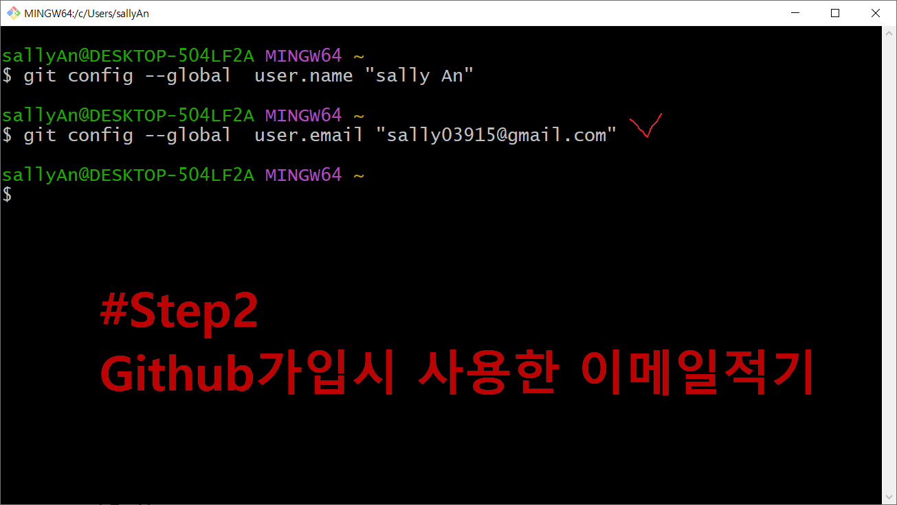

<!-- _class: cover-githubai -->
<h4 style="color:#6C757D;">
  <span style="color:#ff6e7f; text-shadow: 0 0 6px rgba(255,110,127,0.6); font-weight:bold;">🚀</span>
  CodeCraft Series · Track 01
</h4>  
<h1 style="color:#FF69B4;">GitHub + AI 활용</h1>  
<h3 style="color:#FFD700;">Repo · API · Prompt · Collaboration</h3>

<div class="chapter-highlight">
  📍 <strong>현재 위치:</strong> Chapter 1 · <em>GitHub 기본 명령어 배우기</em>
</div>

<blockquote>
  <span class="fragment" style="color:#343A40;">AI를 코드에 연결하고 GitHub로 협업하는 실전 기술</span><br>
  <span class="fragment" style="color:#495057;">개발자와 AI가 함께 만드는 스마트한 프로젝트 환경</span>
</blockquote>


---  
<!-- _class: cover-githubai --> 
<h2 style="font-size:1.6em; color:#555;">목차 : GitHub + AI 활용편 </h2>

<div class="track-outline">
  <span class="current-chapter">✅▶ Chapter 1: GitHub 기본 명령어 배우기</span>
  <span>▶ Chapter 2: 파일 올리고 내리기 (Push & Pull)</span>
  <span>▶ Chapter 3: Markdown 파일 만들기</span>
  <span>▶ Chapter 4: GitHub에서 협업하기</span>
  <span>▶ Chapter 5: Copilot에게 질문하며 개발하기</span>
</div>

<p style="margin-top:30px; font-size:0.95em; color:#888;">
  이 트랙은 개발자와 AI가 함께 협업하는 <br/> 미래형 개발 환경을 실습 중심으로 안내합니다.
</p>


---
<!-- _class: orange -->
# 🧩 Step 1: 핵심 개념
---

<!-- _class: aqua -->
## 🧠 개념 1: Git이란?

- **버전 관리 시스템**  
- 파일의 변경 이력을 기록하고 관리  
- 협업 시 충돌 방지 및 이력 추적 가능

---

<!-- _class: aqua -->
## 🧠 개념 2: Git과 GitHub의 차이

| 항목 | Git | GitHub |
|------|-----|--------|
| 저장 위치 | 로컬 (내 컴퓨터) | 클라우드 (웹 서버) |
| 사용 방식 | 명령어 기반 | 웹 UI + 명령어 |
| 연결성 | 오프라인 가능 | 온라인 중심 |
| 역할 | 버전 관리 도구 | 저장소 + 협업 플랫폼 |

---

<!-- _class: aqua -->
## 🧠 개념 3: GitHub이 뭐예요?

| | 항목 | 설명 |
|:--:|:--|:--|
| 🧠 | <span class="mark">GitHub</span> | 개발자들의 작업 공간 |
| 📦 | <span class="mark">저장 상자</span> | 컴퓨터 안의 나만의 저장 공간 |
| 🎨 | <span class="mark">코드나 자료</span> | 내가 만든 것을 담는 공간 |
| 🤝 | <span class="mark">협업</span> | 친구와 함께 사용하는 공유 공간 |

---

<!-- _class: aqua -->
## 🧠 개념 4: GitHub을 왜 써요?

| | 항목 | 설명 |
|:--:|:--|:--|
| 🛠️ | <span class="mark">기록</span> | 만든 것을 안전하게 저장 |
| 🌐 | <span class="mark">공유</span> | 다른 사람과 함께 발전 |
| 👥 | <span class="mark">협업</span> | 여러 사람이 함께 작업 가능 |

---

<!-- _class: aqua -->
## 🧠 개념 5: 기억하기 쉽게!

- <span class="mark">GitHub</span>은 코드를 저장하고 공유하는 공간  
- 협업을 위한 <span class="mark">버전 관리 도구</span>  
- 개발자들의 <span class="mark">작업 이력서 + 포트폴리오</span>


---

<!-- _class: blue -->
# 🧪 Step 2: 기본 명령어 따라하기


---

<!-- _class: aqua -->
## 기본 1: 우리 상자 만들기

```bash
git init
```
> "짜잔! 내 상자 생겼다!"

---

<!-- _class: aqua -->
## 기본 2: 그림 넣기

```bash
git add .
```

> "그림을 상자에 넣었어요!"

---

<!-- _class: aqua -->
## 기본 3:  저장하기


```bash
git commit -m "완성!"
```

> "이제 그림을 저장했어요!"


---

<!-- _class: green -->
# 🛠️ Step 3: 실습 과제

---
<!-- _class: aqua -->

## 🧪 실습 0-1: Git 설치 및 환경 설정  <br/> GitHub 회원가입 & 저장소 만들기

1. [GitHub 회원가입](https://github.com) 후 로그인  
2. 원격 저장소 생성  
   👉 `https://github.com/sally03915/git0.git`

---

<!-- _class: aqua -->
## 🧪 실습 0-2: Git 설치하기

1. [Git 공식 사이트](https://git-scm.com) 접속  
2. 운영체제에 맞는 설치 파일 다운로드  
3. 설치 후 터미널에서 아래 명령어로 확인:

```bash
git --version
```

> ✅ 버전이 출력되면 설치 완료!

---

<!-- _class: aqua -->
## 🧪 실습 0-3: 사용자 정보 설정

<pre class="codeblock">
git config --global user.name "sally An"
git config --global user.email "sally03915@gmail.com"
git config --list
</pre>

> GitHub 계정과 연결되는 사용자 정보 설정

---

<!-- _class: aqua -->
## 🧪 실습 0-3: 설정 결과 예시

<pre class="codeblock">
Administrator@User MINGW64 ~
$ git config --global user.name  "sally An"
$ git config --global user.email "sally03915@gmail.com"
$ git config --list
 
user.name=sally An
user.email=sally03915@gmail.com
core.autocrlf=true
credential.helper=manager
init.defaultbranch=master
</pre>

---

<!-- _class: aqua -->
## 🧪 실습 0-4: 폴더 만들고 VS Code로 열기

<pre class="codeblock">
C:\> mkdir git0
C:\> cd git0
C:\git0> code .
</pre>

> Visual Studio Code에서 프로젝트 폴더 열기  
> [Terminal] → [New Terminal] 클릭

---

<!-- _class: aqua -->
## 🧪 실습 0-5: 파일 만들고 Git 초기화

1. ***basic001.html*** 파일 생성  
2. Git 저장소 초기화

<pre class="codeblock">
git init
git add .
git status
git commit -m "first commit"
</pre>

> 변경사항을 기록하고 커밋까지 완료!

---

<!-- _class: aqua -->
## 🧪 실습 0-6: 원격 저장소 연결 및 푸시

<pre class="codeblock">
git remote add origin https://github.com/sally03915/git0.git
git remote -v
git push origin master
</pre>

> 로컬 저장소를 GitHub와 연결하고 업로드 완료!

---

<!-- _class: aqua -->
## 🧪 실습 0-7: GitHub에서 확인하기

- GitHub 웹사이트 접속  
- ***git0*** 저장소에 ***basic001.html*** 파일이 올라갔는지 확인

---

<!-- _class: red -->
## ⚠️ 실습 중 오류 해결 팁

403 오류 발생 시:

<pre class="codeblock">
remote: Permission denied to oldaccount
fatal: unable to access 'https://github.com/...': error: 403
</pre>


---

<!-- _class: red -->
## ⚠️ 실습 중 오류 해결 팁

403 오류 발생 시 해결 방법:

1. Windows 제어판 → 자격 증명 관리  
2. 일반 자격 증명 탭에서 기존 GitHub 토큰 삭제  
3. 새 사용자 정보 추가:

<pre class="codeblock">
git:https://github.com
사용자이름: sally03915
암호: GitHub 로그인 비밀번호
</pre>

---

<!-- _class: green -->
## ✅ 실습  요약

| 단계 | 설명 |
|------|------|
| GitHub 가입 | 저장소 생성 |
| Git 설치 | 버전 확인 |
| 사용자 설정 | 이름 & 이메일 등록 |
| 폴더 생성 | VS Code로 열기 |
| Git 명령어 | init → add → commit → push |
| 오류 해결 | 자격 증명 관리

> 이제 Git 환경이 완벽하게 준비됐어요! 🎉


---

<!-- _class: aqua -->
## 🧪 실습 ①: 나만의 상자 만들기

```bash
git init
```

> 컴퓨터에게 "내 프로젝트 시작할게!"라고 말하는 거예요


<pre class="codeblock">
$ git init
Initialized empty Git repository in /Users/sajang/project/.git/
</pre>

---

<!-- _class: aqua -->
## 🧪 실습 ②: 그림 넣기

```bash
git add .
```

> 그림을 상자에 넣는다고 상상해보세요!


<pre class="codeblock">
$ git add .
(파일들이 스테이지에 올라갑니다)
</pre>

---

<!-- _class: aqua -->
## 🧪 실습 ③: 이름 붙이기

```bash
git commit -m "그림 저장!"
```

> 그림에 이름을 붙여서 저장해요!


<pre class="codeblock">
$ git commit -m "그림 저장!"
[main (root-commit) abc123] 그림 저장!
 3 files changed, 120 insertions(+)
</pre>

---

<!-- _class: aqua -->
## ✅ 실습 요약

| 단계 | 명령어 | 의미 |
|------|--------|------|
| ①   | <span class="mark">git init </span> | 상자 만들기 |
| ②   | <span class="mark">git add . </span> | 그림 넣기 |
| ③   | <span class="mark">git commit -m "..."</span> | 이름 붙이기 |

> 이제 여러분만의 상자가 완성됐어요! 🎉


---
## ① github 회원가입 & 로그인  

---
<!-- _class: ex -->
## ① github 회원가입 & 로그인 (1/7)


---
<!-- _class: ex -->
## ② github 회원가입 & 로그인 (2/7)


---
<!-- _class: ex -->
## ③ github 회원가입 & 로그인 (3/7)


---
<!-- _class: ex -->
## ④ github 회원가입 & 로그인 (4/7)


---
<!-- _class: ex -->
## ⑤ github 회원가입 & 로그인 (5/7)


---
<!-- _class: ex -->
## ⑥ github 회원가입 & 로그인 (6/7)


---
<!-- _class: ex -->
## ⑦ github 회원가입 & 로그인 (7/7)


---
## ② github 저장소 
---
<!-- _class: ex -->
## ② github 저장소 (1/5)


---
<!-- _class: ex -->
## ② github 저장소 (2/5)


---
<!-- _class: ex -->
## ② github 저장소 (3/5)


---
<!-- _class: ex -->
## ② github 저장소 (4/5)


---
<!-- _class: ex -->
## ② github 저장소 (5/5)


---
## ③ git 다운로드 및 설치
 ---
<!-- _class: ex -->
## ③ git 다운로드 및 설치 (1/7)


---
<!-- _class: ex -->
## ③ git 다운로드 및 설치 (2/7)


---
<!-- _class: ex -->
## ③ git 다운로드 및 설치 (3/7)


---
<!-- _class: ex -->
## ③ git 다운로드 및 설치 (4/7)


---
<!-- _class: ex -->
## ③ git 다운로드 및 설치 (5/7)


---
<!-- _class: ex -->
## ③ git 다운로드 및 설치 (6/7)


---
<!-- _class: ex -->
## ③ git 다운로드 및 설치 (7/7)


---
## ④ git 로컬저장소저장 후 외부저장소 업로드
---
<!-- _class: ex -->
### ④ git 로컬저장소저장 후 외부저장소 업로드 (1/16)


---
<!-- _class: ex -->
### ④ git 로컬저장소저장 후 외부저장소 업로드 (2/16)


---
<!-- _class: ex -->
### ④ git 로컬저장소저장 후 외부저장소 업로드 (3/16)


---
<!-- _class: ex -->
### ④ git 로컬저장소저장 후 외부저장소 업로드 (4/16)


---
<!-- _class: ex -->
### ④ git 로컬저장소저장 후 외부저장소 업로드 (5/16)


---
<!-- _class: ex -->
### ④ git 로컬저장소저장 후 외부저장소 업로드 (6/16)


---
<!-- _class: ex -->
### ④ git 로컬저장소저장 후 외부저장소 업로드 (7/16)


---
<!-- _class: ex -->
### ④ git 로컬저장소저장 후 외부저장소 업로드 (8/16)


---
<!-- _class: ex -->
### ④ git 로컬저장소저장 후 외부저장소 업로드 (9/16)


---
<!-- _class: ex -->
### ④ git 로컬저장소저장 후 외부저장소 업로드 (10/16)


---
<!-- _class: ex -->
### ④ git 로컬저장소저장 후 외부저장소 업로드 (11/16)


---
<!-- _class: ex -->
### ④ git 로컬저장소저장 후 외부저장소 업로드 (12/16)


---
<!-- _class: ex -->
### ④ git 로컬저장소저장 후 외부저장소 업로드 (13/16)


---
<!-- _class: ex -->
### ④ git 로컬저장소저장 후 외부저장소 업로드 (14/16)


---
<!-- _class: ex -->
### ④ git 로컬저장소저장 후 외부저장소 업로드 (15/16)


---
<!-- _class: ex -->
### ④ git 로컬저장소저장 후 외부저장소 업로드 (16/16)


---
## ⑤ git 파일수정후 다시 올리기

---
<!-- _class: ex -->
## ⑤ git 파일수정후 다시 올리기
 

---
<!-- _class: ex -->
## ⑤ git 파일수정후 다시 올리기
 

---
<!-- _class: ex -->
## ⑤ git 파일수정후 다시 올리기
 


---

<!-- _class: purple -->
# 💡 Step 4: 사고 확장
> 이제 우리가 배운 내용을 조금 더 생각해볼까요?


---

<!-- _class: aqua -->
## ❓ 궁금한 이야기 ①:   왜 상자를 만들까요?


- <span class="fragment">친구랑 같이 놀려고요</span>
- <span class="fragment">그림을 잃어버리지 않으려고요 </span>
- <span class="fragment">나중에 다시 꺼내보려고요</span>

---

<!-- _class: aqua -->
## ❓ 궁금한 이야기 ②: 저장 안 하면?

- <span class="fragment">그림이 사라져요 😢  </span>
- <span class="fragment">다시 그려야 해요 😮  </span>
> 그래서 저장이 중요해요!
> ✅ 저장은 우리의 그림을 지켜주는 안전벨트예요!


---
<!-- _class: red -->
# 🧠 Step 5: 기억 테스트

> 지금까지 배운 내용을 퀴즈로 확인해볼까요?

---

<!-- _class: aqua -->
## ❓ 퀴즈 1: ***git init***은 뭐예요?

- A. **상자 만들기** ✅  
- B. 그림 지우기  
- C. 이름 바꾸기

---

<!-- _class: aqua -->
## ❓ 퀴즈 2: ***git commit***은 뭐예요?

- A. **저장하고 이름 붙이기** ✅  
- B. 상자 흔들기  
- C. 그림 숨기기

---
 
<!-- _class: aqua -->
## 🎯 오늘 배운 것 요약

<br>

- <span class="mark">git init</span>   → **상자 만들기** (내 프로젝트 시작)

- <span class="mark">git add . </span>   
→ **그림 넣기** (변경된 파일 담기)

- <span class="mark">git commit -m "..." </span>  
 → **이름 붙이기** (작업 기록 남기기)

> 저장은 그림을 지켜주는 **안전벨트**예요!


---

<!-- _class: aqua -->
## 🎈 다음 시간 예고

> 오늘은 **코딩 상자 놀이**를 배웠어요  
> 다음엔 **상자에 그림을 올리고 내리는 법**도 배워요!

---

<!-- _class: thanks -->
## 👋 열심히 들어주셔서 감사합니다!

> <span class="fragment">오늘의 한 걸음이 **내일의 가능성**이 되길 바라며,</span>  
> <span class="fragment">그럼, 다음 이시간에 또 만나요!</span>
