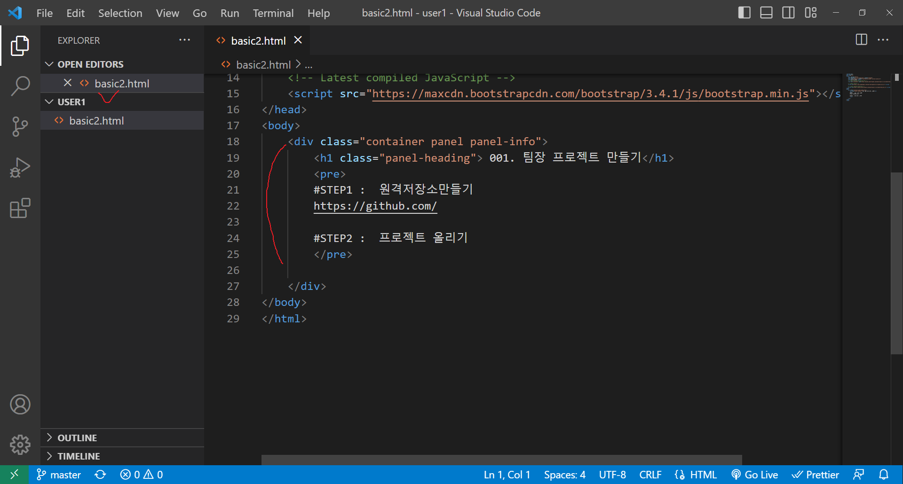
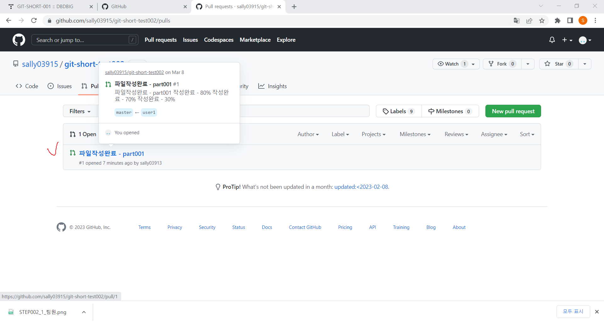

<!-- _class: cover-githubai -->
<h4 style="color:#6C757D;">
  <span style="color:#ff6e7f; text-shadow: 0 0 6px rgba(255,110,127,0.6); font-weight:bold;">🚀</span>
  CodeCraft Series · Track 01
</h4>  
<h1 style="color:#FF69B4;">GitHub + AI 활용</h1>  
<h3 style="color:#FFD700;">Repo · API · Prompt · Collaboration</h3>

<div class="chapter-highlight">
  📍 <strong>현재 위치:</strong> Chapter 4 · <em>GitHub에서 협업하기</em>
</div>

<blockquote>
  <span class="fragment" style="color:#343A40;">함께 코드를 만들고, 리뷰하고, 공유하는 협업 기술</span><br>
  <span class="fragment" style="color:#495057;">GitHub의 Fork, Branch, Pull Request로 팀워크를 완성해요</span>
</blockquote>

---

<!-- _class: cover-githubai --> 
<h2 style="font-size:1.6em; color:#555;">목차 : GitHub + AI 활용편 </h2>

<div class="track-outline">
  <span>▶ Chapter 1: GitHub 기본 명령어 배우기</span>
  <span>▶ Chapter 2: 파일 올리고 내리기 (Push & Pull)</span>
  <span>▶ Chapter 3: Markdown 파일 만들기</span>
  <span class="current-chapter">✅▶ Chapter 4: GitHub에서 협업하기</span>
  <span>▶ Chapter 5: Copilot에게 질문하며 개발하기</span>
</div>

<p style="margin-top:30px; font-size:0.95em; color:#888;">
  이 트랙은 개발자와 AI가 함께 협업하는 <br/> 미래형 개발 환경을 실습 중심으로 안내합니다.
</p>


---
<!-- _class: orange -->
# 🧩 Step 1: 핵심 개념
---

<!-- _class: aqua -->
## 🧠 개념 1: 협업이란?

- **함께 작업하는 것**  
- 서로의 아이디어를 나누고 발전시키기  
- 역할을 나누고 함께 완성하기

---

<!-- _class: aqua -->
## 🧠 개념 2: GitHub에서 협업하는 방법

|  |  |
|------|------|
| Fork | 다른 사람의 저장소를 복사해서 내 공간에 담기 |
| Branch | 원본을 건드리지 않고 새 작업 공간 만들기 |
| Pull Request | 수정한 내용을 원래 저장소에 제안하기 |
| Review | 서로의 코드를 확인하고 의견 나누기 |
| Merge | 수정된 내용을 저장소에 합치기

---

<!-- _class: aqua -->
## 🧠 개념 3: Fork와 Branch의 차이

| 항목 | Fork | Branch |
|------|------|--------|
| 위치 | 내 GitHub 계정 | 원래 저장소 안 |
| 목적 | 독립적인 복사본 만들기 | 기능별 작업 공간 만들기 |
| 협업 방식 | 외부 기여자용 | 팀 내부 협업용 |

---

<!-- _class: aqua -->
## 🧠 개념 4: Pull Request란?

| |  |  |
|:--:|:--|:--|
| 📬 | <span class="mark">요청</span> | 내가 수정한 내용을 반영해달라고 제안 |
| 🧐 | <span class="mark">검토</span> | 팀원이 코드를 확인하고 의견 남김 |
| ✅ | <span class="mark">병합</span> | 수정된 내용을 저장소에 합치기

---

<!-- _class: aqua -->
## 🧠 개념 5: 기억하기 쉽게!

- <span class="mark">Fork</span>는 친구의 상자를 복사하는 것  
- <span class="mark">Branch</span>는 내 상자 안에 새 공간을 만드는 것  
- <span class="mark">Pull Request</span>는 “이거 어때요?” 하고 제안하는 것  
- <span class="mark">Review</span>는 서로 도와주는 대화  
- <span class="mark">Merge</span>는 함께 만든 걸 하나로 합치는 마법!


---

<!-- _class: blue -->
# 🧪 Step 2: 기본 명령어 따라하기 <br/>
`fullstack_250825`


---
<!-- _class: aqua -->
## 기본 1: 우리 상자 만들기
```bash
git init
```
> "짜잔! 내 상자 생겼다!"


---
<!-- _class: aqua -->
## 기본 2: 그림 넣기

```bash
git add .
```
> "그림을 상자에 넣었어요!"

---

<!-- _class: aqua -->
## 기본 3: 저장하기


<pre class="codeblock">
git commit -m "완성!"
</pre>
> "이제 그림을 저장했어요!"

---

<!-- _class: aqua -->
## 기본 4: 친구 상자 복사하기 (<mark>Fork 후 클론</mark>)

<pre class="codeblock">
git clone https://github.com/친구아이디/저장소이름.git
</pre>

> "친구 상자를 내 방으로 가져왔어요!"

---

<!-- _class: aqua -->
## 기본 5: 새 작업 공간 만들기

<pre class="codeblock">
git checkout -b 새로운브랜치이름
</pre>
> "내 상자 안에 새 공간을 만들었어요!"

---

<!-- _class: aqua -->
## 기본 6: 친구에게 제안하기 (PR 전 푸시)

<pre class="codeblock">
git push origin 새로운브랜치이름
</pre>
> "내 그림을 친구에게 보여줄 준비 완료!"


---
<!-- _class: green -->
# 🛠️ Step 3: 협업 기능 실습 (1) <br/>
> `Fork → Clone`  
> `Branch → Commit → Push → PR → Merge`

---
<!-- _class: green -->
## ✅ 협업 실습 요약

| 단계 | 설명 |
|------|------|
| ① Fork | 친구 저장소 복사 |
| ② Clone | 내 컴퓨터로 가져오기 |
| ③ Branch | 새 작업 공간 만들기 |
| ④ Commit | 수정 내용 저장 |
| ⑤ Push | GitHub에 올리기 |
| ⑥ Pull Request | 친구에게 제안 |
| ⑦ Merge | 함께 만든 결과 합치기 |


---

<!-- _class: aqua -->
## 🧪 실습 1: 친구 저장소 복사하기 (Fork)

1. GitHub에서 친구의 저장소로 이동  
2. 오른쪽 상단의 **Fork** 버튼 클릭  
3. 내 GitHub 계정으로 복사 완료!

> 친구의 상자를 내 방으로 가져온 거예요 🎁

---

<!-- _class: aqua -->
## 🧪 실습 2: 내 컴퓨터로 가져오기 (Clone)

<pre class="codeblock">
git clone https://github.com/내아이디/복사된저장소.git
cd 복사된저장소
</pre>

> 내 컴퓨터에 친구의 상자를 복사했어요 🧳

---

<!-- _class: aqua -->
## 🧪 실습 3: 새 작업 공간 만들기 (Branch)

<pre class="codeblock">
git checkout -b feature-hello
</pre>

> 원본은 그대로 두고, 새 그림을 그릴 공간을 만든 거예요 🎨

---

<!-- _class: aqua -->
## 🧪 실습 4: 파일 수정하고 저장하기

1. ***basic001.html*** 파일에 내용 추가  
2. 아래 명령어로 저장

<pre class="codeblock">
git add .
git commit -m "인삿말 추가"
</pre>

> 내가 만든 그림을 저장했어요 🖼️

---

<!-- _class: aqua -->
## 🧪 실습 5: GitHub에 올리기

<pre class="codeblock">
git push origin feature-hello
</pre>

> 내 그림을 GitHub에 올려서 친구에게 보여줄 준비 완료! 🚀

---
<!-- _class: yellow -->
## 🧩 중간 점검: 여기까지 잘 따라왔나요?

- ✅ Fork 완료
- ✅ Clone 완료
- ✅ Branch 생성
- ✅ 파일 수정 및 Commit

> 다음은 Push와 Pull Request입니다. <br/> 조금만 더 힘내요! 💪


---

<!-- _class: aqua -->
## 🧪 실습 6: Pull Request 보내기

1. GitHub 저장소 접속  
2. "Compare & pull request" 버튼 클릭  
3. 설명 작성 후 "Create pull request" 클릭

> 친구에게 “이거 어때요?” 하고 제안하는 거예요 💌

---

<!-- _class: aqua -->
## 🧪 실습 7: 코드 리뷰 & 병합하기

1. 친구가 코드를 확인하고 승인  
2. "Merge pull request" 클릭  
3. "Confirm merge"로 병합 완료

> 함께 만든 그림을 하나로 합쳤어요! 🤝

> 이제 진짜 협업이 시작됐어요! <br/>여러분은 개발자 팀의 일원이 된 거예요 🎉

---
<!-- _class: aqua -->
## ✅ 협업 실습 요약

| 단계 | 설명 |
|------|------|
| ① Fork | 친구 저장소 복사 |
| ② Clone | 내 컴퓨터로 가져오기 |
| ③ Branch | 새 작업 공간 만들기 |
| ④ Commit | 수정 내용 저장 |
| ⑤ Push | GitHub에 올리기 |
| ⑥ Pull Request | 친구에게 제안 |
| ⑦ Merge | 함께 만든 결과 합치기


---
<!-- _class: green -->
# 🛠️ Step 3 (2): 역할 기반 협업
> `조장 → 팀원 → PR → 리뷰 → 병합 → 동기화`

---

<!-- _class: aqua -->
## 🔧 실습 1: 조장 역할

1. GitHub 저장소 생성  
2. ***basic.html*** 파일 업로드  
3. 팀원 초대 (Settings → Collaborators)

<pre class="codeblock">
git init
git remote add origin https://github.com/조장이름/저장소명.git
git push origin master
</pre>

> 팀의 작업 공간을 만드는 첫 단계예요 🏗️

---

<!-- _class: aqua -->
## 🔧 실습 2: 팀원 역할 - 저장소 복제

1. 저장소 클론  
2. 폴더 이름 지정 가능

<pre class="codeblock">
git clone https://github.com/조장이름/저장소명.git user1
cd user1
code 
</pre>

> 조장이 만든 상자를 내 컴퓨터로 가져왔어요 📦

---

<!-- _class: aqua -->
## 🔧 실습 3: 팀원 역할-브랜치 생성 및 파일 작성

1. 브랜치 생성  
2. 파일 작성 및 커밋  
3. 브랜치에 푸시


<pre class="codeblock">
git checkout -b user1
git add .
git commit -m "first commit user1"
git push origin user1
</pre>


> 주의! <mark>***master***</mark>에 직접 푸시하면 안 돼요 🚫

---

<!-- _class: aqua -->
## 🔧 실습 4: 팀원 역할 - Pull Request 요청

1. GitHub 저장소 접속  
2. [Compare & pull request] 클릭  
3. 제목과 메시지 작성 후 [Create pull request]

> 조장에게 “이거 어때요?” 하고 제안하는 단계예요 💌

---


<!-- _class: aqua -->
## 🔧 실습 5: 조장 역할 - 코드 리뷰 및 병합

1. PR 확인  
2. 코드 검토 및 리뷰 남기기 (Review changes)  
3. [Merge pull request] → [Confirm merge]

> 팀원이 만든 코드를 프로젝트에 반영하는 과정이에요 🤝

---

<!-- _class: aqua -->
## 🔧 실습 6: 조장 역할 - 마스터 코드 동기화

1. 로컬 코드 저장  
2. 원격 저장소에서 최신 코드 가져오기  
3. 수정 후 다시 푸시

<pre class="codeblock">
git add .
git commit -m "second commit pull-before"
git pull origin master
git push origin master
</pre>

> 팀 전체의 최신 코드를 반영하는 마무리 단계입니다 🔄

---

<!-- _class: green -->
## ✅ 협업 실습 전체 요약

|  |  |
|------|--------|
| 조장 | 저장소 생성, 팀원 초대, <br/>PR 리뷰 및 병합, 동기화 |
| 팀원 | 저장소 클론, 브랜치 생성, <br/>파일 작성, PR 요청 |


> 협업은 역할을 나누고 함께 완성하는 퍼즐 맞추기예요 🧩


---
## ① 조장
- 저장소 생성 

---
<!-- _class: ex -->
## ① 조장 - 저장소 생성 (1/17)  


---
<!-- _class: ex -->
## ① 조장 - 저장소 생성 (2/17)  


---
<!-- _class: ex -->
## ① 조장 - 저장소 생성 (3/17)  


---
<!-- _class: ex -->
## ① 조장 - 저장소 생성 (4/17)  


---
<!-- _class: ex -->
## ① 조장 - 저장소 생성 (5/17)  


---
<!-- _class: ex -->
## ① 조장 - 저장소 생성 (6/17)  


---
<!-- _class: ex -->
## ① 조장 - 저장소 생성 (7/17)  


---
<!-- _class: ex -->
## ① 조장 - 저장소 생성 (8/17)  


---
<!-- _class: ex -->
## ① 조장 - 저장소 생성 (9/17)  


---
<!-- _class: ex -->
## ① 조장 - 저장소 생성 (10/17)  


---
<!-- _class: ex -->
## ① 조장 - 저장소 생성 (11/17)  


---
<!-- _class: ex -->
## ① 조장 - 저장소 생성 (12/17)  


---
<!-- _class: ex -->
## ① 조장 - 저장소 생성 (13/17)  


---
<!-- _class: ex -->
## ① 조장 - 저장소 생성 (14/17)  


---
<!-- _class: ex -->
## ① 조장 - 저장소 생성 (15/17)  


---
<!-- _class: ex -->
## ① 조장 - 저장소 생성 (16/17)  


---
<!-- _class: ex -->
## ① 조장 - 저장소 생성 (17/17)  


---
## ② 팀원
- 팀장이 팀원초대
- 저장소 클론

---
<!-- _class: ex -->
## ① 팀원 저장소 클론 (1/17)  


---
<!-- _class: ex -->
## ① 팀원 저장소 클론 (2/17)  


---
<!-- _class: ex -->
## ① 팀원 저장소 클론 (3/17)  


---
<!-- _class: ex -->
## ① 팀원 저장소 클론 (4/17)  


---
<!-- _class: ex -->
## ① 팀원 저장소 클론 (5/17)  


---
<!-- _class: ex -->
## ① 팀원 저장소 클론 (6/17)  


---
<!-- _class: ex -->
## ① 팀원 저장소 클론 (7/17)  


---
<!-- _class: ex -->
## ① 팀원 저장소 클론 (8/17)  


---
<!-- _class: ex -->
## ① 팀원 저장소 클론 (9/17)  


---
<!-- _class: ex -->
## ① 팀원 저장소 클론 (10/17)  


---
<!-- _class: ex -->
## ① 팀원 저장소 클론 (11/17)  


---
<!-- _class: ex -->
## ① 팀원 저장소 클론 (12/17)  


---
<!-- _class: ex -->
## ① 팀원 저장소 클론 (13/17)  


---
<!-- _class: ex -->
## ① 팀원 저장소 클론 (14/17)  


---
<!-- _class: ex -->
## ① 팀원 저장소 클론 (15/17)  


---
<!-- _class: ex -->
## ① 팀원 저장소 클론 (16/17)  


---
<!-- _class: ex -->
## ① 팀원 저장소 클론 (17/17)  


---
## ③ 코드 확인 및 병합
---
<!-- _class: ex -->
## ③ 코드 확인 및 병합 (1/10)


---
<!-- _class: ex -->
## ③ 코드 확인 및 병합 (2/10)


---
<!-- _class: ex -->
## ③ 코드 확인 및 병합 (3/10)


---
<!-- _class: ex -->
## ③ 코드 확인 및 병합 (4/10)


---
<!-- _class: ex -->
## ③ 코드 확인 및 병합 (5/10)


---
<!-- _class: ex -->
## ③ 코드 확인 및 병합 (6/10)


---
<!-- _class: ex -->
## ③ 코드 확인 및 병합 (7/10)


---
<!-- _class: ex -->
## ③ 코드 확인 및 병합 (8/10)


---
<!-- _class: ex -->
## ③ 코드 확인 및 병합 (9/10)


---
<!-- _class: ex -->
## ③ 코드 확인 및 병합 (10/10)


---
## ④ 충돌수정

---
<!-- _class: ex -->
##  ④ 충돌수정 (1/7)

 
---
<!-- _class: ex -->
## ④ 충돌수정 (2/7)


---
<!-- _class: ex -->
## ④ 충돌수정 (3/7)


---
<!-- _class: ex -->
## ④ 충돌수정 (4/7)


---
<!-- _class: ex -->
## ④ 충돌수정 (5/7)


---
<!-- _class: ex -->
## ④ 충돌수정 (6/7)


---
<!-- _class: ex -->
## ④ 충돌수정 (7/7)


---

<!-- _class: purple -->
# 💡 Step 4: 사고 확장
> 협업은 퍼즐을 맞추는 과정이에요!


---

<!-- _class: purple -->
# 💡 Step 4: 사고 확장

- 각자의 조각이 모여 하나의 그림을 완성해요  
- 혼자서는 볼 수 없는 관점을 서로 나눠요  
- 실수도 함께 고치고, 더 나은 결과를 만들어가요


---

<!-- _class: aqua -->
## ❓ 궁금한 이야기 ①: 왜 친구 상자를 복사할까요?

- <span class="fragment">친구가 만든 걸 보고 배우려고요</span>
- <span class="fragment">내 방식대로 바꿔보려고요</span>
- <span class="fragment">같이 더 멋진 걸 만들려고요</span>

---

<!-- _class: aqua -->
## ❓ 궁금한 이야기 ②: 왜 Pull Request 할까요?

- <span class="fragment">내가 만든 걸 친구에게 보여주려고요</span>
- <span class="fragment">친구가 확인하고 도와줄 수 있어요</span>
- <span class="fragment">함께 만든 걸 하나로 합치려고요</span>

> ✅ 협업은 서로의 그림을 이어붙이는 퍼즐이에요!


---

<!-- _class: aqua -->
## ❓ 궁금한 이야기 ③: 이메일 초대받았는데 <br/> Fork 꼭 해야 하나요?

- <span class="fragment">초대받으면 저장소에 직접 접근할 수 있어요</span>  
- <span class="fragment">권한이 있으면 Fork 없이 바로 작업 가능해요</span>  
- <span class="fragment">권한이 없거나 실험하고 싶다면 Fork이 유용해요</span>

> ✅ 초대는 문을 여는 열쇠, <br/>Fork는 나만의 작업 공간이에요! 🗝️🏗️


---

<!-- _class: red -->
# 🔍 협업에서 자주 생기는 오해

| 오해 | 실제 |
|------|------|
| "내가 다 해야 해" | 역할을 나누고 함께 해결 |
| "내 코드가 최고야" | 리뷰를 통해 더 나은 코드로 발전 |
| "PR은 귀찮아" | PR은 소통의 시작이에요 |

> 협업은 기술이 아니라 **태도**입니다.

---

<!-- _class: aqua -->
# 🧠 협업의 기술 vs 협업의 마음

- 기술: Fork, Branch, PR, Merge  
- 마음: 존중, 경청, 피드백, 책임

> 기술은 배우면 되지만, 마음은 연습해야 해요


---

<!-- _class: red -->
# 🧠 Step 5: 기억 테스트

> 지금까지 배운 협업 기능을 퀴즈로 확인해볼까요?

---

<!-- _class: aqua -->
## ❓ 퀴즈 1: ***Fork***는 뭐예요?

- A. 친구 저장소를 내 GitHub로 복사 ✅  
- B. 그림을 삭제  
- C. 저장소를 잠그기

---

<!-- _class: aqua -->
## ❓ 퀴즈 2: ***Branch***는 뭐예요?

- A. 저장소를 나누는 기능 ✅  
- B. 그림을 숨기는 기능  
- C. 저장소를 닫는 기능

---

<!-- _class: aqua -->
## ❓ 퀴즈 3: ***Pull Request***는 뭐예요?

- A. 친구에게 수정한 내용을 제안 ✅  
- B. 저장소를 초기화  
- C. 그림을 지우는 명령

---

<!-- _class: green -->
## 🎯 오늘 배운 것 요약

| 핵심 개념 | 기억하기 |
|-----------|----------|
| Fork | 친구 상자 복사 |
| Branch | 내 상자 안 새 공간 |
| Pull Request | “이거 어때요?” 제안 |
| Review | 서로 도와주는 대화 |
| Merge | 함께 만든 결과 합치기 |

> 협업은 혼자보다 더 멀리, 더 멋지게 가는 방법이에요! 🚀

---

<!-- _class: blue -->
## 🎈 다음 시간 예고
 
>  **Chatgpt, Copilot**과 함께  
> 코드를 자동 완성하고 리뷰도 받아보는  
> AI 협업 실습을 진행해요! 🤖✨

---

<!-- _class: thanks -->
## 👋 열심히 들어주셔서 감사합니다!

<h3 style="color:#FFD700;">GitHub 협업의 첫걸음을 함께 했어요</h3>

> <span class="fragment">오늘의 협업 연습이 **내일의 팀워크**로 이어지길 바라며,</span>  
> <span class="fragment">그럼, 다음 시간에 또 만나요!</span>
