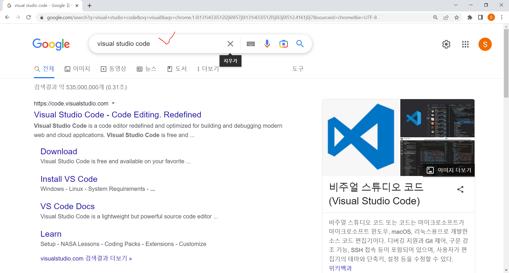
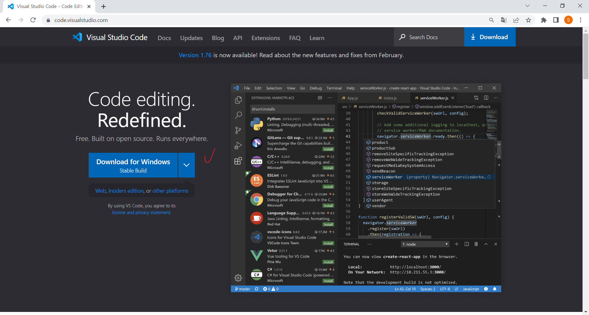
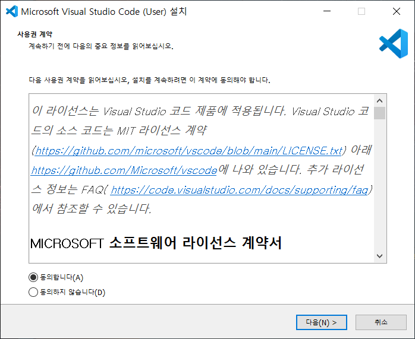
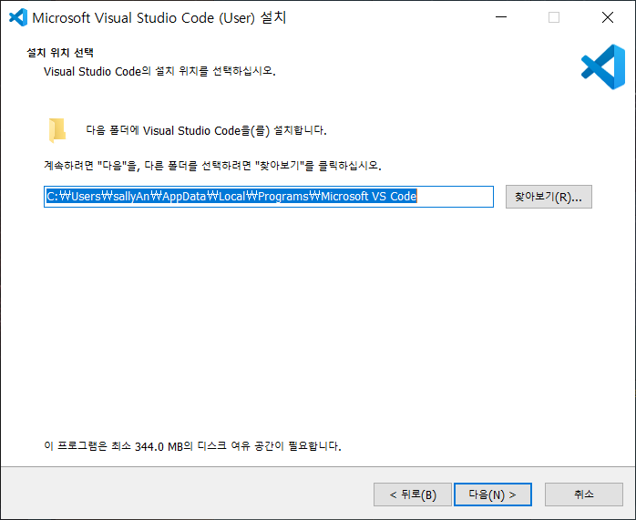
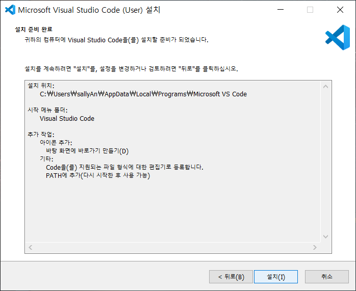
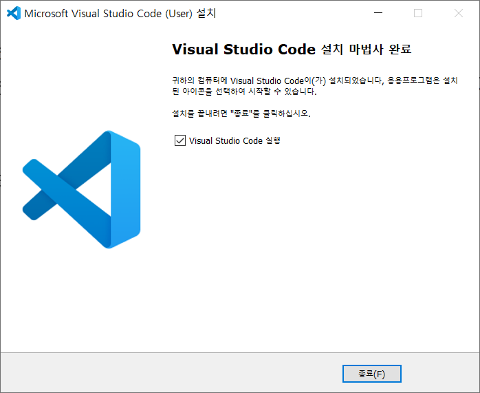
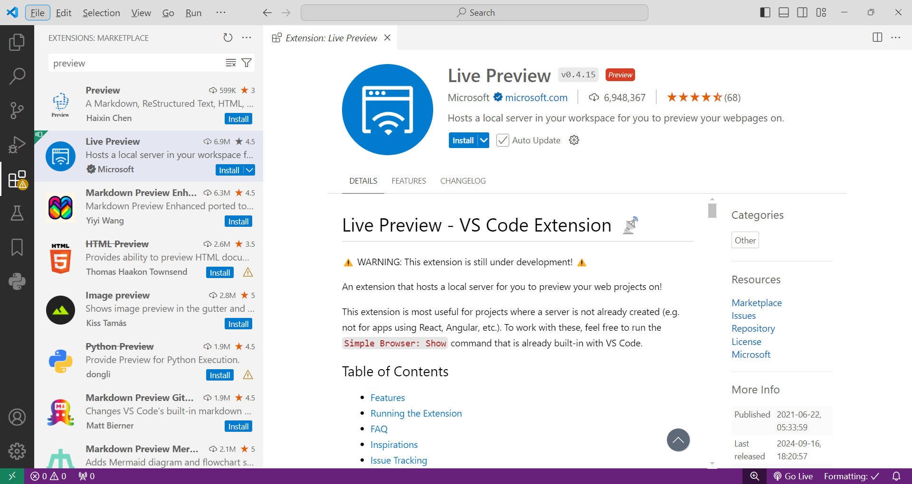
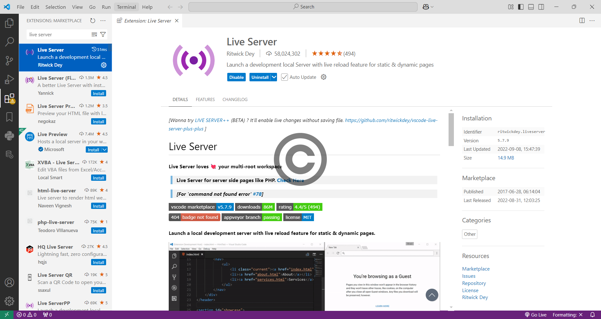
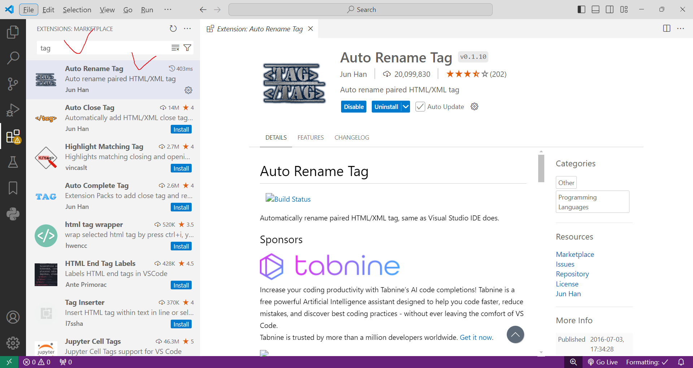

<!-- _class: cover-html -->
<h4 style="color:#6C757D;">
  🚀
  CodeCraft Series · Track 02
</h4>  
<h1 style="color:#007BFF;">Web Essentials</h1>  
<h3 style="color:#17A2B8;">HTML · CSS · JavaScript · jQuery · Bootstrap</h3>

<!-- 현재 챕터 강조 -->

  📍 <strong>현재 위치:</strong> Chapter 1 · <em>웹 개발 시작과 HTML 구조</em>

<blockquote>
  디자인과 인터랙션의 경계를 넘나드는 기술 
  기초부터 프레임워크까지, 웹의 모든 것을 담다
</blockquote>

---
<!-- _class: cover-html -->
<h2 style="font-size:1.6em; color:#555 ; ">목차 : Web Essentials 트랙</h2>

  ✅▶ Chapter 1: 웹 개발 시작과 HTML 구조
  ▶ Chapter 2: HTML 태그 · id/class · 레이아웃
  ▶ Chapter 3: Bootstrap
  ▶ Chapter 4: JavaScript 문법 · 이벤트 · 배열
  ▶ Chapter 5: jQuery와 프레임워크 활용

  이 트랙은 웹 개발의 핵심 기술을   실습 중심으로 배우며, 프론트엔드의 기초를 다집니다.

---
<!-- _class: orange -->
# 🧩 Step 1: 핵심 개념

---
<!-- _class: aqua -->
## 🧪 개념 1: 웹 개발의 기본 흐름

- 웹 ê°œë°œì€ 구조 → 스타일 → 동작 → 서버 흐름으로 구성  
- HTML은 구조, CSS는 꾸밈, JS는 동작  
- VS Code 설치부터 프로젝트 생성까지 실습 중심

---

<!-- _class: aqua -->
## 🧪 개념 2: 웹 작업 순서

| 순서 | 작업내용 |
|------|----------|
| HTML | 구조 (예: 회원가입 폼) |
| CSS | 꾸미기 (예: 폼 스타일링) |
| JS / jQuery / React | 동작 (예: 유효성 검사) |
| PHP / JSP + DB | 서버 전송 + 데이터 저장 |

> 웹은 구조 → 스타일 → 동작 → 서버 흐름으로 구성됩니다

---

<!-- _class: aqua -->
## 🧪 개념 3: HTML5 기본 구조

- ! + Enter로 HTML 기본 구조 자동완성  
- &lt;!DOCTYPE html&gt;: HTML5 문서 선언  
- &lt;html lang="ko"&gt;: 문서 루트, 언어 설정  
- &lt;head&gt;: 문서 정보 (메타데이터, 제목, 스타일 등)  
- &lt;body&gt;: 사용자에게 보여지는 콘텐츠 영역

---

<!-- _class: blue -->
# 🧪 Step 2: 코드 예제

---
<!-- _class: aqua -->
<pre class="codeblock">
<!DOCTYPE html>
<html lang="ko">
<head>
  <meta charset="utf-8">
  <meta name="viewport" content="width=device-width, initial-scale=1.0">
  <title>Document</title>
</head>
<body>

</body>
</html>
</pre>

> 이 구조는 HTML 문서의 기본 틀입니다  
> VS Code에서 ! + Enter로 자동완성 가능

---

<!-- _class: green -->
# 🛠️ Step 3: 실습 과제

--- 
## 🧪 실습 1:  VS Code 설치 과정

---
<!-- _class: aqua -->
## 🧪 설치 Step 1

---
<!-- _class: aqua -->
## 🧪 설치 Step 2

---
<!-- _class: aqua -->
## 🧪 설치 Step 3

---
<!-- _class: aqua -->
## 🧪 설치 Step 4

---
<!-- _class: aqua -->
## 🧪 설치 Step 5

---
<!-- _class: aqua -->
## 🧪 설치 Step 6

---
<!-- _class: aqua -->
## 🧪 설치 Step 7

---
<!-- _class: aqua -->
## 🧪 확장플러그인 1

---
<!-- _class: aqua -->
## 🧪 확장플러그인 2

---
<!-- _class: aqua -->
## 🧪 확장플러그인 3

---
## 🧪 실습 2: web001.html 만들기

- VS Code에서 프로젝트 생성  
- HTML 파일 만들고 기본 구조 작성  
- 파일명은 반드시 .html 확장자 사용  

---
<!-- _class: aqua -->
<pre class="codeblock">
<!DOCTYPE html>
<html lang="ko">
<head>
  <meta charset="utf-8">
  <meta name="viewport" content="width=device-width, initial-scale=1.0">
  <title>Document</title>
</head>
<body>

</body>
</html>
</pre>

> 기본 HTML 문서를 직접 작성해보세요

---
<!-- _class: purple -->
# 💡 Step 4: 사고 확장
> 이제 우리가 배운 내용을 조금 더 생각해볼까요?

---
<!-- _class: aqua -->
## ❓ 궁금한 이야기 ①:  HTML은 시맨틱 구조를 강조할까?
- 태그는 단순한 표시가 아니라 ì˜ë¯¸ë¥¼ 담는다  
- 예: &lt;header&gt;, &lt;section&gt;, &lt;footer&gt; 등은 역할이 명확함

---

<!-- _class: aqua -->
## ❓ 궁금한 이야기 ②:  HTML의 역할?
- 정보를 표현하기 위한 마크업 언어  
- 브라우저가 해석할 수 있는 구조 제공

---
<!-- _class: aqua -->
## ❓ 궁금한 이야기 ③:  &lt;head&gt;와 &lt;body&gt;의 차이

- &lt;head&gt;: 문서 정보  
- &lt;body&gt;: 사용자에게 보이는 내용

---

<!-- _class: red -->
# 🧪 Step 5: 기억 테스트

---

<!-- _class: aqua -->
## ❓ 퀴즈 1: HTML은 어떤 역할을 하나요?

- A. 동작을 처리한다  
- B. 구조를 정의한다 ✅  
- C. 스타일을 적용한다

 
---

<!-- _class: aqua -->
## ❓ 퀴즈 2: HTML 문서의 시작과 끝을 나타내는 태그는?

- A. **<body>**  
- B. **<head>**  
- C. **<html>** ✅

---
<!-- _class: thanks -->
## 👋  열심히 들어주셔서 감사합니다!

> 오늘의 한 걸음이 **내일의 가능성**이 되길 바라며,  
> 그럼, 다음 이시간에 또 만나요!
