<!-- _class: cover-html -->
<h4 style="color:#6C757D;">
  🚀
  CodeCraft Series · Track 02
</h4>  
<h1 style="color:#007BFF;">Web Essentials</h1>  
<h3 style="color:#17A2B8;">HTML · CSS · JavaScript · jQuery · Bootstrap</h3>

<!-- 현재 챕터 강조 -->

  📍 <strong>현재 위치:</strong> Chapter 3 · <em>Bootstrap · 반응형 디자인 · 컴포넌트 활용</em>

<blockquote>
  Bootstrap을 활용한 빠른 UI 구성 능력 
  반응형 웹 디자인으로 다양한 디바이스 대응
</blockquote>

---
<!-- _class: cover-html -->
<h2 style="font-size:1.6em; color:#555;">목차 : Web Essentials 트랙</h2>

  ▶ Chapter 1: 웹 개발 시작과 HTML 구조
  ▶ Chapter 2: HTML 태그 · id/class · 레이아웃
  ✅▶ Chapter 3: Bootstrap
  ▶ Chapter 4: JavaScript 문법 · 이벤트 · 배열
  ▶ Chapter 5: jQuery와 프레임워크 활용

  이 챕터에서는 Bootstrap 프레임워크를 활용하여 
  반응형 웹 페이지를 설계하고 다양한 UI 컴포넌트를 적용하는 방법을 배웁니다.

 

---
<!-- _class: orange -->
# 🧩 Step 1: 핵심 개념 (1)  BOOTSTRAP WHAT?

---
<!-- _class: aqua -->
#### ■1. BOOTSTRAP?
- 미리 만들어진 스타일시트와 자바스크립트플러그인라이브러리
html 코드에 미리 정의된 [클래스 선택자를 삽입]만하면 레이아웃과 각종요소를 만들 수 있음. 
- https://getbootstrap.com/
- https://www.w3schools.com/bootstrap5/index.php
  

---
<!-- _class: aqua -->  
 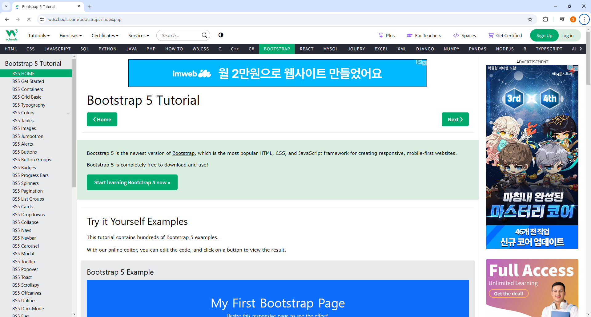
 
 

---
<!-- _class: blue -->
# 🧪 Step 2: 코드 예제

---

<!-- _class: aqua -->
## 예제 1: 부트스트랩 템플릿만들기
<pre class="codeblock">
<!-- Latest compiled and minified CSS -->
<link href="https://cdn.jsdelivr.net/npm/bootstrap@5.3.3/dist/css/bootstrap.min.css" rel="stylesheet">

<!-- Latest compiled JavaScript -->

</pre>

 
---  
<!-- _class: green -->  
# 🛠️ Step 3: 실습 과제 (3)

 ---
<!-- _class: aqua --> 
 #### ■2.  템플릿만들기 
- [링크바로가기](https://www.w3schools.com/bootstrap5/bootstrap_get_started.php)  
 
---
<!-- _class: aqua -->  
 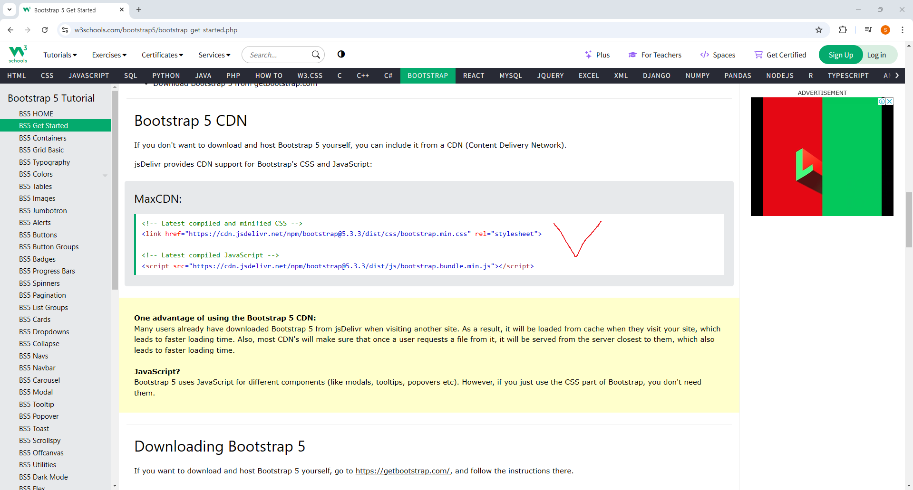

 
 ---
<!-- _class: aqua -->  
<pre class="codeblock">
 <!DOCTYPE html>
 <html lang="ko">
 <head>
   <title> dbdbig </title>
   <meta charset="utf-8">
   <meta name="viewport" content="width=device-width, initial-scale=1">
 <!-- Latest compiled and minified CSS -->
 <link href="https://cdn.jsdelivr.net/npm/bootstrap@5.3.3/dist/css/bootstrap.min.css" rel="stylesheet">
 
 <!-- Latest compiled JavaScript -->
 
 </head>
 <body>
 
 

   <h1>My First Bootstrap Page</h1>
   
This is some text.

 

 
 </body>
 </html>
</pre> 
 
 ---
<!-- _class: aqua -->   
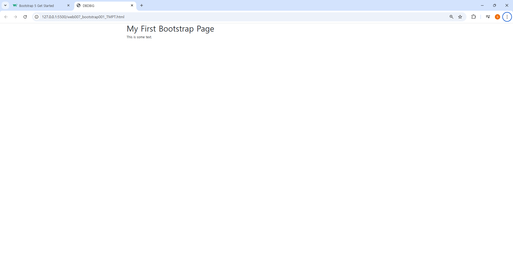

 

---
<!-- _class: orange -->
# 🧩 Step 1: 핵심 개념 (2)  
#     GRID-LAYOUT
  1. 레이아웃시스템
  2. 레이아웃 만들어보기
 
---
<!-- _class: aqua -->
 #### #2. GRID-LAYOUT
 ■1. 레이아웃시스템 
 [레이아웃시스템 바로가기]( https://www.w3schools.com/bootstrap5/bootstrap_grid_basic.php) 
 
 
---
<!-- _class: aqua -->
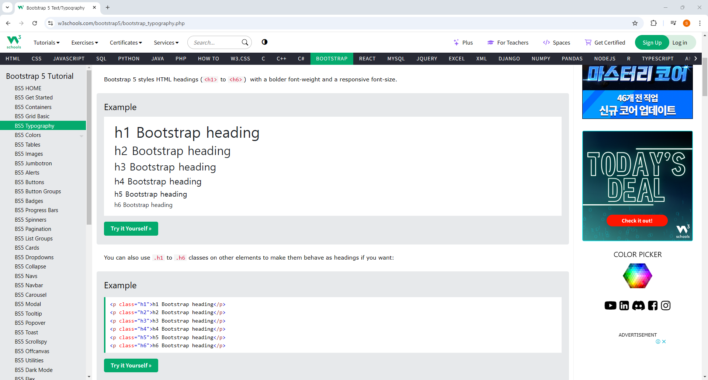
 
--- 
 <!-- _class: aqua -->
 - Grid system  눈여겨봐야할 순서  
 - [1]-[2]-[3]   표-줄-칸
   
     [1]  .container 또는 .container-fluid
     [2] .row
     [3] .col-*-*

--- 
<!-- _class: aqua --> 
-  [1]  .container 또는 .container-fluid   
: 전체 가로폭을 지정
       .container :  고정폭 레이아웃을 만들 때 사용
       .container-fluid  : 좌우로 꽉 찬 레이아웃 사용
-  [2] .row  : 한줄한줄(행)
-  [3] .col-디바이스정하기-칸수 : 한칸한칸(열)
      xs (for phones)
      sm (for tablets)   : 768px이상
      md (for desktops) : 992px이상
      lg (for larger desktops):가로해상도 1200px이상
 
--- 
<!-- _class: aqua --> 
#####  1~12 :  행을 12등분하여 그 중에 몇개를 사용할지 지정
<pre class="codeblock">
예1) .container > .row > .col-sm-10 .col-sm-2
예2) .container > .row > .col-sm-5  .col-sm-5  .col-sm-2
예3) .container > .row > .col-sm-4  .col-sm-4  .col-sm-4
예4) .container > .row > .col-sm-3  .col-sm-3  .col-sm-3   
                                              .col-sm-3
</pre> 

---
<!-- _class: aqua -->  
##### ■2. 레이아웃 만들어보기
  
 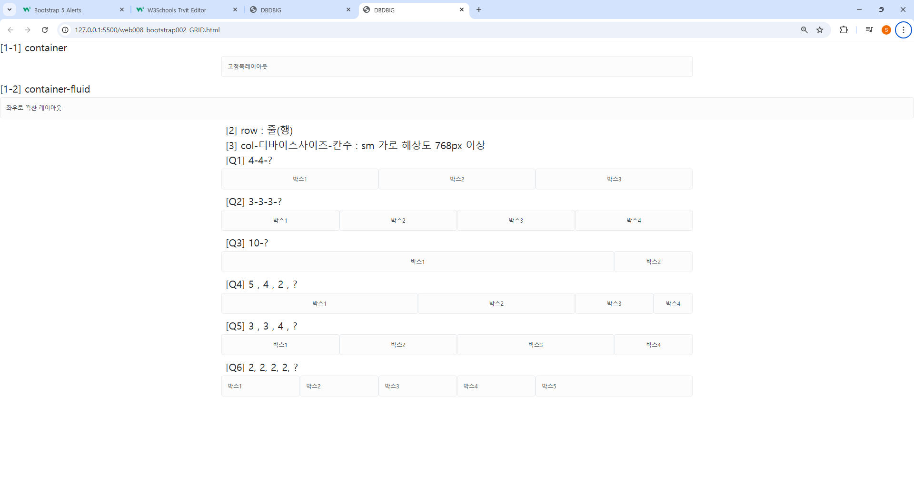

---
<!-- _class: aqua -->  

<pre class="codeblock">

 <!DOCTYPE html>
 <html lang="ko">
 <head>
   <title>DBDBIG</title>
   <meta charset="utf-8">
   <meta name="viewport" content="width=device-width, initial-scale=1">
 <!-- Latest compiled and minified CSS -->
 <link href="https://cdn.jsdelivr.net/npm/bootstrap@5.3.3/dist/css/bootstrap.min.css" rel="stylesheet">
 
 <!-- Latest compiled JavaScript -->
 
 </head>
 <body>
  

    <h3>[1-1] container </h3>
    
  고정폭레이아웃

    <h3>[1-2] container-fluid </h3>
    
좌우로 꽉찬 레이아웃 

  

  <!-- end container -->
  <!-- end container -->
 
  

    <h3>[2]  row : 줄(행) </h3>
    <h3>[3] col-디바이스사이즈-칸수   : sm 가로 해상도 768px 이상</h3>
    <h3>[Q1] 4-4-?</h3>
    

      
 박스1
 <!-- col END -->
      
 박스2
 <!-- col END -->
      
 박스3
 <!-- col END -->
    
 
 
 
    <h3>[Q2] 3-3-3-?</h3>
    

      
 박스1
 <!-- col END -->
      
 박스2
 <!-- col END -->
      
 박스3
 <!-- col END -->
      
 박스4
 <!-- col END -->
    

    <!-- end row -->
    <!-- end row -->
 
 
    <!--   3)  두칸 : 10  ,   ?		-->
    <h3>[Q3] 10-?</h3>
    

      
 박스1

      
 박스2

    

    <!-- end row -->
    <!-- end row -->
 
    <!--   4)  네칸 : 5 , 4 , 2 , ?   -->
    <h3>[Q4] 5 , 4 , 2 , ? </h3>
    

        
 박스1

        
 박스2

        
 박스3

        
 박스4

    

    <!-- end row -->
    <!-- end row -->
 
 
    <!--   5)  네칸 : 3 , 3 , 4 ,  ?  -->
    <h3>[Q5] 3 , 3 , 4 ,  ? </h3>
    

      
 박스1

      
 박스2

      
 박스3

      
 박스4

    

    <!-- end row -->
    <!-- end row -->
 
 
    <!--   6)  다섯칸 : 2, 2, 2, 2, ?  -->
    <h3>[Q6]  2, 2, 2, 2, ? </h3>
    

      
 박스1

      
 박스2

      
 박스3

      
 박스4

      
 박스5

    
 
  
<!-- main END -->
 
   </body>
 </html>
</pre>
 
 
- [1]  .container 또는 .container-fluid
- [2] .row
- [3] .col-*-*

 
 
  
 
---
<!-- _class: aqua -->  
 
 ### 3. 기본사용법
 1. CSS 읽는방법
 2. CSS 적용예제
 
 
---
<!-- _class: aqua -->  
 #### ■1. CSS 읽는방법
- [1] 버튼(Button)
   \<a>, \<dl>, \<input> 등의 태그에 클래스를 추가하여 
   버튼 모양을 만들 수 있습니다 
-  \<a href="#" class="btn btn-default">button</a>
  1. btn은 공통적으로 적용되는 모양을 정의하고, 
  2. btn-default는 테두리나 배경색 등을 정의합니다.
 
 
---
<!-- _class: aqua -->   
- [2]색(Color)
 <pre class="codeblock">
 .btn                     =기본[필수]에 
 .btn-default             원하는 색상 덮기
 .btn-primary
 .btn-success
 .btn-info
 .btn-warning
 .btn-danger
 .btn-link
 </pre> 

 
---
<!-- _class: aqua -->  

<pre class="codeblock">
 <button type="button" class="btn">Basic</button>
 <button type="button" 
        class="btn btn-default">Default</button>
 <button type="button" 
        class="btn btn-primary">Primary</button>
 <button type="button" 
        class="btn btn-success">Success</button>
 <button type="button" 
        class="btn btn-info">Info</button>
 <button type="button" 
        class="btn btn-warning">Warning</button>
 <button type="button" 
        class="btn btn-danger">Danger</button>
 <button type="button" 
        class="btn btn-link">Link</button>
</pre>
 
  
---
<!-- _class: aqua -->  
- [3]크기(Size) 버튼 크기를 정의하는 클래스는 btn-xs, btn-sm, btn-lg입니다. 
 
- [4]btn-block은 버튼을 블록 요소로 만듭니다. 
 
- [5]상태(State) active를 추가하면 활성화된 상태, disabled를 추가하면 비활성화된 상태의 모양을 만듭니다. 
 비활성화된 상태인 경우 클릭이 되지 않습니다.
  
 
 
 

---
<!-- _class: aqua -->  
#### ■2. CSS 적용예제
##### # STEP1 기본사용법

<pre class="codeblock">
&lt;div class="panel  panel-default"&gt;
  &lt;h3 class="panel-heading"&gt;[1] button + color&lt;/h3&gt;
  &lt;p class="well"&gt;사용방법 : btn(콘텐츠) btn-primary(색상)&lt;/p&gt;
  &lt;div class="panel-body"&gt;
    &lt;p&gt;&lt;a href="#" class="btn btn-default"&gt;BUTTON1 - DEFAULT&lt;/a&gt;&lt;/p&gt;
    &lt;p&gt;&lt;a href="#" class="btn btn-primary"&gt;BUTTON2 - PRIMARY&lt;/a&gt;&lt;/p&gt;
    &lt;p&gt;&lt;a href="#" class="btn btn-success"&gt;BUTTON3 - SUCCESS&lt;/a&gt;&lt;/p&gt;
    &lt;p&gt;&lt;a href="#" class="btn btn-info"&gt;BUTTON4 - INFO&lt;/a&gt;&lt;/p&gt;
    &lt;p&gt;&lt;a href="#" class="btn btn-warning"&gt;BUTTON5 - WARNING&lt;/a&gt;&lt;/p&gt;
    &lt;p&gt;&lt;a href="#" class="btn btn-danger"&gt;BUTTON6 - DANGER&lt;/a&gt;&lt;/p&gt;
    &lt;p&gt;&lt;a href="#" class="btn btn-link"&gt;BUTTON7 - LINK&lt;/a&gt;&lt;/p&gt;
  &lt;/div&gt;
&lt;/div&gt;
</pre>
  

---
<!-- _class: aqua -->   
##### # STEP2 SIZE

<pre class="codeblock">
&lt;div class="panel panel-danger"&gt;
  &lt;h3 class="panel-heading"&gt; [2] button + color + size&lt;/h3&gt;
  &lt;p class="well"&gt; 사용방법 : btn(콘텐츠) btn-primary(색상) btn-lg(사이즈)&lt;/p&gt;
  &lt;div class="panel-body"&gt;
    &lt;p&gt; &lt;a href="#" class="btn btn-warning btn-lg"&gt; lg : large&lt;/a&gt; &lt;/p&gt;
    &lt;p&gt; &lt;a href="#" class="btn btn-warning btn-md"&gt; md : middle&lt;/a&gt; &lt;/p&gt;
    &lt;p&gt; &lt;a href="#" class="btn btn-warning btn-sm"&gt; sm : small&lt;/a&gt; &lt;/p&gt;
    &lt;p&gt; &lt;a href="#" class="btn btn-warning btn-xs"&gt; xm : 엑스트라 small&lt;/a&gt; &lt;/p&gt;
  &lt;/div&gt;
&lt;/div&gt;

</pre>
  

---
<!-- _class: aqua -->  
##### # STEP3 ACTIVE / DISABLED  

<pre class="codeblock">
&lt;div class="container panel panel-warning"&gt;
  &lt;h3 class="panel-heading"&gt; [3] state : active , disabled&lt;/h3&gt;
  &lt;p class="well"&gt; 사용방법 : btn(콘텐츠) btn-primary(색상) btn-lg(사이즈) active/disabled&lt;/p&gt;
  &lt;div class="panel-body"&gt;
    &lt;p&gt; &lt;a href="#" class="btn btn-primary btn-lg"&gt; primary - basic&lt;/a&gt; &lt;/p&gt;
    &lt;p&gt; &lt;a href="#" class="btn btn-primary btn-lg active"&gt; primary - active&lt;/a&gt; &lt;/p&gt;
    &lt;p&gt; &lt;a href="#" class="btn btn-primary btn-lg disabled"&gt; primary - active&lt;/a&gt; &lt;/p&gt;
    &lt;p&gt; &lt;a href="#" class="btn btn-danger btn-lg"&gt; danger-basic&lt;/a&gt; &lt;/p&gt;
    &lt;p&gt; &lt;a href="#" class="btn btn-danger btn-lg active"&gt; danger - active&lt;/a&gt; &lt;/p&gt;
    &lt;p&gt; &lt;a href="#" class="btn btn-danger btn-lg disabled"&gt; danger - active&lt;/a&gt; &lt;/p&gt;
  &lt;/div&gt;
&lt;/div&gt;

</pre>
  
   

---
<!-- _class: aqua -->  
##### # STEP4 BLOCK

<pre class="codeblock">
&lt;div class="container panel panel-success"&gt;
  &lt;h3 class="panel-heading"&gt; [4] display :block 속성&lt;/h3&gt;
  &lt;p class="well"&gt; 사용방법 : btn(콘텐츠) btn-primary(색상) btn-lg(사이즈) active/disabled btn-block&lt;/p&gt;
  &lt;p class="well"&gt; btn-block : 줄바꿈이 되고 parent 가로사이즈 만큼 영역이 넓어짐&lt;/p&gt;
  &lt;div class="panel-body"&gt;
    &lt;p&gt;
      &lt;a href="#" class="btn btn-default btn-lg"&gt; primary - basic&lt;/a&gt;
      &lt;a href="#" class="btn btn-default btn-lg active"&gt; primary - active&lt;/a&gt;
      &lt;a href="#" class="btn btn-default btn-lg disabled"&gt; primary - active&lt;/a&gt;
    &lt;/p&gt;
    &lt;p&gt;
      &lt;a href="#" class="btn btn-default btn-lg"&gt; primary - basic&lt;/a&gt;
      &lt;a href="#" class="btn btn-default btn-lg btn-block active"&gt;
        primary - active&lt;/a&gt;
      &lt;a href="#" class="btn btn-default btn-lg disabled"&gt; primary - active&lt;/a&gt;
    &lt;/p&gt;
  &lt;/div&gt;
&lt;/div&gt;

</pre> 

 
---
<!-- _class: aqua -->  
  
##### # STEP5 CUSTOM
<pre class="codeblock">
&lt;div class="container panel panel-success"&gt;
  &lt;h3 class="panel-heading"&gt; [5] cmustom css&lt;/h3&gt;
  &lt;p class="well"&gt; 원본 css는 수정하지 말고 child-css 만들어서 사용하기( 누더기...)&lt;/p&gt;
  &lt;div class="panel-body dropdown"&gt;
    &lt;button class="btn btn-danger btn-block dropdown-toggle"
    type="button" data-toggle="dropdown"&gt;Dropdown Example
    &lt;span class="caret"&gt;&lt;/span&gt;&lt;/button&gt;
    &lt;ul class="dropdown-menu"&gt;
      &lt;li&gt;&lt;a href="#"&gt;HTML&lt;/a&gt;&lt;/li&gt;
      &lt;li&gt;&lt;a href="#"&gt;CSS&lt;/a&gt;&lt;/li&gt;
      &lt;li&gt;&lt;a href="#"&gt;JavaScript&lt;/a&gt;&lt;/li&gt;
    &lt;/ul&gt;
  &lt;/div&gt;
&lt;/div&gt;

</pre>
 
 
---
#### 예시) 전체홈페이지
<!-- _class: aqua -->  
<pre class="codeblock">

&lt;!DOCTYPE html&gt;
&lt;html lang="ko"&gt;
&lt;head&gt;
  &lt;title&gt;DBDBIG&lt;/title&gt;
  &lt;meta charset="utf-8"&gt;
  &lt;meta name="viewport" content="width=device-width, initial-scale=1"&gt;
  &lt;!-- Latest compiled and minified CSS --&gt;
  &lt;link href="https://cdn.jsdelivr.net/npm/bootstrap@5.3.3/dist/css/bootstrap.min.css" rel="stylesheet"&gt;
  &lt;!-- Latest compiled JavaScript --&gt;
  &lt;script src="https://cdn.jsdelivr.net/npm/bootstrap@5.3.3/dist/js/bootstrap.bundle.min.js"&gt;&lt;/script&gt;
&lt;/head&gt;
&lt;body&gt;

  &lt;div class="container card card-default my-5"&gt;
    &lt;h3 class="cards-heading"&gt;[1] button + color&lt;/h3&gt;
    &lt;p class="alert alert-warning"&gt;사용방법 : btn(콘텐츠) btn-primary(색상)&lt;/p&gt;
    &lt;div class="panel-body"&gt;
      &lt;p&gt;&lt;a href="#" class="btn btn-default"&gt;BUTTON1 - DEFAULT&lt;/a&gt;&lt;/p&gt;
      &lt;p&gt;&lt;a href="#" class="btn btn-primary"&gt;BUTTON2 - PRIMARY&lt;/a&gt;&lt;/p&gt;
      &lt;p&gt;&lt;a href="#" class="btn btn-success"&gt;BUTTON3 - SUCCESS&lt;/a&gt;&lt;/p&gt;
      &lt;p&gt;&lt;a href="#" class="btn btn-info"&gt;BUTTON4 - INFO&lt;/a&gt;&lt;/p&gt;
      &lt;p&gt;&lt;a href="#" class="btn btn-warning"&gt;BUTTON5 - WARNING&lt;/a&gt;&lt;/p&gt;
      &lt;p&gt;&lt;a href="#" class="btn btn-danger"&gt;BUTTON6 - DANGER&lt;/a&gt;&lt;/p&gt;
      &lt;p&gt;&lt;a href="#" class="btn btn-link"&gt;BUTTON7 - LINK&lt;/a&gt;&lt;/p&gt;
    &lt;/div&gt;
  &lt;/div&gt;

  &lt;div class="container card card-default my-5"&gt;
    &lt;h3 class="cards-heading"&gt;[2] button + color + size&lt;/h3&gt;
    &lt;p class="alert alert-warning"&gt;사용방법 : btn(콘텐츠) btn-primary(색상) btn-lg(사이즈)&lt;/p&gt;
    &lt;div class="panel-body"&gt;
      &lt;p&gt;&lt;a href="#" class="btn btn-warning btn-lg"&gt;lg : large&lt;/a&gt;&lt;/p&gt;
      &lt;p&gt;&lt;a href="#" class="btn btn-warning btn-md"&gt;md : middle&lt;/a&gt;&lt;/p&gt;
      &lt;p&gt;&lt;a href="#" class="btn btn-warning btn-sm"&gt;sm : small&lt;/a&gt;&lt;/p&gt;
      &lt;p&gt;&lt;a href="#" class="btn btn-warning btn-xs"&gt;xm : 엑스트라 small&lt;/a&gt;&lt;/p&gt;
    &lt;/div&gt;
  &lt;/div&gt;

  &lt;div class="container card card-default my-5"&gt;
    &lt;h3 class="cards-heading"&gt;[3] state : active , disabled&lt;/h3&gt;
    &lt;p class="alert alert-warning"&gt;사용방법 : btn(콘텐츠) btn-primary(색상) btn-lg(사이즈) active/disabled&lt;/p&gt;
    &lt;div class="panel-body"&gt;
      &lt;p&gt;&lt;a href="#" class="btn btn-primary btn-lg"&gt;primary - basic&lt;/a&gt;&lt;/p&gt;
      &lt;p&gt;&lt;a href="#" class="btn btn-primary btn-lg active"&gt;primary - active&lt;/a&gt;&lt;/p&gt;
      &lt;p&gt;&lt;a href="#" class="btn btn-primary btn-lg disabled"&gt;primary - active&lt;/a&gt;&lt;/p&gt;
      &lt;p&gt;&lt;a href="#" class="btn btn-danger btn-lg"&gt;danger-basic&lt;/a&gt;&lt;/p&gt;
      &lt;p&gt;&lt;a href="#" class="btn btn-danger btn-lg active"&gt;danger - active&lt;/a&gt;&lt;/p&gt;
      &lt;p&gt;&lt;a href="#" class="btn btn-danger btn-lg disabled"&gt;danger - active&lt;/a&gt;&lt;/p&gt;
    &lt;/div&gt;
  &lt;/div&gt;

  &lt;div class="container card card-default my-5"&gt;
    &lt;h3 class="cards-heading"&gt;[4] display :block 속성&lt;/h3&gt;
    &lt;p class="alert alert-warning"&gt;사용방법 : btn(콘텐츠) btn-primary(색상) btn-lg(사이즈) active/disabled btn-block&lt;/p&gt;
    &lt;p class="alert alert-warning"&gt;btn-block : 줄바꿈이 되고 parent 가로사이즈 만큼 영역이 넓어짐&lt;/p&gt;
    &lt;div class="panel-body"&gt;
      &lt;p&gt;
        &lt;a href="#" class="btn btn-default btn-lg"&gt;primary - basic&lt;/a&gt;
        &lt;a href="#" class="btn btn-default btn-lg active"&gt;primary - active&lt;/a&gt;
        &lt;a href="#" class="btn btn-default btn-lg disabled"&gt;primary - active&lt;/a&gt;
      &lt;/p&gt;
      &lt;p&gt;
        &lt;a href="#" class="btn btn-default btn-lg"&gt;primary - basic&lt;/a&gt;
        &lt;a href="#" class="btn btn-default btn-lg btn-block active"&gt;primary - active&lt;/a&gt;
        &lt;a href="#" class="btn btn-default btn-lg disabled"&gt;primary - active&lt;/a&gt;
      &lt;/p&gt;
    &lt;/div&gt;
  &lt;/div&gt;

  &lt;div class="container card card-default my-5"&gt;
    &lt;h3 class="cards-heading"&gt;[5] cmustom css&lt;/h3&gt;
    &lt;p class="alert alert-warning"&gt;원본 css는 수정하지 말고 child-css 만들어서 사용하기( 누더기...)&lt;/p&gt;
    &lt;div class="panel-body dropdown"&gt;
      &lt;button class="btn btn-danger btn-block dropdown-toggle" type="button" data-toggle="dropdown"&gt;
        Dropdown Example &lt;span class="caret"&gt;&lt;/span&gt;
      &lt;/button&gt;
      &lt;ul class="dropdown-menu"&gt;
        &lt;li&gt;&lt;a href="#"&gt;HTML&lt;/a&gt;&lt;/li&gt;
        &lt;li&gt;&lt;a href="#"&gt;CSS&lt;/a&gt;&lt;/li&gt;
        &lt;li&gt;&lt;a href="#"&gt;JavaScript&lt;/a&gt;&lt;/li&gt;
      &lt;/ul&gt;
    &lt;/div&gt;
  &lt;/div&gt;

&lt;/body&gt;
&lt;/html&gt;
 
</pre>
 
 
 
 
---
<!-- _class: aqua -->   
### #4.   쓸만한 기능들 (1)  CSS (1/2)
 1.   Text/Typography
 2.   Images
 3.   Jumbtron
 4.   Wells
 5.   Alert
 6.   Glyphicons
 7.   Badges and Labels

 ---
<!-- _class: aqua -->   
### #4.   쓸만한 기능들 (1)  CSS (2/2)
 8.   Progress Bars
 9.   Pagination
 10.  Pager
 11.  Dropdowns
 13.  FORM
 14. MEDIA OBJECT
 

  
---
<!-- _class: aqua -->  
#### #4. 쓸만한 기능들 (1)  CSS  
■1.   Text/Typography
[Text/Typography](https://www.w3schools.com/bootstrap5/bootstrap_typography.php)
 
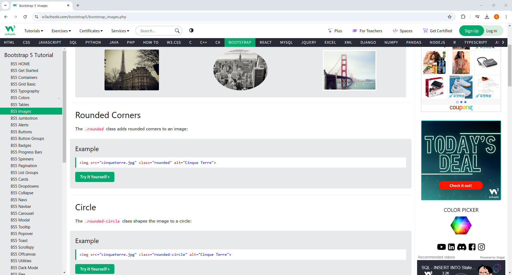
 

---
<!-- _class: aqua -->  

<pre class="codeblock">
#1  &lt;h1&gt; - &lt;h6&gt;
#2  &lt;small&gt;
ex) &lt;h1&gt;h1 heading &lt;small&gt;secondary text&lt;/small&gt;&lt;/h1&gt;
#3  &lt;abbr&gt;
#4  &lt;blockquote&gt;   class="blockquote-reverse"
#5  &lt;dl&gt;
#6  &lt;code&gt;
#7  &lt;kbd&gt;
#8  &lt;pre&gt;
</pre>
 
 
---
<!-- _class: aqua -->   
 ##### ■2.   Images
[Images](https://www.w3schools.com/bootstrap5/bootstrap_images.php)
 

 

---
<!-- _class: aqua -->   
<pre class="codeblock">
&lt;img src="cinqueterre.jpg"
     class="img-rounded" alt="Cinque Terre"&gt;
&lt;img src="cinqueterre.jpg" 
     class="img-circle" alt="Cinque Terre"&gt;
&lt;img src="cinqueterre.jpg" 
     class="img-thumbnail" alt="Cinque Terre"&gt;
</pre>
 
 
 
 
 
---
<!-- _class: aqua -->  
##### ■3.   Jumbtron
[Jumbtron](https://www.w3schools.com/bootstrap5/bootstrap_jumbotron.php)
 

---
<!-- _class: aqua -->  
 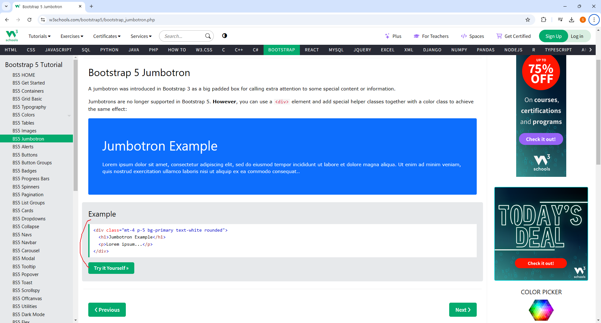
 

---
<!-- _class: aqua -->  
<pre class="codeblock">
&lt;div class="mt-4 p-5 bg-primary text-white rounded"&gt;
  &lt;h1&gt;Jumbotron Example&lt;/h1&gt;
  &lt;p&gt;Lorem ipsum...&lt;/p&gt;
&lt;/div&gt;
</pre>
 
 
 
  
---
<!-- _class: aqua -->  
##### ■4.   Alert
[Alert](https://www.w3schools.com/bootstrap5/bootst )

---
<!-- _class: aqua -->  
 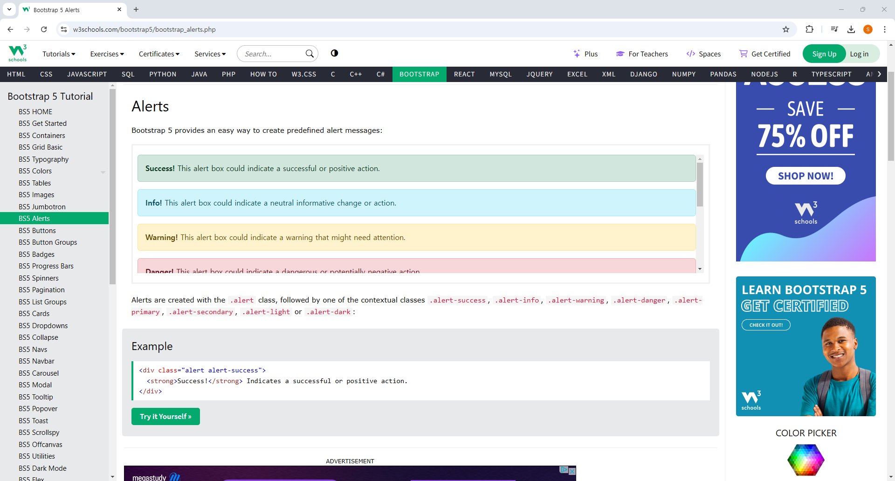
 
---
<!-- _class: aqua -->  
<pre class="codeblock">
&lt;div class="alert alert-success"&gt;
  &lt;strong&gt;Success!&lt;/strong&gt; Indicates a successful or positive action.
&lt;/div&gt;
</pre>
 
  
 
---
<!-- _class: aqua -->   
 ##### ■5.    padding/margin
[padding/margin]( https://www.w3schools.com/bootstrap5/bootstrap_utilities.php )
  

 
---
<!-- _class: aqua -->    
 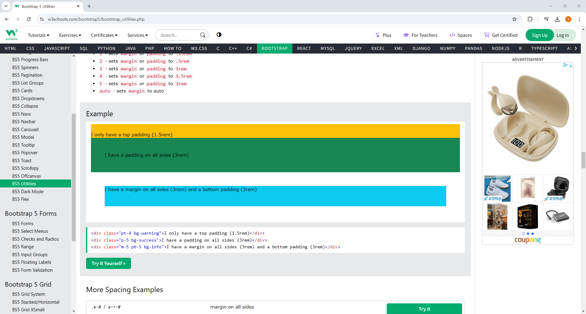
 
---
<!-- _class: aqua -->  
<pre class="codeblock">
&lt;div class="pt-4 bg-warning"&gt;I only have a top padding (1.5rem)&lt;/div&gt;
&lt;div class="p-5 bg-success"&gt;I have a padding on all sides (3rem)&lt;/div&gt;
&lt;div class="m-5 pb-5 bg-info"&gt;I have a margin on all sides (3rem) and a bottom padding (3rem)&lt;/div&gt;

</pre>
 
 
 
 
 
 
 ---
<!-- _class: aqua -->  
 ##### ■6.   Badges
[Badges]( https://www.w3schools.com/bootstrap5/bootstrap_badges.php)

 
 
  ---
<!-- _class: aqua -->  
 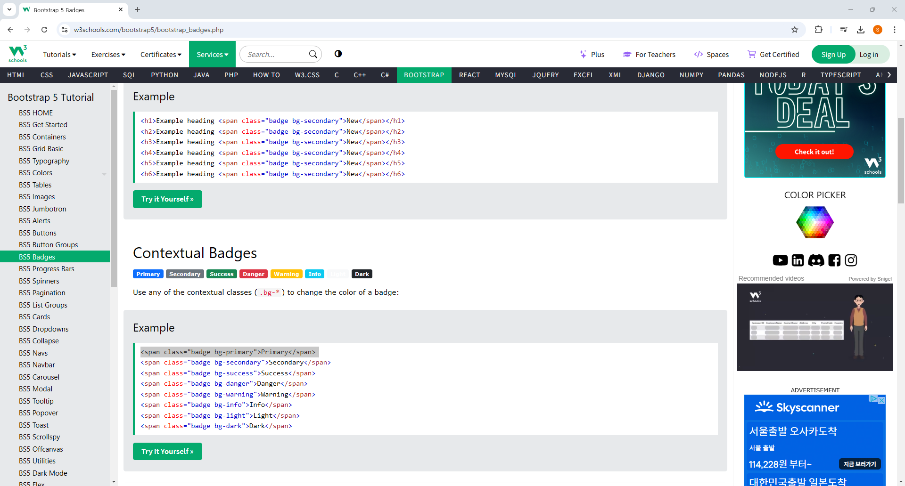
 
---
<!-- _class: aqua -->  
<pre class="codeblock">
&lt;span class="badge bg-primary"&gt;Primary&lt;/span&gt;

</pre>
 
 
 
 
 
 
 
 
 ---
<!-- _class: aqua -->  
 ##### ■7.   Progress Bars
[ Progress Bars]( https://www.w3schools.com/bootstrap5/bootstrap_progressbars.php)
 

 
 
---
<!-- _class: aqua -->    
 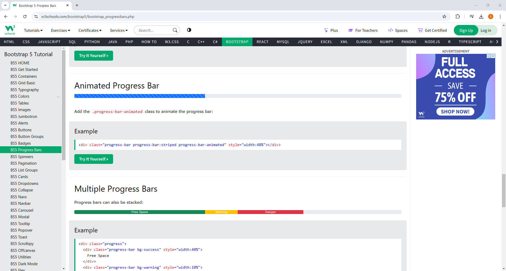

 ---
<!-- _class: aqua -->  

<pre class="codeblock">
&lt;div class="progress-bar progress-bar-striped progress-bar-animated" style="width:40%"&gt;&lt;/div&gt;

</pre>
 
 
 
  
 
 
 
 
 ---
<!-- _class: aqua -->  
 ##### ■8.   Pagination
 
[Pagination]( https://www.w3schools.com/bootstrap5/bootstrap_pagination.php )
 
 
 ---
<!-- _class: aqua -->  
 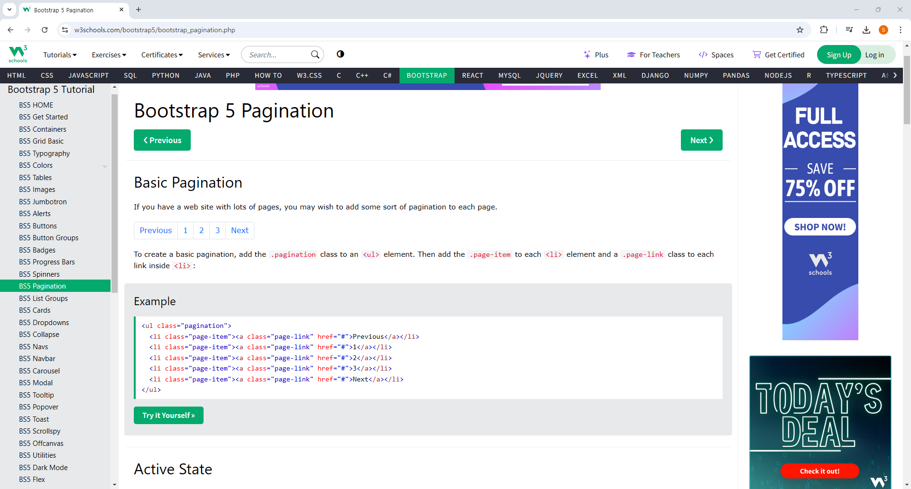
 
 
 
---
<!-- _class: aqua -->  
<pre class="codeblock">
&lt;ul class="pagination"&gt;
  &lt;li class="page-item"&gt;&lt;a class="page-link" 
      href="#"&gt;Previous&lt;/a&gt;&lt;/li&gt;
  &lt;li class="page-item"&gt;&lt;a class="page-link" 
      href="#"&gt;1&lt;/a&gt;&lt;/li&gt;
  &lt;li class="page-item"&gt;&lt;a class="page-link" 
      href="#"&gt;2&lt;/a&gt;&lt;/li&gt;
  &lt;li class="page-item"&gt;&lt;a class="page-link"
      href="#"&gt;3&lt;/a&gt;&lt;/li&gt;
  &lt;li class="page-item"&gt;&lt;a class="page-link"
      href="#"&gt;Next&lt;/a&gt;&lt;/li&gt;
&lt;/ul&gt;
</pre>
 
 
  
 
 
 
 
 ---
<!-- _class: aqua -->  
 ##### ■9. cards
 
[cards]( https://www.w3schools.com/bootstrap5/bootstrap_cards.php )
  

---
<!-- _class: aqua -->  
 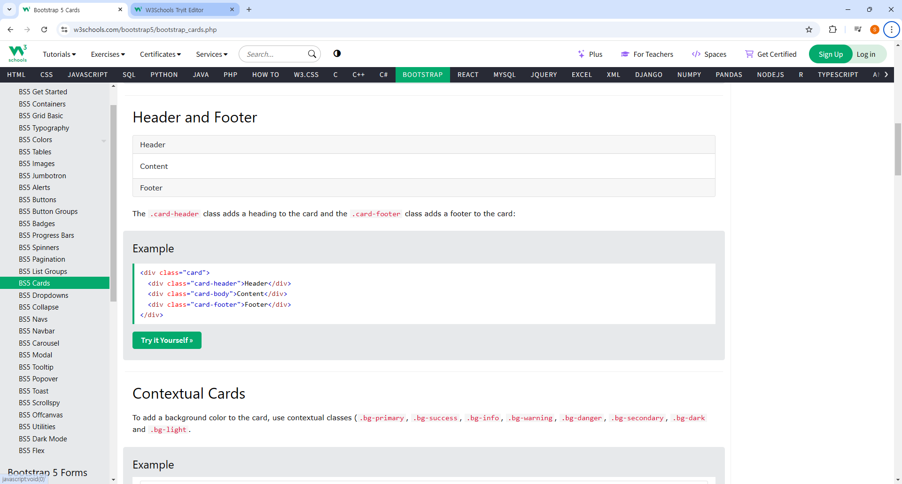
 
 
---
<!-- _class: aqua -->  
<pre class="codeblock">
&lt;div class="card"&gt;
  &lt;div class="card-header"&gt;Header&lt;/div&gt;
  &lt;div class="card-body"&gt;Content&lt;/div&gt;
  &lt;div class="card-footer"&gt;Footer&lt;/div&gt;
&lt;/div&gt;
</pre>
 
 
 
 
 
---
<!-- _class: aqua -->   
 ##### ■10. Dropdown
 
[Dropdown](  https://www.w3schools.com/bootstrap5/bootstrap_dropdowns.php)

  
---
<!-- _class: aqua -->    
 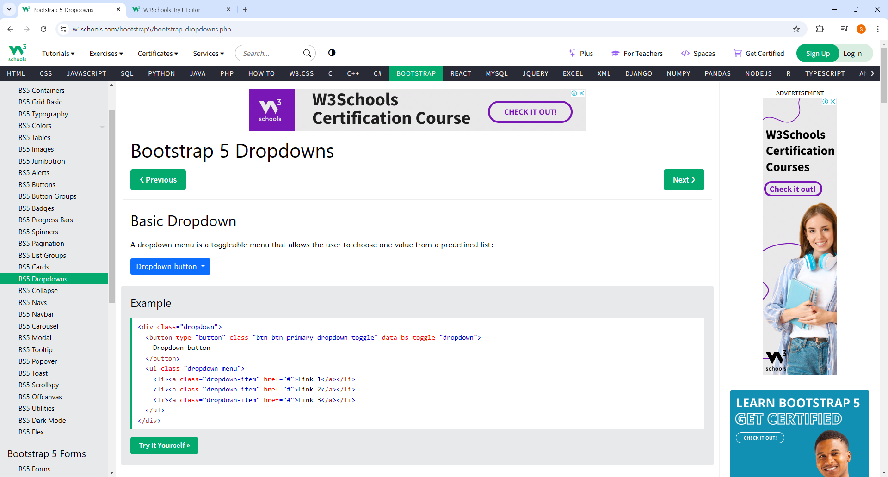
 
 
---
<!-- _class: aqua -->  
<pre class="codeblock">
&lt;div class="dropdown"&gt;
  &lt;button type="button" class="btn btn-primary dropdown-toggle" data-bs-toggle="dropdown"&gt;
    Dropdown button
  &lt;/button&gt;
  &lt;ul class="dropdown-menu"&gt;
    &lt;li&gt;&lt;a class="dropdown-item" href="#"&gt;Link 1&lt;/a&gt;&lt;/li&gt;
    &lt;li&gt;&lt;a class="dropdown-item" href="#"&gt;Link 2&lt;/a&gt;&lt;/li&gt;
    &lt;li&gt;&lt;a class="dropdown-item" href="#"&gt;Link 3&lt;/a&gt;&lt;/li&gt;
  &lt;/ul&gt;
&lt;/div&gt;

 
</pre>
 
 
 
 
 ---
<!-- _class: aqua -->  
 ##### ■11.FORM 
 
[FORM](  https://www.w3schools.com/bootstrap5/bootstrap_forms.php )

 
  ---
<!-- _class: aqua -->  
 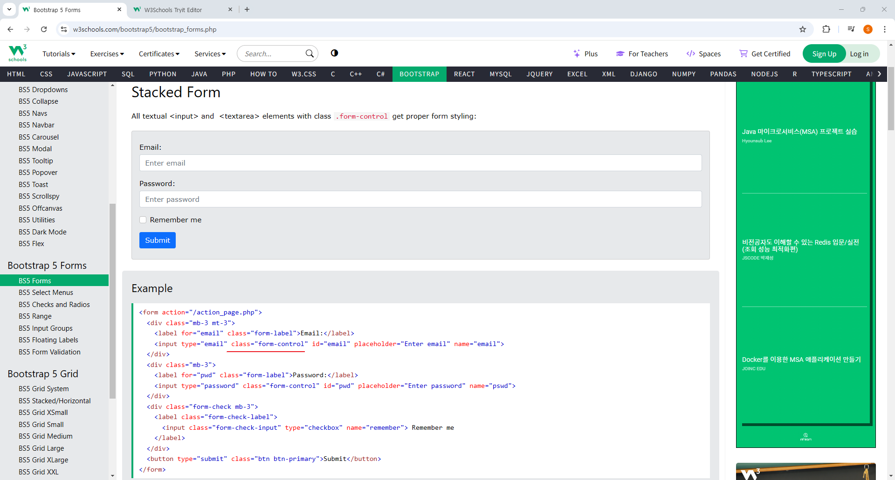
 
 
---
<!-- _class: aqua -->  
<pre class="codeblock">
&lt;form action="/action_page.php"&gt;
  &lt;div class="mb-3 mt-3"&gt;
    &lt;label for="email" class="form-label"&gt;Email:&lt;/label&gt;
    &lt;input type="email" class="form-control" id="email" placeholder="Enter email" name="email"&gt;
  &lt;/div&gt;
  &lt;div class="mb-3"&gt;
    &lt;label for="pwd" class="form-label"&gt;Password:&lt;/label&gt;
    &lt;input type="password" class="form-control" id="pwd" placeholder="Enter password" name="pswd"&gt;
  &lt;/div&gt;
  &lt;div class="form-check mb-3"&gt;
    &lt;label class="form-check-label"&gt;
      &lt;input class="form-check-input" type="checkbox" name="remember"&gt; Remember me
    &lt;/label&gt;
  &lt;/div&gt;
  &lt;button type="submit" class="btn btn-primary"&gt;Submit&lt;/button&gt;
&lt;/form&gt;

 
</pre>
 
 
 
  
 ---
<!-- _class: aqua -->  
 ##### ■12. TABLE
 1. TABLE 종류
 2. TABLE 색상
 3. 반응형테이블
 
[TABLE](  https://www.w3schools.com/bootstrap5/bootstrap_tables.php )

 
 
---
<!-- _class: aqua -->    
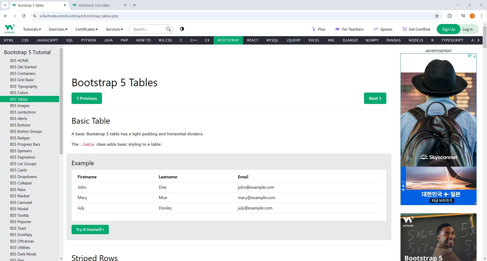 

---
<!-- _class: aqua -->  
 ##### ■1. TABLE 종류

<pre class="codeblock">
&lt;table class="table"&gt;  &lt;/table&gt;
&lt;table class="table table-striped"&gt;  &lt;/table&gt;
&lt;table class="table table-bordered"&gt;  &lt;/table&gt;
&lt;table class="table table-hover"&gt;  &lt;/table&gt;
&lt;table class="table table-condensed"&gt;  &lt;/table&gt;

</pre>
 
 
---
<!-- _class: aqua -->   
 ##### ■2. TABLE 색상

<pre class="codeblock">
&lt;tr class="active"&gt;  &lt;/tr&gt;
&lt;tr class="success"&gt;  &lt;/tr&gt;
&lt;tr class="info"&gt;  &lt;/tr&gt;
&lt;tr class="warning"&gt;  &lt;/tr&gt;
&lt;tr class="danger"&gt;  &lt;/tr&gt;
</pre>
 
 
---
<!-- _class: aqua -->   
 ##### ■3. 반응형테이블

<pre class="codeblock">
&lt;div class="table-responsive"&gt;
  &lt;table class="table"&gt;
    ...
  &lt;/table&gt;
&lt;/div&gt;
</pre>
 
 
 
 
 
 

---
<!-- _class: orange -->  
 
 ### #6. 쓸만한 기능들 (3) JS
 1. Collapse
 2. tabs
 3. navbar
 4. carousel
 5. modal
 6. tooltip
 7. popover
 8. scrollspy
 9. affix
 
 
---
<!-- _class: aqua -->   
 ##### ■1. Collapse
[Collapse](   https://www.w3schools.com/bootstrap5/bootstrap_collapse.php )

  
---
<!-- _class: aqua -->    
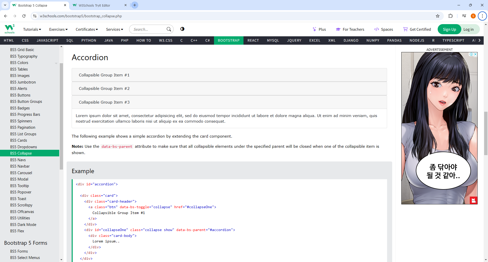

 
---
<!-- _class: aqua -->  
<pre class="codeblock">
&lt;div id="accordion"&gt;

  &lt;div class="card"&gt;
    &lt;div class="card-header"&gt;
      &lt;a class="btn" data-bs-toggle="collapse" href="#collapseOne"&gt;
        Collapsible Group Item #1
      &lt;/a&gt;
    &lt;/div&gt;
    &lt;div id="collapseOne" class="collapse show" data-bs-parent="#accordion"&gt;
      &lt;div class="card-body"&gt;
        Lorem ipsum..
      &lt;/div&gt;
    &lt;/div&gt;
  &lt;/div&gt;

  &lt;div class="card"&gt;
    &lt;div class="card-header"&gt;
      &lt;a class="collapsed btn" data-bs-toggle="collapse" href="#collapseTwo"&gt;
        Collapsible Group Item #2
      &lt;/a&gt;
    &lt;/div&gt;
    &lt;div id="collapseTwo" class="collapse" data-bs-parent="#accordion"&gt;
      &lt;div class="card-body"&gt;
        Lorem ipsum..
      &lt;/div&gt;
    &lt;/div&gt;
  &lt;/div&gt;

  &lt;div class="card"&gt;
    &lt;div class="card-header"&gt;
      &lt;a class="collapsed btn" data-bs-toggle="collapse" href="#collapseThree"&gt;
        Collapsible Group Item #3
      &lt;/a&gt;
    &lt;/div&gt;
    &lt;div id="collapseThree" class="collapse" data-bs-parent="#accordion"&gt;
      &lt;div class="card-body"&gt;
        Lorem ipsum..
      &lt;/div&gt;
    &lt;/div&gt;
  &lt;/div&gt;

&lt;/div&gt;

</pre>
 
 
 
 
---
<!-- _class: aqua -->   
 ##### ■2. tabs
[tabs](  https://www.w3schools.com/bootstrap5/bootstrap_navs.php )
 
  
---
<!-- _class: aqua -->    
 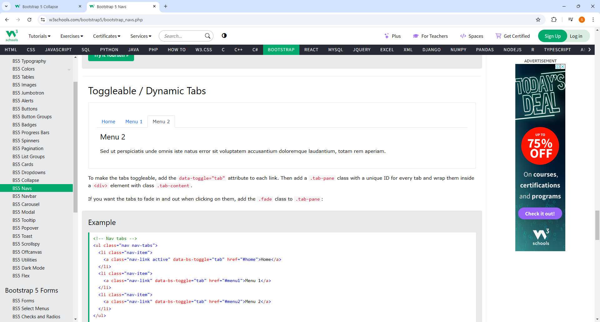
 
---
<!-- _class: aqua -->  
<pre class="codeblock">
&lt;!-- Nav tabs --&gt;
&lt;ul class="nav nav-tabs"&gt;
  &lt;li class="nav-item"&gt;
    &lt;a class="nav-link active" data-bs-toggle="tab" href="#home"&gt;Home&lt;/a&gt;
  &lt;/li&gt;
  &lt;li class="nav-item"&gt;
    &lt;a class="nav-link" data-bs-toggle="tab" href="#menu1"&gt;Menu 1&lt;/a&gt;
  &lt;/li&gt;
  &lt;li class="nav-item"&gt;
    &lt;a class="nav-link" data-bs-toggle="tab" href="#menu2"&gt;Menu 2&lt;/a&gt;
  &lt;/li&gt;
&lt;/ul&gt;

&lt;!-- Tab panes --&gt;
&lt;div class="tab-content"&gt;
  &lt;div class="tab-pane container active" id="home"&gt;...&lt;/div&gt;
  &lt;div class="tab-pane container fade" id="menu1"&gt;...&lt;/div&gt;
  &lt;div class="tab-pane container fade" id="menu2"&gt;...&lt;/div&gt;
&lt;/div&gt;
</pre>
 
 
---
<!-- _class: aqua -->   
 ##### ■3. navbar 
[navbar](  https://www.w3schools.com/bootstrap5/bootstrap_navbar.php )
 
  
---
<!-- _class: aqua -->    
 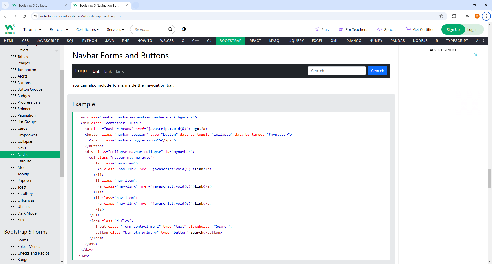
 
---
<!-- _class: aqua -->  
<pre class="codeblock">
&lt;nav class="navbar navbar-expand-sm navbar-dark bg-dark"&gt;
  &lt;div class="container-fluid"&gt;
    &lt;a class="navbar-brand" 
       href="javascript:void(0)"&gt;Logo&lt;/a&gt;
    &lt;button class="navbar-toggler" type="button"
        data-bs-toggle="collapse" data-bs-target="#mynavbar"&gt;
      &lt;span class="navbar-toggler-icon"&gt;&lt;/span&gt;
    &lt;/button&gt;
    &lt;div class="collapse navbar-collapse" id="mynavbar"&gt;
      &lt;ul class="navbar-nav me-auto"&gt;
        &lt;li class="nav-item"&gt;
          &lt;a class="nav-link" href="javascript:void(0)"&gt;Link&lt;/a&gt;
        &lt;/li&gt;
        &lt;li class="nav-item"&gt;
          &lt;a class="nav-link" href="javascript:void(0)"&gt;Link&lt;/a&gt;
        &lt;/li&gt;
        &lt;li class="nav-item"&gt;
          &lt;a class="nav-link" href="javascript:void(0)"&gt;Link&lt;/a&gt;
        &lt;/li&gt;
      &lt;/ul&gt;
      &lt;form class="d-flex"&gt;
        &lt;input class="form-control me-2" type="text" placeholder="Search"&gt;
        &lt;button class="btn btn-primary" type="button"&gt;Search&lt;/button&gt;
      &lt;/form&gt;
    &lt;/div&gt;
  &lt;/div&gt;
&lt;/nav&gt;

</pre>
 
 
 
  
 
 
 
 ---
<!-- _class: aqua -->  
 ##### ■4. carousel
[carousel](    https://www.w3schools.com/bootstrap5/bootstrap_carousel.php)

 
 ---
<!-- _class: aqua -->  
  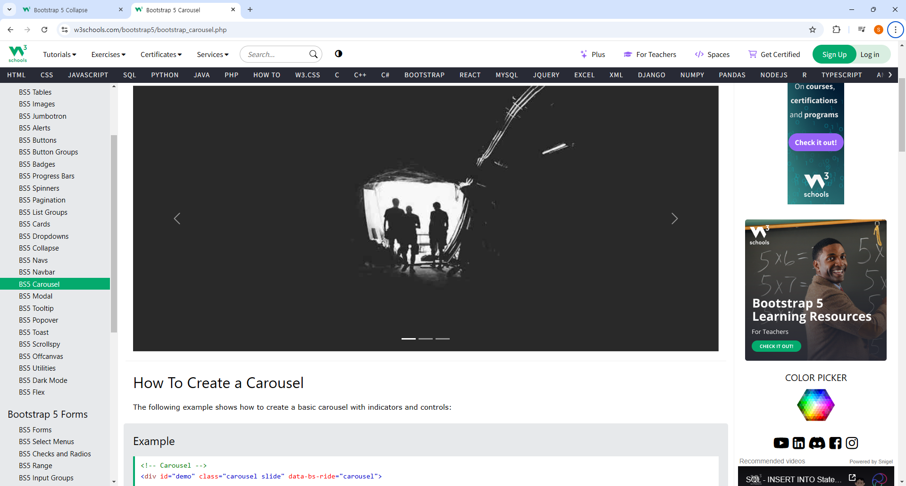
 
---
<!-- _class: aqua -->  
<pre class="codeblock">
&lt;!-- Carousel --&gt;
&lt;div id="demo" class="carousel slide" data-bs-ride="carousel"&gt;

  &lt;!-- Indicators/dots --&gt;
  &lt;div class="carousel-indicators"&gt;
    &lt;button type="button" data-bs-target="#demo" data-bs-slide-to="0" class="active"&gt;&lt;/button&gt;
    &lt;button type="button" data-bs-target="#demo" data-bs-slide-to="1"&gt;&lt;/button&gt;
    &lt;button type="button" data-bs-target="#demo" data-bs-slide-to="2"&gt;&lt;/button&gt;
  &lt;/div&gt;

  &lt;!-- The slideshow/carousel --&gt;
  &lt;div class="carousel-inner"&gt;
    &lt;div class="carousel-item active"&gt;
      &lt;img src="la.jpg" alt="Los Angeles" class="d-block w-100"&gt;
    &lt;/div&gt;
    &lt;div class="carousel-item"&gt;
      &lt;img src="chicago.jpg" alt="Chicago" class="d-block w-100"&gt;
    &lt;/div&gt;
    &lt;div class="carousel-item"&gt;
      &lt;img src="ny.jpg" alt="New York" class="d-block w-100"&gt;
    &lt;/div&gt;
  &lt;/div&gt;

  &lt;!-- Left and right controls/icons --&gt;
  &lt;button class="carousel-control-prev" type="button" data-bs-target="#demo" data-bs-slide="prev"&gt;
    &lt;span class="carousel-control-prev-icon"&gt;&lt;/span&gt;
  &lt;/button&gt;
  &lt;button class="carousel-control-next" type="button" data-bs-target="#demo" data-bs-slide="next"&gt;
    &lt;span class="carousel-control-next-icon"&gt;&lt;/span&gt;
  &lt;/button&gt;

&lt;/div&gt;

</pre>
 
 
 
 
 ---
<!-- _class: aqua -->  
 ##### ■5. modal
[modal]( https://www.w3schools.com/bootstrap5/bootstrap_modal.php )
 
 
  ---
<!-- _class: aqua -->  
 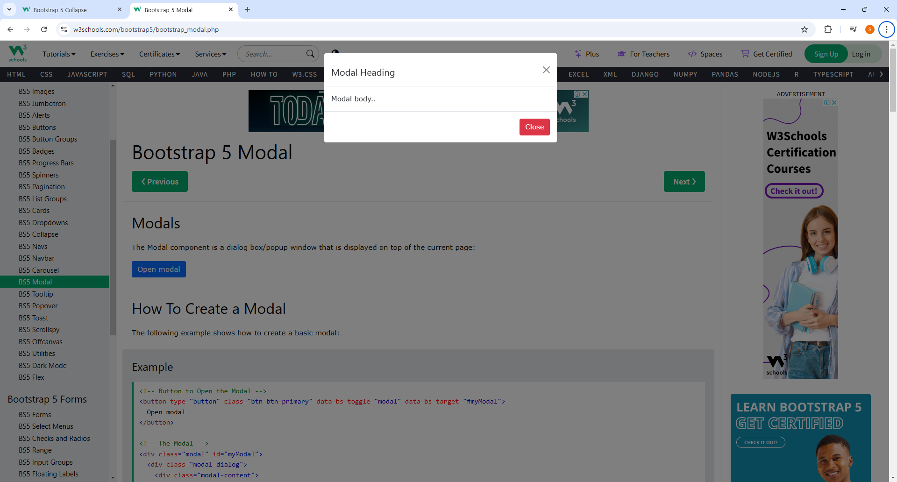
 
---
<!-- _class: aqua -->  
<pre class="codeblock">
 <!-- Button to Open the Modal -->
 <button type="button" class="btn btn-primary" data-bs-toggle="modal" data-bs-target="#myModal">
   Open modal
 </button>
 
 <!-- The Modal -->
 

  &lt;!-- Button to Open the Modal --&gt;
&lt;button type="button" class="btn btn-primary" data-bs-toggle="modal" data-bs-target="#myModal"&gt;
  Open modal
&lt;/button&gt;

&lt;!-- The Modal --&gt;
&lt;div class="modal" id="myModal"&gt;
  &lt;div class="modal-dialog"&gt;
    &lt;div class="modal-content"&gt;

      &lt;!-- Modal Header --&gt;
      &lt;div class="modal-header"&gt;
        &lt;h4 class="modal-title"&gt;Modal Heading&lt;/h4&gt;
        &lt;button type="button" class="btn-close" data-bs-dismiss="modal"&gt;&lt;/button&gt;
      &lt;/div&gt;

      &lt;!-- Modal body --&gt;
      &lt;div class="modal-body"&gt;
        Modal body..
      &lt;/div&gt;

      &lt;!-- Modal footer --&gt;
      &lt;div class="modal-footer"&gt;
        &lt;button type="button" class="btn btn-danger" data-bs-dismiss="modal"&gt;Close&lt;/button&gt;
      &lt;/div&gt;

    &lt;/div&gt;
  &lt;/div&gt;
&lt;/div&gt;

</pre>
 
 
 
 
 
 ---
<!-- _class: aqua -->  
 #####  ■6. tooltip
[tooltip](  https://www.w3schools.com/bootstrap5/bootstrap_tooltip.php )

---
<!-- _class: aqua -->    
 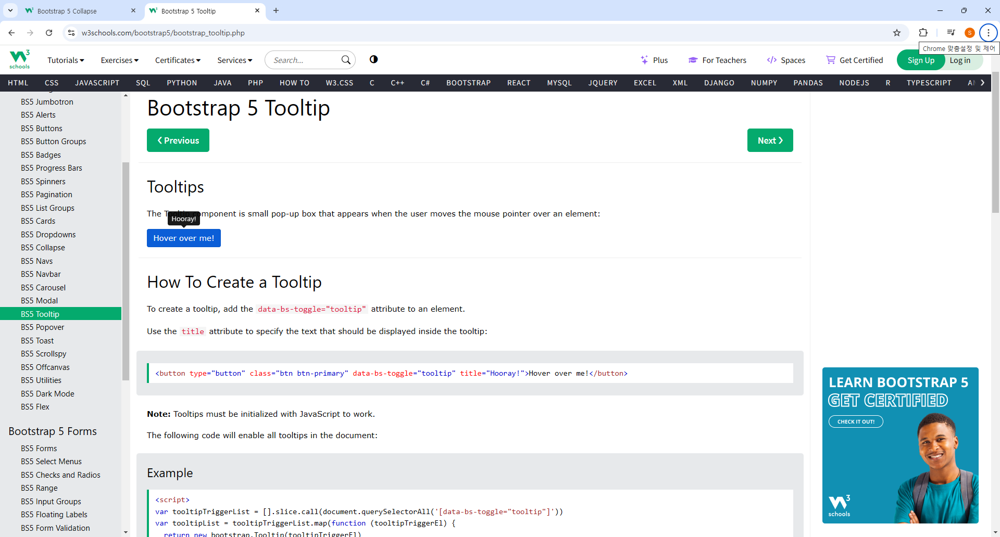
 
 
---
<!-- _class: aqua -->  
<pre class="codeblock">
&lt;button type="button" class="btn btn-primary" data-bs-toggle="tooltip" title="Hooray!"&gt;Hover over me!&lt;/button&gt;

 
</pre>
 
 
  
 
 ---
<!-- _class: aqua -->  
 #####   ■7. popover 
[popover](   https://www.w3schools.com/bootstrap5/bootstrap_popover.php)

 
  
 ---
<!-- _class: aqua -->  
 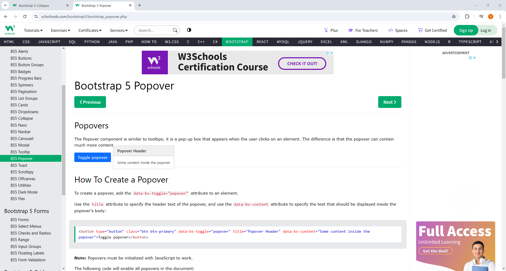
 
---
<!-- _class: aqua -->  
<pre class="codeblock">
&lt;div class="container mt-3"&gt;
  &lt;h3&gt;Popover Example&lt;/h3&gt;

  &lt;button type="button" class="btn btn-primary" data-bs-toggle="popover" title="Popover Header" data-bs-content="Some content inside the popover"&gt;
    Toggle popover
  &lt;/button&gt;
&lt;/div&gt;

&lt;script&gt;
  var popoverTriggerList = [].slice.call(document.querySelectorAll('[data-bs-toggle="popover"]'))
  var popoverList = popoverTriggerList.map(function (popoverTriggerEl) {
    return new bootstrap.Popover(popoverTriggerEl)
  })
&lt;/script&gt;

</pre>
 
 
 
 
 
 
 ---
<!-- _class: aqua -->  
 ##### ■8. scrollspy
[scrollspy](    https://www.w3schools.com/bootstrap5/bootstrap_scrollspy.php )

---
<!-- _class: aqua -->    
 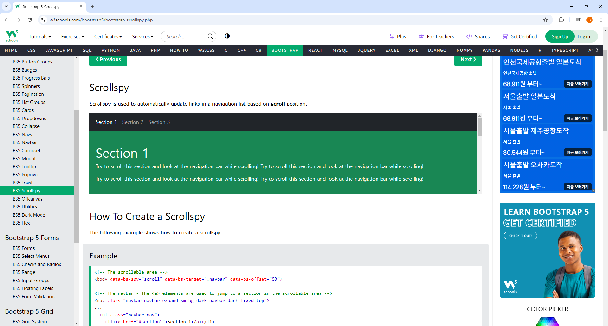
 
---
<!-- _class: aqua -->  
<pre class="codeblock">
&lt;style&gt;
  body {
    position: relative;
  }
&lt;/style&gt;

</pre>
 
---
<!-- _class: aqua -->  
<pre class="codeblock">
&lt;body data-bs-spy="scroll" data-bs-target=".navbar" data-bs-offset="50"&gt;

  &lt;nav class="navbar navbar-expand-sm bg-dark navbar-dark fixed-top"&gt;
    &lt;div class="container-fluid"&gt;
      &lt;ul class="navbar-nav"&gt;
        &lt;li class="nav-item"&gt;
          &lt;a class="nav-link" href="#section1"&gt;Section 1&lt;/a&gt;
        &lt;/li&gt;
        &lt;li class="nav-item"&gt;
          &lt;a class="nav-link" href="#section2"&gt;Section 2&lt;/a&gt;
        &lt;/li&gt;
        &lt;li class="nav-item"&gt;
          &lt;a class="nav-link" href="#section3"&gt;Section 3&lt;/a&gt;
        &lt;/li&gt;
      &lt;/ul&gt;
    &lt;/div&gt;
  &lt;/nav&gt;

  &lt;div id="section1" class="container-fluid bg-success text-white" style="padding:100px 20px;"&gt;
    &lt;h1&gt;Section 1&lt;/h1&gt;
    &lt;p&gt;Try to scroll this section and look at the navigation bar while scrolling! Try to scroll this section and look at the navigation bar while scrolling!&lt;/p&gt;
    &lt;p&gt;Try to scroll this section and look at the navigation bar while scrolling! Try to scroll this section and look at the navigation bar while scrolling!&lt;/p&gt;
  &lt;/div&gt;

  &lt;div id="section2" class="container-fluid bg-warning" style="padding:100px 20px;"&gt;
    &lt;h1&gt;Section 2&lt;/h1&gt;
    &lt;p&gt;Try to scroll this section and look at the navigation bar while scrolling! Try to scroll this section and look at the navigation bar while scrolling!&lt;/p&gt;
    &lt;p&gt;Try to scroll this section and look at the navigation bar while scrolling! Try to scroll this section and look at the navigation bar while scrolling!&lt;/p&gt;
  &lt;/div&gt;

  &lt;div id="section3" class="container-fluid bg-secondary text-white" style="padding:100px 20px;"&gt;
    &lt;h1&gt;Section 3&lt;/h1&gt;
    &lt;p&gt;Try to scroll this section and look at the navigation bar while scrolling! Try to scroll this section and look at the navigation bar while scrolling!&lt;/p&gt;
    &lt;p&gt;Try to scroll this section and look at the navigation bar while scrolling! Try to scroll this section and look at the navigation bar while scrolling!&lt;/p&gt;
  &lt;/div&gt;

&lt;/body&gt;

</pre>
 
 
 
 
---
<!-- _class: aqua -->  
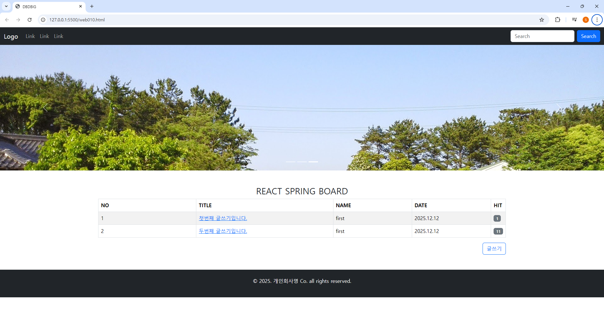

---
<!-- _class: aqua -->  
<pre class="codeblock">
&lt;!DOCTYPE html&gt;
&lt;html lang="ko"&gt;
&lt;head&gt;
  &lt;title&gt;DBDBIG&lt;/title&gt;
  &lt;meta charset="utf-8"&gt;
  &lt;meta name="viewport" content="width=device-width, initial-scale=1"&gt;
  &lt;!-- Latest compiled and minified CSS --&gt;
  &lt;link href="https://cdn.jsdelivr.net/npm/bootstrap@5.3.3/dist/css/bootstrap.min.css" rel="stylesheet"&gt;

  &lt;!-- Latest compiled JavaScript --&gt;
  &lt;script src="https://cdn.jsdelivr.net/npm/bootstrap@5.3.3/dist/js/bootstrap.bundle.min.js"&gt;&lt;/script&gt;
&lt;/head&gt;
&lt;body&gt;

  &lt;!-- header --&gt;
  &lt;nav class="navbar navbar-expand-sm navbar-dark bg-dark"&gt;
    &lt;div class="container-fluid"&gt;
      &lt;a class="navbar-brand" href="javascript:void(0)"&gt;Logo&lt;/a&gt;
      &lt;button class="navbar-toggler" type="button" data-bs-toggle="collapse" data-bs-target="#mynavbar"&gt;
        &lt;span class="navbar-toggler-icon"&gt;&lt;/span&gt;
      &lt;/button&gt;
      &lt;div class="collapse navbar-collapse" id="mynavbar"&gt;
        &lt;ul class="navbar-nav me-auto"&gt;
          &lt;li class="nav-item"&gt;
            &lt;a class="nav-link" href="javascript:void(0)"&gt;Link&lt;/a&gt;
          &lt;/li&gt;
          &lt;li class="nav-item"&gt;
            &lt;a class="nav-link" href="javascript:void(0)"&gt;Link&lt;/a&gt;
          &lt;/li&gt;
          &lt;li class="nav-item"&gt;
            &lt;a class="nav-link" href="javascript:void(0)"&gt;Link&lt;/a&gt;
          &lt;/li&gt;
        &lt;/ul&gt;
        &lt;form class="d-flex"&gt;
          &lt;input class="form-control me-2" type="text" placeholder="Search"&gt;
          &lt;button class="btn btn-primary" type="button"&gt;Search&lt;/button&gt;
        &lt;/form&gt;
      &lt;/div&gt;
    &lt;/div&gt;
  &lt;/nav&gt;

  &lt;!-- visual --&gt;
  &lt;div id="demo" class="carousel slide" data-bs-ride="carousel" style="height:400px; overflow:hidden;"&gt;
    &lt;div class="carousel-indicators"&gt;
      &lt;button type="button" data-bs-target="#demo" data-bs-slide-to="0" class="active"&gt;&lt;/button&gt;
      &lt;button type="button" data-bs-target="#demo" data-bs-slide-to="1"&gt;&lt;/button&gt;
      &lt;button type="button" data-bs-target="#demo" data-bs-slide-to="2"&gt;&lt;/button&gt;
    &lt;/div&gt;

    &lt;div class="carousel-inner"&gt;
      &lt;div class="carousel-item active"&gt;
        &lt;img src="./images/visual1.jpg" alt="Los Angeles" class="d-block" style="width:100%"&gt;
      &lt;/div&gt;
      &lt;div class="carousel-item"&gt;
        &lt;img src="./images/visual2.jpg" alt="Chicago" class="d-block" style="width:100%"&gt;
      &lt;/div&gt;
      &lt;div class="carousel-item"&gt;
        &lt;img src="./images/visual3.jpg" alt="New York" class="d-block" style="width:100%"&gt;
      &lt;/div&gt;
    &lt;/div&gt;

    &lt;button class="carousel-control-prev" type="button" data-bs-target="#demo" data-bs-slide="prev"&gt;
      &lt;span class="carousel-control-prev-icon"&gt;&lt;/span&gt;
    &lt;/button&gt;
    &lt;button class="carousel-control-next" type="button" data-bs-target="#demo" data-bs-slide="next"&gt;
      &lt;span class="carousel-control-next-icon"&gt;&lt;/span&gt;
    &lt;/button&gt;
  &lt;/div&gt;

  &lt;!-- main --&gt;
  &lt;div class="container"&gt;
    &lt;h3 class="mt-5 text-center"&gt; REACT SPRING BOARD &lt;/h3&gt;
    &lt;table class="table table-striped table-bordered table-hover"&gt;
      &lt;thead&gt;
        &lt;tr&gt;
          &lt;th style="width:25%" scope="col"&gt;NO&lt;/th&gt;
          &lt;th style="width:35%" scope="col"&gt;TITLE&lt;/th&gt;
          &lt;th style="width:20%" scope="col"&gt;NAME&lt;/th&gt;
          &lt;th style="width:25%" scope="col"&gt;DATE&lt;/th&gt;
          &lt;th style="width:10%" scope="col"&gt;HIT&lt;/th&gt;
        &lt;/tr&gt;
      &lt;/thead&gt;
      &lt;tbody&gt;
        &lt;tr&gt;
          &lt;td&gt;1&lt;/td&gt;
          &lt;td&gt;&lt;a href="web012.html"&gt;첫번째 글쓰기입니다.&lt;/a&gt;&lt;/td&gt;
          &lt;td&gt;first&lt;/td&gt;
          &lt;td&gt;2025.12.12&lt;/td&gt;
          &lt;td&gt;&lt;span class="badge bg-secondary"&gt;1&lt;/span&gt;&lt;/td&gt;
        &lt;/tr&gt;
        &lt;tr&gt;
          &lt;td&gt;2&lt;/td&gt;
          &lt;td&gt;&lt;a href="web012.html"&gt;두번째 글쓰기입니다.&lt;/a&gt;&lt;/td&gt;
          &lt;td&gt;first&lt;/td&gt;
          &lt;td&gt;2025.12.12&lt;/td&gt;
          &lt;td&gt;&lt;span class="badge bg-secondary"&gt;11&lt;/span&gt;&lt;/td&gt;
        &lt;/tr&gt;
      &lt;/tbody&gt;
    &lt;/table&gt;
    &lt;div class="text-end"&gt;
      &lt;a href="web011.html" title="글쓰러 바로가기 버튼" class="btn btn-outline-primary"&gt;글쓰기&lt;/a&gt;
    &lt;/div&gt;
  &lt;/div&gt;

  &lt;!-- footer --&gt;
  &lt;div class="mt-5 p-4 bg-dark text-white text-center"&gt;
    &lt;p&gt;&copy; 2025. 개인회사명 Co. all rights reserved.&lt;/p&gt;
  &lt;/div&gt;

&lt;/body&gt;
&lt;/html&gt;

</pre>
 
 
 
---
<!-- _class: aqua -->  
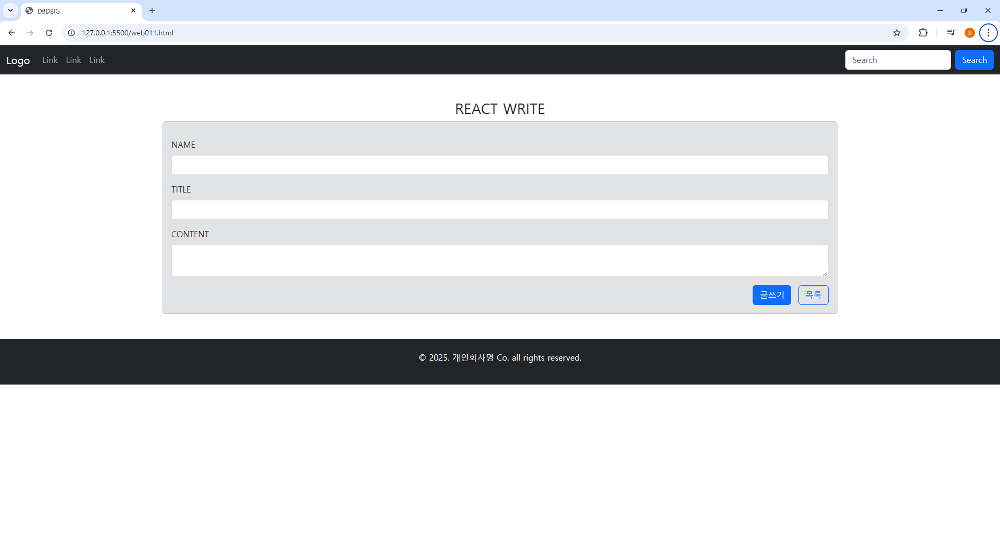

---
<!-- _class: aqua -->  

<pre class="codeblock">
&lt;!DOCTYPE html&gt;
&lt;html lang="ko"&gt;
&lt;head&gt;
  &lt;title&gt;DBDBIG&lt;/title&gt;
  &lt;meta charset="utf-8"&gt;
  &lt;meta name="viewport" content="width=device-width, initial-scale=1"&gt;
  &lt;!-- Latest compiled and minified CSS --&gt;
  &lt;link href="https://cdn.jsdelivr.net/npm/bootstrap@5.3.3/dist/css/bootstrap.min.css" rel="stylesheet"&gt;

  &lt;!-- Latest compiled JavaScript --&gt;
  &lt;script src="https://cdn.jsdelivr.net/npm/bootstrap@5.3.3/dist/js/bootstrap.bundle.min.js"&gt;&lt;/script&gt;
&lt;/head&gt;
&lt;body&gt;

  &lt;!-- header --&gt;
  &lt;nav class="navbar navbar-expand-sm navbar-dark bg-dark"&gt;
    &lt;div class="container-fluid"&gt;
      &lt;a class="navbar-brand" href="javascript:void(0)"&gt;Logo&lt;/a&gt;
      &lt;button class="navbar-toggler" type="button" data-bs-toggle="collapse" data-bs-target="#mynavbar"&gt;
        &lt;span class="navbar-toggler-icon"&gt;&lt;/span&gt;
      &lt;/button&gt;
      &lt;div class="collapse navbar-collapse" id="mynavbar"&gt;
        &lt;ul class="navbar-nav me-auto"&gt;
          &lt;li class="nav-item"&gt;
            &lt;a class="nav-link" href="javascript:void(0)"&gt;Link&lt;/a&gt;
          &lt;/li&gt;
          &lt;li class="nav-item"&gt;
            &lt;a class="nav-link" href="javascript:void(0)"&gt;Link&lt;/a&gt;
          &lt;/li&gt;
          &lt;li class="nav-item"&gt;
            &lt;a class="nav-link" href="javascript:void(0)"&gt;Link&lt;/a&gt;
          &lt;/li&gt;
        &lt;/ul&gt;
        &lt;form class="d-flex"&gt;
          &lt;input class="form-control me-2" type="text" placeholder="Search"&gt;
          &lt;button class="btn btn-primary" type="button"&gt;Search&lt;/button&gt;
        &lt;/form&gt;
      &lt;/div&gt;
    &lt;/div&gt;
  &lt;/nav&gt;

  &lt;!-- main --&gt;
  &lt;div class="container"&gt;
    &lt;h3 class="mt-5 text-center"&gt; REACT WRITE &lt;/h3&gt;

    &lt;div class="alert alert-secondary"&gt;
      &lt;div class="my-3"&gt;
        &lt;label for="bname" class="form-label"&gt;NAME&lt;/label&gt;
        &lt;input type="text" class="form-control" id="name" name="bname" /&gt;
      &lt;/div&gt;
      &lt;div class="my-3"&gt;
        &lt;label for="btitle" class="form-label"&gt;TITLE&lt;/label&gt;
        &lt;input type="text" class="form-control" id="btitle" name="btitle" /&gt;
      &lt;/div&gt;
      &lt;div class="my-3"&gt;
        &lt;label for="bcontent" class="form-label"&gt;CONTENT&lt;/label&gt;
        &lt;textarea class="form-control" id="bcontent" name="bcontent"&gt;&lt;/textarea&gt;
      &lt;/div&gt;
      &lt;div class="text-end"&gt;
        &lt;button class="btn btn-primary me-2"&gt;글쓰기&lt;/button&gt;
        &lt;a href="web010.html" title="글쓰러 바로가기 버튼" class="btn btn-outline-primary"&gt;목록&lt;/a&gt;
      &lt;/div&gt;
    &lt;/div&gt;
  &lt;/div&gt;

  &lt;!-- footer --&gt;
  &lt;div class="mt-5 p-4 bg-dark text-white text-center"&gt;
    &lt;p&gt;&copy; 2025. 개인회사명 Co. all rights reserved.&lt;/p&gt;
  &lt;/div&gt;

&lt;/body&gt;
&lt;/html&gt;

</pre>
 
  
 
---
<!-- _class: aqua -->  
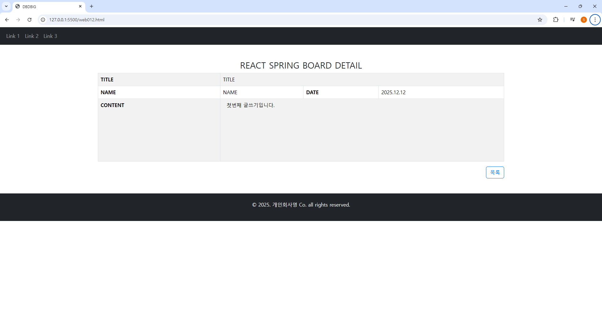

 
---
<!-- _class: aqua -->  

<pre class="codeblock">
&lt;!DOCTYPE html&gt;
&lt;html lang="ko"&gt;
&lt;head&gt;
  &lt;title&gt;DBDBIG&lt;/title&gt;
  &lt;meta charset="utf-8"&gt;
  &lt;meta name="viewport" content="width=device-width, initial-scale=1"&gt;
  &lt;!-- Latest compiled and minified CSS --&gt;
  &lt;link href="https://cdn.jsdelivr.net/npm/bootstrap@5.3.3/dist/css/bootstrap.min.css" rel="stylesheet"&gt;

  &lt;!-- Latest compiled JavaScript --&gt;
  &lt;script src="https://cdn.jsdelivr.net/npm/bootstrap@5.3.3/dist/js/bootstrap.bundle.min.js"&gt;&lt;/script&gt;
&lt;/head&gt;
&lt;body&gt;

  &lt;!-- header --&gt;
  &lt;nav class="navbar navbar-expand-sm bg-dark navbar-dark"&gt;
    &lt;div class="container-fluid"&gt;
      &lt;!-- Links --&gt;
      &lt;ul class="navbar-nav"&gt;
        &lt;li class="nav-item"&gt;
          &lt;a class="nav-link" href="#"&gt;Link 1&lt;/a&gt;
        &lt;/li&gt;
        &lt;li class="nav-item"&gt;
          &lt;a class="nav-link" href="#"&gt;Link 2&lt;/a&gt;
        &lt;/li&gt;
        &lt;li class="nav-item"&gt;
          &lt;a class="nav-link" href="#"&gt;Link 3&lt;/a&gt;
        &lt;/li&gt;
      &lt;/ul&gt;
    &lt;/div&gt;
  &lt;/nav&gt;

  &lt;!-- main --&gt;
  &lt;div class="container"&gt;
    &lt;h3 class="mt-5 text-center"&gt; REACT SPRING BOARD DETAIL&lt;/h3&gt;
    &lt;table class="table table-striped table-bordered table-hover"&gt;
      &lt;tbody&gt;
        &lt;tr&gt;
          &lt;th scope="row"&gt;TITLE&lt;/th&gt;
          &lt;td colspan="3"&gt; TITLE &lt;/td&gt;
        &lt;/tr&gt;
        &lt;tr&gt;
          &lt;th scope="row"&gt;NAME&lt;/th&gt;
          &lt;td&gt; NAME &lt;/td&gt;
          &lt;th scope="row"&gt;DATE&lt;/th&gt;
          &lt;td&gt; 2025.12.12&lt;/td&gt;
        &lt;/tr&gt;
        &lt;tr&gt;
          &lt;th scope="row"&gt;CONTENT&lt;/th&gt;
          &lt;td colspan="3" style="height:200px; white-space:pre-wrap"&gt; 첫번째 글쓰기입니다. &lt;/td&gt;
        &lt;/tr&gt;
      &lt;/tbody&gt;
    &lt;/table&gt;
    &lt;div class="text-end"&gt;
      &lt;a href="web010.html" title="글쓰러 바로가기 버튼" class="btn btn-outline-primary"&gt;목록&lt;/a&gt;
    &lt;/div&gt;
  &lt;/div&gt;

  &lt;!-- footer --&gt;
  &lt;div class="mt-5 p-4 bg-dark text-white text-center"&gt;
    &lt;p&gt;&copy; 2025. 개인회사명 Co. all rights reserved.&lt;/p&gt;
  &lt;/div&gt;

&lt;/body&gt;
&lt;/html&gt;

</pre>
 
 

 ---
<!-- _class: thanks -->
## 👋 열심히 들어주셔서 감사합니다!

> Bootstrap은 웹 개발의 기초이자 강력한 도구입니다  
> 그리드 시스템과 컴포넌트를 자유롭게 다뤄보세요!
> 오늘 배운 클래스 하나가
 **내일의 UI 혁신**이 될 수 있습니다  
> 오늘의 한 걸음이 **내일의 가능성**이 되길 바라며,  
> 그럼, 다음 이시간에 또 만나요!

 