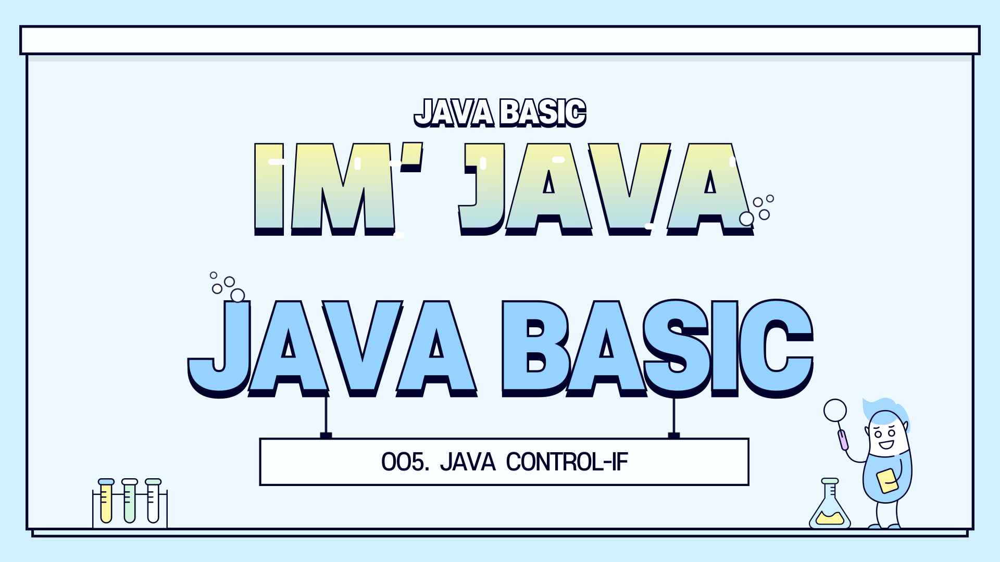
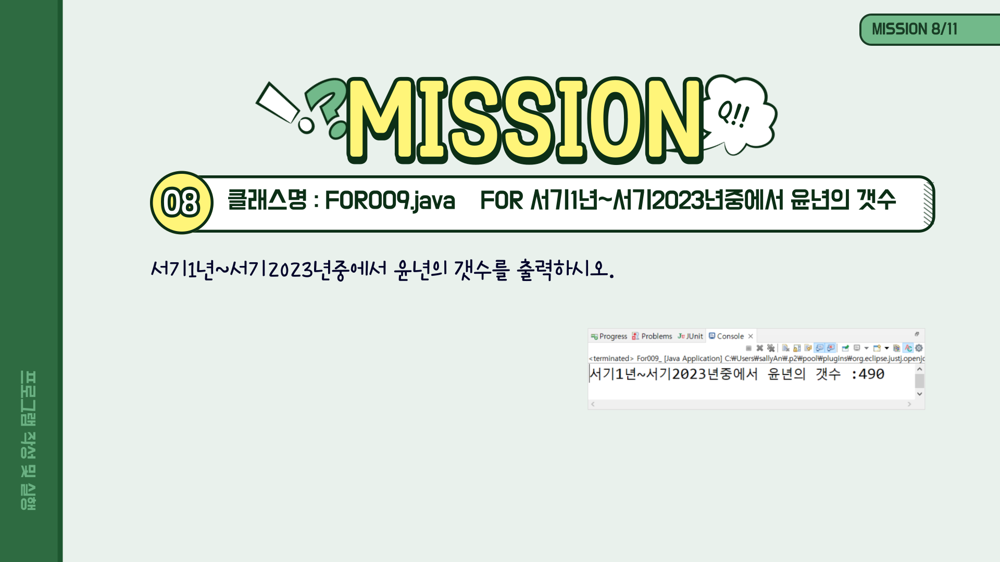

<!-- _class: cover-java -->
<h4 style="color:#6C757D;">
  🚀
  CodeCraft Series · Track 01
</h4>
<h1 style="color:#007BFF;">Java Essentials for Beginners</h1>
<h3 style="color:#17A2B8;">기초부터 객체지향까지, 자바의 모든 것</h3>

<!-- 현재 챕터 강조 -->

  📍 <strong>현재 위치:</strong> Chapter 4 · <em>제어문</em>

<blockquote>
  흐름을 제어하는 자바의 힘 
  조건문과 반복문으로 프로그램의 로직을 설계해요
</blockquote>

---
<!-- _class: cover-java --><h2 style="font-size:1.6em; color:#555;">📚 Java 기초 트랙 목차</h2>

  ▶ Chapter 1: 자바란? · 개발 환경 · 출력
  ▶ Chapter 2: 변수 · 자료형 · 입력
  ▶ Chapter 3: 연산자
  ✅▶ Chapter 4: 제어문
  ▶ Chapter 5: 배열
  ▶ Chapter 6: 메서드

  이 트랙은 자바의 기초 개념을  실습 중심으로 배우며, 이후 객체지향과 심화 개념으로 확장됩니다.

---
<!-- _class: orange -->
# 🧩 핵심개념 (1/5)  - if
- if
- switch
- for
- while, do while
- 다중 for

---
<!-- _class: aqua -->

---
<!-- _class: aqua -->

---
<!-- _class: aqua -->

---
<!-- _class: aqua -->

---
<!-- _class: aqua -->

---
<!-- _class: aqua -->

---
<!-- _class: aqua -->

---
<!-- _class: aqua -->

---
<!-- _class: aqua -->

---
<!-- _class: aqua -->

---
<!-- _class: aqua -->

---
<!-- _class: aqua -->

---
<!-- _class: aqua -->

---
<!-- _class: aqua -->

---
<!-- _class: aqua -->
## 🧩 Step 1: 핵심 개념 요약 (1/2)

| 항목     | 설명                                                   |
|----------|--------------------------------------------------------|
| 조건문   | 특정 조건에 따라 코드 실행 여부 결정   (if, else, switch) |
| 반복문   | 조건을 만족하는 동안 반복 실행   (for, while, do-while) |
| 흐름 제어 | 프로그램의 실행 순서를   제어하는 구조적 요소들         |

---
<!-- _class: aqua -->
## 🧩 Step 1: 핵심 개념 요약 (2/2)

| 항목     | 설명                                                   |
|----------|--------------------------------------------------------|
| if문     | 조건이 참일 때만 실행되는 블록                         |
| for문    | 반복 횟수가 정해진 반복문                              |
| while문  | 조건이 참인 동안 반복 실행                             |

> 이제 조건문과 반복문을 이해했어요. 다음은 직접 실습해보며 흐름을 제어해볼게요!

---
<!-- _class: aqua -->
## 개념 1: 조건문

- 🔍 if 문: 조건이 참일 때 실행  
- 🔁 else 문: 조건이 거짓일 때 실행  
- 🔄 switch 문: 여러 경우 중 하나 선택  
- 🧠 조건식은 true 또는 false를 반환해야 해요

---
<!-- _class: aqua -->
## 개념 2: 반복문

- 🔁 for 문: 반복 횟수가 명확할 때 사용  
- 🔄 while 문: 조건이 참인 동안 반복  
- 🔂 do-while 문: 최소 한 번은 실행되는 반복문  
- 🧮 반복문 안에서 조건문을 함께 사용할 수 있어요

---
<!-- _class: aqua -->
## 개념 3: 흐름 제어 키워드

- ⏹️ break: 반복문을 즉시 종료  
- 🔁 continue: 현재 반복을 건너뛰고 다음 반복으로  
- 🧭 흐름 제어는 코드의 실행 순서를 바꾸는 핵심 도구예요

---
<!-- _class: blue -->
# 🧪 Step 2: 코드 예제

---
<!-- _class: aqua -->

---
<!-- _class: aqua -->

---
<!-- _class: aqua -->

---
<!-- _class: aqua -->

---
<!-- _class: green -->
# 🛠️ Step 3: 실습 과제 (3)

---
<!-- _class: aqua -->

---
<!-- _class: aqua -->

---
<!-- _class: aqua -->

---
<!-- _class: aqua -->

---
<!-- _class: aqua -->

---
<!-- _class: aqua -->

---
<!-- _class: aqua -->

---
<!-- _class: aqua -->

---
<!-- _class: aqua -->

---
<!-- _class: blue -->
# 🧪 Step 2: 코드 예제

---
<!-- _class: aqua -->

---
<!-- _class: aqua -->

---
<!-- _class: aqua -->

---
<!-- _class: aqua -->

---
<!-- _class: aqua -->

---
<!-- _class: aqua -->

---
<!-- _class: aqua -->

---
<!-- _class: green -->
# 🛠️ Step 3: 실습 과제 (3)

---
<!-- _class: aqua -->

---
<!-- _class: aqua -->

---
<!-- _class: aqua -->

---
<!-- _class: aqua -->

---
<!-- _class: aqua -->

---
<!-- _class: aqua -->

---
<!-- _class: aqua -->

---
<!-- _class: orange -->
# 🧩 핵심개념 (2/5)  - switch
- if
- switch
- for
- while, do while
- 다중 for
---
<!-- _class: aqua -->

---
<!-- _class: aqua -->

---
<!-- _class: aqua -->

---
<!-- _class: aqua -->

---
<!-- _class: aqua -->

---
<!-- _class: blue -->
# 🧪 Step 2: 코드 예제

---
<!-- _class: aqua -->

---
<!-- _class: aqua -->

---
<!-- _class: aqua -->

---
<!-- _class: aqua -->

---
<!-- _class: aqua -->

---
<!-- _class: green -->
# 🛠️ Step 3: 실습 과제 (3)

---
<!-- _class: aqua -->

---
<!-- _class: aqua -->

---
<!-- _class: aqua -->

---
<!-- _class: aqua -->

---
<!-- _class: aqua -->

---
<!-- _class: aqua -->

---
<!-- _class: aqua -->

---
<!-- _class: aqua -->

---
<!-- _class: aqua -->

---
<!-- _class: aqua -->

---
<!-- _class: aqua -->

---
<!-- _class: aqua -->

---
<!-- _class: aqua -->

---
<!-- _class: aqua -->

---
<!-- _class: aqua -->

---
<!-- _class: aqua -->

---
<!-- _class: orange -->
# 🧩 핵심개념 (3/5)  - for
- if
- switch
- for
- while, do while
- 다중 for

---
<!-- _class: aqua -->

---
<!-- _class: aqua -->

---
<!-- _class: aqua -->

---
<!-- _class: aqua -->

---
<!-- _class: aqua -->

---
<!-- _class: aqua -->

---
<!-- _class: aqua -->

---
<!-- _class: blue -->
# 🧪 Step 2: 코드 예제

---
<!-- _class: aqua -->

---
<!-- _class: aqua -->

---
<!-- _class: aqua -->

---
<!-- _class: aqua -->

---
<!-- _class: green -->
# 🛠️ Step 3: 실습 과제 (3)

---
<!-- _class: aqua -->

---
<!-- _class: aqua -->

---
<!-- _class: aqua -->

---
<!-- _class: aqua -->

---
<!-- _class: aqua -->

---
<!-- _class: aqua -->

---
<!-- _class: aqua -->

---
<!-- _class: aqua -->

---
<!-- _class: aqua -->

---
<!-- _class: aqua -->

---
<!-- _class: aqua -->

---
<!-- _class: aqua -->

---
<!-- _class: aqua -->

---
<!-- _class: aqua -->

---
<!-- _class: aqua -->

---
<!-- _class: aqua -->

---
<!-- _class: aqua -->

---
<!-- _class: aqua -->

---
<!-- _class: aqua -->

---
<!-- _class: aqua -->

---
<!-- _class: blue -->
# 🧪 Step 2: 코드 예제

---
<!-- _class: aqua -->

---
<!-- _class: aqua -->

---
<!-- _class: aqua -->

---
<!-- _class: aqua -->

---
<!-- _class: green -->
# 🛠️ Step 3: 실습 과제 (3)

---
<!-- _class: aqua -->

---
<!-- _class: aqua -->

---
<!-- _class: aqua -->

---
<!-- _class: aqua -->

---
<!-- _class: aqua -->

---
<!-- _class: aqua -->

---
<!-- _class: aqua -->

---
<!-- _class: aqua -->

---
<!-- _class: orange -->
# 🧩 핵심개념 (4/5)  - while, do while
- if
- switch
- for
- while, do while
- 다중 for

---
<!-- _class: aqua -->

---
<!-- _class: aqua -->

---
<!-- _class: aqua -->

---
<!-- _class: aqua -->

---
<!-- _class: aqua -->

---
<!-- _class: aqua -->

---
<!-- _class: blue -->
# 🧪 Step 2: 코드 예제

---
<!-- _class: aqua -->

---
<!-- _class: aqua -->

---
<!-- _class: green -->
# 🛠️ Step 3: 실습 과제 (3)

---
<!-- _class: aqua -->

---
<!-- _class: aqua -->

---
<!-- _class: aqua -->

---
<!-- _class: aqua -->

---
<!-- _class: aqua -->

---
<!-- _class: aqua -->

---
<!-- _class: aqua -->

---
<!-- _class: aqua -->

---
<!-- _class: aqua -->

---
<!-- _class: aqua -->

---
<!-- _class: aqua -->

---
<!-- _class: aqua -->

---
<!-- _class: aqua -->

---
<!-- _class: aqua -->

---
<!-- _class: aqua -->

---
<!-- _class: aqua -->

---
<!-- _class: aqua -->

---
<!-- _class: aqua -->

---
<!-- _class: aqua -->

---
<!-- _class: aqua -->

---
<!-- _class: aqua -->

---
<!-- _class: aqua -->

---
<!-- _class: aqua -->

---
<!-- _class: aqua -->

---
<!-- _class: aqua -->

---
<!-- _class: aqua -->

---
<!-- _class: orange -->
# 🧩 핵심개념 (5/5)  - 다중 for
- if
- switch
- for
- while, do while
- 다중 for

---
<!-- _class: aqua -->

---
<!-- _class: aqua -->

---
<!-- _class: aqua -->

---
<!-- _class: aqua -->

---
<!-- _class: aqua -->

---
<!-- _class: aqua -->

---
<!-- _class: aqua -->

---
<!-- _class: blue -->
# 🧪 Step 2: 코드 예제

---
<!-- _class: aqua -->

---
<!-- _class: aqua -->

---
<!-- _class: aqua -->

---
<!-- _class: aqua -->

---
<!-- _class: green -->
# 🛠️ Step 3: 실습 과제 (3)

---
<!-- _class: aqua -->

---
<!-- _class: aqua -->

---
<!-- _class: aqua -->

---
<!-- _class: aqua -->

---
<!-- _class: aqua -->

---
<!-- _class: aqua -->

---
<!-- _class: aqua -->

---
<!-- _class: aqua -->

---
<!-- _class: aqua -->

---
<!-- _class: aqua -->

---
<!-- _class: aqua -->

---
<!-- _class: aqua -->

---
<!-- _class: aqua -->

---
<!-- _class: aqua -->

---
<!-- _class: aqua -->

---
<!-- _class: aqua -->

---
<!-- _class: aqua -->

---
<!-- _class: aqua -->

---
<!-- _class: aqua -->

---
<!-- _class: aqua -->

---
<!-- _class: aqua -->

---
<!-- _class: aqua -->

---
<!-- _class: aqua -->

---
<!-- _class: aqua -->

---
<!-- _class: aqua -->

---
<!-- _class: aqua -->

---
<!-- _class: aqua -->

---
<!-- _class: aqua -->

---
<!-- _class: aqua -->

---
<!-- _class: aqua -->

---
<!-- _class: aqua -->

---
<!-- _class: aqua -->

---
<!-- _class: aqua -->

---
<!-- _class: aqua -->

---
<!-- _class: aqua -->

---
<!-- _class: aqua -->

---
<!-- _class: aqua -->

---
<!-- _class: purple -->
# 💡 Step 4: 사고 확장

---
<!-- _class: aqua -->
## 💡 사고 질문: 제어문이 없다면?

---
<!-- _class: aqua -->
### 🤔 질문 1  
조건 없이 프로그램이 작동할 수 있을까요?

> 조건문은 프로그램의 판단력을 만들어줘요. 없으면 모든 상황에 똑같이 반응해요!

---
<!-- _class: aqua -->
### 🧠 질문 2  
반복문 없이 반복 작업을 어떻게 처리할까요?

> 반복문이 없다면 같은 코드를 여러 번 복사해야 해요. 비효율적이죠!

---
<!-- _class: red -->
# 🧠 Step 5: 기억 테스트

---
<!-- _class: aqua -->
## 퀴즈 1  조건문을 시작하는 키워드는?

- A. for  
- ✅ B. if  
- C. loop

---
<!-- _class: aqua -->
## 퀴즈 2  반복문 중 최소 한 번 실행되는 것은?

- A. while  
- ✅ B. do-while  
- C. for

---
<!-- _class: thanks -->
## 👋  열심히 들어주셔서 감사합니다!

> 이제 자바의 제어문까지 완벽하게 이해했어요  
> 다음은 배열을 통해 데이터를 효율적으로 관리하는 방법을 배워볼까요?  
> 오늘의 한 걸음이 **내일의 가능성**이 되길 바라며,

---
<!-- _class: aqua -->

