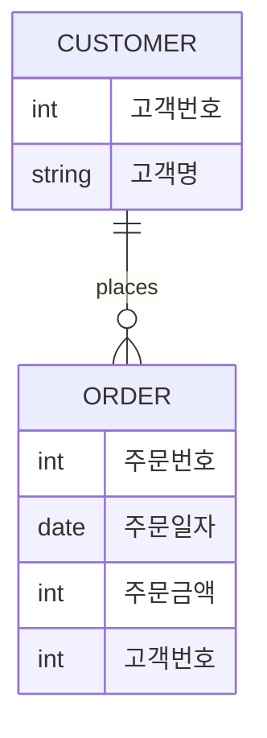

# 📚 데이터 모델링 문제 정리 및 해설

---

## 1️⃣ 문제 & 해설

### ❓ 문제 1
모델링의 필요성으로 가장 부적절한 것은?

**보기**
1. 데이터의 구조를 명확히 함으로써 사용자의 이해를 돕는다.  
2. 데이터의 중복을 최소화하여 저장 공간을 절약한다.  
3. 데이터의 일관성과 무결성을 유지할 수 있다.  
4. 데이터의 양을 증가시켜 시스템의 성능을 향상시킨다. ✅

**정답**: ④  
**해설**: 모델링은 성능 향상을 위해 데이터 양을 늘리는 것이 아니라, 중복을 줄이고 구조를 명확히 하여 효율성을 높이는 것이 목적입니다.

---

### ❓ 문제 2
데이터 모델링이 필요한 주요 이유로 가장 부적절한 것은?

**보기**
1. 데이터의 중복을 최소화하여 저장 공간을 절약한다.  
2. 데이터의 구조를 명확히 하여 사용자의 이해를 돕는다.  
3. 데이터의 일관성과 무결성을 유지할 수 있다.  
4. 데이터의 양을 증가시켜 시스템의 성능을 향상시킨다. ✅

**정답**: ④  
**해설**: 데이터 모델링은 데이터 양을 늘리는 것이 아니라, 중복을 줄이고 구조를 명확히 하여 효율적인 시스템을 만드는 것이 목적입니다.

---

### ❓ 문제 3
데이터 모델링 시 유의해야 할 사항으로 가장 부적절한 것은?

**보기**
1. 데이터의 중복성(Redundancy)  
2. 데이터의 비일관성(Inconsistency)  
3. 데이터의 일관성(Consistency) ✅  
4. 데이터의 무결성(Integrity)

**정답**: ③  
**해설**: 일관성과 무결성은 유지해야 할 요소이므로 '유의해야 할 사항'이 아니라 '지켜야 할 기준'입니다. 반면 중복성과 비일관성은 피해야 할 요소입니다.

---

### ❓ 문제 4
현실 세계를 얼마나 정확하게 반영하는가에 대한 데이터 모델의 특성은?

**보기**
1. 완전성 ✅  
2. 명확성  
3. 일관성  
4. 비현실성

**정답**: ①  
**해설**: 데이터 모델이 현실 세계를 빠짐없이 반영하는 정도를 나타내는 특성은 '완전성'입니다.

---

### ❓ 문제 5
(ㄱ) 현실 세계의 데이터를 분석하여 컴퓨터가 이해할 수 있도록 표현하는 것  
(ㄴ) 표현된 데이터를 컴퓨터 세계로 구현하는 것

**보기**
1. ㄱ - 개념적, ㄴ - 논리적  
2. ㄱ - 논리적, ㄴ - 개념적  
3. ㄱ - 물리적, ㄴ - 논리적  
4. ㄱ - 논리적, ㄴ - 물리적 ✅

**정답**: ④  
**해설**: 현실 세계의 데이터를 컴퓨터가 이해할 수 있도록 표현하는 단계는 '논리적 모델링', 이를 실제 시스템에 구현하는 단계는 '물리적 모델링'입니다.

---

## 📘 핵심 개념 요약

- **발생체(Entity)**: 현실 세계에서 존재하거나 사건으로 발생하는 정보의 대상 (예: 사람, 사물, 사건)
- **발생체의 특성**
  - 고유 식별자(ID)로 식별됨
  - 속성(Attribute)을 가짐
  - 다른 발생체와 관계(Relationship)를 가짐
- **데이터 모델링의 목적**
  - 구조 명확화
  - 중복 최소화
  - 일관성 및 무결성 유지
- **데이터 모델링의 유의점**
  - 중복성(Redundancy)
  - 비일관성(Inconsistency)

---

## 🧾 암기 요약 정리

| 개념 | 설명 |
|------|------|
| 발생체 | 현실 세계의 정보 대상 (사람, 사물, 사건 등) |
| 데이터 모델링 목적 | 구조 명확화, 중복 최소화, 일관성/무결성 유지 |
| 유의사항 | 중복성, 비일관성 피하기 |
| 완전성 | 현실 세계를 빠짐없이 반영 |
| 논리적 모델링 | 컴퓨터가 이해할 수 있도록 표현 |
| 물리적 모델링 | 표현된 데이터를 시스템에 구현 |


 
 
--- 

### ❓ 문제 6
ANSI-SPARC에서 정한 3단계 구조에서 아래 설명이 속하는 스키마 구조는?

> "데이터의 물리적 저장 구조를 정의하며, 저장 장치에 어떻게 저장되는지를 기술한다."

**보기**
1. 외부스키마  
2. 개념스키마  
3. 내부스키마 ✅

**정답**: ③  
**해설**: 내부스키마는 데이터가 실제로 저장되는 방식과 관련된 물리적 구조를 정의합니다.

---

### ❓ 문제 7
다음 중 고객과 주문의 ERD에 대한 설명으로 가장 적절한 것은?



**정답**: 고객과 주문은 1:N 관계이며, 고객이 주문을 한다는 관계로 연결된다. ✅  
**해설**: 고객이 여러 주문을 할 수 있으므로 1:N 관계가 성립합니다. 고객번호는 주문의 외래키로 사용됩니다.

---

### ❓ 문제 8
다음 중 ERD에 대한 설명으로 가장 부적절한 것은?

**보기**
1. ER 모델은 개체와 관계로 현실 세계를 표현한다.  
2. ERD는 개체-관계 모델을 도식화한 것이다.  
3. 개체는 사각형, 관계는 마름모로 표현한다.  
4. 관계는 개체의 특성을 나타내며 종속성을 의미한다. ✅

**정답**: ④  
**해설**: 관계는 개체 간의 연결을 나타내는 것이며, 개체의 특성을 나타내는 것은 속성입니다.

---

### ❓ 문제 9
다음 시나리오에서 가장 적절한 엔터티는?

> "A회사는 사원에 대한 정보를 관리하고 있다. 사원은 사번, 이름, 주소, 전화번호 등의 정보를 가진다."

**정답**: ② 사원은 엔터티이다 ✅  
**해설**: 사원은 관리 대상이 되는 정보의 단위이며, 속성과 관계를 가질 수 있는 개체이므로 엔터티입니다.

---

### ❓ 문제 10
다음 중 엔터티의 특징으로 가장 부적절한 것은?

**보기**
1. 업무에서 관리되어야 하는 정보로 구성된다.  
2. 반드시 두 개 이상의 속성을 가져야 한다. ✅  
3. 서로 구별이 가능해야 한다.  
4. 속성의 집합으로 구성된다.

**정답**: ②  
**해설**: 엔터티는 하나의 속성만으로도 존재할 수 있으며, 반드시 두 개 이상일 필요는 없습니다.

---

### ❓ 문제 11
다음 중 엔터티의 일반적인 특성으로 가장 부적절한 것은?

**보기**
ㄱ. 업무에서 필요로 하는 정보를 저장한다.  
ㄴ. 고유 식별자를 가지며, 서로 구별된다.  
ㄷ. 하나 이상의 속성을 가진다.  
ㄹ. 반드시 두 개 이상 존재해야 한다. ✅

**정답**: ㄹ  
**해설**: 엔터티는 하나만 존재해도 정의될 수 있으며, 개수는 필수 조건이 아닙니다.

---

### ❓ 문제 12
자신만의 고유한 주식별자를 가지며 사번, 교번, 주민등록번호 등을 사용하는 엔터티는?

**정답**: ② 강한 엔터티 ✅  
**해설**: 강한 엔터티는 다른 엔터티의 식별자에 의존하지 않고 독립적인 주식별자를 가집니다.

---

### ❓ 문제 13
엔터티 이름 부여 방식 중 가장 부적절한 것은?

**정답**: ㄹ. 생성 및 소멸 시점을 고려하여 이름을 부여한다 ✅  
**해설**: 이름은 일반적이고 유일해야 하며, 생성/소멸 시점은 이름 부여 기준이 아닙니다.

---

### ❓ 문제 14
업무에서 필요로 하는 인스턴스의 집합으로서 의미 단위를 나타내는 것은?

**정답**: ① 엔터티 ✅  
**해설**: 인스턴스의 집합은 엔터티이며, 속성은 그 내부 요소입니다.

---

### ❓ 문제 15
속성에 대한 설명으로 가장 부적절한 것은?

**정답**: ㄹ. 속성은 엔터티의 식별자를 구성할 수 없다 ✅  
**해설**: 속성은 식별자를 구성할 수 있으며, 기본키로 사용되기도 합니다.

---

### ❓ 문제 16
속성에 대한 설명 중 가장 부적절한 것은?

| 속성 유형     | 설명                                               |
|---------------|----------------------------------------------------|
| 기본키        | 각 튜플을 유일하게 식별함                         |
| 기본속성      | 계산되지 않은 원시 데이터                          |
| 파생속성      | 다른 속성으로부터 계산된 값                        |
| 외래키        | 다른 테이블의 기본키를 참조                        |

**정답**: ⑤ (외래키 설명이 중복됨) ✅  
**해설**: 외래키 설명이 중복되어 있으므로 부적절합니다.

---

### ❓ 문제 17
파생 속성의 값을 저장하지 않고 계산하여 사용하는 속성은?

**정답**: ① 파생속성 ✅  
**해설**: 파생속성은 다른 속성의 값을 기반으로 계산되며, 저장하지 않고 조회 시 계산됩니다.

---

### ❓ 문제 18
시스템이 자체적으로 유지하며 모든 객체 정보를 포함하는 데이터딕셔너리는?

**정답**: ① 시스템카탈로그 ✅  
**해설**: 시스템카탈로그는 테이블, 속성, 타입 등 시스템 내부 객체 정보를 저장하며, 사용자가 직접 접근할 수 없습니다.

---

## 📘 핵심 개념 요약

| 개념 | 설명 |
|------|------|
| 외부스키마 | 사용자 관점의 데이터 구조 |
| 개념스키마 | 전체 논리적 구조 |
| 내부스키마 | 물리적 저장 구조 |
| 엔터티 | 관리 대상 정보 단위 |
| 인스턴스 | 엔터티의 실제 데이터 |
| 속성 | 엔터티를 구성하는 정보 요소 |
| 강한 엔터티 | 독립적 식별자 보유 |
| 약한 엔터티 | 다른 엔터티에 의존 |
| 시스템카탈로그 | 시스템이 유지하는 객체 정보 |

---

## 🧾 암기 요약 정리

| 항목 | 키워드 | 설명 |
|------|--------|------|
| ERD 관계 | 1:N | 고객 → 주문 |
| 속성 분류 | 기본/파생/키/외래 | 속성의 역할 구분 |
| 스키마 구조 | 3단계 | 외부 / 개념 / 내부 |
| 데이터딕셔너리 | 시스템카탈로그 | 내부 객체 정보 저장 |
| 엔터티 이름 | 유일성, 일반성 | 생성/소멸 시점은 고려 ❌ |

```
 