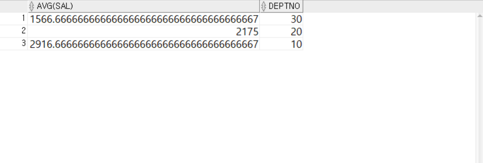

<!-- _class: cover-oracle -->
<h4 style="color:#6C757D;">
  🧠
  CodeCraft Series · Track 02
</h4>
<h1 style="color:#007BFF;">Oracle Fundamentals</h1>
<h3 style="color:#17A2B8;">SQL부터 PL/SQL까지, 오라클의 핵심을 잡다</h3>

<!-- 현재 챕터 강조 -->

  📍 <strong>현재 위치:</strong> Chapter 1 · <em>오라클 환경 설정 · 기본 SELECT</em>

<blockquote>
  실무에 바로 적용 가능한 오라클 입문서 
  데이터를 다루는 힘, SQL로 시작해요
</blockquote>

---
<!-- _class: cover-oracle -->
<h2 style="font-size:1.6em; color:#555;">📚 Oracle 트랙 목차</h2>
  <strong style="color:#FF6E7F;">PART 1 · SQL 기본</strong>

  ▶ Chapter 01: oracle_setting
  ▶ Chapter 02: select_basic
  ▶ Chapter 03: select_where
  ▶ Chapter 04: select_fn
  ✅▶ Chapter 05: select_group
  ▶ Chapter 06: select_join
  ▶ Chapter 07: select_subquery

---
<!-- _class: cover-oracle -->
<h2 style="font-size:1.6em; color:#555;">📚 Oracle 트랙 목차</h2>
 <strong style="color:#FF6E7F;">PART 2 · 데이터 조작 및 객체</strong> 

 
  ▶ Chapter 08: update_delete
  ▶ Chapter 09: transaction
  ▶ Chapter 10: ddl
  ▶ Chapter 11: object
  ▶ Chapter 12: constraint
  ▶ Chapter 13: user

---
<!-- _class: cover-oracle -->
<h2 style="font-size:1.6em; color:#555;">📚 Oracle 트랙 목차</h2>
<strong style="color:#FF6E7F;">PART 3 · PL/SQL 심화</strong>

  
  ▶ Chapter 14: plsql
  ▶ Chapter 15: record
  ▶ Chapter 16: cursor
  ▶ Chapter 17: save

  이 트랙은 오라클의 기본 SQL부터 객체 관리, PL/SQL까지  실무 중심으로 배우며, 데이터베이스 전문가로 성장합니다.

 

 
---

<!-- _class: orange -->
# 🧩 Step 1: 핵심 개념  
***SQL 집계 및 그룹 함수 실습***  
→ ***합계/평균/최대/최소/개수 계산***, ***그룹화***, ***ROLLUP/CUBE/PIVOT/UNPIVOT***, ***조건 필터링***

---

<!-- _class: aqua -->
### 🔢 집계 함수  
- SUM, AVG, MAX, MIN, COUNT : 합계, 평균, 최대값, 최소값, 개수 계산  
- DISTINCT, ALL 옵션으로 중복 제어 가능  

---

<!-- _class: aqua -->
### 🧮 그룹 함수  
- GROUP BY : 특정 열 기준으로 그룹화  
- HAVING : 그룹 조건 필터링  
- ROLLUP, CUBE, GROUPING SETS : 다차원 집계  
- GROUPING, GROUPING_ID : 집계 수준 확인  

---

<!-- _class: aqua -->
### 🔁 PIVOT / UNPIVOT  
- PIVOT : 행 데이터를 열로 변환  
- UNPIVOT : 열 데이터를 행으로 변환  
- DECODE 활용으로 PIVOT 유사 처리 가능  

---

<!-- _class: aqua -->
### 🧠 조건 필터링  
- WHERE : 행 조건 필터링  
- HAVING : 그룹 조건 필터링  
- NVL, NVL2 : NULL 처리  

---

<!-- _class: blue -->
# 🧪 Step 2: 코드 예제

---

<!-- _class: aqua -->

<pre class="codeblock">
-- 급여 합계
SELECT SUM(SAL) FROM EMP;

-- 부서별 평균급여
SELECT DEPTNO, AVG(SAL) FROM EMP GROUP BY DEPTNO;

-- 부서/직책별 평균급여
SELECT DEPTNO, JOB, AVG(SAL) FROM EMP GROUP BY DEPTNO, JOB;

-- ROLLUP 사용
SELECT DEPTNO, JOB, COUNT(*), MAX(SAL), SUM(SAL), AVG(SAL)
  FROM EMP
GROUP BY ROLLUP(DEPTNO, JOB);

-- CUBE 사용
SELECT DEPTNO, JOB, COUNT(*), MAX(SAL), SUM(SAL), AVG(SAL)
  FROM EMP
GROUP BY CUBE(DEPTNO, JOB);

-- GROUPING 함수
SELECT DEPTNO, JOB, GROUPING(DEPTNO), GROUPING(JOB)
  FROM EMP
GROUP BY CUBE(DEPTNO, JOB);

-- PIVOT 사용
SELECT * FROM (
  SELECT DEPTNO, JOB, SAL FROM EMP
) PIVOT (
  MAX(SAL) FOR DEPTNO IN (10, 20, 30)
);

-- UNPIVOT 사용
SELECT * FROM (
  SELECT DEPTNO,
         MAX(DECODE(JOB, 'CLERK', SAL)) AS CLERK,
         MAX(DECODE(JOB, 'MANAGER', SAL)) AS MANAGER
    FROM EMP
  GROUP BY DEPTNO
) UNPIVOT (
  SAL FOR JOB IN (CLERK, MANAGER)
);
</pre>

---

<!-- _class: aqua -->

## ✅ 함수 요약표

| 함수 | 설명 |
|------|------|
| SUM, AVG, MAX, MIN, COUNT | 집계 함수 |
| GROUP BY, HAVING | 그룹화 및 조건 필터링 |
| ROLLUP, CUBE, GROUPING SETS | 다차원 집계 |
| GROUPING, GROUPING_ID | 집계 수준 확인 |
| PIVOT, UNPIVOT | 행/열 변환 |
| NVL, NVL2 | NULL 처리 |

---

<!-- _class: green -->
# 🧪 Step 3: 연습문제

 

---
<!-- _class: aqua -->
##### Q001
- EMP 테이블에서 SUM 함수를 이용하여 급여 합계(SAL)를 출력하시오.

---
<!-- _class: aqua -->
<pre class="codeblock">
SELECT SUM(SAL)
  FROM EMP;
</pre>

---
<!-- _class: aqua -->
##### Q002
- EMP 테이블에서 SUM 함수를 이용하여 사원이름과 급여 합계를 출력하시오.  (에러)

---
<!-- _class: aqua -->
<pre class="codeblock">
SELECT ENAME, SUM(SAL)
  FROM EMP;
</pre>

---
<!-- _class: aqua -->
##### Q003
- EMP 테이블에서 SUM 함수를 이용하여 추가수당(COMM) 합계를 출력하시오.

---
<!-- _class: aqua -->
<pre class="codeblock">
SELECT SUM(COMM)
  FROM EMP;
</pre>

---
<!-- _class: aqua -->
##### Q004
- EMP 테이블에서 SUM  (DISTINCT, ALL)함수를 이용하여 급여 합계를 출력하시오.

---
<!-- _class: aqua -->
<pre class="codeblock">
SELECT SUM(DISTINCT SAL),
       SUM(ALL SAL),
       SUM(SAL)
  FROM EMP;
</pre>

---
<!-- _class: aqua -->
##### Q005
- EMP 테이블에서 COUNT를 이용하여 데이터의 갯수를 출력하시오.

---
<!-- _class: aqua -->
<pre class="codeblock">
SELECT COUNT(*)
  FROM EMP;
</pre>

---
<!-- _class: aqua -->
##### Q006
- EMP 테이블에서 COUNT를 이용하여 부서번호가(EMPNO) 30인  데이터의 갯수를 출력하시오.

---
<!-- _class: aqua -->
<pre class="codeblock">
SELECT COUNT(*)
  FROM EMP
 WHERE DEPTNO = 30;
</pre>

---
<!-- _class: aqua -->
##### Q007
- EMP 테이블에서 COUNT ( DISTINCT, ALL) 를 이용하여 데이터의 갯수를 출력하시오.

---
<!-- _class: aqua -->
<pre class="codeblock">
SELECT COUNT(DISTINCT SAL),
       COUNT(ALL SAL),
       COUNT(SAL)
  FROM EMP;
</pre>

---
<!-- _class: aqua -->
##### Q008
- EMP 테이블에서 COUNT를 이용하여 추가수당(COMM) 열의 갯수를  출력하시오.

---
<!-- _class: aqua -->
<pre class="codeblock">
SELECT COUNT(COMM)
  FROM EMP;
</pre>

---
<!-- _class: aqua -->
##### Q009
- EMP 테이블에서 COUNT를 이용하여 추가수당(COMM) 열의 갯수를  출력하시오.
- 위와 실행결과가 같음
- COUNT는 NULL 처리가 들어가 있음.

---
<!-- _class: aqua -->
<pre class="codeblock">
SELECT COUNT(COMM)
  FROM EMP
 WHERE COMM IS NOT NULL;
</pre>

---
<!-- _class: aqua -->
##### Q010
- EMP 테이블에서  MAX를 이용하여 부서번호(DEPTNO)가 10번인 사원들의 최대 급여를 출력하시오.

---
<!-- _class: aqua -->
<pre class="codeblock">
SELECT MAX(SAL)
  FROM EMP
 WHERE DEPTNO = 10;
</pre>

---
<!-- _class: aqua -->
##### Q011
- EMP 테이블에서   부서번호(DEPTNO)가  10번인 사원들의 최소 급여를 출력하시오.

---
<!-- _class: aqua -->
<pre class="codeblock">
SELECT MIN(SAL)
  FROM EMP
 WHERE DEPTNO = 10;
</pre>

---
<!-- _class: aqua -->
##### Q012
- EMP 테이블에서  부서번호가 20인 사원의 입사일(HIREDATE) 중 제일 최근 입사일을   출력하시오.

---
<!-- _class: aqua -->
<pre class="codeblock">
SELECT MAX(HIREDATE)
  FROM EMP
 WHERE DEPTNO = 20;
</pre>

---
<!-- _class: aqua -->
##### Q013
- EMP 테이블에서  부서번호가 20인 사원의 입사일(HIREDATE) 중 제일 오래된 입사일을   출력하시오.

---
<!-- _class: aqua -->
<pre class="codeblock">
SELECT MIN(HIREDATE)
  FROM EMP
 WHERE DEPTNO = 20;
</pre>

---
<!-- _class: aqua -->
##### Q014
- EMP 테이블에서  부서번호가 30인 사원의 평균급여를  출력하시오.

---
<!-- _class: aqua -->
<pre class="codeblock">
SELECT AVG(SAL)
  FROM EMP
 WHERE DEPTNO = 30;
</pre>

---
<!-- _class: aqua -->
##### Q015
- EMP 테이블에서  부서번호가 30인 사원의 DISTINCT로 중복을 제거한 급여 열의 평균급여를   출력하시오.

---
<!-- _class: aqua -->
<pre class="codeblock">
SELECT AVG(DISTINCT SAL)
  FROM EMP
 WHERE DEPTNO = 30;
</pre>

---
<!-- _class: aqua -->
##### Q016
- EMP 테이블에서
  집합연산자(UNION ALL)  를 사용하여 각 부서별 평균급여를   출력하시오.

---
<!-- _class: aqua -->
<pre class="codeblock">
SELECT AVG(SAL), '10' AS DEPTNO FROM EMP WHERE DEPTNO = 10
UNION ALL
SELECT AVG(SAL), '20' AS DEPTNO FROM EMP WHERE DEPTNO = 20
UNION ALL
SELECT AVG(SAL), '30' AS DEPTNO FROM EMP WHERE DEPTNO = 30;
</pre>

---
<!-- _class: aqua -->
##### Q017
- EMP 테이블에서  GROUP BY를 사용하여 부서별 평균급여를  출력하시오.

---
<!-- _class: aqua -->
<pre class="codeblock">
SELECT AVG(SAL), DEPTNO
  FROM EMP
GROUP BY DEPTNO;
</pre>

---
<!-- _class: aqua -->
##### Q018
- EMP 테이블에서  부서번호(DEPTNO) 및 직책별(JOB) 평균급여(SAL)로 정렬한 후    출력하시오.

---
<!-- _class: aqua -->
<pre class="codeblock">
SELECT DEPTNO, JOB, AVG(SAL)
  FROM EMP
GROUP BY DEPTNO, JOB
ORDER BY DEPTNO, JOB;

</pre>

---
<!-- _class: aqua -->
##### Q019
- EMP 테이블에서  GROUP BY절에 없는 열을  SELECT절에 포함하면 에러가 난다.

---
<!-- _class: aqua -->
<pre class="codeblock">
SELECT ENAME, DEPTNO, AVG(SAL)
  FROM EMP
GROUP BY DEPTNO;

</pre>

---
<!-- _class: aqua -->
##### Q020
- EMP 테이블에서  GROUP BY 와 HAVING 절을이용하여
  각부서의 직책별 평균급여를 구하되 그 평균급여가 2000이상인 그룹만  출력하시오.

---
<!-- _class: aqua -->
<pre class="codeblock">
SELECT DEPTNO, JOB, AVG(SAL)
  FROM EMP
GROUP BY DEPTNO, JOB
HAVING AVG(SAL) >= 2000
ORDER BY DEPTNO, JOB;

</pre>

---
<!-- _class: aqua -->
##### Q021
- 다음 코드가 오류나는 이유를 적으시오
- HAVING 절대신 WHERE절ㅇ르 잘못하면 하면 안됨!

---
<!-- _class: aqua -->
<pre class="codeblock">
SELECT DEPTNO, JOB, AVG(SAL)
  FROM EMP
 WHERE AVG(SAL) >= 2000
GROUP BY DEPTNO, JOB
ORDER BY DEPTNO, JOB;

</pre>

---
<!-- _class: aqua -->
##### Q022
- WHERE 절을 사용하지 않고 HAVING절만 사용한 경우우

---
<!-- _class: aqua -->
<pre class="codeblock">
SELECT DEPTNO, JOB, AVG(SAL)
  FROM EMP
GROUP BY DEPTNO, JOB
HAVING AVG(SAL) >= 2000
ORDER BY DEPTNO, JOB;

</pre>

---
<!-- _class: aqua -->
##### Q023
- WHERE절과 HAVING절을 모두 사용한경우

---
<!-- _class: aqua -->
<pre class="codeblock">
SELECT DEPTNO, JOB, AVG(SAL)
  FROM EMP
 WHERE SAL <= 3000
GROUP BY DEPTNO, JOB
HAVING AVG(SAL) >= 2000
ORDER BY DEPTNO, JOB;

</pre>

---
<!-- _class: aqua -->
##### Q024
- EMP 테이블에서
1. 부서별(큰그룹) 직책(소그룹)의
2. 사원수, 가장 높은 급여, 급여의 합, 평균급여를  출력하시오.

---
<!-- _class: aqua -->
<pre class="codeblock">
SELECT DEPTNO, JOB, COUNT(*), MAX(SAL), SUM(SAL), AVG(SAL)
  FROM EMP
GROUP BY DEPTNO, JOB
ORDER BY DEPTNO, JOB;

</pre>

---
<!-- _class: aqua -->
##### Q025
- EMP 테이블에서  ROLLUP 함수를 이용하여
1. 부서별(큰그룹) 직책(소그룹)의
2. 사원수, 가장 높은 급여, 급여의 합, 평균급여를  출력하시오.

---
<!-- _class: aqua -->
<pre class="codeblock">
SELECT DEPTNO, JOB, COUNT(*), MAX(SAL), SUM(SAL), AVG(SAL)
  FROM EMP
GROUP BY ROLLUP(DEPTNO, JOB);

</pre>

---
<!-- _class: aqua -->
##### Q026
- EMP 테이블에서  CUBE(DEPTNO, JOB) 함수를 이용하여
1. 부서별(큰그룹) 직책(소그룹)의
2. 사원수, 가장 높은 급여, 급여의 합, 평균급여를  출력하시오.

---
<!-- _class: aqua -->

---
<!-- _class: aqua -->
<pre class="codeblock">
SELECT DEPTNO, JOB, COUNT(*), MAX(SAL), SUM(SAL), AVG(SAL)
  FROM EMP
GROUP BY CUBE(DEPTNO, JOB)
ORDER BY DEPTNO, JOB;

</pre>

---
<!-- _class: aqua -->
##### Q027
- EMP 테이블에서
1. DEPTNO를 먼저 그룹화한후   ROLLUP 함수에 JOB을 지정하여
2. 사원수를  출력하시오.

---
<!-- _class: aqua -->

---
<!-- _class: aqua -->
<pre class="codeblock">
SELECT DEPTNO, JOB, COUNT(*)
  FROM EMP
GROUP BY DEPTNO, ROLLUP(JOB);

</pre>

---
<!-- _class: aqua -->
##### Q028
- EMP 테이블에서
1. JOB을 먼저 그룹화한후   ROLLUP 함수에 DEPTNO을 지정하여
2. 사원수를  출력하시오.

---
<!-- _class: aqua -->

---
<!-- _class: aqua -->
<pre class="codeblock">
SELECT DEPTNO, JOB, COUNT(*)
  FROM EMP
GROUP BY JOB, ROLLUP(DEPTNO);

</pre>

---
<!-- _class: aqua -->
##### Q029
- EMP 테이블에서
1. GROUPING SETS (DEPTNO, JOB) 함수를 사용하여
2. 열별 그룹으로 묶어어 결과로 출력하시오.

---
<!-- _class: aqua -->

---
<!-- _class: aqua -->
<pre class="codeblock">
SELECT DEPTNO, JOB, COUNT(*)
  FROM EMP
GROUP BY GROUPING SETS(DEPTNO, JOB)
ORDER BY DEPTNO, JOB;

</pre>

---
<!-- _class: aqua -->
##### Q030
- EMP 테이블에서 DEPTNO JOB열의 그룹화결과를 GROUPING 함수로  출력하시오.

---
<!-- _class: aqua -->
<pre class="codeblock">
SELECT DEPTNO, JOB, COUNT(*), MAX(SAL), SUM(SAL), AVG(SAL),
       GROUPING(DEPTNO),
       GROUPING(JOB)
  FROM EMP
GROUP BY CUBE(DEPTNO, JOB)
ORDER BY DEPTNO, JOB;

</pre>

---
<!-- _class: aqua -->
##### Q031
- DECODE문으로 GROUPING 함수를 적용하여 결과를 표기하시오오

---
<!-- _class: aqua -->
<pre class="codeblock">
SELECT DECODE(GROUPING(DEPTNO), 1, 'ALL_DEPT', DEPTNO) AS DEPTNO,
       DECODE(GROUPING(JOB), 1, 'ALL_JOB', JOB) AS JOB,
       COUNT(*), MAX(SAL), SUM(SAL), AVG(SAL)
  FROM EMP
GROUP BY CUBE(DEPTNO, JOB)
ORDER BY DEPTNO, JOB;

</pre>

---
<!-- _class: aqua -->
##### Q032
- DEPTNO, JOB을 함께 명시한 GROUPING_ID 함수를 사용하시오.

---
<!-- _class: aqua -->
<pre class="codeblock">
SELECT DEPTNO, JOB, COUNT(*), SUM(SAL),
       GROUPING(DEPTNO),
       GROUPING(JOB),
       GROUPING_ID(DEPTNO, JOB)
  FROM EMP
GROUP BY CUBE(DEPTNO, JOB)
ORDER BY DEPTNO, JOB;

</pre>

---
<!-- _class: aqua -->
##### Q033
- EMP 테이블에서  GROUP BY로 그룹화하여 부서번호와 사원이름을   출력하시오.

---
<!-- _class: aqua -->
<pre class="codeblock">
SELECT DEPTNO, ENAME
FROM EMP
GROUP BY DEPTNO, ENAME;

</pre>

---
<!-- _class: aqua -->
##### Q034
- EMP 테이블에서  부서별 사원이름을 나란히 나열하여   출력하시오.
1. LISTAGG( 나열할 열, 구분자)
2. WITHIN GROUP(ORDER BY 나열할 열의 정렬기준)

---
<!-- _class: aqua -->

---
<!-- _class: aqua -->
<pre class="codeblock">
SELECT DEPTNO,
       LISTAGG(ENAME, ', ')
       WITHIN GROUP(ORDER BY SAL DESC) AS ENAMES
  FROM EMP
GROUP BY DEPTNO;

</pre>

---
<!-- _class: aqua -->
##### Q035  
- EMP 테이블에서 부서, 직책별 그룹화하여 최고급여데이터를 출력하시오

---
<!-- _class: aqua -->
<pre class="codeblock">
SELECT DEPTNO, JOB, MAX(SAL)
  FROM EMP
GROUP BY DEPTNO, JOB
ORDER BY DEPTNO, JOB;

</pre>

---
<!-- _class: aqua -->
##### Q036   
- EMP 테이블에서  PIVOT함수를 사용하여  직책별* 부서별 최고급여를 2차원 표 형태로  출력하시오

---
<!-- _class: aqua -->
<pre class="codeblock">
SELECT *
  FROM(sql
SELECT DEPTNO, JOB, SAL
         FROM EMP)
PIVOT(MAX(SAL)
      FOR DEPTNO IN (10, 20, 30)
      )
ORDER BY JOB;

</pre>

---
<!-- _class: aqua -->
##### Q037  
- EMP 테이블에서  PIVOT함수를 사용하여  부서별*직책책별 최고급여를 2차원 표 형태로  출력하시오

---
<!-- _class: aqua -->
<pre class="codeblock">
SELECT *
  FROM(sql
SELECT JOB, DEPTNO, SAL
         FROM EMP)
PIVOT(MAX(SAL)
     FOR JOB IN ('CLERK' AS CLERK,
                 'SALESMAN' AS SALESMAN,
                 'PRESIDENT' AS PRESIDENT,
                 'MANAGER' AS MANAGER,
                 'ANALYST' AS ANALYST)
     )
ORDER BY DEPTNO;

</pre>

---
<!-- _class: aqua -->
##### Q038  
- EMP 테이블에서  DECODE문을 활용하여 PIVOT 함수와 같은 결과를  출력하시오

---
<!-- _class: aqua -->
<pre class="codeblock">
SELECT DEPTNO,
       MAX(DECODE(JOB, 'CLERK', SAL)) AS "CLERK",
       MAX(DECODE(JOB, 'SALESMAN', SAL)) AS "SALESMAN",
       MAX(DECODE(JOB, 'PRESIDENT', SAL)) AS "PRESIDENT",
       MAX(DECODE(JOB, 'MANAGER', SAL)) AS "MANAGER",
       MAX(DECODE(JOB, 'ANALYST', SAL)) AS "ANALYST"
  FROM EMP
GROUP BY DEPTNO
ORDER BY DEPTNO;

</pre>

---
<!-- _class: aqua -->
##### Q039    
- EMP 테이블에서  UNPIVOT 활용하여 열로 구분된 그룹을 행으로  출력하시오

---
<!-- _class: aqua -->
<pre class="codeblock">
SELECT *
  FROM(
SELECT DEPTNO,
              MAX(DECODE(JOB, 'CLERK' , SAL)) AS "CLERK",
              MAX(DECODE(JOB, 'SALESMAN' , SAL)) AS "SALESMAN",
              MAX(DECODE(JOB, 'PRESIDENT', SAL)) AS "PRESIDENT",
              MAX(DECODE(JOB, 'MANAGER' , SAL)) AS "MANAGER",
              MAX(DECODE(JOB, 'ANALYST' , SAL)) AS "ANALYST"
         FROM EMP
       GROUP BY DEPTNO
       ORDER BY DEPTNO)
UNPIVOT(
   SAL FOR JOB IN (CLERK, SALESMAN, PRESIDENT, MANAGER,ANALYST))
ORDER BY DEPTNO, JOB;
</pre>

---
<!-- _class: purple -->
# 사고확장EX

---
<!-- _class: aqua -->
##### Ex001
- EMP 테이블을 이용하여 다음과 같이 출력하시오.
1. 부서번호(DEPTNO) , 평균급여(AVG_SAL) , 최고급여(MAX_SAL) , 최저급여(MIN_SAL) , 사원수(CNT) 를 조회하시오
2. 평균급여를 출력시 소수점을 제외하고 각 부서번호별로 출력하시오.

---
<!-- _class: aqua -->

---
<!-- _class: aqua -->
<pre class="codeblock">
SELECT DEPTNO,
       TRUNC(AVG(SAL)) AS AVG_SAL,
       MAX(SAL) AS MAX_SAL,
       MIN(SAL) AS MIN_SAL,
       COUNT(*) AS CNT
  FROM EMP
GROUP BY DEPTNO;
</pre>

---
<!-- _class: aqua -->
##### Ex002
- EMP 테이블을 이용하여 다음과 같이 출력하시오.
- 같은직책(JOB)에 종사하는 사원이 3명 이상인 직책과 인원수를 출력하시오.

---
<!-- _class: aqua -->
<pre class="codeblock">
SELECT JOB,
       COUNT(*)
  FROM EMP
GROUP BY JOB
HAVING COUNT(*) >= 3;
</pre>

---
<!-- _class: aqua -->
##### Ex003
- EMP 테이블을 이용하여 다음과 같이 출력하시오.
- 사원들의 입사년도(HIRE_YEAR)를 기준으로 부서별 몇명이 입사했는지 조회하시오.

---
<!-- _class: aqua -->
<pre class="codeblock">
SELECT TO_CHAR(HIREDATE, 'YYYY') AS HIRE_YEAR,
       DEPTNO,
       COUNT(*) AS CNT
  FROM EMP
GROUP BY TO_CHAR(HIREDATE, 'YYYY'), DEPTNO;
</pre>

---
<!-- _class: aqua -->
##### Ex004
- EMP 테이블을 이용하여 다음과 같이 출력하시오.
- 추가수당(COMM)을 받는 사원수와 받지않는 사원수를 조회하시오.

---
<!-- _class: aqua -->
<pre class="codeblock">
SELECT NVL2(COMM, 'O', 'X') AS EXIST_COMM,  COUNT(*) AS CNT
  FROM EMP
GROUP BY NVL2(COMM, 'O', 'X');
</pre>

---
<!-- _class: aqua -->
##### Ex005
- EMP 테이블을 이용하여 다음과 같이 출력하시오.
1. 각 부서의 입사연도별 사원수, 최고급여, 급여합, 평균급여를 출력하고
2. 각 부서별 소계와 총계를 출력하시오. (ROLLUP)

---
<!-- _class: aqua -->

---
<!-- _class: aqua -->
<pre class="codeblock">
SELECT DEPTNO,
       TO_CHAR(HIREDATE, 'YYYY') AS HIRE_YEAR,
       COUNT(*) AS CNT,
       MAX(SAL) AS MAX_SAL,
       SUM(SAL) AS SUM_SAL,
       AVG(SAL) AS AVG_SAL
  FROM EMP
GROUP BY ROLLUP(DEPTNO, TO_CHAR(HIREDATE, 'YYYY'));
</pre>

---

<!-- _class: aqua -->

1. GROUP BY DEPTNO, JOB 은 어떤 기준으로 그룹화하나요?  
2. HAVING AVG(SAL) >= 2000 은 어떤 조건을 의미하나요?  
3. ROLLUP(DEPTNO, JOB) 은 어떤 결과를 생성하나요?  
4. GROUPING_ID(DEPTNO, JOB) 은 어떤 정보를 제공하나요?  
5. PIVOT(MAX(SAL) FOR DEPTNO IN (10, 20, 30)) 은 어떤 형태로 결과를 출력하나요?

---

<!-- _class: red -->
# 🧪 Step 5: 기억 테스트

---

<!-- _class: aqua -->

- GROUP BY 와 HAVING 의 차이는 무엇인가요?  
- ROLLUP 과 CUBE 는 어떤 차이가 있나요?  
- GROUPING 함수는 어떤 용도로 사용되나요?  
- PIVOT 과 UNPIVOT 은 각각 어떤 작업을 하나요?  
- NVL2(COMM, 'O', 'X') 는 어떤 상황에서 유용한가요?
 

---
<!-- _class: thanks -->
## 👋 열심히 들어주셔서 감사합니다!
 
> 오늘의 한 걸음이 **내일의 가능성**이 되길 바라며, 