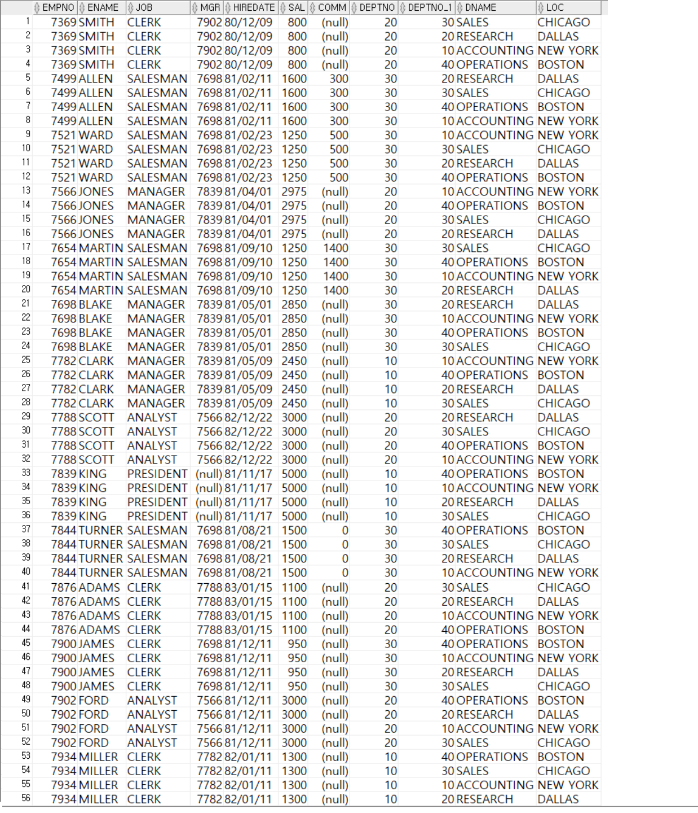
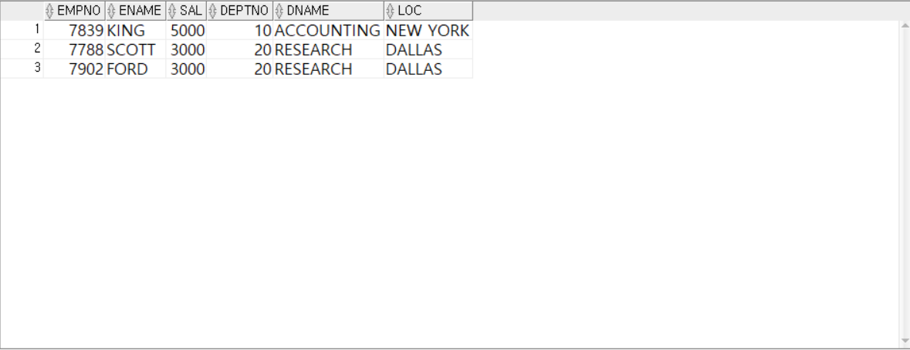
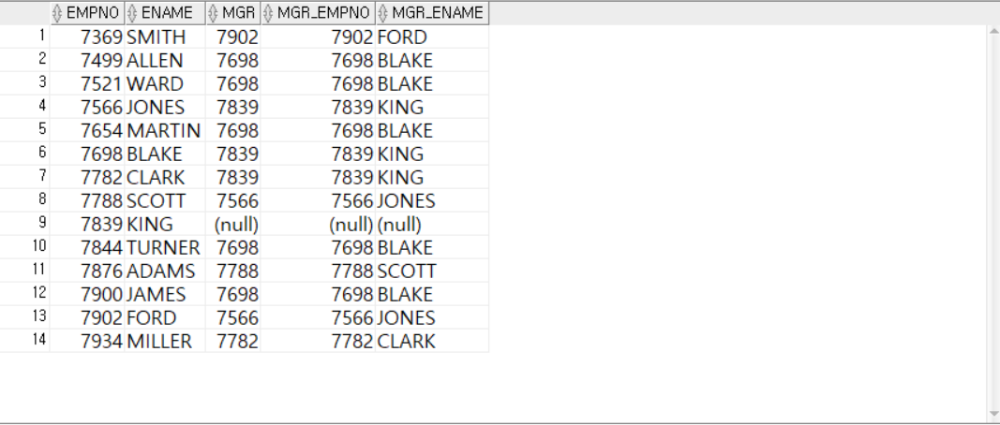
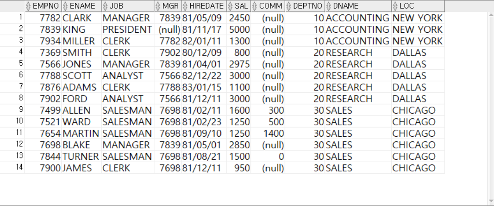
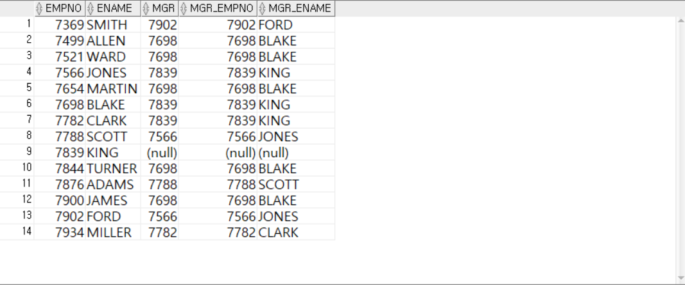
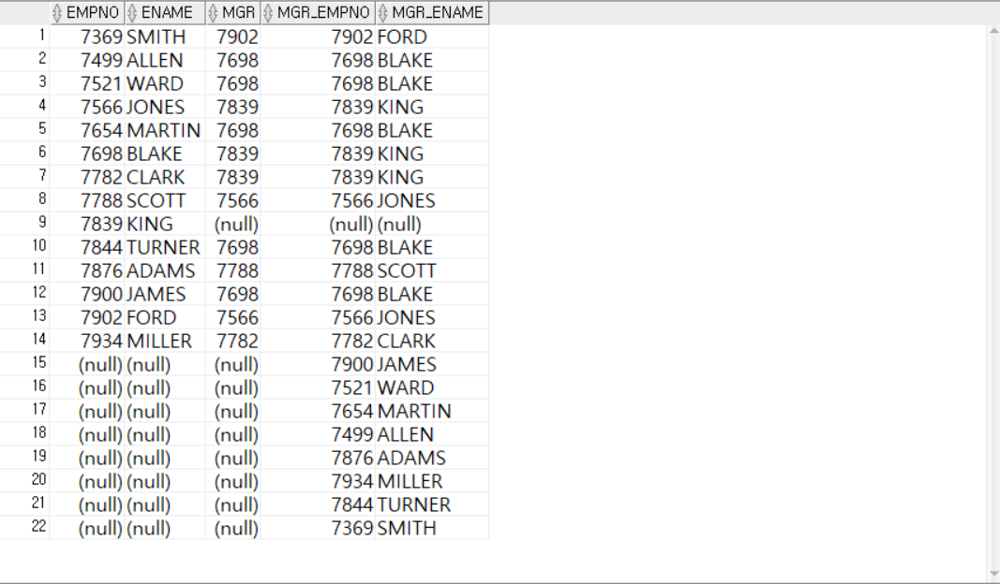
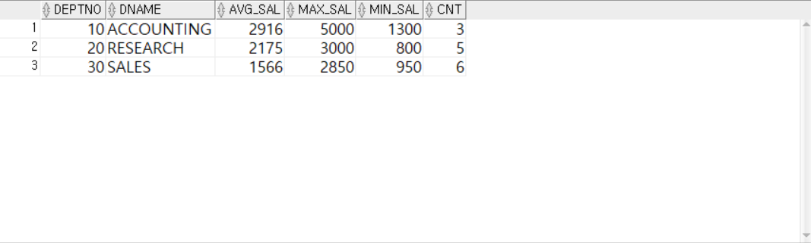

<!-- _class: cover-oracle -->
<h4 style="color:#6C757D;">
  🧠
  CodeCraft Series · Track 02
</h4>
<h1 style="color:#007BFF;">Oracle Fundamentals</h1>
<h3 style="color:#17A2B8;">SQL부터 PL/SQL까지, 오라클의 핵심을 잡다</h3>

<!-- 현재 챕터 강조 -->

  📍 <strong>현재 위치:</strong> Chapter 1 · <em>오라클 환경 설정 · 기본 SELECT</em>

<blockquote>
  실무에 바로 적용 가능한 오라클 입문서 
  데이터를 다루는 힘, SQL로 시작해요
</blockquote>

---
<!-- _class: cover-oracle -->
<h2 style="font-size:1.6em; color:#555;">📚 Oracle 트랙 목차</h2>
  <strong style="color:#FF6E7F;">PART 1 · SQL 기본</strong>

  ▶ Chapter 01: oracle_setting
  ▶ Chapter 02: select_basic
  ▶ Chapter 03: select_where
  ▶ Chapter 04: select_fn
  ▶ Chapter 05: select_group
  ✅▶ Chapter 06: select_join
  ▶ Chapter 07: select_subquery

---
<!-- _class: cover-oracle -->
<h2 style="font-size:1.6em; color:#555;">📚 Oracle 트랙 목차</h2>
 <strong style="color:#FF6E7F;">PART 2 · 데이터 조작 및 객체</strong> 

 
  ▶ Chapter 08: update_delete
  ▶ Chapter 09: transaction
  ▶ Chapter 10: ddl
  ▶ Chapter 11: object
  ▶ Chapter 12: constraint
  ▶ Chapter 13: user

---
<!-- _class: cover-oracle -->
<h2 style="font-size:1.6em; color:#555;">📚 Oracle 트랙 목차</h2>
<strong style="color:#FF6E7F;">PART 3 · PL/SQL 심화</strong>

  
  ▶ Chapter 14: plsql
  ▶ Chapter 15: record
  ▶ Chapter 16: cursor
  ▶ Chapter 17: save

  이 트랙은 오라클의 기본 SQL부터 객체 관리, PL/SQL까지  실무 중심으로 배우며, 데이터베이스 전문가로 성장합니다.

 

 
---

<!-- _class: orange -->
# 🧩 Step 1: 핵심 개념  
***SQL 조인 실습***  
→ ***등가 조인***, ***비등가 조인***, ***자체 조인***, ***외부 조인***, ***ANSI 조인***

---

<!-- _class: aqua -->
### 🔗 등가 조인 (Equi Join)  
- 두 테이블의 공통 컬럼을 기준으로 동일한 값을 가진 행을 연결  
- WHERE 절 또는 ON 절에서 = 사용  
- 예: EMP.DEPTNO = DEPT.DEPTNO

---

<!-- _class: aqua -->
### 🔀 비등가 조인 (Non-Equi Join)  
- 공통 컬럼이 아닌 범위 조건 등으로 조인  
- 예: SAL BETWEEN LOSAL AND HISAL

---

<!-- _class: aqua -->
### 🔁 자체 조인 (Self Join)  
- 같은 테이블을 두 번 참조하여 조인  
- 별칭(alias)을 사용해 구분  
- 예: EMP E1, EMP E2

---

<!-- _class: aqua -->
### 🧩 외부 조인 (Outer Join)  
- 매칭되지 않는 행도 포함  
- LEFT, RIGHT, FULL OUTER JOIN  
- Oracle 전통 방식: (+) 기호 사용

---

<!-- _class: aqua -->
### 🧠 ANSI 조인  
- SQL 표준 방식의 조인  
- INNER JOIN, LEFT OUTER JOIN, RIGHT OUTER JOIN, FULL OUTER JOIN  
- ON 절로 조건 명시

---

<!-- _class: blue -->
# 🧪 Step 2: 코드 예제

---

<!-- _class: aqua -->

<pre class="codeblock">
-- 등가 조인
SELECT E.ENAME, D.DNAME
  FROM EMP E, DEPT D
 WHERE E.DEPTNO = D.DEPTNO;

-- 비등가 조인
SELECT E.ENAME, S.GRADE
  FROM EMP E, SALGRADE S
 WHERE E.SAL BETWEEN S.LOSAL AND S.HISAL;

-- 자체 조인
SELECT E1.ENAME AS 사원, E2.ENAME AS 관리자
  FROM EMP E1, EMP E2
 WHERE E1.MGR = E2.EMPNO;

-- 외부 조인 (Oracle 방식)
SELECT E.ENAME, D.DNAME
  FROM EMP E, DEPT D
 WHERE E.DEPTNO = D.DEPTNO(+);

-- ANSI 방식 조인
SELECT E.ENAME, D.DNAME
  FROM EMP E
  LEFT OUTER JOIN DEPT D
    ON E.DEPTNO = D.DEPTNO;

-- FULL OUTER JOIN
SELECT E.ENAME, D.DNAME
  FROM EMP E
  FULL OUTER JOIN DEPT D
    ON E.DEPTNO = D.DEPTNO;
</pre>

---

<!-- _class: aqua -->

## ✅ 조인 요약표

| 조인 유형 | 설명 |
|-----------|------|
| 등가 조인 | 공통 컬럼 값이 같은 행 연결 |
| 비등가 조인 | 범위 조건 등으로 연결 |
| 자체 조인 | 같은 테이블 내 관계 표현 |
| 외부 조인 | 매칭되지 않는 행도 포함 |
| ANSI 조인 | 표준 SQL 방식의 조인 |

---

<!-- _class: green -->
# 🧪 Step 3: 연습문제

 

---
<!-- _class: aqua -->
##### Q001
- EMP, DEPT 테이블을 이용하여
  FROM 절에 여러 테이블을 선언해해   다음과 같이 출력하시오

---
<!-- _class: aqua -->
<pre class="codeblock">
SELECT *
  FROM EMP, DEPT
ORDER BY EMPNO;

</pre>

---
<!-- _class: aqua -->
##### Q002
- EMP, DEPT 테이블을 이용하여
  EMP의 DEPTNO와 DEPT테이블의 DEPTNO가 같은 데이터를  다음과 같이 출력하시오

---
<!-- _class: aqua -->
<pre class="codeblock">
SELECT *
  FROM EMP, DEPT
 WHERE EMP.DEPTNO = DEPT.DEPTNO
ORDER BY EMPNO;

</pre>

---
<!-- _class: aqua -->
##### Q003
- EMP, DEPT 테이블을 이용하여
  FROM 절에  EMP 테이블의 별칭은 E, DEPT 테이블의 별칭은 D로   다음과 같이 출력하시오

---
<!-- _class: aqua -->
<pre class="codeblock">
SELECT *
  FROM EMP E, DEPT D
 WHERE E.DEPTNO = D.DEPTNO
ORDER BY EMPNO;

</pre>

---
<!-- _class: aqua -->
##### Q004
- EMP, DEPT 테이블을 이용하여
  두테이블에 부서번호가 같은 열의이름이 포함되었을때  다음과 같이 출력하시오   (에러발생)

---
<!-- _class: aqua -->
<pre class="codeblock">
SELECT EMPNO, ENAME, DEPTNO, DNAME, LOC
  FROM EMP E, DEPT D
 WHERE E.DEPTNO = D.DEPTNO;

</pre>

---
<!-- _class: aqua -->
##### Q005
- EMP, DEPT 테이블을 이용하여
  열 이름에 각각의 테이블 이름도 함께 명시시 다음과 같이 출력하시오   ( 위의 문제 해결 )

---
<!-- _class: aqua -->
<pre class="codeblock">
SELECT E.EMPNO, E.ENAME, D.DEPTNO, D.DNAME, D.LOC
  FROM EMP E, DEPT D
 WHERE E.DEPTNO = D.DEPTNO
ORDER BY D.DEPTNO, E.EMPNO;

</pre>

---
<!-- _class: aqua -->
##### Q006
- EMP, DEPT 테이블을 이용하여
  급여가 3000이상인 사원의  사원번호, 이름, 급여, 근무부서를   다음과 같이 출력하시오

---
<!-- _class: aqua -->
<pre class="codeblock">
SELECT E.EMPNO, E.ENAME, E.SAL, D.DEPTNO, D.DNAME, D.LOC
  FROM EMP E, DEPT D
 WHERE E.DEPTNO = D.DEPTNO
   AND SAL >= 3000;

</pre>

---
<!-- _class: aqua -->
##### Q007
- EMP, SALGRADE 테이블을 이용하여
  유저 정보, 급여등급 , 그 등급의 최소급여와 최대급여를  다음과 같이 출력하시오

---
<!-- _class: aqua -->
<pre class="codeblock">
select * from emp
</pre>
---
<!-- _class: aqua -->
<pre class="codeblock">
select * from salgrade
</pre>
---
<!-- _class: aqua -->
<pre class="codeblock">
SELECT *
  FROM EMP E, SALGRADE S
 WHERE E.SAL BETWEEN S.LOSAL AND S.HISAL;

</pre>

---
<!-- _class: aqua -->
##### Q008
- EMP테이블을 2번 이용하여
  사원정보(EMPNO, ENAME, MGR) 와  직속상관(EMPNO, ENAME)의 사원번호를 다음과 같이 출력하시오

---
<!-- _class: aqua -->
<pre class="codeblock">
SELECT E1.EMPNO, E1.ENAME, E1.MGR,
       E2.EMPNO AS MGR_EMPNO,
       E2.ENAME AS MGR_ENAME
  FROM EMP E1, EMP E2
 WHERE E1.MGR = E2.EMPNO;

</pre>

---
<!-- _class: aqua -->
##### Q009
- EMP테이블을 2번 이용하여
1.  사원정보(EMPNO, ENAME, MGR) 와  직속상관(EMPNO, ENAME)의 사원번호를 다음과 같이 출력하시오
2.  직속상관이 없는 사원의 정보도 출력하시오

---
<!-- _class: aqua -->

---
<!-- _class: aqua -->
<pre class="codeblock">
SELECT E1.EMPNO, E1.ENAME, E1.MGR,
       E2.EMPNO AS MGR_EMPNO,
       E2.ENAME AS MGR_ENAME
  FROM EMP E1, EMP E2
 WHERE E1.MGR = E2.EMPNO(+)
ORDER BY E1.EMPNO;

</pre>

---
<!-- _class: aqua -->
##### Q010
-  (+)의 위치를 바꿔서 출력해보고 다음이 의미하는 바를 적으시오

---
<!-- _class: aqua -->
<pre class="codeblock">
SELECT E1.EMPNO, E1.ENAME, E1.MGR,
       E2.EMPNO AS MGR_EMPNO,
       E2.ENAME AS MGR_ENAME
  FROM EMP E1, EMP E2
 WHERE E1.MGR(+) = E2.EMPNO
ORDER BY E1.EMPNO;

</pre>

---
<!-- _class: aqua -->
##### Q011 표준문법 (NATURAL JOIN)
- EMP , DEPT 테이블 이용하여
  EMPNO, ENAME, JOB, MGR, HIREDATE, SAL, COMM를 다음과 같이 출력하시오
1.   NATURAL JOIN
  - 알아서 두 테이블의 이름과 자료형이 같은 열을 찾은 후
  - 그 열을 기준으로 등가조인을 해주는 방식

---
<!-- _class: aqua -->

---
<!-- _class: aqua -->
<pre class="codeblock">
SELECT E.EMPNO, E.ENAME, E.JOB, E.MGR, E.HIREDATE, E.SAL, E.COMM,
       DEPTNO, D.DNAME, D.LOC
  FROM EMP E NATURAL JOIN DEPT D
ORDER BY DEPTNO, E.EMPNO;

</pre>

---
<!-- _class: aqua -->
##### Q012 표준문법 (JOIN USING)
- EMP , DEPT 테이블 이용하여
  EMPNO, ENAME, JOB, MGR, HIREDATE, SAL, COMM를 다음과 같이 출력하시오
1.  JOIN USING
  - USING에 조인기준열 명시
  - 그 열을 기준으로 등가조인을 해주는 방식

---
<!-- _class: aqua -->

---
<!-- _class: aqua -->
<pre class="codeblock">
SELECT E.EMPNO, E.ENAME, E.JOB, E.MGR, E.HIREDATE, E.SAL, E.COMM,
       DEPTNO, D.DNAME, D.LOC
  FROM EMP E JOIN DEPT D USING (DEPTNO)
 WHERE SAL >= 3000
ORDER BY DEPTNO, E.EMPNO;

</pre>

---
<!-- _class: aqua -->
##### Q013  표준문법 (JOIN ON)
- EMP , DEPT 테이블 이용하여 EMPNO, ENAME, JOB, MGR, HIREDATE, SAL, COMM를 다음과 같이 출력하시오

 
 

1. JOIN ON
- ON에  조인기준열 명시
- 그 열을 기준으로 등가조인을 해주는 방식

---
<!-- _class: aqua -->

---
<!-- _class: aqua -->
<pre class="codeblock">
SELECT E.EMPNO, E.ENAME, E.JOB, E.MGR, E.HIREDATE, E.SAL, E.COMM,
       E.DEPTNO,
       D.DNAME, D.LOC
  FROM EMP E JOIN DEPT D ON (E.DEPTNO = D.DEPTNO)
 WHERE SAL <= 3000
ORDER BY E.DEPTNO, EMPNO;

</pre>

---
<!-- _class: aqua -->
##### Q014   표준문법 (LEFT OUTER JOIN )
- EMP테이블을 2번 이용하여 테이블 이용하여  다음과 같이 출력하시오

1.  LEFT OUTER JOIN
  - 왼쪽 외부조인을 기준으로 NULL보장

---
<!-- _class: aqua -->
<pre class="codeblock">
SELECT E1.EMPNO, E1.ENAME, E1.MGR,
       E2.EMPNO AS MGR_EMPNO,
       E2.ENAME AS MGR_ENAME
  FROM EMP E1 LEFT OUTER JOIN EMP E2 ON (E1.MGR = E2.EMPNO)
ORDER BY E1.EMPNO;

</pre>

---
<!-- _class: aqua -->
##### Q015 표준문법 (RIGHT OUTER JOIN )
- EMP테이블을 2번 이용하여 테이블 이용하여  다음과 같이 출력하시오
1.  RIGHT OUTER JOIN- 오른른쪽 외부조인을 기준으로 NULL보장

---
<!-- _class: aqua -->
<pre class="codeblock">
SELECT E1.EMPNO, E1.ENAME, E1.MGR,
       E2.EMPNO AS MGR_EMPNO,
       E2.ENAME AS MGR_ENAME
  FROM EMP E1 RIGHT OUTER JOIN EMP E2 ON (E1.MGR = E2.EMPNO)
ORDER BY E1.EMPNO, MGR_EMPNO;

</pre>

---
<!-- _class: aqua -->
##### Q016 표준문법 (FULL OUTER JOIN )
- EMP테이블을 2번  이용하여  다음과 같이 출력하시오
1.  FULL OUTER JOIN - 양쪽모두두 외부조인을 기준으로 NULL보장

---
<!-- _class: aqua -->

---
<!-- _class: aqua -->
<pre class="codeblock">
SELECT E1.EMPNO, E1.ENAME, E1.MGR,
       E2.EMPNO AS MGR_EMPNO,
       E2.ENAME AS MGR_ENAME
  FROM EMP E1 FULL OUTER JOIN EMP E2 ON (E1.MGR = E2.EMPNO)
ORDER BY E1.EMPNO;
</pre>

---
<!-- _class: purple -->
# 사고확장EX

---
<!-- _class: aqua -->
##### EX001
- EMP, DEPT 테이블을 이용하여
  SQL-99 이전 방식다음 , SQL-99방식  두가지 방식으로 다음과 같이 출력하시오.
1. 급여(SAL)이 2000초과인 사원들의 부서정보, 사원정보를 출력하시오.

---
<!-- _class: aqua -->
##### SQL-99 이전 방식

---
<!-- _class: aqua -->
<pre class="codeblock">
SELECT D.DEPTNO, D.DNAME, E.EMPNO, E.ENAME, E.SAL
  FROM EMP E, DEPT D
 WHERE E.DEPTNO = D.DEPTNO
   AND E.SAL > 2000;
</pre>

---
<!-- _class: aqua -->
##### SQL-99방식

---
<!-- _class: aqua -->
<pre class="codeblock">
SELECT DEPTNO, D.DNAME, E.EMPNO, E.ENAME, E.SAL
  FROM EMP E NATURAL JOIN DEPT D
 WHERE E.SAL > 2000;
</pre>

---
<!-- _class: aqua -->
##### EX002
- EMP, DEPT 테이블을 이용하여
  SQL-99 이전 방식다음 , SQL-99방식  두가지 방식으로 다음과 같이 출력하시오.
1. 각 부서별 평균급여, 최대급여, 사원수를 출력하시오.

---
<!-- _class: aqua -->
##### SQL-99 이전 방식

---
<!-- _class: aqua -->
<pre class="codeblock">
SELECT D.DEPTNO,
       D.DNAME,
       TRUNC(AVG(SAL)) AS AVG_SAL,
       MAX(SAL) AS MAX_SAL,
       MIN(SAL) AS MIN_SAL,
       COUNT(*) AS CNT
  FROM EMP E, DEPT D
 WHERE E.DEPTNO = D.DEPTNO
GROUP BY D.DEPTNO, D.DNAME;
</pre>

---
<!-- _class: aqua -->
##### SQL-99 방식

---
<!-- _class: aqua -->
<pre class="codeblock">
SELECT DEPTNO,
       D.DNAME,
       TRUNC(AVG(SAL)) AS AVG_SAL,
       MAX(SAL) AS MAX_SAL,
       MIN(SAL) AS MIN_SAL,
       COUNT(*) AS CNT
  FROM EMP E JOIN DEPT D USING (DEPTNO)
GROUP BY DEPTNO, D.DNAME;
</pre>

---
<!-- _class: aqua -->
##### EX003
- EMP, DEPT 테이블을 이용하여
  SQL-99 이전 방식다음 , SQL-99방식  두가지 방식으로 다음과 같이 출력하시오.
1. 모든 부서정보와 사원정보를  부서번호, 사원이름 순으로 정렬해  출력하시오.

---
<!-- _class: aqua -->
##### SQL-99 이전 방식

---
<!-- _class: aqua -->
<pre class="codeblock">
SELECT D.DEPTNO, D.DNAME, E.EMPNO, E.ENAME, E.JOB, E.SAL
  FROM EMP E, DEPT D
 WHERE E.DEPTNO(+) = D.DEPTNO
ORDER BY D.DEPTNO, E.ENAME;
</pre>
---
<!-- _class: aqua -->
##### SQL-99 방식

---
<!-- _class: aqua -->
<pre class="codeblock">
SELECT D.DEPTNO, D.DNAME, E.EMPNO, E.ENAME, E.JOB, E.SAL
  FROM EMP E RIGHT OUTER JOIN DEPT D ON (E.DEPTNO = D.DEPTNO)
ORDER BY D.DEPTNO, E.ENAME;
</pre>

---
<!-- _class: aqua -->
##### EX004
- EMP, DEPT 테이블을 이용하여
  SQL-99 이전 방식다음 , SQL-99방식  두가지 방식으로 다음과 같이 출력하시오.
1. 모든 부서정보와 사원정보, 급여등급정보, 각사원의 직속상관의 정보를
2. 부서번호, 사원번호 순서로 정렬해  출력하시오.

---
<!-- _class: aqua -->
##### SQL-99 이전 방식

---
<!-- _class: aqua -->
<pre class="codeblock">
SELECT D.DEPTNO, D.DNAME,
       E.EMPNO, E.ENAME, E.MGR, E.SAL, E.DEPTNO,
       S.LOSAL, S.HISAL, S.GRADE,
       E2.EMPNO AS MGR_EMPNO, E2.ENAME AS MGR_ENAME
  FROM EMP E, DEPT D, SALGRADE S, EMP E2
 WHERE E.DEPTNO(+) = D.DEPTNO
   AND E.SAL BETWEEN S.LOSAL(+) AND S.HISAL(+)
   AND E.MGR = E2.EMPNO(+)
ORDER BY D.DEPTNO, E.EMPNO;
</pre>
---
<!-- _class: aqua -->
##### SQL-99방식

---
<!-- _class: aqua -->
<pre class="codeblock">
SELECT D.DEPTNO, D.DNAME,
       E.EMPNO, E.ENAME, E.MGR, E.SAL, E.DEPTNO,
       S.LOSAL, S.HISAL, S.GRADE,
       E2.EMPNO AS MGR_EMPNO, E2.ENAME AS MGR_ENAME
  FROM EMP E RIGHT OUTER JOIN DEPT D
                ON (E.DEPTNO = D.DEPTNO)
              LEFT OUTER JOIN SALGRADE S
                ON (E.SAL BETWEEN S.LOSAL AND S.HISAL)
              LEFT OUTER JOIN EMP E2
                ON (E.MGR = E2.EMPNO)
ORDER BY D.DEPTNO, E.EMPNO;
</pre>

---

<!-- _class: aqua -->

1. EMP E, DEPT D WHERE E.DEPTNO = D.DEPTNO 는 어떤 조인인가요?  
2. E.SAL BETWEEN S.LOSAL AND S.HISAL 은 어떤 조인 방식인가요?  
3. E1.MGR = E2.EMPNO 는 어떤 관계를 나타내나요?  
4. LEFT OUTER JOIN 과 RIGHT OUTER JOIN 의 차이는 무엇인가요?  
5. (+) 기호는 어떤 상황에서 사용되나요?

---

<!-- _class: red -->
# 🧪 Step 5: 기억 테스트

---

<!-- _class: aqua -->

- 등가 조인과 비등가 조인의 차이는 무엇인가요?  
- 자체 조인은 어떤 경우에 사용되나요?  
- Oracle 외부 조인 방식과 ANSI 방식의 차이는 무엇인가요?  
- FULL OUTER JOIN 은 어떤 결과를 반환하나요?  
- INNER JOIN 과 OUTER JOIN 은 어떤 상황에서 선택하나요?
 

---
<!-- _class: thanks -->
## 👋 열심히 들어주셔서 감사합니다!
 
> 오늘의 한 걸음이 **내일의 가능성**이 되길 바라며, 