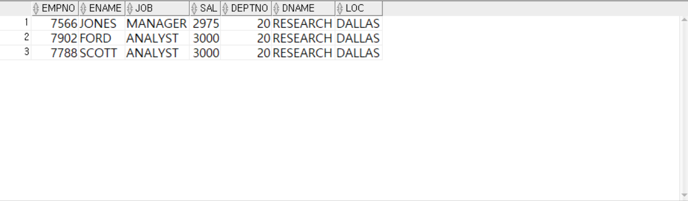
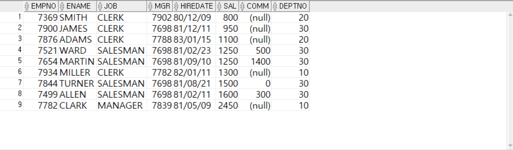
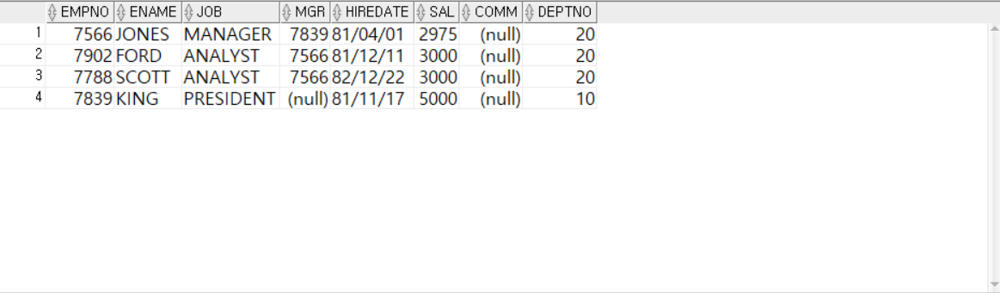
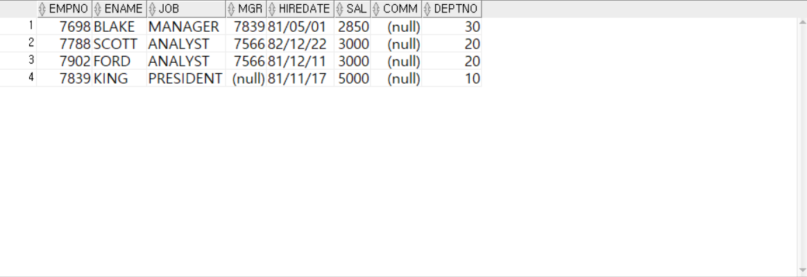
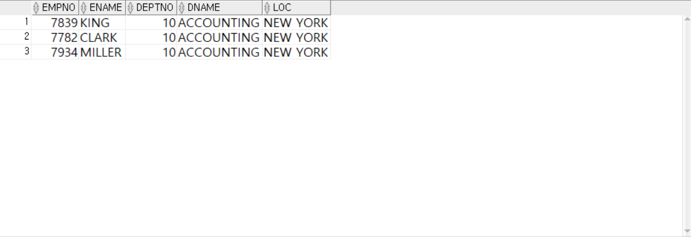
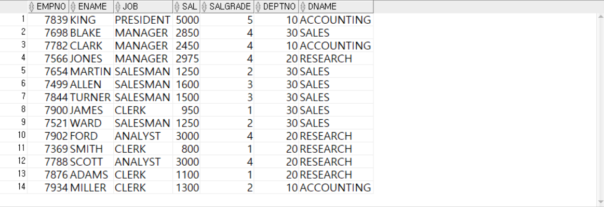
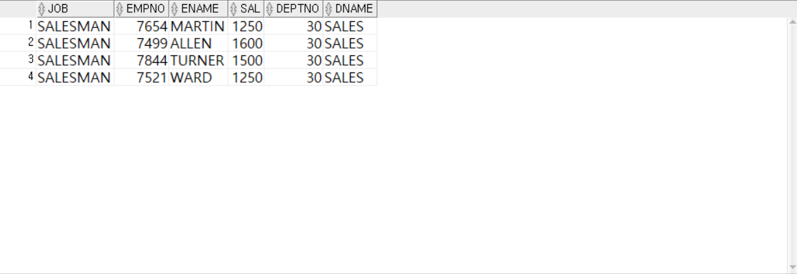
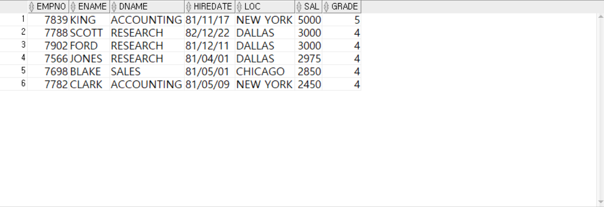
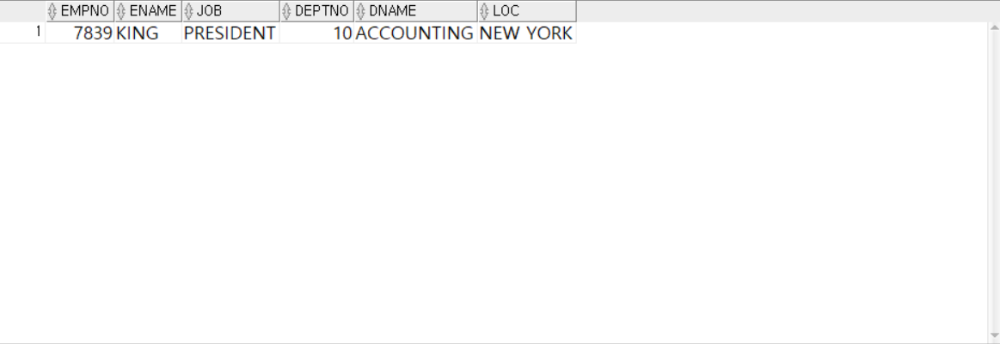

<!-- _class: cover-oracle -->
<h4 style="color:#6C757D;">
  🧠
  CodeCraft Series · Track 02
</h4>
<h1 style="color:#007BFF;">Oracle Fundamentals</h1>
<h3 style="color:#17A2B8;">SQL부터 PL/SQL까지, 오라클의 핵심을 잡다</h3>

<!-- 현재 챕터 강조 -->

  📍 <strong>현재 위치:</strong> Chapter 1 · <em>오라클 환경 설정 · 기본 SELECT</em>

<blockquote>
  실무에 바로 적용 가능한 오라클 입문서 
  데이터를 다루는 힘, SQL로 시작해요
</blockquote>

---
<!-- _class: cover-oracle -->
<h2 style="font-size:1.6em; color:#555;">📚 Oracle 트랙 목차</h2>
  <strong style="color:#FF6E7F;">PART 1 · SQL 기본</strong>

  ▶ Chapter 01: oracle_setting
  ▶ Chapter 02: select_basic
  ▶ Chapter 03: select_where
  ▶ Chapter 04: select_fn
  ▶ Chapter 05: select_group
  ▶ Chapter 06: select_join
  ✅▶ Chapter 07: select_subquery

---
<!-- _class: cover-oracle -->
<h2 style="font-size:1.6em; color:#555;">📚 Oracle 트랙 목차</h2>
 <strong style="color:#FF6E7F;">PART 2 · 데이터 조작 및 객체</strong> 

 
  ▶ Chapter 08: update_delete
  ▶ Chapter 09: transaction
  ▶ Chapter 10: ddl
  ▶ Chapter 11: object
  ▶ Chapter 12: constraint
  ▶ Chapter 13: user

---
<!-- _class: cover-oracle -->
<h2 style="font-size:1.6em; color:#555;">📚 Oracle 트랙 목차</h2>
<strong style="color:#FF6E7F;">PART 3 · PL/SQL 심화</strong>

  
  ▶ Chapter 14: plsql
  ▶ Chapter 15: record
  ▶ Chapter 16: cursor
  ▶ Chapter 17: save

  이 트랙은 오라클의 기본 SQL부터 객체 관리, PL/SQL까지  실무 중심으로 배우며, 데이터베이스 전문가로 성장합니다.

 

 
 
---

<!-- _class: orange -->
# 🧩 Step 1: 핵심 개념  
***SQL 서브쿼리 실습***  
→ ***단일 행 서브쿼리***, ***다중 행 서브쿼리***, ***다중 열 서브쿼리***, ***상관 서브쿼리***, ***IN/EXISTS 서브쿼리***

---

<!-- _class: aqua -->
### 🔍 단일 행 서브쿼리  
- 하나의 결과만 반환  
- =, >, <, >=, <=, <> 등 비교 연산자 사용  
- 예: WHERE SAL > (SELECT AVG(SAL) FROM EMP)

---

<!-- _class: aqua -->
### 🔁 다중 행 서브쿼리  
- 여러 결과를 반환  
- IN, ANY, ALL, EXISTS 사용  
- 예: WHERE JOB IN (SELECT JOB FROM EMP WHERE DEPTNO = 10)

---

<!-- _class: aqua -->
### 🧩 다중 열 서브쿼리  
- 여러 컬럼을 동시에 비교  
- 예: WHERE (DEPTNO, JOB) IN (SELECT DEPTNO, JOB FROM EMP WHERE SAL > 3000)

---

<!-- _class: aqua -->
### 🔄 상관 서브쿼리  
- 외부 쿼리의 값을 내부 쿼리에서 참조  
- 내부 쿼리가 외부 쿼리의 각 행마다 실행됨  
- 예: WHERE SAL > (SELECT AVG(SAL) FROM EMP WHERE DEPTNO = E.DEPTNO)

---

<!-- _class: aqua -->
### 🧠 EXISTS 서브쿼리  
- 조건 만족 여부만 판단  
- 결과 존재 여부에 따라 TRUE/FALSE 반환  
- 예: WHERE EXISTS (SELECT 1 FROM EMP WHERE MGR IS NULL)

---

<!-- _class: blue -->
# 🧪 Step 2: 코드 예제

---

<!-- _class: aqua -->

<pre class="codeblock">
-- 단일 행 서브쿼리
SELECT ENAME, SAL
  FROM EMP
 WHERE SAL > (SELECT AVG(SAL) FROM EMP);

-- 다중 행 서브쿼리
SELECT ENAME, JOB
  FROM EMP
 WHERE JOB IN (SELECT JOB FROM EMP WHERE DEPTNO = 10);

-- 다중 열 서브쿼리
SELECT ENAME, DEPTNO, JOB
  FROM EMP
 WHERE (DEPTNO, JOB) IN (
       SELECT DEPTNO, JOB
         FROM EMP
        WHERE SAL > 3000);

-- 상관 서브쿼리
SELECT ENAME, SAL, DEPTNO
  FROM EMP E
 WHERE SAL > (SELECT AVG(SAL)
                FROM EMP
               WHERE DEPTNO = E.DEPTNO);

-- EXISTS 서브쿼리
SELECT DNAME
  FROM DEPT D
 WHERE EXISTS (
       SELECT 1
         FROM EMP E
        WHERE D.DEPTNO = E.DEPTNO);
</pre>

---

<!-- _class: aqua -->

## ✅ 서브쿼리 요약표

| 서브쿼리 유형 | 설명 |
|---------------|------|
| 단일 행 서브쿼리 | 하나의 결과 비교 |
| 다중 행 서브쿼리 | 여러 결과 비교 |
| 다중 열 서브쿼리 | 여러 컬럼 동시 비교 |
| 상관 서브쿼리 | 외부 쿼리 참조 |
| EXISTS 서브쿼리 | 존재 여부 판단 |

---

<!-- _class: green -->
# 🧪 Step 3: 연습문제

 

---
<!-- _class: aqua -->
##### Q001
- EMP 테이블에서 다음과 같이 출력하시오.
1. 사원이름이 JONES 인 사원의 급여를 출력하시오.

---
<!-- _class: aqua -->
##### Q002
- EMP 테이블에서 다음과 같이 출력하시오.
1. 급여가 2975보다 높은 사원정보를  출력하시오.

---
<!-- _class: aqua -->
##### Q003
- EMP 테이블에서 다음과 같이 출력하시오.
1. JONES의 급여보다
2. 높은급여를 받는  사원정보를  출력하시오.

---
<!-- _class: aqua -->
##### Q004
- EMP 테이블에서 다음과 같이 출력하시오.
1. SCOTT보다 빨리 입사한 사원목록을   출력하시오.

---
<!-- _class: aqua -->
##### Q005
- EMP 테이블에서 다음과 같이 출력하시오.
1. 20번부서에 속한 사원 중
2. 전체사원의 평균급여보다 높은 급여를받는 사원정보와 소속부서정보를  출력하시오.

---
<!-- _class: aqua -->
##### Q006
- EMP 테이블에서 다음과 같이 출력하시오.
1. 부서번호가 20이거나 30인 사원의 정보를 출력하시오.

---
<!-- _class: aqua -->
##### Q007
- EMP 테이블에서 다음과 같이 출력하시오.
1. 각 부서별 최고급여와 동일한 급열르 받는 사원정보를 출력하시오.

---
<!-- _class: aqua -->
##### Q008
- EMP 테이블에서 다음과 같이 출력하시오.
1. 부서번호 별로 최대 급여를 출력하시오.
2. 7번문제가 잘풀렸는지 확인하시오.

---
<!-- _class: aqua -->
##### Q009
- EMP 테이블에서 다음과 같이 출력하시오.
1. ANY 연산자를 이용하여 다음과같이 출력해보시오

---
<!-- _class: aqua -->
##### Q010
- EMP 테이블에서 다음과 같이 출력하시오.
1. ANY 연산자를 이용하여 다음과같이 출력해보시오

---
<!-- _class: aqua -->
##### Q0011
- EMP 테이블에서 다음과 같이 출력하시오.
1. ANY를 이용하여 30번 부서 사원들의 최대 급여보다 적은 급여를 받는 사원정보를 출력하시오.

---
<!-- _class: aqua -->
##### Q012
- EMP 테이블에서 다음과 같이 출력하시오.
1. 부서번호가 30인 사원들의 급여를 출력하시오.

---
<!-- _class: aqua -->
##### Q013
- EMP 테이블에서 다음과 같이 출력하시오.
1. ANY를 이용하여 30번 부서 사원들의 최소 급여보다 많은은 급여를 받는 사원정보를 출력하시오.

---
<!-- _class: aqua -->
##### Q014
- EMP 테이블에서 다음과 같이 출력하시오.
1. ALL를 이용하여 30번 부서 사원들의 최소 급여보다 더 적은 급여를 받는 사원정보를 출력하시오.

---
<!-- _class: aqua -->
##### Q015
- EMP 테이블에서 다음과 같이 출력하시오.
1. ALL를 이용하여 30번 부서 사원들의 최대 급여보다 더 많은 급여를 받는 사원정보를 출력하시오.

---
<!-- _class: aqua -->
##### Q016
- EMP 테이블에서 다음과 같이 출력하시오.
1. EXISTS - 서브쿼리에 결과 값이 하나이상 존재하면 조건식이 모두 TRUE, 아니면 FALSE 됨
- 결과값이 모두 존재히기때문에 EMP 모든행이 출력됨.

---
<!-- _class: aqua -->
##### Q017
- EMP 테이블에서 다음과 같이 출력하시오.
1. EXISTS - 서브쿼리에 결과 값이 하나이상 존재하면 조건식이 모두 TRUE, 아니면 FALSE 됨
- 결과값이 모두 존재하지 않기때문에 아무행도 출력안됨.

---
<!-- _class: aqua -->
##### Q018
- EMP 테이블에서 다음과 같이 출력하시오.
1. 다중열 서브쿼리를 이용하여 WHERE (DEPTNO, SAL) IN ( ... )
 부서별 최대급여를 받는 사원정보를 출력하시오.

---
<!-- _class: aqua -->
##### Q019
- EMP 테이블에서 다음과 같이 출력하시오.
1. FROM 절에서 사용하는 인라인 뷰를 이용하여
   부서번호가 10인 사용자 정보와  부서정보를 가져와 
2. EMPNO, ENAME, DEPTNO, DNAME, LOC 를 출력하시오.
---
<!-- _class: aqua -->

---
<!-- _class: aqua -->
##### Q020
- WITH
- FROM 절에 명시하는 방식보다 몇십, 몇백줄의 규보가 되었을때 유용하게 사용됨.

---
<!-- _class: aqua -->
##### Q0021
- 열에 명시하는 스칼라서브쿼리
1. EMP 테이블의  EMPNO, ENAME, JOB, SAL
2. EMP 테이블의 SAL을 이용하여 SALGRADE에서 등급(GRADE)을 구하고
3. EMP 테이블의 DEPTNO를 이용하여 DEPTNO가 같은  부서명(DNAME)을 구하시오.
---
<!-- _class: aqua -->

---
<!-- _class: purple -->
# 사고확장EX

---
<!-- _class: aqua -->
##### EX001
- EMP 테이블에서 다음과 같이 출력하시오.
1. 전체 사원 중 ALLEN과 같은 직책(JOB)인 사원들의 사원정보, 부서정보를 다음과 같이 출력하시오.

---
<!-- _class: aqua -->
##### EX002
- EMP 테이블에서 다음과 같이 출력하시오.
1. 전체 사원의 평균급여(SAL) 보다 높은 급여를 받는 사원들의 사원정보, 부서정보, 급여등급정보를 출력하시오.
2. 급여가 많은 순으로 정렬하되 급여가 같은경우에는 사원번호를 기준으로 오름차순으로 정렬

---
<!-- _class: aqua -->

---
<!-- _class: aqua -->
##### EX003
- EMP 테이블에서 다음과 같이 출력하시오.
1. 10번부서에서 근무하는 사원 중 30번부서에는 존재하지 않는 직책을 가진 사원들의 사원정보, 부서정보를 다음과 같이 출력하는 SQL문을 작성하시오.

---
<!-- _class: aqua -->
##### EX004
- EMP 테이블에서 다음과 같이 출력하시오.
1. 직책이 SALESMAN인 사람들의 최고급여보다 높은 급여를 급여를 받는 사원들의 사원정보, 급여등급정보를 다음과 같이 출력하시오.
2. 다중행 함수 사용하지 않는 방법, 다중행 함수 사용하는 방법 2가지로 작성하시오.
3. 사원번호를 기준으로 오름차순으로 정렬하시오.
 

---
<!-- _class: aqua -->
- 다중행 함수 사용하는 방법
 

---
<!-- _class: aqua -->

1. SAL > (SELECT AVG(SAL) FROM EMP) 은 어떤 의미인가요?  
2. JOB IN (SELECT JOB FROM EMP WHERE DEPTNO = 10) 은 어떤 조건인가요?  
3. (DEPTNO, JOB) IN (...) 은 어떤 방식의 비교인가요?  
4. 상관 서브쿼리는 어떤 방식으로 실행되나요?  
5. EXISTS 서브쿼리는 어떤 상황에서 유용한가요?

---

<!-- _class: red -->
# 🧪 Step 5: 기억 테스트

---

<!-- _class: aqua -->

- 단일 행 서브쿼리와 다중 행 서브쿼리의 차이는 무엇인가요?  
- IN 과 EXISTS 는 어떤 차이가 있나요?  
- 상관 서브쿼리는 어떤 경우에 사용되나요?  
- 다중 열 서브쿼리는 어떤 조건을 비교하나요?  
- ANY, ALL 은 어떤 연산자와 함께 사용되나요?
 

---
<!-- _class: thanks -->
## 👋 열심히 들어주셔서 감사합니다!
 
> 오늘의 한 걸음이 **내일의 가능성**이 되길 바라며,