<!-- _class: cover-oracle -->
<h4 style="color:#6C757D;">
  🧠
  CodeCraft Series · Track 02
</h4>
<h1 style="color:#007BFF;">Oracle Fundamentals</h1>
<h3 style="color:#17A2B8;">SQL부터 PL/SQL까지, 오라클의 핵심을 잡다</h3>

<!-- 현재 챕터 강조 -->

  📍 <strong>현재 위치:</strong> Chapter 1 · <em>오라클 환경 설정 · 기본 SELECT</em>

<blockquote>
  실무에 바로 적용 가능한 오라클 입문서 
  데이터를 다루는 힘, SQL로 시작해요
</blockquote>

---
<!-- _class: cover-oracle -->
<h2 style="font-size:1.6em; color:#555;">📚 Oracle 트랙 목차</h2>
  <strong style="color:#FF6E7F;">PART 1 · SQL 기본</strong>

  ▶ Chapter 01: oracle_setting
  ▶ Chapter 02: select_basic
  ▶ Chapter 03: select_where
  ▶ Chapter 04: select_fn
  ▶ Chapter 05: select_group
  ▶ Chapter 06: select_join
  ▶ Chapter 07: select_subquery

---
<!-- _class: cover-oracle -->
<h2 style="font-size:1.6em; color:#555;">📚 Oracle 트랙 목차</h2>
 <strong style="color:#FF6E7F;">PART 2 · 데이터 조작 및 객체</strong> 

 
  ▶ Chapter 08: update_delete
  ▶ Chapter 09: transaction
  ✅▶ Chapter 10: ddl
  ▶ Chapter 11: object
  ▶ Chapter 12: constraint
  ▶ Chapter 13: user

---
<!-- _class: cover-oracle -->
<h2 style="font-size:1.6em; color:#555;">📚 Oracle 트랙 목차</h2>
<strong style="color:#FF6E7F;">PART 3 · PL/SQL 심화</strong>

  
  ▶ Chapter 14: plsql
  ▶ Chapter 15: record
  ▶ Chapter 16: cursor
  ▶ Chapter 17: save

  이 트랙은 오라클의 기본 SQL부터 객체 관리, PL/SQL까지  실무 중심으로 배우며, 데이터베이스 전문가로 성장합니다.

 

 
 

---

<!-- _class: orange -->
# 🧩 Step 1: 핵심 개념  
***SQL DDL 실습***  
→ ***테이블 생성/수정/삭제***, ***제약조건 설정***, ***데이터 타입 지정***, ***기본값/NULL 처리***

---

<!-- _class: aqua -->
### 🏗 CREATE 문  
- 테이블, 뷰, 인덱스 등 객체 생성  
- CREATE TABLE로 테이블 정의  
- 컬럼명, 데이터 타입, 제약조건 포함 가능  
- 예: CREATE TABLE EMP (...)

---

<!-- _class: aqua -->
### 🛠 ALTER 문  
- 기존 객체 수정  
- 컬럼 추가/삭제/변경  
- 제약조건 추가/삭제 가능  
- 예: ALTER TABLE EMP ADD COMM NUMBER(5);

---

<!-- _class: aqua -->
### 🧨 DROP 문  
- 객체 삭제  
- 테이블, 뷰, 인덱스 등 제거  
- 삭제된 객체는 복구 불가  
- 예: DROP TABLE EMP;

---

<!-- _class: aqua -->
### 🔐 제약조건 (Constraints)  
- 데이터 무결성 유지  
- NOT NULL, UNIQUE, PRIMARY KEY, FOREIGN KEY, CHECK  
- 테이블 생성 시 또는 ALTER로 추가 가능

---

<!-- _class: aqua -->
### 📦 데이터 타입  
- CHAR, VARCHAR2, NUMBER, DATE 등  
- 각 컬럼에 적절한 타입 지정  
- 예: ENAME VARCHAR2(10), SAL NUMBER(7,2)

---

<!-- _class: aqua -->
### 🧠 기본값과 NULL 처리  
- DEFAULT 값 지정 가능  
- NOT NULL 제약으로 필수 입력 설정  
- 예: COMM NUMBER DEFAULT 0 NOT NULL

---

<!-- _class: blue -->
# 🧪 Step 2: 코드 예제

---

<!-- _class: aqua -->

<pre class="codeblock">
-- 테이블 생성
CREATE TABLE EMP (
  EMPNO NUMBER(4),
  ENAME VARCHAR2(10),
  JOB VARCHAR2(9),
  MGR NUMBER(4),
  HIREDATE DATE,
  SAL NUMBER(7,2),
  COMM NUMBER(7,2),
  DEPTNO NUMBER(2)
);

-- 제약조건 포함 테이블 생성
CREATE TABLE DEPT (
  DEPTNO NUMBER(2) PRIMARY KEY,
  DNAME VARCHAR2(14) NOT NULL,
  LOC VARCHAR2(13)
);

-- 컬럼 추가
ALTER TABLE EMP ADD EMAIL VARCHAR2(30);

-- 컬럼 삭제
ALTER TABLE EMP DROP COLUMN EMAIL;

-- 제약조건 추가
ALTER TABLE EMP ADD CONSTRAINT EMP_PK PRIMARY KEY (EMPNO);

-- 제약조건 삭제
ALTER TABLE EMP DROP CONSTRAINT EMP_PK;

-- 테이블 삭제
DROP TABLE EMP;
</pre>

---

<!-- _class: aqua -->

## ✅ DDL 요약표

| 명령어 | 설명 |
|--------|------|
| CREATE | 객체 생성 |
| ALTER | 객체 수정 |
| DROP | 객체 삭제 |
| CONSTRAINT | 데이터 무결성 제어 |
| DEFAULT, NOT NULL | 기본값 및 필수 입력 설정 |

---

<!-- _class: green -->
# 🧪 Step 3: 연습문제

 

---
<!-- _class: aqua -->
##### Q001
- 다음과 같이 테이블을 작성하시오.
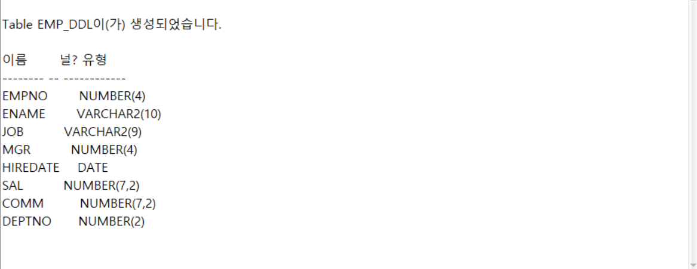

---
<!-- _class: aqua -->
##### Q002
- DEPT 테이블을 복사해 DEPT_DDL 새테이블을 생성하시오.
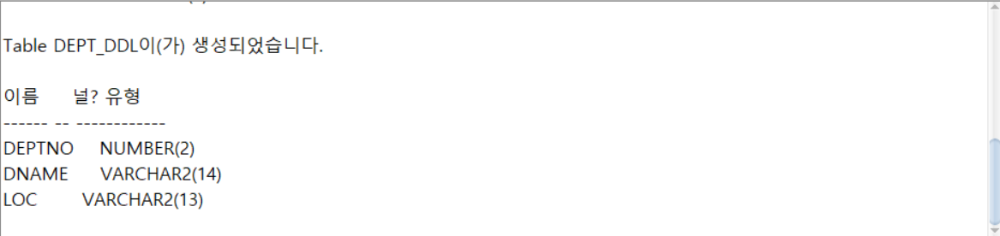

---
<!-- _class: aqua -->
##### Q003
- DEPT_DDL 테이블 전체를 조회하시오.
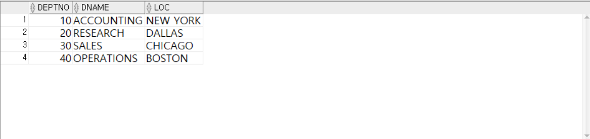

---
<!-- _class: aqua -->
##### Q004
- EMP 테이블에서 30번 부서의 일부데이터만 복사해 EMP_DDL 새테이블을 생성하시오.
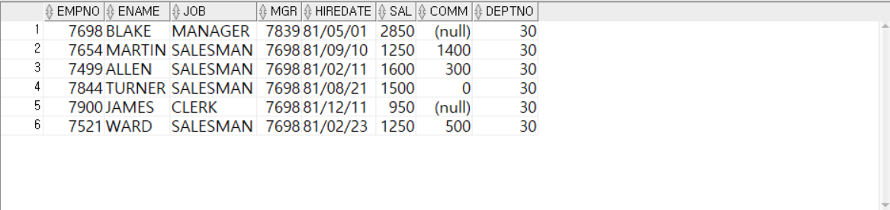

---
<!-- _class: aqua -->
##### Q005
- EMP, DEPT 테이블을 JOIN한  테이블의 열 구조만 복사해 EMPDEPT_DDL 테이블을 작성하시오.
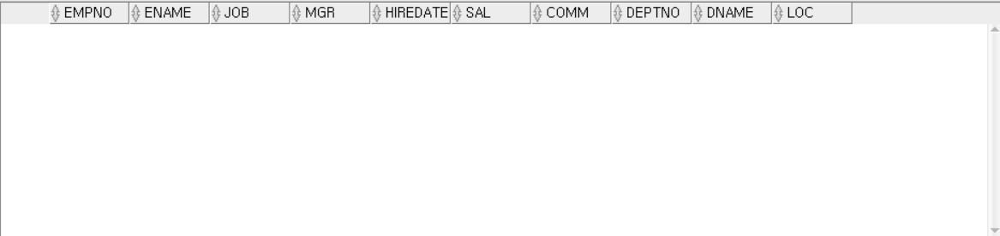

---
<!-- _class: aqua -->
##### Q006
- EMP 테이블을 복사해 EMP_ALTER테이블을 생성하시오.
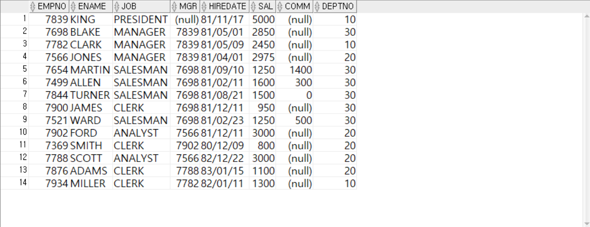

---
<!-- _class: aqua -->
##### Q007
- ALTER를 이용하여 EMP_ALTER 테이블에 HP VARCHAR2(20) 열을 추가하시오.
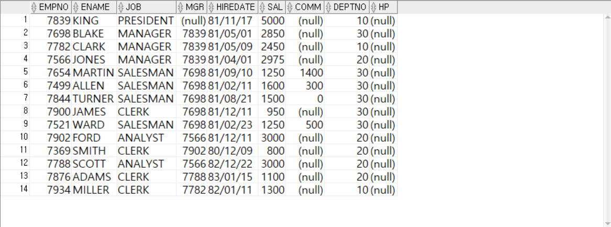

---
<!-- _class: aqua -->
##### Q008
- ALTER를 이용하여 HP열 이름을 TEL로 변경하시오.
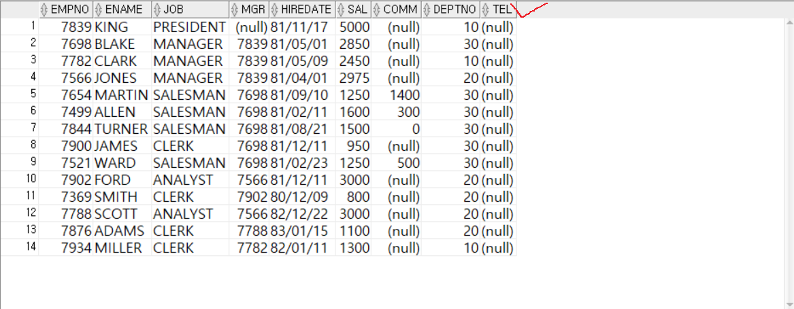

---
<!-- _class: aqua -->
##### Q009
- ALTER명령어로 EMPNO열 길이를 5로 변경하시오.
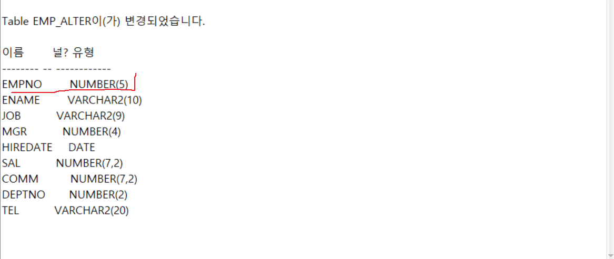

---
<!-- _class: aqua -->
##### Q010
- ALTER명령어로 TEL열을 삭제하시오.
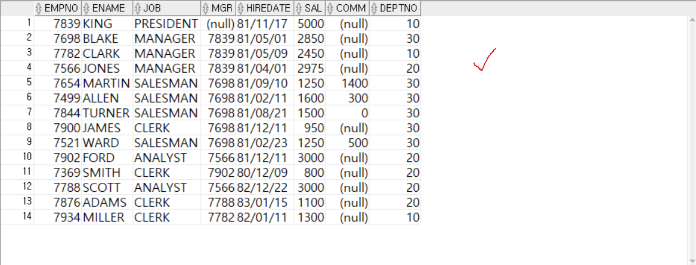

---
<!-- _class: aqua -->
##### Q011
- RENAME을 이용하여 테이블이름을 EMP_RENAME으로 변경하시오.
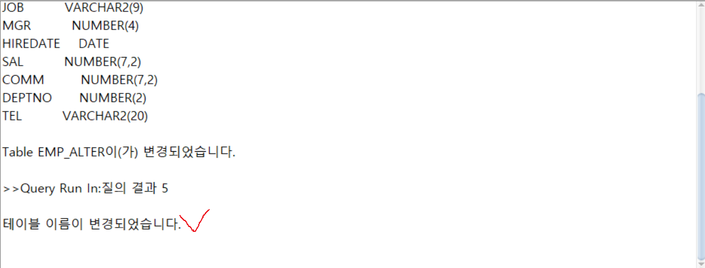

---
<!-- _class: aqua -->
##### Q012
- DESC를 이용하여 테이블이름을 변경하시오.
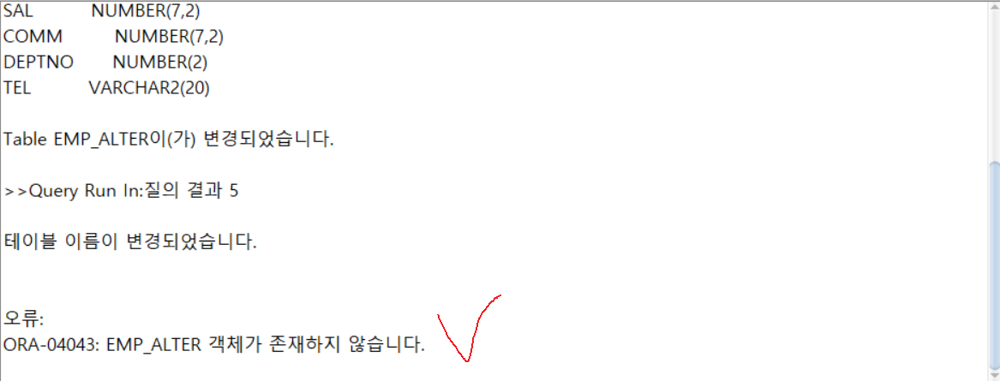

---
<!-- _class: aqua -->
##### Q013
- 변경된 테이블 EMP_RENAME으로 조회하시오.
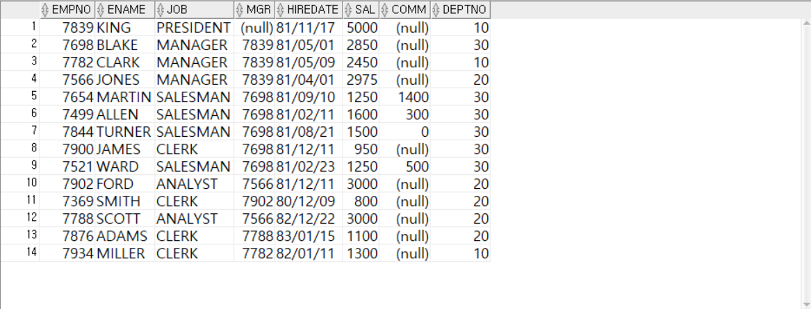

---
<!-- _class: aqua -->
##### Q014
- TRUNCATE를 이용하여 EMP_RENAME의 모든데이터를 삭제하시오.
- ROLLBACK이 되지 않음!!!
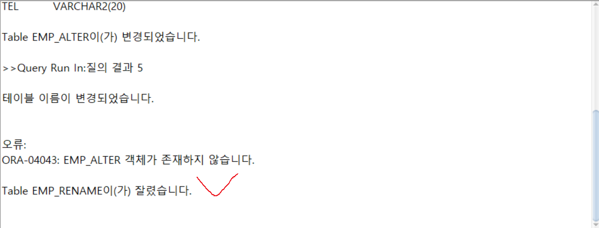

---
<!-- _class: aqua -->
##### Q015
- DROP을 이용하여 TABLE을 삭제하시오.
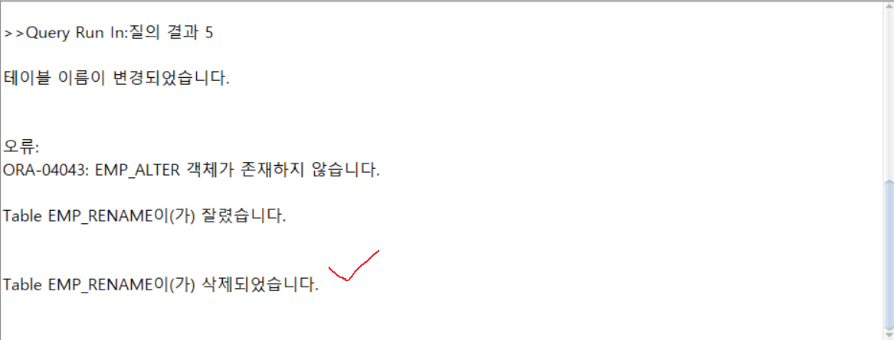

---
<!-- _class: aqua -->
##### Q016
- EMP_RENAME 테이블 구성을 살펴보시오.
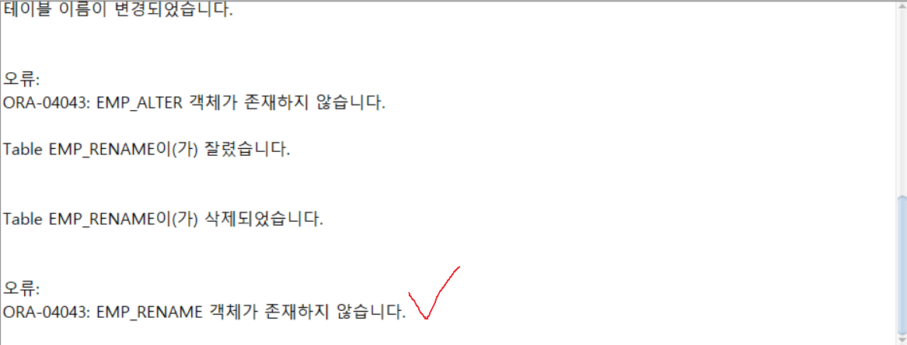

---
<!-- _class: purple -->
# 사고확장EX

---
<!-- _class: aqua -->
##### EX001
- 다음 열구조를 가지는 EMP_DDL_TEST 테이블을 작성하시오.
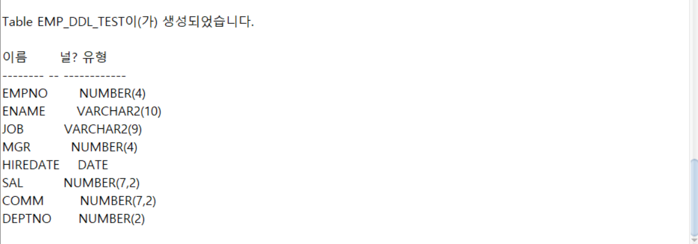

---
<!-- _class: aqua -->
##### EX002
- EMP_DDL_TEST 테이블에 AAA 열을 추가하시오, 가변형문자열, 길이는 20
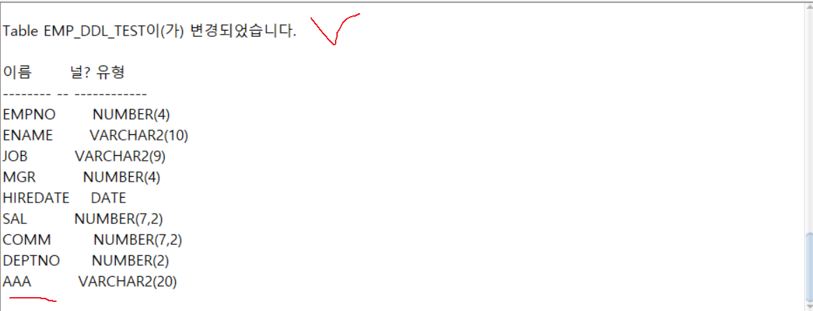

---
<!-- _class: aqua -->
##### EX003
- AAA 열크기를 30으로 변경하시오.
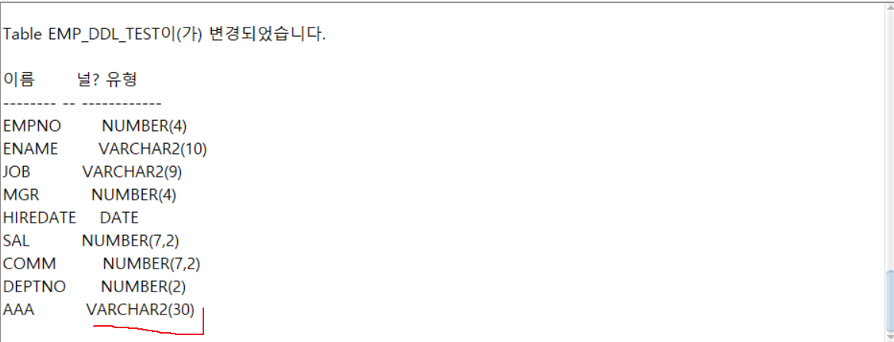

---
<!-- _class: aqua -->
##### EX004
- AAA 열이름을 REMARK로 변경하시오.
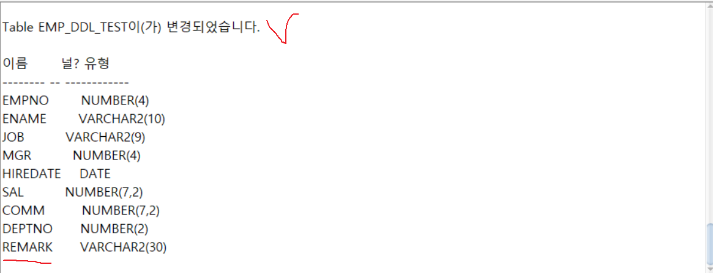

---
<!-- _class: aqua -->
##### EX005
- EMP_DDL_TEST 테이블에 EMP테이블의 데이터를 모두 저장하시오.REMARK는 NULL로 삽입하시오.
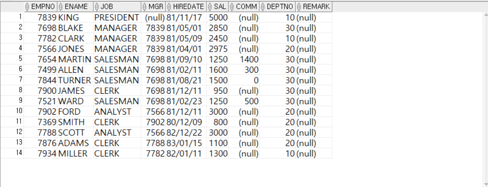

---
<!-- _class: aqua -->
##### EX006
- EMP_DDL_TEST 테이블을 삭제하시오.
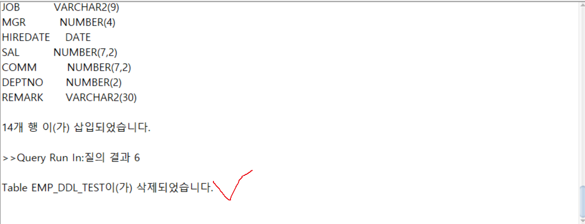

---

<!-- _class: aqua -->

1. CREATE TABLE 문에서 지정할 수 있는 요소는 무엇인가요?  
2. ALTER TABLE EMP ADD EMAIL VARCHAR2(30) 은 어떤 작업을 하나요?  
3. DROP TABLE EMP 실행 시 어떤 결과가 발생하나요?  
4. PRIMARY KEY 와 UNIQUE 의 차이는 무엇인가요?  
5. DEFAULT 0 NOT NULL 은 어떤 의미인가요?

---

<!-- _class: red -->
# 🧪 Step 5: 기억 테스트

---

<!-- _class: aqua -->

- CREATE, ALTER, DROP 의 차이는 무엇인가요?  
- NOT NULL 과 DEFAULT 은 각각 어떤 역할을 하나요?  
- 제약조건은 언제 설정할 수 있나요?  
- ALTER TABLE 문으로 어떤 작업을 할 수 있나요?  
- 테이블 삭제 후 복구가 가능한가요?
 

---
<!-- _class: thanks -->
## 👋 열심히 들어주셔서 감사합니다!
 
> 오늘의 한 걸음이 **내일의 가능성**이 되길 바라며, 