<!-- _class: cover-oracle -->
<h4 style="color:#6C757D;">
  🧠
  CodeCraft Series · Track 02
</h4>
<h1 style="color:#007BFF;">Oracle Fundamentals</h1>
<h3 style="color:#17A2B8;">SQL부터 PL/SQL까지, 오라클의 핵심을 잡다</h3>

<!-- 현재 챕터 강조 -->

  📍 <strong>현재 위치:</strong> Chapter 1 · <em>오라클 환경 설정 · 기본 SELECT</em>

<blockquote>
  실무에 바로 적용 가능한 오라클 입문서 
  데이터를 다루는 힘, SQL로 시작해요
</blockquote>

---
<!-- _class: cover-oracle -->
<h2 style="font-size:1.6em; color:#555;">📚 Oracle 트랙 목차</h2>
  <strong style="color:#FF6E7F;">PART 1 · SQL 기본</strong>

  ▶ Chapter 01: oracle_setting
  ▶ Chapter 02: select_basic
  ▶ Chapter 03: select_where
  ▶ Chapter 04: select_fn
  ▶ Chapter 05: select_group
  ▶ Chapter 06: select_join
  ▶ Chapter 07: select_subquery

---
<!-- _class: cover-oracle -->
<h2 style="font-size:1.6em; color:#555;">📚 Oracle 트랙 목차</h2>
 <strong style="color:#FF6E7F;">PART 2 · 데이터 조작 및 객체</strong> 

 
  ▶ Chapter 08: update_delete
  ▶ Chapter 09: transaction
  ▶ Chapter 10: ddl
  ✅▶ Chapter 11: object
  ▶ Chapter 12: constraint
  ▶ Chapter 13: user

---
<!-- _class: cover-oracle -->
<h2 style="font-size:1.6em; color:#555;">📚 Oracle 트랙 목차</h2>
<strong style="color:#FF6E7F;">PART 3 · PL/SQL 심화</strong>

  
  ▶ Chapter 14: plsql
  ▶ Chapter 15: record
  ▶ Chapter 16: cursor
  ▶ Chapter 17: save

  이 트랙은 오라클의 기본 SQL부터 객체 관리, PL/SQL까지  실무 중심으로 배우며, 데이터베이스 전문가로 성장합니다.

 

 
 
---

<!-- _class: orange -->
# 🧩 Step 1: 핵심 개념  
***SQL 객체 실습***  
→ ***뷰(View)***, ***시퀀스(Sequence)***, ***동의어(Synonym)***, ***인덱스(Index)***, ***클러스터(Cluster)***

---

<!-- _class: aqua -->
### 👁️ 뷰 (View)  
- 가상의 테이블  
- SELECT 문 결과를 저장한 객체  
- 복잡한 쿼리 단순화, 보안 목적  
- CREATE VIEW, DROP VIEW, REPLACE VIEW 사용

---

<!-- _class: aqua -->
### 🔢 시퀀스 (Sequence)  
- 자동 번호 생성기  
- 주로 기본키 값 자동 생성에 사용  
- NEXTVAL, CURRVAL로 값 참조  
- CREATE SEQUENCE, ALTER SEQUENCE, DROP SEQUENCE

---

<!-- _class: aqua -->
### 🔗 동의어 (Synonym)  
- 객체에 대한 별칭  
- 접근 편의성 및 보안 목적  
- CREATE SYNONYM, DROP SYNONYM 사용  
- 퍼블릭/프라이빗 동의어 존재

---

<!-- _class: aqua -->
### ⚙️ 인덱스 (Index)  
- 검색 성능 향상  
- 자동 생성 또는 수동 생성 가능  
- CREATE INDEX, DROP INDEX 사용  
- 과도한 인덱스는 오히려 성능 저하

---

<!-- _class: aqua -->
### 🧱 클러스터 (Cluster)  
- 여러 테이블을 물리적으로 같은 공간에 저장  
- 관련 데이터 빠른 접근 가능  
- CREATE CLUSTER, CREATE TABLE ... CLUSTER 사용

---

<!-- _class: blue -->
# 🧪 Step 2: 코드 예제

---

<!-- _class: aqua -->

<pre class="codeblock">
-- 뷰 생성
CREATE VIEW EMP_VIEW AS
SELECT ENAME, SAL, DEPTNO FROM EMP;

-- 뷰 삭제
DROP VIEW EMP_VIEW;

-- 시퀀스 생성
CREATE SEQUENCE EMP_SEQ
START WITH 1000
INCREMENT BY 1
MAXVALUE 9999
NOCACHE;

-- 시퀀스 값 사용
INSERT INTO EMP (EMPNO, ENAME) VALUES (EMP_SEQ.NEXTVAL, 'SALLY');

-- 동의어 생성
CREATE SYNONYM EMP_SY FOR EMP;

-- 동의어 삭제
DROP SYNONYM EMP_SY;

-- 인덱스 생성
CREATE INDEX EMP_IDX ON EMP(ENAME);

-- 인덱스 삭제
DROP INDEX EMP_IDX;

-- 클러스터 생성
CREATE CLUSTER EMP_CLUSTER (DEPTNO NUMBER(2));

-- 클러스터 기반 테이블 생성
CREATE TABLE EMP (
  EMPNO NUMBER(4),
  ENAME VARCHAR2(10),
  DEPTNO NUMBER(2)
) CLUSTER EMP_CLUSTER(DEPTNO);
</pre>

---

<!-- _class: aqua -->

## ✅ 객체 요약표

| 객체 | 설명 |
|------|------|
| VIEW | 가상 테이블 |
| SEQUENCE | 자동 번호 생성기 |
| SYNONYM | 객체 별칭 |
| INDEX | 검색 성능 향상 |
| CLUSTER | 관련 테이블 공간 통합 |

---

<!-- _class: green -->
# 🧪 Step 3: 연습문제

 
---
<!-- _class: aqua -->
##### Q001
- DICT을 이용하여 SCOTT계정에서 사용가능한 데이터 사전을 살펴보시오
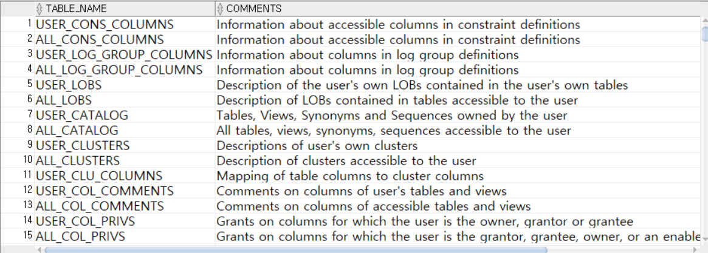

 
---
<!-- _class: aqua -->
##### Q002
- DICTIONARY을 이용하여 SCOTT계정에서 사용가능한 데이터 사전을 살펴보시오
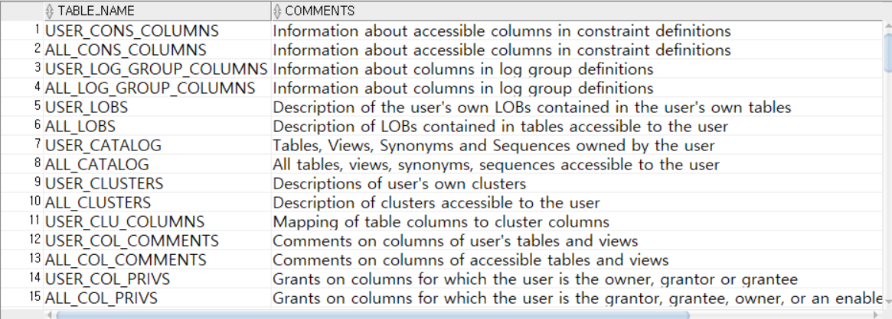

 

---
<!-- _class: aqua -->
##### Q003
- USER접두어를 가진 데이터 사전 : 현재 오라클에 접속해 있는 사용자가 소유한 객체 정보가 보관되어 있음.
- SCOTT계정이 가지고 있는 객체 정보 살펴보기
- SCOTT계정이 가지고 있는 테이블 이름 알고 싶을때 유용함.
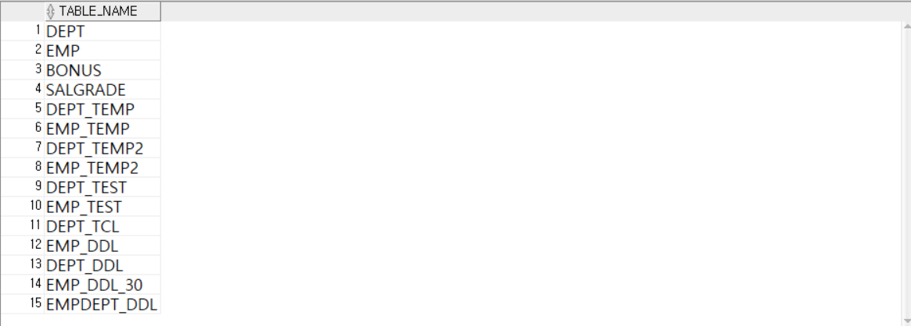

 

---
<!-- _class: aqua -->
##### Q004
- ALL 접두어를 가진 데이터 사전 : 오라클데이터베이스에 접속해 있는 사용자가 소유한 객체 및 다른 소유자가 소유한 객체중 사용이 허락되어 있는 객체 정보
- 사용가능한 모든 테이블이 출력됨.
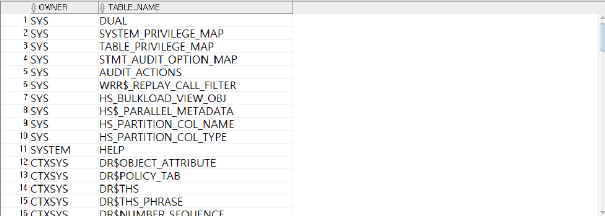

 
---
<!-- _class: aqua -->
##### Q005
- 데이터베이스 관리 권한을 가진 사용자만 조회할 수 있는 테이블
- SCOTT계정으로는 조회가 불가능함.
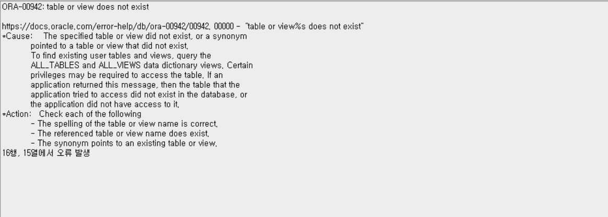

 

---
<!-- _class: aqua -->
##### Q006
- (SYSTEM) SYSTEM 계정으로 DBA_ 접두어 사용하기
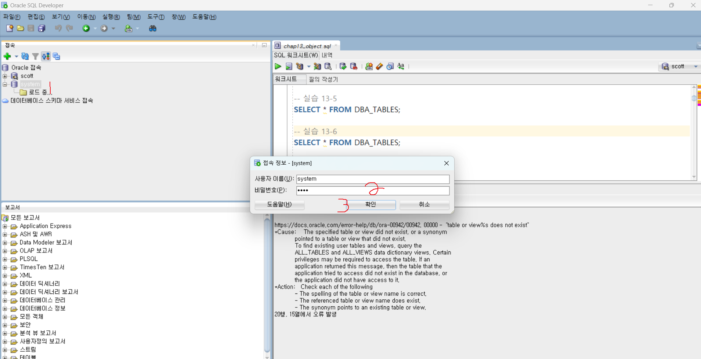

---
<!-- _class: aqua -->
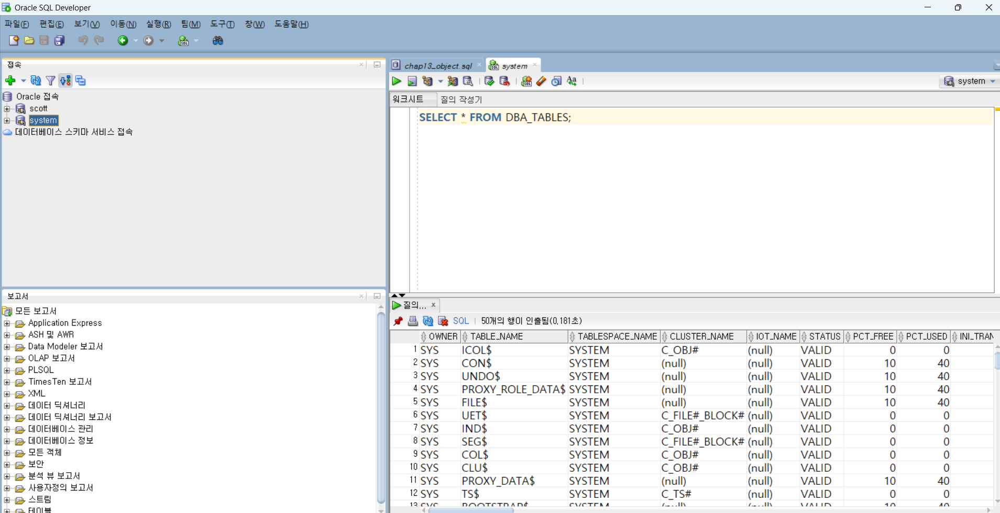

 
---
<!-- _class: aqua -->
##### Q007
- (SYSTEM)  DBA_USERS를 사용하여 사용자 정보 알아보기
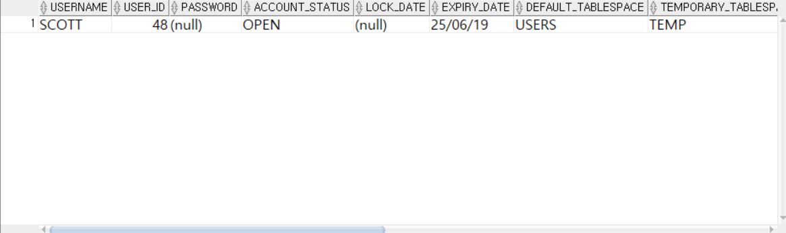

 

---
<!-- _class: aqua -->
##### Q008
- 더 빠른 검색을 위한 인덱스
- (SCOTT계정) SCOTT계정이 소유한 인덱스 정보 알아보기
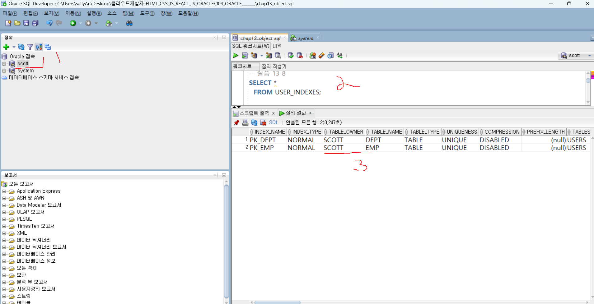

 

---
<!-- _class: aqua -->
##### Q009
- (SCOTT계정) SCOTT계정이 소유한 인덱스 컬럼 정보 알아보기
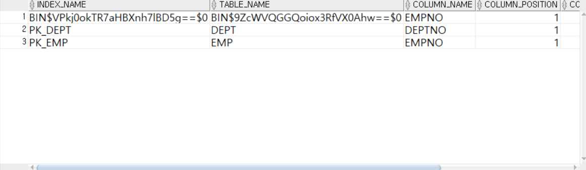

 
---
<!-- _class: aqua -->
##### Q010
- EMP 테이블의 SAL열에 인덱스 생성하기
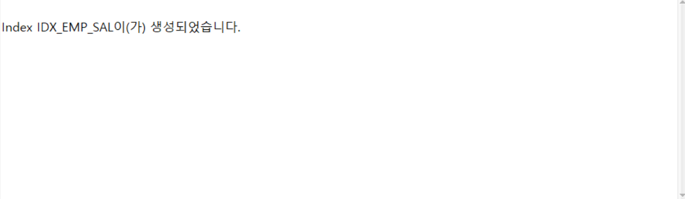

 

---
<!-- _class: aqua -->
##### Q011
- 생성된 인덱스 살펴보기
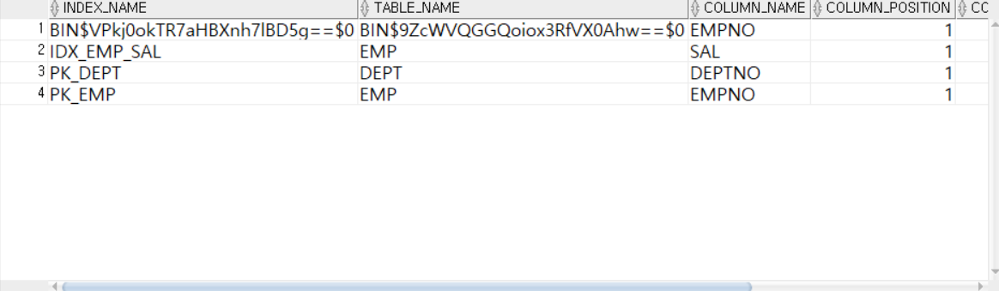

 

---
<!-- _class: aqua -->
##### Q012
- 인덱스 삭제하기기
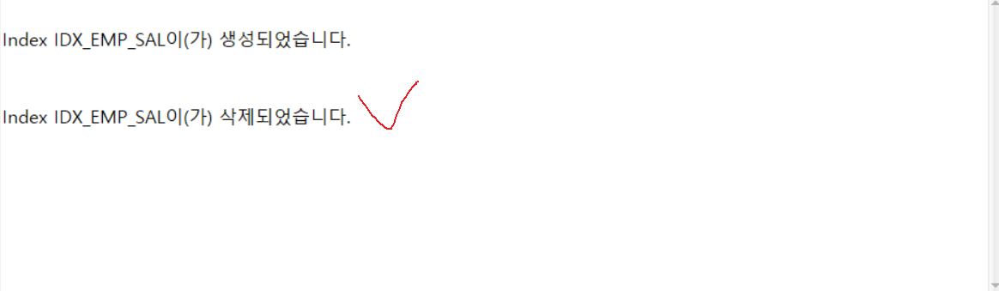

 

---
<!-- _class: aqua -->
##### Q013
- 생성된 인덱스 살펴보기

 
---
<!-- _class: aqua -->
##### Q014
- 테이블처럼 사용하는 뷰
- 뷰를 SELECT문의FROM 절에 사용하면 특정데이터를 조회하는 것과 같은 효과를 얻을 수 있음.
- 편리성 : SELECT 문의 복잡도를 완화하기 위해
- 보완성 : 테이블의 특정열을 노출하고 싶지 않을때

---
<!-- _class: aqua -->
1. 뷰를 생성하기위해 SYSTEM으로 계정변경
2. SCOTT에 VIEW 생성권한 주기
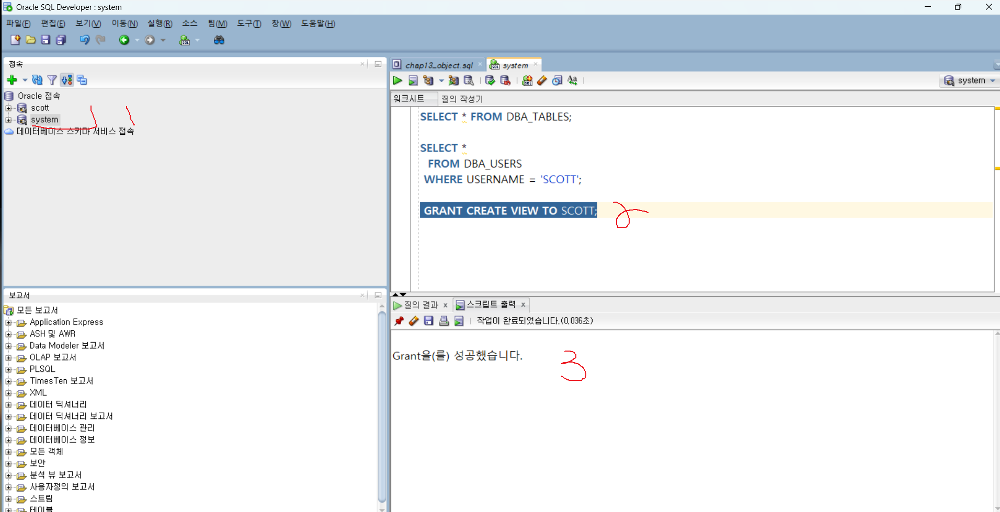

 

---
<!-- _class: aqua -->
##### Q015
-  SCOTT 계정으로 VIEW 생성하기
-  EMP 테이블에서 DEPTNO가 20인   EMPNO, ENAME, JOB, DEPTNO  열의 데이터로  VW_EMP20  라는 VIEW를 생성하시오오

---
<!-- _class: aqua -->
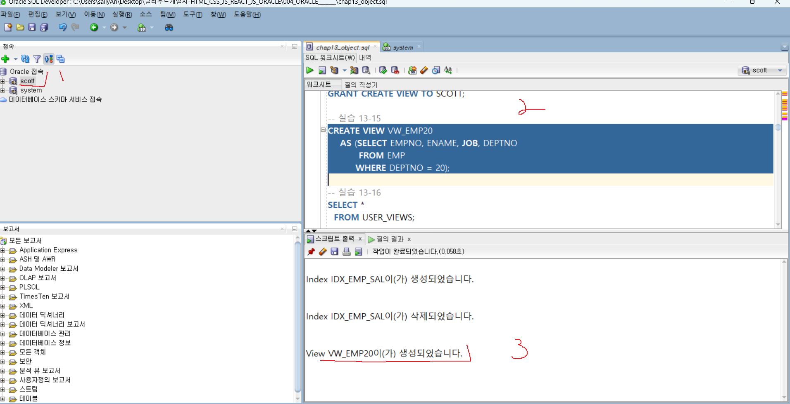

 

---
<!-- _class: aqua -->
##### Q016
- VIEW가 잘 만들어 졌는지 USER_VIEWS에서서 조회하시오.
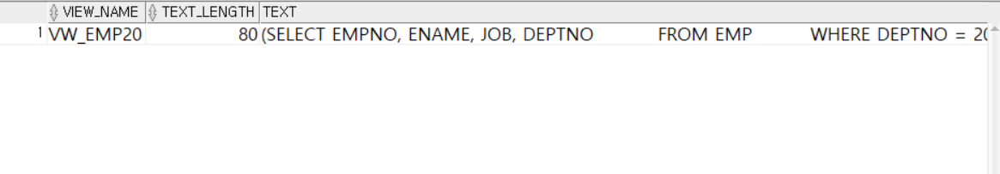

 
---
<!-- _class: aqua -->
##### Q017
- (SCOTT계정 ) 생성한 뷰의 내용을 확인하시오.

 
---
<!-- _class: aqua -->
##### Q018
- VW_EMP20 의 생성한 뷰를 조회하시오.
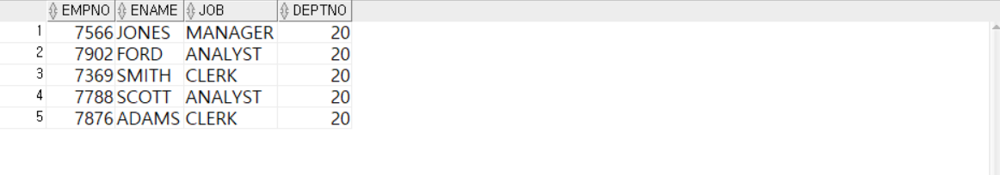

 
---
<!-- _class: aqua -->
##### Q019
- VW_EMP20 뷰를 삭제 하시오.
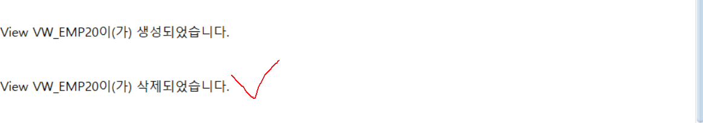

 

---
<!-- _class: aqua -->
##### Q020
- 인라인뷰 : 일회성으로 만들어서 사용하는 뷰
- SELECT에서 사용되는 서브쿼리, WITH절에서 미리 이름을 정의해사용하는 SELECT문이 해당됨.
- ROWNUM을 이용하면 열의 데이터가 숫자로 출력되는 것을 확인 할수 있음.

---
<!-- _class: aqua -->
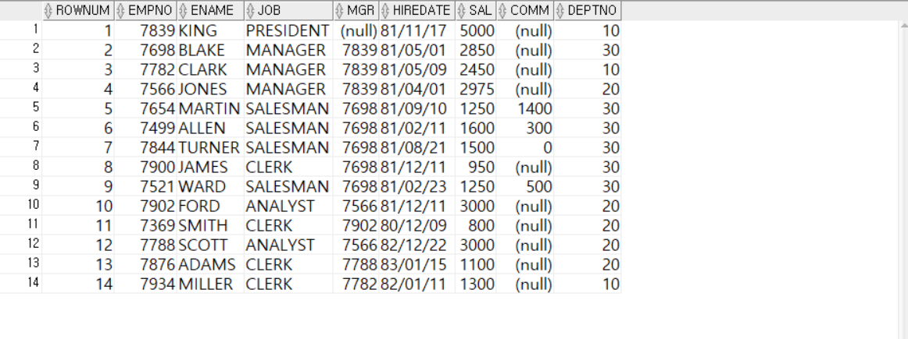

 

---
<!-- _class: aqua -->
##### Q021
- EMP 테이블을 SAL열 기준 내림차순으로 정렬 및 ROWNUM의 열 데이터 번호를 이용하여 조회하시오.
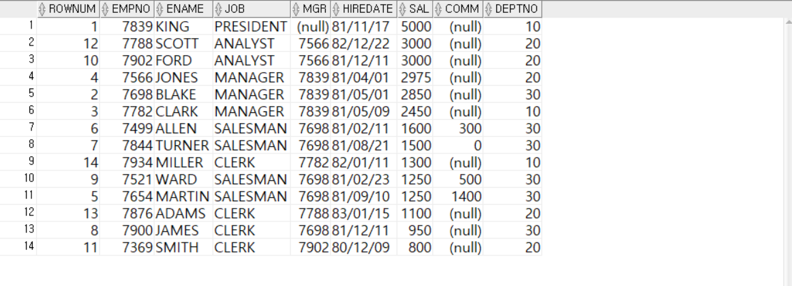

 
---
<!-- _class: aqua -->
##### Q022
- 인라인뷰 (서브쿼리) 를 이용하여
- EMP 테이블을 SAL열 기준 내림차순으로 정렬 및 ROWNUM의 열 데이터 번호를 이용하여 조회하시오.
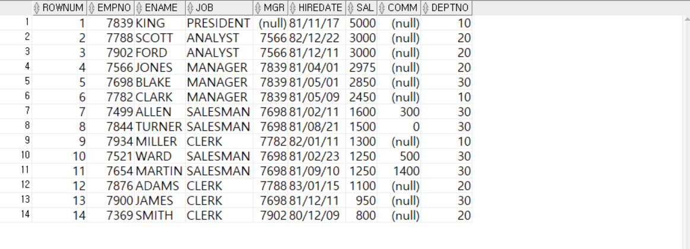

 

---
<!-- _class: aqua -->
##### Q023
- 인라인뷰( WITH 절)을 이용하여
- EMP 테이블을 SAL열 기준 내림차순으로 정렬 및 ROWNUM의 열 데이터 번호를 이용하여 조회하시오.

 

---
<!-- _class: aqua -->
##### Q024
- 인라인뷰 (서브쿼리) 를 이용하여
- EMP 테이블을 SAL열 기준 내림차순으로 정렬 및 ROWNUM의 열 데이터 번호를 이용하여
- 마지막으로 급여가 높은 상위 세면의 데이터만 출력하시오.

---
<!-- _class: aqua -->
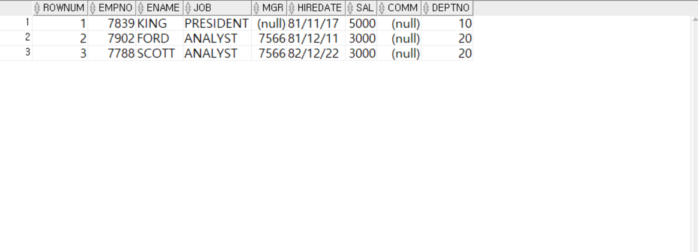

 

---
<!-- _class: aqua -->
##### Q025
- 인라인뷰 (WITH 절절) 를 이용하여
- EMP 테이블을 SAL열 기준 내림차순으로 정렬 및 ROWNUM의 열 데이터 번호를 이용하여
- 마지막으로 급여가 높은 상위 세면의 데이터만 출력하시오.

---
<!-- _class: aqua -->

 

---
<!-- _class: aqua -->
##### Q026
- DEPT 테이블을 이용하여 테이블 열구성은 갖고 데이터가 없는  DEPT_SEQUENCE 테이블을 생성하시오.
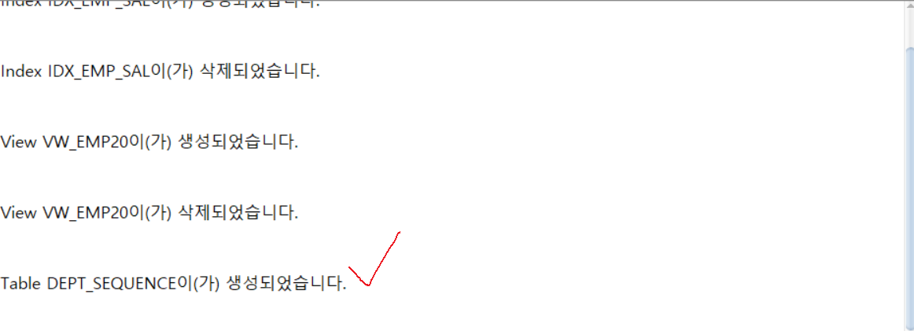

 

---
<!-- _class: aqua -->
##### Q027
- 기존의 부서번호는 10으로 시작해서 10씩증가하고 최대는 90, 최소는 0, 반복안하는 SEQ_DEPT_SEQUENCE 시퀀스를 작성하시오.
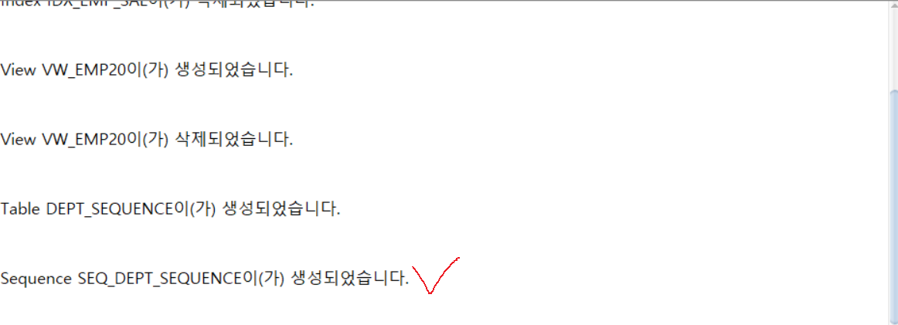

 
<!-- _class: aqua -->
##### Q028
- 생성한 시퀀스 SEQ_DEPT_SEQUENCE 를 조회하시오.
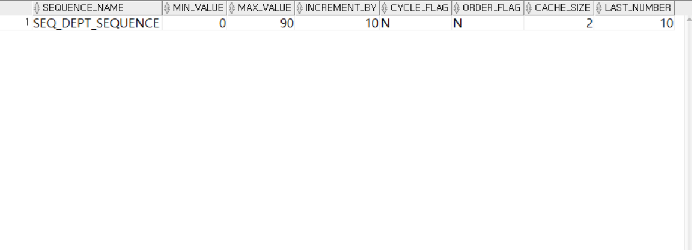

 

---
<!-- _class: aqua -->
##### Q029
- DEPT_SEQUENCE 테이블에  SEQ_DEPT_SEQUENCE 시퀀스를 이용하여 다음과 같이 데이터를 삽입하시오.
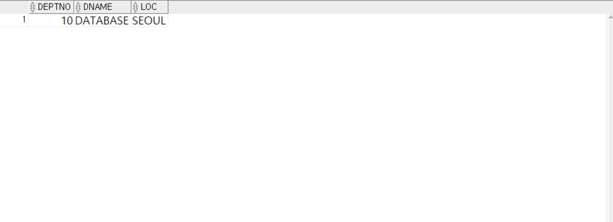

 

---
<!-- _class: aqua -->
##### Q030
- 가장 마지막으로 생성한 시퀀스를 확인하시오.
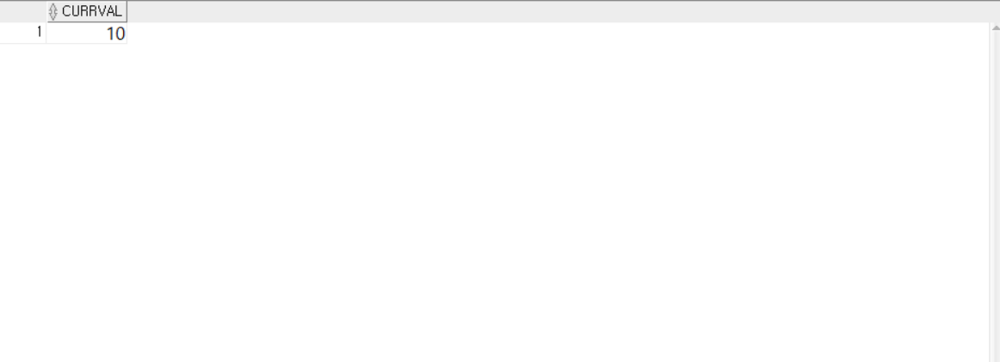

 
---
<!-- _class: aqua -->
##### Q031
- 시퀀스에서 생성한 순번을 사용하여 INSERT문을 실행하시오.

 

---
<!-- _class: aqua -->
##### Q032
- SEQ_DEPT_SEQUENCE 시퀀스를 최대값 99, 증가값을 3, CYCLE옵션을 주어 다음과 같이 수정하시오.
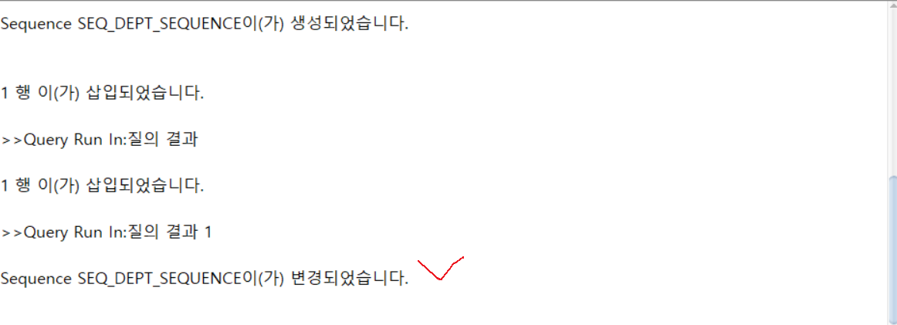

 

---
<!-- _class: aqua -->
##### Q033
- 옵션을 수정한 시퀀스를 조회하시오.
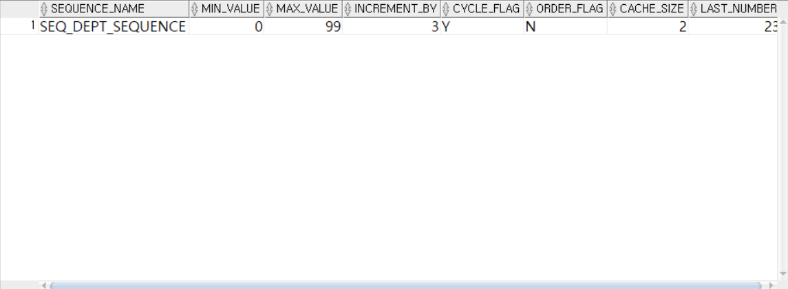

 

---
<!-- _class: aqua -->
##### Q034
- 수정한 시퀀스로 다음과 같이 데이터를 삽입하시오.
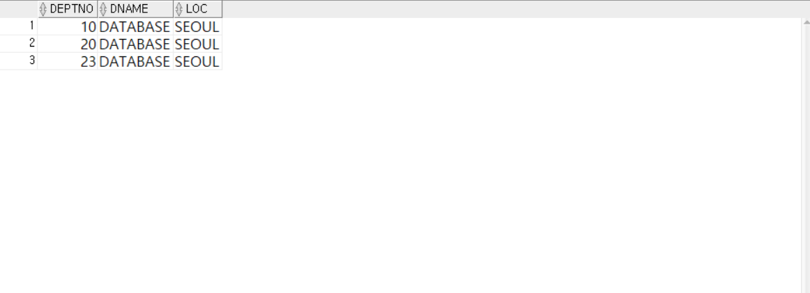

 

---
<!-- _class: aqua -->
##### Q035
- SEQ_DEPT_SEQUENCE 시퀀스의 최대값 도달 후 수행결과를 확인하시오.
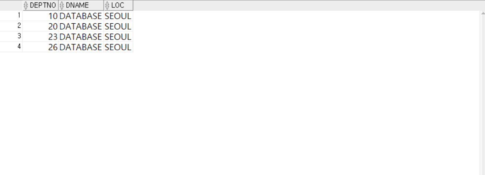

 
---
<!-- _class: aqua -->
##### Q036
- SEQ_DEPT_SEQUENCE 시퀀스 삭제후 확인하시오.
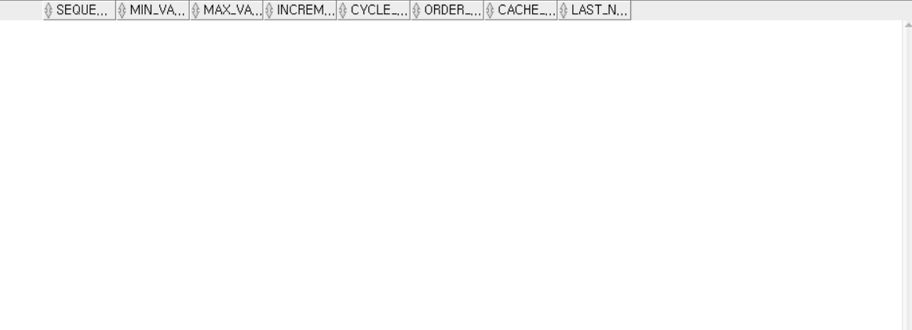

 

---
<!-- _class: aqua -->
##### Q037
- SYNONYM? 동의어
- 테이블, 뷰, 시퀀스 등 객체 이름 대신에 사용할 수 있는 다른 이름을 뷰여하는 객체
- 테이블 이름이 너무길어 사용이 불편할때 좀더 간단하고 짧은 이름을 하나 더 만들어주기 위해 사용함.

- (SYSTEM 계정) SCOTT에 CREATE SYNONYM 생성권한,
  PUBLIC 데이터베이스 내 모든 사용자가 사용할수 있도록 설정하는 권한 부여
  
---
<!-- _class: aqua -->
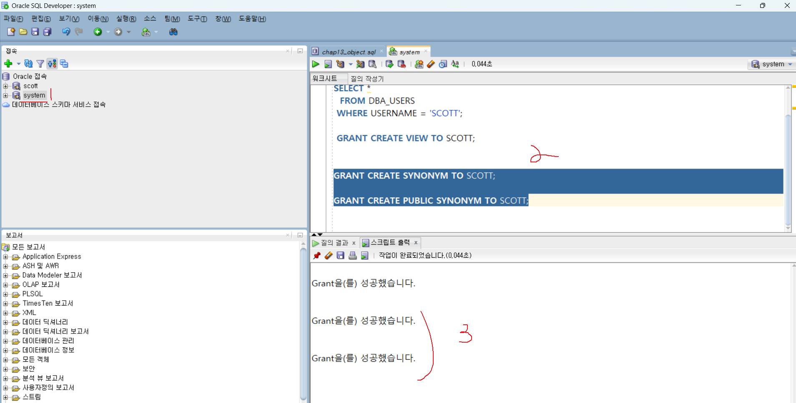

 

---
<!-- _class: aqua -->
##### Q038
- (SCOTT) EMP 테이블의 동의어를 E로 생성하시오.
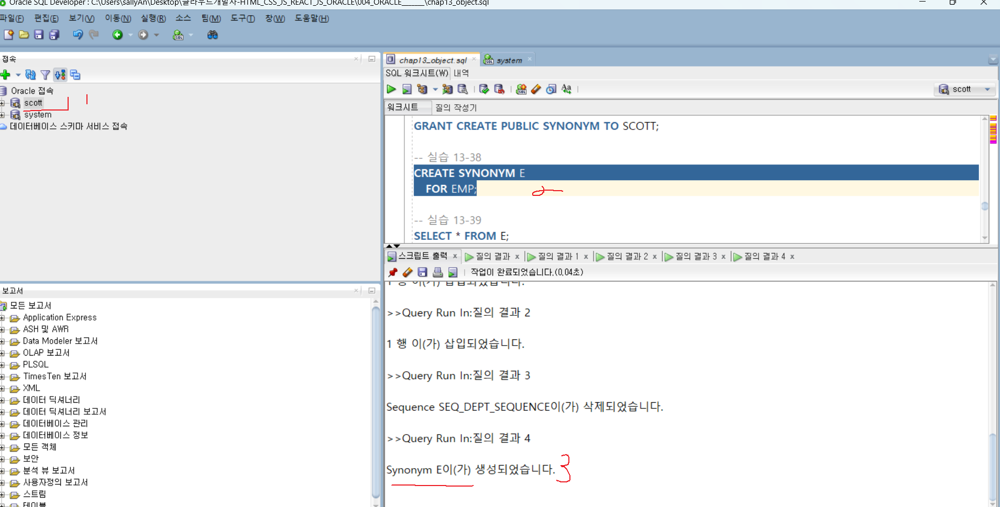

 
---
<!-- _class: aqua -->
##### Q039
- E 테이블 전체 내용을 조회하시오.
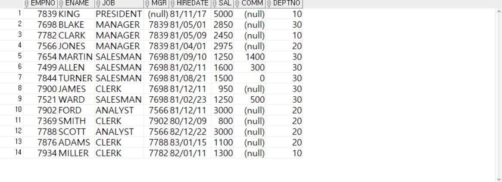

 

---
<!-- _class: aqua -->
##### Q040
- E 동의어를 삭제하시오.
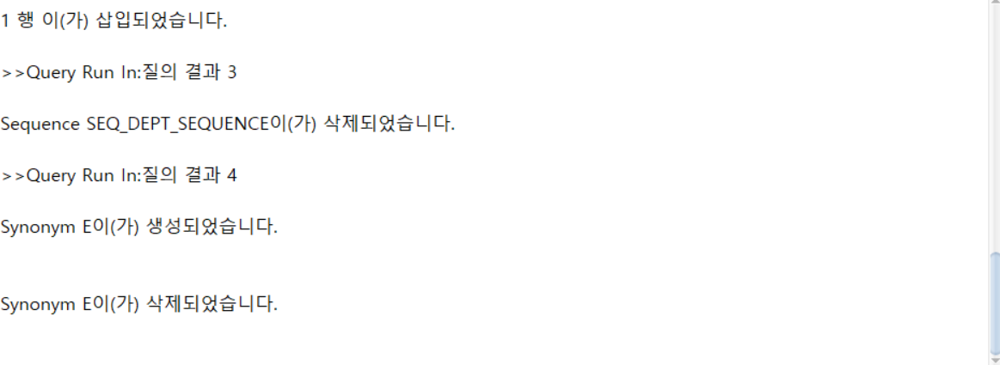

 

---
<!-- _class: purple -->
# 사고확장EX

---
<!-- _class: aqua -->
##### EX001
1. EMP 테이블과 같은 구조의 데이터를 저장하는 EMPIDX 테이블을 생성하시오.
2. 생성한 EMPIDX 테이블의 EMPNO열에  IDX_EMPIDX_EMPNO 인덱스를 생성하시오.
3. 인덱스가 잘 생성되었는지 적절한 데이터 사전뷰를 통해 확인하시오.

---
<!-- _class: aqua -->
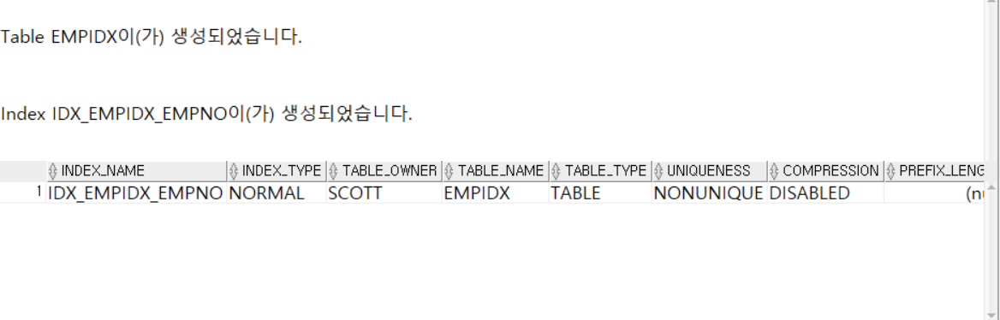

 

---
<!-- _class: aqua -->
##### EX002
1.  EMPIDX 테이블의 급여(SAL) 가 1500 초과인 사원들만 출력하는 EMPIDX_OVER15K 뷰를 생성하시오.
2. 만약 이뷰가 존재한다면 새로운 내용으로 대체가능하게 작성하시오.
3. EMPIDX_OVER15K 뷰는 EMPNO, ENAME, JOB, DEPTNO, SAL , COMM 이 있다면 O 존재하지 않으면 X 열을 가지고 있습니다.

---
<!-- _class: aqua -->
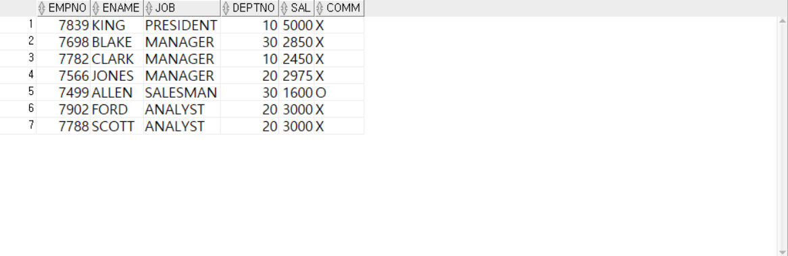

 

---
<!-- _class: aqua -->
##### EX003
1. DEPT 테이블과 같은 결과 행 구성ㅇ르 가지는 DEPTSEQ 테이블을 작성하시오.
2. DEPTSEQ ㅔ이블에 사용할 SEQ_DEPTSEQ 시퀀스를 작성하시오.
   시작값1 , 증가1, 최대값 99, 최소값 1, 부서번호 최대값에서 생성중단, 캐시 없음
3. DEPTSEQ 를 이용하여 다음과 같이 세개 부서를 차례대로 추가하시오.

---
<!-- _class: aqua -->
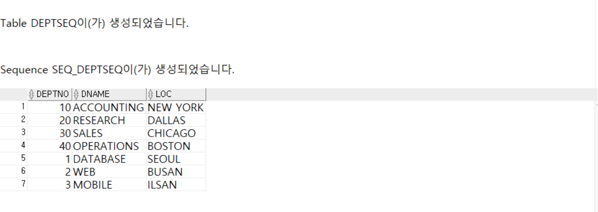

 
<!-- _class: aqua -->

1. CREATE VIEW EMP_VIEW AS ... 는 어떤 객체를 생성하나요?  
2. EMP_SEQ.NEXTVAL 은 어떤 값을 반환하나요?  
3. CREATE SYNONYM 은 어떤 목적을 가지고 있나요?  
4. 인덱스는 언제 유용하게 사용되나요?  
5. 클러스터는 어떤 방식으로 데이터를 저장하나요?

---

<!-- _class: red -->
# 🧪 Step 5: 기억 테스트

---

<!-- _class: aqua -->

- 뷰(View)와 테이블의 차이는 무엇인가요?  
- 시퀀스는 어떤 상황에서 사용되나요?  
- 동의어(Synonym)는 어떤 장점이 있나요?  
- 인덱스는 항상 성능을 향상시키나요?  
- 클러스터는 어떤 구조적 특징을 가지나요?
 

---
<!-- _class: thanks -->
## 👋 열심히 들어주셔서 감사합니다!
 
> 오늘의 한 걸음이 **내일의 가능성**이 되길 바라며, 