<!-- _class: cover-oracle -->
<h4 style="color:#6C757D;">
  🧠
  CodeCraft Series · Track 02
</h4>
<h1 style="color:#007BFF;">Oracle Fundamentals</h1>
<h3 style="color:#17A2B8;">SQL부터 PL/SQL까지, 오라클의 핵심을 잡다</h3>

<!-- 현재 챕터 강조 -->

  📍 <strong>현재 위치:</strong> Chapter 1 · <em>오라클 환경 설정 · 기본 SELECT</em>

<blockquote>
  실무에 바로 적용 가능한 오라클 입문서 
  데이터를 다루는 힘, SQL로 시작해요
</blockquote>

---
<!-- _class: cover-oracle -->
<h2 style="font-size:1.6em; color:#555;">📚 Oracle 트랙 목차</h2>
  <strong style="color:#FF6E7F;">PART 1 · SQL 기본</strong>

  ▶ Chapter 01: oracle_setting
  ▶ Chapter 02: select_basic
  ▶ Chapter 03: select_where
  ▶ Chapter 04: select_fn
  ▶ Chapter 05: select_group
  ▶ Chapter 06: select_join
  ▶ Chapter 07: select_subquery

---
<!-- _class: cover-oracle -->
<h2 style="font-size:1.6em; color:#555;">📚 Oracle 트랙 목차</h2>
 <strong style="color:#FF6E7F;">PART 2 · 데이터 조작 및 객체</strong> 

 
  ▶ Chapter 08: update_delete
  ▶ Chapter 09: transaction
  ▶ Chapter 10: ddl
  ▶ Chapter 11: object
  ▶ Chapter 12: constraint
  ▶ Chapter 13: user

---
<!-- _class: cover-oracle -->
<h2 style="font-size:1.6em; color:#555;">📚 Oracle 트랙 목차</h2>
<strong style="color:#FF6E7F;">PART 3 · PL/SQL 심화</strong>

  
  ▶ Chapter 14: plsql
  ▶ Chapter 15: record
  ▶ Chapter 16: cursor
  ✅▶ Chapter 17: save

  이 트랙은 오라클의 기본 SQL부터 객체 관리, PL/SQL까지  실무 중심으로 배우며, 데이터베이스 전문가로 성장합니다.

 

---

<!-- _class: orange -->
# 🧩 Step 1: 핵심 개념  
***PL/SQL 저장 프로그램 실습***  
→ ***프로시저(Procedure)***, ***함수(Function)***, ***매개변수 처리***, ***IN/OUT 모드***, ***호출 방법***

---

<!-- _class: aqua -->
### 🧪 저장 프로그램이란?  
- 데이터베이스에 저장된 PL/SQL 코드 블록  
- 반복되는 작업을 모듈화하여 재사용 가능  
- CREATE PROCEDURE, CREATE FUNCTION으로 생성  
- EXEC, CALL, SELECT 등으로 호출

---

<!-- _class: aqua -->
### 🔁 프로시저 (Procedure)  
- 특정 작업을 수행하는 저장 코드  
- 반환값 없음  
- IN, OUT, IN OUT 매개변수 사용 가능  
- 예: 급여 인상, 데이터 삽입 등

---

<!-- _class: aqua -->
### 🧮 함수 (Function)  
- 결과값을 반환하는 저장 코드  
- RETURN 문으로 값 반환  
- SELECT 문에서 호출 가능  
- 예: 급여 계산, 포맷 변환 등

---

<!-- _class: aqua -->
### 📦 매개변수 모드  
- IN : 입력용  
- OUT : 출력용  
- IN OUT : 입력 및 출력 겸용  
- 매개변수 타입 지정 필수

---

<!-- _class: aqua -->
### 🧠 호출 방법  
- 프로시저: EXEC, CALL 또는 익명 블록에서 호출  
- 함수: SELECT 함수명(...) FROM DUAL 또는 PL/SQL 블록 내 사용

---

<!-- _class: blue -->
# 🧪 Step 2: 코드 예제

---
<!-- _class: aqua -->

<pre class="codeblock">
-- 프로시저 생성
CREATE OR REPLACE PROCEDURE raise_salary (
  p_empno IN EMP.EMPNO%TYPE,
  p_rate IN NUMBER
) IS
BEGIN
  UPDATE EMP SET SAL = SAL * p_rate WHERE EMPNO = p_empno;
END;

-- 프로시저 호출
EXEC raise_salary(7788, 1.1);

-- 함수 생성
CREATE OR REPLACE FUNCTION get_annual_salary (
  p_empno IN EMP.EMPNO%TYPE
) RETURN NUMBER IS
  v_sal EMP.SAL%TYPE;
BEGIN
  SELECT SAL INTO v_sal FROM EMP WHERE EMPNO = p_empno;
  RETURN v_sal * 12;
END;

-- 함수 호출
SELECT get_annual_salary(7788) FROM DUAL;

-- OUT 매개변수 사용
CREATE OR REPLACE PROCEDURE get_job (
  p_empno IN EMP.EMPNO%TYPE,
  p_job OUT EMP.JOB%TYPE
) IS
BEGIN
  SELECT JOB INTO p_job FROM EMP WHERE EMPNO = p_empno;
END;

-- OUT 매개변수 호출 예시
DECLARE
  v_job EMP.JOB%TYPE;
BEGIN
  get_job(7788, v_job);
  DBMS_OUTPUT.PUT_LINE('직책: ' || v_job);
END;
</pre>

---

<!-- _class: aqua -->

## ✅ 저장 프로그램 요약표

| 항목 | 설명 |
|------|------|
| PROCEDURE | 작업 수행, 반환값 없음 |
| FUNCTION | 결과 반환 |
| IN, OUT, IN OUT | 매개변수 모드 |
| EXEC, SELECT | 호출 방법 |
| RETURN | 함수 결과 반환 |

---

<!-- _class: green -->
# 🧪 Step 3: 연습문제

 

---
<!-- _class: aqua -->
##### Q001  다음과 같이 프로시저를 생성하시오.

---
<!-- _class: aqua -->
##### Q002  위에서 생성한 프로시저를 실행하시오.
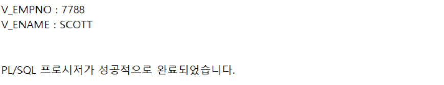

---
<!-- _class: aqua -->
##### Q003
- 익명블록에서 프로시저를 실행하시오.
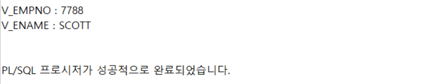

---
<!-- _class: aqua -->
##### Q004  USER-SOURCE를 통해 프로시저를 확인하시오.
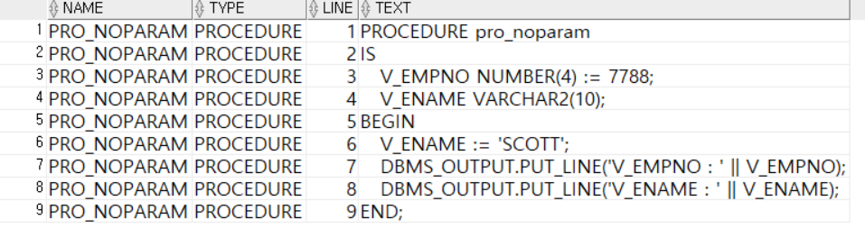

---
<!-- _class: aqua -->
##### Q005  USER-SOURCE를 통해 프로시저를 확인하시오.

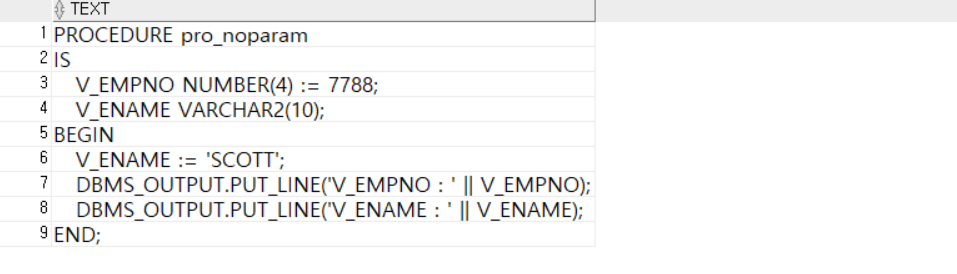

---
<!-- _class: aqua -->
##### Q006  프로시저를 삭제하시오.

---
<!-- _class: aqua -->
##### Q007  프로시저에 파라미터를 지정하시오.

---
<!-- _class: aqua -->
##### Q008 파라미터를 입력하여 프로시저를 사용하시오.
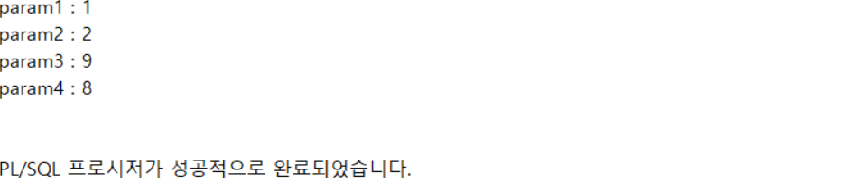

---
<!-- _class: aqua -->
##### Q009 기본값이 지정된 파라미터 입력을 제외하고 프로시저를 사용하시오.
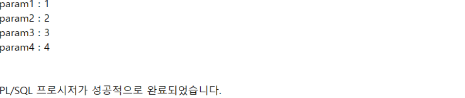

---
<!-- _class: aqua -->
##### Q010  실행에 필요한 개수보다 적은 파라미터를 입력하여 프로시저를 실행하시오. (에러발생 )
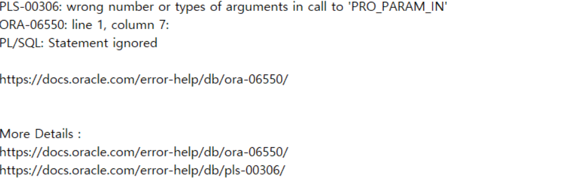

---
<!-- _class: aqua -->
<pre class="codeblock">
EXECUTE pro_param_in(1);

</pre>

---
<!-- _class: aqua -->
##### Q011 파라미터 이름을 활용하여 프로시저값을 입력하시오.
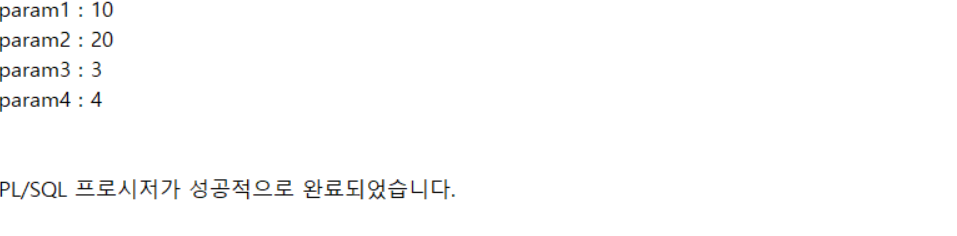

---
<!-- _class: aqua -->
##### Q012  OUT 모드파라미터를 정의하시오.

---
<!-- _class: aqua -->
<pre class="codeblock">
CREATE OR REPLACE PROCEDURE pro_param_out
(
   in_empno IN EMP.EMPNO%TYPE,
   out_ename OUT EMP.ENAME%TYPE,
   out_sal OUT EMP.SAL%TYPE
)
IS

BEGIN
   SELECT ENAME, SAL INTO out_ename, out_sal
     FROM EMP
    WHERE EMPNO = in_empno;
END pro_param_out;
/

</pre>

---
<!-- _class: aqua -->
##### Q013  OUT 모드 파라미터를 사용하시오.
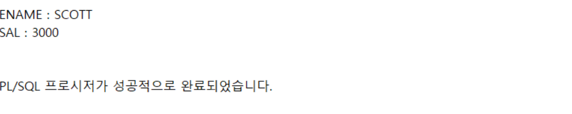

---
<!-- _class: aqua -->
<pre class="codeblock">
DECLARE
   v_ename EMP.ENAME%TYPE;
   v_sal EMP.SAL%TYPE;
BEGIN
   pro_param_out(7788, v_ename, v_sal);
   DBMS_OUTPUT.PUT_LINE('ENAME : ' || v_ename);
   DBMS_OUTPUT.PUT_LINE('SAL : ' || v_sal);
END;
/

</pre>

---
<!-- _class: aqua -->
##### Q014  IN OUT 모드 파라미터를 정의 하시오.

---
<!-- _class: aqua -->
<pre class="codeblock">
CREATE OR REPLACE PROCEDURE pro_param_inout
(
   inout_no IN OUT NUMBER
)
IS

BEGIN
   inout_no := inout_no * 2;
END pro_param_inout;
/

</pre>

---
<!-- _class: aqua -->
##### Q015  IN OUT 모드 파라미터를 사용하시오.
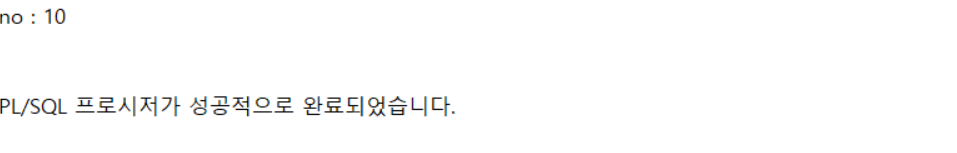

---
<!-- _class: aqua -->
<pre class="codeblock">
DECLARE
   no NUMBER;
BEGIN
   no := 5;
   pro_param_inout(no);
   DBMS_OUTPUT.PUT_LINE('no : ' || no);
END;
/

</pre>

---
<!-- _class: aqua -->
##### Q016  생성할때 오류가 발생하는 프로시저를 작성하시오.
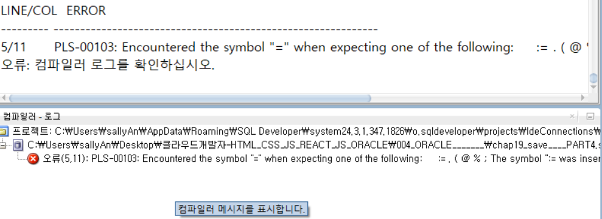

---
<!-- _class: aqua -->
<pre class="codeblock">
CREATE OR REPLACE PROCEDURE pro_err
IS
   err_no NUMBER;
BEGIN
   err_no = 100;
   DBMS_OUTPUT.PUT_LINE('err_no : ' || err_no);
END pro_err;
/

</pre>

---
<!-- _class: aqua -->
##### Q017  SHOW ERRORS 명령어로 오류를 확인하시오.
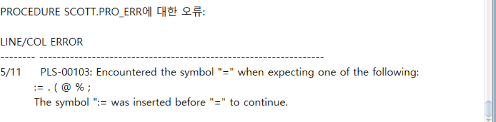

---
<!-- _class: aqua -->
<pre class="codeblock">
SHOW ERRORS;

</pre>

---
<!-- _class: aqua -->
##### Q018  USER_ERRORS 로 오류를 확인하시오.
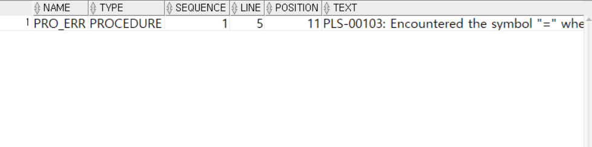

---
<!-- _class: aqua -->
##### Q019  다음과 같이 함수를 생성하시오.

---
<!-- _class: aqua -->
<pre class="codeblock">
CREATE OR REPLACE FUNCTION func_aftertax(
   sal IN NUMBER
)
RETURN NUMBER
IS
   tax NUMBER := 0.05;
BEGIN
   RETURN (ROUND(sal - (sal * tax)));
END func_aftertax;
/

</pre>

---
<!-- _class: aqua -->
##### Q020 PL/SQL에서 함수를 사용하시오.
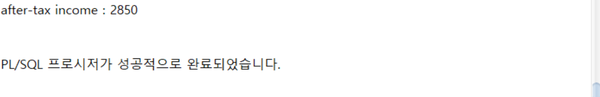

---
<!-- _class: aqua -->
##### Q021  sql에서 함수를 사용하시오 .
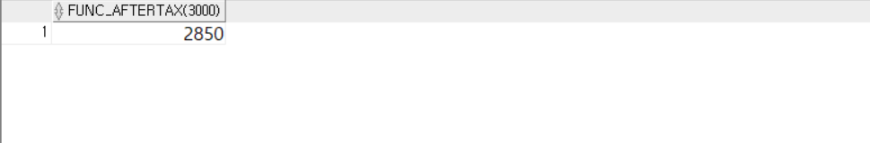

---
<!-- _class: aqua -->
##### Q022  함수에 테이블 데이터를 사용하시오.
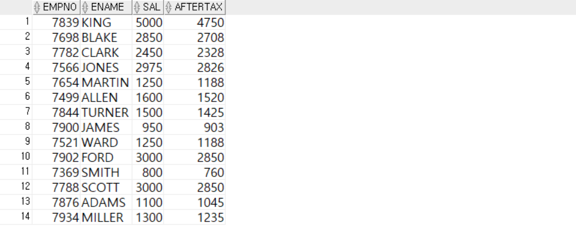

---
<!-- _class: aqua -->
##### Q023  함수를 삭제하시오.

---
<!-- _class: aqua -->
##### Q024  다음과 같이 패키지를 생성하시오.

---
<!-- _class: aqua -->
##### Q025  다음과 같이 패키지 명세를 확인하시오.
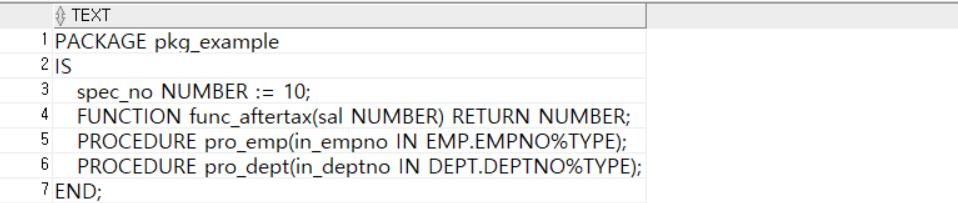

---
<!-- _class: aqua -->
##### Q026  DESC를 이용하여 패키지 명세를 확인하시오.
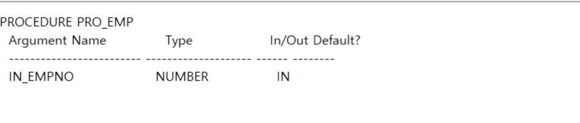

---
<!-- _class: aqua -->
##### Q027  다음과 같이 패키지 본몬을 생성하시오.

---
<!-- _class: aqua -->
<pre class="codeblock">
CREATE OR REPLACE PACKAGE BODY pkg_example
IS
   body_no NUMBER := 10;

   FUNCTION func_aftertax(sal NUMBER) RETURN NUMBER
      IS
         tax NUMBER := 0.05;
      BEGIN
         RETURN (ROUND(sal - (sal * tax)));
   END func_aftertax;

   PROCEDURE pro_emp(in_empno IN EMP.EMPNO%TYPE)
      IS
         out_ename EMP.ENAME%TYPE;
         out_sal EMP.SAL%TYPE;
      BEGIN
         SELECT ENAME, SAL INTO out_ename, out_sal
           FROM EMP
          WHERE EMPNO = in_empno;

         DBMS_OUTPUT.PUT_LINE('ENAME : ' || out_ename);
         DBMS_OUTPUT.PUT_LINE('SAL : ' || out_sal);
   END pro_emp;

PROCEDURE pro_dept(in_deptno IN DEPT.DEPTNO%TYPE)
   IS
      out_dname DEPT.DNAME%TYPE;
      out_loc DEPT.LOC%TYPE;
   BEGIN
      SELECT DNAME, LOC INTO out_dname, out_loc
        FROM DEPT
       WHERE DEPTNO = in_deptno;

      DBMS_OUTPUT.PUT_LINE('DNAME : ' || out_dname);
      DBMS_OUTPUT.PUT_LINE('LOC : ' || out_loc);
   END pro_dept;
END;
/

</pre>

---
<!-- _class: aqua -->
##### Q028  다음과 같이 프로시저 오버로드 하시오.

 

---
<!-- _class: aqua -->
##### Q029  패키지 본문에서 오버로드된 프로시저를 작성하시오.

---
<!-- _class: aqua -->
<pre class="codeblock">
CREATE OR REPLACE PACKAGE BODY pkg_overload
IS
   PROCEDURE pro_emp(in_empno IN EMP.EMPNO%TYPE)
      IS
         out_ename EMP.ENAME%TYPE;
         out_sal EMP.SAL%TYPE;
      BEGIN
         SELECT ENAME, SAL INTO out_ename, out_sal
           FROM EMP
          WHERE EMPNO = in_empno;

         DBMS_OUTPUT.PUT_LINE('ENAME : ' || out_ename);
         DBMS_OUTPUT.PUT_LINE('SAL : ' || out_sal);
      END pro_emp;

   PROCEDURE pro_emp(in_ename IN EMP.ENAME%TYPE)
      IS
         out_ename EMP.ENAME%TYPE;
         out_sal EMP.SAL%TYPE;
      BEGIN
         SELECT ENAME, SAL INTO out_ename, out_sal
           FROM EMP
          WHERE ENAME = in_ename;

         DBMS_OUTPUT.PUT_LINE('ENAME : ' || out_ename);
         DBMS_OUTPUT.PUT_LINE('SAL : ' || out_sal);
      END pro_emp;

END;
/

</pre>

---
<!-- _class: aqua -->
##### Q030  패키지에 포함된 서브프로그램 실행하시오.
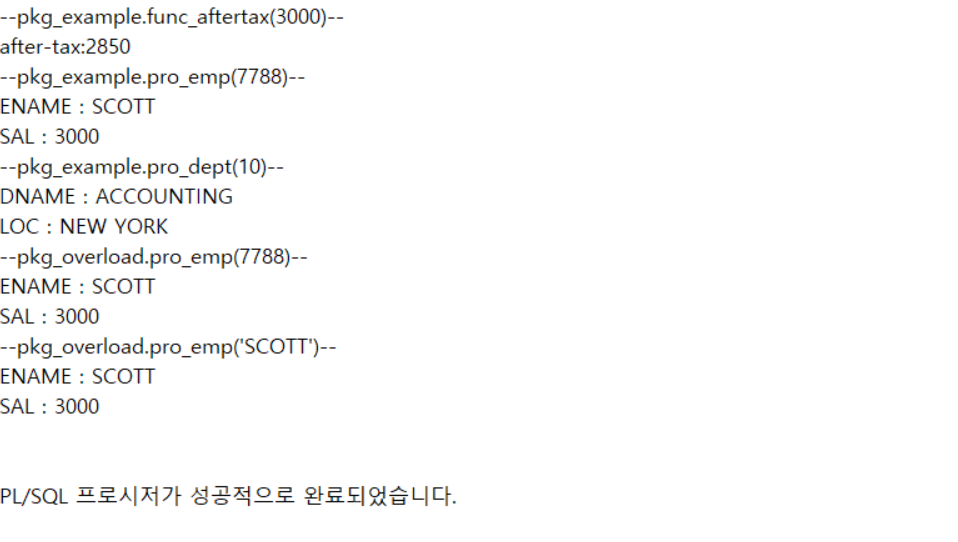

---
<!-- _class: aqua -->
<pre class="codeblock">
BEGIN
   DBMS_OUTPUT.PUT_LINE('--pkg_example.func_aftertax(3000)--');
   DBMS_OUTPUT.PUT_LINE('after-tax:' || pkg_example.func_aftertax(3000));

   DBMS_OUTPUT.PUT_LINE('--pkg_example.pro_emp(7788)--');
   pkg_example.pro_emp(7788);

   DBMS_OUTPUT.PUT_LINE('--pkg_example.pro_dept(10)--' );
   pkg_example.pro_dept(10);

   DBMS_OUTPUT.PUT_LINE('--pkg_overload.pro_emp(7788)--' );
   pkg_overload.pro_emp(7788);

   DBMS_OUTPUT.PUT_LINE('--pkg_overload.pro_emp(''SCOTT'')--' );
   pkg_overload.pro_emp('SCOTT');
END;
/

</pre>

---
<!-- _class: aqua -->
##### Q031  EMP_TRG테이블을 다음과 같이 생성하시오.

---
<!-- _class: aqua -->
<pre class="codeblock">
CREATE TABLE EMP_TRG
    AS SELECT * FROM EMP;

</pre>

---
<!-- _class: aqua -->
##### Q032  DML 실행 전에 수행할 트리거를 생성하시오.

---
<!-- _class: aqua -->
<pre class="codeblock">
CREATE OR REPLACE TRIGGER trg_emp_nodml_weekend
BEFORE
INSERT OR UPDATE OR DELETE ON EMP_TRG
BEGIN
   IF TO_CHAR(sysdate, 'DY') IN ('토', '일') THEN
      IF INSERTING THEN
         raise_application_error(-20000, '주말 사원정보 추가 불가');
      ELSIF UPDATING THEN
         raise_application_error(-20001, '주말 사원정보 수정 불가');
      ELSIF DELETING THEN
         raise_application_error(-20002, '주말 사원정보 삭제 불가');
      ELSE
         raise_application_error(-20003, '주말 사원정보 변경 불가');
      END IF;
   END IF;
END;
/

</pre>

---
<!-- _class: aqua -->
##### Q033  평일날짜로 EMP_TRG 테이블을 UPDTE 하시오.
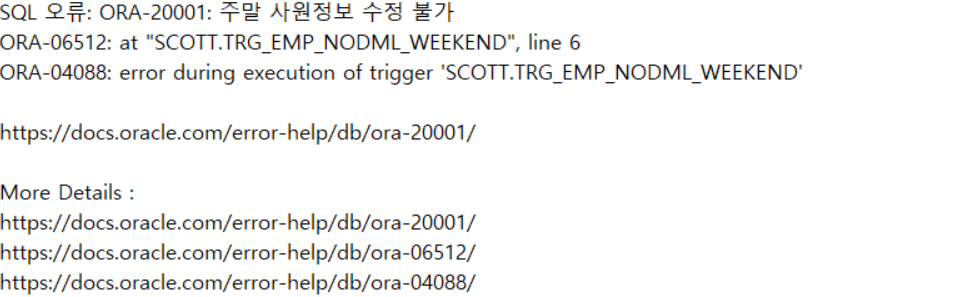

 
---
<!-- _class: aqua -->
##### Q034 주말날짜에 EMP_TRG테이블을 UPDATE 하시오.
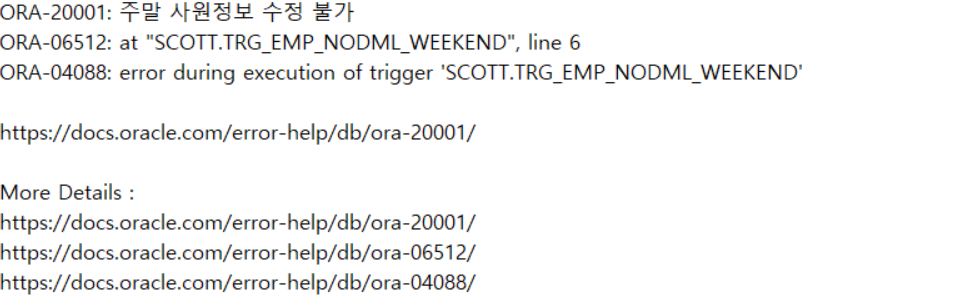

 

---
<!-- _class: aqua -->
##### Q035  EMP-TRG_LOG 테이블을 생성하시오.

---
<!-- _class: aqua -->
<pre class="codeblock">
CREATE TABLE EMP_TRG_LOG(
   TABLENAME VARCHAR2(10), -- DML이 수행된 테이블 이름
   DML_TYPE VARCHAR2(10),  -- DML 명령어의 종류
   EMPNO NUMBER(4),        -- DML 대상이 된 사원 번호
   USER_NAME VARCHAR2(30), -- DML을 수행한 USER 이름
   CHANGE_DATE DATE        -- DML이 수행된 날짜
);

</pre>

---
<!-- _class: aqua -->
##### Q036  DML 실행 후 수행할 트리거를 생성하시오.

---
<!-- _class: aqua -->
<pre class="codeblock">
CREATE OR REPLACE TRIGGER trg_emp_log
AFTER
INSERT OR UPDATE OR DELETE ON EMP_TRG
FOR EACH ROW

BEGIN

   IF INSERTING THEN
      INSERT INTO emp_trg_log
      VALUES ('EMP_TRG', 'INSERT', :new.empno,
               SYS_CONTEXT('USERENV', 'SESSION_USER'), sysdate);

   ELSIF UPDATING THEN
      INSERT INTO emp_trg_log
      VALUES ('EMP_TRG', 'UPDATE', :old.empno,
               SYS_CONTEXT('USERENV', 'SESSION_USER'), sysdate);

   ELSIF DELETING THEN
      INSERT INTO emp_trg_log
      VALUES ('EMP_TRG', 'DELETE', :old.empno,
               SYS_CONTEXT('USERENV', 'SESSION_USER'), sysdate);
   END IF;
END;
/

</pre>

---
<!-- _class: aqua -->
##### Q037  EMP_TRG 테이블에 INSERT 실행하시오.
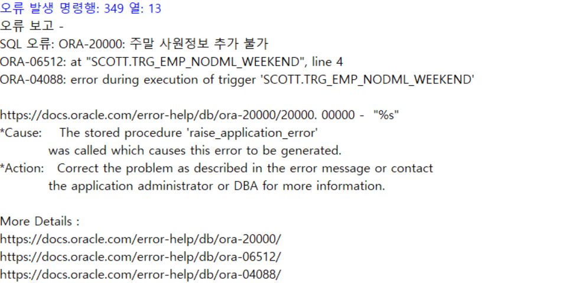

---
<!-- _class: aqua -->
<pre class="codeblock">
INSERT INTO EMP_TRG
VALUES(9999, 'TestEmp', 'CLERK', 7788,
       TO_DATE('2018-03-03', 'YYYY-MM-DD'), 1200, null, 20);

</pre>

---
<!-- _class: aqua -->
##### Q038  COMMIT 하시오.

 

---
<!-- _class: aqua -->
##### Q039 EMP_TRG 테이블의 INSERT를 확인하시오.
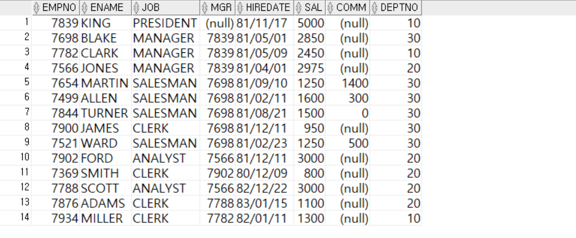

 

---
<!-- _class: aqua -->
##### Q040  EMP_TRG_LOG 테이블의 INSERT를 기록을 확인하시오.
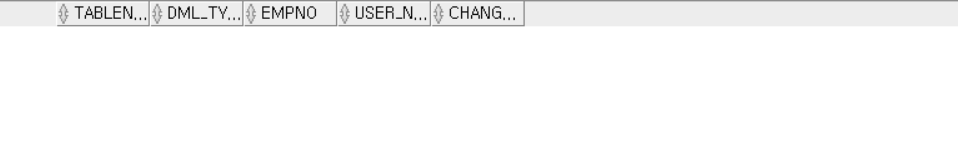

 

---
<!-- _class: aqua -->
##### Q041  EMP-TRG 테이블에 UPDATE 를 실행하시오.
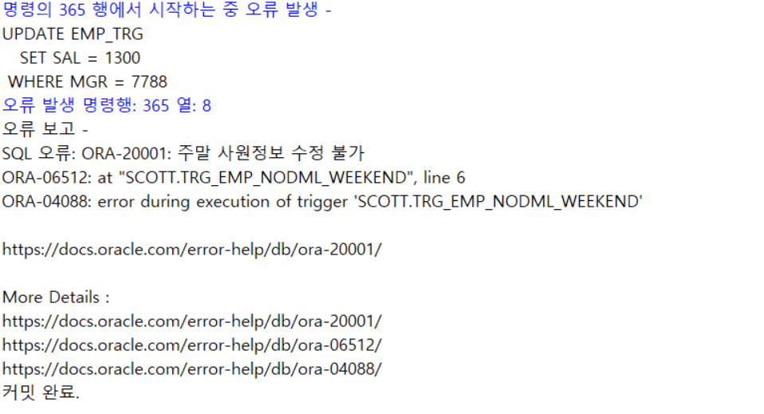

 

---
<!-- _class: aqua -->
##### Q042  USER_TRIGGERS 로 트리거 정보를 조회하시오.
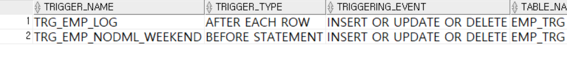

 

---
<!-- _class: purple -->
# 사고확장EX

---
<!-- _class: aqua -->
##### EX001  다음의 결과가 나오도록 내용을 작성하시오.
1. DEPT테이블의 부서번호(DEPT_NO)를 입력값으로 받으 후 부서번호(DEPTNO) , 부서이름(DNAME) , 지역(LOC)을 출력하는 pro_dept_in을 작성하시오.
2. pro_dept_in 프로시저를 통해 출력된 부서번호(DEPTNO) , 부서이름(DNAME) , 지역(LOC)을 다음과 같이 출력하는 pl/sql프로그램을 작성하시오.

---
<!-- _class: aqua -->
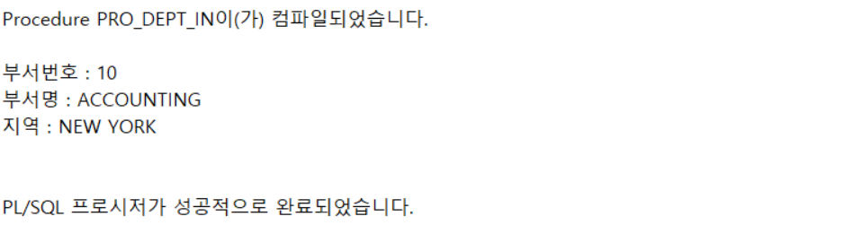

 

---
<!-- _class: aqua -->
##### EX002  다음과 같은 결과가 나오도록 내욜을 작성하시오.
1. select문에서 사용할 수 있는 func_date_kor을 작성하시오.
2. func_date_kor 함수는 date 자료형데이터를 입력받아 다음과 같이 YYYY"년"MM"월"DD"일" 형태의 데이터를 출력하시오.

 

---
<!-- _class: aqua -->
##### EX003
1. DEPT테이블과 같은 열구조 및 데이터를 가진 DEPT_TRG 테이블을 작성하시오.
2. DEPT_TRG 테이블에 DML 명령어를 사용한 기록을 저장하는 DEPT_TRG_LOG 테이블을 다음과 같이 작성하시오.

---
<!-- _class: aqua -->
|열이름|자료형|길이|설명|
|-|-|-|-|
|TABLENAME|가변형문자열|10|DML을 수행한 테이블 이름|
|DML_TYPE|가변형문자열|10|DML명령어 종류|
|DEPTNO|정수형 숫자|2|DML 대상 부서번호|
|USER_NAME|가변형문자열|30|DML을 수행한 USER이름|
|CHANGE_DATE|날짜|-|DML을 수행한 날짜|

---
<!-- _class: aqua -->
3. DEPT_TRG 테이블에 DML 명령수행기록을 DEPT_TRG_LOG에 저장하는 트리거 TRG_DEPT_LOG를 작성하시오.

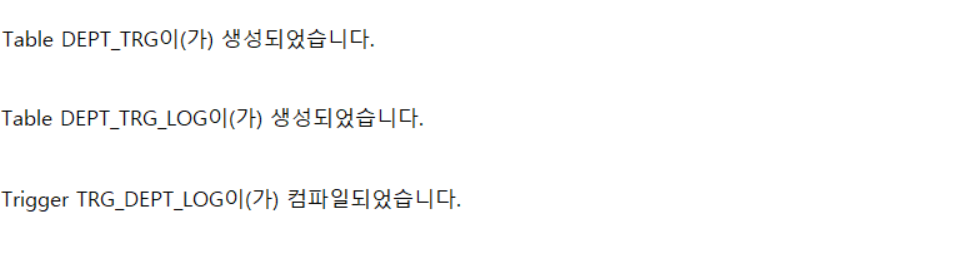

 
---

<!-- _class: aqua -->

1. CREATE PROCEDURE raise_salary(...) 는 어떤 작업을 수행하나요?  
2. RETURN v_sal * 12 는 어떤 결과를 반환하나요?  
3. IN OUT 매개변수는 어떤 상황에서 사용되나요?  
4. 프로시저와 함수의 가장 큰 차이는 무엇인가요?  
5. SELECT 함수명(...) FROM DUAL 은 어떤 방식의 호출인가요?

---

<!-- _class: red -->
# 🧪 Step 5: 기억 테스트

---

<!-- _class: aqua -->

- 프로시저와 함수의 구조적 차이는 무엇인가요?  
- OUT 매개변수는 어떻게 값을 전달하나요?  
- 저장 프로그램을 사용하는 이유는 무엇인가요?  
- EXEC 와 CALL 의 차이는 무엇인가요?  
- 함수는 어떤 문장에서 호출할 수 있나요?

---
<!-- _class: thanks -->
## 👋 열심히 들어주셔서 감사합니다!
 
> 오늘의 한 걸음이 **내일의 가능성**이 되길 바라며,