<!-- _class: cover-oracle -->
<h4 style="color:#6C757D;">
  🧠
  CodeCraft Series · Track 02
</h4>
<h1 style="color:#007BFF;">Oracle Fundamentals</h1>
<h3 style="color:#17A2B8;">SQL부터 PL/SQL까지, 오라클의 핵심을 잡다</h3>

<!-- 현재 챕터 강조 -->

  📍 <strong>현재 위치:</strong> Chapter 1 · <em>오라클 환경 설정 · 기본 SELECT</em>

<blockquote>
  실무에 바로 적용 가능한 오라클 입문서 
  데이터를 다루는 힘, SQL로 시작해요
</blockquote>

---
<!-- _class: cover-oracle -->
<h2 style="font-size:1.6em; color:#555;">📚 Oracle 트랙 목차</h2>
  <strong style="color:#FF6E7F;">PART 1 · SQL 기본</strong>

  Chapter 01: oracle_setting
  ✅▶ Chapter 02: select_basic
  ▶ Chapter 03: select_where
  ▶ Chapter 04: select_fn
  ▶ Chapter 05: select_group
  ▶ Chapter 06: select_join
  ▶ Chapter 07: select_subquery

---
<!-- _class: cover-oracle -->
<h2 style="font-size:1.6em; color:#555;">📚 Oracle 트랙 목차</h2>
 <strong style="color:#FF6E7F;">PART 2 · 데이터 조작 및 객체</strong> 

 
  ▶ Chapter 08: update_delete
  ▶ Chapter 09: transaction
  ▶ Chapter 10: ddl
  ▶ Chapter 11: object
  ▶ Chapter 12: constraint
  ▶ Chapter 13: user

---
<!-- _class: cover-oracle -->
<h2 style="font-size:1.6em; color:#555;">📚 Oracle 트랙 목차</h2>
<strong style="color:#FF6E7F;">PART 3 · PL/SQL 심화</strong>

  
  ▶ Chapter 14: plsql
  ▶ Chapter 15: record
  ▶ Chapter 16: cursor
  ▶ Chapter 17: save

  이 트랙은 오라클의 기본 SQL부터 객체 관리, PL/SQL까지  실무 중심으로 배우며, 데이터베이스 전문가로 성장합니다.

 
  
 
---
<!-- _class: orange -->
# 🧩 Step 1: 핵심 개념  

***기초 SELECT 문 실습***  
→ ***테이블 구조 확인***, ***열 조회***, ***중복 제거***, ***정렬***, ***연산 및 별칭 사용***

---

<!-- _class: aqua -->
### 🔍 테이블 구조 확인  
- DESC EMP : EMP 테이블 구조 확인  
- DESC DEPT : DEPT 테이블 구조 확인  
- DESC SALGRADE : SALGRADE 테이블 구조 확인  

---

<!-- _class: aqua -->
### 🧩 기본 SELECT 문  
- SELECT * FROM EMP : EMP 테이블 전체 조회  
- SELECT EMPNO, ENAME, DEPTNO FROM EMP : 특정 열 조회  
- SELECT DISTINCT DEPTNO FROM EMP : 중복 제거  
- SELECT DISTINCT JOB, DEPTNO FROM EMP : 복합 중복 제거  
- SELECT ALL JOB, DEPTNO FROM EMP : 중복 제거 없이 조회  

---

<!-- _class: aqua -->
### 🔗 연산 및 별칭 사용  
- SAL*12+COMM : 연간 총수입 계산  
- SAL+SAL+...+COMM : 반복 연산  
- SAL*12+COMM AS ANNSAL : 별칭 사용  

---

<!-- _class: aqua -->
### 📊 정렬  
- ORDER BY SAL : 급여 오름차순  
- ORDER BY SAL DESC : 급여 내림차순  
- ORDER BY DEPTNO ASC, SAL DESC : 복합 정렬  

---

<!-- _class: blue -->
# 🧪 Step 2: 코드 예제

---

<!-- _class: aqua -->

<pre class="codeblock">
-- 테이블 구조 확인
DESC EMP;
DESC DEPT;
DESC SALGRADE;

-- 기본 조회
SELECT * FROM EMP;
SELECT EMPNO, ENAME, DEPTNO FROM EMP;

-- 중복 제거
SELECT DISTINCT DEPTNO FROM EMP;
SELECT DISTINCT JOB, DEPTNO FROM EMP;
SELECT ALL JOB, DEPTNO FROM EMP;

-- 연산 및 별칭
SELECT ENAME, SAL, SAL*12+COMM, COMM FROM EMP;
SELECT ENAME, SAL, SAL+SAL+...+COMM, COMM FROM EMP;
SELECT ENAME, SAL, SAL*12+COMM AS ANNSAL, COMM FROM EMP;

-- 정렬
SELECT * FROM EMP ORDER BY SAL;
SELECT * FROM EMP ORDER BY SAL DESC;
SELECT * FROM EMP ORDER BY DEPTNO ASC, SAL DESC;
</pre>

---

<!-- _class: aqua -->

## ✅ 명령어 요약표 (1/2)

| 명령어 | 설명 |
|--------|------|
| DESC EMP | EMP 테이블 구조 확인 |
| SELECT * FROM EMP | 전체 열 조회 |
| SELECT EMPNO, ENAME, DEPTNO | 특정 열 조회 | 

---

<!-- _class: aqua -->

## ✅ 명령어 요약표 (2/2)

| 명령어 | 설명 |
|--------|------|
| SELECT DISTINCT DEPTNO | 중복 제거 |
| SAL*12+COMM | 연간 총수입 계산 |
| AS ANNSAL | 별칭 지정 |
| ORDER BY SAL DESC | 급여 내림차순 정렬 |

---
<!-- _class: aqua -->

- ***DESC*** 는 테이블 구조를 보여줍니다  
- ***SELECT*** 는 데이터를 조회합니다  
- ***DISTINCT*** 는 중복을 제거합니다  
- ***AS*** 는 열에 별칭을 부여합니다  
- ***ORDER BY*** 는 정렬 기준을 지정합니다  

---
<!-- _class: green -->
# 🧪 Step 3: 연습문제

---
<!-- _class: aqua -->
##### Q001  EMP 테이블 구성을 살펴보시오

 

---
<!-- _class: aqua -->
##### Q002 DEPT 테이블 구성을 살펴보시오
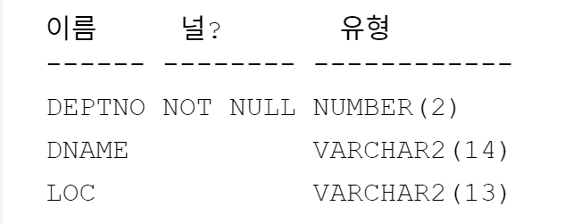

 

---
<!-- _class: aqua -->
##### Q003  SALGRADE 테이블 구성을 살펴보시오
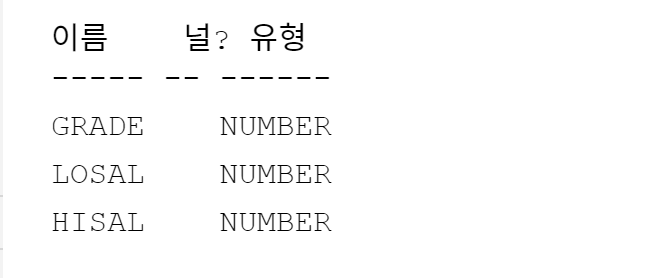

 

 
---
<!-- _class: aqua -->
##### Q004  EMP 테이블 전체열을 조회하시오
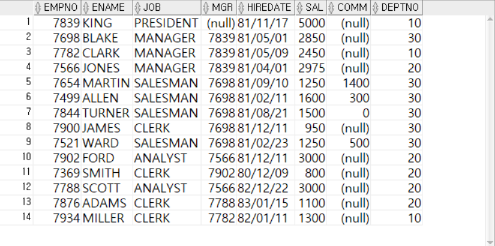

 
 

---
<!-- _class: aqua -->
##### Q005  EMP 테이블의  EMPNO, ENAME, DEPTNO 열을 조회하시오
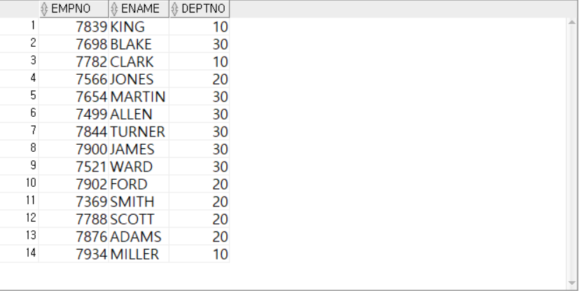

 

---
<!-- _class: aqua -->
##### Q006  EMP 테이블의  DEPTNO 열의 중복을 제거하고 조회하시오
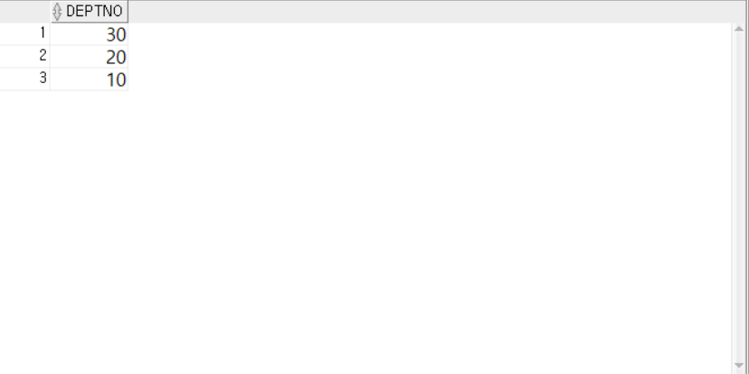

 

---
<!-- _class: aqua -->
##### Q007  EMP 테이블의  JOB, DEPTNO열의 중복을 제거 조회하시오
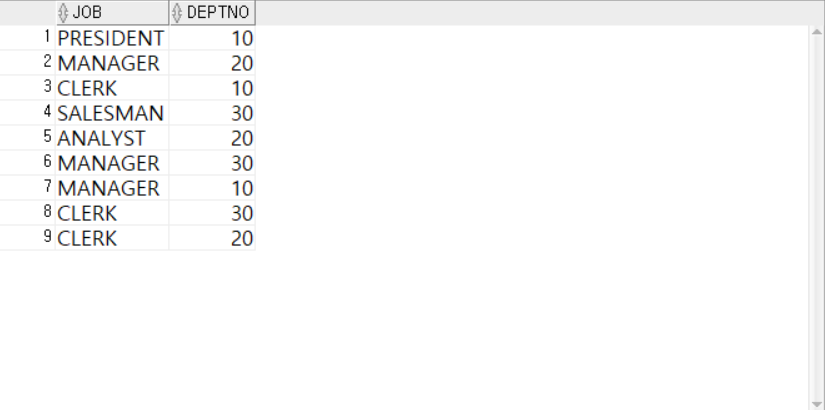

 

---
<!-- _class: aqua -->
##### Q008  EMP 테이블의  JOB, DEPTNO열의 중복을 제거하지 않고 그대로 모두 조회하시오
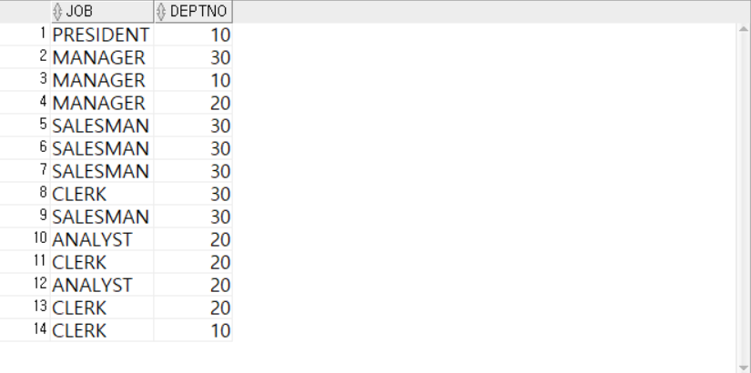

 
 

---
<!-- _class: aqua -->
##### Q009 EMP 테이블의열에에 연산식을 이용하여 '연간총수입'을 조회하시오.
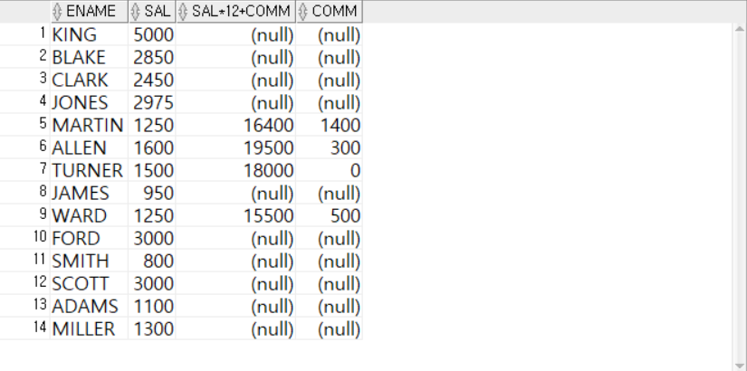

 

---
<!-- _class: aqua -->
##### Q010  EMP 테이블의 열열 더하기 연산식을이용하여 '연간총수입'을 조회하시오.
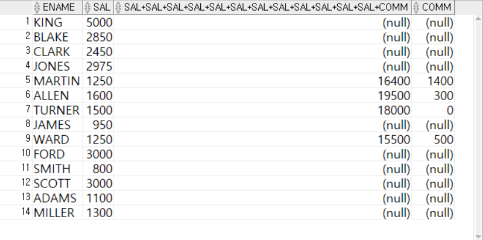

 

---
<!-- _class: aqua -->
##### Q011  EMP 테이블의 열 별칭을 사용하여 '연간총수입'을 조회하시오.
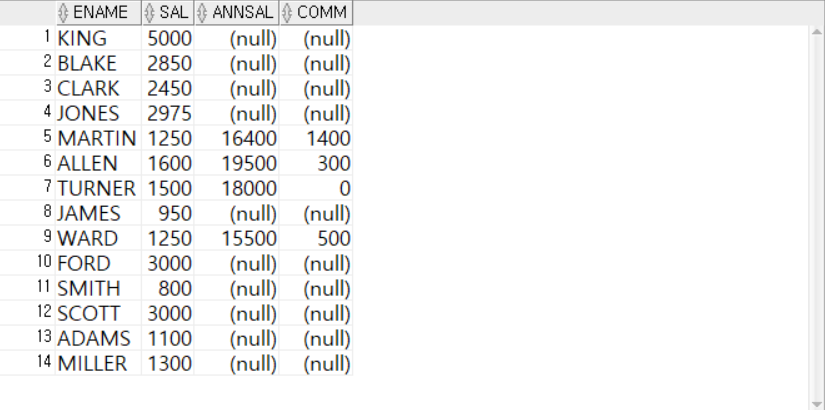
 
---
<!-- _class: aqua -->
##### Q012 EMP 테이블의 모든 열을 급여기준으로 오름차순 정렬하시오.
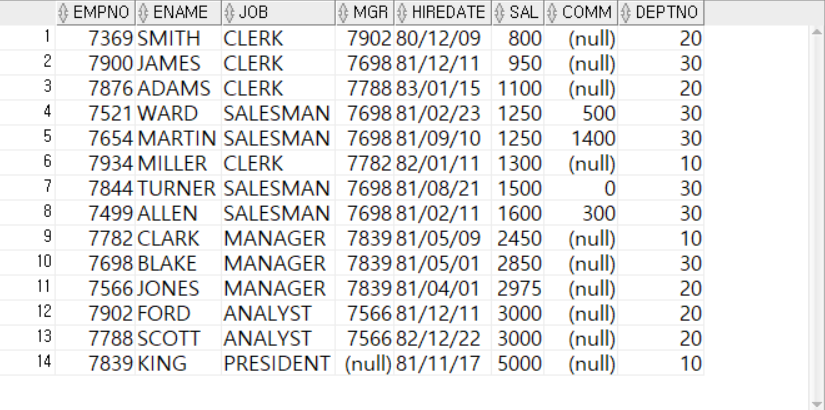

 

---
<!-- _class: aqua -->
##### Q013  EMP 테이블의 모든 열을 급여기준으로 내림차순순 정렬하시오.
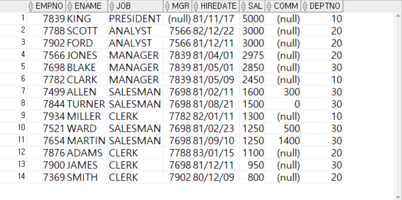

 

---
<!-- _class: aqua -->

##### Q014  EMP 테이블의 모든 열을 전체열을 부서번호(오름차순)와 급여(내림차순)으로 정렬하시오.
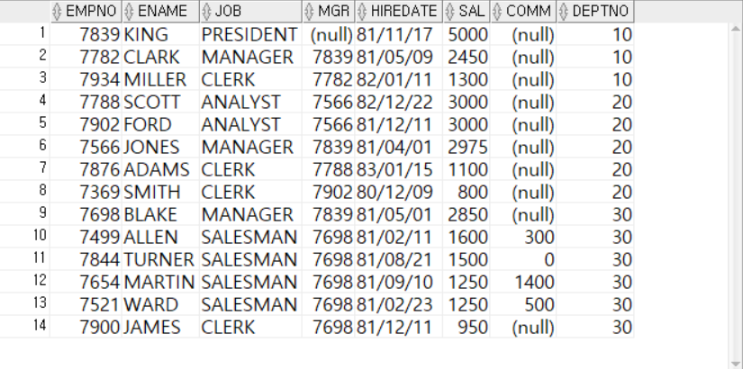

 

---
<!-- _class: aqua -->

1. DESC EMP 명령어는 어떤 정보를 보여주나요?  
2. SELECT DISTINCT DEPTNO FROM EMP 는 어떤 결과를 반환하나요?  
3. SAL*12+COMM 는 어떤 계산을 수행하나요?  
4. ORDER BY DEPTNO ASC, SAL DESC 는 어떤 방식으로 정렬하나요?

---
<!-- _class: purple -->
# 🧪 Step 5: 사고확장

---
<!-- _class: aqua --> 
##### EX001.  EMP테이블의 JOB열 데이터를 중복없이 조회하시오.
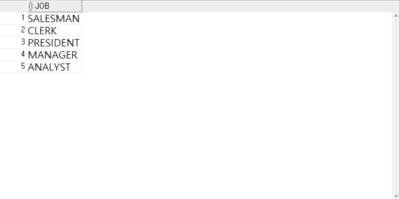

 

---
<!-- _class: aqua --> 
##### EX002. 
- 조회할 테이블은 EMP 테이블이며 모든 열을 출력하시오.
- 별칭
  EMPNO → EMPLOYEE_NO,
  ENAME → EMPLOYEE_NAME,
  MGR   → MANAGER,
  SAL   → SALARY,
  COMM  → COMMISSION,
  DEPTNO → DEPARTMENT_NO
- 부서번호를 기준으로 내림차순으로 정렬하되,
  부서번호가 같다면 사원이름을 기준으로 오름차순 정렬하시오.

---
<!-- _class: aqua --> 
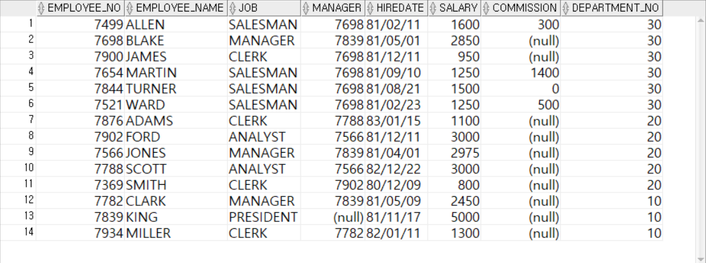

 

---

<!-- _class: red -->
# 🧪 Step 6: 기억 테스트

---

<!-- _class: aqua -->

- DESC 명령어는 어떤 용도로 사용되나요?  
- SELECT * 와 SELECT EMPNO, ENAME 의 차이는 무엇인가요?  
- DISTINCT 와 ALL 의 차이는 무엇인가요?  
- AS 키워드는 어떤 역할을 하나요?  
- ORDER BY SAL DESC 는 어떤 순서로 데이터를 보여주나요?

---

<!-- _class: thanks -->
## 👋 열심히 들어주셔서 감사합니다!
 
> 오늘의 한 걸음이 **내일의 가능성**이 되길 바라며,
  