<!-- _class: cover-oracle -->
<h4 style="color:#6C757D;">
  🧠
  CodeCraft Series · Track 02
</h4>
<h1 style="color:#007BFF;">Oracle Fundamentals</h1>
<h3 style="color:#17A2B8;">SQL부터 PL/SQL까지, 오라클의 핵심을 잡다</h3>

<!-- 현재 챕터 강조 -->

  📍 <strong>현재 위치:</strong> Chapter 1 · <em>오라클 환경 설정 · 기본 SELECT</em>

<blockquote>
  실무에 바로 적용 가능한 오라클 입문서 
  데이터를 다루는 힘, SQL로 시작해요
</blockquote>

---
<!-- _class: cover-oracle -->
<h2 style="font-size:1.6em; color:#555;">📚 Oracle 트랙 목차</h2>
  <strong style="color:#FF6E7F;">PART 1 · SQL 기본</strong>

  ▶Chapter 01: oracle_setting
  ▶ Chapter 02: select_basic
  ✅▶  Chapter 03: select_where
  ▶ Chapter 04: select_fn
  ▶ Chapter 05: select_group
  ▶ Chapter 06: select_join
  ▶ Chapter 07: select_subquery

---
<!-- _class: cover-oracle -->
<h2 style="font-size:1.6em; color:#555;">📚 Oracle 트랙 목차</h2>
 <strong style="color:#FF6E7F;">PART 2 · 데이터 조작 및 객체</strong> 

 
  ▶ Chapter 08: update_delete
  ▶ Chapter 09: transaction
  ▶ Chapter 10: ddl
  ▶ Chapter 11: object
  ▶ Chapter 12: constraint
  ▶ Chapter 13: user

---
<!-- _class: cover-oracle -->
<h2 style="font-size:1.6em; color:#555;">📚 Oracle 트랙 목차</h2>
<strong style="color:#FF6E7F;">PART 3 · PL/SQL 심화</strong>

  
  ▶ Chapter 14: plsql
  ▶ Chapter 15: record
  ▶ Chapter 16: cursor
  ▶ Chapter 17: save

  이 트랙은 오라클의 기본 SQL부터 객체 관리, PL/SQL까지  실무 중심으로 배우며, 데이터베이스 전문가로 성장합니다.

 

 
 
---

<!-- _class: orange -->
# 🧩 Step 1: 핵심 개념  
***조건에 맞는 데이터 조회하기***  
→ ***WHERE절***, ***비교 연산자***, ***논리 연산자***, ***LIKE 패턴***, ***NULL 처리***, ***집합 연산자***

---

<!-- _class: aqua -->
### 🔍 WHERE 조건절 기본  
- WHERE : 조건에 맞는 행만 조회  
- = / != / <> / ^= : 등가 비교  
- AND / OR / NOT : 논리 연산  
- BETWEEN ... AND ... : 범위 지정  
- LIKE / NOT LIKE : 패턴 검색  
- IS NULL / IS NOT NULL : NULL 여부 확인  

---

<!-- _class: aqua -->
### 🧩 집합 연산자  
- UNION : 중복 제거 후 합집합  
- UNION ALL : 중복 포함 합집합  
- MINUS : 차집합  
- INTERSECT : 교집합  

---

<!-- _class: blue -->
# 🧪 Step 2: 코드 예제

---

<!-- _class: aqua -->

<pre class="codeblock">
-- 기본 조회
SELECT * FROM EMP;

-- 조건 조회
SELECT * FROM EMP WHERE DEPTNO = 30;
SELECT * FROM EMP WHERE DEPTNO = 30 AND JOB = 'SALESMAN';
SELECT * FROM EMP WHERE DEPTNO = 30 OR JOB = 'CLERK';

-- 연산 조건
SELECT * FROM EMP WHERE SAL * 12 = 36000;
SELECT * FROM EMP WHERE SAL >= 3000;

-- 문자열 비교
SELECT * FROM EMP WHERE ENAME >= 'F';
SELECT * FROM EMP WHERE ENAME <= 'FORZ';

-- 부정 조건
SELECT * FROM EMP WHERE SAL != 3000;
SELECT * FROM EMP WHERE SAL <> 3000;
SELECT * FROM EMP WHERE SAL ^= 3000;
SELECT * FROM EMP WHERE NOT SAL = 3000;

-- IN / NOT IN
SELECT * FROM EMP WHERE JOB IN ('MANAGER', 'SALESMAN', 'CLERK');
SELECT * FROM EMP WHERE JOB NOT IN ('MANAGER', 'SALESMAN', 'CLERK');

-- 범위 조건
SELECT * FROM EMP WHERE SAL BETWEEN 2000 AND 3000;
SELECT * FROM EMP WHERE SAL NOT BETWEEN 2000 AND 3000;

-- LIKE 조건
SELECT * FROM EMP WHERE ENAME LIKE 'S%';
SELECT * FROM EMP WHERE ENAME LIKE '_L%';
SELECT * FROM EMP WHERE ENAME LIKE '%AM%';
SELECT * FROM EMP WHERE ENAME NOT LIKE '%AM%';

-- NULL 조건
SELECT * FROM EMP WHERE COMM IS NULL;
SELECT * FROM EMP WHERE MGR IS NOT NULL;

-- 집합 연산자
SELECT EMPNO, ENAME, SAL, DEPTNO FROM EMP WHERE DEPTNO = 10
UNION
SELECT EMPNO, ENAME, SAL, DEPTNO FROM EMP WHERE DEPTNO = 20;

-- MINUS / INTERSECT
SELECT EMPNO, ENAME, SAL, DEPTNO FROM EMP
MINUS
SELECT EMPNO, ENAME, SAL, DEPTNO FROM EMP WHERE DEPTNO = 10;

SELECT EMPNO, ENAME, SAL, DEPTNO FROM EMP
INTERSECT
SELECT EMPNO, ENAME, SAL, DEPTNO FROM EMP WHERE DEPTNO = 10;
</pre>

---

<!-- _class: aqua -->

## ✅ 조건절 요약표

| 조건 | 설명 |
|------|------|
| WHERE DEPTNO = 30 | 부서번호가 30인 행 |
| SAL * 12 = 36000 | 연봉이 36000인 행 |
| ENAME LIKE 'S%' | 이름이 S로 시작 |
| SAL BETWEEN 2000 AND 3000 | 급여가 2000~3000 사이 |
| COMM IS NULL | 커미션이 없는 행 |
| JOB IN (...) | 특정 직책 포함 |
| UNION | 중복 제거 합집합 |
| MINUS | 차집합 |
| INTERSECT | 교집합 |

---

<!-- _class: green -->
# 🧪 Step 3: 연습문제

 

---
<!-- _class: aqua -->
##### Q001 - EMP테이블의 모든 열을  조회하시오.

---
<!-- _class: aqua -->
<pre class="codeblock">
SELECT *
  FROM EMP
</pre>

---
<!-- _class: aqua -->
##### Q002 EMP테이블에서 부서번호가 30인 데이터만 조회하시오.

---
<!-- _class: aqua -->
<pre class="codeblock">
SELECT *
  FROM EMP
 WHERE DEPTNO = 30;
</pre>

---
<!-- _class: aqua -->
##### Q003  EMP테이블에서  AND를 이용하여 부서번호가 30이고 JOB이 'SALESMAN' 인 데이터만 조회하시오.

---
<!-- _class: aqua -->
<pre class="codeblock">
SELECT *
  FROM EMP
 WHERE DEPTNO = 30
   AND JOB = 'SALESMAN';
</pre>

---
<!-- _class: aqua -->
##### Q004  EMP테이블에서  OR를 이용하여 부서번호가 30이거나 JOB이 'CLERK' 인 데이터만 조회하시오.
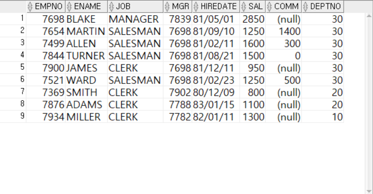

---
<!-- _class: aqua -->
<pre class="codeblock">
SELECT *
  FROM EMP
 WHERE DEPTNO = 30
    OR JOB = 'CLERK';
</pre>

---
<!-- _class: aqua -->
##### Q005 EMP테이블에서 SAL 열에 12를 곱한값이 36000인 행을 조회하시오.
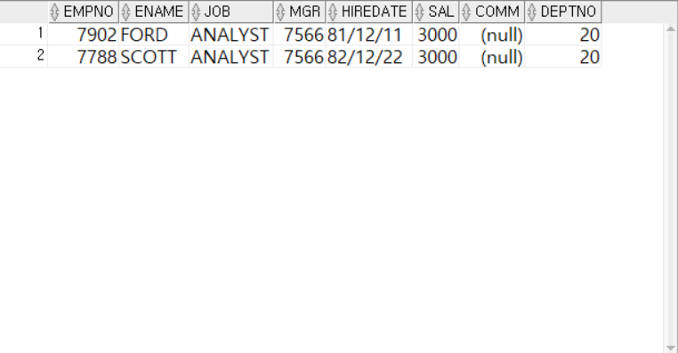

---
<!-- _class: aqua -->
<pre class="codeblock">
SELECT *
  FROM EMP
 WHERE SAL * 12 = 36000;
</pre>

---
<!-- _class: aqua -->
##### Q006 EMP테이블에서 SAL 열이 3000이상인 행을 조회하시오.
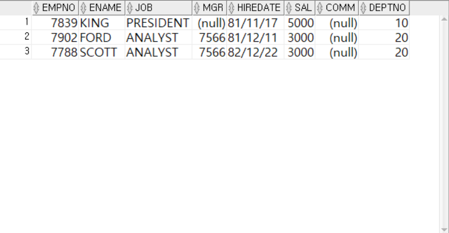

---
<!-- _class: aqua -->
<pre class="codeblock">
SELECT *
  FROM EMP
 WHERE SAL >= 3000;
</pre>

---
<!-- _class: aqua -->
##### Q007 EMP테이블에서  ENAME 열의 첫문자가 F와 같거나 뒤에 있는 행을 조회하시오.
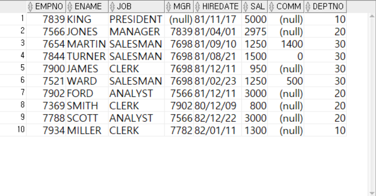

---
<!-- _class: aqua -->
<pre class="codeblock">
SELECT *
  FROM EMP
 WHERE ENAME >= 'F';
</pre>

---
<!-- _class: aqua -->
##### Q008 EMP테이블에서  ENAME 열의 문자열이 첫문자 F, 두번째 문자 O, 세번째 문자 R, 네번째문자열이 Z 인 문자열보다 앞에 있는 행을 조회하시오.
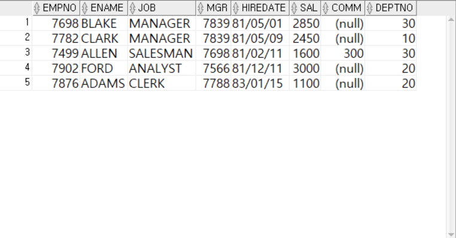

---
<!-- _class: aqua -->
<pre class="codeblock">
SELECT *
  FROM EMP
 WHERE ENAME <= 'FORZ';
</pre>

---
<!-- _class: aqua -->
##### Q009 EMP테이블에서   != 를 이용하여 SAL열이 3000이 아닌 행을 조회하시오.

---
<!-- _class: aqua -->
<pre class="codeblock">
SELECT *
  FROM EMP
 WHERE SAL != 3000;
</pre>

---
<!-- _class: aqua -->
##### Q010 EMP테이블에서   <> 를 이용하여 SAL열이 3000이 아닌 행을 조회하시오.

---
<!-- _class: aqua -->
<pre class="codeblock">
SELECT *
  FROM EMP
 WHERE SAL <> 3000;
</pre>

---
<!-- _class: aqua -->
##### Q011 EMP테이블에서   ^= 를 이용하여 SAL열이 3000이 아닌 행을 조회하시오.

---
<!-- _class: aqua -->
<pre class="codeblock">
SELECT *
  FROM EMP
 WHERE SAL ^= 3000;
</pre>

---
<!-- _class: aqua -->
##### Q012 EMP테이블에서   NOT를를 이용하여 SAL열이 3000이 아닌 행을 조회하시오.

---
<!-- _class: aqua -->
<pre class="codeblock">
SELECT *
  FROM EMP
 WHERE NOT SAL = 3000;
</pre>

---
<!-- _class: aqua -->
##### Q013 EMP테이블에서   OR 를 이용하여 JOB 열이 'MANAGER' ,'SALESMAN' , 'CLERK' 중 하나라도 포함되는 행을 조회하시오.

---
<!-- _class: aqua -->
<pre class="codeblock">
SELECT *
  FROM EMP
 WHERE JOB = 'MANAGER'
    OR JOB = 'SALESMAN'
    OR JOB = 'CLERK';
</pre>

---
<!-- _class: aqua -->
##### Q014 EMP테이블에서   IN 를 이용하여 JOB 열이 'MANAGER' ,'SALESMAN' , 'CLERK' 중 하나라도 포함되는 행을 조회하시오.

---
<!-- _class: aqua -->
<pre class="codeblock">
SELECT *
  FROM EMP
 WHERE JOB IN ('MANAGER', 'SALESMAN', 'CLERK');
</pre>

---
<!-- _class: aqua -->
##### Q015 EMP테이블에서   등가연산자(!= , <>, ^=)와 AND 를 이용하여 JOB 열이 'MANAGER' ,'SALESMAN' , 'CLERK' 중 하나라도 <u>포함되지않는</u> 행을 조회하시오.

---
<!-- _class: aqua -->
<pre class="codeblock">
SELECT *
  FROM EMP
 WHERE JOB != 'MANAGER'
   AND JOB <> 'SALESMAN'
   AND JOB ^= 'CLERK';
</pre>

---
<!-- _class: aqua -->
##### Q016 EMP테이블에서  NOT  IN 를 이용하여 JOB 열이 'MANAGER' ,'SALESMAN' , 'CLERK' 중 하나라도 <u>포함되지않는</u> 행을 조회하시오.

---
<!-- _class: aqua -->
<pre class="codeblock">
SELECT *
  FROM EMP
 WHERE JOB NOT IN ('MANAGER', 'SALESMAN', 'CLERK');
</pre>

---
<!-- _class: aqua -->
##### Q017  EMP테이블에서  대소비교연산자(<=  , >= )  and 를 이용하여 sal 열이 2000이상 3000이하인인 행을 조회하시오.

---
<!-- _class: aqua -->
<pre class="codeblock">
SELECT *
  FROM EMP
 WHERE SAL >= 2000
   AND SAL <= 3000;
</pre>

---
<!-- _class: aqua -->
##### Q018  EMP테이블에서  BETWEEN AND 를 이용하여 sal 열이 2000이상 3000이하인인 행을 조회하시오.

---
<!-- _class: aqua -->
<pre class="codeblock">
SELECT *
  FROM EMP
 WHERE SAL BETWEEN 2000 AND 3000;
</pre>

---
<!-- _class: aqua -->
##### Q019  EMP테이블에서 NOT BETWEEN AND 를 이용하여 sal 열이 2000이상 3000이하인 사이 이외의 행을 조회하시오.
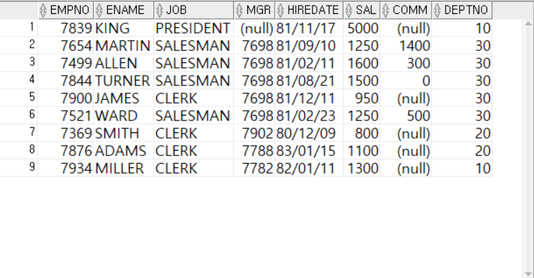

---
<!-- _class: aqua -->
<pre class="codeblock">
SELECT *
  FROM EMP
 WHERE SAL NOT BETWEEN 2000 AND 3000;
</pre>

---
<!-- _class: aqua -->
##### Q020  EMP테이블에서 ENAME이 S로 시작하는 행을 조회하시오.

---
<!-- _class: aqua -->
<pre class="codeblock">
SELECT *
  FROM EMP
 WHERE ENAME LIKE 'S%';
</pre>

---
<!-- _class: aqua -->
##### Q021  EMP테이블에서 ENAME의 두번째 글자가 L인  행을 조회하시오.

---
<!-- _class: aqua -->
<pre class="codeblock">
SELECT *
  FROM EMP
 WHERE ENAME LIKE '_L%';
</pre>

---
<!-- _class: aqua -->
##### Q022  EMP테이블에서 ENAME에  AN이 포함되어 있는 행을 조회하시오.

---
<!-- _class: aqua -->
<pre class="codeblock">
SELECT *
  FROM EMP
 WHERE ENAME LIKE '%AM%';
</pre>

---
<!-- _class: aqua -->
##### Q023  EMP테이블에서 ENAME에  AN이 포함되어 있지 않는 행을 조회하시오.

---
<!-- _class: aqua -->
<pre class="codeblock">
SELECT *
  FROM EMP
 WHERE ENAME NOT LIKE '%AM%';
</pre>

---
<!-- _class: aqua -->
##### Q024  EMP테이블에서 별칭을 사용하여 다음과 같이 '연간총수입' 행을 조회하시오.

---
<!-- _class: aqua -->
<pre class="codeblock">
SELECT ENAME, SAL, SAL*12+COMM AS ANNSAL, COMM
  FROM EMP;
</pre>

---
<!-- _class: aqua -->
##### Q025   코드확인 
- NULL의 의미
- 비어 있는 상태 , 현재 무슨 값인지 확정 되지 않은 상태, 값 자체가 존재하지 않은 상태
- NULL과 비교연산자(=) 와 같이 사용하면 안됨.
- 어떤값인지 모르므로 작은지, 큰지 모르기 때문에 값이 안나옴.

---
<!-- _class: aqua -->

---
<!-- _class: aqua -->
<pre class="codeblock">
SELECT *
  FROM EMP
 WHERE COMM = NULL;
</pre>

---
<!-- _class: aqua -->
##### Q026   IS NULL
- 상태확인
- NULL 인지 아닌지를 비교하는 용도

---
<!-- _class: aqua -->
<pre class="codeblock">
SELECT *
  FROM EMP
 WHERE COMM IS NULL;
</pre>

---
<!-- _class: aqua -->
##### Q027 EMP테이블에서 직송상관이 있는데이터만 조회하시오
- MGR열이 NULL 이 아닌 행조회 

---
<!-- _class: aqua -->
<pre class="codeblock">
SELECT *
  FROM EMP
 WHERE MGR IS NOT NULL;
</pre>

---
<!-- _class: aqua -->
##### Q028  - 되는 코드는?
- 있는지 없는지만 판단.
- 다음코드를 해석 하시오.
<pre class="codeblock">
SELECT *
  FROM EMP
 WHERE SAL > NULL
   AND COMM IS NULL;
</pre>

---
<!-- _class: aqua -->

---
<!-- _class: aqua -->
##### Q029  - 되는 코드는?
- 있는지 없는지만 판단.
- 다음코드를 해석석하시오.
<pre class="codeblock">
SELECT *
  FROM EMP
 WHERE SAL > NULL
    OR COMM IS NULL;
</pre>

---
<!-- _class: aqua -->

---
<!-- _class: aqua -->
##### Q030   UNION을 이용하여 DEPTNO가 10이거나, 20인 데이터의  EMPNO, ENAME, SAL, DEPTNO 열을 조회하시오.
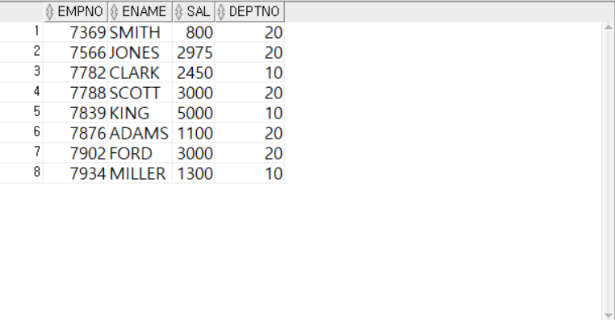

---
<!-- _class: aqua -->
<pre class="codeblock">
SELECT EMPNO, ENAME, SAL, DEPTNO
  FROM EMP
 WHERE DEPTNO = 10
UNION

SELECT EMPNO, ENAME, SAL, DEPTNO
  FROM EMP
 WHERE DEPTNO = 20;

</pre>

---
<!-- _class: aqua -->
##### Q031   에러가 나는 이유는?
- 열의 갯수가 다를때

---
<!-- _class: aqua -->
<pre class="codeblock">
SELECT EMPNO, ENAME, SAL, DEPTNO
  FROM EMP
 WHERE DEPTNO = 10
UNION
SELECT EMPNO, ENAME, SAL
  FROM EMP
 WHERE DEPTNO = 20;
</pre>

---
<!-- _class: aqua -->
##### Q032   에러가 나는 이유는?
- 자료형이 다를때 

---
<!-- _class: aqua -->
<pre class="codeblock">
SELECT EMPNO, ENAME, SAL, DEPTNO
  FROM EMP
 WHERE DEPTNO = 10
UNION
SELECT ENAME, EMPNO, DEPTNO, SAL
  FROM EMP
 WHERE DEPTNO = 20;
</pre>

 
---
<!-- _class: aqua -->
##### Q033  동작하는 이유는?
- 출력 열개수와 자료형이 같으므로 동작가능!
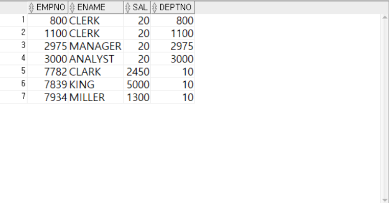

---
<!-- _class: aqua -->
<pre class="codeblock">
SELECT EMPNO, ENAME, SAL, DEPTNO
  FROM EMP
 WHERE DEPTNO = 10
UNION
SELECT SAL, JOB, DEPTNO, SAL
  FROM EMP
 WHERE DEPTNO = 20;
</pre>

---
<!-- _class: aqua -->
##### Q034  UNION과 UNION ALL의 차이는?

---
<!-- _class: aqua -->
<pre class="codeblock">
SELECT EMPNO, ENAME, SAL, DEPTNO
  FROM EMP
 WHERE DEPTNO = 10
UNION
SELECT EMPNO, ENAME, SAL, DEPTNO
  FROM EMP
 WHERE DEPTNO = 10;
</pre>

---
<!-- _class: aqua -->
##### Q035   UNION과 UNION ALL의 차이는?
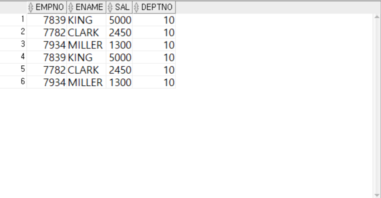

---
<!-- _class: aqua -->
<pre class="codeblock">
SELECT EMPNO, ENAME, SAL, DEPTNO
  FROM EMP
 WHERE DEPTNO = 10
UNION ALL
SELECT EMPNO, ENAME, SAL, DEPTNO
  FROM EMP
 WHERE DEPTNO = 10;
</pre>

---
<!-- _class: aqua -->
##### Q036  MINUS의 의미는?
- EMP테이블 전체행을 조회한 첫번째 SELECT문의 결과에서 10번부서에 있는 사원데이터를 제외한 결과값
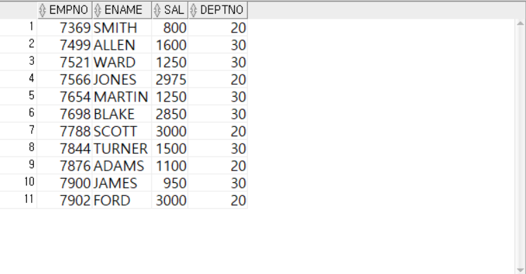

---
<!-- _class: aqua -->
<pre class="codeblock">
SELECT EMPNO, ENAME, SAL, DEPTNO
  FROM EMP
MINUS
SELECT EMPNO, ENAME, SAL, DEPTNO
  FROM EMP
 WHERE DEPTNO = 10;
</pre>

---
<!-- _class: aqua -->
##### Q037  INTERSECT 의미는?  교집합 
- 두 SELECT 문의 결과값이 같은데이터만 출력

---
<!-- _class: aqua -->
<pre class="codeblock">
SELECT EMPNO, ENAME, SAL, DEPTNO
  FROM EMP
INTERSECT
SELECT EMPNO, ENAME, SAL, DEPTNO
  FROM EMP
 WHERE DEPTNO = 10;
</pre>

---
<!-- _class: purple -->
# 사고확장

 

---
<!-- _class: aqua -->
##### EX001  EMP테이블에서 ENAME이 S로 끝나는 사원데이터를 모두 조회하시오
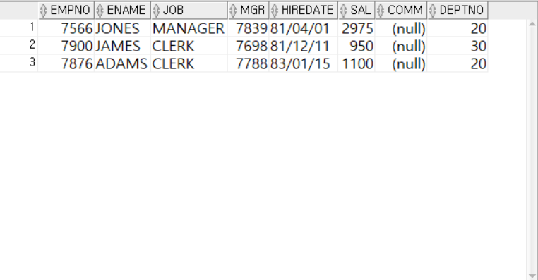

 

---
<!-- _class: aqua -->
##### EX002  EMP테이블에서 DEPTNO가 30인 사원 중 직책이(JOB)이 SALESMAN 인 사원의 EMPNO, ENAME, JOB, SAL, DEPTNO를 조회하시오

 

---
<!-- _class: aqua -->
##### EX003  집합연산자( UNION을 )를 사용하지 않은 방식
- EMP테이블에서 IN 연산자를 이용하여   DEPTNO 가 20 또는 30인 사원의 SAL이  2000 초과인 사원을 조회하시오

---
<!-- _class: aqua -->

 
---
<!-- _class: aqua -->
##### EX003   집합연산자( UNION을 )를 사용한 방식
- EMP테이블에서 IN 연산자를 이용하여   DEPTNO 가 20 또는 30인 사원의 SAL이  2000 초과인 사원을 조회하시오
---
<!-- _class: aqua -->

 

---
<!-- _class: aqua -->
#####  EX004  EMP테이블에서 NOT BETWEEN AND 연산자를 사용하지 않고 SAL이 2000이상 3000이하의 값이 아닌 데이터만 조회하시오.
-- EMP테이블에서 
-- NOT BETWEEN AND 연산자를 사용하지 않고 [ SAL이 2000이상 3000이하의 값을 가진 데이터] 아닌값 
-- 조회하시오.
-- Q1. 2000~3000 사이인값 표현 (2개)
-- Q2. 2000~3000 사이가 아닌값 표현 NOT BETWEEN AND 사용 (1개) 
-- Q3. 2000~3000 사이가 아닌값 표현 or 사용 (1개) 

---
<!-- _class: aqua -->

---
<!-- _class: aqua -->
##### EX005  EMP테이블에서 ENAME에 E가 포함되고 DEPTNO가 30인 사원의 급여가 1000~2000사이가 아닌 사원의  ENAME, EMPNO, SAL, DEPTNO 를 조회하시오.

---
<!-- _class: aqua -->

---
<!-- _class: aqua -->
##### EX006
- EMP테이블에서  COMM 이 없고  ,  MGR은 존재하면 JOB 이 'MANAGER', 'CLERK' 인 사원 중 사원의 이름2번째 글자기 L 이 아닌 사원의 정보를 조회하시오.
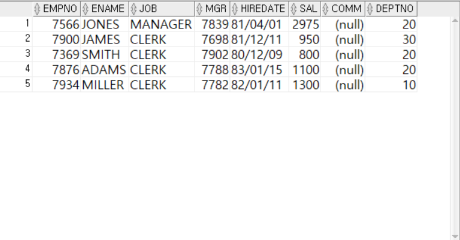

---

<!-- _class: aqua -->
1. SAL BETWEEN 2000 AND 3000 은 어떤 범위를 의미하나요?  
2. ENAME LIKE '_L%' 는 어떤 패턴을 찾나요?  
3. COMM IS NULL 은 어떤 상태를 의미하나요?  
4. UNION 과 UNION ALL 의 차이는 무엇인가요?  
5. SAL ^= 3000 은 어떤 조건을 의미하나요?

---

<!-- _class: red -->
# 🧪 Step 5: 기억 테스트

---

<!-- _class: aqua -->

- WHERE 절은 어떤 역할을 하나요?  
- LIKE '%S' 는 어떤 문자열을 찾나요?  
- NOT IN (...) 은 어떤 조건을 의미하나요?  
- BETWEEN ... AND ... 은 어떤 범위를 지정하나요?  
- IS NULL 과 = NULL 의 차이는 무엇인가요?
 
---
<!-- _class: thanks -->
## 👋 열심히 들어주셔서 감사합니다!
 
> 오늘의 한 걸음이 **내일의 가능성**이 되길 바라며,
  