<!-- _class: cover-oracle -->
<h4 style="color:#6C757D;">
  🧠
  CodeCraft Series · Track 02
</h4>
<h1 style="color:#007BFF;">Oracle Fundamentals</h1>
<h3 style="color:#17A2B8;">SQL부터 PL/SQL까지, 오라클의 핵심을 잡다</h3>

<!-- 현재 챕터 강조 -->

  📍 <strong>현재 위치:</strong> Chapter 1 · <em>오라클 환경 설정 · 기본 SELECT</em>

<blockquote>
  실무에 바로 적용 가능한 오라클 입문서 
  데이터를 다루는 힘, SQL로 시작해요
</blockquote>

---
<!-- _class: cover-oracle -->
<h2 style="font-size:1.6em; color:#555;">📚 Oracle 트랙 목차</h2>
  <strong style="color:#FF6E7F;">PART 1 · SQL 기본</strong>

  ▶ Chapter 01: oracle_setting
  ▶ Chapter 02: select_basic
  ▶ Chapter 03: select_where
  ✅▶ Chapter 04: select_fn
  ▶ Chapter 05: select_group
  ▶ Chapter 06: select_join
  ▶ Chapter 07: select_subquery

---
<!-- _class: cover-oracle -->
<h2 style="font-size:1.6em; color:#555;">📚 Oracle 트랙 목차</h2>
 <strong style="color:#FF6E7F;">PART 2 · 데이터 조작 및 객체</strong> 

 
  ▶ Chapter 08: update_delete
  ▶ Chapter 09: transaction
  ▶ Chapter 10: ddl
  ▶ Chapter 11: object
  ▶ Chapter 12: constraint
  ▶ Chapter 13: user

---
<!-- _class: cover-oracle -->
<h2 style="font-size:1.6em; color:#555;">📚 Oracle 트랙 목차</h2>
<strong style="color:#FF6E7F;">PART 3 · PL/SQL 심화</strong>

  
  ▶ Chapter 14: plsql
  ▶ Chapter 15: record
  ▶ Chapter 16: cursor
  ▶ Chapter 17: save

  이 트랙은 오라클의 기본 SQL부터 객체 관리, PL/SQL까지  실무 중심으로 배우며, 데이터베이스 전문가로 성장합니다.

 

 
---

<!-- _class: orange -->
# 🧩 Step 1: 핵심 개념  
***SQL 함수 실습***  
→ ***문자열 처리***, ***숫자 계산***, ***날짜 연산***, ***형식 변환***, ***조건 분기***

---

<!-- _class: aqua -->
### 🔍 문자열 함수  
- UPPER, LOWER, INITCAP : 대소문자 변환  
- LENGTH, LENGTHB : 문자열 길이 및 바이트 수  
- SUBSTR, INSTR : 부분 문자열 추출 및 위치 찾기  
- REPLACE, LPAD, RPAD : 문자열 치환 및 채우기  
- TRIM, LTRIM, RTRIM : 공백 또는 특정 문자 제거  
- CONCAT : 문자열 연결  

---

<!-- _class: aqua -->
### 🧩 숫자 함수  
- ROUND, TRUNC : 반올림 및 버림  
- CEIL, FLOOR : 정수 올림/내림  
- MOD : 나머지 계산  

---

<!-- _class: aqua -->
### 📅 날짜 함수  
- SYSDATE, ADD_MONTHS, MONTHS_BETWEEN  
- NEXT_DAY, LAST_DAY  
- ROUND, TRUNC (날짜 형식)  
- TO_CHAR, TO_DATE : 날짜 ↔ 문자열 변환  

---

<!-- _class: aqua -->
### 🔁 변환 함수  
- TO_CHAR, TO_NUMBER, TO_DATE  
- 숫자/날짜/문자 간 형식 변환  

---

<!-- _class: aqua -->
### 🧠 조건 함수  
- NVL, NVL2 : NULL 처리  
- DECODE, CASE : 조건 분기 처리  

---

<!-- _class: blue -->
# 🧪 Step 2: 코드 예제

---

<!-- _class: aqua -->

<pre class="codeblock">
-- 대소문자 변환
SELECT ENAME, UPPER(ENAME), LOWER(ENAME), INITCAP(ENAME) FROM EMP;

-- 문자열 길이
SELECT ENAME, LENGTH(ENAME) FROM EMP;

-- 부분 문자열 추출
SELECT JOB, SUBSTR(JOB, 1, 2), SUBSTR(JOB, 3, 2), SUBSTR(JOB, 5) FROM EMP;

-- 문자 위치 찾기
SELECT INSTR('HELLO, ORACLE!', 'L') FROM DUAL;

-- 문자열 치환
SELECT REPLACE('010-1234-5678', '-', ' ') FROM DUAL;

-- 문자열 채우기
SELECT LPAD('Oracle', 10, '#'), RPAD('Oracle', 10, '*') FROM DUAL;

-- 공백 제거
SELECT TRIM(' _Oracle_ ') FROM DUAL;

-- 숫자 반올림/버림
SELECT ROUND(1234.5678, 2), TRUNC(1234.5678, 2) FROM DUAL;

-- 날짜 연산
SELECT SYSDATE, ADD_MONTHS(SYSDATE, 3), NEXT_DAY(SYSDATE, '월요일') FROM DUAL;

-- 날짜 형식 변환
SELECT TO_CHAR(SYSDATE, 'YYYY/MM/DD HH24:MI:SS') FROM DUAL;

-- 숫자 형식 변환
SELECT TO_CHAR(SAL, '$999,999') FROM EMP;

-- NULL 처리
SELECT NVL(COMM, 0), SAL + NVL(COMM, 0) FROM EMP;

-- 조건 분기
SELECT DECODE(JOB, 'MANAGER', SAL*1.1, SAL*1.03) FROM EMP;
SELECT CASE WHEN COMM IS NULL THEN '해당사항 없음' ELSE '수당 있음' END FROM EMP;
</pre>

---

<!-- _class: aqua -->

## ✅ 함수 요약표

| 함수 | 설명 |
|------|------|
| UPPER, LOWER, INITCAP | 대소문자 변환 |
| LENGTH, SUBSTR, INSTR | 문자열 길이 및 추출 |
| REPLACE, LPAD, RPAD | 문자열 치환 및 채우기 |
| ROUND, TRUNC | 숫자 반올림/버림 |
| SYSDATE, ADD_MONTHS | 날짜 연산 |
| TO_CHAR, TO_DATE | 형식 변환 |
| NVL, CASE | 조건 처리 |

---

<!-- _class: green -->
# 🧪 Step 3: 연습문제

 

---
<!-- _class: aqua -->
##### Q001
-EMP 테이블에서 ENAME을 대문자, 소문자, 첫글자만 대문자로 조회하시오.
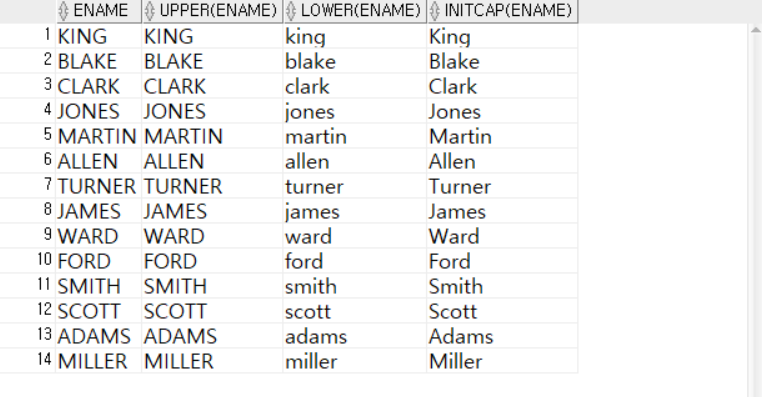

---
<!-- _class: aqua -->
##### Q002
-EMP 테이블에서  UPPER를 이용하여 ENAME이 KING인 데이터를  조회하시오.
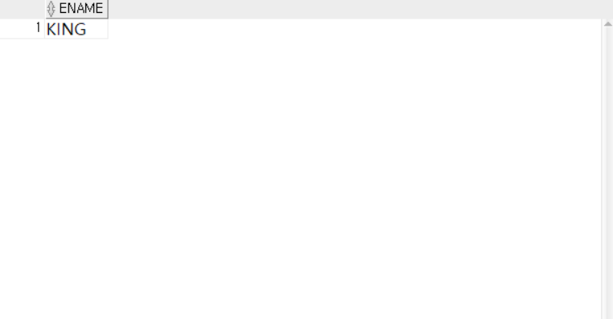

 

---
<!-- _class: aqua -->
##### Q003
-EMP 테이블에서  UPPER를 이용하여 ENAME에  KING인 포함된 데이터를  조회하시오.
- 대소문자 상관없이 KING인 사람을 조회하는 것이 가능해짐.

---
<!-- _class: aqua -->
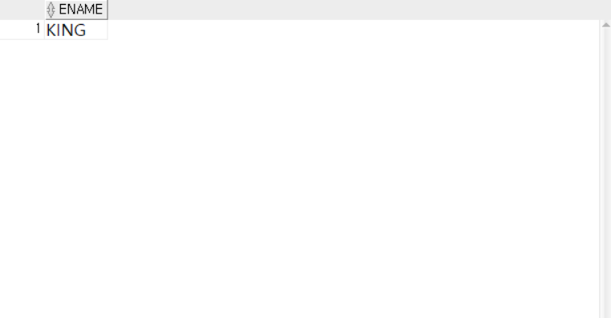

 

---
<!-- _class: aqua -->
##### Q004
-EMP 테이블에서 LENGTH를  이용하여 ENAME의 문자열 길이를  조회하시오.
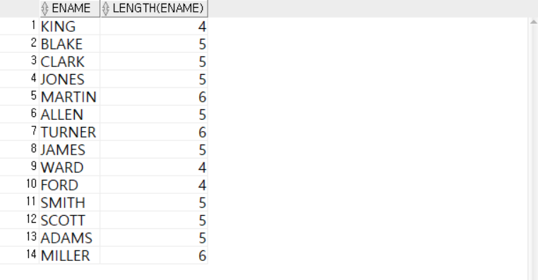

 

---
<!-- _class: aqua -->
##### Q005
-EMP 테이블에서 ENAME의 문자열 길이가 5이상인 데이터를   조회하시오.
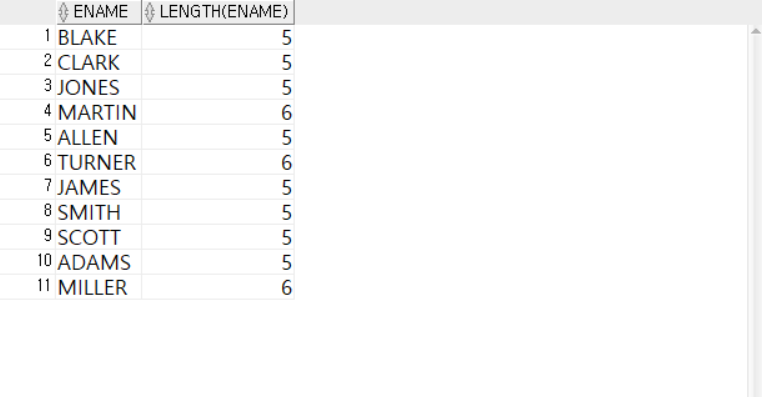

 

---
<!-- _class: aqua -->
##### Q006  
- LENGTH('한글'), LENGTHB('한글')
- 문자열길이반환, 문자열 바이트 수 반환환
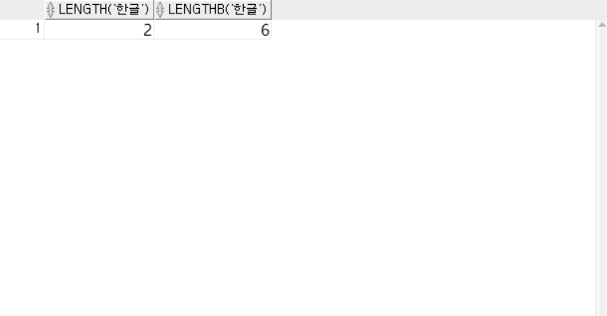

 

---
<!-- _class: aqua -->
##### Q007
- 문자열 일부분을 추출
- SUBSTR( 문자열 , 시작위치, 추출길이)
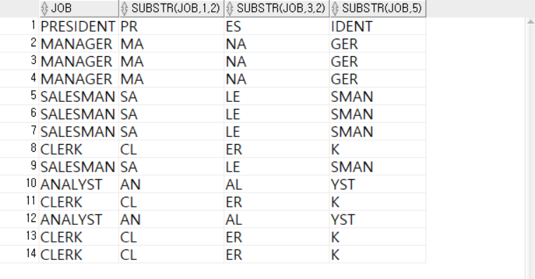

 

---
<!-- _class: aqua -->
##### Q008  
- -의 의미는?
- C(-5)L(-4)E(-3)R(-2)K(-1)
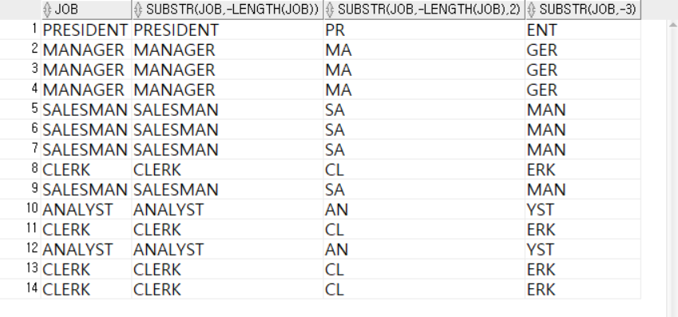

 

---
<!-- _class: aqua -->
##### Q009  
- 특정문자위치 찾기
- INSTR(문자열,  찾을거, 시작위치, 몇번째째)
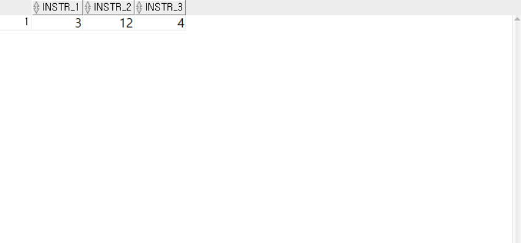

 

---
<!-- _class: aqua -->
##### Q010  
- EMP테이블에서 INSTR 함수로 사원이름에 S가 있는 데이터를 조회하시오
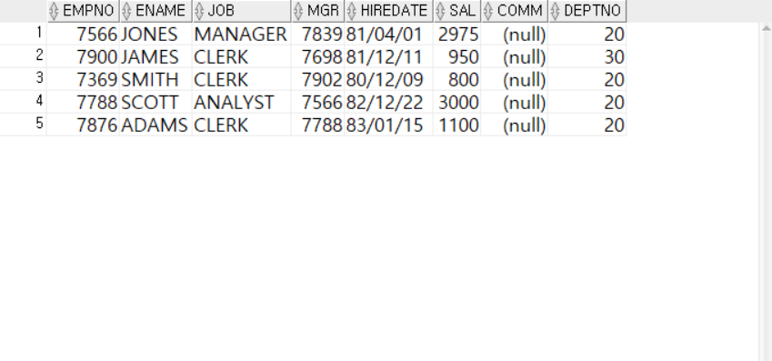

 

---
<!-- _class: aqua -->
##### Q011
- EMP테이블에서 LIKE를 이용하여  사원이름에 S가 있는 데이터를 조회하시오

 

---
<!-- _class: aqua -->
##### Q012  
- REPLACE를 이용하여 연락처의 -을 공백으로, -을 뺀데이터로 조회하시오오
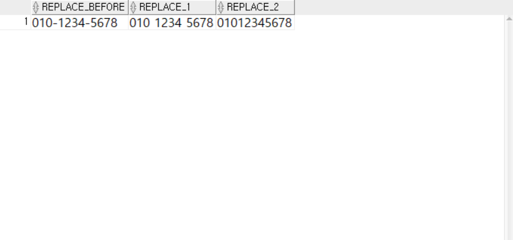

 

---
<!-- _class: aqua -->
##### Q013 
- LPAD, RPAD를 이용하여 다음과 같이 데이터를 출력하시오오
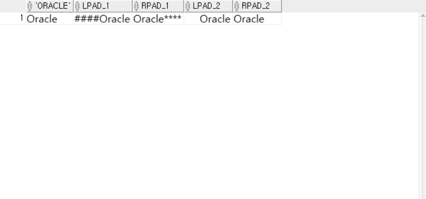

 
---
<!-- _class: aqua -->
##### Q014
- RPAD를 이용하여 개인정보뒷자리 *로 출력하시오.
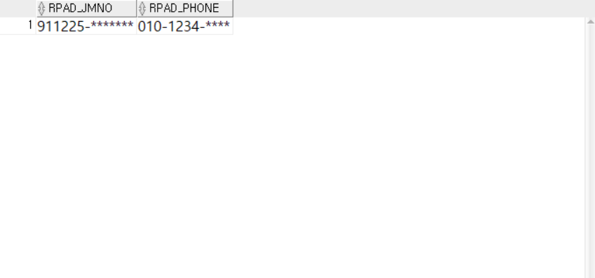

 

---
<!-- _class: aqua -->
##### Q015
- EMP 테이블에서 EMPNO와 ENAME 사이에 :을 넣고 문자열을 연결하시오.
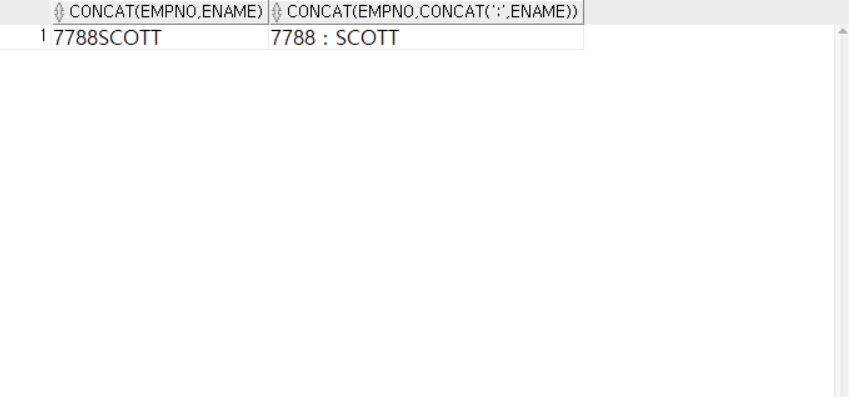

 
---
<!-- _class: aqua -->
##### Q016  
- TRIM을 이용하여  다음과 같이 공백을 제거하고 출력하시오.
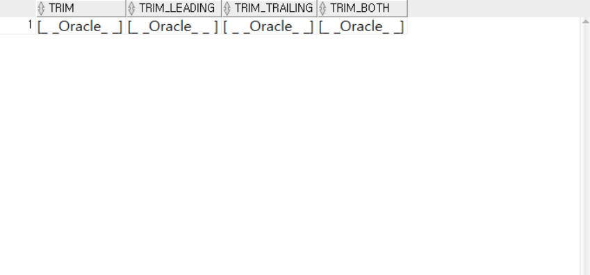

 
---
<!-- _class: aqua -->
##### Q017 
- TRIM을 이용하여 삭제할 문자 삭제후 출력가능능
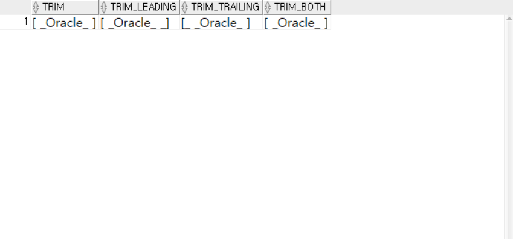

 
---
<!-- _class: aqua -->
##### Q018  
- TRIM, LTRIM, RTRIM 사용하여 문자열 출력하기기
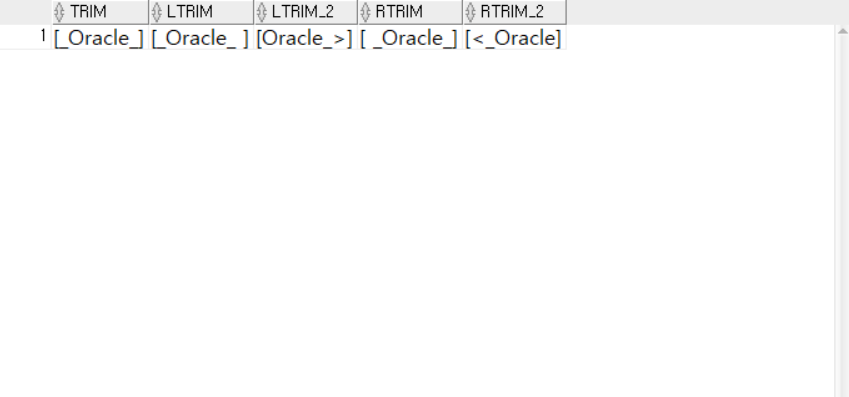

 

---
<!-- _class: aqua -->
##### Q019
- ROUND를 이용하여 반올림 된 숫자 출력하기
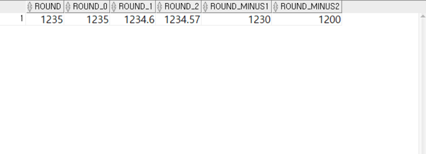

 

---
<!-- _class: aqua -->
##### Q020
- 특정위치에서 버리는 TRUNC 함수수
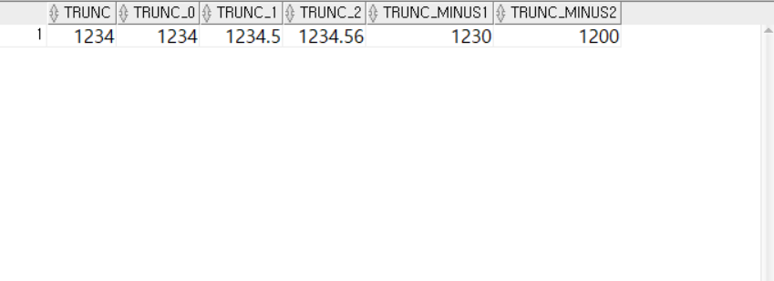

 

---
<!-- _class: aqua -->
##### Q021
- CEIL  : 가장 가까운 큰 정수,
- FLOOR : 가장 가까운 작은 정수 반환
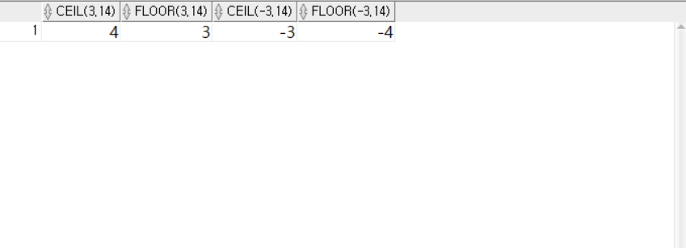

 

---
<!-- _class: aqua -->
##### Q022
- MOD : 특정 숫자를 나누고 그  나머지  출력 
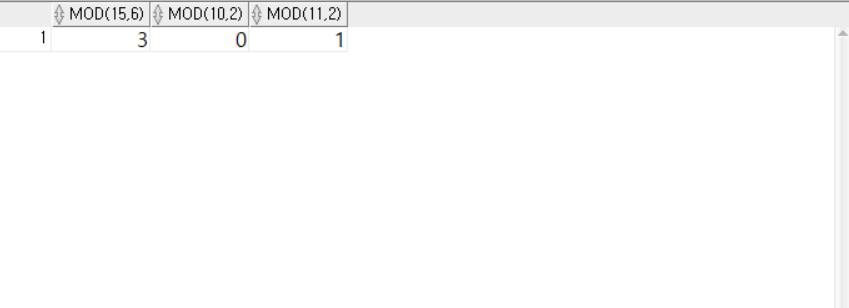

 

---
<!-- _class: aqua -->
##### Q023
- SYSDATE 함수를 사용하여 날짜 출력
- 하루이전, 이후후
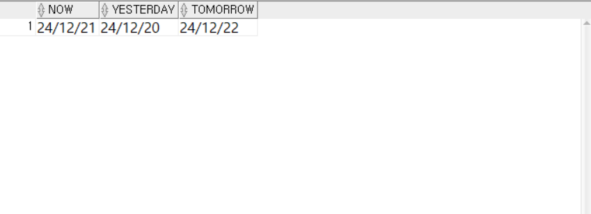

 
---
<!-- _class: aqua -->
##### Q024
- ADD_MONTHS 3개월 후 날짜 
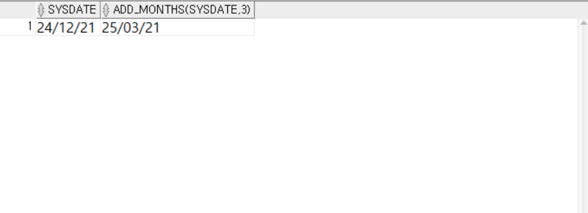

 

---
<!-- _class: aqua -->
##### Q025
- EMP 테이블에서 입사 10주년이 되는 사원들의 데이터를 출력하시오.
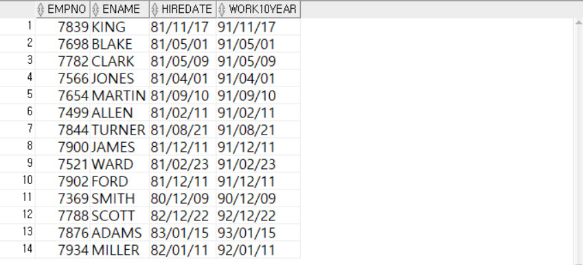

 

---
<!-- _class: aqua -->
##### Q026
- EMP 테이블에서 입사 42년 미만인 사원데이터를 출력하시오.
- 12*42 = 504
- 42년이 지나 안나올 수 도 있음. 안나오면 개월수 늘려서 테스트해볼것

---
<!-- _class: aqua -->
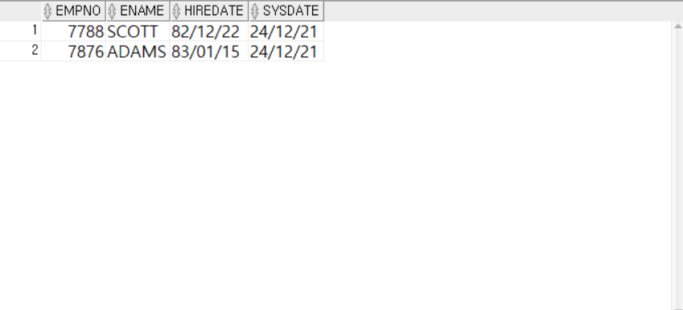

 

---
<!-- _class: aqua -->
##### Q027
- EMP 테이블에서  HIREDATE와 SYSDATE사이의 개월수를 출력하시오.
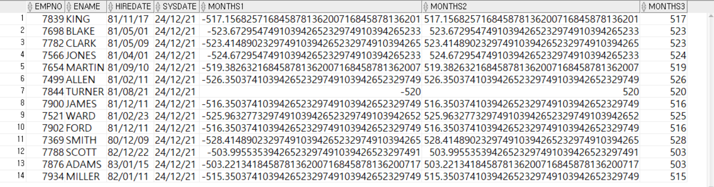

 

---
<!-- _class: aqua -->
##### Q028
- 돌아오는 요일에 해당하는 날짜와 달의 마지막 날짜를 자도으로 계산산
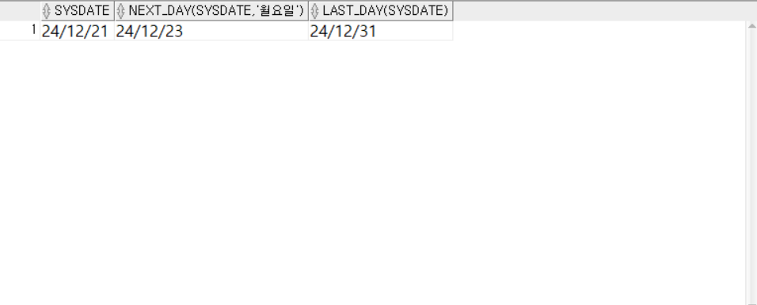

 

---
<!-- _class: aqua -->
##### Q029
- ROUND를 사용하여 날짜 데이터를 출력하시오.

 

---
<!-- _class: aqua -->
##### Q030
- TRUNC 함수를 사용하여 날짜 데이터를 출력하시오.
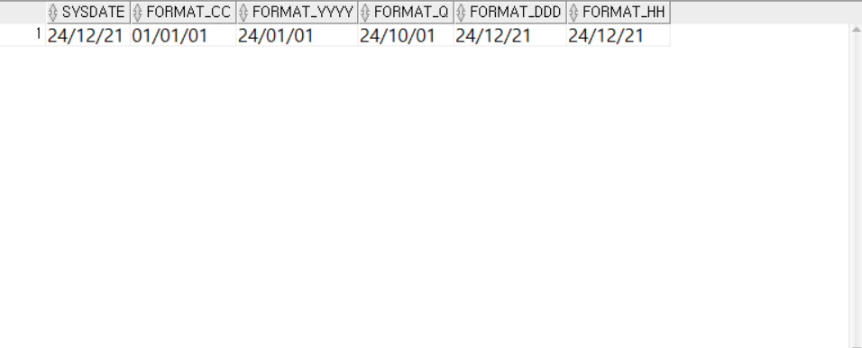

 

---
<!-- _class: aqua -->
##### Q031
- 숫자와 문자열을 더하여 출력하시오
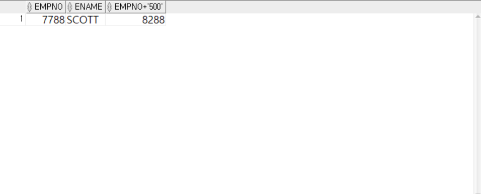

 

---
<!-- _class: aqua -->
##### Q032
- 문자열과 숫자를 더하여 출력하시오.  
오류가 난다면 그이유를 적으시오.
<pre class="codeblock">
SELECT 'ABCD' + EMPNO, EMPNO
  FROM EMP
 WHERE ENAME = 'SCOTT';
</pre>

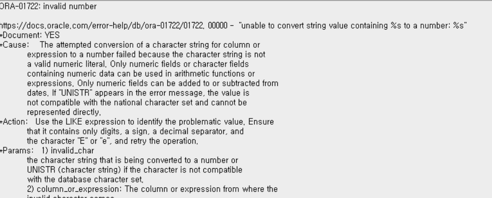

---
<!-- _class: aqua -->
##### Q033
- SYSDATE 날짜 형식지정하여  출력하시오.
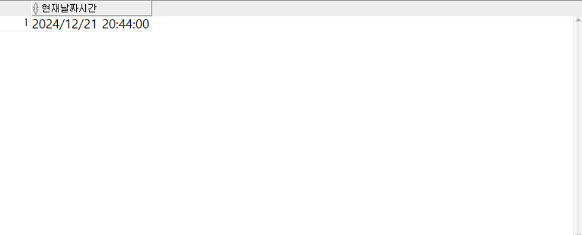

 

---
<!-- _class: aqua -->
##### Q034
- 월과 요일을 다양한 형식으로 출력하시오.
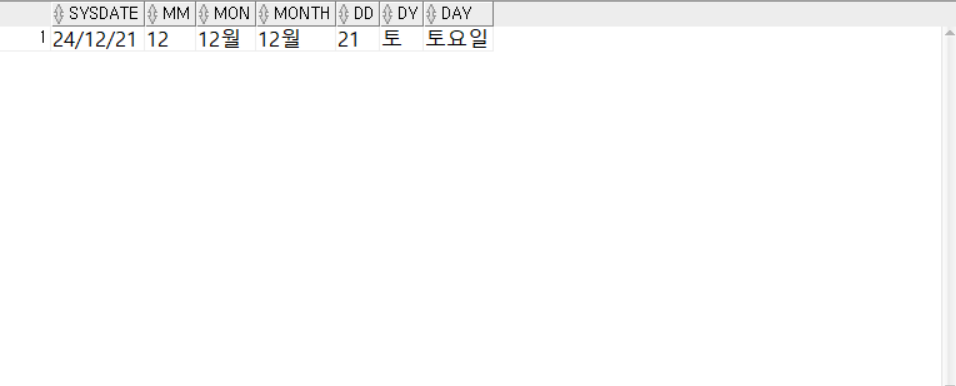

 

---
<!-- _class: aqua -->
##### Q035
- 여러 언어로 날짜(월) 출력하시오
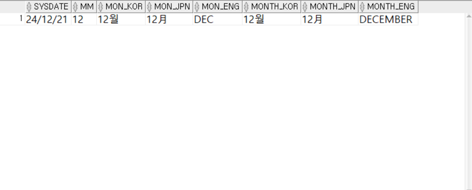

 

---
<!-- _class: aqua -->
##### Q036
- 여러 언어로 날짜(요일일) 출력하시오
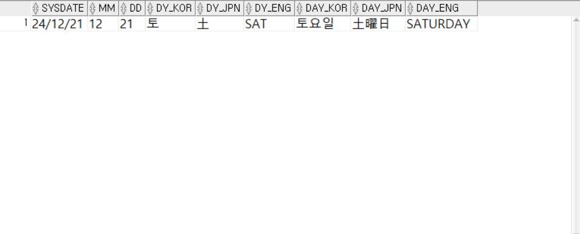

 
---
<!-- _class: aqua -->
##### Q037
- SYSDATE 시간형식 지정하여 출력하시오.
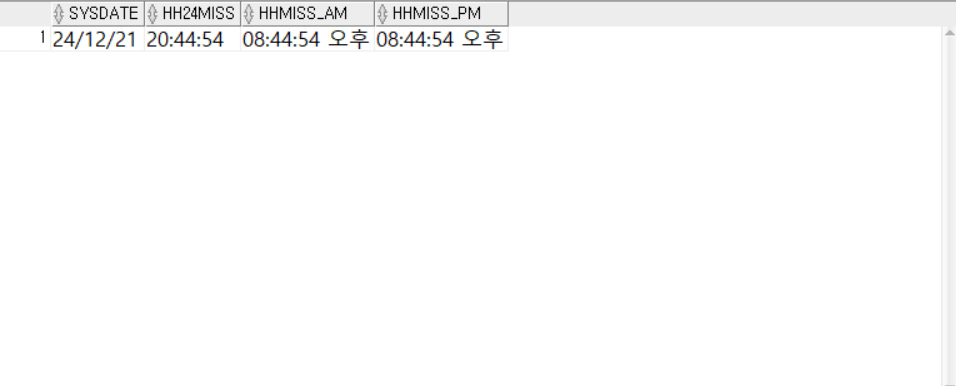

 

---
<!-- _class: aqua -->
##### Q038
- 여러가지 숫자형식을 사용하여 급여를 출력하시오.
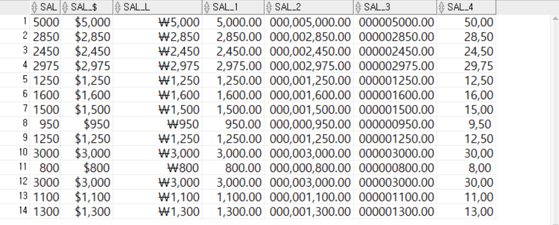

 

---
<!-- _class: aqua -->
##### Q039
- 문자데이터와 숫자데이터를 연산하여 출력하시오.
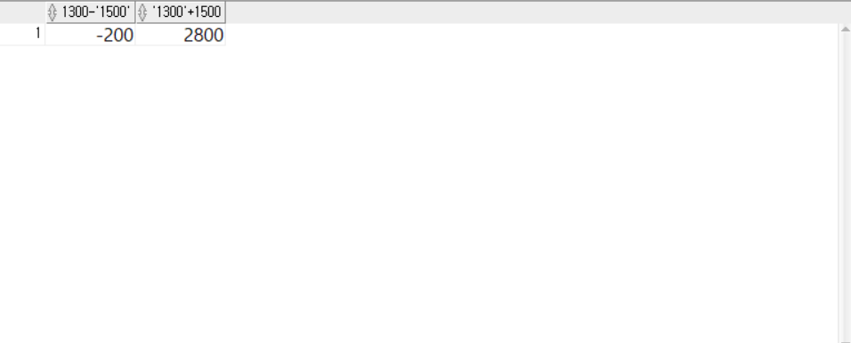

 

---
<!-- _class: aqua -->
##### Q040
- 문자데이터끼지 연산하여 출력하시오 
- 오류가 난다면 그이유를 적으시오.
<pre class="codeblock">
SELECT '1,300' - '1,500'
  FROM DUAL;
</pre>

 

---
<!-- _class: aqua -->
##### Q041
- TO_NUMBER 함수로 연산하여 출력하시오.
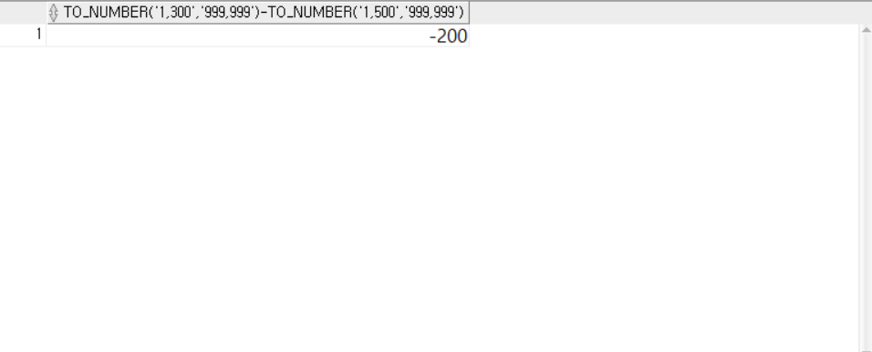

 

---
<!-- _class: aqua -->
##### Q042
-  TO_DATE를 이용하여 문자 데이터를 날짜 데이터로 변환하시오.
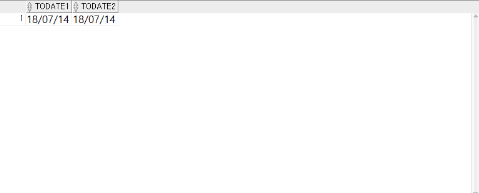

 

---
<!-- _class: aqua -->
##### Q043
- EMP 테이블에서   1981년 6월 1일 이후에 입사한 사원정보를 출력하시오.
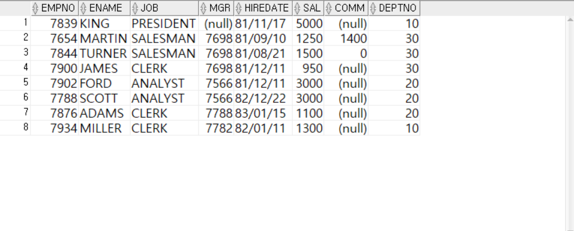

 

---
<!-- _class: aqua -->
##### Q044
- 여러가지 형식으로 날짜 데이터를 출력하시오.
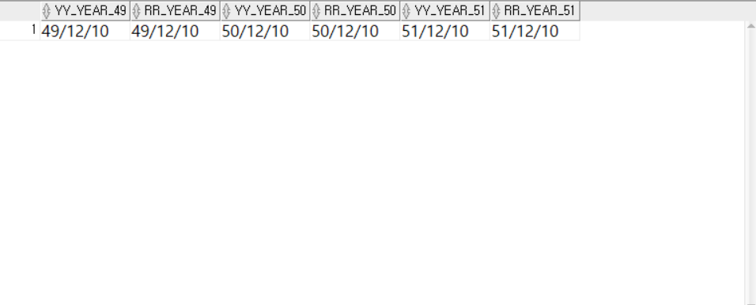

 

---
<!-- _class: aqua -->
##### Q045
- EMP테이블에서 NVL 함수를 사용하여 다음과 같이 출력하시오.
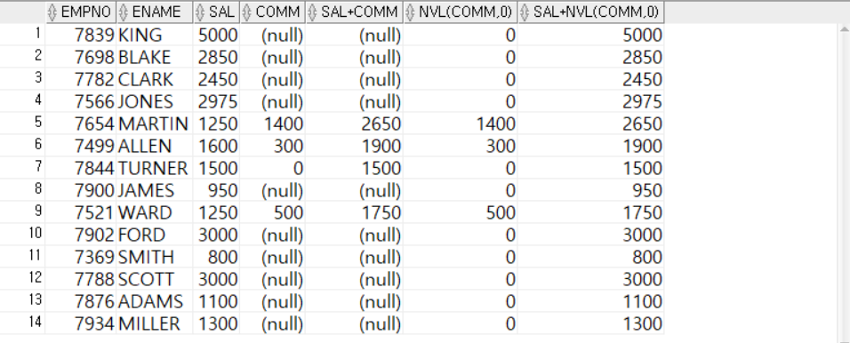

 

---
<!-- _class: aqua -->
##### Q046
- EMP테이블에서 NVL2 함수를 사용하여 다음과 같이 출력하시오.
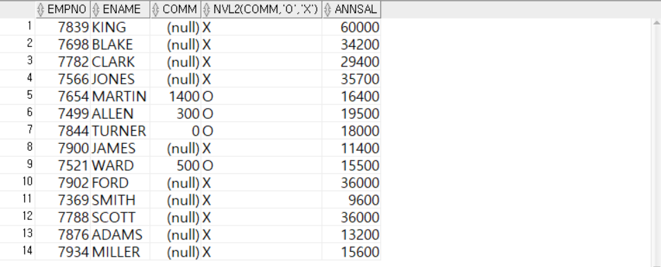

 
---
<!-- _class: aqua -->
##### Q047
- EMP테이블에서 DECODE 함수를 사용하여 다음과 같이 출력하시오.
- JOB이 MANAGER 는 급여의 10% 인상한 급여
        SALESMAN 는 급여의 5% 인상한 급여
        ANALYST 는 그대로
        나머지는 3% 인상된 급여
        
---
<!-- _class: aqua -->
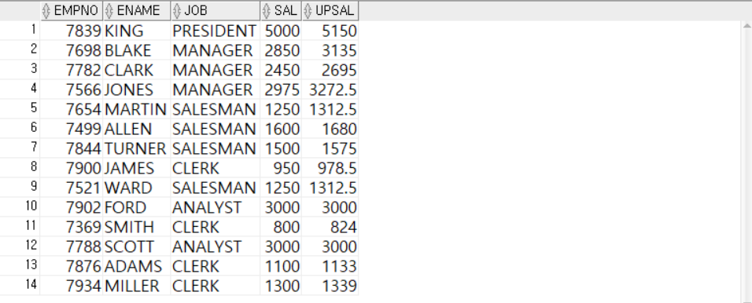

 

---
<!-- _class: aqua -->
##### Q048
- EMP테이블에서 CASE 함수를 사용하여 다음과 같이 출력하시오.
- JOB이 MANAGER 는 급여의 10% 인상한 급여
        SALESMAN 는 급여의 5% 인상한 급여
        ANALYST 는 그대로
        나머지는 3% 인상된 급여
 
---
<!-- _class: aqua -->       

 

---
<!-- _class: aqua -->
##### Q049
- 기준데이터 없이 조건식으로만 CASE 사용가능
- COMM 값이 NULL 이면 해당사항 없음
           0 이면 수당없음
           0 초과시 초과한 수당을 출력력
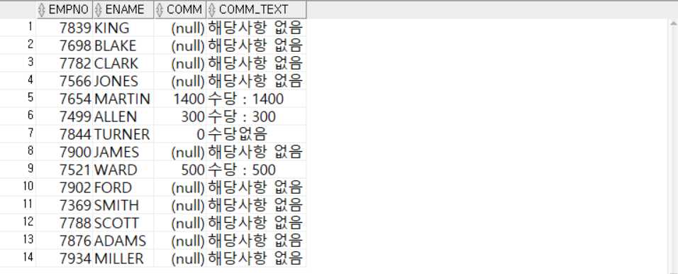

 

---
<!-- _class: purple -->
# 사고확장
 

---
<!-- _class: aqua -->
##### EX001
-  EMP 테이블에서 다음과 같은 결과가 나오도록 SQL문을 작성하시오.

1. EMP 테이블에서 ENAME이  다섯글자 이상이며 여섯글자 미만인 사원을 조회하시오.
2. MASKING_EMPNO 는 EMPNO 앞두자리외 뒷자리를 *로 출력
3. MASKING_ENAME 는 사원이름의 첫글자만 보여주고 나머지는 *로 출력

※ 앞자리 추출 - SUBSTR(문자열, 어디에서, 몇개)
※ RPAD -   RPAD( 문자열, 몇자리, 채울값)

---
<!-- _class: aqua -->
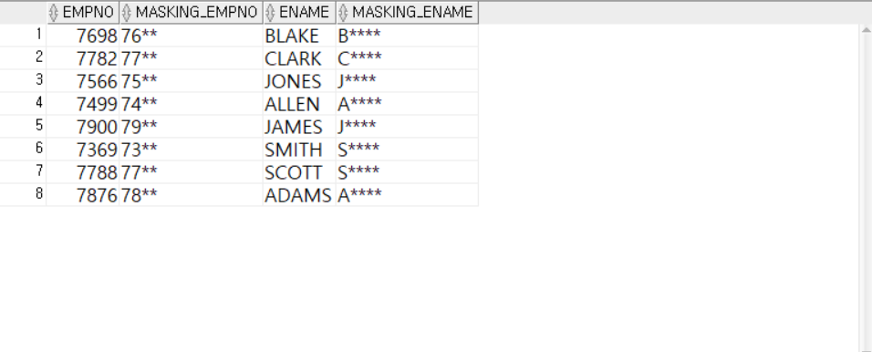

 

---
<!-- _class: aqua -->
##### EX002
-  EMP 테이블에서 다음과 같은 결과가 나오도록 SQL문을 작성하시오.

1. EMP 테이블에서 사원들의 월 평균 근무일 수는 21.5일
2 하루 근무시간을 8시간으로 보았을때 사원들의 하루급여(DAY_PAY) 와 시급(TIME_PAY)을 계산하여 결과를 조회하시오.
※ 하루급여는 소수점 세번째 자리에서 버리고(TRUNC), 시급은 두번째 소수점에서 반올림(ROUND)하시오

---
<!-- _class: aqua -->
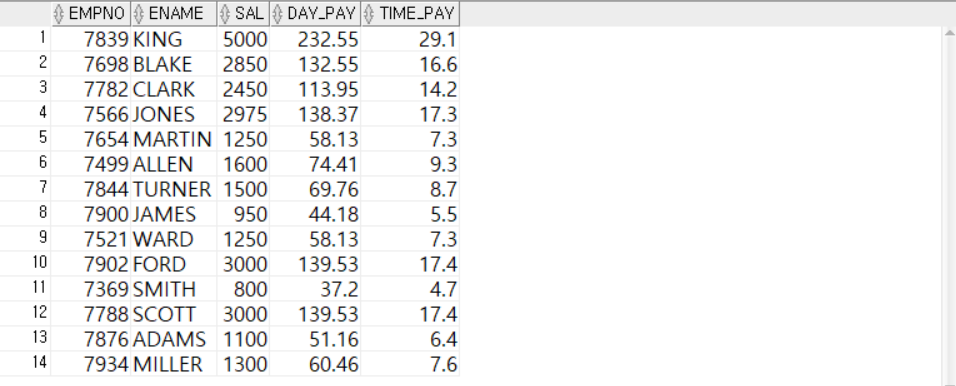

 

---
<!-- _class: aqua -->
##### EX003
-  EMP 테이블에서 다음과 같은 결과가 나오도록 SQL문을 작성하시오.

1. EMP테이블에서 사원들은 입사일(HIREDATE)을 기준으로 3개월이 지난 후 첫 월요일에 정직원이 됨
2. 사원들이 정직원이 되는 날짜(R_JOB)를 YYYY-MM-DD 형식으로 오른쪽과 같이 출력하시오.
3. 추가 수당(COMM)이 없는 사원들의 추가수당은 N/A로 출력하시오.

---
<!-- _class: aqua -->
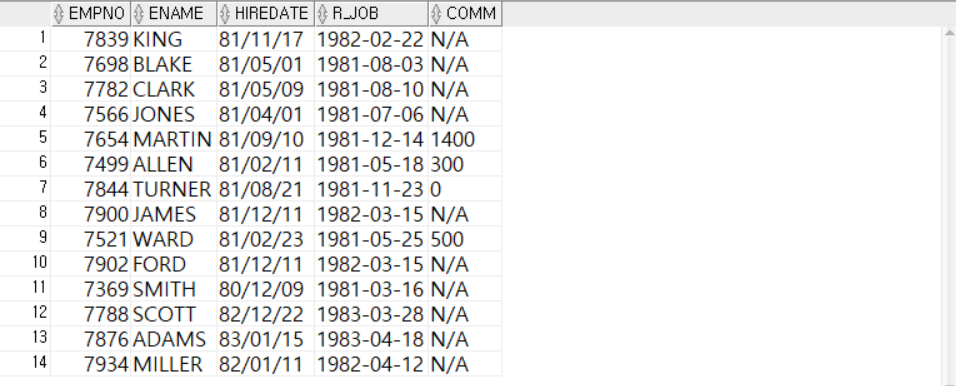

 

---
<!-- _class: aqua -->
##### EX004
-  EMP 테이블에서 다음과 같은 결과가 나오도록 SQL문을 작성하시오.

1. 직속상관의 사원번호(MGR)를 다음과 같은 조건을 기준으로 변환해서 CHG_MGR열에 출력하시오
 
1) 직속상관의 사원번호가 존재하지 않을경우 : 00000
2) 직속상관의 사원번호 앞 두자리가 75일 경우 : 5555
3) 직속상관의 사원번호 앞 두자리가 76일 경우 : 6666
4) 직속상관의 사원번호 앞 두자리가 77일 경우 : 7777
5) 직속상관의 사원번호 앞 두자리가 78일 경우 : 8888
6) 그 외 직속상관 사원번호의 경우 : 본래 직속상관의 사원번호 그대로 출력
 

---
<!-- _class: aqua -->
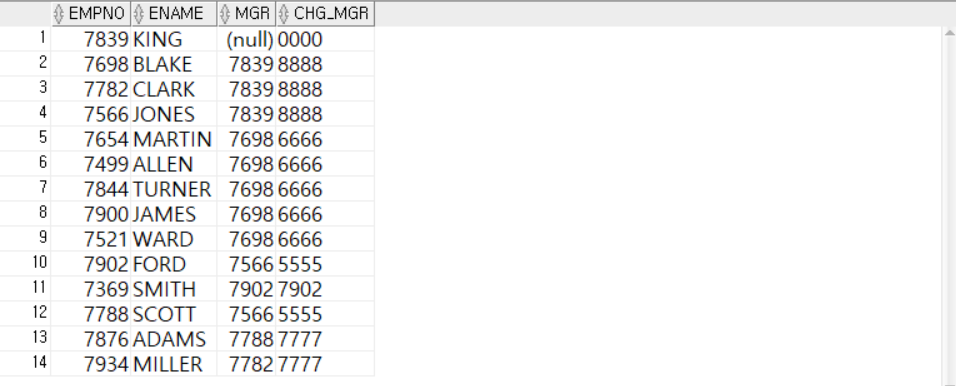

 

---

<!-- _class: aqua -->

1. SUBSTR(JOB, 1, 2) 는 어떤 결과를 반환하나요?  
2. INSTR(ENAME, 'S') > 0 은 어떤 조건을 의미하나요?  
3. ROUND(SAL / 21.5 / 8, 1) 은 어떤 계산을 수행하나요?  
4. TO_CHAR(SYSDATE, 'DAY') 는 어떤 정보를 보여주나요?  
5. NVL(COMM, 0) 은 어떤 상황에서 유용한가요?

---

<!-- _class: red -->
# 🧪 Step 5: 기억 테스트

---

<!-- _class: aqua -->

- UPPER 와 INITCAP 의 차이는 무엇인가요?  
- REPLACE 와 TRIM 은 각각 어떤 작업을 하나요?  
- ROUND 와 TRUNC 은 어떤 차이가 있나요?  
- TO_DATE('2018-07-14', 'YYYY-MM-DD') 는 어떤 형식으로 변환하나요?  
- DECODE 와 CASE 는 어떤 상황에서 사용되나요?
 
---
<!-- _class: thanks -->
## 👋 열심히 들어주셔서 감사합니다!
 
> 오늘의 한 걸음이 **내일의 가능성**이 되길 바라며,
  