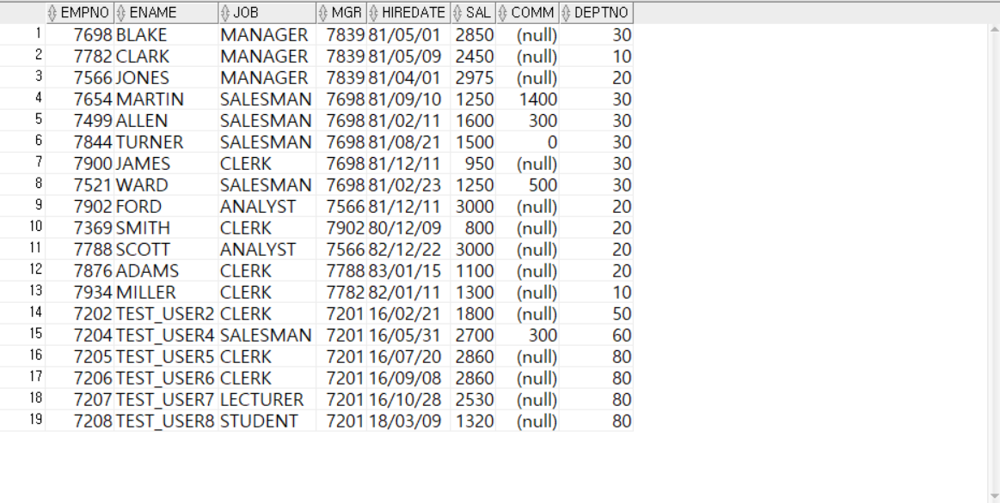

<!-- _class: cover-oracle -->
<h4 style="color:#6C757D;">
  🧠
  CodeCraft Series · Track 02
</h4>
<h1 style="color:#007BFF;">Oracle Fundamentals</h1>
<h3 style="color:#17A2B8;">SQL부터 PL/SQL까지, 오라클의 핵심을 잡다</h3>

<!-- 현재 챕터 강조 -->

  📍 <strong>현재 위치:</strong> Chapter 1 · <em>오라클 환경 설정 · 기본 SELECT</em>

<blockquote>
  실무에 바로 적용 가능한 오라클 입문서 
  데이터를 다루는 힘, SQL로 시작해요
</blockquote>

---
<!-- _class: cover-oracle -->
<h2 style="font-size:1.6em; color:#555;">📚 Oracle 트랙 목차</h2>
  <strong style="color:#FF6E7F;">PART 1 · SQL 기본</strong>

  ▶ Chapter 01: oracle_setting
  ▶ Chapter 02: select_basic
  ▶ Chapter 03: select_where
  ▶ Chapter 04: select_fn
  ▶ Chapter 05: select_group
  ▶ Chapter 06: select_join
  ▶ Chapter 07: select_subquery

---
<!-- _class: cover-oracle -->
<h2 style="font-size:1.6em; color:#555;">📚 Oracle 트랙 목차</h2>
 <strong style="color:#FF6E7F;">PART 2 · 데이터 조작 및 객체</strong> 

 
  ✅▶ Chapter 08: update_delete
  ▶ Chapter 09: transaction
  ▶ Chapter 10: ddl
  ▶ Chapter 11: object
  ▶ Chapter 12: constraint
  ▶ Chapter 13: user

---
<!-- _class: cover-oracle -->
<h2 style="font-size:1.6em; color:#555;">📚 Oracle 트랙 목차</h2>
<strong style="color:#FF6E7F;">PART 3 · PL/SQL 심화</strong>

  
  ▶ Chapter 14: plsql
  ▶ Chapter 15: record
  ▶ Chapter 16: cursor
  ▶ Chapter 17: save

  이 트랙은 오라클의 기본 SQL부터 객체 관리, PL/SQL까지  실무 중심으로 배우며, 데이터베이스 전문가로 성장합니다.

 

 
 
---

<!-- _class: orange -->
# 🧩 Step 1: 핵심 개념  
***SQL 데이터 수정/삭제 실습***  
→ ***UPDATE***, ***DELETE***, ***MERGE***, ***서브쿼리 활용***, ***트랜잭션 제어***

---

<!-- _class: aqua -->
### ✏️ UPDATE 문  
- 테이블의 기존 데이터를 수정  
- SET 절로 변경할 값 지정  
- WHERE 절로 대상 행 지정  
- 서브쿼리로 동적 값 지정 가능  

---

<!-- _class: aqua -->
### 🗑 DELETE 문  
- 테이블에서 행을 삭제  
- WHERE 절로 삭제 조건 지정  
- 조건 없으면 전체 삭제됨  

---

<!-- _class: aqua -->
### 🔁 MERGE 문  
- 조건에 따라 INSERT, UPDATE, DELETE 수행  
- USING, ON, WHEN MATCHED, WHEN NOT MATCHED 절 사용  
- 주로 데이터 동기화에 활용  

---

<!-- _class: aqua -->
### 🧠 서브쿼리 활용  
- UPDATE, DELETE, MERGE 문에서 서브쿼리로 조건 또는 값 지정  
- 예: SET SAL = (SELECT ...), WHERE EXISTS (...)

---

<!-- _class: aqua -->
### 🔐 트랜잭션 제어  
- COMMIT, ROLLBACK, SAVEPOINT  
- 데이터 변경 후 확정 또는 취소  
- 오류 발생 시 ROLLBACK으로 복구 가능

---

<!-- _class: blue -->
# 🧪 Step 2: 코드 예제

---

<!-- _class: aqua -->

<pre class="codeblock">
-- 급여 인상
UPDATE EMP
   SET SAL = SAL * 1.1
 WHERE JOB = 'MANAGER';

-- 특정 부서 사원 삭제
DELETE FROM EMP
 WHERE DEPTNO = 30;

-- 서브쿼리로 급여 수정
UPDATE EMP
   SET SAL = (SELECT AVG(SAL) FROM EMP)
 WHERE JOB = 'CLERK';

-- EXISTS 조건으로 삭제
DELETE FROM EMP E
 WHERE EXISTS (
       SELECT 1
         FROM DEPT D
        WHERE D.DEPTNO = E.DEPTNO
          AND D.LOC = 'CHICAGO');

-- MERGE 문 예제
MERGE INTO BONUS B
USING EMP E
   ON (B.ENAME = E.ENAME)
 WHEN MATCHED THEN
   UPDATE SET B.JOB = E.JOB, B.SAL = E.SAL
 WHEN NOT MATCHED THEN
   INSERT (ENAME, JOB, SAL)
   VALUES (E.ENAME, E.JOB, E.SAL);

-- 트랜잭션 제어
UPDATE EMP SET SAL = SAL + 100 WHERE DEPTNO = 10;
SAVEPOINT before_bonus;
UPDATE EMP SET COMM = 500 WHERE JOB = 'SALESMAN';
ROLLBACK TO before_bonus;
COMMIT;
</pre>

---

<!-- _class: aqua -->

## ✅ 명령어 요약표

| 명령어 | 설명 |
|--------|------|
| UPDATE | 데이터 수정 |
| DELETE | 데이터 삭제 |
| MERGE | 조건 기반 수정/삽입 |
| EXISTS, IN | 조건 필터링 |
| COMMIT, ROLLBACK | 트랜잭션 제어 |

---

<!-- _class: green -->
# 🧪 Step 3: 연습문제

 

---
<!-- _class: aqua -->
##### Q001
- DEPT 테이블을 이용해서 다음과 같이 작성하시오.
1. DEPT테이블을 복사해서 DEPT_TEMP 테이블을 만드시오.

---
<!-- _class: aqua -->
<pre class="codeblock">
CREATE TABLE DEPT_TEMP
    AS SELECT * FROM DEPT;
</pre>

---
<!-- _class: aqua -->
##### Q002
- DEPT_TMPT 테이블을 조회하시오.

---
<!-- _class: aqua -->
<pre class="codeblock">
SELECT * FROM DEPT_TEMP;

</pre>

---
<!-- _class: aqua -->
##### Q003
- DEPT_TEMP 테이블을 이용해서 다음과 같이 작성하시오.
1. DEPT_TEMP테이블에 다음과 같이 데이터를 추가하시오.

---
<!-- _class: aqua -->
<pre class="codeblock">
INSERT INTO DEPT_TEMP (DEPTNO, DNAME, LOC)
VALUES (50, 'DATABASE', 'SEOUL');

SELECT * FROM DEPT_TEMP;

</pre>

---
<!-- _class: aqua -->
##### Q004
- DEPT_TEMP 테이블을 이용해서 다음과 같이 작성하시오.
1. DEPT_TEMP테이블에 다음과 같이 데이터를 추가하시오.
2. 열지정없이 데이터 추가가 가능하다.

---
<!-- _class: aqua -->
<pre class="codeblock">
INSERT INTO DEPT_TEMP
VALUES (60 , 'NETWORK', 'BUSAN');

SELECT * FROM DEPT_TEMP;

</pre>

---
<!-- _class: aqua -->
##### Q005
- DEPT_TEMP 테이블을 이용해서 다음과 같이 작성하시오.
1. DEPT_TEMP테이블에 다음과 같이 데이터를 추가하시오.
2. NULL을 지정하여 입력하는 것이 가능하다.

---
<!-- _class: aqua -->
<pre class="codeblock">
INSERT INTO DEPT_TEMP (DEPTNO, DNAME, LOC)
VALUES (70 , 'WEB', NULL);

SELECT * FROM DEPT_TEMP;

</pre>

---
<!-- _class: aqua -->
##### Q006
- DEPT_TEMP 테이블을 이용해서 다음과 같이 작성하시오.
1. DEPT_TEMP테이블에 다음과 같이 데이터를 추가하시오.
2. 열데이터를 넣지 않는 방식으로 데이터 입력이 가능하다.  ( 공백문자열'' )

---
<!-- _class: aqua -->
<pre class="codeblock">
INSERT INTO DEPT_TEMP (DEPTNO, DNAME , LOC)
VALUES (80 , 'MOBILE', '');

SELECT * FROM DEPT_TEMP;

</pre>

---
<!-- _class: aqua -->
##### Q007
- DEPT_TEMP 테이블을 이용해서 다음과 같이 작성하시오.
1. DEPT_TEMP테이블에 다음과 같이 데이터를 추가하시오.
2. 열데이터를 넣지 않는 방식으로 데이터 입력이 가능하다.

---
<!-- _class: aqua -->
<pre class="codeblock">
INSERT INTO DEPT_TEMP (DEPTNO, LOC)
VALUES (90 , 'INCHEON');

SELECT * FROM DEPT_TEMP;

</pre>

---
<!-- _class: aqua -->
##### Q008
- EMP 테이블을 이용해서 다음과 같이 작성하시오.
1. EMP테이블을 복사해 EMP_TEMP 테이블을 만드시오.
2. 조건적 WHERE이 FALSE이므로 구조만 복사합니다.

---
<!-- _class: aqua -->
<pre class="codeblock">
CREATE TABLE EMP_TEMP
    AS SELECT *
         FROM EMP
        WHERE 1 <> 1;

SELECT * FROM EMP_TEMP;

</pre>

---
<!-- _class: aqua -->
##### Q009
- EMP_TEMP 테이블을 이용해서 다음과 같이 작성하시오.
1. EMP_TEMP테이블에 다음과 같이 데이터를 추가하시오.   (날짜/)  년/월/일

---
<!-- _class: aqua -->
<pre class="codeblock">
INSERT INTO EMP_TEMP (EMPNO, ENAME, JOB, MGR, HIREDATE, SAL, COMM, DEPTNO)
VALUES (9999, '홍길동', 'PRESIDENT', NULL, '2001/01/01', 5000, 1000, 10);

SELECT * FROM EMP_TEMP;

</pre>

---
<!-- _class: aqua -->
##### Q010
- EMP_TEMP 테이블을 이용해서 다음과 같이 작성하시오.
1. EMP_TEMP테이블에 다음과 같이 데이터를 추가하시오.  (날짜-) 년-월-일일

---
<!-- _class: aqua -->
<pre class="codeblock">
INSERT INTO EMP_TEMP (EMPNO, ENAME, JOB, MGR, HIREDATE, SAL, COMM, DEPTNO)
VALUES (1111, '성춘향', 'MANAGER', 9999, '2001-01-05', 4000, NULL, 20);

SELECT * FROM EMP_TEMP;

</pre>

---
<!-- _class: aqua -->
##### Q011
- EMP_TEMP 테이블을 이용해서 다음과 같이 작성하시오.
1. EMP_TEMP테이블에 다음과 같이 데이터를 추가하시오.   (날짜/)  일/월/년 으로 하면 오류남.

---
<!-- _class: aqua -->
<pre class="codeblock">
INSERT INTO EMP_TEMP (EMPNO, ENAME, JOB, MGR , HIREDATE, SAL , COMM, DEPTNO)
VALUES (2111, '이순신', 'MANAGER', 9999, '07/01/2001', 4000, NULL, 20);

</pre>

---
<!-- _class: aqua -->
##### Q012
- EMP_TEMP 테이블을 이용해서 다음과 같이 작성하시오.
1. EMP_TEMP테이블에 다음과 같이 데이터를 추가하시오.   (날짜/)   TO_DATE 함수 이용하기기

---
<!-- _class: aqua -->
<pre class="codeblock">
INSERT INTO EMP_TEMP (EMPNO, ENAME, JOB, MGR, HIREDATE, SAL, COMM, DEPTNO)
VALUES (2111, '이순신', 'MANAGER', 9999,
        TO_DATE('07/01/2001', 'DD/MM/YYYY'), 4000, NULL, 20);

SELECT * FROM EMP_TEMP;

</pre>

---
<!-- _class: aqua -->
##### Q013
- EMP_TEMP 테이블을 이용해서 다음과 같이 작성하시오.
1. EMP_TEMP테이블에 다음과 같이 데이터를 추가하시오.   (날짜/)  SYSDATE사용용

---
<!-- _class: aqua -->
<pre class="codeblock">
INSERT INTO EMP_TEMP (EMPNO, ENAME, JOB, MGR, HIREDATE, SAL, COMM, DEPTNO)
VALUES (3111, '심청이', 'MANAGER', 9999, SYSDATE, 4000, NULL, 30);

SELECT * FROM EMP_TEMP;

</pre>

---
<!-- _class: aqua -->
##### Q014
- EMP_TEMP 테이블을 이용해서 다음과 같이 작성하시오.
1. EMP_TEMP테이블에 다음과 같이 데이터를 추가하시오.
2. INSERT 문에 SELECT 문이용 → 서브쿼리이용
3. VALUES를 사용하지 않음! / 추가되는 열, 서브쿼리의 열의 개수,자료형 일치

---
<!-- _class: aqua -->
<pre class="codeblock">
INSERT INTO EMP_TEMP (EMPNO, ENAME, JOB, MGR, HIREDATE, SAL, COMM, DEPTNO)
SELECT E.EMPNO, E.ENAME, E.JOB, E.MGR, E.HIREDATE, E.SAL, E.COMM, E.DEPTNO
  FROM EMP E, SALGRADE S
 WHERE E.SAL BETWEEN S.LOSAL AND S.HISAL
   AND S.GRADE = 1;

SELECT * FROM EMP_TEMP;

</pre>

---
<!-- _class: aqua -->
##### Q015
-  DEPT테이블을 이용하여 다음과 같이 작성하시오.
1. DEPT테이블을 복사해 DEPT_TEMP2테이블을 작성하시오.

---
<!-- _class: aqua -->
<pre class="codeblock">
CREATE TABLE DEPT_TEMP2
    AS SELECT * FROM DEPT;

SELECT * FROM DEPT_TEMP2;

</pre>

---
<!-- _class: aqua -->
##### Q016
-  DEPT_TEMP2테이블을 이용하여 다음과 같이 작성하시오.
1. LOC을 전보 'SEOUL' 로 업데이트 하시오.

---
<!-- _class: aqua -->
<pre class="codeblock">
UPDATE DEPT_TEMP2
   SET LOC = 'SEOUL';

SELECT * FROM DEPT_TEMP2;

</pre>

---
<!-- _class: aqua -->
##### Q017
-  DEPT_TEMP2테이블을 이용하여 다음과 같이 작성하시오.
1. ROLLBACK을 이용하여 테이블 내용을 이전상태로 되돌리시오.

---
<!-- _class: aqua -->
<pre class="codeblock">
ROLLBACK;
</pre>

---
<!-- _class: aqua -->
##### Q018
-  DEPT_TEMP2테이블을 이용하여 다음과 같이 작성하시오.
1. 40번부서의이름을 DATABASE ,  지역을 SEOUL로 수정하시오.

---
<!-- _class: aqua -->
<pre class="codeblock">
UPDATE DEPT_TEMP2
   SET DNAME = 'DATABASE',
         LOC = 'SEOUL'
 WHERE DEPTNO = 40;

SELECT * FROM DEPT_TEMP2;

</pre>

---
<!-- _class: aqua -->
##### Q019
-  DEPT_TEMP2테이블을 이용하여 다음과 같이 작성하시오.
1. 서브쿼리를 이용하여 DEPT 테이블의 40번 부서의  부서이름과 지역의 데이터를를
2.  DEPT_TEMP2테이블의 40번 부서이름과 지역을 수정하시오.

---
<!-- _class: aqua -->
<pre class="codeblock">
UPDATE DEPT_TEMP2
   SET (DNAME, LOC) = (SELECT DNAME, LOC
                         FROM DEPT
                        WHERE DEPTNO = 40)
 WHERE DEPTNO = 40;

SELECT * FROM DEPT_TEMP2;

</pre>

---
<!-- _class: aqua -->
##### Q020
-  DEPT_TEMP2테이블을 이용하여 다음과 같이 작성하시오.
1. 서브쿼리를 이용하여 DEPT 테이블의 40번 부서의  부서이름과 지역의 데이터를를
2.  DEPT_TEMP2테이블의 40번 부서이름과 지역을 수정하시오.
3. 열 하나하나를 수정하는 경우우

---
<!-- _class: aqua -->
<pre class="codeblock">
UPDATE DEPT_TEMP2
   SET DNAME = (SELECT DNAME
                  FROM DEPT
                 WHERE DEPTNO = 40),
       LOC = (SELECT LOC
                FROM DEPT
               WHERE DEPTNO = 40)
 WHERE DEPTNO = 40;

</pre>

---
<!-- _class: aqua -->
##### Q021
-  DEPT_TEMP2테이블을 이용하여 다음과 같이 작성하시오.
1. WHEREW절에 서브쿼리를 사용하여 데이터를 수정하는 것이 가능

---
<!-- _class: aqua -->
<pre class="codeblock">
UPDATE DEPT_TEMP2
   SET LOC = 'SEOUL'
 WHERE DEPTNO = (SELECT DEPTNO
                   FROM DEPT_TEMP2
                  WHERE DNAME='OPERATIONS');

SELECT * FROM DEPT_TEMP2;

</pre>

---
<!-- _class: aqua -->
##### Q022
- EMP 테이블을 복사해서 EMP_TEMP2 테이블을 작성하시오.

---
<!-- _class: aqua -->
<pre class="codeblock">
CREATE TABLE EMP_TEMP2
    AS SELECT * FROM EMP;

SELECT * FROM EMP_TEMP2;

</pre>

---
<!-- _class: aqua -->
##### Q023
-  EMP_TEMP2테이블을 이용하여 다음과 같이 작성하시오.
1. WHERE절을  사용하여 JOB이 MANAGER인 데이터를 삭제하시오.

---
<!-- _class: aqua -->
<pre class="codeblock">
DELETE FROM EMP_TEMP2
 WHERE JOB = 'MANAGER';

SELECT * FROM EMP_TEMP2;

</pre>

---
<!-- _class: aqua -->
##### Q024
-  EMP_TEMP2테이블을 이용하여 다음과 같이 작성하시오.
1. WHERE,SUBQUERY을  사용하여
  급여등급이 3등급 (1401~2000) 사이에 있는
2. 30번부서의 사원들만 삭제하시오.

---
<!-- _class: aqua -->
<pre class="codeblock">
DELETE FROM EMP_TEMP2
 WHERE EMPNO IN (SELECT E.EMPNO
                   FROM EMP_TEMP2 E, SALGRADE S
                  WHERE E.SAL BETWEEN S.LOSAL AND S.HISAL
                    AND S.GRADE = 3
                    AND DEPTNO = 30);

SELECT * FROM EMP_TEMP2;

</pre>

---
<!-- _class: aqua -->
##### Q025
- EMP_TEMP2 전체 데이터를 삭제하시오.

---
<!-- _class: aqua -->
<pre class="codeblock">
DELETE FROM EMP_TEMP2;

SELECT * FROM EMP_TEMP2;
</pre>

---
<!-- _class: purple -->
# 사고확장EX

---
<!-- _class: aqua -->
##### EX001
- DEPT 테이블을 이용해 다음과 같이 작성하시오.
1.  DEPT 테이블을 복사해  DEPT_TEST 테이블을 만들 후
2.  DEPT_TEST 테이블에 다음과 같이 값이 추가하시오.

 

---
<!-- _class: aqua -->
##### EX002
- EMP 테이블을 이용해 다음과 같이 작성하시오.
1.  EMP 테이블을 복사해  EMP_TEST 테이블을 만들 후
2.  EMP_TEST 테이블에 다음과 같이 값이 추가하시오.

---
<!-- _class: aqua -->
<pre class="codeblock">

CREATE TABLE EMP_TEST AS SELECT * FROM EMP;

INSERT INTO EMP_TEST
VALUES(7201, 'TEST_USER1', 'MANAGER', 7788, TO_DATE('2016-01-02', 'YYYY-MM-DD'), 4500, NULL, 50);

INSERT INTO EMP_TEST
VALUES(7202, 'TEST_USER2', 'CLERK', 7201, TO_DATE('2016-02-21', 'YYYY-MM-DD'), 1800, NULL, 50);

INSERT INTO EMP_TEST
VALUES(7203, 'TEST_USER3', 'ANALYST', 7201, TO_DATE('2016-04-11', 'YYYY-MM-DD'), 3400, NULL, 60);

INSERT INTO EMP_TEST
VALUES(7204, 'TEST_USER4', 'SALESMAN', 7201, TO_DATE('2016-05-31', 'YYYY-MM-DD'), 2700, 300, 60);

INSERT INTO EMP_TEST
VALUES(7205, 'TEST_USER5', 'CLERK', 7201, TO_DATE('2016-07-20', 'YYYY-MM-DD'), 2600, NULL, 70);

INSERT INTO EMP_TEST
VALUES(7206, 'TEST_USER6', 'CLERK', 7201, TO_DATE('2016-09-08', 'YYYY-MM-DD'), 2600, NULL, 70);

INSERT INTO EMP_TEST
VALUES(7207, 'TEST_USER7', 'LECTURER', 7201, TO_DATE('2016-10-28', 'YYYY-MM-DD'), 2300, NULL, 80);

INSERT INTO EMP_TEST
VALUES(7208, 'TEST_USER8', 'STUDENT', 7201, TO_DATE('2018-03-09', 'YYYY-MM-DD'), 1200, NULL, 80);

SELECT * FROM EMP_TEST;
</pre>

---
<!-- _class: aqua -->
##### EX003
- EMP_TEST 테이블을 이용해 다음과 같이 작성하시오.
1.  EMP_TEST 테이블에서 50번 부서에서 근무하는 사원들의 평균급여보다 많은 급여를 받고 있는 사원들을 70번부터서 옮기는 구문을 작성하시오.

---
<!-- _class: aqua -->

 

---
<!-- _class: aqua -->
##### EX004
- EMP_TEST 테이블을 이용해 다음과 같이 작성하시오.
1.  EMP_TEST 테이블에서 60번부서의 사원 중에 입사일이 가장빠른 사원보다 늦게 입사한 사원의 급여를 10% 인상하고 80번부서로 옮기는 SQL을 작성하시오.
---
<!-- _class: aqua -->

 

---
<!-- _class: aqua -->
##### EX005
- EMP_TEST 테이블을 이용해 다음과 같이 작성하시오.
1.  EMP_TEST 테이블에서 급여등급이 5인 사원을 삭제하는 SQL문을 작성하시오.
---
<!-- _class: aqua -->

 

---

<!-- _class: aqua -->

1. UPDATE EMP SET SAL = SAL * 1.1 WHERE JOB = 'MANAGER' 는 어떤 작업을 하나요?  
2. DELETE FROM EMP WHERE DEPTNO = 30 은 어떤 데이터를 삭제하나요?  
3. MERGE INTO BONUS USING EMP 문은 어떤 목적을 가지고 있나요?  
4. ROLLBACK TO SAVEPOINT 은 어떤 상황에서 사용되나요?  
5. EXISTS 조건은 어떤 방식으로 동작하나요?

---

<!-- _class: red -->
# 🧪 Step 5: 기억 테스트

---

<!-- _class: aqua -->

- UPDATE 와 MERGE 의 차이는 무엇인가요?  
- DELETE 문에서 WHERE 절을 생략하면 어떤 일이 발생하나요?  
- SAVEPOINT 은 어떤 역할을 하나요?  
- ROLLBACK 과 COMMIT 은 각각 어떤 기능을 하나요?  
- MERGE 문에서 WHEN MATCHED 와 WHEN NOT MATCHED 는 어떤 차이가 있나요?
 

---
<!-- _class: thanks -->
## 👋 열심히 들어주셔서 감사합니다!
 
> 오늘의 한 걸음이 **내일의 가능성**이 되길 바라며, 