<!-- _class: cover-oracle -->
<h4 style="color:#6C757D;">
  🧠
  CodeCraft Series · Track 02
</h4>
<h1 style="color:#007BFF;">Oracle Fundamentals</h1>
<h3 style="color:#17A2B8;">SQL부터 PL/SQL까지, 오라클의 핵심을 잡다</h3>

<!-- 현재 챕터 강조 -->

  📍 <strong>현재 위치:</strong> Chapter 1 · <em>오라클 환경 설정 · 기본 SELECT</em>

<blockquote>
  실무에 바로 적용 가능한 오라클 입문서 
  데이터를 다루는 힘, SQL로 시작해요
</blockquote>

---
<!-- _class: cover-oracle -->
<h2 style="font-size:1.6em; color:#555;">📚 Oracle 트랙 목차</h2>
  <strong style="color:#FF6E7F;">PART 1 · SQL 기본</strong>

  ▶ Chapter 01: oracle_setting
  ▶ Chapter 02: select_basic
  ▶ Chapter 03: select_where
  ▶ Chapter 04: select_fn
  ▶ Chapter 05: select_group
  ▶ Chapter 06: select_join
  ▶ Chapter 07: select_subquery

---
<!-- _class: cover-oracle -->
<h2 style="font-size:1.6em; color:#555;">📚 Oracle 트랙 목차</h2>
 <strong style="color:#FF6E7F;">PART 2 · 데이터 조작 및 객체</strong> 

 
  ▶ Chapter 08: update_delete
  ✅▶ Chapter 09: transaction
  ▶ Chapter 10: ddl
  ▶ Chapter 11: object
  ▶ Chapter 12: constraint
  ▶ Chapter 13: user

---
<!-- _class: cover-oracle -->
<h2 style="font-size:1.6em; color:#555;">📚 Oracle 트랙 목차</h2>
<strong style="color:#FF6E7F;">PART 3 · PL/SQL 심화</strong>

  
  ▶ Chapter 14: plsql
  ▶ Chapter 15: record
  ▶ Chapter 16: cursor
  ▶ Chapter 17: save

  이 트랙은 오라클의 기본 SQL부터 객체 관리, PL/SQL까지  실무 중심으로 배우며, 데이터베이스 전문가로 성장합니다.

 

 

 
---

<!-- _class: orange -->
# 🧩 Step 1: 핵심 개념  
***SQL 트랜잭션 실습***  
→ ***트랜잭션의 정의***, ***COMMIT/ROLLBACK/SAVEPOINT***, ***자동/수동 제어***, ***ACID 특성***

---

<!-- _class: aqua -->
### 🔐 트랜잭션이란?  
- 하나의 논리적 작업 단위  
- 여러 SQL 문을 하나의 묶음으로 처리  
- 성공 시 COMMIT, 실패 시 ROLLBACK  
- 데이터의 일관성과 무결성 유지

---

<!-- _class: aqua -->
### ✅ COMMIT  
- 변경 사항을 영구 저장  
- 이후 ROLLBACK 불가  
- 트랜잭션 종료

---

<!-- _class: aqua -->
### ❌ ROLLBACK  
- 변경 사항을 취소  
- 트랜잭션 시작 시점 또는 SAVEPOINT까지 복구  
- 오류 발생 시 유용

---

<!-- _class: aqua -->
### 🧷 SAVEPOINT  
- 트랜잭션 내 중간 지점 설정  
- 특정 시점까지 ROLLBACK 가능  
- 복잡한 트랜잭션 제어에 활용

---

<!-- _class: aqua -->
### ⚙️ 자동 vs 수동 트랜잭션  
- 자동: DDL 문 실행 시 자동 COMMIT  
- 수동: 명시적으로 COMMIT 또는 ROLLBACK 실행  
- 예: INSERT, UPDATE, DELETE는 수동 제어 가능

---

<!-- _class: aqua -->
### 🧠 ACID 특성  
- **Atomicity**: 모두 실행되거나 모두 취소됨  
- **Consistency**: 일관된 상태 유지  
- **Isolation**: 다른 트랜잭션과 독립적  
- **Durability**: COMMIT 후 영구 저장

---

<!-- _class: blue -->
# 🧪 Step 2: 코드 예제

---

<!-- _class: aqua -->

<pre class="codeblock">
-- 트랜잭션 시작
UPDATE EMP SET SAL = SAL + 100 WHERE DEPTNO = 10;

-- 저장 지점 설정
SAVEPOINT before_bonus;

-- 추가 변경
UPDATE EMP SET COMM = 500 WHERE JOB = 'SALESMAN';

-- 복구
ROLLBACK TO before_bonus;

-- 변경 확정
COMMIT;

-- 전체 취소
ROLLBACK;

-- 자동 COMMIT 예시 (DDL 문)
CREATE TABLE TEST (ID NUMBER);
</pre>

---

<!-- _class: aqua -->

## ✅ 트랜잭션 요약표

| 명령어 | 설명 |
|--------|------|
| COMMIT | 변경 사항 저장 |
| ROLLBACK | 변경 사항 취소 |
| SAVEPOINT | 중간 지점 설정 |
| ACID | 트랜잭션의 4가지 특성 |
| 자동 트랜잭션 | DDL 실행 시 자동 저장 |

---

<!-- _class: green -->
# 🧪 Step 3: 연습문제

 

---
<!-- _class: aqua -->
##### Q001
- DEPT 테이블을 이용해 다음과 같이 작성하시오.
1. DEPT 테이블을 복사해 DEPT_TCL테이블을 작성하시오.

 

---
<!-- _class: aqua -->
##### Q002
- DEPT_TCL 테이블을 이용해 다음과 같이 작성하시오.
1. DEPT_TCL 테이블에 다음과 같이 데이터를 입력, 수정, 삭제 하시오.
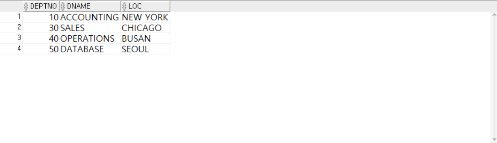

---
<!-- _class: aqua -->
1.  DEPT_TCL 테이블에  50, 'DATABASE', 'SEOUL'  데이터 삽입
2.  DEPTNO 가 40인 데이터의 LOC을 'BUSAN' 으로 수정
3.  DNAME 이 'RESEARCH'인 데이터 삭제
4.  전체 데이터 조회

 

---
<!-- _class: aqua -->
##### Q003
- DEPT_TCL 테이블을 이용해 다음과 같이 작성하시오.
1. ROLLBACK 명령어를 이용하여 실행을 취소하시오.
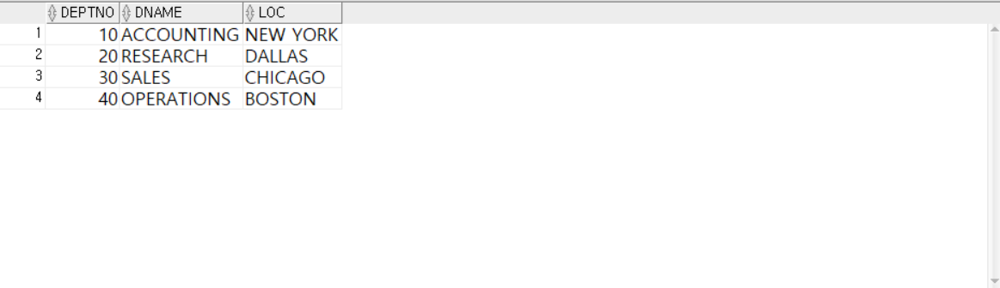

 

---
<!-- _class: aqua -->
##### Q004
- DEPT_TCL 테이블을 이용해 다음과 같이 작성하시오.
1. INSERT를 이용하여   50, 'NETWORK', 'SEOUL'  값을 추가하시오.
2. DEPTNO가 20인데이터의 LOC를 BUSAN으로 수정하시오.
3. DEPTNO가 40인데이터를 삭제하시오.

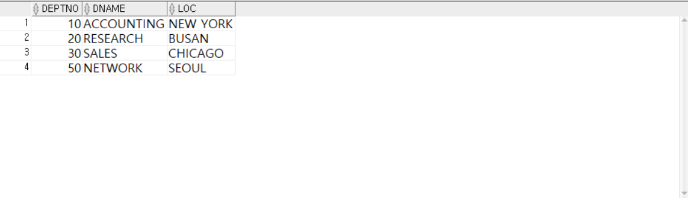

 

---
<!-- _class: aqua -->
##### Q005
- DEPT_TCL 테이블을 이용해 다음과 같이 작성하시오.
1. 위의 명령어를 반영하시오.

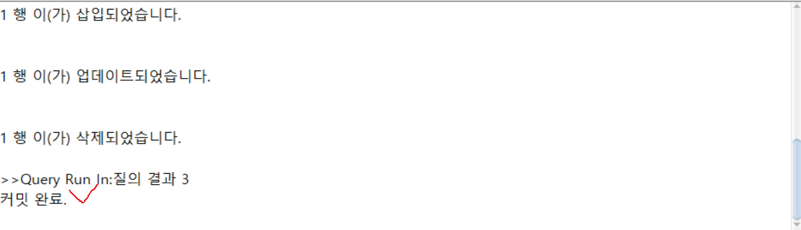

 

---
<!-- _class: aqua -->
##### Q006
- 세션? : 어떤활동을 위한 시간이나 기간
- 명령프롬프트 2개 실행가능
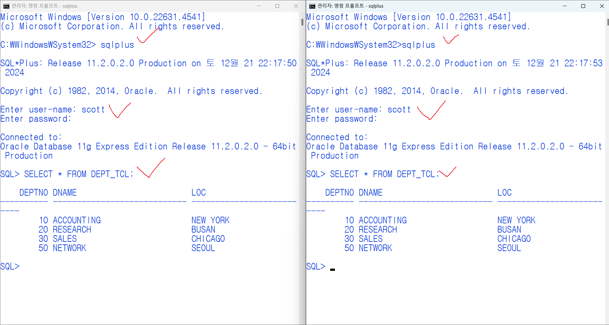

 

---
<!-- _class: aqua -->
##### Q007
- 한쪽 세션에서만 삭제
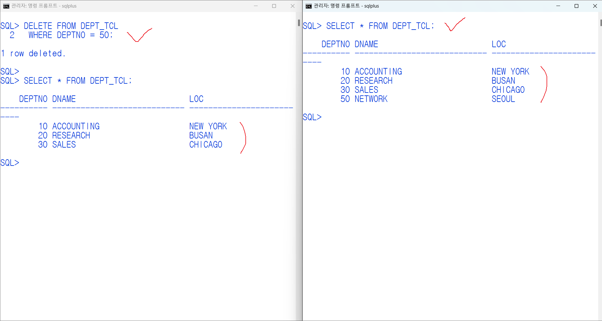

 

---
<!-- _class: aqua -->
##### Q008
- 세션반영후 확인
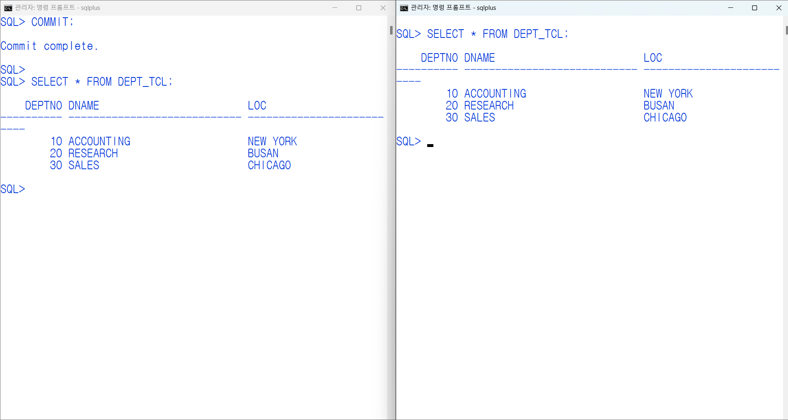

 

---
<!-- _class: aqua -->
##### Q009
- LOCK? : 잠금현상, 조작중인 데이터를 다른세션은 조작할 수 없도록 접근을 보류시키는 것.
- 명령프롬프트 2개 실행가능
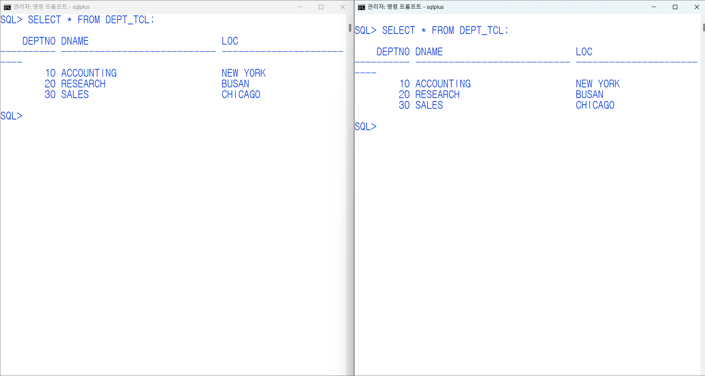

 

---
<!-- _class: aqua -->
##### Q010
- 한쪽에서 업데이트  (1번)
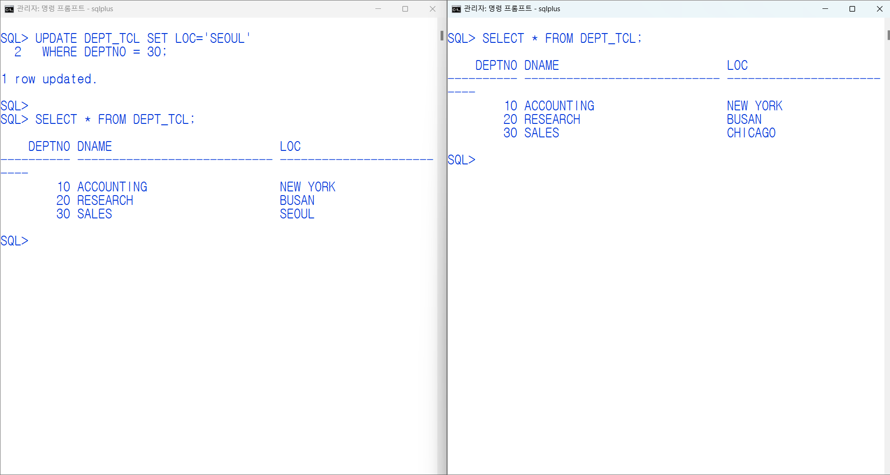

 

---
<!-- _class: aqua -->
##### Q011
- 한쪽에서 업데이트  (2번)  LOCK 걸림
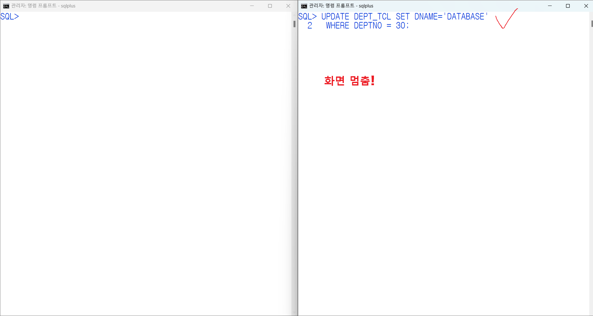

 

---
<!-- _class: aqua -->
##### Q012
- 1번에서 마무리를 해야 LOCK이 풀림
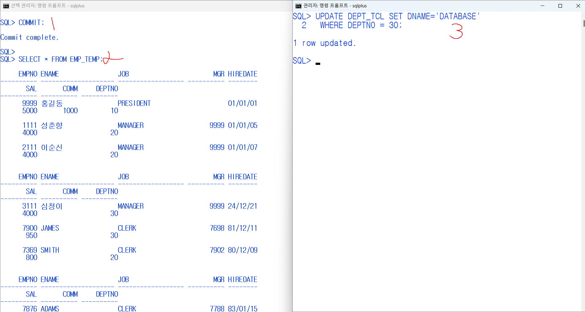
 

---
<!-- _class: aqua -->
##### Q013
- select 구문으로 확인
- 데이터가 다른것을 알수 있다.
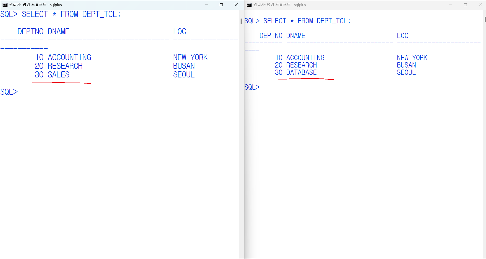

 

---
<!-- _class: aqua -->
##### Q014
- commit으로 데이터 반영
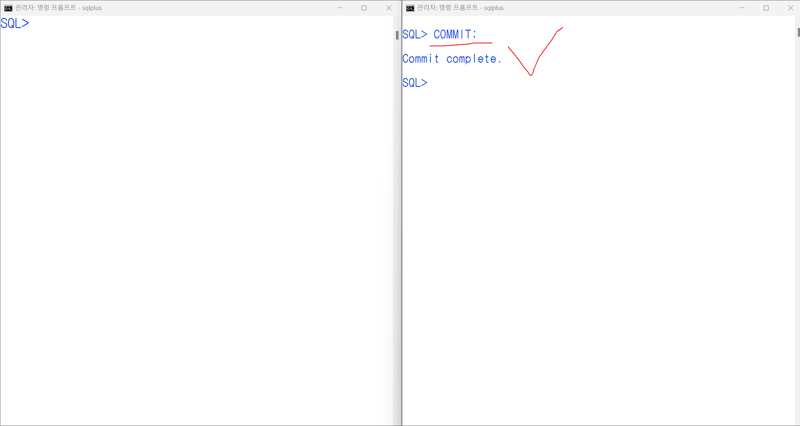

 

---
<!-- _class: aqua -->
##### Q015
- select 구문으로 데이터 확인
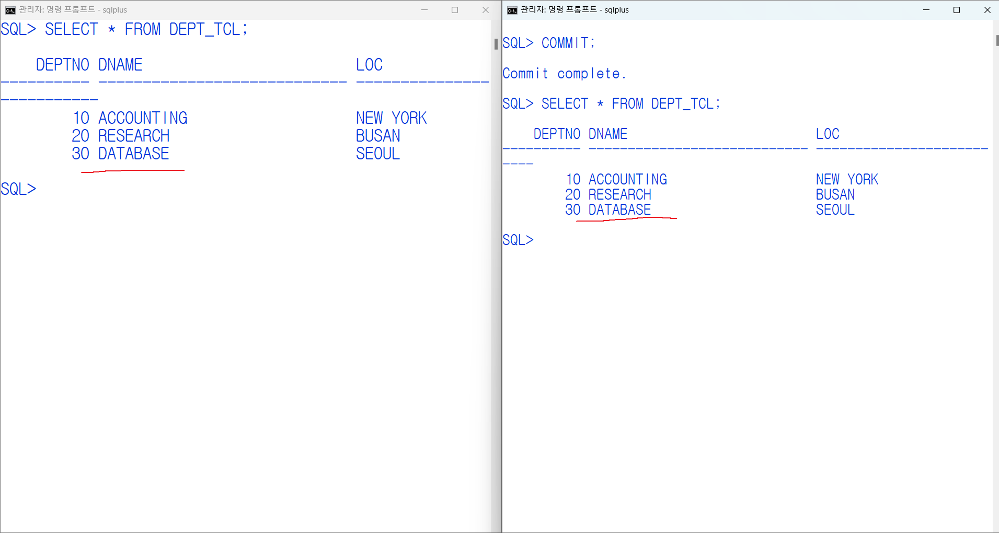

 

---
<!-- _class: purple -->
# 사고확장EX
---
<!-- _class: aqua -->
##### EX001
 두 세션에서 실행되는 순서별 SQL명령어를 확인하여 번호에 맞는 데이터 상태를 적으시오.

|세션A|세션B|
|-|-|
|UPDATE DEPT  SET DATABASE='DATABASE' , LOC='SEOUL' WHERE DEPTNO=30  |  |
|SELECT * FROM DEPT  | SELECT * FROM DEPT  |

---
<!-- _class: aqua -->
>QUESTION

현재 세션 A,B에는 조회한 DEPT테이블 30번부서의 DNAME, LOC열의 데이터 상태를 적으시오.

 

---
<!-- _class: aqua -->
##### EX002
 위에 연결해 다음과 같이 작업을 했다.

|세션A|세션B|
|-|-|
|  | UPDATE DEPT  SET DATABASE='DATABASE' , LOC='SEOUL' WHERE DEPTNO=30 |
---
<!-- _class: aqua -->
>QUESTION

현재 세션 B에서 실행한 UPDATE 문 실행결과를 적으시오.

<pre class="codeblock">
② 세션 B의 UPDATE 명령이 실행된 후 대기상태(HANG)가 된다.
세션 A의 트랜잭션이 아직 종료되지 않았기 때문이다.
</pre>

---
<!-- _class: aqua -->
##### EX003
 위에 연결해 다음과 같이 작업을 했다.

|세션A|세션B|
|-|-|
|ROLLBACK |   |

---
<!-- _class: aqua -->
>QUESTION

세션A에서 ROLLBACK명령어를 사용한 후 세션B에서 일어나는 변화를 적으시오.

---
<!-- _class: aqua -->
<pre class="codeblock">
③ 세션 A의 ROLLBACK 명령이 실행되자마자 세션 B의 UPDATE문이 수행된다. 세션 A의 트랜잭션에 의한 행 레벨 록이 끝났기 때문이다.
</pre>

---
<!-- _class: aqua -->
##### EX004
 위에 연결해 다음과 같이 작업을 했다.

|세션A|세션B|
|-|-|
| SELECT * FROM DEPT; |  SELECT * FROM DEPT;  |

---
<!-- _class: aqua -->
>QUESTION

세션A, B에서 조회한 DEPT테이블 30번 부서의 DNAME, LOC의 데이터 상태를 적으시오.

<pre class="codeblock">
④ 세션 A : DNAME은 SALES, LOC은 CHICAGO
  세션 B : DNAME은 DATABASE, LOC은 SEOUL
</pre>

---
<!-- _class: aqua -->
##### EX005
 위에 연결해 다음과 같이 작업을 했다.

|세션A|세션B|
|-|-|
|   |  COMMIT;  |
| SELECT * FROM DEPT; |  SELECT * FROM DEPT;  |

---
<!-- _class: aqua -->
>QUESTION

세션A, B에서 조회한 DEPT테이블 30번 부서의 DNAME, LOC의 데이터 상태를 적으시오.

<pre class="codeblock">
⑤ 세션 A : DNAME은 DATABASE, LOC은 SEOUL
  세션 B : DNAME은 DATABASE, LOC은 SEOUL
</pre>

---

<!-- _class: aqua -->

1. COMMIT 과 ROLLBACK 은 각각 어떤 역할을 하나요?  
2. SAVEPOINT 는 어떤 상황에서 유용한가요?  
3. ROLLBACK TO SAVEPOINT 는 어떤 동작을 하나요?  
4. DDL 문 실행 시 트랜잭션은 어떻게 처리되나요?  
5. ACID 특성 중 Isolation 은 어떤 의미인가요?

---

<!-- _class: red -->
# 🧪 Step 5: 기억 테스트

---

<!-- _class: aqua -->

- COMMIT 이후 ROLLBACK 이 가능한가요?  
- SAVEPOINT 없이 ROLLBACK 하면 어떤 일이 발생하나요?  
- 자동 트랜잭션과 수동 트랜잭션의 차이는 무엇인가요?  
- Atomicity 와 Durability 의 차이는 무엇인가요?  
- 트랜잭션이 중요한 이유는 무엇인가요?
  

---
<!-- _class: thanks -->
## 👋 열심히 들어주셔서 감사합니다!
 
> 오늘의 한 걸음이 **내일의 가능성**이 되길 바라며,  