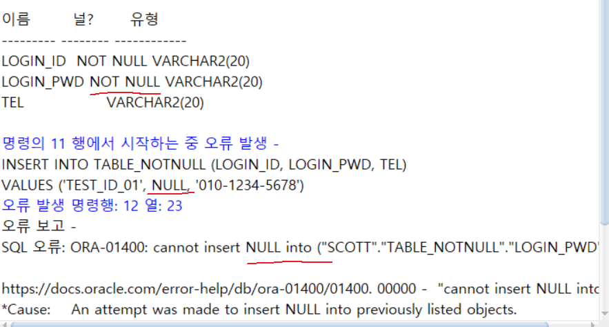

<!-- _class: cover-oracle -->
<h4 style="color:#6C757D;">
  🧠
  CodeCraft Series · Track 02
</h4>
<h1 style="color:#007BFF;">Oracle Fundamentals</h1>
<h3 style="color:#17A2B8;">SQL부터 PL/SQL까지, 오라클의 핵심을 잡다</h3>

<!-- 현재 챕터 강조 -->

  📍 <strong>현재 위치:</strong> Chapter 1 · <em>오라클 환경 설정 · 기본 SELECT</em>

<blockquote>
  실무에 바로 적용 가능한 오라클 입문서 
  데이터를 다루는 힘, SQL로 시작해요
</blockquote>

---
<!-- _class: cover-oracle -->
<h2 style="font-size:1.6em; color:#555;">📚 Oracle 트랙 목차</h2>
  <strong style="color:#FF6E7F;">PART 1 · SQL 기본</strong>

  ▶ Chapter 01: oracle_setting
  ▶ Chapter 02: select_basic
  ▶ Chapter 03: select_where
  ▶ Chapter 04: select_fn
  ▶ Chapter 05: select_group
  ▶ Chapter 06: select_join
  ▶ Chapter 07: select_subquery

---
<!-- _class: cover-oracle -->
<h2 style="font-size:1.6em; color:#555;">📚 Oracle 트랙 목차</h2>
 <strong style="color:#FF6E7F;">PART 2 · 데이터 조작 및 객체</strong> 

 
  ▶ Chapter 08: update_delete
  ▶ Chapter 09: transaction
  ▶ Chapter 10: ddl
  ▶ Chapter 11: object
  ✅▶ Chapter 12: constraint
  ▶ Chapter 13: user

---
<!-- _class: cover-oracle -->
<h2 style="font-size:1.6em; color:#555;">📚 Oracle 트랙 목차</h2>
<strong style="color:#FF6E7F;">PART 3 · PL/SQL 심화</strong>

  
  ▶ Chapter 14: plsql
  ▶ Chapter 15: record
  ▶ Chapter 16: cursor
  ▶ Chapter 17: save

  이 트랙은 오라클의 기본 SQL부터 객체 관리, PL/SQL까지  실무 중심으로 배우며, 데이터베이스 전문가로 성장합니다.

 

 
 

---

<!-- _class: orange -->
# 🧩 Step 1: 핵심 개념  
***SQL 제약조건 실습***  
→ ***데이터 무결성 유지***, ***기본키/외래키 설정***, ***고유값/NULL 제어***, ***조건 검사***

---

<!-- _class: aqua -->
### 🔐 제약조건이란?  
- 테이블에 저장되는 데이터의 정확성과 일관성을 보장  
- 테이블 생성 시 또는 ALTER로 추가 가능  
- 오류 발생 시 데이터 입력/수정 거부

---

<!-- _class: aqua -->
### 🧱 NOT NULL  
- 해당 컬럼은 반드시 값이 있어야 함  
- 기본값 없이 NULL 입력 불가  
- 예: ENAME VARCHAR2(10) NOT NULL

---

<!-- _class: aqua -->
### 🆔 PRIMARY KEY  
- 테이블의 고유 식별자  
- 중복 불가 + NULL 불가  
- 단일 컬럼 또는 복합 컬럼 지정 가능  
- 자동 인덱스 생성됨

---

<!-- _class: aqua -->
### 🔗 FOREIGN KEY  
- 다른 테이블의 PRIMARY KEY 참조  
- 참조 무결성 유지  
- 부모 테이블의 값만 입력 가능  
- ON DELETE CASCADE 옵션으로 연쇄 삭제 가능

---

<!-- _class: aqua -->
### 🧬 UNIQUE  
- 중복 값 허용하지 않음  
- NULL은 허용  
- 여러 컬럼에 각각 적용 가능

---

<!-- _class: aqua -->
### 🧠 CHECK  
- 특정 조건 만족 여부 검사  
- 예: SAL > 0, GENDER IN ('M', 'F')  
- 복잡한 비즈니스 규칙 적용 가능

---

<!-- _class: blue -->
# 🧪 Step 2: 코드 예제

---

<!-- _class: aqua -->

<pre class="codeblock">
-- NOT NULL 제약
CREATE TABLE EMP (
  ENAME VARCHAR2(10) NOT NULL
);

-- PRIMARY KEY 제약
CREATE TABLE DEPT (
  DEPTNO NUMBER(2) PRIMARY KEY,
  DNAME VARCHAR2(14)
);

-- FOREIGN KEY 제약
CREATE TABLE EMP (
  EMPNO NUMBER(4) PRIMARY KEY,
  ENAME VARCHAR2(10),
  DEPTNO NUMBER(2),
  CONSTRAINT FK_DEPT FOREIGN KEY (DEPTNO)
    REFERENCES DEPT(DEPTNO)
    ON DELETE CASCADE
);

-- UNIQUE 제약
CREATE TABLE USER_INFO (
  USER_ID NUMBER,
  EMAIL VARCHAR2(50) UNIQUE
);

-- CHECK 제약
CREATE TABLE PRODUCT (
  PID NUMBER,
  PRICE NUMBER CHECK (PRICE > 0),
  CATEGORY VARCHAR2(10) CHECK (CATEGORY IN ('A', 'B', 'C'))
);

-- 제약조건 삭제
ALTER TABLE EMP DROP CONSTRAINT FK_DEPT;
</pre>

---

<!-- _class: aqua -->

## ✅ 제약조건 요약표

| 제약조건 | 설명 |
|----------|------|
| NOT NULL | NULL 입력 금지 |
| PRIMARY KEY | 고유 식별자, 중복/NULL 금지 |
| FOREIGN KEY | 다른 테이블 참조 |
| UNIQUE | 중복 금지, NULL 허용 |
| CHECK | 조건 검사 |

---

<!-- _class: green -->
# 🧪 Step 3: 연습문제

 

---
<!-- _class: aqua -->
##### Q001
- 다음과 같이 테이블 생성시 NOT NULL을 설정하시오.

---
<!-- _class: aqua -->
<pre class="codeblock">
CREATE TABLE TABLE_NOTNULL(
   LOGIN_ID VARCHAR2(20) NOT NULL,
   LOGIN_PWD VARCHAR2(20) NOT NULL,
   TEL VARCHAR2(20)
);

DESC TABLE_NOTNULL;

</pre>

---
<!-- _class: aqua -->
##### Q002
- 제약조건이 NOT NULL 인 열에 NULL 값을 넣어보시오. (에러)

---
<!-- _class: aqua -->
<pre class="codeblock">
INSERT INTO TABLE_NOTNULL (LOGIN_ID, LOGIN_PWD, TEL)
VALUES ('TEST_ID_01', NULL, '010-1234-5678');

</pre>

---
<!-- _class: aqua -->
##### Q003
- 제약 조건이 없는 TEL열에 NULL 값을 입력하시오.

---
<!-- _class: aqua -->
<pre class="codeblock">
INSERT INTO TABLE_NOTNULL (LOGIN_ID, LOGIN_PWD)
VALUES ('TEST_ID_01', '1234');

SELECT * FROM TABLE_NOTNULL;

</pre>

---
<!-- _class: aqua -->
##### Q004
- NOT NULL 제약 조건이 지정된 열 데이터를 NULL 값으로 업데이트 하시오. (에러)

---
<!-- _class: aqua -->
<pre class="codeblock">
UPDATE TABLE_NOTNULL
   SET LOGIN_PWD = NULL
 WHERE LOGIN_ID = 'TEST_ID_01';

</pre>

---
<!-- _class: aqua -->
##### Q005
- (SCOTT) 제약조건을 살펴보시오.

---
<!-- _class: aqua -->
<pre class="codeblock">
SELECT OWNER, CONSTRAINT_NAME, CONSTRAINT_TYPE, TABLE_NAME
  FROM USER_CONSTRAINTS;

</pre>

---
<!-- _class: aqua -->
##### Q006
- 테이블 생성시 제약조건에 이름을 다음과 같이 지정하시오.

---
<!-- _class: aqua -->
<pre class="codeblock">
CREATE TABLE TABLE_NOTNULL2(
   LOGIN_ID VARCHAR2(20) CONSTRAINT TBLNN2_LGNID_NN NOT NULL,
   LOGIN_PWD VARCHAR2(20) CONSTRAINT TBLNN2_LGNPW_NN NOT NULL,
   TEL VARCHAR2(20)
);

SELECT OWNER, CONSTRAINT_NAME, CONSTRAINT_TYPE, TABLE_NAME
  FROM USER_CONSTRAINTS;

</pre>

---
<!-- _class: aqua -->
##### Q007
- 이미 생성한 테이블에 제약 조건을 다음과 같이 지정하시오.
- TEL 열에 NOT NULL 제약조건을 추가하시오.

---
<!-- _class: aqua -->
<pre class="codeblock">
ALTER TABLE TABLE_NOTNULL
MODIFY(TEL NOT NULL);

</pre>

---
<!-- _class: aqua -->
##### Q008
- LOGIN_ID 가 **TEST_ID_01** 인  TEL의 데이터를  '010-1234-5678' 로 수정하시오.

---
<!-- _class: aqua -->
<pre class="codeblock">
UPDATE TABLE_NOTNULL
   SET TEL = '010-1234-5678'
 WHERE LOGIN_ID = 'TEST_ID_01';

SELECT * FROM TABLE_NOTNULL;

</pre>

---
<!-- _class: aqua -->
##### Q009
- TEL 열에 NOT NULL을 추가하시오.

---
<!-- _class: aqua -->
<pre class="codeblock">
ALTER TABLE TABLE_NOTNULL
MODIFY(TEL NOT NULL);

SELECT OWNER, CONSTRAINT_NAME, CONSTRAINT_TYPE, TABLE_NAME
  FROM USER_CONSTRAINTS;

</pre>

---
<!-- _class: aqua -->
##### Q010
- TEL 열에 제약조건이름을 지정해서 추가하시오.

---
<!-- _class: aqua -->
<pre class="codeblock">
ALTER TABLE TABLE_NOTNULL2
MODIFY(TEL CONSTRAINT TBLNN_TEL_NN NOT NULL);

SELECT OWNER, CONSTRAINT_NAME, CONSTRAINT_TYPE, TABLE_NAME
  FROM USER_CONSTRAINTS;

</pre>

---
<!-- _class: aqua -->
##### Q011
- TABLE_NOTNULL2 테이블 열 구조를 확인하시오.

---
<!-- _class: aqua -->
<pre class="codeblock">
DESC TABLE_NOTNULL2;

</pre>

---
<!-- _class: aqua -->
##### Q012
- 이미 생성된 제약조건이름을 변경하시오.

---
<!-- _class: aqua -->
<pre class="codeblock">
ALTER TABLE TABLE_NOTNULL2
RENAME CONSTRAINT TBLNN_TEL_NN TO TBLNN2_TEL_NN;

SELECT OWNER, CONSTRAINT_NAME, CONSTRAINT_TYPE, TABLE_NAME
  FROM USER_CONSTRAINTS;

</pre>

---
<!-- _class: aqua -->
##### Q013
- TABLE_NOTNULL2 제약 조건을 삭제하시오.

---
<!-- _class: aqua -->
<pre class="codeblock">
ALTER TABLE TABLE_NOTNULL2
 DROP CONSTRAINT TBLNN2_TEL_NN;

DESC TABLE_NOTNULL2;

</pre>

---
<!-- _class: aqua -->
##### Q014
- LOGIN_ID 열에 중복되지 않는값 UNIQUE를 지정하시오.

---
<!-- _class: aqua -->
<pre class="codeblock">
CREATE TABLE TABLE_UNIQUE(
   LOGIN_ID VARCHAR2(20) UNIQUE,
   LOGIN_PWD VARCHAR2(20) NOT NULL,
   TEL VARCHAR2(20)
);

DESC TABLE_UNIQUE;

</pre>

---
<!-- _class: aqua -->
##### Q015
- USER_CONSTRAINTS 데이터 사전에서 제약조건을 확인하시오.

---
<!-- _class: aqua -->
<pre class="codeblock">
SELECT OWNER, CONSTRAINT_NAME, CONSTRAINT_TYPE, TABLE_NAME
  FROM USER_CONSTRAINTS
 WHERE TABLE_NAME = 'TABLE_UNIQUE';

</pre>

---
<!-- _class: aqua -->
##### Q016
- TABLE_UNIQUE 테이블에 다음과 같이 데이터를 삽입하시오.

---
<!-- _class: aqua -->
<pre class="codeblock">
INSERT INTO TABLE_UNIQUE(LOGIN_ID, LOGIN_PWD, TEL)
VALUES('TEST_ID_01', 'PWD01', '010-1234-5678');

SELECT * FROM TABLE_UNIQUE;

</pre>

---
<!-- _class: aqua -->
##### Q017
- 다음과 같이 중복되는 데이터를 삽입해보시오. (에러 )

---
<!-- _class: aqua -->
<pre class="codeblock">
INSERT INTO TABLE_UNIQUE (LOGIN_ID, LOGIN_PWD, TEL)
VALUES ('TEST_ID_01', 'PWD01', '010-1234-5678');

</pre>

---
<!-- _class: aqua -->
##### Q018
- TABLE_UNIQUE 테이블에 다음과 같이 데이터를 입력하시오.
- LOGIN_PWD 열은 NOT NULL 조건만 지정되어 있어 중복허용이 됨.

---
<!-- _class: aqua -->
<pre class="codeblock">
INSERT INTO TABLE_UNIQUE(LOGIN_ID, LOGIN_PWD, TEL)
VALUES('TEST_ID_02', 'PWD01', '010-1234-5678');

SELECT * FROM TABLE_UNIQUE;

</pre>

---
<!-- _class: aqua -->
##### Q019
- TABLE_UNIQUE 테이블에 다음과 같이 데이터를 입력하시오.
- UNIQUE제약 조건이 지정된 열에 NULL 값 입력가능

---
<!-- _class: aqua -->
<pre class="codeblock">
INSERT INTO TABLE_UNIQUE(LOGIN_ID, LOGIN_PWD, TEL)
VALUES(NULL, 'PWD01', '010-2345-6789');

SELECT * FROM TABLE_UNIQUE;

</pre>

---
<!-- _class: aqua -->
##### Q020
- TABLE_UNIQUE 테이블에 다음과 같이 데이터를 수정하시오. (에러)
- LOGIN_ID 에 이미 존재하는 값을 지정하면 중복데이터가 발생하므로 에러발생

---
<!-- _class: aqua -->
<pre class="codeblock">
UPDATE TABLE_UNIQUE
   SET LOGIN_ID='TEST_ID_01'
 WHERE LOGIN_ID IS NULL;

</pre>

---
<!-- _class: aqua -->
##### Q021
- 다음과 같이 테이블을 생성하시오.
- 테이블을 생성할때  UNIQUE 제약 조건 설정하시오.

---
<!-- _class: aqua -->
<pre class="codeblock">
CREATE TABLE TABLE_UNIQUE2(
   LOGIN_ID VARCHAR2(20) CONSTRAINT TBLUNQ2_LGNID_UNQ UNIQUE,
   LOGIN_PWD VARCHAR2(20) CONSTRAINT TBLUNQ2_LGNPW_NN NOT NULL,
   TEL VARCHAR2(20)
);

DESC  TABLE_UNIQUE2;
</pre>

---
<!-- _class: aqua -->
##### Q022
- 생성한 UNIQUE 제약 조건을 확인하시오.

---
<!-- _class: aqua -->
<pre class="codeblock">
SELECT OWNER, CONSTRAINT_NAME, CONSTRAINT_TYPE, TABLE_NAME
  FROM USER_CONSTRAINTS
 WHERE TABLE_NAME LIKE 'TABLE_UNIQUE%';

</pre>

---
<!-- _class: aqua -->
##### Q023
- 이미 생성한 열에 UNIQUE제약 조건 추가하시오.
- ALTER MODIFY 이용

---
<!-- _class: aqua -->
<pre class="codeblock">
ALTER TABLE TABLE_UNIQUE
MODIFY(TEL UNIQUE);

</pre>

---
<!-- _class: aqua -->
##### Q024
- TEL 열값을 모두 NULL 값으로 변경하시오.

---
<!-- _class: aqua -->
<pre class="codeblock">
UPDATE TABLE_UNIQUE
   SET TEL = NULL;

SELECT * FROM TABLE_UNIQUE;

</pre>

---
<!-- _class: aqua -->
##### Q025
- TEL 값에 UNIQUE제약 조건 설정하시오.

---
<!-- _class: aqua -->
<pre class="codeblock">
ALTER TABLE TABLE_UNIQUE
MODIFY(TEL UNIQUE);

</pre>

---
<!-- _class: aqua -->
##### Q026
- UNIQUE제약 조건의 이름을 직접 지정하시오.

---
<!-- _class: aqua -->
<pre class="codeblock">
ALTER TABLE TABLE_UNIQUE2
MODIFY(TEL CONSTRAINT TBLUNQ_TEL_UNQ UNIQUE);

SELECT OWNER, CONSTRAINT_NAME, CONSTRAINT_TYPE, TABLE_NAME
  FROM USER_CONSTRAINTS
 WHERE TABLE_NAME LIKE 'TABLE_UNIQUE%';

</pre>

---
<!-- _class: aqua -->
##### Q027
- 이미 만들어져 있는 UNIQUE제약 조건이름을 다음과 같이 수정하시오.

---
<!-- _class: aqua -->
<pre class="codeblock">
ALTER TABLE TABLE_UNIQUE2
RENAME CONSTRAINT TBLUNQ_TEL_UNQ TO TBLUNQ2_TEL_UNQ;

SELECT OWNER, CONSTRAINT_NAME, CONSTRAINT_TYPE, TABLE_NAME
  FROM USER_CONSTRAINTS
 WHERE TABLE_NAME LIKE 'TABLE_UNIQUE%';

</pre>

---
<!-- _class: aqua -->
##### Q028
-  다음과 같이 제약 조건을 삭제하시오.

---
<!-- _class: aqua -->
<pre class="codeblock">
ALTER TABLE TABLE_UNIQUE2
 DROP CONSTRAINT TBLUNQ2_TEL_UNQ;

SELECT OWNER, CONSTRAINT_NAME, CONSTRAINT_TYPE, TABLE_NAME
  FROM USER_CONSTRAINTS
 WHERE TABLE_NAME LIKE 'TABLE_UNIQUE%';

</pre>

---
<!-- _class: aqua -->
##### Q029
- 다음과 같이 테이블을 생성할때 PRIMARY KEY를 설정하시오.

---
<!-- _class: aqua -->
<pre class="codeblock">
CREATE TABLE TABLE_PK(
   LOGIN_ID VARCHAR2(20) PRIMARY KEY,
   LOGIN_PWD VARCHAR2(20) NOT NULL,
   TEL VARCHAR2(20)
);

DESC TABLE_PK;

</pre>

---
<!-- _class: aqua -->
##### Q030
- 생성한 PRIMARY KEY를 확인하시오.

---
<!-- _class: aqua -->
<pre class="codeblock">
SELECT OWNER, CONSTRAINT_NAME, CONSTRAINT_TYPE, TABLE_NAME
  FROM USER_CONSTRAINTS
 WHERE TABLE_NAME LIKE 'TABLE_PK%';

</pre>

---
<!-- _class: aqua -->
##### Q031
- 생성한 PRIMARY KEY를 통해 자동생성된 INDEX를 확인하시오.

---
<!-- _class: aqua -->
<pre class="codeblock">
SELECT INDEX_NAME, TABLE_OWNER, TABLE_NAME
  FROM USER_INDEXES
 WHERE TABLE_NAME LIKE 'TABLE_PK%';

</pre>

---
<!-- _class: aqua -->
##### Q032
- 제약 조건의 이름을 직접 지정하여 테이블을 생성하시오.

---
<!-- _class: aqua -->
<pre class="codeblock">
CREATE TABLE TABLE_PK2(
   LOGIN_ID VARCHAR2(20) CONSTRAINT TBLPK2_LGNID_PK PRIMARY KEY,
   LOGIN_PWD VARCHAR2(20) CONSTRAINT TBLPK2_LGNPW_NN NOT NULL,
   TEL VARCHAR2(20)
);

DESC TABLE_PK2;

</pre>

---
<!-- _class: aqua -->
##### Q033
- 다음과 같이 데이터를  입력하시오.

---
<!-- _class: aqua -->
<pre class="codeblock">
INSERT INTO TABLE_PK(LOGIN_ID, LOGIN_PWD, TEL)
VALUES('TEST_ID_01', 'PWD01', '010-1234-5678');

SELECT * FROM TABLE_PK;

</pre>

---
<!-- _class: aqua -->
##### Q034
- 다음과 같이 테이블에 중복되는 데이터를 입력하시오.
- PRIMARY KEY제약조건이 지정되어 있는 열은 중복을 허용하지 않음.

---
<!-- _class: aqua -->
<pre class="codeblock">
INSERT INTO TABLE_PK(LOGIN_ID, LOGIN_PWD, TEL)
VALUES('TEST_ID_01', 'PWD02', '010-2345-6789');

</pre>

---
<!-- _class: aqua -->
##### Q035
- 다음과 같이 데이터를 입력하시오.
- NULL값을 명시적으로 입력하시오.

---
<!-- _class: aqua -->
<pre class="codeblock">
INSERT INTO TABLE_PK(LOGIN_ID, LOGIN_PWD, TEL)
VALUES(NULL, 'PWD02', '010-2345-6789');

</pre>

---
<!-- _class: aqua -->
##### Q036
- 다음과 같이 데이터를 입력하시오.
- NULL값을 암시적으로  입력하시오.

---
<!-- _class: aqua -->
<pre class="codeblock">
INSERT INTO TABLE_PK(LOGIN_PWD, TEL)
VALUES('PWD02', '010-2345-6789');

</pre>

---
<!-- _class: aqua -->
##### Q037
- EMP 테이블과 DEPT 테이블의 제약 조건을 살펴보시오.

---
<!-- _class: aqua -->
<pre class="codeblock">
SELECT OWNER, CONSTRAINT_NAME, CONSTRAINT_TYPE, TABLE_NAME, R_OWNER, R_CONSTRAINT_NAME
  FROM USER_CONSTRAINTS
 WHERE TABLE_NAME IN ('EMP', 'DEPT');

</pre>

---
<!-- _class: aqua -->
##### Q038
- FOREIGN KEY가 참조하는 열에 존재하지 않는 데이터를 입력하시오.
- 다음과 같이 데이터를 입력하고 결과를 확인하시오.
- 에러 : 부모키가 없음.

---
<!-- _class: aqua -->
<pre class="codeblock">
INSERT INTO EMP(EMPNO, ENAME, JOB, MGR, HIREDATE, SAL, COMM, DEPTNO)
VALUES(9999, '홍길동', 'CLERK', '7788', TO_DATE('2017/04/30', 'YYYY/MM/DD'), 1200, NULL, 50);

</pre>

---
<!-- _class: aqua -->
##### Q039
- 다음과 같이 DEPT_FK테이블을 생성하시오.

---
<!-- _class: aqua -->
<pre class="codeblock">
CREATE TABLE DEPT_FK(
   DEPTNO NUMBER(2) CONSTRAINT DEPTFK_DEPTNO_PK PRIMARY KEY,
   DNAME VARCHAR2(14),
   LOC VARCHAR2(13)
);

DESC DEPT_FK;

</pre>

---
<!-- _class: aqua -->
##### Q040
- 다음과 같이 EMP_FK테이블을 생성하시오.
- 외래키 설정

---
<!-- _class: aqua -->
<pre class="codeblock">
CREATE TABLE EMP_FK(
   EMPNO NUMBER(4) CONSTRAINT EMPFK_EMPNO_PK PRIMARY KEY,
   ENAME VARCHAR2(10),
   JOB VARCHAR2(9),
   MGR NUMBER(4),
   HIREDATE DATE,
   SAL NUMBER(7,2),
   COMM NUMBER(7,2),
   DEPTNO NUMBER(2) CONSTRAINT EMPFK_DEPTNO_FK REFERENCES DEPT_FK (DEPTNO)
);

DESC EMP_FK;

</pre>

---
<!-- _class: aqua -->
##### Q041
- EMP_FK 테이블에 다음과 같이 데이터를 삽입하시오.
- 에러발생
- DEPTNO데이터가 아직 DEPT_FK테이블에 데이터가 없음
- 부모데이터가 없음.

---
<!-- _class: aqua -->
<pre class="codeblock">
INSERT INTO EMP_FK
VALUES(9999, 'TEST_NMAME', 'TEST_JOB', NULL, TO_DATE('2001/01/01', 'YYYY/MM/DD'),
       3000, NULL, 10);

</pre>

---
<!-- _class: aqua -->
##### Q042
- DEPT_FK테이블에 데이터를 삽입하시오.

---
<!-- _class: aqua -->
<pre class="codeblock">
INSERT INTO DEPT_FK
VALUES(10, 'TEST_DNAME', 'TEST_LOC');

SELECT * FROM DEPT_FK;

</pre>

---
<!-- _class: aqua -->
##### Q043
- EMP_FK 테이블에 다음과 같이 데이터를 삽입하시오.
- 삽입가능
- 부모테이블에 데이터 있음.

---
<!-- _class: aqua -->
<pre class="codeblock">
INSERT INTO EMP_FK
VALUES(9999, 'TEST_NMAME', 'TEST_JOB', NULL, TO_DATE('2001/01/01', 'YYYY/MM/DD'),
       3000, NULL, 10);

SELECT * FROM EMP_FK;

</pre>

---
<!-- _class: aqua -->
##### Q044
- DEPT_FK 테이블의 10번 부서 데이터를 삭제 하시오.
- 에러발생
- EMP_FK에서 10번부서의 데이터를 참조하고 있음.
- 삭제 불가능능

---
<!-- _class: aqua -->
<pre class="codeblock">
DELETE FROM DEPT_FK
 WHERE DEPTNO = 10;

</pre>

---
<!-- _class: aqua -->
##### Q045
- 테이블을 생성할때 CHECK 제약 조건 설정하시오.
- LOGIN_PWD 는 3글자 초과만 저장가능

---
<!-- _class: aqua -->
<pre class="codeblock">
CREATE TABLE TABLE_CHECK(
   LOGIN_ID VARCHAR2(20) CONSTRAINT TBLCK_LOGINID_PK PRIMARY KEY,
   LOGIN_PWD VARCHAR2(20) CONSTRAINT TBLCK_LOGINPW_CK CHECK (LENGTH(LOGIN_PWD) > 3),
   TEL VARCHAR2(20)
);

DESC TABLE_CHECK;

</pre>

---
<!-- _class: aqua -->
##### Q046
- CHECK 제약 조건에 맞지 않는 데이터를 삽입
-  LOGIN_PWD 는 3글자 초과만 저장가능   123

---
<!-- _class: aqua -->
<pre class="codeblock">
INSERT INTO TABLE_CHECK
VALUES ('TEST_ID', '123', '010-1234-5678');

</pre>

---
<!-- _class: aqua -->
##### Q047
- CHECK 제약 조건에 맞는 데이터를 삽입
-  LOGIN_PWD 는 3글자 초과만 저장가능   1234
- 성공!

---
<!-- _class: aqua -->
<pre class="codeblock">
INSERT INTO TABLE_CHECK
VALUES ('TEST_ID', '1234', '010-1234-5678');

SELECT * FROM TABLE_CHECK;

</pre>

---
<!-- _class: aqua -->
##### Q048
- CHECK 제약 조건 확인하기.

---
<!-- _class: aqua -->
<pre class="codeblock">
SELECT OWNER, CONSTRAINT_NAME, CONSTRAINT_TYPE, TABLE_NAME
  FROM USER_CONSTRAINTS
 WHERE TABLE_NAME LIKE 'TABLE_CHECK';

</pre>

---
<!-- _class: aqua -->
##### Q049
- 테이블을 생성할때 DEFAULT 제약 조건을 설정하시오.
- 기본값 1234

---
<!-- _class: aqua -->
<pre class="codeblock">
CREATE TABLE TABLE_DEFAULT(
   LOGIN_ID VARCHAR2(20) CONSTRAINT TBLCK2_LOGINID_PK PRIMARY KEY,
   LOGIN_PWD VARCHAR2(20) DEFAULT '1234',
   TEL VARCHAR2(20)
);

DESC TABLE_DEFAULT;

</pre>

---
<!-- _class: aqua -->
##### Q050
- DEFAULT로 지정한 기본값이 입력되는 INSERT문을 확인하시오.
- 다음과 같이 데이터를 입력하시오.

---
<!-- _class: aqua -->
<pre class="codeblock">
INSERT INTO TABLE_DEFAULT VALUES ('TEST_ID', NULL, '010-1234-5678');

INSERT INTO TABLE_DEFAULT (LOGIN_ID, TEL) VALUES ('TEST_ID2', '010-1234-5678');

SELECT * FROM TABLE_DEFAULT;
</pre>

---
<!-- _class: purple -->
# 사고확장EX

---
<!-- _class: aqua -->
##### EX001
- DEPT_CONST 테이블과 EMP_CONST테이블을 다음과 같은 특성 및 제약 조건을 지정하여 만드시오.

1. DEPT_CONST 테이블

---
<!-- _class: aqua -->
**DEPT_CONST 테이블 정의 (1/2)**

- **DEPTNO**
  - 자료형: 정수형 숫자 (길이: 2)
  - 제약조건: PRIMARY KEY
  - 제약조건 이름: DEPTCONST_DEPTNO_PK

---
<!-- _class: aqua -->
**DEPT_CONST 테이블 정의 (2/2)**

- **DNAME**
  - 자료형: 가변형 문자열 (길이: 14)
  - 제약조건: UNIQUE
  - 제약조건 이름: DEPTCONST_DNAME_UNQ

- **LOC**
  - 자료형: 가변형 문자열 (길이: 13)
  - 제약조건: NOT NULL
  - 제약조건 이름: DEPTCONST_LOC_NN

---
<!-- _class: aqua -->
2. EMP_CONST 테이블

---
<!-- _class: aqua -->
 
**EMP_CONST 테이블 정의 (1/3)**

- **EMPNO**
  - 자료형: 정수형 숫자 (길이: 4)
  - 제약조건: PRIMARY KEY
  - 제약조건 이름: EMPCONST_EMPNO_PK

- **ENAME**
  - 자료형: 가변형 문자열 (길이: 10)
  - 제약조건: NOT NULL
  - 제약조건 이름: EMPCONST_ENAME_NN

---
<!-- _class: aqua -->
 
**EMP_CONST 테이블 정의 (2/3)**

- **JOB**
  - 자료형: 가변형 문자열 (길이: 9)
  - 제약조건: 없음

- **TEL**
  - 자료형: 가변형 문자열 (길이: 20)
  - 제약조건: UNIQUE
  - 제약조건 이름: EMPCONST_TEL_UNQ

- **HIREDATE**
  - 자료형: 날짜
  - 제약조건: 없음

---
<!-- _class: aqua -->
 
**EMP_CONST 테이블 정의 (3/3)**
- **SAL**
  - 자료형: 소수점 둘째자리 숫자 (길이: 7)
  - 제약조건: CHECK (급여는 1000~9999만 입력 가능)
  - 제약조건 이름: EMPCONST_SAL_CHE

- **COMM**
  - 자료형: 소수점 둘째자리 숫자 (길이: 7)
  - 제약조건: 없음

- **DEPTNO**
  - 자료형: 정수형 숫자 (길이: 2)
  - 제약조건: FOREIGN KEY
  - 제약조건 이름: EMPCONST_DEPTNO_FK
 

---
<!-- _class: aqua -->

3. 테이블 생성 후 데이터 사전 뷰를 사용하여 다음과 같이 두 테이블의 제약 조건을 확인하시오.

---
<!-- _class: aqua -->

<pre class="codeblock">
--①
CREATE TABLE DEPT_CONST (
   DEPTNO NUMBER(2)    CONSTRAINT DEPTCONST_DEPTNO_PK PRIMARY KEY,
   DNAME  VARCHAR2(14) CONSTRAINT DEPTCONST_DNAME_UNQ UNIQUE,
   LOC    VARCHAR2(13) CONSTRAINT DEPTCONST_LOC_NN NOT NULL
);

--②
CREATE TABLE EMP_CONST (
   EMPNO    NUMBER(4) CONSTRAINT EMPCONST_EMPNO_PK PRIMARY KEY,
   ENAME    VARCHAR2(10) CONSTRAINT EMPCONST_ENAME_NN NOT NULL,
   JOB      VARCHAR2(9),
   TEL      VARCHAR2(20) CONSTRAINT EMPCONST_TEL_UNQ UNIQUE,
   HIREDATE DATE,
   SAL      NUMBER(7, 2) CONSTRAINT EMPCONST_SAL_CHK CHECK (SAL BETWEEN 1000 AND 9999),
   COMM     NUMBER(7, 2),
   DEPTNO   NUMBER(2) CONSTRAINT EMPCONST_DEPTNO_FK REFERENCES DEPT_CONST (DEPTNO)
);

--③
SELECT TABLE_NAME, CONSTRAINT_NAME, CONSTRAINT_TYPE
  FROM USER_CONSTRAINTS
 WHERE TABLE_NAME IN ( 'EMP_CONST', 'DEPT_CONST' )
ORDER BY CONSTRAINT_NAME;

</pre>

---

<!-- _class: aqua -->

1. NOT NULL 제약은 어떤 상황에서 유용한가요?  
2. PRIMARY KEY 와 UNIQUE 의 차이는 무엇인가요?  
3. FOREIGN KEY 는 어떤 역할을 하나요?  
4. CHECK (PRICE > 0) 은 어떤 조건을 의미하나요?  
5. ON DELETE CASCADE 옵션은 어떤 동작을 하나요?

---

<!-- _class: red -->
# 🧪 Step 5: 기억 테스트

---

<!-- _class: aqua -->

- PRIMARY KEY 와 FOREIGN KEY 는 각각 어떤 목적을 가지나요?  
- UNIQUE 제약은 NULL 값을 허용하나요?  
- CHECK 제약은 어떤 방식으로 동작하나요?  
- 제약조건은 언제 설정하거나 삭제할 수 있나요?  
- ALTER TABLE 문으로 제약조건을 어떻게 관리하나요?

---
<!-- _class: thanks -->
## 👋 열심히 들어주셔서 감사합니다!
 
> 오늘의 한 걸음이 **내일의 가능성**이 되길 바라며,