<!-- _class: cover-oracle -->
<h4 style="color:#6C757D;">
  🧠
  CodeCraft Series · Track 02
</h4>
<h1 style="color:#007BFF;">Oracle Fundamentals</h1>
<h3 style="color:#17A2B8;">SQL부터 PL/SQL까지, 오라클의 핵심을 잡다</h3>

<!-- 현재 챕터 강조 -->

  📍 <strong>현재 위치:</strong> Chapter 1 · <em>오라클 환경 설정 · 기본 SELECT</em>

<blockquote>
  실무에 바로 적용 가능한 오라클 입문서 
  데이터를 다루는 힘, SQL로 시작해요
</blockquote>

---
<!-- _class: cover-oracle -->
<h2 style="font-size:1.6em; color:#555;">📚 Oracle 트랙 목차</h2>
  <strong style="color:#FF6E7F;">PART 1 · SQL 기본</strong>

  ▶ Chapter 01: oracle_setting
  ▶ Chapter 02: select_basic
  ▶ Chapter 03: select_where
  ▶ Chapter 04: select_fn
  ▶ Chapter 05: select_group
  ▶ Chapter 06: select_join
  ▶ Chapter 07: select_subquery

---
<!-- _class: cover-oracle -->
<h2 style="font-size:1.6em; color:#555;">📚 Oracle 트랙 목차</h2>
 <strong style="color:#FF6E7F;">PART 2 · 데이터 조작 및 객체</strong> 

 
  ▶ Chapter 08: update_delete
  ▶ Chapter 09: transaction
  ▶ Chapter 10: ddl
  ▶ Chapter 11: object
  ▶ Chapter 12: constraint
  ✅▶ Chapter 13: user

---
<!-- _class: cover-oracle -->
<h2 style="font-size:1.6em; color:#555;">📚 Oracle 트랙 목차</h2>
<strong style="color:#FF6E7F;">PART 3 · PL/SQL 심화</strong>

  
  ▶ Chapter 14: plsql
  ▶ Chapter 15: record
  ▶ Chapter 16: cursor
  ▶ Chapter 17: save

  이 트랙은 오라클의 기본 SQL부터 객체 관리, PL/SQL까지  실무 중심으로 배우며, 데이터베이스 전문가로 성장합니다.

 

 
 

---

<!-- _class: orange -->
# 🧩 Step 1: 핵심 개념  
***SQL 사용자 및 권한 실습***  
→ ***사용자 생성/삭제***, ***권한 부여/회수***, ***객체 권한과 시스템 권한***, ***역할(Role) 관리***

---

<!-- _class: aqua -->
### 👤 사용자(User) 관리  
- 데이터베이스에 접속 가능한 계정  
- CREATE USER, DROP USER 사용  
- 기본 테이블스페이스 및 임시 테이블스페이스 지정 가능  
- 예: CREATE USER SALLY IDENTIFIED BY tiger

---

<!-- _class: aqua -->
### 🛡 시스템 권한(System Privileges)  
- 데이터베이스 수준의 작업 권한  
- 예: CREATE TABLE, CREATE USER, DROP ANY TABLE  
- GRANT, REVOKE 명령으로 부여/회수

---

<!-- _class: aqua -->
### 📦 객체 권한(Object Privileges)  
- 특정 테이블, 뷰, 시퀀스 등에 대한 접근 권한  
- 예: SELECT, INSERT, UPDATE, DELETE  
- GRANT SELECT ON EMP TO SALLY

---

<!-- _class: aqua -->
### 🔁 권한 부여/회수  
- GRANT : 권한 부여  
- REVOKE : 권한 회수  
- WITH GRANT OPTION : 다른 사용자에게 권한 재부여 가능

---

<!-- _class: aqua -->
### 🧠 역할(Role) 관리  
- 여러 권한을 묶어 관리  
- CREATE ROLE, GRANT, REVOKE 사용  
- 예: GRANT manager_role TO SALLY

---

<!-- _class: blue -->
# 🧪 Step 2: 코드 예제

---

<!-- _class: aqua -->

<pre class="codeblock">
-- 사용자 생성
CREATE USER SALLY IDENTIFIED BY tiger
DEFAULT TABLESPACE USERS
TEMPORARY TABLESPACE TEMP;

-- 사용자 삭제
DROP USER SALLY CASCADE;

-- 시스템 권한 부여
GRANT CREATE SESSION, CREATE TABLE TO SALLY;

-- 객체 권한 부여
GRANT SELECT, INSERT ON EMP TO SALLY;

-- 권한 회수
REVOKE INSERT ON EMP FROM SALLY;

-- 권한 재부여 옵션 포함
GRANT SELECT ON EMP TO SALLY WITH GRANT OPTION;

-- 역할 생성
CREATE ROLE manager_role;

-- 역할에 권한 부여
GRANT CREATE TABLE, CREATE VIEW TO manager_role;

-- 사용자에게 역할 부여
GRANT manager_role TO SALLY;
</pre>

---

<!-- _class: aqua -->

## ✅ 사용자/권한 요약표

| 항목 | 설명 |
|------|------|
| CREATE USER | 사용자 생성 |
| GRANT, REVOKE | 권한 부여/회수 |
| 시스템 권한 | DB 작업 권한 |
| 객체 권한 | 테이블 등 객체 접근 권한 |
| 역할(Role) | 권한 묶음 관리 |

---

<!-- _class: green -->
# 🧪 Step 3: 연습문제

 

---
<!-- _class: aqua -->
##### Q001
-  SCOTT계정으로 사용자 생성하시오.
-  권한이 없으므로  에러남.
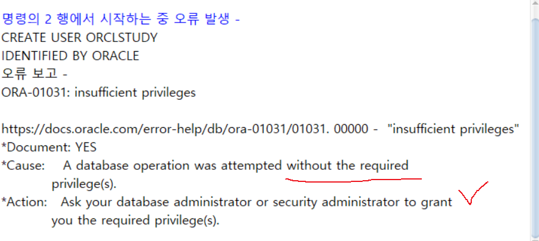

---
<!-- _class: aqua -->
<pre class="codeblock">
CREATE USER ORCLSTUDY
IDENTIFIED BY ORACLE;

</pre>

---
<!-- _class: aqua -->
##### Q002
-  SYSTEM계정으로  사용자 생성하시오.
-  성공!
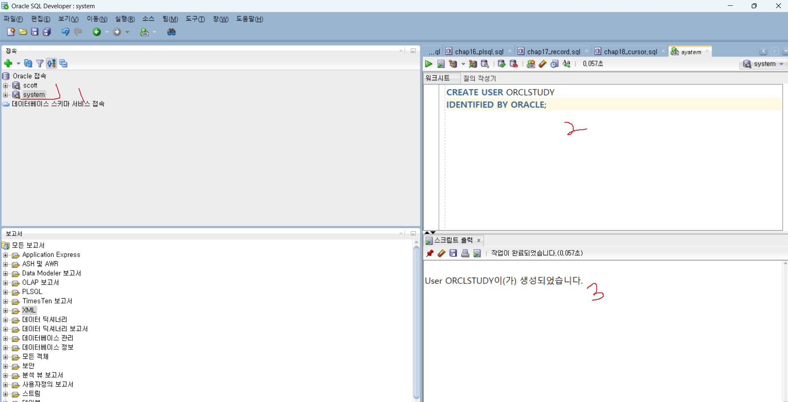

---
<!-- _class: aqua -->
<pre class="codeblock">
CREATE USER ORCLSTUDY
IDENTIFIED BY ORACLE;

</pre>

---
<!-- _class: aqua -->
##### Q003
-  SYSTEM계정으로  사용자 생성하시오.
-  ORCLSTUDY 사용자에게  접속권한 권한을 부여하시오.

---
<!-- _class: aqua -->
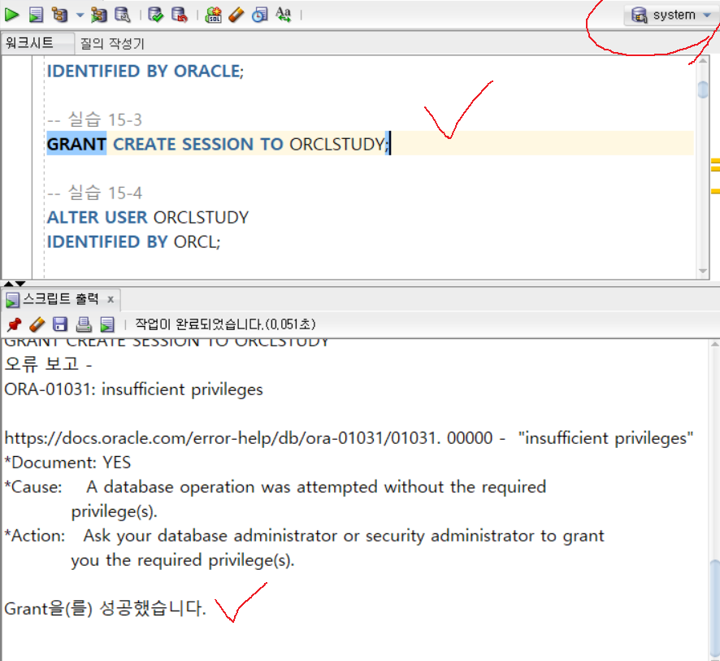

---
<!-- _class: aqua -->
<pre class="codeblock">
GRANT CREATE SESSION TO ORCLSTUDY;

</pre>

---
<!-- _class: aqua -->
##### Q004  
(SYSTEM계정)  ORCLSTUDY 사용자 정보(비번)을 변경하시오.

---
<!-- _class: aqua -->
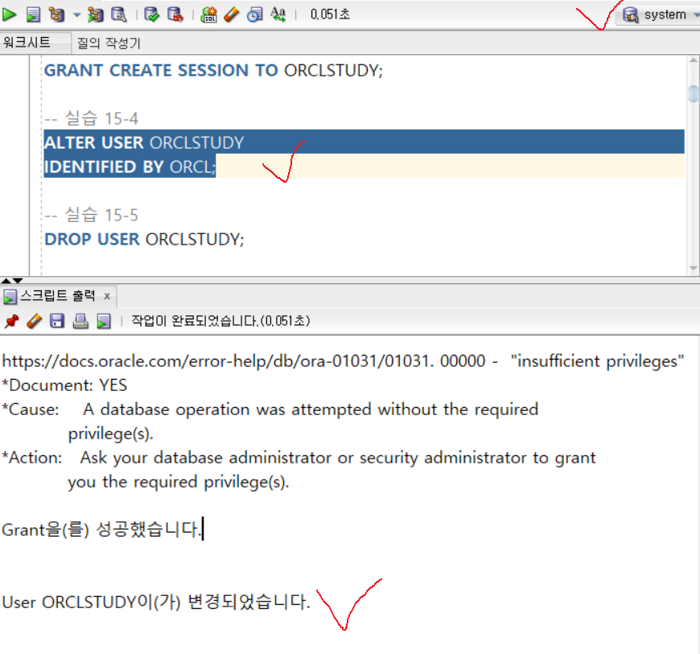

---
<!-- _class: aqua -->
<pre class="codeblock">
ALTER USER ORCLSTUDY
IDENTIFIED BY ORCL;

</pre>

---
<!-- _class: aqua -->
##### Q005  (SYSTEM계정)
- ORCLSTUDY 사용자를 삭제하시오.

---
<!-- _class: aqua -->
<pre class="codeblock">
DROP USER ORCLSTUDY;

</pre>

---
<!-- _class: aqua -->
##### Q006  (SYSTEM계정)
- ORCLSTUDY 사용자와 객체 모두를 삭제하시오.
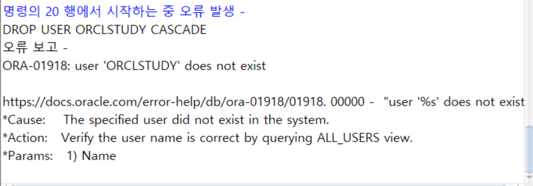

---
<!-- _class: aqua -->
<pre class="codeblock">
DROP USER ORCLSTUDY CASCADE;

</pre>

---
<!-- _class: aqua -->
##### Q007
- SYSTEM 계정으로 접속하여
- ORCLSTUDY 사용자, ORACLE 비밀번호로 생성하시오.
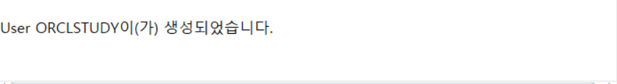

---
<!-- _class: aqua -->
<pre class="codeblock">
CREATE USER ORCLSTUDY
IDENTIFIED BY ORACLE;

</pre>

---
<!-- _class: aqua -->
##### Q008
- 사용자에게  RESOURCE(여러권한을 하나의 이름을 묶어 권한부여-공간사용가능능) ,  데이터베이스 접속권한과, 테이블 생성권한을 부여하시오.
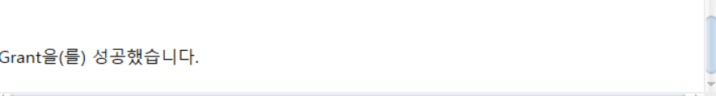

---
<!-- _class: aqua -->
<pre class="codeblock">
GRANT RESOURCE, CREATE SESSION, CREATE TABLE TO ORCLSTUDY;

</pre>

---
<!-- _class: aqua -->
##### Q009
- SCOTT 계정으로 접속하기
- TEMP 테이블을 다음과 같이 만든다.
- ORCLSTUDY 사용자에게 TEMP테이블 권한을 부여하시오.

---
<!-- _class: aqua -->
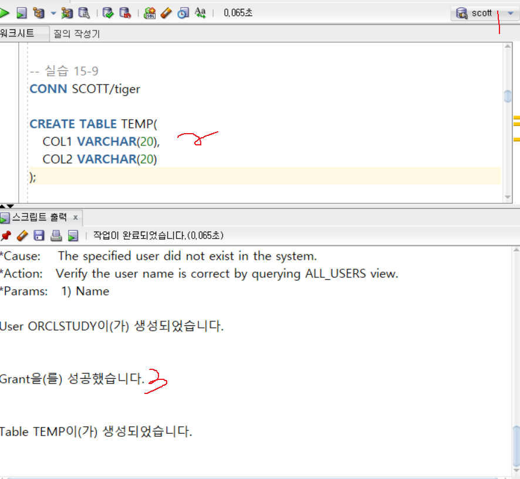

---
<!-- _class: aqua -->

---
<!-- _class: aqua -->
<pre class="codeblock">
CONN SCOTT/tiger

CREATE TABLE TEMP(
   COL1 VARCHAR(20),
   COL2 VARCHAR(20)
);

GRANT SELECT ON TEMP TO ORCLSTUDY;

GRANT INSERT ON TEMP TO ORCLSTUDY;

</pre>

---
<!-- _class: aqua -->
##### Q010
- ORCLSTUDY 유저에게 TEMP테이블의 여러권한(SELECT, INSERT) 을 한번에 부여하시오.
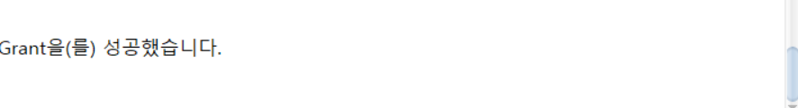

---
<!-- _class: aqua -->
<pre class="codeblock">
GRANT SELECT, INSERT ON TEMP
   TO ORCLSTUDY;

</pre>

---
<!-- _class: aqua -->
##### Q011
- ORCLSTUDY 로 부여받은 권한 사용하기
- INSERT, SELECT
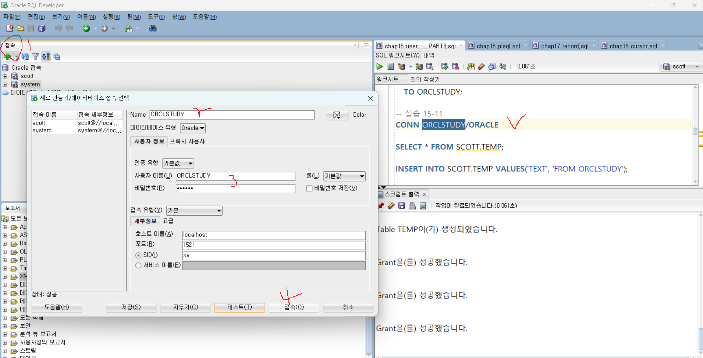

---
<!-- _class: aqua -->
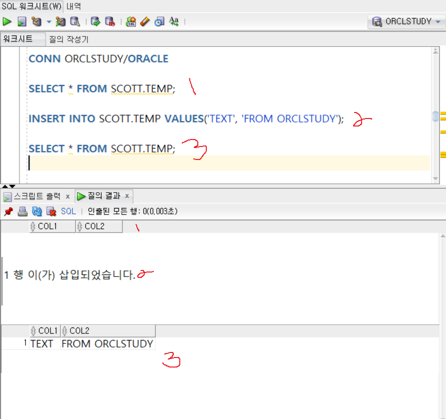

---
<!-- _class: aqua -->
<pre class="codeblock">
CONN ORCLSTUDY/ORACLE

SELECT * FROM SCOTT.TEMP;

INSERT INTO SCOTT.TEMP VALUES('TEXT', 'FROM ORCLSTUDY');

SELECT * FROM SCOTT.TEMP;

</pre>

---
<!-- _class: aqua -->
##### Q012
- ORCLSTUDY 에 부여된 TEMP 테이블 사용권한을 취소하시오.
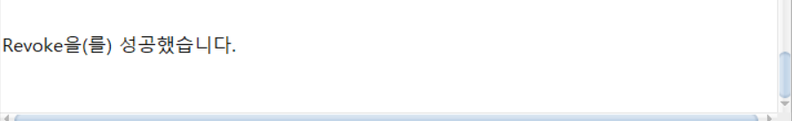

---
<!-- _class: aqua -->
<pre class="codeblock">
CONN SCOTT/tiger

REVOKE SELECT, INSERT ON TEMP FROM ORCLSTUDY;

</pre>

---
<!-- _class: aqua -->
##### Q013
- ORCLSTUDY 로 권한 철회된 TEMP 테이블을 조회하시오 (실패! )

---
<!-- _class: aqua -->
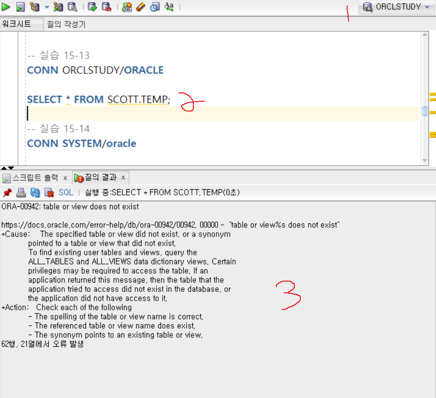

---
<!-- _class: aqua -->
<pre class="codeblock">
CONN ORCLSTUDY/ORACLE

SELECT * FROM SCOTT.TEMP;

</pre>

---
<!-- _class: aqua -->
##### Q014
- SYSTEM계정으로 ROLESTUDY 롤 생성 및 권한을 부여하시오.
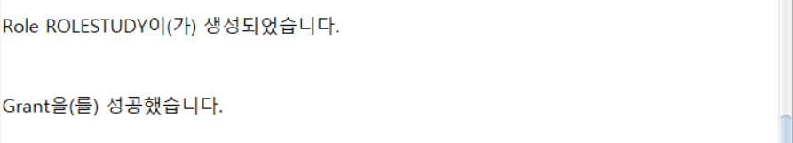

---
<!-- _class: aqua -->
<pre class="codeblock">
CONN SYSTEM/oracle

CREATE ROLE ROLESTUDY;

GRANT CONNECT, RESOURCE, CREATE VIEW, CREATE SYNONYM
   TO ROLESTUDY;

</pre>

---
<!-- _class: aqua -->
##### Q015
- ORCLSTUDY 사용자에게 RORSTUDY를 부여하시오.
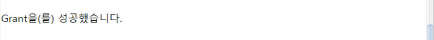

---
<!-- _class: aqua -->
<pre class="codeblock">
GRANT ROLESTUDY TO ORCLSTUDY;

</pre>

---
<!-- _class: aqua -->
##### Q016
- ORCLSTUDY 에 부여된 롤과 권한을 확인하시오.

---
<!-- _class: aqua -->
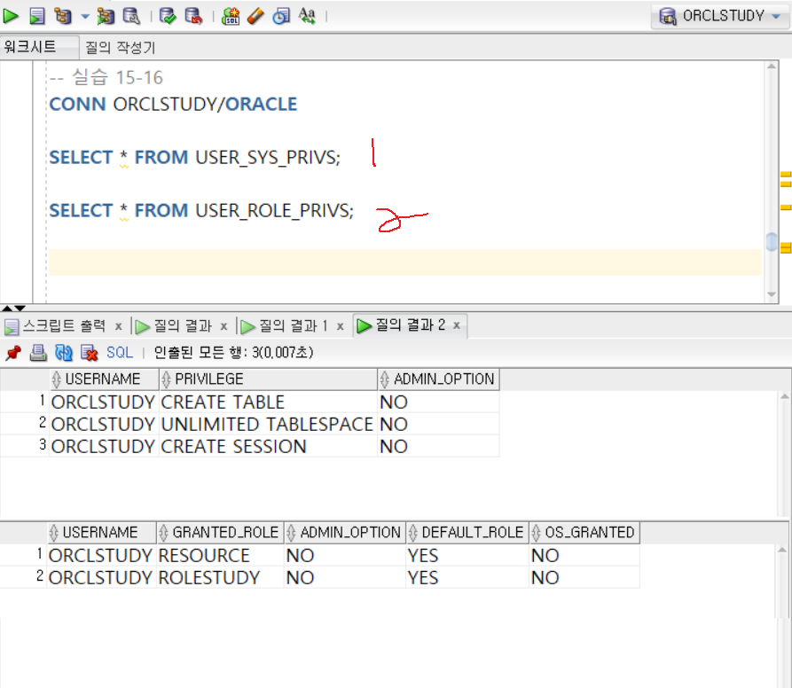

---
<!-- _class: aqua -->
<pre class="codeblock">
CONN ORCLSTUDY/ORACLE

SELECT * FROM USER_SYS_PRIVS;

SELECT * FROM USER_ROLE_PRIVS;
</pre>

---
<!-- _class: purple -->
# 사고확장EX

---
<!-- _class: aqua -->
##### EX001
- 다음 조건을 만족하는 SQL을 작성하시오.
1. SYSTEM 계정으로 접속하여 PREV_HW 계정을 생성하시오.
2. 비번 : ORCL로 지정
3. 접속권한을 부여하고 PREV_HW 계정으로 접속이 잘되는지 확인 하시오.

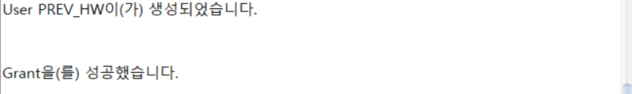

---
<!-- _class: aqua -->

<pre class="codeblock">
--①
CREATE USER PREV_HW
IDENTIFIED BY ORCL;

--②
GRANT CREATE SESSION TO PREV_HW;
</pre>

---
<!-- _class: aqua -->
##### EX002
- SCOTT 계정으로 접속하여 위에서 생성한 PREV_HW 계정에 SCOTT 소유의 EMP, DEPT, SALGRADE 테이블에 SELECT 권한을 부여하는 SQL을 작성하시오.
- 권한을 부여했으면 PREV_HW 계정으로 SCOTT의 EMP, DEPT, SALGRADE 테이블이 잘 조회되는지 확인하시오.

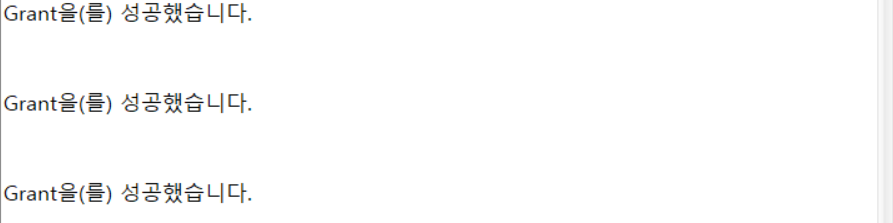

---
<!-- _class: aqua -->
<pre class="codeblock">
GRANT SELECT ON  SCOTT.EMP TO PREV_HW;

GRANT SELECT ON  SCOTT.DEPT TO PREV_HW;

GRANT SELECT ON  SCOTT.SALGRADE TO PREV_HW;
</pre>

---
<!-- _class: aqua -->
##### EX003
- SCOTT 계정으로 접속하여 PREV_HW 계정에 SALGRADE 테이블의 SELECT 권한을 취소하는 SQL문을 작성하시오.
- 권한의 변경이 완료되면 다음과 같이 PREV_HW 계정으로 SALGRADE 테이블의 조회여부를 확인하시오.

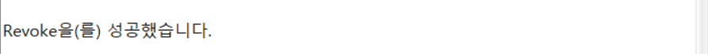

---
<!-- _class: aqua -->
<pre class="codeblock">
REVOKE SELECT ON SALGRADE FROM PREV_HW;
</pre>

---

<!-- _class: aqua -->

1. CREATE USER SALLY IDENTIFIED BY tiger 는 어떤 작업을 하나요?  
2. GRANT SELECT ON EMP TO SALLY 는 어떤 권한을 부여하나요?  
3. REVOKE INSERT ON EMP FROM SALLY 는 어떤 효과가 있나요?  
4. WITH GRANT OPTION 은 어떤 기능을 제공하나요?  
5. 역할(Role)을 사용하는 이유는 무엇인가요?

---

<!-- _class: red -->
# 🧪 Step 5: 기억 테스트

---

<!-- _class: aqua -->

- 시스템 권한과 객체 권한의 차이는 무엇인가요?  
- DROP USER ... CASCADE 는 어떤 의미인가요?  
- GRANT 와 REVOKE 는 각각 어떤 상황에서 사용되나요?  
- 역할(Role)을 활용하면 어떤 점이 편리한가요?  
- 사용자에게 직접 권한을 부여하는 것과 역할을 통해 부여하는 것의 차이는 무엇인가요?

---
<!-- _class: thanks -->
## 👋 열심히 들어주셔서 감사합니다!
 
> 오늘의 한 걸음이 **내일의 가능성**이 되길 바라며,