<!-- _class: cover-oracle -->
<h4 style="color:#6C757D;">
  🧠
  CodeCraft Series · Track 02
</h4>
<h1 style="color:#007BFF;">Oracle Fundamentals</h1>
<h3 style="color:#17A2B8;">SQL부터 PL/SQL까지, 오라클의 핵심을 잡다</h3>

<!-- 현재 챕터 강조 -->

  📍 <strong>현재 위치:</strong> Chapter 1 · <em>오라클 환경 설정 · 기본 SELECT</em>

<blockquote>
  실무에 바로 적용 가능한 오라클 입문서 
  데이터를 다루는 힘, SQL로 시작해요
</blockquote>

---
<!-- _class: cover-oracle -->
<h2 style="font-size:1.6em; color:#555;">📚 Oracle 트랙 목차</h2>
  <strong style="color:#FF6E7F;">PART 1 · SQL 기본</strong>

  ▶ Chapter 01: oracle_setting
  ▶ Chapter 02: select_basic
  ▶ Chapter 03: select_where
  ▶ Chapter 04: select_fn
  ▶ Chapter 05: select_group
  ▶ Chapter 06: select_join
  ▶ Chapter 07: select_subquery

---
<!-- _class: cover-oracle -->
<h2 style="font-size:1.6em; color:#555;">📚 Oracle 트랙 목차</h2>
 <strong style="color:#FF6E7F;">PART 2 · 데이터 조작 및 객체</strong> 

 
  ▶ Chapter 08: update_delete
  ▶ Chapter 09: transaction
  ▶ Chapter 10: ddl
  ▶ Chapter 11: object
  ▶ Chapter 12: constraint
  ▶ Chapter 13: user

---
<!-- _class: cover-oracle -->
<h2 style="font-size:1.6em; color:#555;">📚 Oracle 트랙 목차</h2>
<strong style="color:#FF6E7F;">PART 3 · PL/SQL 심화</strong>

  
  ✅▶ Chapter 14: plsql
  ▶ Chapter 15: record
  ▶ Chapter 16: cursor
  ▶ Chapter 17: save

  이 트랙은 오라클의 기본 SQL부터 객체 관리, PL/SQL까지  실무 중심으로 배우며, 데이터베이스 전문가로 성장합니다.

 

 
 
 

---

<!-- _class: orange -->
# 🧩 Step 1: 핵심 개념  
***PL/SQL 실습***  
→ ***블록 구조***, ***변수 선언***, ***조건문/반복문***, ***예외 처리***, ***커서 사용***

---

<!-- _class: aqua -->
### 📦 PL/SQL 블록 구조  
- DECLARE : 변수 선언  
- BEGIN : 실행문  
- EXCEPTION : 예외 처리  
- END : 블록 종료  
- 익명 블록 또는 저장 프로시저 형태로 사용 가능

---

<!-- _class: aqua -->
### 🧮 변수 선언  
- VARCHAR2, NUMBER, DATE 등 데이터 타입 사용  
- := 으로 초기값 지정 가능  
- 예: v_sal NUMBER := 3000;

---

<!-- _class: aqua -->
### 🔁 조건문과 반복문  
- 조건문: IF, ELSIF, ELSE, CASE  
- 반복문: LOOP, WHILE, FOR  
- 예: FOR i IN 1..10 LOOP ... END LOOP;

---

<!-- _class: aqua -->
### ⚠️ 예외 처리  
- EXCEPTION 절에서 오류 처리  
- WHEN OTHERS THEN 으로 일반 예외 처리 가능  
- 사용자 정의 예외도 선언 가능

---

<!-- _class: aqua -->
### 🔍 커서(Cursor)  
- SELECT 결과를 한 행씩 처리  
- OPEN, FETCH, CLOSE 사용  
- 명시적 커서와 커서 FOR LOOP 지원

---

<!-- _class: blue -->
# 🧪 Step 2: 코드 예제

---

<!-- _class: aqua -->

<pre class="codeblock">
-- 기본 PL/SQL 블록
DECLARE
  v_sal NUMBER := 3000;
BEGIN
  v_sal := v_sal * 1.1;
  DBMS_OUTPUT.PUT_LINE('급여: ' || v_sal);
END;

-- 조건문
DECLARE
  v_job VARCHAR2(10) := 'MANAGER';
BEGIN
  IF v_job = 'MANAGER' THEN
    DBMS_OUTPUT.PUT_LINE('관리자입니다');
  ELSE
    DBMS_OUTPUT.PUT_LINE('일반 사원입니다');
  END IF;
END;

-- 반복문
BEGIN
  FOR i IN 1..5 LOOP
    DBMS_OUTPUT.PUT_LINE('반복: ' || i);
  END LOOP;
END;

-- 예외 처리
BEGIN
  UPDATE EMP SET SAL = SAL + 100 WHERE DEPTNO = 99;
EXCEPTION
  WHEN OTHERS THEN
    DBMS_OUTPUT.PUT_LINE('오류 발생: ' || SQLERRM);
END;

-- 커서 사용
DECLARE
  CURSOR emp_cur IS SELECT ENAME, SAL FROM EMP;
  v_ename EMP.ENAME%TYPE;
  v_sal EMP.SAL%TYPE;
BEGIN
  OPEN emp_cur;
  LOOP
    FETCH emp_cur INTO v_ename, v_sal;
    EXIT WHEN emp_cur%NOTFOUND;
    DBMS_OUTPUT.PUT_LINE(v_ename || ': ' || v_sal);
  END LOOP;
  CLOSE emp_cur;
END;
</pre>

---

<!-- _class: aqua -->

## ✅ PL/SQL 요약표

| 항목 | 설명 |
|------|------|
| DECLARE | 변수 선언 |
| BEGIN ... END | 실행 블록 |
| IF, LOOP, FOR | 제어문 |
| EXCEPTION | 예외 처리 |
| CURSOR | 행 단위 처리 |

---

<!-- _class: green -->
# 🧪 Step 3: 연습문제

 

---
<!-- _class: aqua -->
##### Q001
- 다음과 같이 heLLO PL/SQL을 출력하시오.

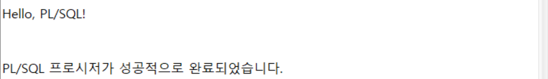

---
<!-- _class: aqua -->
<pre class="codeblock">
SET SERVEROUTPUT ON; -- 실행 결과를 화면에 출력

BEGIN
   DBMS_OUTPUT.PUT_LINE('Hello, PL/SQL!');
END;
/

</pre>

---
<!-- _class: aqua -->
##### Q002
1. 다음과 같이 두변수를 선언하시오.
    V_EMPNO NUMBER(4)
    V_ENAME VARCHAR2(10)
2. V_EMPNO 에  기본값 7788 대입
   V_ENAME 에  SCOTT 대입
3. 두 변수를 출력하시오.
4. V_EMPNO 출력을 한줄주석다시오.

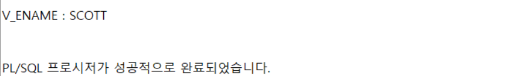

---
<!-- _class: aqua -->
<pre class="codeblock">
DECLARE
   V_EMPNO NUMBER(4) := 7788;
   V_ENAME VARCHAR2(10);
BEGIN
   V_ENAME := 'SCOTT';
   -- DBMS_OUTPUT.PUT_LINE('V_EMPNO : ' || V_EMPNO);
   DBMS_OUTPUT.PUT_LINE('V_ENAME : ' || V_ENAME);
END;
/

</pre>

---
<!-- _class: aqua -->
##### Q003
여러줄 주석  /* */ 을 이용하여 출력을 주석처리하시오.

---
<!-- _class: aqua -->
<pre class="codeblock">
DECLARE
   V_EMPNO NUMBER(4) := 7788;
   V_ENAME VARCHAR2(10);
BEGIN
   V_ENAME := 'SCOTT';
/*
   DBMS_OUTPUT.PUT_LINE('V_EMPNO : ' || V_EMPNO);
   DBMS_OUTPUT.PUT_LINE('V_ENAME : ' || V_ENAME);
*/
END;
/

</pre>

---
<!-- _class: aqua -->
##### Q004
- 변수 선언 및 변수 값을 출력하시오.
1. 다음과 같이 두변수를 선언하시오.
    V_EMPNO NUMBER(4)
    V_ENAME VARCHAR2(10)
2. V_EMPNO 에  기본값 7788 대입
   V_ENAME 에  SCOTT 대입
3. 두 변수를 출력하시오.

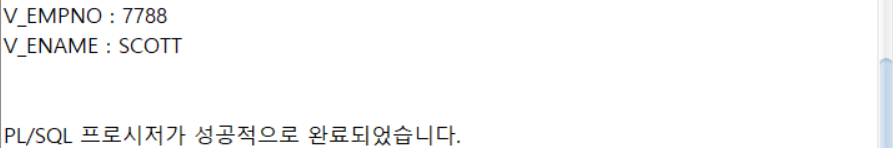

---
<!-- _class: aqua -->
<pre class="codeblock">
DECLARE
   V_EMPNO NUMBER(4) := 7788;
   V_ENAME VARCHAR2(10);
BEGIN
   V_ENAME := 'SCOTT';
   DBMS_OUTPUT.PUT_LINE('V_EMPNO : ' || V_EMPNO);
   DBMS_OUTPUT.PUT_LINE('V_ENAME : ' || V_ENAME);
END;
/

</pre>

---
<!-- _class: aqua -->
##### Q005
1. CONSTANT 를 이용하여 상수  V_TAX 를 만들고 3을 대입하시오.
2. 상수를 출력하시오.

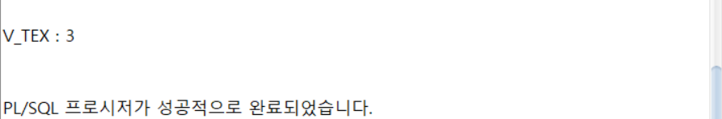

---
<!-- _class: aqua -->
<pre class="codeblock">
DECLARE
   V_TAX CONSTANT NUMBER(1) := 3;
BEGIN
   DBMS_OUTPUT.PUT_LINE('V_TEX : ' || V_TAX);
END;
/

</pre>

---
<!-- _class: aqua -->
##### Q006
1. 변수 V_DEPTNO 를  생성시 DEFAULT값 10을 설정하시오.
2. 변수를 출력하시오.

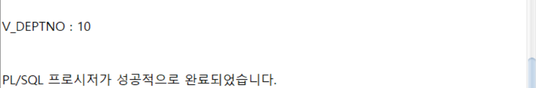

---
<!-- _class: aqua -->
<pre class="codeblock">
DECLARE
   V_DEPTNO NUMBER(2) DEFAULT 10;
BEGIN
   DBMS_OUTPUT.PUT_LINE('V_DEPTNO : ' || V_DEPTNO);
END;
/

</pre>

---
<!-- _class: aqua -->
##### Q007
1. 변수 V_DEPTNO 를  생성시  NOT NULL을 설정, 10 대입 하시오.
2. 변수를 출력하시오.

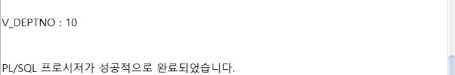

---
<!-- _class: aqua -->
<pre class="codeblock">
DECLARE
   V_DEPTNO NUMBER(2) NOT NULL := 10;
BEGIN
   DBMS_OUTPUT.PUT_LINE('V_DEPTNO : ' || V_DEPTNO);
END;
/

</pre>

---
<!-- _class: aqua -->
##### Q008
1. 변수 V_DEPTNO 를  생성시
   NOT NULL을 설정, 기본값 10 대입 하시오.
2. 변수를 출력하시오.

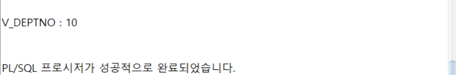

---
<!-- _class: aqua -->
<pre class="codeblock">
DECLARE
   V_DEPTNO NUMBER(2) NOT NULL DEFAULT 10;
BEGIN
   DBMS_OUTPUT.PUT_LINE('V_DEPTNO : ' || V_DEPTNO);
END;
/

</pre>

---
<!-- _class: aqua -->
##### Q009
- 참조열형 변수  (DEPT 테이블의 DEPTNO) 에 값 50을 대입후 출력하시오.
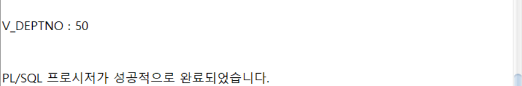

---
<!-- _class: aqua -->
<pre class="codeblock">
DECLARE
   V_DEPTNO DEPT.DEPTNO%TYPE := 50;
BEGIN
   DBMS_OUTPUT.PUT_LINE('V_DEPTNO : ' || V_DEPTNO);
END;
/

</pre>

---
<!-- _class: aqua -->
##### Q010
1. 참조형(행)의 변수  V_DEPT_ROW 를 선언하시오.
2. SELECT DEPTNO, DNAME, LOC
     FROM DEPT
    WHERE DEPTNO = 40;
   구문을 실행한 후 1번 변수에 값을 대입하시오.
3. 다음과 같이 출력하시오.

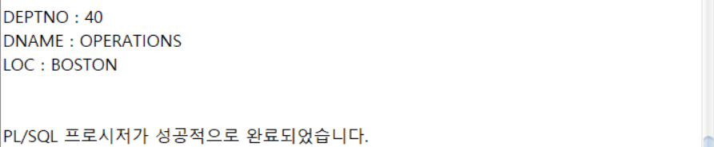

---
<!-- _class: aqua -->
<pre class="codeblock">
DECLARE
   V_DEPT_ROW DEPT%ROWTYPE;
BEGIN
   SELECT DEPTNO, DNAME, LOC INTO V_DEPT_ROW
     FROM DEPT
    WHERE DEPTNO = 40;
   DBMS_OUTPUT.PUT_LINE('DEPTNO : ' || V_DEPT_ROW.DEPTNO);
   DBMS_OUTPUT.PUT_LINE('DNAME : ' || V_DEPT_ROW.DNAME);
   DBMS_OUTPUT.PUT_LINE('LOC : ' || V_DEPT_ROW.LOC);
END;
/

</pre>

---
<!-- _class: aqua -->
##### Q011
1. V_NUMBER 변수 생성 및 13값을 대입하시오.
2. 변수에 입력한 값이 홀수 인지 알아보는 조건 제어문을 추가하시오.
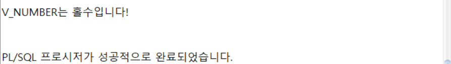

---
<!-- _class: aqua -->
<pre class="codeblock">
DECLARE
   V_NUMBER NUMBER := 13;
BEGIN
   IF MOD(V_NUMBER, 2) = 1 THEN
      DBMS_OUTPUT.PUT_LINE('V_NUMBER는 홀수입니다!');
   END IF;
END;
/

</pre>

---
<!-- _class: aqua -->
##### Q012
1. V_NUMBER 변수 생성 및 14값을 대입하시오.
2. 변수에 입력한 값이 짝수인지 알아보는 조건 제어문을 추가하시오.
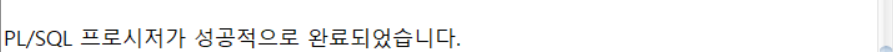

---
<!-- _class: aqua -->
<pre class="codeblock">
DECLARE
   V_NUMBER NUMBER := 14;
BEGIN
   IF MOD(V_NUMBER, 2) = 1 THEN
      DBMS_OUTPUT.PUT_LINE('V_NUMBER는 홀수입니다!');
   END IF;
END;
/

</pre>

---
<!-- _class: aqua -->
##### Q013
1. V_NUMBER 변수 생성 및 14값을 대입하시오.
2. 변수에 입력한 값이 짝수인지 홀수인지 알아보는 조건 제어문을 추가하시오.
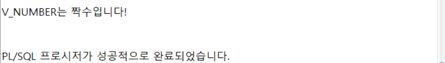

---
<!-- _class: aqua -->
<pre class="codeblock">
DECLARE
   V_NUMBER NUMBER := 14;
BEGIN
   IF MOD(V_NUMBER, 2) = 1 THEN
      DBMS_OUTPUT.PUT_LINE('V_NUMBER는 홀수입니다!');
   ELSE
      DBMS_OUTPUT.PUT_LINE('V_NUMBER는 짝수입니다!');
   END IF;
END;
/

</pre>

---
<!-- _class: aqua -->
##### Q014
1. V_SCORE 변수 생성 및 87값을 대입하시오.
2. IF THEN ELSEIF 를 이용하여
입력한 점수가 어느학점인지 출력하시오.
90점이상 - A학점
80점이상 - B학점
70점이상 - C학점
60점이상 - D학점
        - F학점

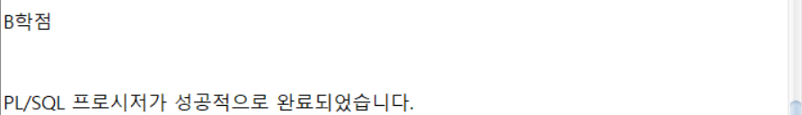

---
<!-- _class: aqua -->
<pre class="codeblock">
DECLARE
   V_SCORE NUMBER := 87;
BEGIN
   IF V_SCORE >= 90 THEN
      DBMS_OUTPUT.PUT_LINE('A학점');
   ELSIF V_SCORE >= 80 THEN
      DBMS_OUTPUT.PUT_LINE('B학점');
   ELSIF V_SCORE >= 70 THEN
      DBMS_OUTPUT.PUT_LINE('C학점');
   ELSIF V_SCORE >= 60 THEN
      DBMS_OUTPUT.PUT_LINE('D학점');
   ELSE
      DBMS_OUTPUT.PUT_LINE('F학점');
   END IF;
END;
/

</pre>

---
<!-- _class: aqua -->
##### Q015
1. V_SCORE 변수 생성 및 87값을 대입하시오.
2.  CASE 를 이용하여
입력한 점수가 어느학점인지 출력하시오.
90점이상 - A학점
80점이상 - B학점
70점이상 - C학점
60점이상 - D학점
        - F학점
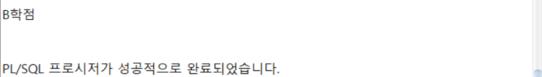

---
<!-- _class: aqua -->
<pre class="codeblock">
DECLARE
   V_SCORE NUMBER := 87;
BEGIN
   CASE TRUNC(V_SCORE/10)
      WHEN 10 THEN DBMS_OUTPUT.PUT_LINE('A학점');
      WHEN 9 THEN DBMS_OUTPUT.PUT_LINE('A학점');
      WHEN 8 THEN DBMS_OUTPUT.PUT_LINE('B학점');
      WHEN 7 THEN DBMS_OUTPUT.PUT_LINE('C학점');
      WHEN 6 THEN DBMS_OUTPUT.PUT_LINE('D학점');
      ELSE DBMS_OUTPUT.PUT_LINE('F학점');
   END CASE;
END;
/

</pre>

---
<!-- _class: aqua -->
##### Q016
1. V_SCORE 변수 생성 및 87값을 대입하시오.
2.  검색CASE 를 이용하여
입력한 점수가 어느학점인지 출력하시오.
90점이상 - A학점
80점이상 - B학점
70점이상 - C학점
60점이상 - D학점
        - F학점
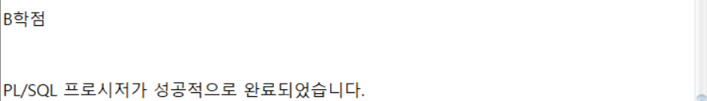

---
<!-- _class: aqua -->
<pre class="codeblock">
DECLARE
   V_SCORE NUMBER := 87;
BEGIN
   CASE
      WHEN V_SCORE >= 90 THEN DBMS_OUTPUT.PUT_LINE('A학점');
      WHEN V_SCORE >= 80 THEN DBMS_OUTPUT.PUT_LINE('B학점');
      WHEN V_SCORE >= 70 THEN DBMS_OUTPUT.PUT_LINE('C학점');
      WHEN V_SCORE >= 60 THEN DBMS_OUTPUT.PUT_LINE('D학점');
      ELSE DBMS_OUTPUT.PUT_LINE('F학점');
   END CASE;
END;
/

</pre>

---
<!-- _class: aqua -->
##### Q017
- 0~4까지 다음과 같이 출력하는 기본 LOOP를 사용하시오.
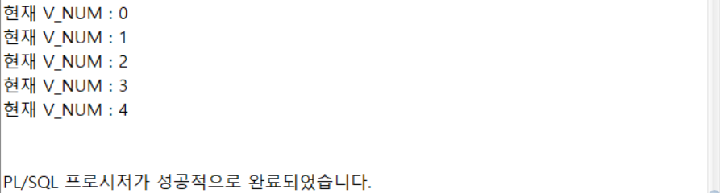

---
<!-- _class: aqua -->
<pre class="codeblock">
DECLARE
   V_NUM NUMBER := 0;
BEGIN
   LOOP
      DBMS_OUTPUT.PUT_LINE('현재 V_NUM : ' || V_NUM);
      V_NUM := V_NUM + 1;
      EXIT WHEN V_NUM > 4;
   END LOOP;
END;
/

</pre>

---
<!-- _class: aqua -->
##### Q018
- 0~4까지 다음과 같이 출력하는 WHILE LOOP를 사용하시오.

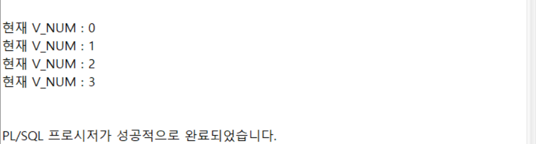

---
<!-- _class: aqua -->
<pre class="codeblock">
DECLARE
   V_NUM NUMBER := 0;
BEGIN
   WHILE V_NUM < 5 LOOP
      DBMS_OUTPUT.PUT_LINE('현재 V_NUM : ' || V_NUM);
      V_NUM := V_NUM + 1;
   END LOOP;
END;
/

</pre>

---
<!-- _class: aqua -->
##### Q019
- FOR IN LOOG를 이용하여 0~4까지 출력하시오.
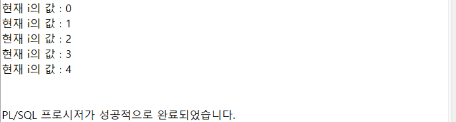

---
<!-- _class: aqua -->
<pre class="codeblock">
BEGIN
   FOR i IN 0..4 LOOP
      DBMS_OUTPUT.PUT_LINE('현재 i의 값 : ' || i);
   END LOOP;
END;
/

</pre>

---
<!-- _class: aqua -->
##### Q020
- FOR IN LOOG를 이용하여 4~0까지 출력하시오.
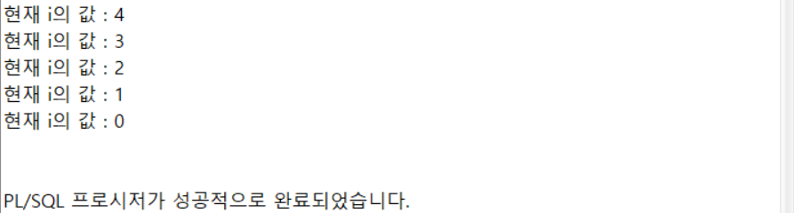

---
<!-- _class: aqua -->
<pre class="codeblock">
BEGIN
   FOR i IN REVERSE 0..4 LOOP
      DBMS_OUTPUT.PUT_LINE('현재 i의 값 : ' || i);
      END LOOP;
END;
/

</pre>

---
<!-- _class: aqua -->
##### Q021
- FOR IN LOOG안에 CONTINUE를 이용하여 0,2,4를 다음과 같이 출력하시오.
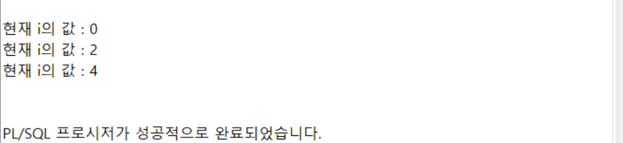

---
<!-- _class: aqua -->
<pre class="codeblock">
BEGIN
   FOR i IN 0..4 LOOP
      CONTINUE WHEN MOD(i, 2) = 1;
      DBMS_OUTPUT.PUT_LINE('현재 i의 값 : ' || i);
   END LOOP;
END;
/
</pre>

---
<!-- _class: purple -->
# 사고확장EX

---
<!-- _class: aqua -->
##### EX001
- 숫자 1~10까지 숫자 중 홀수만 출력하는 PL/SQL 프로그램을 작성하시오.

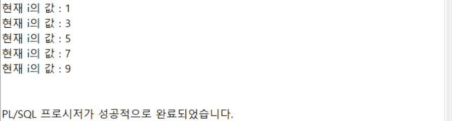

 

---
<!-- _class: aqua -->
##### EX002
1.  DEPT 테이블의 DEPTNO와 자료형이 같은변수 V_DEPTNO를 선언하시오.
2. V_DEPTNO 변수값에 10,20,30,40을 대입했을때 다음과 같이 부서이름을 출력하는 프로그램을 작성하시오.
3. 부서번호가 10,20,30,40 이 아니라면 N/A로 출력합니다.

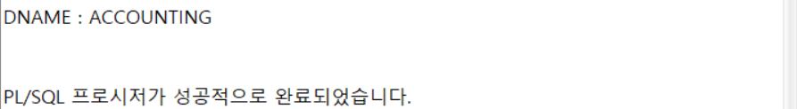

 

---

<!-- _class: aqua -->

1. DECLARE 절에서는 어떤 작업을 하나요?  
2. IF ... THEN ... ELSE 문은 어떤 상황에서 사용되나요?  
3. FOR i IN 1..5 LOOP 은 어떤 반복을 수행하나요?  
4. EXCEPTION WHEN OTHERS THEN 은 어떤 역할을 하나요?  
5. 커서를 사용하는 이유는 무엇인가요?

---

<!-- _class: red -->
# 🧪 Step 5: 기억 테스트

---

<!-- _class: aqua -->

- PL/SQL 블록의 기본 구조는 어떻게 되나요?  
- 변수 선언 시 초기값을 지정하는 방법은?  
- WHILE 반복문과 FOR 반복문의 차이는 무엇인가요?  
- 예외 처리에서 SQLERRM 은 어떤 정보를 제공하나요?  
- 커서의 OPEN, FETCH, CLOSE 는 각각 어떤 역할을 하나요?

---
<!-- _class: thanks -->
## 👋 열심히 들어주셔서 감사합니다!
 
> 오늘의 한 걸음이 **내일의 가능성**이 되길 바라며,