<!-- _class: cover-oracle -->
<h4 style="color:#6C757D;">
  🧠
  CodeCraft Series · Track 02
</h4>
<h1 style="color:#007BFF;">Oracle Fundamentals</h1>
<h3 style="color:#17A2B8;">SQL부터 PL/SQL까지, 오라클의 핵심을 잡다</h3>

<!-- 현재 챕터 강조 -->

  📍 <strong>현재 위치:</strong> Chapter 1 · <em>오라클 환경 설정 · 기본 SELECT</em>

<blockquote>
  실무에 바로 적용 가능한 오라클 입문서 
  데이터를 다루는 힘, SQL로 시작해요
</blockquote>

---
<!-- _class: cover-oracle -->
<h2 style="font-size:1.6em; color:#555;">📚 Oracle 트랙 목차</h2>
  <strong style="color:#FF6E7F;">PART 1 · SQL 기본</strong>

  ▶ Chapter 01: oracle_setting
  ▶ Chapter 02: select_basic
  ▶ Chapter 03: select_where
  ▶ Chapter 04: select_fn
  ▶ Chapter 05: select_group
  ▶ Chapter 06: select_join
  ▶ Chapter 07: select_subquery

---
<!-- _class: cover-oracle -->
<h2 style="font-size:1.6em; color:#555;">📚 Oracle 트랙 목차</h2>
 <strong style="color:#FF6E7F;">PART 2 · 데이터 조작 및 객체</strong> 

 
  ▶ Chapter 08: update_delete
  ▶ Chapter 09: transaction
  ▶ Chapter 10: ddl
  ▶ Chapter 11: object
  ▶ Chapter 12: constraint
  ▶ Chapter 13: user

---
<!-- _class: cover-oracle -->
<h2 style="font-size:1.6em; color:#555;">📚 Oracle 트랙 목차</h2>
<strong style="color:#FF6E7F;">PART 3 · PL/SQL 심화</strong>

  
  ▶ Chapter 14: plsql
  ✅▶ Chapter 15: record
  ▶ Chapter 16: cursor
  ▶ Chapter 17: save

  이 트랙은 오라클의 기본 SQL부터 객체 관리, PL/SQL까지  실무 중심으로 배우며, 데이터베이스 전문가로 성장합니다.

 

 

---

<!-- _class: orange -->
# 🧩 Step 1: 핵심 개념  
***PL/SQL 레코드 실습***  
→ ***레코드 타입 선언***, ***필드 접근***, ***%ROWTYPE 사용***, ***레코드와 커서 연동***

---

<!-- _class: aqua -->
### 🧾 레코드란?  
- 여러 필드를 하나의 변수로 묶은 복합 데이터 타입  
- 테이블 구조와 유사한 형태  
- 각 필드는 개별 접근 가능  
- 사용자 정의 타입 또는 %ROWTYPE 사용 가능

---

<!-- _class: aqua -->
### 🧱 사용자 정의 레코드 타입  
- TYPE으로 구조 정의 후 RECORD 변수 선언  
- 예:  
  <pre class="codeblock">
  TYPE emp_rec_type IS RECORD (
    ename EMP.ENAME%TYPE,
    sal EMP.SAL%TYPE
  );
  emp_rec emp_rec_type;
  </pre>

---

<!-- _class: aqua -->
### 📦 %ROWTYPE  
- 테이블 또는 커서의 전체 행 구조를 그대로 사용  
- 모든 컬럼을 포함한 레코드 자동 생성  
- 예: emp_rec EMP%ROWTYPE;

---

<!-- _class: aqua -->
### 🔍 필드 접근  
- 점(.) 연산자로 필드 접근  
- 예: emp_rec.ename := 'SALLY';

---

<!-- _class: aqua -->
### 🔁 커서와 레코드  
- 커서 결과를 레코드에 저장 가능  
- FETCH INTO record_var 형태로 사용  
- 커서 FOR LOOP에서도 자동 레코드 생성

---

<!-- _class: blue -->
# 🧪 Step 2: 코드 예제

---

<!-- _class: aqua -->

<pre class="codeblock">
-- 사용자 정의 레코드 타입 선언 및 사용
DECLARE
  TYPE emp_rec_type IS RECORD (
    ename EMP.ENAME%TYPE,
    sal EMP.SAL%TYPE
  );
  emp_rec emp_rec_type;
BEGIN
  SELECT ENAME, SAL INTO emp_rec
    FROM EMP
   WHERE EMPNO = 7788;
  DBMS_OUTPUT.PUT_LINE(emp_rec.ename || ': ' || emp_rec.sal);
END;

-- %ROWTYPE 사용
DECLARE
  emp_row EMP%ROWTYPE;
BEGIN
  SELECT * INTO emp_row
    FROM EMP
   WHERE EMPNO = 7788;
  DBMS_OUTPUT.PUT_LINE(emp_row.ENAME || ': ' || emp_row.SAL);
END;

-- 커서와 레코드
DECLARE
  CURSOR emp_cur IS SELECT * FROM EMP;
  emp_rec EMP%ROWTYPE;
BEGIN
  OPEN emp_cur;
  LOOP
    FETCH emp_cur INTO emp_rec;
    EXIT WHEN emp_cur%NOTFOUND;
    DBMS_OUTPUT.PUT_LINE(emp_rec.ENAME || ': ' || emp_rec.SAL);
  END LOOP;
  CLOSE emp_cur;
END;

-- 커서 FOR LOOP와 레코드
BEGIN
  FOR emp_rec IN (SELECT ENAME, SAL FROM EMP) LOOP
    DBMS_OUTPUT.PUT_LINE(emp_rec.ENAME || ': ' || emp_rec.SAL);
  END LOOP;
END;
</pre>

---

<!-- _class: aqua -->

## ✅ 레코드 요약표

| 항목 | 설명 |
|------|------|
| RECORD | 복합 데이터 타입 |
| TYPE ... IS RECORD | 사용자 정의 레코드 |
| %ROWTYPE | 테이블 구조 기반 레코드 |
| record.field | 필드 접근 방식 |
| FETCH INTO | 커서 결과 저장 |

---

<!-- _class: green -->
# 🧪 Step 3: 연습문제

 

---
<!-- _class: aqua -->
##### Q001
- 다음과 같이 레코드를 정의하시오.
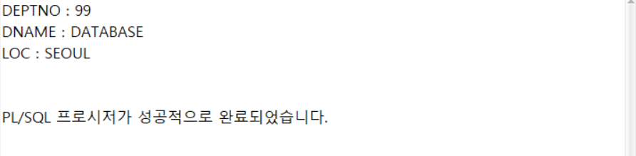

---
<!-- _class: aqua -->
<pre class="codeblock">
DECLARE
   TYPE REC_DEPT IS RECORD(
      deptno NUMBER(2) NOT NULL := 99,
      dname DEPT.DNAME%TYPE,
      loc DEPT.LOC%TYPE
   );
   dept_rec REC_DEPT;
BEGIN
   dept_rec.deptno := 99;
   dept_rec.dname := 'DATABASE';
   dept_rec.loc := 'SEOUL';
   DBMS_OUTPUT.PUT_LINE('DEPTNO : ' || dept_rec.deptno);
   DBMS_OUTPUT.PUT_LINE('DNAME : ' || dept_rec.dname);
   DBMS_OUTPUT.PUT_LINE('LOC : ' || dept_rec.loc);
END;
/

</pre>

---
<!-- _class: aqua -->
##### Q002
- 다음과 같이 DEPT테이블을 열과 행을 복사해 DEPT_RECORD테이블을 생성하시오.
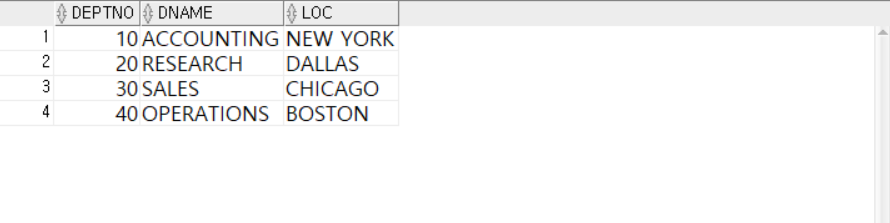

---
<!-- _class: aqua -->
<pre class="codeblock">
CREATE TABLE DEPT_RECORD
    AS SELECT * FROM DEPT;

SELECT * FROM DEPT_RECORD;

</pre>

---
<!-- _class: aqua -->
##### Q003  다음과 같이 REC_DEPT 레코드를 작성하시오.
1. dept_rec 레코드에
   deptno=99, dname=DATABASE , loc=SEOUL 값을 대입하시오.
2. DEPT_RECORD 테이블에  dept_rec 데이터를 삽입하시오.
   INSERT INTO DEPT_RECORD
   VALUES dept_rec;

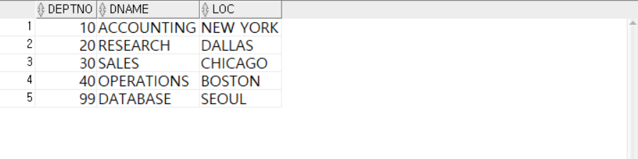

---
<!-- _class: aqua -->
<pre class="codeblock">
DECLARE
   TYPE REC_DEPT IS RECORD(
      deptno NUMBER(2) NOT NULL := 99,
      dname DEPT.DNAME%TYPE,
      loc DEPT.LOC%TYPE
   );
   dept_rec REC_DEPT;
BEGIN
   dept_rec.deptno := 99;
   dept_rec.dname := 'DATABASE';
   dept_rec.loc := 'SEOUL';

   INSERT INTO DEPT_RECORD
   VALUES dept_rec;
END;
/

SELECT * FROM DEPT_RECORD;

</pre>

---
<!-- _class: aqua -->
##### Q004  다음과 같이 REC_DEPT 레코드를 작성하시오.

1. dept_rec 레코드에
   deptno=50, dname=DB , loc=SEOUL 값을 대입하시오.
2. DEPT_RECORD 테이블에  DEPTNO=99인 데이터의  dept_rec 데이터를 수정하시오.
   UPDATE DEPT_RECORD
   SET ROW = dept_rec
   WHERE DEPTNO = 99;

---
<!-- _class: aqua -->
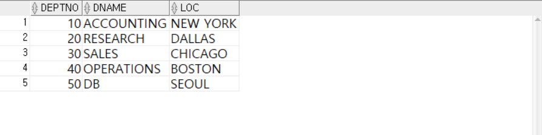

---
<!-- _class: aqua -->
<pre class="codeblock">
DECLARE
   TYPE REC_DEPT IS RECORD(
      deptno NUMBER(2) NOT NULL := 99,
      dname DEPT.DNAME%TYPE,
      loc DEPT.LOC%TYPE
   );
   dept_rec REC_DEPT;
BEGIN
   dept_rec.deptno := 50;
   dept_rec.dname := 'DB';
   dept_rec.loc := 'SEOUL';

   UPDATE DEPT_RECORD
      SET ROW = dept_rec
    WHERE DEPTNO = 99;
END;
/

SELECT * FROM DEPT_RECORD;

</pre>

---
<!-- _class: aqua -->
##### Q005  레코드에 다른 레코드를 포함하시오.
1. REC_DEPT , REC_EMP  레코드를 작성하시오.
2. EMP, DEPT 테이블을 JOIN 하여
   EMPNO가 7788이고
   EMP, DEPT테이블의 DEPTNO 가 같은 데이터를 검색하시오.
3. 다음과 같이 출력하시오.

---
<!-- _class: aqua -->
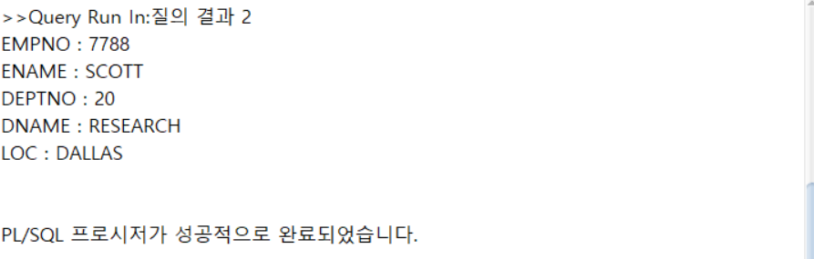

---
<!-- _class: aqua -->
<pre class="codeblock">
DECLARE
   TYPE REC_DEPT IS RECORD(
      deptno DEPT.DEPTNO%TYPE,
      dname DEPT.DNAME%TYPE,
      loc DEPT.LOC%TYPE
   );
   TYPE REC_EMP IS RECORD(
      empno EMP.EMPNO%TYPE,
      ename EMP.ENAME%TYPE,
      dinfo REC_DEPT
   );
   emp_rec REC_EMP;
BEGIN
   SELECT E.EMPNO, E.ENAME, D.DEPTNO, D.DNAME, D.LOC
     INTO emp_rec.empno, emp_rec.ename,
          emp_rec.dinfo.deptno,
          emp_rec.dinfo.dname,
          emp_rec.dinfo.loc
     FROM EMP E, DEPT D
    WHERE E.DEPTNO = D.DEPTNO
      AND E.EMPNO = 7788;

   DBMS_OUTPUT.PUT_LINE('EMPNO : ' || emp_rec.empno);
   DBMS_OUTPUT.PUT_LINE('ENAME : ' || emp_rec.ename);
   DBMS_OUTPUT.PUT_LINE('DEPTNO : ' || emp_rec.dinfo.deptno);
   DBMS_OUTPUT.PUT_LINE('DNAME : ' || emp_rec.dinfo.dname);
   DBMS_OUTPUT.PUT_LINE('LOC : ' || emp_rec.dinfo.loc);
END;
/

</pre>

---
<!-- _class: aqua -->
##### Q006  연관배열을 이용하여 다음과 같이 출력하시오.
-  TYPE ITAB_EX , 자료형 VARCHAR2(20) , 인덱스형  PLS_INTEGER

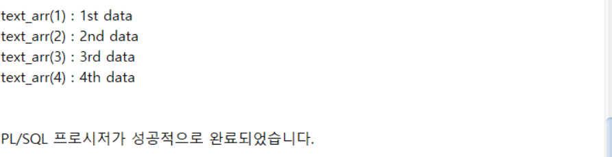

---
<!-- _class: aqua -->
<pre class="codeblock">
DECLARE
   TYPE ITAB_EX IS TABLE OF VARCHAR2(20)
      INDEX BY PLS_INTEGER;

   text_arr ITAB_EX;

BEGIN
   text_arr(1) := '1st data';
   text_arr(2) := '2nd data';
   text_arr(3) := '3rd data';
   text_arr(4) := '4th data';

   DBMS_OUTPUT.PUT_LINE('text_arr(1) : ' || text_arr(1));
   DBMS_OUTPUT.PUT_LINE('text_arr(2) : ' || text_arr(2));
   DBMS_OUTPUT.PUT_LINE('text_arr(3) : ' || text_arr(3));
   DBMS_OUTPUT.PUT_LINE('text_arr(4) : ' || text_arr(4));
END;
/

</pre>

---
<!-- _class: aqua -->
##### Q007  DEPT 테이블에서 DEPTNO, DNAME 값을 조회해 연관배열을 이용하여 다음과 같이 출력하시오.
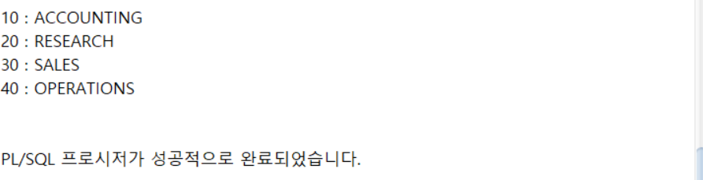

---
<!-- _class: aqua -->
<pre class="codeblock">
DECLARE
   TYPE REC_DEPT IS RECORD(
      deptno DEPT.DEPTNO%TYPE,
      dname DEPT.DNAME%TYPE
   );

   TYPE ITAB_DEPT IS TABLE OF REC_DEPT
      INDEX BY PLS_INTEGER;

   dept_arr ITAB_DEPT;
   idx PLS_INTEGER := 0;

BEGIN
   FOR i IN (SELECT DEPTNO, DNAME FROM DEPT) LOOP
      idx := idx + 1;
      dept_arr(idx).deptno := i.DEPTNO;
      dept_arr(idx).dname := i.DNAME;

      DBMS_OUTPUT.PUT_LINE(
         dept_arr(idx).deptno || ' : ' || dept_arr(idx).dname);
   END LOOP;
END;
/

</pre>

---
<!-- _class: aqua -->
##### Q008 SELECT * FROM DEPT 를 %ROWTYPE 와  연관배열을 이용하여  다음과 같이 출력하시오.
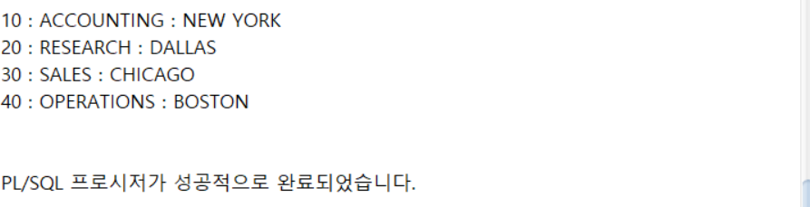

---
<!-- _class: aqua -->
<pre class="codeblock">
DECLARE
   TYPE ITAB_DEPT IS TABLE OF DEPT%ROWTYPE
      INDEX BY PLS_INTEGER;

   dept_arr ITAB_DEPT;
   idx PLS_INTEGER := 0;

BEGIN
   FOR i IN(SELECT * FROM DEPT) LOOP
      idx := idx + 1;
      dept_arr(idx).deptno := i.DEPTNO;
      dept_arr(idx).dname := i.DNAME;
      dept_arr(idx).loc := i.LOC;

      DBMS_OUTPUT.PUT_LINE(
      dept_arr(idx).deptno || ' : ' ||
      dept_arr(idx).dname || ' : ' ||
      dept_arr(idx).loc);
   END LOOP;
END;
/

</pre>

---
<!-- _class: aqua -->
##### Q009
- 다음과 같이 컬렉션메서드를 이용하여  출력하시오.
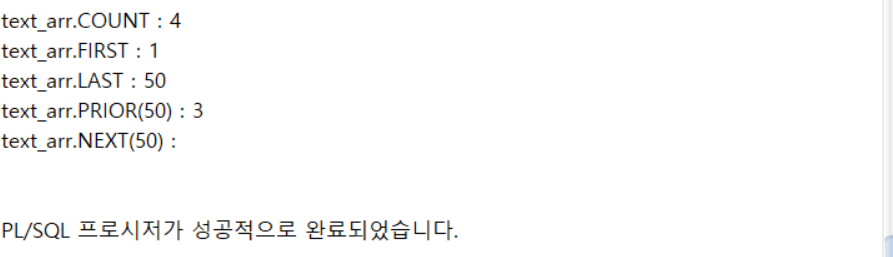

---
<!-- _class: aqua -->
<pre class="codeblock">
DECLARE
   TYPE ITAB_EX IS TABLE OF VARCHAR2(20)
      INDEX BY PLS_INTEGER;

   text_arr ITAB_EX;

BEGIN
   text_arr(1) := '1st data';
   text_arr(2) := '2nd data';
   text_arr(3) := '3rd data';
   text_arr(50) := '50th data';

   DBMS_OUTPUT.PUT_LINE('text_arr.COUNT : ' || text_arr.COUNT);
   DBMS_OUTPUT.PUT_LINE('text_arr.FIRST : ' || text_arr.FIRST);
   DBMS_OUTPUT.PUT_LINE('text_arr.LAST : ' || text_arr.LAST);
   DBMS_OUTPUT.PUT_LINE('text_arr.PRIOR(50) : ' || text_arr.PRIOR(50));
   DBMS_OUTPUT.PUT_LINE('text_arr.NEXT(50) : ' || text_arr.NEXT(50));

END;
/
</pre>

---
<!-- _class: purple -->
# 사고확장EX

---
<!-- _class: aqua -->
##### EX001  다음과 같이 PL/SQL 문을 작성하시오.
1. EMP 테이블과 같은 열구조를 가지는 빈테이블 EMP_RECORD를 생성하는 SQL문을 작성하시오.
2. EMP_RECORD 테이블에 레코드를 사용하여 새로운 사원정보를 다음과 같이 삽입하는 PL/SQL 프로그램을 작성하시오.

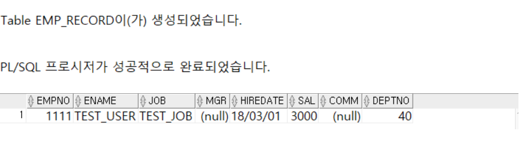

---
<!-- _class: aqua -->
<pre class="codeblock">
--①
CREATE TABLE EMP_RECORD
    AS SELECT *
         FROM EMP
        WHERE 1<>1;

--②
DECLARE
   TYPE REC_EMP IS RECORD (
      empno    EMP.EMPNO%TYPE NOT NULL := 9999,
      ename    EMP.ENAME%TYPE,
      job      EMP.JOB%TYPE,
      mgr      EMP.MGR%TYPE,
      hiredate EMP.HIREDATE%TYPE,
      sal      EMP.SAL%TYPE,
      comm     EMP.COMM%TYPE,
      deptno   EMP.DEPTNO%TYPE
   );
   emp_rec REC_EMP;
BEGIN
   emp_rec.empno    := 1111;
   emp_rec.ename    := 'TEST_USER';
   emp_rec.job      := 'TEST_JOB';
   emp_rec.mgr      := null;
   emp_rec.hiredate := TO_DATE('20180301','YYYYMMDD');
   emp_rec.sal      := 3000;
   emp_rec.comm     := null;
   emp_rec.deptno   := 40;

   INSERT INTO EMP_RECORD
   VALUES emp_rec;
END;
/

SELECT * FROM   EMP_RECORD;
</pre>

---
<!-- _class: aqua -->
##### EX002
- EMP 테이블을 구성하는 모든열을 저장할 수 있는 레코드를 활용하여 연관배열을 작성하시오. 그리고 저장된 연관배열의 내용을 다음과 같이 출력하시오.

---
<!-- _class: aqua -->
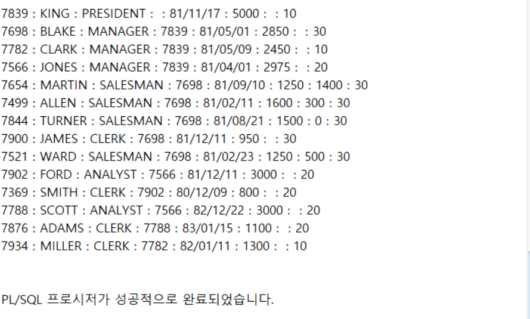

---
<!-- _class: aqua -->
<pre class="codeblock">
DECLARE
   TYPE ITAB_EMP IS TABLE OF EMP%ROWTYPE
      INDEX BY PLS_INTEGER;
   emp_arr ITAB_EMP;
   idx PLS_INTEGER := 0;
BEGIN
   FOR i IN (SELECT * FROM EMP) LOOP
      idx := idx + 1;
      emp_arr(idx).empno    := i.EMPNO;
      emp_arr(idx).ename    := i.ENAME;
      emp_arr(idx).job      := i.JOB;
      emp_arr(idx).mgr      := i.MGR;
      emp_arr(idx).hiredate := i.HIREDATE;
      emp_arr(idx).sal      := i.SAL;
      emp_arr(idx).comm     := i.COMM;
      emp_arr(idx).deptno   := i.DEPTNO;

      DBMS_OUTPUT.PUT_LINE(
         emp_arr(idx).empno     || ' : ' ||
         emp_arr(idx).ename     || ' : ' ||
         emp_arr(idx).job       || ' : ' ||
         emp_arr(idx).mgr       || ' : ' ||
         emp_arr(idx).hiredate  || ' : ' ||
         emp_arr(idx).sal       || ' : ' ||
         emp_arr(idx).comm      || ' : ' ||
         emp_arr(idx).deptno);

   END LOOP;
END;
/
</pre>

---
<!-- _class: aqua -->

1. TYPE emp_rec_type IS RECORD (...) 는 어떤 구조를 정의하나요?  
2. %ROWTYPE 은 어떤 상황에서 유용한가요?  
3. emp_rec.ename := 'SALLY' 는 어떤 작업을 하나요?  
4. 커서 결과를 레코드에 저장하려면 어떤 문장을 사용하나요?  
5. 커서 FOR LOOP에서 레코드는 어떻게 자동 생성되나요?

---

<!-- _class: red -->
# 🧪 Step 5: 기억 테스트

---

<!-- _class: aqua -->

- 사용자 정의 레코드와 %ROWTYPE 의 차이는 무엇인가요?  
- 레코드의 필드에 접근하는 방법은 무엇인가요?  
- 커서와 레코드를 함께 사용하는 이유는 무엇인가요?  
- FETCH INTO 와 커서 FOR LOOP의 차이는 무엇인가요?  
- 레코드는 어떤 상황에서 특히 유용한가요?

---
<!-- _class: thanks -->
## 👋 열심히 들어주셔서 감사합니다!
 
> 오늘의 한 걸음이 **내일의 가능성**이 되길 바라며,