<!-- _class: cover-oracle -->
<h4 style="color:#6C757D;">
  🧠
  CodeCraft Series · Track 02
</h4>
<h1 style="color:#007BFF;">Oracle Fundamentals</h1>
<h3 style="color:#17A2B8;">SQL부터 PL/SQL까지, 오라클의 핵심을 잡다</h3>

<!-- 현재 챕터 강조 -->

  📍 <strong>현재 위치:</strong> Chapter 1 · <em>오라클 환경 설정 · 기본 SELECT</em>

<blockquote>
  실무에 바로 적용 가능한 오라클 입문서 
  데이터를 다루는 힘, SQL로 시작해요
</blockquote>

---
<!-- _class: cover-oracle -->
<h2 style="font-size:1.6em; color:#555;">📚 Oracle 트랙 목차</h2>
  <strong style="color:#FF6E7F;">PART 1 · SQL 기본</strong>

  ▶ Chapter 01: oracle_setting
  ▶ Chapter 02: select_basic
  ▶ Chapter 03: select_where
  ▶ Chapter 04: select_fn
  ▶ Chapter 05: select_group
  ▶ Chapter 06: select_join
  ▶ Chapter 07: select_subquery

---
<!-- _class: cover-oracle -->
<h2 style="font-size:1.6em; color:#555;">📚 Oracle 트랙 목차</h2>
 <strong style="color:#FF6E7F;">PART 2 · 데이터 조작 및 객체</strong> 

 
  ▶ Chapter 08: update_delete
  ▶ Chapter 09: transaction
  ▶ Chapter 10: ddl
  ▶ Chapter 11: object
  ▶ Chapter 12: constraint
  ▶ Chapter 13: user

---
<!-- _class: cover-oracle -->
<h2 style="font-size:1.6em; color:#555;">📚 Oracle 트랙 목차</h2>
<strong style="color:#FF6E7F;">PART 3 · PL/SQL 심화</strong>

  
  ▶ Chapter 14: plsql
  ▶ Chapter 15: record
  ✅▶ Chapter 16: cursor
  ▶ Chapter 17: save

  이 트랙은 오라클의 기본 SQL부터 객체 관리, PL/SQL까지  실무 중심으로 배우며, 데이터베이스 전문가로 성장합니다.

 

 

---

<!-- _class: orange -->
# 🧩 Step 1: 핵심 개념  
***PL/SQL 커서 실습***  
→ ***명시적 커서***, ***커서 속성***, ***커서 FOR LOOP***, ***파라미터 커서***, ***커서와 레코드 연동***

---

<!-- _class: aqua -->
### 🔍 커서란?  
- SELECT 결과를 행 단위로 처리하기 위한 포인터  
- 명시적 커서와 암시적 커서 존재  
- 반복 처리, 조건 분기 등에 활용

---

<!-- _class: aqua -->
### 🧾 명시적 커서  
- DECLARE CURSOR로 정의  
- OPEN, FETCH, CLOSE 단계로 사용  
- 예:  
  <pre class="codeblock">
  CURSOR emp_cur IS SELECT ENAME, SAL FROM EMP;
  </pre>

---

<!-- _class: aqua -->
### 🔁 커서 FOR LOOP  
- 커서 열고 닫는 작업 자동 처리  
- 레코드 변수 자동 생성  
- 예:  
  <pre class="codeblock">
  FOR emp_rec IN emp_cur LOOP ... END LOOP;
  </pre>

---

<!-- _class: aqua -->
### 🧠 커서 속성  
- %FOUND : 마지막 FETCH 성공 여부  
- %NOTFOUND : 마지막 FETCH 실패 여부  
- %ROWCOUNT : FETCH된 행 수  
- %ISOPEN : 커서 열림 여부

---

<!-- _class: aqua -->
### 📦 파라미터 커서  
- 커서 정의 시 매개변수 사용 가능  
- 조건에 따라 동적 쿼리 처리  
- 예:  
  <pre class="codeblock">
  CURSOR emp_cur(p_deptno NUMBER) IS SELECT * FROM EMP WHERE DEPTNO = p_deptno;
  </pre>

---

<!-- _class: blue -->
# 🧪 Step 2: 코드 예제

---

<!-- _class: aqua -->

<pre class="codeblock">
-- 명시적 커서 사용
DECLARE
  CURSOR emp_cur IS SELECT ENAME, SAL FROM EMP;
  v_ename EMP.ENAME%TYPE;
  v_sal EMP.SAL%TYPE;
BEGIN
  OPEN emp_cur;
  LOOP
    FETCH emp_cur INTO v_ename, v_sal;
    EXIT WHEN emp_cur%NOTFOUND;
    DBMS_OUTPUT.PUT_LINE(v_ename || ': ' || v_sal);
  END LOOP;
  CLOSE emp_cur;
END;

-- 커서 FOR LOOP
DECLARE
  CURSOR emp_cur IS SELECT ENAME, SAL FROM EMP;
BEGIN
  FOR emp_rec IN emp_cur LOOP
    DBMS_OUTPUT.PUT_LINE(emp_rec.ENAME || ': ' || emp_rec.SAL);
  END LOOP;
END;

-- 파라미터 커서
DECLARE
  CURSOR emp_cur(p_deptno NUMBER) IS
    SELECT ENAME, SAL FROM EMP WHERE DEPTNO = p_deptno;
BEGIN
  FOR emp_rec IN emp_cur(10) LOOP
    DBMS_OUTPUT.PUT_LINE(emp_rec.ENAME || ': ' || emp_rec.SAL);
  END LOOP;
END;
</pre>

---

<!-- _class: aqua -->

## ✅ 커서 요약표

| 항목 | 설명 |
|------|------|
| CURSOR | 명시적 커서 선언 |
| OPEN, FETCH, CLOSE | 커서 처리 단계 |
| %FOUND, %NOTFOUND | FETCH 결과 상태 |
| FOR LOOP | 자동 커서 처리 |
| 파라미터 커서 | 조건 기반 커서 |

---

<!-- _class: green -->
# 🧪 Step 3: 연습문제

 
---
<!-- _class: aqua -->
##### Q001
- SELECT INTO를 사용하여 DEPT테이블의 40번 부서 데이터를 조회하고 각 열의 결과값을 변수에 저장하고 출력하시오.

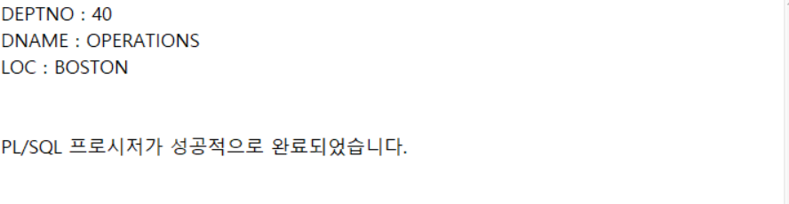

---
<!-- _class: aqua -->
<pre class="codeblock">
DECLARE
   V_DEPT_ROW DEPT%ROWTYPE;
BEGIN
   SELECT DEPTNO, DNAME, LOC INTO V_DEPT_ROW
     FROM DEPT
    WHERE DEPTNO = 40;
   DBMS_OUTPUT.PUT_LINE('DEPTNO : ' || V_DEPT_ROW.DEPTNO);
   DBMS_OUTPUT.PUT_LINE('DNAME : ' || V_DEPT_ROW.DNAME);
   DBMS_OUTPUT.PUT_LINE('LOC : ' || V_DEPT_ROW.LOC);
END;
/

</pre>

---
<!-- _class: aqua -->
##### Q002
- 하나의 행만 조회되는 경우 번거롭지만, 여러행이 조회되는 행이 여러개일때 커서의 사용이 극대화 됨.
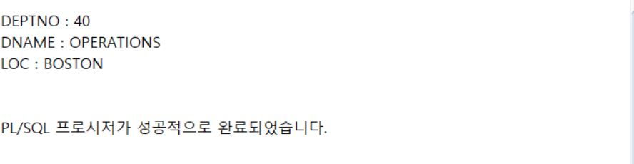

---
<!-- _class: aqua -->
<pre class="codeblock">
DECLARE
   -- 커서 데이터를 입력할 변수 선언
   V_DEPT_ROW DEPT%ROWTYPE;

   -- 명시적 커서 선언(Declaration)
   CURSOR c1 IS
      SELECT DEPTNO, DNAME, LOC
        FROM DEPT
       WHERE DEPTNO = 40;

BEGIN
   -- 커서 열기(Open)
   OPEN c1;

   -- 커서로부터 읽어온 데이터 사용(Fetch)
   FETCH c1 INTO V_DEPT_ROW;

   DBMS_OUTPUT.PUT_LINE('DEPTNO : ' || V_DEPT_ROW.DEPTNO);
   DBMS_OUTPUT.PUT_LINE('DNAME : ' || V_DEPT_ROW.DNAME);
   DBMS_OUTPUT.PUT_LINE('LOC : ' || V_DEPT_ROW.LOC);

   -- 커서 닫기(Close)
   CLOSE c1;

END;
/

</pre>

---
<!-- _class: aqua -->
##### Q003
- LOOP와 커서를 이용하여 여러행의 데이터를 커서에 저장해서 사용하기
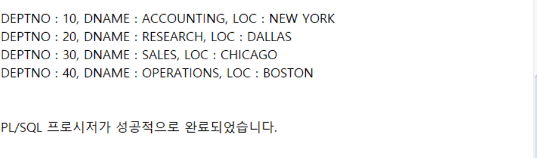

---
<!-- _class: aqua -->
<pre class="codeblock">
DECLARE
   -- 커서 데이터를 입력할 변수 선언
   V_DEPT_ROW DEPT%ROWTYPE;

   -- 명시적 커서 선언(Declaration)
   CURSOR c1 IS
      SELECT DEPTNO, DNAME, LOC
        FROM DEPT;

BEGIN
   -- 커서 열기(Open)
   OPEN c1;

   LOOP
      -- 커서로부터 읽어온 데이터 사용(Fetch)
      FETCH c1 INTO V_DEPT_ROW;

      -- 커서의 모든 행을 읽어오기 위해 %NOTFOUND 속성 지정
      EXIT WHEN c1%NOTFOUND;

      DBMS_OUTPUT.PUT_LINE('DEPTNO : ' || V_DEPT_ROW.DEPTNO
                        || ', DNAME : ' || V_DEPT_ROW.DNAME
                        || ', LOC : ' || V_DEPT_ROW.LOC);
   END LOOP;

   -- 커서 닫기(Close)
   CLOSE c1;

END;
/

</pre>

---
<!-- _class: aqua -->
##### Q004
- 커서와 FOOR LOOP를 사용하여 다음과 같이 출력하시오.
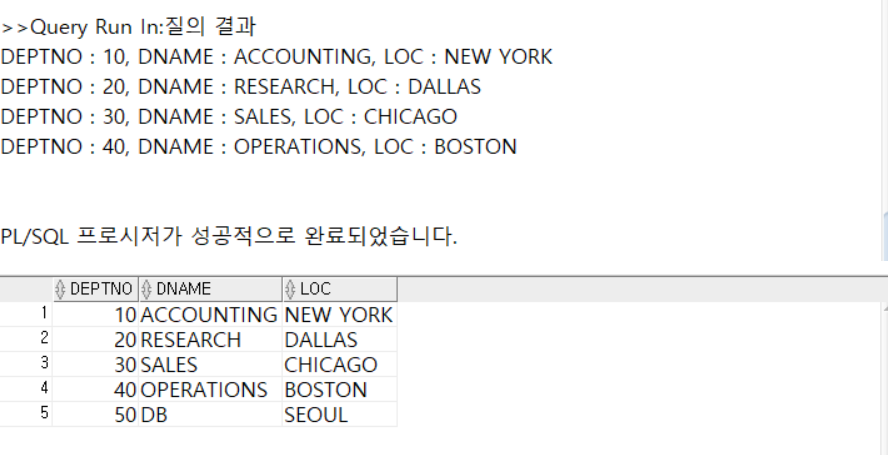

---
<!-- _class: aqua -->
<pre class="codeblock">
DECLARE
   -- 명시적 커서 선언(Declaration)
   CURSOR c1 IS
   SELECT DEPTNO, DNAME, LOC
     FROM DEPT;

BEGIN
   -- 커서 FOR LOOP 시작 (자동 Open, Fetch, Close)
   FOR c1_rec IN c1 LOOP
      DBMS_OUTPUT.PUT_LINE('DEPTNO : ' || c1_rec.DEPTNO
                      || ', DNAME : ' || c1_rec.DNAME
                      || ', LOC : ' || c1_rec.LOC);
   END LOOP;

END;
/

SELECT * FROM DEPT_RECORD;

</pre>

---
<!-- _class: aqua -->
##### Q005
- DEPT 테이블의 부서번호가 10 또는 20번일때 파라미터를 사용하는 커서를 다음과 같이 작성하시오.
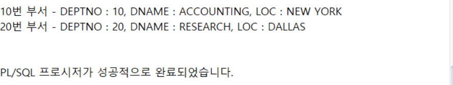

---
<!-- _class: aqua -->
<pre class="codeblock">
DECLARE
   -- 커서 데이터를 입력할 변수 선언
   V_DEPT_ROW DEPT%ROWTYPE;
   -- 명시적 커서 선언(Declaration)
   CURSOR c1 (p_deptno DEPT.DEPTNO%TYPE) IS
      SELECT DEPTNO, DNAME, LOC
        FROM DEPT
       WHERE DEPTNO = p_deptno;
BEGIN
   -- 10번 부서 처리를 위해 커서 사용
   OPEN c1 (10);
      LOOP
         FETCH c1 INTO V_DEPT_ROW;
         EXIT WHEN c1%NOTFOUND;
         DBMS_OUTPUT.PUT_LINE('10번 부서 - DEPTNO : ' || V_DEPT_ROW.DEPTNO
                                     || ', DNAME : ' || V_DEPT_ROW.DNAME
                                     || ', LOC : ' || V_DEPT_ROW.LOC);
      END LOOP;
   CLOSE c1;
   -- 20번 부서 처리를 위해 커서 사용
   OPEN c1 (20);
      LOOP
         FETCH c1 INTO V_DEPT_ROW;
         EXIT WHEN c1%NOTFOUND;
         DBMS_OUTPUT.PUT_LINE('20번 부서 - DEPTNO : ' || V_DEPT_ROW.DEPTNO
                                     || ', DNAME : ' || V_DEPT_ROW.DNAME
                                     || ', LOC : ' || V_DEPT_ROW.LOC);
      END LOOP;
   CLOSE c1;
END;
/

</pre>

---
<!-- _class: aqua -->
##### Q006
- 커서에 사용할 파라미터를 입력받으시오.
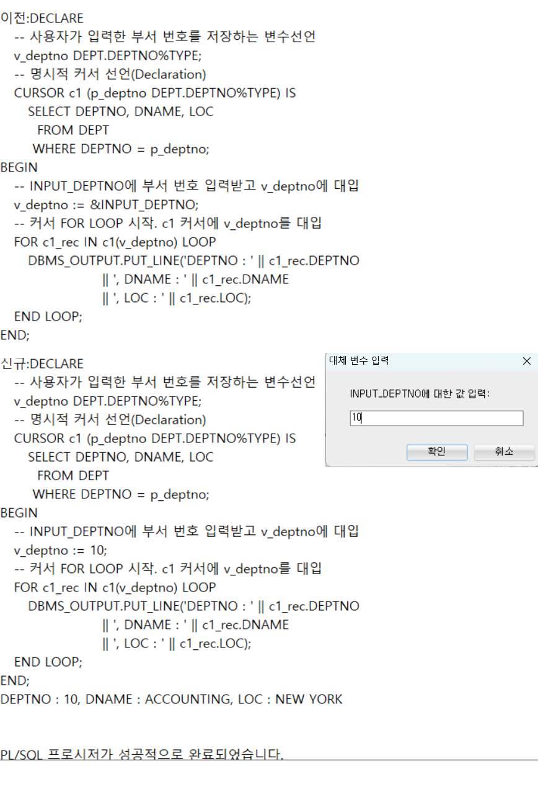

---
<!-- _class: aqua -->
<pre class="codeblock">
DECLARE
   -- 사용자가 입력한 부서 번호를 저장하는 변수선언
   v_deptno DEPT.DEPTNO%TYPE;
   -- 명시적 커서 선언(Declaration)
   CURSOR c1 (p_deptno DEPT.DEPTNO%TYPE) IS
      SELECT DEPTNO, DNAME, LOC
        FROM DEPT
       WHERE DEPTNO = p_deptno;
BEGIN
   -- INPUT_DEPTNO에 부서 번호 입력받고 v_deptno에 대입
   v_deptno := &INPUT_DEPTNO;
   -- 커서 FOR LOOP 시작. c1 커서에 v_deptno를 대입
   FOR c1_rec IN c1(v_deptno) LOOP
      DBMS_OUTPUT.PUT_LINE('DEPTNO : ' || c1_rec.DEPTNO
                      || ', DNAME : ' || c1_rec.DNAME
                      || ', LOC : ' || c1_rec.LOC);
   END LOOP;
END;
/

</pre>

---
<!-- _class: aqua -->
##### Q007
- 묵시적 커서의 속성을 다음과 같이 사용해 보시오 .
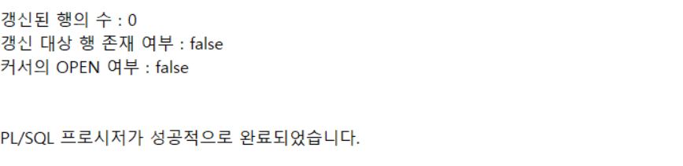

---
<!-- _class: aqua -->
<pre class="codeblock">
BEGIN
   UPDATE DEPT SET DNAME='DATABASE'
    WHERE DEPTNO = 50;

   DBMS_OUTPUT.PUT_LINE('갱신된 행의 수 : ' || SQL%ROWCOUNT);

   IF (SQL%FOUND) THEN
      DBMS_OUTPUT.PUT_LINE('갱신 대상 행 존재 여부 : true');
   ELSE
      DBMS_OUTPUT.PUT_LINE('갱신 대상 행 존재 여부 : false');
   END IF;

   IF (SQL%ISOPEN) THEN
      DBMS_OUTPUT.PUT_LINE('커서의 OPEN 여부 : true');
   ELSE
      DBMS_OUTPUT.PUT_LINE('커서의 OPEN 여부 : false');
   END IF;

END;
/

</pre>

---
<!-- _class: aqua -->
##### Q008
-  예외가 발생하는 PL/SQL을 작성하시오.
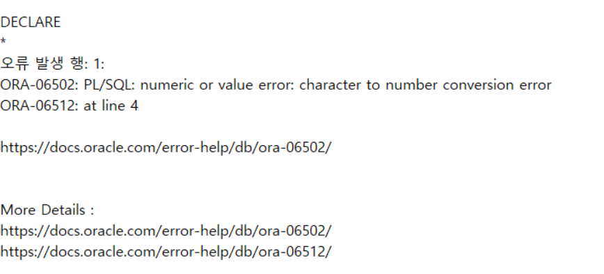

---
<!-- _class: aqua -->
<pre class="codeblock">
DECLARE
   v_wrong NUMBER;
BEGIN
   SELECT DNAME INTO v_wrong
     FROM DEPT
    WHERE DEPTNO = 10;
END;
/

</pre>

---
<!-- _class: aqua -->
##### Q009
- 위의 예제에 예외처리를 하시오.
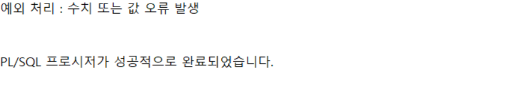

---
<!-- _class: aqua -->
<pre class="codeblock">
DECLARE
   v_wrong NUMBER;
BEGIN
   SELECT DNAME INTO v_wrong
     FROM DEPT
    WHERE DEPTNO = 10;
EXCEPTION
   WHEN VALUE_ERROR THEN
      DBMS_OUTPUT.PUT_LINE('예외 처리 : 수치 또는 값 오류 발생');
END;
/

</pre>

---
<!-- _class: aqua -->
##### Q0010
- 예외발생 후 코드 실행여부를 확인하시오.

---
<!-- _class: aqua -->
<pre class="codeblock">
DECLARE
   v_wrong NUMBER;
BEGIN
   SELECT DNAME INTO v_wrong
     FROM DEPT
    WHERE DEPTNO = 10;

   DBMS_OUTPUT.PUT_LINE('예외가 발생하면 다음 문장은 실행되지 않습니다');

EXCEPTION
   WHEN VALUE_ERROR THEN
      DBMS_OUTPUT.PUT_LINE('예외 처리 : 수치 또는 값 오류 발생');
END;
/

</pre>

---
<!-- _class: aqua -->
##### Q0011
- 사전정의된 예외를 사용하시오 .

---
<!-- _class: aqua -->
<pre class="codeblock">
DECLARE
   v_wrong NUMBER;
BEGIN
   SELECT DNAME INTO v_wrong
     FROM DEPT
    WHERE DEPTNO = 10;

   DBMS_OUTPUT.PUT_LINE('예외가 발생하면 다음 문장은 실행되지 않습니다');

EXCEPTION
   WHEN TOO_MANY_ROWS THEN
      DBMS_OUTPUT.PUT_LINE('예외 처리 : 요구보다 많은 행 추출 오류 발생');
   WHEN VALUE_ERROR THEN
      DBMS_OUTPUT.PUT_LINE('예외 처리 : 수치 또는 값 오류 발생');
   WHEN OTHERS THEN
      DBMS_OUTPUT.PUT_LINE('예외 처리 : 사전 정의 외 오류 발생');
END;
/

</pre>

---
<!-- _class: aqua -->
##### Q0012
- 오류코드와 오류케시지를 사용하시오 .
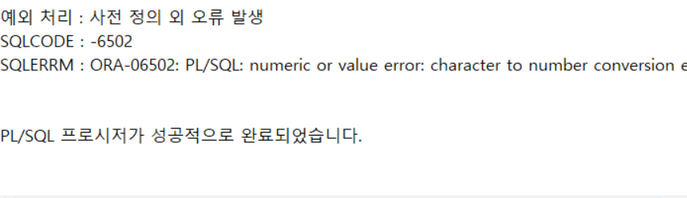

---
<!-- _class: aqua -->
<pre class="codeblock">
DECLARE
   v_wrong NUMBER;
BEGIN
   SELECT DNAME INTO v_wrong
     FROM DEPT
    WHERE DEPTNO = 10;

   DBMS_OUTPUT.PUT_LINE('예외가 발생하면 다음 문장은 실행되지 않습니다');

EXCEPTION
   WHEN OTHERS THEN
      DBMS_OUTPUT.PUT_LINE('예외 처리 : 사전 정의 외 오류 발생');
      DBMS_OUTPUT.PUT_LINE('SQLCODE : ' || TO_CHAR(SQLCODE));
      DBMS_OUTPUT.PUT_LINE('SQLERRM : ' || SQLERRM);
END;
/

</pre>

---
<!-- _class: purple -->
# 사고확장EX

---
<!-- _class: aqua -->
##### EX001
- 명시적 커서를 사용하여 EMP 테이블의 전체 데이털르 조회한 후 커서안에 데이터가 다음과 같이 출력되도록 PL/SQL을 작성하시오.
1. LOOP를 사용하는 방식
2. FOR LOOP를 사용하는 방식

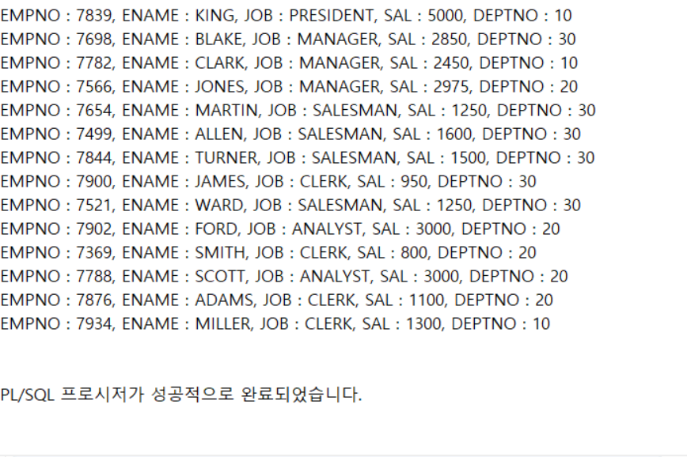

---
<!-- _class: aqua -->
<pre class="codeblock">
--①
DECLARE
   -- 커서 데이터가 입력될 변수 선언
   V_EMP_ROW EMP%ROWTYPE;
   -- 명시적 커서 선언(Declaration)
   CURSOR c1 IS
      SELECT *
        FROM EMP;
BEGIN
   -- 커서 열기(Open)
   OPEN c1;
   LOOP
       -- 커서로부터 읽어온 데이터 사용(Fetch)
       FETCH c1 INTO V_EMP_ROW;
       -- 커서의 모든 행을 읽어오기 위해 %NOTFOUND 속성지정
       EXIT WHEN c1%NOTFOUND;
       DBMS_OUTPUT.PUT_LINE('EMPNO : '    || V_EMP_ROW.EMPNO
                       || ', ENAME : '    || V_EMP_ROW.ENAME
                       || ', JOB : '      || V_EMP_ROW.JOB
                       || ', SAL : '      || V_EMP_ROW.SAL
                       || ', DEPTNO : '   || V_EMP_ROW.DEPTNO
		       );
   END LOOP;
   -- 커서 닫기(Close)
   CLOSE c1;
END;
/

--②
DECLARE
   -- 명시적 커서 선언(Declaration)
   CURSOR c1 IS
      SELECT *
        FROM EMP;
BEGIN
   -- 커서 FOR LOOP 시작 (자동 Open, Fetch, Close)
   FOR c1_rec IN c1 LOOP
      DBMS_OUTPUT.PUT_LINE('EMPNO : '    || c1_rec.EMPNO
                      || ', ENAME : '    || c1_rec.ENAME
                      || ', JOB : '      || c1_rec.JOB
                      || ', SAL : '      || c1_rec.SAL
                      || ', DEPTNO : '   || c1_rec.DEPTNO);
   END LOOP;
END;
/
</pre>

---
<!-- _class: aqua -->
##### EX002
- PL/SQL 문의 실행중 발생하는 예외를 다음결과와 같이 처리하는 예외처리부를 작성하시오.
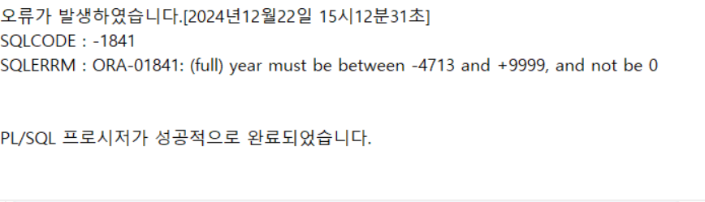

---
<!-- _class: aqua -->
<pre class="codeblock">
DECLARE
   v_wrong DATE;
BEGIN
   SELECT ENAME INTO v_wrong
     FROM EMP
    WHERE EMPNO = 7369;

    DBMS_OUTPUT.PUT_LINE('예외가 발생하면 다음 문장은 실행되지 않습니다');

EXCEPTION
  ////////////// 예외처리
END;
/
</pre>

<pre class="codeblock">
DECLARE
   v_wrong DATE;
BEGIN
   SELECT ENAME INTO v_wrong
     FROM EMP
    WHERE EMPNO = 7369;

    DBMS_OUTPUT.PUT_LINE('예외가 발생하면 다음 문장은 실행되지 않습니다');

EXCEPTION
   WHEN OTHERS THEN
      DBMS_OUTPUT.PUT_LINE('오류가 발생하였습니다.'
                        || TO_CHAR(SYSDATE, '[YYYY"년"MM"월"DD"일" HH24"시"mm"분"SS"초"]'));

      DBMS_OUTPUT.PUT_LINE('SQLCODE : ' || TO_CHAR(SQLCODE));
      DBMS_OUTPUT.PUT_LINE('SQLERRM : ' || SQLERRM);
END;
/

</pre>

---

<!-- _class: aqua -->

1. CURSOR emp_cur IS SELECT ... 은 어떤 객체를 정의하나요?  
2. FETCH INTO 문은 어떤 역할을 하나요?  
3. 커서 FOR LOOP는 어떤 점에서 편리한가요?  
4. %ROWCOUNT 속성은 어떤 정보를 제공하나요?  
5. 파라미터 커서는 어떤 상황에서 유용한가요?

---

<!-- _class: red -->
# 🧪 Step 5: 기억 테스트

---

<!-- _class: aqua -->

- 명시적 커서와 암시적 커서의 차이는 무엇인가요?  
- 커서의 %ISOPEN 속성은 언제 사용하나요?  
- EXIT WHEN emp_cur%NOTFOUND 는 어떤 의미인가요?  
- 커서 FOR LOOP와 명시적 커서 루프의 차이는 무엇인가요?  
- 커서 사용 시 주의할 점은 무엇인가요?

---
<!-- _class: thanks -->
## 👋 열심히 들어주셔서 감사합니다!
 
> 오늘의 한 걸음이 **내일의 가능성**이 되길 바라며,