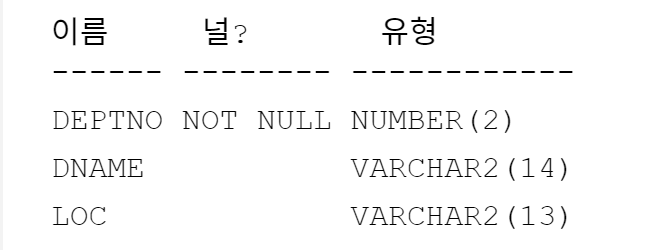
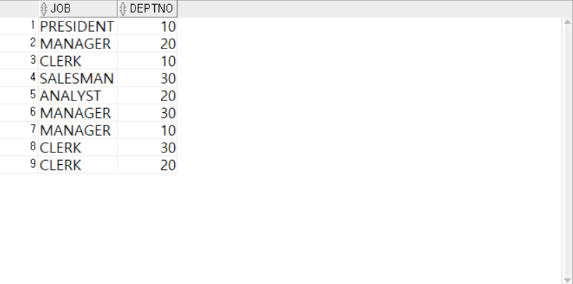
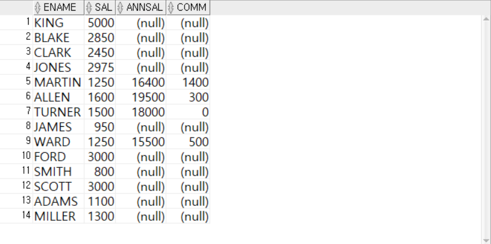
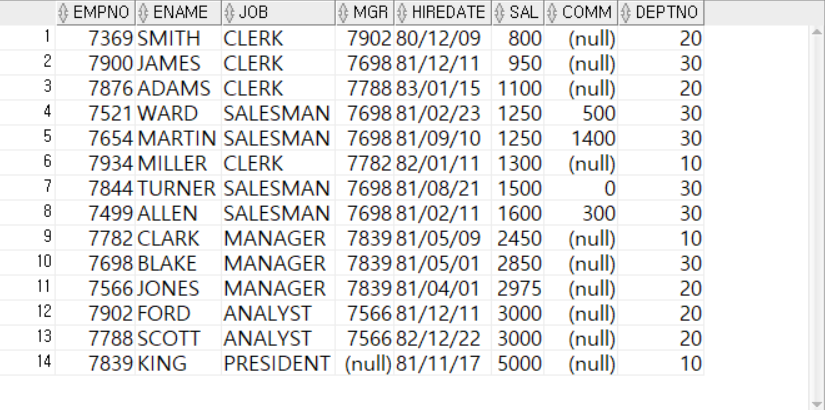
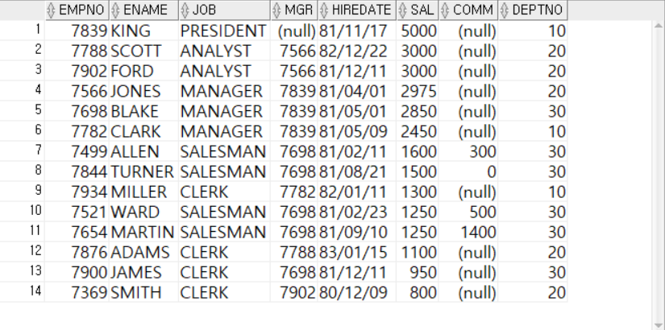
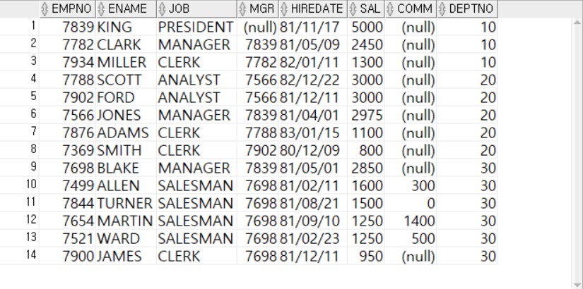

####  ■STEP1. BASIC

<br/>
<br/>
<br/>

##### Q001
- EMP 테이블 구성을 살펴보시오

```sql
DESC EMP;
```

<br/>
<br/>
<br/>

##### Q002
- DEPT 테이블 구성을 살펴보시오

```sql
DESC DEPT;
```


<br/>
<br/>
<br/>

##### Q003
- SALGRADE 테이블 구성을 살펴보시오

```sql
DESC SALGRADE;
```

<br/>
<br/>
<br/>

##### Q004
- EMP 테이블 전체열을 조회하시오

```sql
SELECT * FROM EMP;
```

<br/>
<br/>
<br/>

##### Q005
- EMP 테이블의  EMPNO, ENAME, DEPTNO 열을 조회하시오

```sql
SELECT EMPNO, ENAME, DEPTNO
  FROM EMP;
```

<br/>
<br/>
<br/>

##### Q006
- EMP 테이블의  DEPTNO 열의 중복을 제거하고고 조회하시오

```sql
SELECT DISTINCT DEPTNO
  FROM EMP;
```

<br/>
<br/>
<br/>

##### Q007
- EMP 테이블의  JOB, DEPTNO열의 중복을 제거하고 조회하시오
- JOB, DEPTNO 가 모두 중복된 데이터는 한번만 중복이 되게 하시오.

```sql
SELECT DISTINCT JOB, DEPTNO
  FROM EMP;
```

<br/>
<br/>
<br/>

##### Q008
- EMP 테이블의  JOB, DEPTNO열의 중복을 제거하지 않고 그대로 모두두 조회하시오

```sql
SELECT ALL JOB, DEPTNO
  FROM EMP;
```

<br/>
<br/>
<br/>

##### Q009
- EMP 테이블의열에에 연산식을이용하여 '연간총수입'을 조회하시오.

```sql
SELECT ENAME, SAL, SAL*12+COMM, COMM
  FROM EMP;
```

<br/>
<br/>
<br/>

##### Q010
- EMP 테이블의 열열 더하기 연산식을이용하여 '연간총수입'을 조회하시오.

```sql
SELECT ENAME, SAL, SAL+SAL+SAL+SAL+SAL+SAL+SAL+SAL+SAL+SAL+SAL+SAL+COMM, COMM
  FROM EMP;
```

<br/>
<br/>
<br/>

##### Q011
- EMP 테이블의 열 별칭을 사용하여 '연간총수입'을 조회하시오.

```sql
SELECT ENAME, SAL, SAL*12+COMM AS ANNSAL, COMM
  FROM EMP;
```

<br/>
<br/>
<br/>

##### Q012
- EMP 테이블의 모든 열을 급여기준으로 오름차순 정렬하시오.

```sql
SELECT *
  FROM EMP
ORDER BY SAL;
```

<br/>
<br/>
<br/>

##### Q013
- EMP 테이블의 모든 열을 급여기준으로 내림차순순 정렬하시오.

```sql
SELECT *
  FROM EMP
ORDER BY SAL DESC;
```

<br/>
<br/>
<br/>

##### Q014
- EMP 테이블의 모든 열을 전체열을 부서번호(오름차순)와 급여(내림차순)으로 정렬하시오.

```sql
SELECT *
  FROM EMP
ORDER BY DEPTNO ASC, SAL DESC;
```

<br/>
<br/>
<br/>


####  ■STEP2. EX

<br/>
<br/>
<br/>

##### EX001.
- EMP테이블의 JOB열 데이터를 중복없이 조회하시오.

```sql
SELECT DISTINCT JOB
  FROM EMP;
```


<br/>
<br/>
<br/>

##### EX002.
- 조회할 테이블은 EMP 테이블이며 모든 열을 출력하시오.
- 별칭
  EMPNO → EMPLOYEE_NO,
  ENAME → EMPLOYEE_NAME,
  MGR   → MANAGER,
  SAL   → SALARY,
  COMM  → COMMISSION,
  DEPTNO → DEPARTMENT_NO
- 부서번호를 기준으로 내림차순으로 정렬하되,
  부서번호가 같다면 사원이름을 기준으로 오름차순 정렬하시오.


```sql
SELECT EMPNO AS EMPLOYEE_NO,
       ENAME AS EMPLOYEE_NAME,
       JOB,
       MGR AS MANAGER,
       HIREDATE,
       SAL AS SALARY,
       COMM AS COMMISSION,
       DEPTNO AS DEPARTMENT_NO
  FROM EMP
ORDER BY DEPTNO DESC, ENAME;
```
