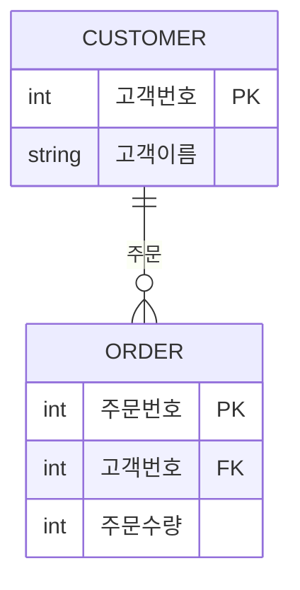
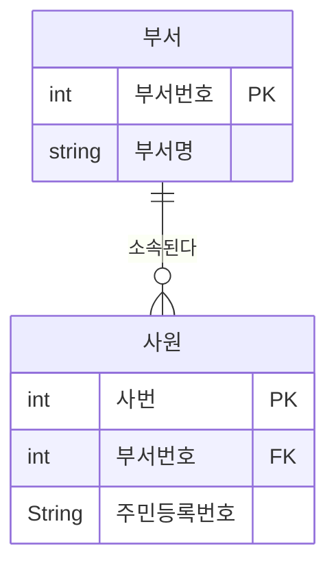
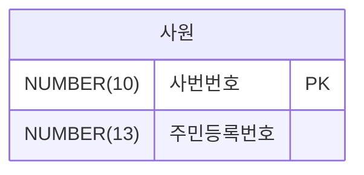
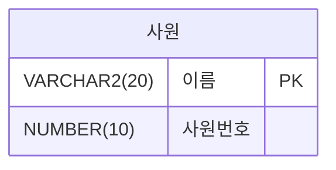
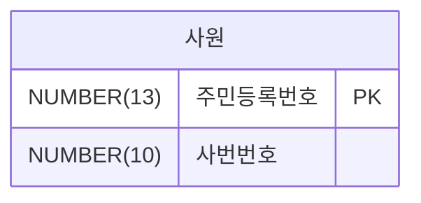
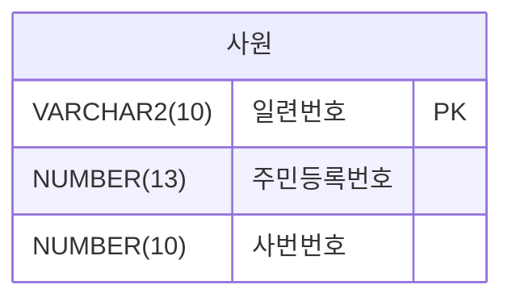

 

### ✅ 1번
모델링은 현실세계를 표현하는 것으로 이해할 수 있다. 다음 중 모델링의 특징으로 가장 부적절한 것은?

① 현실세계를 일정한 형식의 모델로 표현하는 추상화의 의미를 가짐
② 시스템 구현만을 위해 진행하는 사전단계의 작업으로서 데이터베이스 구축을 위한 사전 작업의 의미만 가짐
③ 복잡한 현실을 제한된 언어나 표기방법을 통해 쉽게 이해할 수 있는 단순화 의미를 가짐
④ 현실세계를 일정한 형식으로 누구나 이해가 가능하도록 정확하게 현상을 기술하는 정확화 의미를 가짐
 

### ✅ 2번
다음 설명 중 데이터 모델링이 필요한 주요 이유로 가장 부적절한 것은?

① 업무규모를 구성하는 기초가 되는 정보를 대체 일정한 표기방법에 의해 표현함.
② 분석된 결과물을 가지고 데이터베이스를 설계할 수 있는 기초 자료로 사용하기 위함.
③ 데이터베이스를 구축하기 위한 용도를 위해 데이터모델링을 수행하고 업무에 대한 설명은 별도로 표기방법을 이용한다.
④ 데이터모델링은 자료로서의 업무를 설명하고 분석하는 부분에 의미를 가지고 있다.
 

### ✅ 3번
다음 중 데이터모델링을 할 때 유의해야 할 사항으로 가장 부적절한 것은?

① 여러 장소의 데이터베이스에 같은 정보를 저장하지 않도록 하여 중복을 최소화한다.
② 데이터의 정의를 데이터의 사용 프로세스와 분리하여 독립성을 높인다.
③ 사용자가 처리하는 프로세스나 정보 등에 따라 매번 달라질 수 있도록 프로그램과 데이터베이스의 관계를 늘 높인다.
④ 데이터 간의 상호 연관관계를 명확하게 정의하여 일관성 있게 데이터를 유지되도록 한다.

 

### ✅ 4번

다음 중 아래 설명이 의미하는 데이터모델링의 유의점에 해당하는 특성은 무엇인가?

> 데이터 모델을 어떻게 설계했느냐에 따라 사소한 업무변화에도 데이터 모델이 수시로 변경되므로 유연성의 어려움을 가중시킬 수 있다. 데이터의 정의를 데이터의 사용 프로세스와 분리함으로써 데이터 모델은 데이터 혹은 프로세스의 변화가 애플리케이션과 데이터베이스에 중대한 변화를 일으킬 수 있는 가능성을 줄일 수 있다.

① 중복  ② 비유연성  ③ 비일관성  ④ 일관성

---

### ✅ 5번

다음 중 아래 데이터모델링 개념에 대한 설명에서 (가) , (나)에 들어갈 단어로 가장 적절한 것은?

> 전사적 데이터 모델링을 수행할 때 많이 하며, 추상화 수준이 높고 업무 중심적이고 포괄적인 수준의 모델링을 진행하는 것을 (가)  데이터 모델링이라고 한다. 이후 논리적 설계로 데이터베이스에 이식할 수 있도록 성능, 저장 등 물리적인 성격을 고려한 데이터 모델링을 (나)데이터모델링이라고 한다.

① (가)=개념적, (나)=물리적
② (가)=논리적, (나)=개념적
③ (가)=논리적, (나)=물리적
④ (가)=개념적, (나)=논리적

---

### ✅ 6번

다음 중 ANSI-SPARC에서 정의한 3단계구조(three-level architecture)에서 아래 내용이 설명하는 스키마구조로 가장 적절한 것은?

> * 모든 사용자 관점을 통합한 조직 전체 관점의 통합적 표현
> * 모든 응용시스템이나 사용자들의 필요를 하나의 데이터로 통합한 전체적 DB를 기술한 것
> * DB의 개체들, 속성들, 관계를 정의하고 데이터 그룹 간의 관계를 표현하는 스키마

① 외부스키마 (External Schema)
② 개념스키마 (Conceptual Schema)
③ 내부스키마 (Internal Schema)
④ 논리스키마 (Logical Schema)

---

### ✅ 7번

다음 중 고객과 주문의 ERD에 대한 설명으로 가장 부적절한 것은?

① 한 명의 고객은 여러 개의 제품을 주문할 수 있다. 주문은 할 수도 있고 안 할 수도 있다.
② 하나의 주문은 반드시 한 명의 고객에 의해 주문된다.
③ 주문의 데이터를 입력할 때는 반드시 고객데이터가 존재해야 한다.
④ 고객의 데이터를 입력할 때는 주문데이터가 존재하는 고객만을 입력할 수 있다.

---

### ✅ 8번

다음 중 ERD에 대한 설명으로 가장 부적절한 것은?
① 1976년 피터첸(Peter Chen)에 의해 Entity-Relationship Model(E-R Model)이라는 표기기법이 탄생하였다.
② 일반적으로 ERD를 작성할 때에는 엔터티들을 도형에 배치 → 관계 설정 → 관계명 기술 → 관계차수 기술 순으로 진행한다.
③ ERD 작성의 목적은 분석된 업무에 대해 데이터 측면에서 모델을 명확하게 표현하기 위함이다.
④ 가장 중요한 엔터티를 우선 배치하여 작성해 나가며, 애매한 엔터티들은 원칙과 규칙에 따라 배치하는 것이 일반적이다.

---

### ✅ 9번

다음 중 아래 시나리오에서 엔터티로 가장 적절한 것은?

> S병원은 여러 명의 환자가 존재하고 각 환자에 대한 이름, 주소 등을 관리하여야 한다. (단, 환자에 대한 엔터티의 특성을 살려 시나리오에 기술되어 있는 단어 중 단수형으로 대명사여야 함)

① 이름
② 환자
③ 나이
④ 주소

---

### ✅ 10번

다음 중 엔터티의 특징으로 가장 부적절한 것은?
① 속성이 없는 엔터티는 있을 수 없다. 엔터티는 반드시 속성을 가져야 한다.
② 엔터티는 다른 엔터티와 관계가 있을 수 밖에 없다. 단독 엔터티는 없다.
③ 객체지향적 디자인에서는 싱글턴 패턴처럼 단 하나의 인스턴스를 가지는 엔터티가 존재할 수 있다. 이와 유사히 엔터티는 단 1개의 인스턴스를 가질 수 있다.
④ 데이터로 존재하고 업무에서 필요로 하면 해당 업무에 따라 엔터티로 성립될 수 있다.

---

### ✅ 11번

다음 중 엔터티의 일반적인 특징으로 가장 부적절한 것은?
① 다른 엔터티와의 관계를 가지지 않는다.
② 유일한 식별자에 의해 식별이 가능해야 한다.
③ 엔터티는 업무 프로세스에 의해 이용되어야 한다.
④ 엔터티는 반드시 속성을 포함해야 한다.

---

### ✅ 12번

다른 엔터티로부터 주식별자를 상속받지 않고 자신의 고유한 주식별자를 가지며, 사원, 부서, 고객, 상품, 지점 등이 예가 될 수 있는 엔터티로 가장 적절한 것은?
① 기본 엔터티 (Key 엔터티)
② 중심 엔터티 (Main 엔터티)
③ 행위 엔터티 (Active 엔터티)
④ 개념 엔터티

---

### ✅ 13번

다음 중 엔터티의 이름을 부여하는 방법으로서 가장 부적절한 것은?
① 가능하면 약어를 사용하여 엔터티명을 부여한다.
② 현업에서 사용하는 용어를 사용하여 업무와 관련성을 높인다.
③ 엔터티명의 첫 글자는 반드시 한글로 표기한다.
④ 엔터티명 생성 시 의미대로 간결하고 명확하도록 한다.

---

### ✅ 14번

>업무에서 필요로 하는 인스턴스에서 관리하고자 하는 의미상 더 이상 분리되지 않는 최소의 데이터 단위를 무엇이라 하는가?

### ✅ 15번

다음 중 속성에 대한 설명으로 가장 부적절한 것은?
① 엔터티에 대한 자세하거나 구체적인 정보를 나타낸다.
② 하나의 엔터티는 두 개 이상의 속성을 갖는다.
③ 하나의 인스턴스에서 각각의 속성은 하나 이상의 속성값을 가질 수 있다.
④ 속성은 독립적이다.

---

### ✅ 16번

다음 중 아래와 같은 사례에서 속성에 대한 설명으로 가장 부적절한 것은?

> 우리은행은 예금구분(보통예금, 정기예금 등)과 이율, 예치기간, 예금잔액을 관리한다고 할 때, 예금구분은 보통예금, 정기예금이라는 값을 가질 수 있으며, 이는 1000이상의 숫자로 표현되지 않는다. 이율 속성은 소수점 이하 5.0% 또는 3.0%와 같은 숫자로 표현되며, 예치기간 속성은 년단위로 표시한다. 예금잔액 속성은 원 단위로 숫자가 표현된다.

① 일반속성으로 코드 엔터티를 별도로 구성하고 참조하는 것이 관리상 효과적이다.
② 원래, 애기기간은 기본(BASIC) 속성이다.
③ 이자와 이율과 같은 파생(DERIVED) 속성일 수 있다.
④ 예금분류는 설계(DESIGNED) 속성이다.

---

### ✅ 17번

다음 중 데이터를 조회할 때 빠른 성능을 낼 수 있도록 하기 위해 원래 속성의 값을 계산하여 저장할 수 있도록 만든 속성으로 가장 적절한 것은?
① 파생속성 (Derived Attribute)
② 기본속성 (Basic Attribute)
③ 설계속성 (Designed Attribute)
④ PK속성 (Derived Attribute)

---

### ✅ 18번

다음 중 아래 설명이 나타내는 데이터모델의 개념으로 가장 적절한 것은?

> 주문이라는 엔터티가 있을 때 단가라는 속성 값의 범위는 100에서 10,000 사이의 실수 값이며, 제품명이라는 속성은 길이가 20자 이내의 문자열로 정의할 수 있다.

① 시스템카탈로그 (System Catalog)
② 용어사전 (Word Dictionary)
③ 속성사전 (Attribute Dictionary)
④ 도메인 (Domain)

---

### ✅ 19 
다음 중 데이터모델링을 할 때 속성의 명칭을 부여하는 방법으로 가장 부적절한 것은?

① 속성의 이름에 약어를 사용할 경우 그 의미를 명확하게 이해할 수 없고
혼돈을 초래하여 커뮤니케이션의 혼란을 야기할 수 있으므로 지나친
약어 사용은 가급적 제한하도록 한다.
② 속성의 이름에는 서술식 용어는 사용하지 않도록 한다.
③ 직원 엔터티의 이름, 고객 엔터티의 이름과 같이 각 엔터티별로 동일한
속성명을 사용하여 데이터모델의 일관성을 가져가는 것이 좋다.
④ 데이터모델링 대상에서 사용하는 용어도 있고 외부에서 사용하는 용어
도 있어 중복이 있을 때, 가급적 해당 업무에서 자주 사용하는 이름을
이용하도록 한다.

---

### ✅ 20 
다음 중 데이터모델링의 관계에 대한 설명으로 가장 부적절한 것을 2개 고르시오.

① 관계는 존재에 의한 관계와 행위에 의한 관계로 구분될 수 있으나 ERD
에서는 관계를 연결할 때, 존재와 행위를 구분하지 않고 단일화된 표기
법을 사용한다.
② UML(Unified Modeling Language)에는 클래스다이어그램의 관계 중
연관관계(Association)와 의존관계(Dependency)가 있고 이것은 실선과
점선의 표기법으로 다르게 표현이 된다.
③ 관계는 존재에 의한 관계와 행위에 의한 관계로 구분될 수 있고 ERD
에서는 관계를 연결할 때, 존재와 행위를 구분하여 실선과 접선의 표기
법으로 다르게 표현한다.
④ UML(Unified Modeling Language)에는 클래스다이어그램의 관계 중
연관관계(Association)와 의존관계(Dependency)가 있고 있으나 구분
하지 않고 단일화된 표기법을 사용한다.

---

### ✅ 21 
다음 중 관계에 대한 설명으로 가장 부적절한 것은?

① 관계는 존재적 관계와 행위에 의한 관계로 나누어볼 수 있다.
② 관계의 표기법은 관계명, 관계차수, 식별성의 3가지 개념을 사용한다.
③ 부서와 사원 엔터티 간의 '소속' 관계는 존재적 관계의 사례이다.
④ 주문과 배송 엔터티 간의 '배송근거' 관계는 행위에 의한 관계의 사례이다.

---

### ✅22
다음 중 엔터티간의 관계에서 1:1, 1:M과 같이 관계의 기수성을 나타내는
것으로 가장 적절한 것은?
① 관계명(Relationship Membership)
② 관계차수(Relationship Degree/Cardinality)
③ 관계선택사양(Relationship Optionality)
④ 관계정의(Relationship Definition)

---

### ✅23
다음 중 두 개의 엔터티 사이에 정의한 관계를 체크하는 사항으로 가장
부적절한 것은?
① 두 개의 엔터티 사이에 관심 있는 연관규칙이 존재하는가?
② 두 개의 엔터티 사이에 정보의 조합이 발생되는가?
③ 업무기술서, 장표에 관계연결을 가능하게 하는 명사 (Noun)가 있는가?
④ 업무기술서, 장표에 관계연결에 대한 규칙이 서술되어 있는가?

---

### ✅24
다음 중 두 개의 엔터티 사이에서 관계를 도출 할 때 체크 할 사항을
모두 고른 것은?

>가. 두 개의 엔터티 사이에 관심있는 연관규칙이 존재하는가?
나. 두 개의 엔터티 사이에 정보의 조합이 발생되는가?
다. 업무기술서, 장표에 관계연결에 대한 규칙이 서술되어 있는가?
라. 업무기술서, 장표에 관계연결을 가능하게 하는 동사(Verb)가 있
는가?

① 가. 다. 라
② 가. 다. 라
③ 가. 나. 다
④ 가. 나. 다. 라

---

### ✅25 
다음 중 아래에서 주식별자를 지정할 때 고려해야 할 사항을 묶은 것으로 가장 적절한 것은?
 
>가. 주식별자에 의해 엔티티 내의 모든 인스턴스들이 유일하게 구분
되어야 한다.
나. 주식별자를 구성하는 속성의 수는 유일성을 만족하는 최소의 수
가 되어야 한다.
다. 지정된 주식별자의 값은 자주 변하지 않는 것이어야 한다.
라. 주식별자가 지정이 되면 반드시 값이 들어와야 한다.

①가. 나. 다
②가. 나. 라
③나. 다. 라
④ 가. 나. 다. 라

---

### ✅26 
다음 중 사원엔터티에서 식별자의 특성에 해당하지 않는 것은 무엇인가?

① 주식별자
② 단일식별자
③ 내부식별자
④ 인조식별자

---

### ✅27 
다음 중 식별자로 가장 부적절한 것은?

①  

②  

③ 

④ 

 

---

### ✅28
다음 중 아래에서 엔터티 내에 주식별자를 도출하는 기준을 묶은 것으로
가장 적절한 것은?

>가. 해당 업무에서 자주 이용되는 속성을 주식별자로 지정한다.
나. 명칭, 내역 등과 같이 이름으로 기술되는 것들을 주식별자로 지정한다.
다. 복합으로 주식별자를 구성할 경우 너무 많은 속성을 포함하지 않도록 한다.
라. 자주 수정되는 속성을 주식별자로 지정한다.

① 가, 나
② 가. 다
③ 다. 라
④나, 라

---

### ✅29
프로젝트를 전개할 때는 식별자관계와 비식별자관계를 선택하여 연결
해야 하는 높은 수준의 데이터모델링 기술이 필요하다. 다음 중 비식별자
관계를 선택하는 기준으로 가장 부적절한 것은?

① 관계의 강약을 분석하여 상호간에 연관성이 약할 경우 비식별자관계를 고려한다.
② 자식테이블에서 독립적인 Primary Key의 구조를 가지기 원할 때 비식별자관계를 고려한다.
③ 모든 관계가 식별자 관계로 연결되면 SQL Where절에서 비교하는 항목이 증가되어 조인에 참여하는 테이블에 따라 SQL문장이 길어져 SQL문의 복잡성이 증가되는 것을 방지하기 위해 비식별자관계를 고려한다.
④ 부모엔터티의 주식별자를 자식엔터티에서 받아 손자엔터티까지 계속 흘려보내기 위해 비식별자관계를 고려한다.

---

### ✅30
다음 중 비식별자 관계로 연결하는 것을 고려해야 하는 경우로 가장 부적절한 것은?

① 부모엔터티에 참조값이 없어도 자식엔터티의 인스턴스가 생성될 수 있는 경우
② 부모엔터티의 인스턴스가 자식 엔터터와 같이 소멸되는 경우
③ 여러 개의 엔터티를 하나로 통합하면서 각각의 엔터티가 갖고 있던 여러 개의 개별 관계가 통합되는 경우
④ 자식쪽 엔터티의 주식별자를 부모엔터티와는 별도로 생성하는 것이 더 유리하다고 판단하는 경우

 