---
### ✅065  

다음 중 순수 관계 연산자에 해당하지 않는 것은?
① SELECT
② UPDATE
③ JOIN
④ DIVIDE


**정답** : 2

---
### ✅066  
다음 중 아래 데이터 모델을 참고하여 설명에 맞게 올바르게 작성한 SQL 문장을 2개 고르시오.

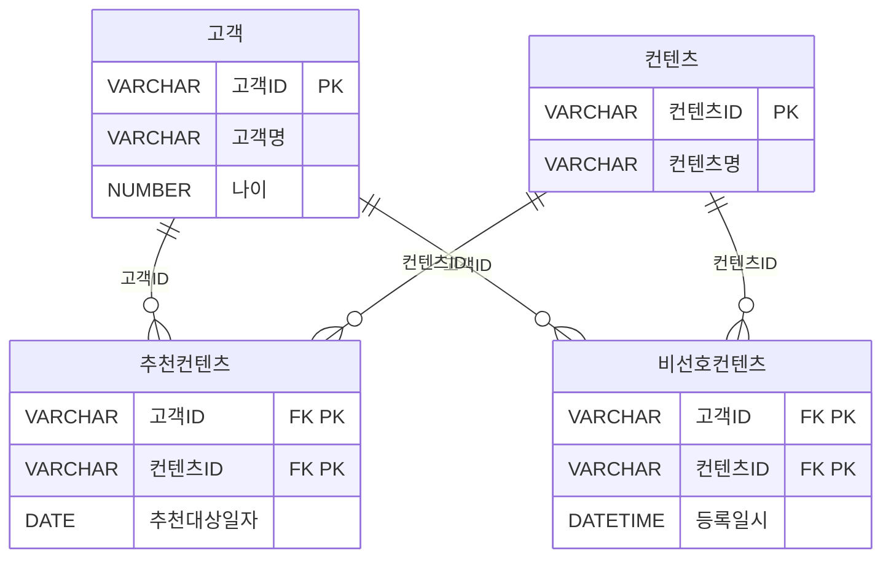

※ 추천컨텐츠 테이블의 복합키: 고객ID + 컨텐츠ID
※ 비선호컨텐츠 테이블의 복합키: 고객ID + 컨텐츠ID


[설명]
우리는 매일 배치작업을 통하여 고객에게 추천할 컨텐츠를 생성하고 고객에게 추천서비스를 제공한다.
추천 컨텐츠 엔터티에서 언제 추천을 해야 하는지를 정의하는 추천 대상일자가 있어 해당일자에만 컨텐츠를 추천해야 한다. 또한 고객이 컨텐츠를 추천 받았을 때 선호하는 컨텐츠가 아닌 경우에는 고객이 비선호 컨텐츠로 분류하여 더 이상 추천 받기를 원하지 않는다. 그러므로 우리는 비선호 컨텐츠 엔터티에 등록된 데이터에 대해서는 추천을 수행하지 않아야 한다.

※ 배치작업이란? 어떤 처리를 연속적으로 하는 것이 아니고 일정량씩 나누어 처리하는 경우 그 일정량을 배치(batch)라고 한다. 배치의 원뜻은 한 묶음이라는 의미다. [기계공학용어사전]
예) 상품을 주문하는 로직은 그당시에 발생하는 트랜잭션에 대한 처리이므로 배치작업이라 표현하지는 않는다. 하지만 상품별 주문량을 집계하는 로직의 경우 특정조건(기간등)으로 일괄처리를 해야함으로 배치작업이라 표현할 수 있다.


```sql
① SELECT C.컨텐츠ID, C.컨텐츠명
FROM 고객 A INNER JOIN 추천컨텐츠 B
ON (A.고객ID  = B.고객ID) INNER JOIN 컨텐츠 C
ON (B.컨텐츠ID = C.컨텐츠최D)
WHERE A.고객ID = #custId#
AND   B.추천대상일자 = TO CHAR(SYSDATE, 'YYYY.MM.DD')
AND NOT EXISTS (SELECT X.컨텐츠ID  FROM 비선호컨텐츠 X  WHERE X.고객ID = B.고객ID):

② SELECT C.컨텐츠ID, C.컨텐츠명
FROM 고객 A INNER JOIN 추천컨텐츠 B
ON (A.고객ID = #custId# AND A.고객ID = B.고객ID) INNER JOIN 컨텐츠 C
ON (B.컨텐츠ID = C.컨텐츠ID) RIGHT OUTER JOIN 비선호컨텐츠 D
ON (B.고객ID = D.고객ID AND B.컨텐츠ID = D.컨텐츠치D)
WHERE B.추천대상일자 = TO CHAR(SYSDATE, 'YYYY.MM.DD')
AND   B.컨텐츠ID IS NOT NULL;

③ SELECT C.컨텐츠ID, C.컨텐츠명
FROM 고객 A INNER JOIN 추천컨텐츠 B
ON (A.고객ID = B.고객ID) INNER JOIN 컨텐츠 C
ON (B.컨텐츠ID = C.컨텐츠ID) LEFT OUTER JOIN 비선호컨텐츠 D
ON (B.고객ID = D.고객ID AND B.컨텐츠최ID = D.컨텐츠ID)
WHERE A.고객ID = #custId#
AND   B.추천대상일자 = TO_CHAR(SYSDATE, 'YYYY.MM.DD')
AND   D.컨텐츠ID IS NULL;

④ SELECT C.컨텐츠ID, C.컨텐츠명
FROM 고객 A INNER JOIN 추천컨텐츠 B
ON (A.고객ID = #custId# AND A.고객ID = B.고객ID) INNER JOIN 컨텐츠 C
ON (B.컨텐츠ID = C.컨텐츠ID)
WHERE B.추천대상일자 = TO_CHAR(SYSDATE, 'YYYY.MM.DD')
AND NOT EXISTS ( SELECT X.컨텐츠ID   FROM 비선호컨텐츠 X  
                    WHERE X.고객ID = B.고객ID  AND X.컨텐츠ID = B.컨텐츠ID);
```


**정답** : 3,4


---

### ✅067  
아래는 어느 회사의 생산설비를 위한 데이터 모델의 일부에 대한 설명으로 가장 적절한 것을 2개 고르시오.

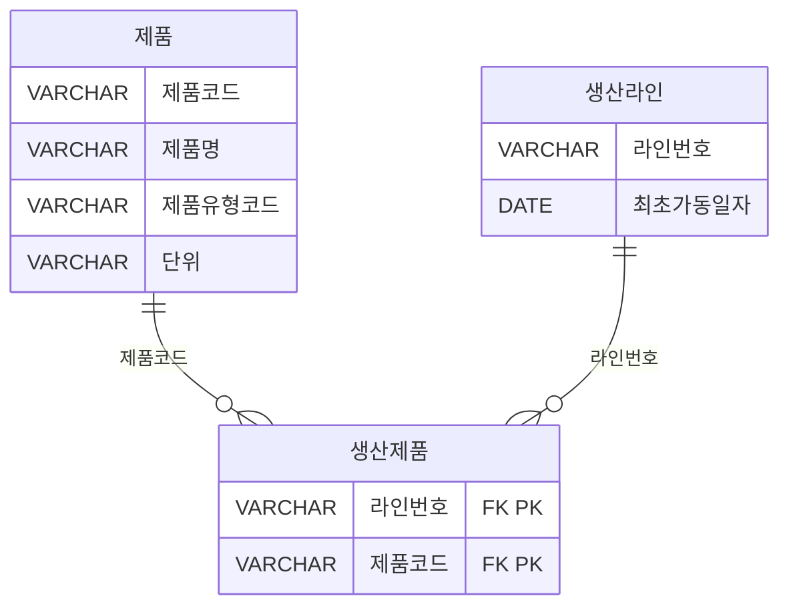

※ 생산제품 테이블의 복합키: 라인번호 + 제품코드


① 제품, 생산제품, 생산라인 엔터티를 Inner Join 하기 위해서 생산제품 엔터티는 WHERE절에 최소 2번이 나타나야 한다.
② 제품과 생산라인 엔터티를 Join시 적절한 Join조건이 없으므로 카티시안곱(Cartesian Product)이 발생한다.
③ 제품과 생산라인 엔터티에는 생산제품과 대응되지 않는 레코드는 없다.
④ 특정 생산라인번호에서 생산되는 제품의 제품명을 알기위해서는 제품,생산제품, 생산라인까지 3개 엔터티의 Inner Join인 필요하다.


**정답** : 1,2

> 1번답안 : 
생산제품 테이블이 두 관계를 연결한다는 점을 강조하려는 의도로 보임. 하지만 WHERE절에 2번 등장해야 한다는 표현은 부정확하고 오해의 소지가 있음.
이처럼 생산제품 테이블은 ON절에서 2번 사용되지만, WHERE절에 2번 등장할 필요는 없음
그래도 굳이 2개 고르라고 했으므로 완전틀린 3,4 제외

```
SELECT ...
FROM 제품 P
JOIN 생산제품 SP ON P.제품코드 = SP.제품코드
JOIN 생산라인 L ON SP.라인번호 = L.라인번호
```

---
### ✅068  
아래의 테이블 스키마 정보를 참고하여, 다음 중 '구매 이력이 있는 고객 중 구매 횟수가 3회 이상인 고객의 이름과 등급을 출력하시오.'라는 질의에 대해 아래 SQL 문장의 (가), (나)에 들어 갈 구문으로 가장 적절한 것은?

```sql
[테이블]
고객(고객번호(PK), 이름, 등급)
구매정보(구매번호(PK), 구매금액, 고객번호(FK))

* 구매정보 테이블의 고객번호는 고객 테이블의 고객번호를 참조하는 외래키(Foreign Key)이다.

[SQL 문장]
SELECT A.이름, A.등급
FROM 고객 A
(가)
GROUP BY A.이름, A.등급
(나)
```

① (가): INNER JOIN 구매정보 B ON A, 고객번호=B, 고객번호
  (나): HAVING SUM(B.구매번호) >=3

② (가): INNER JOIN 구매정보 B ON A.고객번호=B, 고객번호
  (나): HAVING COUNT(B.구매번호) >=3

③ (가): LEFT OUTER JOIN 구매정보 B ON A, 고객번호=B.고객번호
  (나): HAVING SUM(B.구매번호)>=3

④ (가): INNER JOIN 구매정보 B ON A.고객번호=B.고객번호
  (나): WHERE B.구매번호 >=3


**정답** : 2


---

### ✅069  
아래는 어느 회사의 정산 데이터 모델의 일부이며 고객이 서비스를 사용한 시간대에 따라 차등 단가를 적용하려고 한다. 다음 중 시간대별사용량 테이블을 기반으로 고객별 사용금액을 추출하는 SQL으로 가장 적절한 것은?

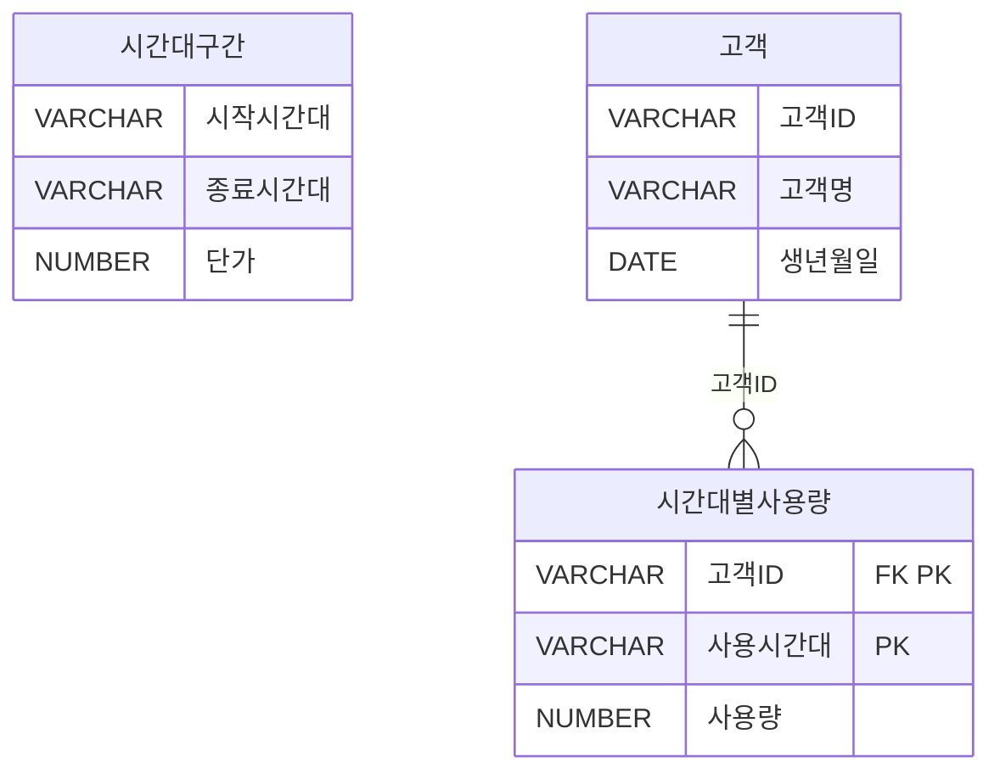

※ 시간대별사용량 테이블의 복합키: 고객ID + 사용시간대

```sql
①  SELECT A.고객ID, A.고객명, SUM(B.사용량 * C.단가) AS 사용금액
FROM 고객 A INNER JOIN 시간대별사용량 B
ON (A.고객ID = B.고객ID) INNER JOIN 시간대구간 C
ON (B.사용시간대 <= C.시작시간대 AND B.사용시간대 >= C.종료시간대)
GROUP BY A.고객ID, A.고객명
ORDER BY A.고객ID, A.고객명;

② SELECT A.고객ID, A.고객명, SUM(B.사용량 * C.가) AS 사용금액
FROM 고객 A INNER JOIN 시간대별사용량 B INNER JOIN 시간대구간 C
ON (A.고객ID = B.고객ID AND B.사용시간대  BETWEEN C.시작시간대 AND C.종료시간대)
GROUP BY A.고객ID, A.고객명
ORDER BY A.고객ID, A.고객명:

③ SELECT A.고객ID, A.고객명, SUM(B.사용량 * C.단가) AS 사용금액
FROM 고객 A INNER JOIN 시간대별사용량 B
ON (A.고객ID = B.고객ID) INNER JOIN 시간대구간 C
ON B.사용시간대 BETWEEN C.시작시간대 AND C.종료시간대
GROUP BY A.고객ID, A.고객명
ORDER BY A.고객ID, A.고객명:

④ SELECT A.고객ID, A.고객명, SUM(B.사용량 * C.단가) AS 사용금액
FROM 고객 A INNER JOIN 시간대별사용량 B
ON (A.고객ID = B.고객ID) BETWEEN JOIN 시간대구간 C
GROUP BY A.고객ID, A.고객명
ORDER BY A.고객ID, A.고객명:
```


**정답** : 3


---

### ✅070  

다음 중 팀(TEAM) 테이블과 구장(STADIUM) 테이블의 관계를 이용해서 소속팀이 가지고 있는 전용구장의 정보를 팀의 정보와 함께 출력하는 SQL을 작성할 때 결과가 다른 것은?
```sql
① SELECT T.REGION_NAME, T.TEAM_NAME, T.STADIUM_ID, S.STADIUM_NAME
FROM TEAM T INNER JOIN STADIUM S
USING (T.STADIUM_ID = S.STADIUM_ID);

② SELECT TEAM.REGION_NAME, TEAM.TEAM_NAME, TEAM.STADIUM_ID, STADIUM.STADIUM_NAME
FROM TEAM INNER JOIN STADIUM
ON (TEAM.STADIUM_ID = STADIUM.STADIUM_ID);

③ SELECT T.REGION_NAME, T.TEAM_NAME, T.STADIUM_ID, S.STADIUM_NAME
FROM TEAM T, STADIUM S
WHERE T.STADIUM_ID = S.STADIUM_ID;

④ SELECT TEAM.REGION_NAME, TEAM.TEAM_NAME, TEAM.STADIUM_ID, STADIUM.STADIUM_NAME
FROM TEAM, STADIUM
WHERE TEAM.STADIUM_ID = STADIUM.STADIUM_ID;
```


**정답** : 1


---

### ✅071  

아래의 사례1은 Cartesian Product를 만들기 위한 SQL 문장이며 사례1과 같은 결과를 얻기 위해 사례2 SQL 문장의 ㉠ 안에 들어갈 내용을 작성하시오.

```sql
[사례1]
SELECT ENAME, DNAME
FROM EMP, DEPT
ORDER BY ENAME;

[사례2]
SELECT ENAME, DNAME
FROM EMP  ㉠ DEPT 
ORDER BY ENAME;
```


**정답** : CROSS JOIN


---

### ✅072  

다음 중 아래 테이블들을 대상으로 SQL 문장을 수행한 결과로 가장 적절한 것은?

[테이블: OS]
| OSID (PK) | OS명     |
|-----------|----------|
| 100       | Android  |
| 200       | IOS      |
| 300       | Bada     |

[테이블: 단말기]
| 단말기ID (PK) | 단말기명 | OSID (FK) |
|---------------|-----------|------------|
| 1000          | A1000     | 100        |
| 2000          | B2000     | 100        |
| 3000          | C3000     | 200        |
| 4000          | D3000     | 300        |

[테이블: 고객]
| 고객번호 (PK) | 고객명 | 단말기ID (FK) |
|----------------|--------|----------------|
| 11000          | 홍길동 | 1000           |
| 12000          | 강감찬 | NULL           |
| 13000          | 이순신 | NULL           |
| 14000          | 안중근 | 3000           |
| 15000          | 고길동 | 4000           |
| 16000          | 이대로 | 4000           |

 


```sql
[SQL]
SELECT A.고객번호, A.고객명, B.단말기ID, B.단말기명, C.OSID, C.OS명
FROM 고객 A LEFT OUTER JOIN 단말기 B
ON (A.고객번호 IN (11000,12000)  AND  A.단말기ID=B.단말기ID)  LEFT OUTER JOIN OS C
ON (B.OSID = C.OSID)
ORDER BY A.고객번호;
```

 ①
| 고객번호 | 고객명 | 단말기ID | 단말기명 | OSID | OS명    |
|----------|--------|-----------|-----------|------|---------|
| 11000    | 홍길동 | 1000      | A1000     | 100  | Android |
| 12000    | 강감찬 | NULL      | NULL      | NULL | NULL    |
| 13000    | 이순신 | NULL      | NULL      | NULL | NULL    |
| 14000    | 안중근 | NULL      | NULL      | NULL | NULL    |
| 15000    | 고길동 | NULL      | NULL      | NULL | NULL    |
| 16000    | 이대로 | NULL      | NULL      | NULL | NULL    |

② 단말기 
| 고객번호 | 고객명 | 단말기ID | 단말기명 | OSID | OS명    |
|----------|--------|-----------|-----------|------|---------|
| 11000    | 홍길동 | 1000      | A1000     | 100  | Android |
| 12000    | 강감찬 | NULL      | NULL      | NULL | NULL    |

③ 
| 고객번호 | 고객명 | 단말기ID | 단말기명 | OSID | OS명    |
|----------|--------|-----------|-----------|------|---------|
| 11000    | 홍길동 | 1000      | A1000     | 100  | Android |


④ 
| 고객번호 | 고객명 | 단말기ID | 단말기명 | OSID | OS명    |
|----------|--------|-----------|-----------|------|---------|
| 11000    | 홍길동 | 1000      | A1000     | 100  | Android |
| 12000    | 강감찬 | NULL      | NULL      | NULL | NULL    |
| 13000    | 이순신 | NULL      | NULL      | NULL | NULL    |
| 14000    | 안중근 | 3000      | C3000     | 200  | iOS     |
| 15000    | 고길동 | 4000      | D4000     | 300  | Bada    |
| 16000    | 이대로 | 4000      | D4000     | 300  | Bada    |

 
**정답** : 1


---

### ✅073  
다음 중 아래 (1), (2), (3)의 SQL에서 실행결과가 같은 것은?

```sql
(1) SELECT A.ID, B.ID
FROM TBL1 A FULL OUTER JOIN TBL2 B
ON A.ID = B.ID

(2) SELECT A.ID, B.ID
FROM TBL1 A LEFT OUTER JOIN TBL2 B
ON A.ID = B.ID
UNION
SELECT A.ID, B.ID
FROM TBL1 A RIGHT OUTER JOIN TBL2 B
ON A.ID = B.ID

(3) SELECT A.ID, B.ID
FROM TBL1 A, TBL2 B
WHERE A.ID = B.ID
UNION ALL
SELECT A.ID, NULL
FROM TBL1 A
WHERE NOT EXISTS (SELECT 1 FROM TBL2 B WHERE A.ID = B.ID)
UNION ALL
SELECT NULL, B.ID
FROM TBL2 B
WHERE NOT EXISTS (SELECT 1 FROM TBL1 A WHERE B.ID = A.ID)
```

① 1, 2
② 1, 3
③ 2, 3
④ 1, 2, 3


**정답** : 4


---

### ✅074  
아래의 EMP 테이블과 DEPT 테이블에서 밑줄 친 속성은 주키이며 EMP.C는 DEPT와 연결된 외래키이다. EMP 테이블과 DEPT 테이블을 LEFT, FULL, RIGHT 외부조인(outer join)하면 생성되는 결과 건수로 가장 적절한 것은?

[ EMP 테이블]
| <u>A</u> | B | C |
|---|---|---|
| 1 | b | w |
| 3 | d | w |
| 5 | y | y |

[DEPT 테이블]
| <u>C</u> | D | E  |
|---|---|----|
| w | 1 | 10 |
| z | 4 | 11 |
| v | 2 | 22 |


① 3건, 5건, 4건
② 4건, 5건, 3건
③ 3건, 4건, 4건
④ 3건, 4건, 5건


**정답** : 1


---

### ✅075  
신규 부서의 경우 일시적으로 사원이 없는 경우도 있다고 가정하고 DEPT와 EMP를 조인하되 사원이 없는 부서 정보도 같이 출력하도록 할 때, 아래 SQL 문장의 (가) 안에 들어갈 내용을 기술하시오.

```sql
SELECT E, ENAME, D. DEPTNO, D. DNAME
FROM  DEPT D  (가)  EMP E
ON    D.DEPTNO = E.DEPTNO;
```


**정답** : LEFT JOIN

---

### ✅076  

다음 중 아래와 같은 데이터 상황에서 SQL의 수행 결과로 가장 적절한 것은?

[ 테이블 1: TAB1]
| C1 | C2 |
|----|----|
| A  | 1  |
| B  | 2  |
| C  | 3  |
| D  | 4  |
| E  | 5  |

[ 테이블 2: TAB2]
| C1 | C2 |
|----|----|
| B  | 2  |
| C  | 3  |
| D  | 4  |


```sql
SELECT *
FROM TABI A LEFT OUTER JOIN TAB2 B
ON (A.C1 = B.C1 AND B.C2 BETWEEN 1 AND 3)
```

 ①
| C1 | C2 | C1 | C2 |
|----|----|----|----|
| A  | 1  | | |
| B  | 2  | B  | 2  |
| C  | 3  |C  | 3  |
| D  | 4  |D  | 4  |
| E  | 5  | |   | 

②
| C1 | C2 | C1 | C2 |
|----|----|----|----|
| A  | 1  | | |
| B  | 2  | B  | 2  |
| C  | 3  |C  | 3  |
| D  | 4  |  |   |
| E  | 5  | |   | 

③
| C1 | C2 | C1 | C2 |
|----|----|----|----|
| A  | 1  | | |
| B  | 2  | B  | 2  |
| C  | 3  |C  | 3  |

④
| C1 | C2 | C1 | C2 |
|----|----|----|----|
| A  | 1  | | |
| B  | 2  | B  | 2  |
| C  | 3  |C  | 3  |
| D  | 4  |D  | 4  |


**정답** : 2


---
### ✅077  
아래와 같은 데이터 모델에서 ORACLE을 기준으로 SQL을 작성하였다. 그러나 SQL Server에서도 동일한 결과를 보장할 수 있도록 ANSI 구문으로 SQL을 변경하려고 한다. 다음 중 아래의 SQL을 ANSI 표준 구문으로 변경한 것으로 가장 적절한 것은?

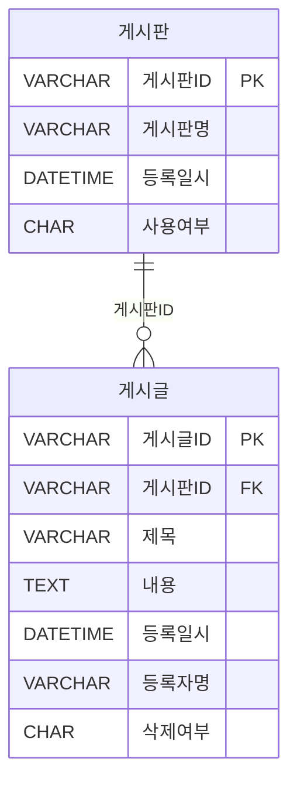

```sql
[SQL]
SELECT A.게시판ID, A.게시판명, COUNT(B.게시글ID) AS CNT
FROM 게시판 A, 게시글 B
WHERE A.게시판ID = B.게시판ID(+)
AND   B.삭제여부(+) = 'N'
AND   A.사용여부 = 'Y'
GROUP BY A.게시판ID, A.게시판명
ORDER BY A.게시판ID;
```

**[보기]**
```sql
① SELECT A.게시판ID, A.게시판명, COUNT(B.게시글ID) AS CNT
FROM    게시판 A LEFT OUTER JOIN 게시글 B
ON (A.게시판ID = B.게시판ID AND B.삭제여부 = 'N')
WHERE A.사용여부 = 'Y'
GROUP BY A.게시판ID, A.게시판명
ORDER BY A.게시판ID;

② SELECT A.게시판ID, A.게시판명, COUNT(B.게시글ID) AS CNT
FROM 게시판 A LEFT OUTER JOIN 게시글 B
ON (A.게시판ID = B.게시판ID AND A.사용여부 = 'Y')
WHERE B.삭제여부 = 'N'
GROUP BY A.게시판ID, A.게시판명
ORDER BY A.게시판ID:

③ SELECT A.게시판ID, A.게시판명, COUNT(B.게시글ID) AS CNT
FROM 게시판 A LEFT OUTER JOIN 게시글 B
ON (A.게시판ID = B.게시판ID)
WHERE A.사용여부 = 'Y' AND B.삭제여부 = 'N'
GROUP BY A.게시판ID, A.게시판명
ORDER BY A.게시판ID;

④ SELECT A.게시판ID, A.게시판명 , COUNT(B.게시글ID) AS CNT
FROM 게시판 A RIGHT OUTER JOIN 게시글 B
ON  (A.게시판ID = B.게시판ID AND A.사용여부 = 'Y' AND B.삭제여부 = 'N')
GROUP BY A.게시판ID, A.게시판명
ORDER BY A.게시판ID:
```


**정답** : 1


---

### ✅078  
다음과 같은 2개의 릴레이션이 있다고 가정하자. student의 기본키는 st_num이고, department의 기본키는 dept_nurn이다. 또한 student의 d_num은 department의 dept_num을 참조하는 외래키이다. 아래 SQL문의 실행 결과 건수는?


```sql
SELECT count(st name)
FROM student s
WHERE not exists
(SELECT *
FROM department d
WHERE s.d_num = d.dept_num  and dept_name = '전자계산학과');
```
 

[테이블 1: Student]
| st_num | st_name | d_num |
|--------|---------|-------|
| 1001   | Yoo     | 10    |
| 1002   | Kim     | 30    |
| 1003   | Lee     | 20    |
| 1004   | Park    | 10    |
| 1005   | Choi    | 20    |
| 1006   | Jeong   | 10    |

[테이블 2: Department]
| dept_num | dept_name       |
|----------|------------------|
| 10       | 컴퓨터공학과       |
| 20       | 원자력공학과       |
| 30       | 전자계산학과       |

 


**정답** : 5


---

### ✅079  
(SQL Server) 다음 중 아래의 SQL과 동일한 결과를 추출하는 SQL은?
(단, 테이블 TAB1, TAB2의 PK 컬럼은 A, B 이다)

```sql
[SQL]
SELECT A, B
FROM TAB1
EXCEPT
SELECT A, B
FROM TAB2;
```

**[보기]**
```sql
① SELECT TAB2.A, TAB2.B
FROM TABI, TAB2
WHERE TABI.A <> TAB2.A
AND TAB1.B <> TAB2.B

② SELECT TAB2.A, TAB2.B
FROM TAB1
WHERE TAB1.A NOT IN (SELECT TAB2.A FROM TAB2)
AND   TAB1.B NOT IN (SELECT TAB2.B FROM TAB2);

③ SELECT TAB2.A, TAB2.B
FROM TAB1, TAB2
WHERE TAB1.A = TAB2.A
AND   TAB1.B = TAB2.B

④ SELECT TAB1.A, TAB1.B
FROM TAB1
WHERE NOT EXISTS 
(SELECT 'X' FROM TAB2 WHERE TAB1.A = TAB2.A AND TAB1.B = TAB2.B);
```


**정답** : 4


---

### ✅080  

아래와 같은 데이터 모델에 대해 SQL을 수행 하였다. 다음 중 수행된 SQL과 동일한 결과를 도출하는 SQL은?

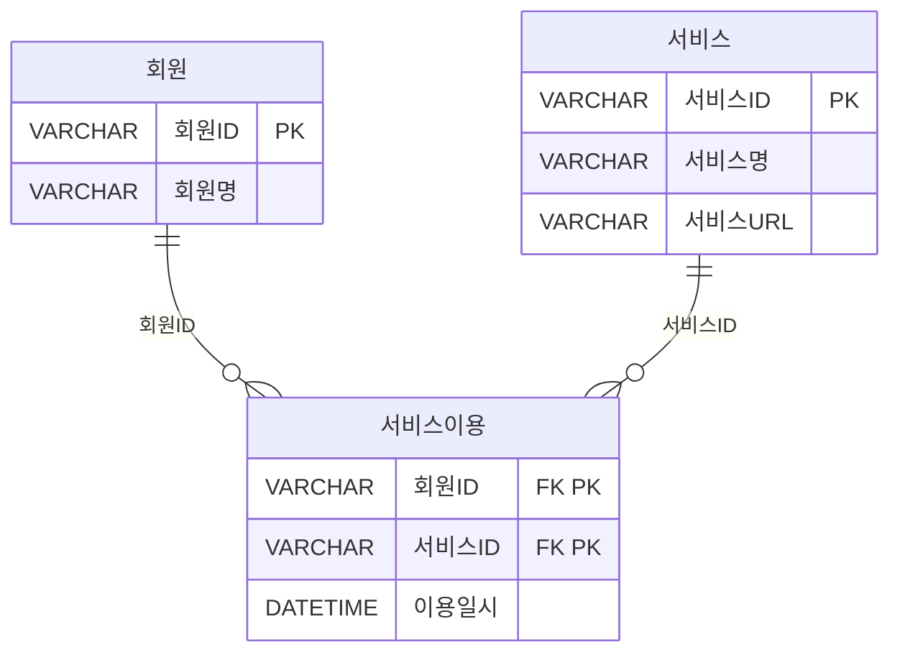

```sql
[수행 SQL]
SELECT A.서비스ID, B.서비스명, B.서비스URL
FROM (SELECT 서비스ID  FROM 서비스
        INTERSECT
        SELECT 서비스ID
        FROM 서비스이용) A.서비스 B
WHERE A.서비스ID = B.서비스ID;
```

**[보기]**
```sql
① SELECT B.서비스ID, A.서비스명, A.서비스URL
FROM 서비스 A , 서비스이용 B
WHERE A.서비스ID = B.서비스ID;

② SELECT X.서비스ID, X.서비스명, X.서비스URL
FROM 서비스 X
WHERE NOT EXISTS (
    SELECT 1
    FROM (SELECT 서비스ID  FROM 서비스
          MINUS
          SELECT 서비스ID  FROM 서비스이용) Y
    WHERE X. 서비스ID = Y. 서비스ID);

③ SELECT B.서비스ID, A.서비스명, A.서비스URL
FROM 서비스 A LEFT OUTER JOIN 서비스이용 B
ON (A.서비스ID = B.서비스ID)
WHERE B.서비스ID IS NULL
GROUP BY B.서비스ID, A.서비스명, A.서비스URL;

④ SELECT A.서비스ID, A.서비스명, A.서비스URL
FROM 서비스 A
WHERE 서비스ID IN (SELECT 서비스ID FROM 서비스이용
                MINUS
                SELECT 서비스ID  FROM 서비스);
```


**정답** : 2


---

### ✅081  
SET OPERATOR 중에서 수학의 교집합과 같은 기능을 하는 연산자로 가장 적절한 것은?
① UNION
② INTERSECT
③ MINUS
④ EXCEPT


**정답** : 2


---

### ✅082  
다음 중 아래의 EMP 테이블의 데이터를 참조하여 실행한 SQL의 결과로 가장 적절한 것은?

```sql
SELECT ENAME AAA, JOB AAB
FROM EMP
WHERE EMPNO = 7369
UNION ALL
SELECT ENAME BBA, JOB BBB
FROM EMP
WHERE EMPNO = 7566
ORDER BY 1, 2;
```

[ 테이블 1: EMP]
| EMPNO | ENAME  | JOB       | MGR  | HIREDATE   | SAL  | COMM | DEPTNO |
|-------|--------|-----------|------|------------|------|------|--------|
| 7369  | SMITH  | CLERK     | 7902 | 1980-12-17 | 800  |   | 20     |
| 7499  | ALLEN  | SALESMAN  | 7698 | 1981-02-20 | 1600 | 300  | 30     |
| 7521  | WARD   | SALESMAN  | 7698 | 1981-02-22 | 1250 | 500  | 30     |
| 7566  | JONES  | MANAGER   | 7839 | 1981-04-02 | 2975 |   | 20     |
| 7654  | MARTIN | SALESMAN  | 7698 | 1981-09-28 | 1250 | 1400 | 30     |
| 7698  | BLAKE  | MANAGER   | 7839 | 1981-05-01 | 2850 |   | 30     |
| 7782  | CLARK  | MANAGER   | 7839 | 1981-06-09 | 2450 |   | 10     |
| 7788  | SCOTT  | ANALYST   | 7566 | 1987-07-13 | 3000 |   | 20     |
| 7839  | KING   | PRESIDENT |   | 1981-11-17 | 5000 |   | 10     |
| 7844  | TURNER | SALESMAN  | 7698 | 1981-09-08 | 1500 | 0    | 30     |
| 7876  | ADAMS  | CLERK     | 7788 | 1987-07-13 | 1100 |   | 20     |
| 7900  | JAMES  | CLERK     | 7698 | 1981-12-03 | 950  |   | 30     |
| 7902  | FORD   | ANALYST   | 7566 | 1981-12-03 | 3000 |   | 20     |
| 7934  | MILLER | CLERK     | 7782 | 1982-01-23 | 1300 |   | 10     |

 

① 
| AAA | AAB     |
|--------|---------|
| SMITH  | CLERK   |
| JONES  | MANAGER |

 
②
| AAA | AAB     |
|--------|---------|
| JONES  | MANAGER |
| SMITH  | CLERK   |
 
③ 
| BBA | BBB     |
|--------|---------|
| SMITH  | CLERK   |
| JONES  | MANAGER |

 
④ 
| BBA | BBB     |
|--------|---------|
| JONES  | MANAGER |
| SMITH  | CLERK   |
 

**정답** : 2


---

### ✅083  
다음 중 아래 TBL1, TBL2 테이블에 대해 SQL을 수행한 결과인 것은?

[테이블 1: TBL1]
| COL1 | COL2 |
|------|------|
| AA   | A1   |
| AB   | A2   |

[테이블 2: TBL2]
| COL1 | COL2 |
|------|------|
| AA   | A1   |
| AB   | A2   |
| AC   | A3   |
| AD   | A4   |

```sql
[SQL]
SELECT COL1, COL2, COUNT(*) AS CNT
FROM (SELECT COL1, COL2 FROM TBL1
      UNION ALL
      SELECT COL1, COL2 FROM TBL2
      UNION
      SELECT COL1, COL2 FROM TBL1)
GROUP BY COL1, COL2;
```


①
| COL1 | COL2 | CNT |
|------|------|-----|
| AA   | A1   | 1   |
| AB   | A2   | 1   |
| AC   | A3   | 1   |
| AD   | A4   | 1   |

②
| COL1 | COL2 | CNT |
|------|------|-----|
| AA   | A1   | 2   |
| AB   | A2   | 2   |
| AC   | A3   | 1   |
| AD   | A4   | 1   |

③
| COL1 | COL2 | CNT |
|------|------|-----|
| AA   | A1   | 3   |
| AB   | A2   | 3   |
| AC   | A3   | 1   |
| AD   | A4   | 1   |

 ④
| COL1 | COL2 | CNT |
|------|------|-----|
| AA   | A1   | 3   |
| AB   | A2   | 3   |
| AC   | A3   | 2   |
| AD   | A4   | 2   |


**정답** : 3

```
✅ UNION vs UNION ALL 복습
UNION → 중복 제거
UNION ALL → 중복 유지

SQL 실행 순서 분석

1. `SELECT COL1, COL2 FROM TBL1`  
   → 2 rows: AA/A1, AB/A2

2. `UNION ALL` with TBL2  
   → 4 rows added: AA/A1, AB/A2, AC/A3, AD/A4  
   → 총 6 rows

3. `UNION` with TBL1  
   → TBL1 has AA/A1, AB/A2  
   → `UNION` removes duplicates  
   → AA/A1, AB/A2 already exist → no new rows added  
   → 총 여전히 6 rows
```


---

### ✅084  

다음 중 아래에서 테이블 T1, T2에 대한 가, 나 두 개의 쿼리 결과 조회되는 행의 수로 가장 적절한 것은?

[ 테이블 1: T1]
| A  | B  | C  |
|----|----|----|
| A3 | B2 | C3 |
| A1 | B1 | C1 |
| A2 | B1 | C2 |

[테이블 2: T2]
| A  | B  | C  |
|----|----|----|
| A1 | B1 | C1 |
| A3 | B2 | C3 |

```sql
가. SELECT A, B, C FROM R1
UNION ALL
SELECT A, B, C FROM R2

나. SELECT A, B, C FROM R1
UNION
SELECT A, B, C FROM R2
```
① 가: 5개, 나: 3개
② 가: 5개, 나: 5개
③ 가: 3개, 나: 3개
④ 가: 3개, 나: 5개


**정답** : 1


---

### ✅085  

다음 중 아래와 같은 집합이 존재 할 때, 집합 A와 B에 대하여 집합연산을
수행한 결과 집합 C가 되는 경우 이용되는 데이터베이스 집합연산은?

```sql
집합 A = {가, 나, 다, 라},
집합 B = {다, 라, 마, 바},
집합 C = {다, 라}
```

① Union
② Difference
③ Intersection
④ Product


**정답** : 3


---

### ✅086  

아래와 같은 데이터 모델에 대한 설명으로 가장 적절한 것은? (단, 시스템적으로 회원기본정보와 회원상세정보는 1:1, 양쪽 필수 관계임을 보장한다.)

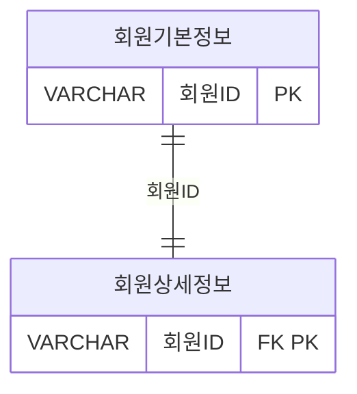

① 회원ID 컬럼을 대상으로 (회원기본정보 EXCEPT 회원상세정보) 연산을
수행하면 회원상세정보가 등록되지 않은 회원ID가 추출된다.
② 회원ID 컬럼을 대상으로 (회원기본정보 UNION ALL 회원상세정보)
연산을 수행한 결과의 건수는 회원기본정보의 전체건수와 동일하다.
③ 회원ID 컬럼을 대상으로 (회원기본정보 INTERSECT 회원상세정보)
연산을 수행한 결과의 건수와 두 테이블을 회원ID로 JOIN 연산을 수행한
결과의 건수는 동일하다.
④ 회원ID 컬럼을 대상으로 (회원기본정보 INTERSECT 회원상세정보)
연산을 수행한 결과와 (회원기본정보 UNION 회원상세정보) 연산을
수행한 결과는 다르다.


**정답** : 3

---

### ✅087  

아래와 같은 데이터 상황에서 아래의 SQL을 수행할 경우 정렬 순서상 2번째 표시될 값을 적으시오.

[TAB1]
| C1 | C2 | C3 |
|----|----|----|
|  1 |    | A  |
|  2 |  1 | B  |
|  3 |  1 | C  |
|  4 |  2 | D  |


```sql
SELECT C3
FROM TAB1
START WITH C2 IS NULL
CONNECT BY PRIOR C1 = C2
ORDER SIBLINGS BY C3 DESC
```


**정답** : C


---
### ✅088  
다음 중 Oracle 계층형 질의에 대한 설명으로 가장 부적절한 것은?

① START WITH절은 계층 구조의 시작점을 지정하는 구문이다.
② ORDER SIBLINGS BY절은 형제 노드 사이에서 정렬을 지정하는 구문이다.
③ 순방향전개란 부모 노드로부터 자식 노드 방향으로 전개하는 것을 말한다.
④ 루트 노드의 LEVEL 값은 0이다.


**정답** : 4

---
### ✅089  

다음 중 아래와 같은 사원 테이블에 대해서 SQL을 수행하였을 때의 결과로 가장 적절한 것은? 

 
[테이블 : 사원]
| 사원번호 (PK) | 사원명 | 입사일자   | 매니저사원번호 (FK) |
|---------------|--------|------------|----------------------|
| 001           | 홍길동 | 2012-01-01 | NULL                 |
| 002           | 강감찬 | 2012-01-01 | 001                  |
| 003           | 이순신 | 2013-01-01 | 001                  |
| 004           | 이민정 | 2013-01-01 | 001                  |
| 005           | 이병헌 | 2013-01-01 | NULL                 |
| 006           | 안성기 | 2014-01-01 | 005                  |
| 007           | 이수근 | 2014-01-01 | 005                  |
| 008           | 김병만 | 2014-01-01 | 005                  |


```sql
[SQL]
SELECT 사원번호, 사원명, 입사일자, 매니저사원번호
FROM 사원
START WITH 매니저사원번호 IS NULL
CONNECT BY PRIOR 사원번호 = 매니저사원번호
AND 입사일자 BETWEEN '2013-01-01' AND '2013-12-31'
ORDER SIBLINGS BY 사원번호:
```
 
① 
| 사원번호 (PK) | 사원명 | 입사일자   | 매니저사원번호 (FK) |
|---------------|--------|------------|----------------------|
| 001           | 홍길동 | 2012-01-01 | NULL                 |
| 003           | 이순신 | 2013-01-01 | 001                  |
| 004           | 이민정 | 2013-01-01 | 001                  |
| 005           | 이병헌 | 2013-01-01 | NULL                 |

② 사원 테이블
| 사원번호 (PK) | 사원명 | 입사일자   | 매니저사원번호 (FK) |
|---------------|--------|------------|----------------------|
| 003           | 이순신 | 2013-01-01 | 001                  |
| 004           | 이민정 | 2013-01-01 | 001                  |
| 005           | 이병헌 | 2013-01-01 | NULL                 |

③ 사원 테이블
| 사원번호 (PK) | 사원명 | 입사일자   | 매니저사원번호 (FK) |
|---------------|--------|------------|----------------------|
| 001           | 홍길동 | 2012-01-01 | NULL                 |

④ 사원 테이블
| 사원번호 (PK) | 사원명 | 입사일자   | 매니저사원번호 (FK) |
|---------------|--------|------------|----------------------|
| 001           | 홍길동 | 2012-01-01 | NULL                 |
| 005           | 이병헌 | 2013-01-01 | NULL                 |
| 006           | 안성기 | 2014-01-01 | 005                  |
| 007           | 이수근 | 2014-01-01 | 005                  |
| 008           | 김병만 | 2014-01-01 | 005                  |
 

**정답** : 1

---

### ✅090  
다음 중 계층형 질의문에 대한 설명으로 가장 부적절한 것은?

① SQL Server에서의 계층형 질의문은 CTE(Common Table Expression)를 재귀 호출함으로써 계층 구조를 전개한다.
② SQL Server에서의 계층형 질의문은 앵커 멤버를 실행하여 기본 결과 집합을 만들고 이후 재귀 멤버를 지속적으로 실행한다.
③ 오라클의 계층형 질의문에서 WHERE 절은 모든 전개를 진행한 이후 필터 조건으로서 조건을 만족하는 데이터만을 추출하는데 활용된다.
④ 오라클의 계층형 질의문에서 PRIOR 키워드는 CONNECT BY 절에만 사용할 수 있으며 'PRIOR 자식 = 부모' 형태로 사용하면 순방향 전개로 수행 된다.


**정답** : 4

---

### ✅091  
아래 [부서]와 [매출] 테이블에 대해서 SQL 문장을 실행하여 아래 [결과]와 같이 데이터가 추출 되었다. 다음 중 동일한 결과를 추출하는 SQL 문장은?

[테이블 1: 부서]
| 부서코드(PK) | 부서명         | 상위부서코드 |
|----------|----------------|---------------|
| 100      | 아시아부       | NULL          |
| 110      | 한국지사       | 100           |
| 111      | 서울지점       | 110           |
| 112      | 부산지점       | 110           |
| 120      | 일본지사       | 100           |
| 121      | 도쿄지점       | 120           |
| 122      | 오사카지점     | 120           |
| 130      | 중국지사       | 100           |
| 131      | 베이징지점     | 130           |
| 132      | 상하이지점     | 130           |
| 200      | 남유럽지부         | NULL          |
| 210      | 스페인지사     | 200           |
| 211      | 마드리드지점       | 210           |
| 212      | 그라나다지점       | 210           |
| 220      | 포르투갈지사       | 200           |
| 221      | 리스본지점     | 220           |
| 222      | 포르투지점 | 220         |

[테이블 2: 매출]
| 부서코드 | 매출액 |
|----------|--------|
| 111      | 1000   |
| 112      | 2000   |
| 121      | 1500   |
| 122      | 1000   |
| 131      | 1500   |
| 132      | 2000   |
| 211      | 2000   |
| 212      | 1500   |
| 221      | 1000   |
| 222      | 2000   |

[테이블 3: 결과]
| 부서코드 | 부서명     | 상위부서코드 | 매출액 | LVL |
|----------|------------|---------------|--------|-----|
| 100      | 아시아지부   | NULL           | NULL   | 2   |
| 120      | 일본지사  | 100           | NULL   | 1   |
| 121      | 도쿄지점   | 120           | 1500   | 2   |
| 122      | 오사카지점 | 120           | 1000   | 2   |

 
```sql
① SELECT A.부서코드, A.부서명, A.상위부서코드, B.매출액, LVL
FROM (SELECT 부서코드, 부서명, 상위부서코드, LEVEL AS LVL 
        FROM 부서
        START WITH 부서코드 = '120'
        CONNECT BY PRIOR 상위부서코드 = 부서코드
        UNION
        SELECT 부서코드, 부서명, 상위부서코드, LEVEL AS LVL
        FROM 부서
        START WITH 부서코드 = '120'
        CONNECT BY 상위부서코드 = PRIOR 부서코드) A LEFT  OUTER JOIN 매출 B
ON (A.부서코드 = B.부서코드)
ORDER BY A.부서코드;

② SELECT A.부서코드, A.부서명, A.상위부서코드, B.매출액, LVL
        FROM (SELECT 부서코드, 부서명, 상위부서코드, LEVEL AS LVL
        FROM 부서
        START WITH 부서코드 = '100'
        CONNECT BY 상위부서코드 = PRIOR 부서코드) A LEFT  OUTER JOIN 매출 B
ON (A.부서코드 = B.부서코드)
ORDER BY A.부서코드;

③ SELECT A.부서코드, A.부서명, A.상위부서코드, B.매출액, LVL
FROM (SELECT 부서코드, 부서명, 상위부서코드, LEVEL AS LVL
    FROM 부서
    START WITH 부서코드 = '121'
    CONNECT BY PRIOR 상위부서코드 = 부서코드) A LEFT OUTER JOIN 매출 B
ON (A.부서코드 = B.부서코드)
ORDER BY A.부서코드;

④ SELECT A.부서코드, A.부서명, A.상위부서코드, B.매출액, LVL
FROM (SELECT 부서코드, 부서명, 상위부서코드, LEVEL AS LVL
        FROM 부서
        START WITH 부서코드 = (SELECT 부서코드
                                FROM 부서
                                WHERE 상위부서코드 IS NULL
                                START WITH 부서코드  = '120'
                                CONNECT BY PRIOR
                                상위부서코드 = 부서코드)
        CONNECT BY 상위부서코드 = PRIOR 부서코드) A LEFT
        OUTER JOIN 매출 B
ON (A.부서코드 = B.부서코드)
ORDER BY A.부서코드;
```

**정답** : 1


---

### ✅092  

다음 중 SELF JOIN을 수행해야 할 경우로 가장 적절한 것은?
① 한 테이블 내에서 두 칼럼이 연관 관계가 있다.
② 두 테이블에 연관된 칼럼은 없으나 JOIN을 해야 한다.
③ 두 테이블에 공통 칼럼이 존재하고 두 테이블이 연관 관계가 있다.
④ 한 테이블 내에서 연관된 칼럼은 없으나 JOIN을 해야 한다.


**정답** : 1

---

### ✅093  
아래와 같이 일자별매출 테이블이 존재할 때 아래 결과처럼 일자별 누적 매출액을 SQL로 구하려고 한다. WINDOW FUNCTION을 사용하지 않고 일자별 누적매출액을 구하는 SQL로 옳은 것은?

[테이블 1: 일자별매출]
| 일자         | 매출액 |
|--------------|--------|
| 2015.11.01   | 1000   |
| 2015.11.02   | 1000   |
| 2015.11.03   | 1000   |
| 2015.11.04   | 1000   |
| 2015.11.05   | 1000   |
| 2015.11.06   | 1000   |
| 2015.11.07   | 1000   |
| 2015.11.08   | 1000   |
| 2015.11.09   | 1000   |
| 2015.11.10   | 1000   |

[테이블 2: 일자별 누적매출액]
| 일자         | 누적매출액 |
|--------------|------------|
| 2015.11.01   | 1000       |
| 2015.11.02   | 2000       |
| 2015.11.03   | 3000       |
| 2015.11.04   | 4000       |
| 2015.11.05   | 5000       |
| 2015.11.06   | 6000       |
| 2015.11.07   | 7000       |
| 2015.11.08   | 8000       |
| 2015.11.09   | 9000       |
| 2015.11.10   | 10000      |
 
```sql
① SELECT A.일자, SUM(A.매출액) AS 누적매출액
FROM 일자별매출 A
GROUP BY A.일자
ORDER BY A.일자;

② SELECT B.일자, SUM(B.매출액) AS 누적매출액
FROM 일자별매출 A JOIN 일자별매출 B ON (A.일자 >= B.일자)
GROUP BY B, 일자
ORDER BY B.일자;

③ SELECT A.일자, SUM(B.매출액) AS 누적매출액
FROM 일자별매출 A JOIN 일자별매출 B ON (A.일자 >= B.일자)
GROUP BY A.일자
ORDER BY A.일자:

④ SELECT A.일자
, (SELECT SUM(B.매출액)
    FROM 일자별매출 B WHERE B.일자 >= A.일자) AS 누적매출액
FROM 일자별매출 A
GROUP BY A.일자
ORDER BY A.일자:
```

**정답** : 3


---

### ✅094  

다음 중 아래의 SQL 수행 결과로 가장 적절한 것은?
```
SELECT COUNT(DISTINCT A||B)
FROM EMP
WHERE D = (SELECT D FROM DEPT WHERE E = 'i'):
```

[테이블 1: EMP 테이블]
| A | B | C | D |
|---|---|---|---|
| 1 | a | 1 | x |
| 2 | a | 1 | x |
| 3 | b | 2 | y |

[ 테이블 2: DEPT 테이블]
| D | E | F |
|---|---|---|
| x | i | 5 |
| y | m | 6 |


① 0
② 1
③ 2  
④ 3 


**정답** : 3


---

### ✅095  

아래는 서브쿼리에 대한 설명이다. 다음 중 올바른 것끼리 묶인 것은?

```
가) 서브쿼리는 단일 행 (Single Row) 또는 복수행(Multi Row) 비교 연산자와 함께 사용할 수 있다.
나) 서브쿼리는 SELECT 정, FROM 절, HAVING 절, ORDER BY 절 등에서 사용이 가능하다.
다) 서브쿼리의 결과가 복수행(Multi Row) 결과를 반환하는 경우에는 '=','<=', '=>' 등의 연산자와 함께 사용이 가능하다.
라) 연관(Correlated) 서브쿼리는 서브쿼리가 메인쿼리 컬럼을 포함하고 있는 형태의 서브쿼리이다.
마) 다중 컬럼 서브쿼리는 서브쿼리의 결과로 여러 개의 컬럼이 반환되어 메인쿼리의 조건과 동시에 비교되는 것을 의미하며 Oracle 및 SQL Server 등의 DBMS에서 사용 할 수 있다.
```

① 나, 라, 마
② 가, 나, 라
③ 나, 다, 라
④ 가, 나, 마


**정답** : 2


---

### ✅096  

아래 테이블은 어느 회사의 사원들과 이들이 부양하는 가족에 대한 것으로 밑줄 친 칼럼은 기본키(Primary Key)를 표시한 것이다. 다음 중 '현재 부양하는 가족들이 없는 사원들의 이름을 구하라'는 질의에 대해 아래 SQL 문장의 (가) , (나) 들어 갈 내용으로 가장 적절한 것은?


[테이블]
사원 (<u>사번</u>, 이름, 나이)
가족 (<u>이름</u>, 나이, 부양사번)
※ 가족 테이블의 부양사번은 사원 테이블의 사번을 참조하는 외래키(Foreign Key)이다.

```sql
[SQL 문장]
SELECT 이름
FROM 사원
WHERE  (가) (SELECT * FROM 가족 WHERE  (나)  )
```
① (가): EXISTS      (나): 사번 = 부양사번
② (가): EXISTS      (나): 사번 <> 부양사번
③ (가): NOT EXISTS  (나): 사번 = 부양사번
④ (가): NOT EXISTS  (나): 사번 <> 부양사번

 
**정답** : 3 
  

---

### ✅097  

다음 중 아래의 ERD를 참조하여 아래 SQL과 동일한 결과를 출력하는 SQL로 가장 부적절한 것은?

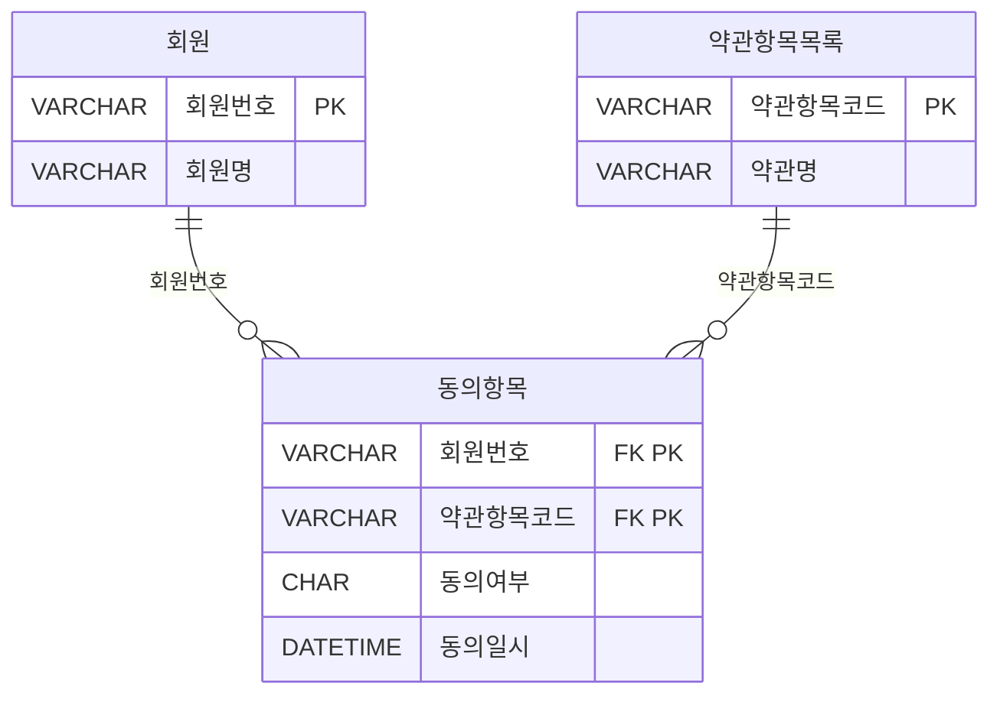

```sql
[SQL]
SELECT A.회원번호, A.회원명
FROM 회원 A, 동의항목 B
WHERE A.회원번호 = B.회원번호
GROUP BY A.회원번호, A.회원명
HAVING COUNT(CASE WHEN B.동의여부 = 'N' THEN 0 ELSE NULL END) >= 1
ORDER BY A.회원번호:
```

**[보기]**
```sql
① SELECT A.회원번호, A.회원명
FROM 회원 A
WHERE EXISTS (SELECT 1 FROM 동의항목 B
              WHERE A.회원번호 = B.회원번호 AND B.동의여부 = 'N')
ORDER BY A.회원번호;

② SELECT A.회원번호, A.회원명
FROM 회원 A
WHERE A.회원번호 IN (SELECT B.회원번호 FROM 동의항목 B WHERE B.동의여부 = 'N')
ORDER BY A.회원번호:

③ SELECT A.회원번호, A.회원명
FROM 회원 A
WHERE 0 < (SELECT COUNT(*) FROM 동의항목 B WHERE B.동의여부 = 'N')
ORDER BY A.회원번호:

④ SELECT A.회원번호, A.회원명
FROM 회원 A, 동의항목 B
WHERE A.회원번호 = B.회원번호 AND B.동의여부 = 'N'
GROUP BY A.회원번호, A.회원명
ORDER BY A.회원번호:
```


**정답** : 3


---
### ✅098  

아래의 데이터 모델을 기준으로 SQL을 작성하였다. 다음 중 아래의 SQL에 대해 가장 바르게 설명한 것은?

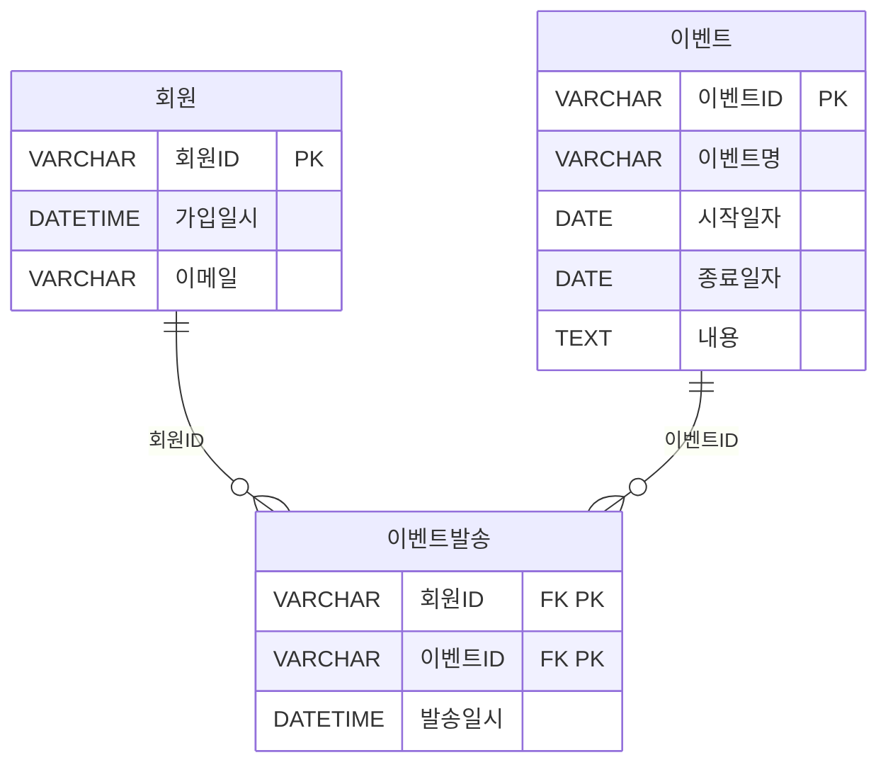

```sql
[SQL]
SELECT A.회원ID, A.회원명, A.이메일
FROM 회원 A
```
```sql
(가)
WHERE EXISTS (SELECT 'X'
                FROM 이벤트 B.메일발송 C
                WHERE B.시작일자 >= '2014.10.01'
                AND B.이벤트ID = C.이벤트ID
```
```sql
(나)
                AND A.회원ID = C.회원ID
```
```sql
(다)
                HAVING COUNT(*) < (SELECT COUNT(*)
                                FROM 이벤트
                                WHERE 시작일자 >='2014.10.01'));
```

① 이벤트 시작일자가 '2014.10.01'과 같거나 큰 이벤트를 대상으로 이메일이 발송된 기록이 있는 모든 회원을 추출하는 SQL이다.
② (나)을 제거하고  (가)의 EXISTS 연산자를 IN연산자로 변경해도 결과는 동일하다.
③ (다)은 이벤트 시작일자가 '2014.10.01'과 같거나 큰 이벤트건수와 그 이벤트들을 기준으로 회원별 이메일 발송건수를 비교하는 것이다.
④ GROUP BY 및 집계함수를 사용하지 않고 HAVING절을 사용하였으므로 SQL이 실행되지 못하고 오류가 발생한다.


**정답** : 3

---

### ✅099  
다음 중 서브쿼리에 대한 설명으로 가장 적절한 것은?

① 단일 행 서브쿼리는 서브쿼리의 실행 결과가 항상 한 건 이하인 서브쿼리로서 IN, ALL 등의 비교 연산자를 사용하여야 한다.
② 다중 행 서브쿼리 비교 연산자는 단일 행 서브쿼리의 비교 연산자로도 사용할 수 있다.
③ 연관 서브쿼리는 주로 메인쿼리에 값을 제공하기 위한 목적으로 사용한다.
④ 서브 쿼리는 항상 메인쿼리에서 읽혀진 데이터에 대해 서브쿼리에서 해당 조건이 만족하는지를 확인하는 방식으로 수행된다.


**정답** : 2

---

### ✅100  
다음 중 아래 SQL에 대한 설명으로 가장 부적절한 것은?
```sql
[SQL]
SELECT B.사원번호, B.사원명, A.부서번호, A.부서명 
 , (SELECT COUNT(*) FROM 부양가족 Y WHERE Y.사원번호 = B.사원번호) AS 부양가족수
FROM 부서 A, (SELECT *
            FROM 사원
            WHERE 입사년도 = '2014') B
WHERE A.부서번호 = B.부서번호
AND EXISTS (SELECT 1 FROM 사원 X WHERE X. 부서번호 = A.부서번호);
```

① 위 SQL에는 다중 행 연관 서브쿼리, 단일 행 연관 서브쿼리, Inline View 가 사용되었다.
② SELECT절에 사용된 서브쿼리는 스칼라 서브쿼리라고도하며, 이러한 형태의 서브쿼리는 JOIN 으로 동일한 결과를 추출할 수도 있다.
③ WHERE 절의 서브쿼리에 사원 테이블 검색 조건으로 입사년도 조건을 FROM절의 서브쿼리와 동일하게 추가해야 원하는 결과를 추출할 수 있다.
④ FROM 절의 서브쿼리는 동적 뷰(Dynamic View)라고도 하며, SQL 문장 중 테이블 명이 올 수 있는 곳에서 사용할 수 있다.

**정답** : 3

---

### ✅101  

아래와 같은 데이터 모델에서 평가대상상품에 대한 품질평가항목별 최종 평가결과를 추출하는 SQL 문장으로 옳은 것은? (단, 평가항목에 대한 평가(평가등급)가 기대수준에 미치지 못할 경우 해당 평가항목에 대해서만 재평가를 수행한다)

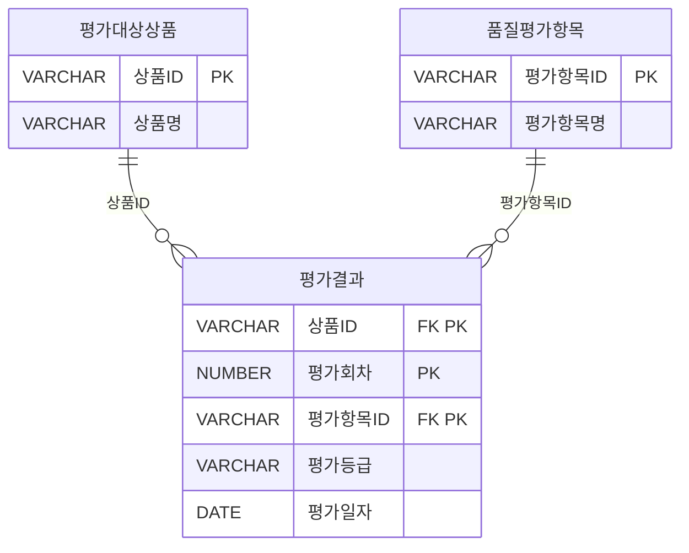

**[보기]**
```sql
① SELECT B.상품ID, B.상품명, C.평가항목ID, C.평가항목명, 
         A.평가회차, A.평가등급, A.평가일자
FROM 평가결과 A, 평가대상상품 B, 품질평가항목 C,
      (SELECT MAX(평가회차) AS 평가회차 FROM 평가결과) D
WHERE A.상품ID = B.상품ID
AND   A.평가항목ID = C.평가항목ID
AND   A.평가회차 = D. 평가회차;

② SELECT B.상품ID, B.상품명, C.평가항목ID, C.평가항목명, 
      A.평가회차, A.평가등급, A.평가일자
FROM  평가결과 A, 평가대상상품 B, 품질평가항목 C
WHERE A.상품ID = B.상품ID
AND   A.평가항목ID = C.평가항목ID
AND   A.평가회차 = ( SELECT MAX(X.평가회차)
                    FROM 평가결과 X
                    WHERE X.상품ID = B.상품ID 
                    AND   X.평가항목ID = C.평가항목ID);

③ SELECT B.상품ID, B.상품명, C.평가항목ID, C.평가항목명
            ,MAX(A.평가회차) AS 평가회차
            ,MAX(A.평가등급) AS 평가등급
            ,MAX(A.평가일자) AS 평가일자
FROM   평가결과 A, 평가대상상품 B, 품질평가항목 C
WHERE  A.상품ID = B.상품ID
AND    A.평가항목ID = C.평가항목ID
GROUP BY  B.상품ID, B.상품명, C.평가항목ID, C.평가항목명;

④ SELECT B.상품ID, B.상품명, C.평가항목ID, C.평가항목명, A.평가회차,
         A.평가등급, A.평가일자
FROM (SELECT 상품ID, 평가항목ID
        ,MAX(평가회차) AS 평가회차
        ,MAX(평가등급) AS 평가등급
        ,MAX(평가일자) AS 평가일자
      FROM 평가결과
      GROUP BY 상품ID, 평가항목 ID) A, 평가대상상품 B, 품질평가항목 C
WHERE A.상품ID = B.상품ID
AND   A.평가항목ID = C.평가항목ID;
```

**정답** : 2


---

### ✅102  
아래 부서 테이블의 담당자 변경을 위해 부서임시 테이블에 입력된 데이터를 활용하여 주기적으로 부서 테이블을 아래 결과와 같이 반영하기 위한 SQL으로 가장 적절한 것은?(단, 부서임시 테이블에서 변경일자를 기준으로 가장 최근에 변경된 데이터를 기준으로 부서 테이블에 반영되어야 한다)

[테이블 1: 부서지]
| 부서코드(PK) | 부서명         | 상위부서코드 | 담당자   |
|--------------|----------------|---------------|----------|
| A001         | 대표이사       | NULL          | 김대표   |
| A002         | 영업본부        | A001       | 홍길동  |
| A003         | 경영지원본부     | A001          | 이순신   |
| A004         |  마케팅본부   | A001          | 강감찬  |
| A005         | 해외영업팀   | A002          | 이청용  |
| A006         | 국내영업팀    | A002          | 박지성   |
| A007         | 총무팀     | A003          | 차두리  |
| A008         | 인사팀     | A003          | 이민정   |
| A009         | 해외마케팅팀     | A004          | 이병헌   |
| A010         | 국내마케팅팀     | A004          | 차승원   |

[테이블 2: 부서임시]
| 변경일자     | 부서코드(PK) | 담당자 |
|--------------|--------------|--------|
| 2014.01.23   | A007         | 이달자 |
| 2015.01.25   | A007       | 홍경민 |
| 2015.01.25   | A008         | 유재석 |

[테이블 3: 결과]
| 부서코드(PK) | 부서명         | 상위부서코드 | 담당자   |
|--------------|----------------|---------------|----------|
| A001         | 대표이사       | NULL          | 김대표   |
| A002         | 영업본부        | A001       | 홍길동  |
| A003         | 경영지원본부     | A001          | 이순신   |
| A004         |  마케팅본부   | A001          | 강감찬  |
| A005         | 해외영업팀   | A002          | 이청용  |
| A006         | 국내영업팀    | A002          | 박지성   |
| A007         | 총무팀     | A003          | 홍경민  |
| A008         | 인사팀     | A003          | 유재석   |
| A009         | 해외마케팅팀     | A004          | 이병헌   |
| A010         | 국내마케팅팀     | A004          | 차승원   |

**[보기]**
```sql
① UPDATE 부서 A SET 담당자 = (SELECT C.부서코드
    FROM (SELECT 부서코드, MAX(변경일자) AS 변경일자
            FROM 부서임시
            GROUP BY 부서코드) B, 부서임시 C
    WHERE B.부서코드 = C.부서코드
    AND   B.변경일자 = C.변경일자
    AND   A.부서코드 = C.부서코드);

② UPDATE 부서 A SET 담당자 = (SELECT C.부서코드
    FROM (SELECT 부서코드, MAX(변경일자) AS 변경일자
            FROM 부서임시
            GROUP BY 부서코드) B, 부서임시 C
    WHERE B.부서코드 = C.부서코드
    AND B.변경일자 = C.변경일자
    AND A.부서코드 = C.부서코드)
  WHERE EXISTS (SELECT 1 FROM 부서 X WHERE A.부서코드 = X.부서코드);

③ UPDATE 부서 A SET 담당자 = (SELECT B.담당자
    FROM 부서임시 B
    WHERE B.부서코드 = A.부서코드
    AND B.변경일자 = (SELECT MAX(C.변경일자)
                    FROM 부서임시 C 
                    WHERE  C.부서코드 = B.부서코드))
 WHERE 부서코드 IN (SELECT 부서코드 FROM 부서임시);

④ UPDATE 부서 A SET 담당자 = (SELECT B.담당자
    FROM 부서임시 B
    WHERE B.부서코드 = A.부서코드
    AND B.변경일자 = '2015.01.25.');
```


**정답** : 3


---
### ✅103  
다음 중 뷰(View)에 대한 설명으로 가장 부적절한 것은?
① 뷰는 단지 정의만을 가지고 있으며, 실행 시점에 질의를 재작성하여 수행한다.
② 뷰는 복잡한 SQL 문장을 단순화 시켜주는 장점이 있는 반면, 테이블 구조가 변경되면 응용 프로그램을 변경해 주어야 한다.
③ 뷰는 보안을 강화하기 위한 목적으로도 활용할 수 있다.
④ 실제 데이터를 저장하고 있는 뷰를 생성하는 기능을 지원하는 DBMS도 있다.


**정답** : 2


---
### ✅104  
아래 테이블에 대한 [뷰 생성 스크립트]를 실행한 후, 조회 SQL의 실행결과로 맞는 것은?

 
[TBL]
| C1 | C2  |
|----|-----|
| A  | 100 |
| B  | 200 |
| B  | 100 |
| B  |   |
|    | 200 |

 
```sql
[뷰 생성 스크립트]
CREATE VIEW V_TBL
AS
SELECT *
FROM TBL
WHERE CI = 'B' OR C1 IS NULL

[조회 SQL]
SELECT SUM(C2) C2
FROM V TBL
WHERE C2 >= 200 AND C1 = 'B'
```

① 0 
② 200
③ 300 
④ 400


**정답** : 2


---

### ✅105  
다음 중 아래의 테이블에서 SQL을 실행할 때 결과로 가장 적절한 것은?

[테이블 : 서비스]

| 서비스ID(PK) | 서비스명 |
|--------------|-----------|
| 001          | 서비스1   |
| 002          | 서비스2   |
| 003          | 서비스3   |
| 004          | 서비스4   |


[테이블 : 서비스가입]
| 회원번호(PK) | 서비스ID(PK) | 가입일자    |
|--------------|---------------|-------------|
| 1            | 001           | 2013-01-01  |
| 1            | 002           | 2013-01-02  |
| 2            | 001           | 2013-01-01  |
| 2            | 002           | 2013-01-02  |
| 2            | 003           | 2013-01-03  |
| 3            | 001           | 2013-01-01  |
| 3            | 002           | 2013-01-02  |
| 3            | 003           | 2013-01-03  |

 
```sql
[SQL]
SELECT CASE WHEN GROUPING(A.서비스ID) = 0 
            THEN A.서비스ID
            ELSE '함게' END AS 서비스ID
      ,CASE WHEN GROUPING(B, 가입일자) = 0
            THEN NVL(B, 가입일자, '-') ELSE '소재' END AS 가입일자
      ,COUNT(B.회원번호) AS 가입건수
FROM 서비스 A LEFT OUTER JOIN 서비스가입 B
ON (    A.서비스ID = B.서비스ID
    AND B.가입일자 BETWEEN '2013-01-01' AND '2013-01-31')
GROUP BY ROLLUP (A.서비스ID, B.가입일자);
```

 

①
| 서비스ID | 가입일자 | 가입건수 |
|---|---|---|
| 001 | 2013-01-01 | 3 |
| 001 | 소계 | 3 |
| 002 | 2013-01-02 | 3 |
| 002 | 소계 | 3 |
| 003 | 2013-01-03 | 2 |
| 003 | 소계 | 2 |
| 합계 | 소계 | 8 |

②
| 서비스ID | 가입일자 | 가입건수 |
|---|---|---|
| 001 | 2013-01-01 | 3 |
| 002 | 2013-01-02 | 3 |
| 003 | 2013-01-03 | 2 |
| 합계 | 소계 | 8 |

③
| 서비스ID | 가입일자 | 가입건수 |
|---|---|---|
| 001 | 2013-01-01 | 3 |
| 001 | 소계 | 3 |
| 002 | 2013-01-02 | 3 |
| 002 | 소계 | 3 |
| 003 | 2013-01-03 | 2 |
| 003 | 소계 | 2 |
| 004 | - | 0 |
| 004 | 소계 | 0 |
| 합계 | 소계 | 8 |

④
| 서비스ID | 가입일자 | 가입건수 |
|---|---|---|
| 001 | 2013-01-01 | 3 |
| 002 | 2013-01-02 | 3 |
| 003 | 2013-01-03 | 2 |
| 004 | - | 0 |
| 합계 | 소계 | 8 |


**정답** : 3


---

### ✅106  

아래의 데이터 모델에서 SQL을 이용하여 표(지역별 월별 이용량)와 같은 형식의 데이터를 추출하려고 할 때 올바른 SQL 문장은?
 
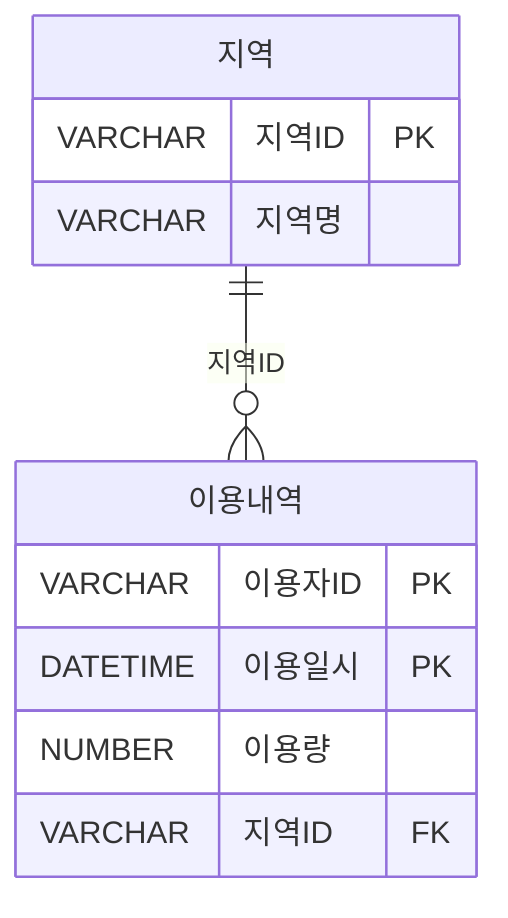

[테이블 3: 지역별 월별 이용량]
| 지역명   | 이용월   | 이용량 |
|----------|----------|--------|
| 서울     | 2014.01  | 1,000  |
| 서울     | 2014.02  | 1,000  |
| 서울     | 월별합계 | 2,000  |
| 경기     | 2014.01  | 1,000  |
| 경기     | 2014.03  | 2,000  |
| 경기     | 월별합계 | 3,000  |
| 대전     | 2014.05  | 1,500  |
| 대전     | 2014.06  | 1,000  |
| 대전     | 월별합계 | 2,500  |
| 지역전체 | 월별합계 | 7,500  |

**[보기]**
```sql
① SELECT (CASE GROUPING(B.지역명) 
          WHEN 0 THEN '지역전체' 
          ELSE B.지역명 END) AS 지역명
        ,(CASE GROUPING(TO_CHAR(A.이용일시, 'YYYY.MM'))
          WHEN 0 THEN '월별합계'
          ELSE TO_CHAR(A.이용일시, 'YYYYMM) END) AS 이용월
        ,SUM(A.이용량) AS 이용량
FROM 이용내역 A INNER JOIN 지역 B ON (A.지역ID = B.지역ID)
GROUP BY ROLLUP(B.지역명, TO_CHAR(A.이용일시, 'YYYY.MM'))

② SELECT (CASE GROUPING(B.지역ID) 
         WHEN 1 THEN '지역전체'
         ELSE MIN(B.지역명) END) AS 지역명
       ,(CASE GROUPING(TO_CHAR(A, 이용일시, 'YYYY.MM'))
         WHEN 1 THEN '월별합계'
         ELSE TO_CHAR(A.이용일시, 'YYYY.MM') END) AS 이용월
       ,SUM(A.이용량) AS 이용량
FROM  이용내역 A INNER JOIN 지역 B ON (A.지역ID = B.지역ID)
GROUP BY ROLLUP(B.지역ID, TO_CHAR(A.이용일시, 'YYYY.MM'))

③ SELECT (CASE GROUPING(B.지역명) 
            WHEN THEN '지역전체'
            ELSE B.지역명 END) AS 지역명
         , (CASE GROUPING(TO_CHAR(A.이용일시, 'YYYY.MM'))
            WHEN 1 THEN '월별합계'
            ELSE TO_CHAR(A.이용일시, 'YYYY.MM') END) AS 이용월
         , SUM(A.이용량) AS 이용량
FROM 이용내역 A INNER JOIN 지역 B ON (A.지역ID = B.지역ID)
GROUP BY CUBE(B.지역명, TO_CHAR(A.이용일시, 'YYYY.MM'))

④ SELECT (CASE GROUPING(B.지역명) 
            WHEN THEN '지역전체'
            ELSE MIN(B.지역명) END) AS 지역명
        ,(CASE GROUPING(TO_CHAR(A.이용일시, 'YYYY.MM'))
            WHEN 1 THEN '월별합계'
            ELSE TO_CHAR(A.이용일시, 'YYYY.MM') END) AS 이용월
        ,SUM(A.이용량) AS 이용량
FROM 이용내역 A INNER JOIN 지역 B ON (A.지역ID = B.지역ID)
GROUP BY GROUPING SETS(B.지역ID, TO_CHAR(A.이용일시, 'YYYY.MM'))
```


**정답** : 2


---

### ✅107  
아래 결과를 얻기 위한 SQL문에서 [가]에 들어갈 함수를 작성하시오.

[테이블: 구매이력]
| 구매고객 | 구매월  | 총 구매건 | 총 구매액 |
|----------|---------|------------|------------|
| AAA      | 201001  | 1          | 1000       |
| AAA      | 201002  | 2          | 3000       |
| AAA      | 201003  | 1          | 2000       |
| AAA      |   	  | 4          | 5000       |
| BBB      | 201001  | 3          | 2000       |
| BBB      | 201002  | 5          | 3000       |
| BBB      | 201003  | 1          | 2000       |
| BBB      |    	  | 2          | 7000       |
| CCC      | 201101  | 1          | 5000       |
| CCC      | 201102  | 1          | 1000       |
| CCC      | 201103  | 1          | 8000       |
| CCC      |            | 3          | 8000       |
| 합계     |         | 16         | 20000      |

 
```sql
[SQL문]
SELECT 구매고객, 구매월, COUNT(*) '총 구매건', SUM(구매금액) '총 구매액'
FROM 구매이력
GROUP BY    [가] (구매고객, 구매월)
```

**정답** : ROLLUP


---

### ✅108  
다음 설명 중 가장 적절한 것은?

① 일반 그룹 함수를 사용하여 CUBE, GROUPING SETS와 같은 그룹함수와 동일한 결과를 추출할 수 있으나, ROLLUP 그룹 함수와 동일한 결과는 추출할 수 없다.
② GROUPING SETS 함수의 경우에는 함수의 인자로 주어진 컬럼의 순서에 따라 결과가 달라지므로 컬럼의 순서가 중요하다.
③ CUBE, ROLLUP, GROUPING SETS 함수들의 대상 컬럼 중 집계된 컬럼 이외의 대상 컬럼 값은 해당 컬럼의 데이터 중 가장 작은 값을 반환한다.
④ CUBE 그룹 함수는 인자로 주어진 컬럼의 결합 가능한 모든 조합에 대해서 집계를 수행하므로 다른 그룹 함수에 비해 시스템에 대한 부하가 크다.


**정답** : 4

---

### ✅109  

아래와 같이 설비와 에너지사용 테이블을 이용하여 결과를 나타내려할때 SQL으로 가장 적절한 것을 2개 고르시오.

[테이블 1: 설비]
| 설비ID | 설비명 |
|--------|--------|
| 1      | 설비1  |
| 2      | 설비2  |
| 3      | 설비3  |

[테이블 2: 에너지사용]
| 설비ID | 에너지코드 | 사용량 |
|--------|-------------|--------|
| 1      | 전기        | 100    |
| 1      | 용수        | 200    |
| 1      | 바람        | 300    |
| 2      | 전기        | 200    |
| 2      | 용수        | 200    |
| 3      | 전기        | 300    |

[테이블 3: 결과]
| 설비ID | 에너지코드 | 사용량합계 |
|--------|-------------|-------------|
| 1      | 바람        | 300         |
| 1      | 용수        | 200         |
| 1      | 전기        | 100         |
| 1      | NULL        | 600         |
| 2      | 용수        | 300         |
| 2      | 전기        | 200         |
| 2      | NULL        | 500         |
| 3      | 전기        | 300         |
| 3      | NULL        | 300         |
| NULL   | 바람        | 300         |
| NULL   | 용수        | 500         |
| NULL   | 전기        | 600        |
| NULL   | NULL        | 1400        |

 
**[보기]**
```sql
① SELECT A.설비ID, B.에너지코드, SUM(B.사용량) AS 사용량합계
    FROM 설비 A INNER JOIN 에너지사용량 B
    ON (A.설비ID = B.설비ID)
    GROUP BY CUBE ((A.설비ID), (B.에너지코드), (A.설비ID, B.에너지코드))
    ORDER BY A.설비ID, B, 에너지코드;

② SELECT A.설비ID, B.에너지코드, SUM(B.사용량) AS 사용량합계
    FROM 설비 A INNER JOIN 에너지사용량 B
    ON (A.설비ID = B.설비ID)
    GROUP BY CUBE (A.설비ID, B.에너지코드)
    ORDER BY A.설비ID, B.에너지코드;

③ SELECT A.설비ID, B.에너지코드, SUM(B.사용량) AS 사용량합계
    FROM 설비 A INNER JOIN 에너지사용량 B
    ON (A.설비ID = B.설비ID)
    GROUP BY GROUPING SETS((A.설비ID), (B.에너지코드),  (A.설비ID, B.에너지코드),())
    ORDER BY A.설비ID, B.에너지코드;

④ SELECT A.설비ID, B.에너지코드, SUM(B.사용량) AS 사용량합계
    FROM 설비 A INNER JOIN 에너지사용량 B
    ON (A.설비ID = B.설비ID)
    GROUP BY GROUPING SETS ((A.설비ID), (B.에너지코드), (A.설비ID, B.에너지코드))
    ORDER BY A.설비ID, B.에너지코드;
```


**정답** : 2,3

 
---

### ✅110  
자재발주 테이블에 SQL을 수행하여 아래와 같은 결과를 얻었다. 다음 중에 (가) 들어갈 문장으로 옳은 것은?

[테이블 1: 자재발주]
| 자재번호 | 발주처ID | 발주일자 | 발주수량 |
|----------|-----------|------------|-----------|
| 1      | 001       | 20150102   | 100       |
| 1      | 001       | 20150103   | 200       |
| 2      | 001       | 20150102   | 200       |
| 2      | 002       | 20150102   | 100       |
| 3      | 001       | 20150103   | 100       |
| 3      | 002       | 20150103   | 200       |

```sql
[SQL]
SELECT CASE WHEN GROUPING(자재번호) = 1 THEN '자재전체'
        ELSE 자재번호 END AS 자재번호
     , CASE WHEN GROUPING(발주처ID) = 1 THEN '발주처전체'
        ELSE 발주처ID END AS 발주처ID
     , CASE WHEN GROUPING(발주일자) = 1 THEN '발주일자전체'
        ELSE 발주일자 END AS 발주일자
     , SUM(발주수량) AS 발주수량합계
FROM 자재발주
(가)
ORDER BY 자재번호, 발주처ID, 발주일자
```
[테이블 2: 결과]
| 자재번호   | 발주처ID     | 발주일자     | 발주수량합계 |
|------------|--------------|--------------|---------------|
| 1             | 발주처전체   | 발주일자전체 | 300           |
| 2             | 발주처전체   | 발주일자전체 | 300           |
| 3             | 발주처전체   | 발주일자전체 | 300           |
| 자재전체   | 001             | 20150102     | 300           |
| 자재전체   | 001             | 20150103     | 300           |
| 자재전체   | 002             | 20150102     | 100           |
| 자재전체   | 002             | 20150103     | 200           |

① GROUP BY CUBE (자재번호, (발주처ID, 발주일자))
② GROUP BY CUBE (자재번호, 발주처ID, 발주일자)
③ GROUP BY GROUPING SETS (자재번호, 발주처ID, 발주일자)
④ GROUP BY GROUPING SETS (자재번호, (발주처ID, 발주일자))

 

**정답** : 4

---

### ✅111  

다음 중 월별매출 테이블을 대상으로 아래 SQL을 수행한 결과인 것은?


[테이블 1: 제품 매출현황]
| 상품ID | 일자     | 매출액 |
|--------|----------|--------|
| P001   | 2014.10  | 1500   |
| P001   | 2014.11  | 1600   |
| P001   | 2014.12  | 2500   |
| P002   | 2014.10  | 1000   |
| P002   | 2014.11  | 2000   |
| P002   | 2014.12  | 1500   |
| P003   | 2014.10  | 2000   |
| P003   | 2014.11  | 1000   |
| P003   | 2014.12  | 1000   |

```sql
[SQL]
SELECT 상품ID, 월, SUM(매출액) AS 매출액
FROM  월별매출
WHERE 월 BETWEEN '2014.10' AND '2014.12'
GROUP BY GROUPING SETS((상품ID, 월));
```


①
| 상품ID | 일자     | 매출액 |
|--------|----------|--------|
| NULL   | 2014.10  | 4500   |
| NULL   | 2014.11  | 4500   |
| NULL   | 2014.12  | 5000   |
| P001   | NULL  | 5500   |
| P002   | NULL  | 4500   |
| P003   | NULL  | 4000   |
 
 
②
| 상품ID | 일자     | 매출액 |
|--------|----------|--------|
| P001   | 2014.10  | 1500   |
| P001   | 2014.11  | 1500   |
| P001   | 2014.12  | 2500   |
| P002   | 2014.10  | 1000   |
| P002   | 2014.11  | 2000   |
| P002   | 2014.12  | 1500   |
| P003   | 2014.10  | 2000   |
| P003   | 2014.11  | 1000   |
| P003   | 2014.12  | 1000   |
 
 ③
| 상품ID | 일자     | 매출액 |
|--------|----------|--------|
| NULL   | 2014.10  | 4500   |
| NULL   | 2014.11  | 4500   |
| NULL   | 2014.12  | 5000   |
| P001   | NULL  | 5500   |
| P002   | NULL  | 4500   |
| P003   | NULL  | 4000   |
| NULL   | NULL  | 14000   |
 |

 ④ 
| 상품ID | 일자     | 매출액 |
|--------|----------|--------|
| P001   | 2014.10  | 1500   |
| P002   | 2014.10  | 1000   |
| P003   | 2014.10  | 2000   |
| NULL   | 2014.10  | 4500   |
| P001   | 2014.11  | 1500   |
| P002   | 2014.11  | 2000   |
| P003   | 2014.11  | 1000   |
| NULL   | 2014.11  | 4500   |
| P001   | 2014.12  | 2500   |
| P002   | 2014.12  | 1500   |
| P003   | 2014.12  | 1000   |
| NULL   | 2014.12  | 5000   |


**정답** : 2


---
### ✅112  
다음 중 윈도우 함수(Window Function, Analytic Function)에 대한 설명으로 가장 부적절한 것은?

① Partition과 Group By 구문은 의미적으로 유사하다.
② Partition 구분이 없으면 전체 집합을 하나의 Partition으로 정의한 것과 동일하다.
③ 윈도우 함수 처리로 인해 결과 건수가 줄어든다.
④ 윈도우 함수 적용 범위는 Partition을 넘을 수 없다.


**정답** : 3


---
### ✅113  
다음 중 아래와 같은 테이블에서 SQL을 실행할 때 결과로 가장 적절한 것은?

[테이블 1: 고객]
| 고객번호(PK) | 고객명 |
|--------------|--------|
| 001          | 홍길동 |
| 002          | 이순신 |
| 003          | 강감찬 |
| 004          | 이상화 |
| 005          | 이규혁 |

[테이블 2: 월별매출]
| 월(PK)  | 고객번호(PK) | 매출액 |
|---------|----------------|--------|
| 201301  | 001            | 200    |
| 201301  | 002            |  300   |
| 201301  | 003            | 250    |
| 201301  | 004            | 300    |
| 201301  | 005            | 250    |
| 201302  | 001            | 150    |
| 201302  | 002            | 150    |
| 201302  | 004            | 200    |
| 201302  | 005            | 100    |
| 201303  | 002            | 100    |
| 201303  | 003            | 100    |
| 201303  | 004            | 200    |
| 201303  | 005            | 350    |

```sql
[SQL]
SELECT 고객번호, 고객명, 매출액
      , RANK() OVER(ORDER BY 매출액 DESC) AS 순위
FROM (
    SELECT A.고객번호
        , MAX(A.고객명) AS 고객명
        , SUM(B.매출액) AS 매출액
    FROM 고객 A INNER JOIN 월별매출 B
    ON (A.고객번호 = B.고객번호)
    GROUP BY A.고객번호
    )
ORDER BY RNK;
```
①
| 고객번호 | 고객명 | 매출액 | 순위 |
|----------|--------|--------|------|
| 005      | 이규혁 | 700    | 1    |
| 004      | 이상화 | 700    | 1    |
| 002      | 이순신 | 550    | 3    |
| 001      | 홍길동 | 350    | 4    |
| 003      | 강감찬 | 350    | 4    |

②
| 고객번호 | 고객명 | 매출액 | 순위 |
|----------|--------|--------|------|
| 005      | 이규혁 | 700    | 1    |
| 004      | 이상화 | 700    | 2    |
| 002      | 이순신 | 550    | 3    |
| 001      | 홍길동 | 350    | 4    |
| 003      | 강감찬 | 350    | 5    |

③
| 고객번호 | 고객명 | 매출액 | 순위 |
|----------|--------|--------|------|
| 005      | 이규혁 | 700    | 1    |
| 004      | 이상화 | 700    | 1    |
| 002      | 이순신 | 550    | 2    |
| 001      | 홍길동 | 350    | 3    |
| 003      | 강감찬 | 350    | 3    |

④
| 고객번호 | 고객명 | 매출액 | 순위 |
|----------|--------|--------|------|
| 003      | 강감찬 | 350    | 1    |
| 001      | 홍길동 | 350    | 1    |
| 002      | 이순신 | 550    | 2    |
| 004      | 이상화 | 700    | 3    |
| 005      | 이규혁 | 700    | 3    |
 

**정답** : 1


---

### ✅114  
아래 데이터 모델에서 활동점수가 높은 고객을 게임상품ID별로 10등까지 선별하여 사은행사를 진행하려고 한다. 다음 SQL 중 가장 적절한 것은? (단, 활동점수가 동일한 고객은 동일등수로 한다. 아래 결과 예제 참조)

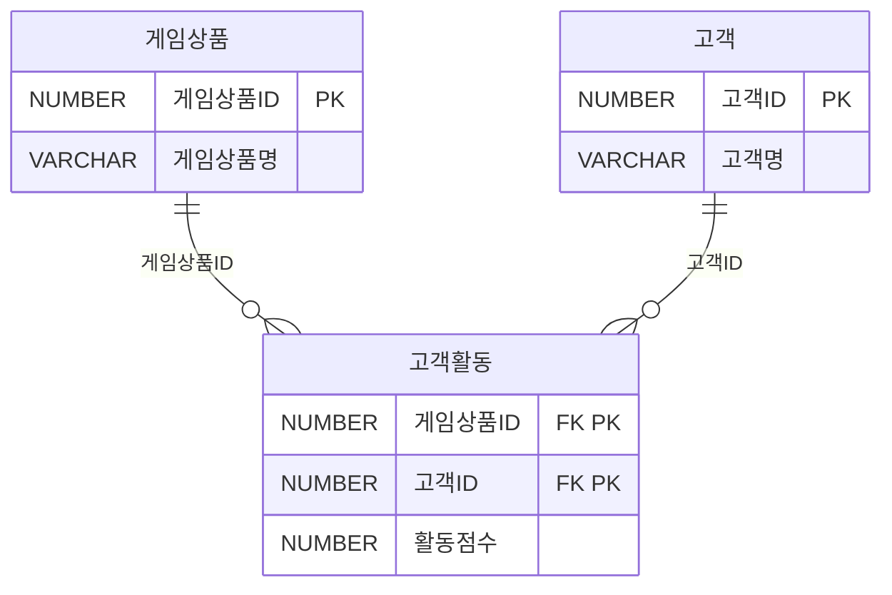

[테이블: 결과 예제]
| 게임상품ID | 고객ID | 활동점수 | 등수(순위) |
|------------|--------|-----------|-------------|
| 001        | 121    | 150       | 1           |
| 001        | 111    | 150       | 1           |
| 001        | 234    | 110       | 3           |
| 001        | 212    | 100       | 4           |
| 001        | 455    | 100       | 4           |
| 001        | 182    | 90        | 6           |
| 001        | 199    | 80        | 7           |
| 001        | 876    | 70        | 8           |
| 001        | 232    | 70        | 8          |
| 001        | 901    | 40        | 10          |
 

```sql
① SELECT 게임상품ID, 고객ID, 활동점수, 순위
FROM (SELECT DENSE_RANK() OVER(ORDER BY 활동점수 DESC) AS 순위 , 고객ID, 게임상품ID, 활동점수
    FROM 고객활동)
WHERE 순위 <= 10;

② SELECT 게임상품ID, 고객ID, 활동점수, 순위
FROM (SELECT DENSE RANK() OVER(PARTITION BY 게임상품ID ORDER BY 활동점수 DESC) AS 순위
        , 고객ID, 게임상품ID, 활동점수
    FROM 고객활동)
WHERE 순위 <= 10;

③ SELECT 게임상품ID, 고객ID, 활동점수, 순위
FROM (SELECT RANK() OVER(ORDER BY 활동점수 DESC) AS 순위 
            , 고객ID, 게임상품ID, 활동점수 
      FROM 고객활동)
WHERE 순위 <= 10;

④ SELECT 게임상품ID, 고객ID, 활동점수, 순위
FROM (SELECT RANK() OVER(PARTITION BY 게임상품ID ORDER BY 활동점수 DESC) AS 순위 
        , 고객ID, 게임상품ID, 활동점수
    FROM 고객활동)
```


**정답** : 4


---

### ✅115  
다음 중 추천내역 테이블에서 아래와 같은 SQL을 수행하였을 때의 결과로 가장 적절한 것은?

| 추천경로    | 추천인 | 피추천인 | 추천점수 |
|-------------|--------|----------|-----------|
| SNS         | 나한일 | 강감찬   | 75        |
| SNS         | 이순신 | 강감찬   | 80        |
| 이벤트응모  | 홍길동 | 강감찬   | 88        |
| 이벤트응모  | 저절로 | 이순신   | 78        |
| 홈페이지    | 저절로 | 이대로   | 93        |
| 홈페이지    | 홍두깨 | 심청이   | 98        |

```sql
[SQL]
SELECT 추천경로, 추천인, 피추천인, 추천점수
FROM (SELECT 추천경로, 추천인, 피추천인, 추천점수 , 
        ROW_NUMBER() OVER(PARTITION BY 추천경로 ORDER BY 추천점수 DESC) AS RNUM
      FROM 추천내역)
WHERE RNUM = 1;
```
 
①  
| 추천경로    | 추천인 | 피추천인 | 추천점수 |
|-------------|--------|----------|-----------|
| SNS         | 나한일 | 강감찬   | 75        |
| SNS         | 이순신 | 강감찬   | 80        |
| 이벤트응모  | 홍길동 | 강감찬   | 88        |
| 이벤트응모  | 저절로 | 이순신   | 78        |
| 홈페이지    | 저절로 | 이대로   | 93        |
| 홈페이지    | 홍두깨 | 심청이   | 98        |

②  
| 추천경로    | 추천인 | 피추천인 | 추천점수 |
|-------------|--------|----------|-----------|
| 홈페이지    | 홍두깨 | 심청이   | 98        |

③
| 추천경로    | 추천인 | 피추천인 | 추천점수 |
|-------------|--------|----------|-----------|
| SNS         | 이순신 | 강감찬   | 80        |
| 이벤트응모  | 홍길동 | 강감찬   | 88        |
| 홈페이지    | 홍두깨 | 심청이   | 98        |  

④  
| 추천경로    | 추천인 | 피추천인 | 추천점수 |
|-------------|--------|----------|-----------|
| SNS         | 나한일 | 강감찬   | 75        |  
| 이벤트응모  | 저절로 | 이순신   | 78        |
| 홈페이지    | 저절로 | 이대로   | 93        | 


**정답** : 3


---
### ✅116  
다음 중 아래의 SQL에 대한 설명으로 가장 적절한 것은?

```sql
[SQL]
SELECT 상품분류코드
        ,AVG(상품가격) AS 상품가격
        ,COUNT(*) OVER(ORDER BY AVG(상품가격)
                        RANGE BETWEEN 10000 PRECEDING
                    AND 10000 FOLLOWING) AS 유사개수
FROM 상품
GROUP BY 상품분류코드;
```

① WINDOW FUNCTION을 GROUP BY 절과 함께 사용하였으므로 위의 SQL은 오류가 발생한다.
② WINDOW FUNCTION의 ORDER BY절에 AVG 집계 함수를 사용하였으므로 위의 SQL은 오류가 발생한다.
③ 유사개수 컬럼은 상품분류코드별 평균상품가격을 서로 비교하여 -10000 ~ +10000 사이에 존재하는 상품분류코드의 개수를 구한 것이다.
④ 유사개수 컬럼은 상품전체의 평균상품가격을 서로 비교하여 -10000 ~ +10000 사이에 존재하는 상품의 개수를 구한 것이다.


**정답** : 3


---
### ✅117  
다음 중 [사원] 테이블에 대하여 아래와 같은 SQL을 수행하였을 때 예상되는 결과로 가장 적절한 것은?

[테이블: 사원]
| 사원ID | 부서ID | 사원이름 | 연봉 |
|--------|--------|-----------|------|
| 001    | 100    | 홍길동    | 2500 |
| 002    | 100    | 강감찬    | 3000 |
| 003    | 200    | 김유신    | 4500 |
| 004    | 200    | 김선달    | 3000 |
| 005    | 200    | 유학생  | 2500 |
| 006    | 300    | 변사또    | 4500 |
| 007    | 300    | 박문수    | 3000 |

```sql
[SQL]
SELECT Y.사원ID, Y.부서ID, Y.사원명, Y.연봉
FROM (SELECT 사원ID, MAX(연봉) OVER(PARTITION BY 부서ID) AS 최고연봉 
      FROM 사원) X, 사원 Y
WHERE X.사원ID = Y.사원ID
AND   X.최고연봉 = Y.연봉
```


①
| 사원ID | 부서ID | 사원이름 | 연봉 |
|--------|--------|-----------|------| 
| 002    | 100    | 강감찬    | 3000 |
| 003    | 200    | 김유신    | 4500 |
| 006    | 300    | 변사또    | 4500 |

②
| 사원ID | 부서ID | 사원이름 | 연봉 |
|--------|--------|-----------|------|
| 001    | 100    | 홍길동    | 2500 |
| 005    | 200    | 유학생  | 2500 |
| 007    | 300    | 박문수    | 3000 |
 

③
| 사원ID | 부서ID | 사원이름 | 연봉 |
|--------|--------|-----------|------|
| 003    | 200    | 김유신    | 4500 |
| 006    | 300    | 변사또    | 4500 |


④
| 사원ID | 부서ID | 사원이름 | 연봉 |
|--------|--------|-----------|------|
| 004    | 200    | 김유신    | 4500 |

 
**정답** : 1


---

### ✅118  
다음 중 아래 SQL의 실행 결과로 가장 적절한 것은?

```sql
CREATE TABLE TBL
    (ID VARCHAR2(10),
    START VAL NUMBER,
    END VAL NUMBER)

```
[테이블: TBL]
| ID | START VAL | END VAL |
|----|------------|---------|
| A  | 10         | 14      |
| A  | 14         | 15      |
| A  | 15         | 15      |
| A  | 15         | 18      |
| A  | 20         | 25      |
| A  | 25         |       |

```sql
SELECT ID, START VAL, END VAL
FROM (
    SELECT ID, START VAL, NVL(END VAL, 99) END VAL,
        (CASE WHEN START_VAL = LAG(END VAL) OVER (PARTITION BY ID
                ORDER BY START VAL, NVL(END VAL, 99)) THEN 1
            ELSE O
            END) FLAG1
     , (CASE WHEN END VAL LEAD(START VAL) OVER (PARTITION BY ID
                ORDER BY START VAL, NVL(END VAL, 99)) THEN 1
            ELSE 0
            END) FLAG2
    FROM TBL)
WHERE FLAG1 = 0  OR FLAG2=0
```
①  
| ID | START VAL | END VAL |
|----|------------|---------|
| A  | 10         | 14      |
| A  | 15         | 18      |
| A  | 20         | 25      |
| A  | 25         |  99     |

②  
| ID | START VAL | END VAL |
|----|------------|---------|
| A  | 15         | 15      |

③  
| ID | START VAL | END VAL |
|----|------------|---------|
| A  | 10         | 14      |
| A  | 15         | 15      |
| A  | 20         | 99      |

④ 
| ID | START VAL | END VAL |
|----|------------|---------|
| A  | 10         | 18      |
| A  | 20         | 99      |


**정답** : 1


---

### ✅119  
아래 설명 중 (가), (나)에 해당하는 내용을 작성하시오.

```sql
DBMS에 생성된 USER와 다양한 권한들 사이에서 중개 역할을 할 수 있도록 DBMS에서는 ROLE을 제공한다. 이러한 ROLE을 DBMS USER에게 부여하기 위해서는 (가) 명령을 사용하며, ROLE을 회수하기 위해서는 (나) 명령을 사용한다.
```

**정답** : 가 - GRANT  , 나 - REVOKE


---

### ✅120  
다음 중 B_User가 아래의 작업을 수행할 수 있도록 권한을 부여하는 DCL로 가장 적절한 것은?

```sql
UPDATE A_User.TB_A
SET   coll='AAA'
WHERE col2=3
```
① GRANT  SELECT, UPDATE TO B_User;
② REVOKE SELECT ON A_User.TB_A FROM B_User;
③ DENY   UPDATE ON A_User.TB_A TO   B_User;
④ GRANT  SELECT, UPDATE ON A_User.TB_A TO B_User;


**정답** : 4

---

### ✅121  
아래의 (가)에 들어갈 내용을 쓰시오.

```sql
DBMS 사용자를 생성하면 기본적으로 많은 권한을 부여해야 한다. 많은 DBMS에서는 DBMS 관리자가 사용자별로 권한을 관리해야 하는 부담과 복잡함을 줄이기 위하여 다양한 권한을 그룹으로 묶어 관리할 수 있도록 사용자와 권한 사이에서 중개 역할을 수행하는 (가)을 제공한다. 
```


**정답** : ROLE


---
### ✅122  
사용자 Lee가 릴레이션 R을 생성한 후, 아래와 같은 권한부여 SQL문들을 실행하였다. 그 이후에 기능이 실행 가능한 SQL을 2개 고르시오. (단, A, B의 데이터 타입은 정수형이다)

```sql
Lee: GRANT SELECT, INSERT, DELETE ON R TO Kim WITH GRANT OPTION;
Kim: GRANT SELECT, INSERT, DELETE ON R TO Park;
Lee: REVOKE DELETE ON R FROM Kim;
Lee: REVOKE INSERT ON R FROM Kim CASCADE;
```

① Park: SELECT * FROM R WHERE A = 400;
② Park: INSERT INTO R VALUES (400, 600);
③ Park: DELETE FROM R WHERE B = 800;
④ Kim : INSERT INTO R VALUES (500, 600);


**정답** : 1,3


---
### ✅123  
다음 중 PL/SQL에 대한 설명으로 가장 부적절한 것은?

① 변수와 상수 등을 사용하여 일반 SQL 문장을 실행할 때 WHERE절의 조건 등으로 대입할 수 있다.
② Procedure, User Defined Function, Trigger 객체를 PL/SQL로 작성할 수 있다.
③ PL/SQL로 작성된 Procedure, User Defined Function은 전체가 하나의 트랜젝션으로 처리되어야 한다.
④ Procedure 내부에 작성된 절차적 코드는 PL/SQL엔진이 처리하고 일반적인 SQL 문장은 SQL실행기가 처리한다.


**정답** : 3

---

### ✅124  
아래는 임시부서(TMP_DEPT) 테이블로부터 부서(DEPT) 테이블에 데이터를 입력하는 PL/SQL 이다. 부서 테이블에 데이터를 입력하기 전에 부서 테이블의 모든 데이터를 ROLLBACK이 불가능 하도록 삭제하려고 한다. 다음 중 (가)에 들어갈 내용으로 옳은 것은?

```sql
[PL/SQL]
create or replace procedure insert_dept_authid current_user
as
begin
(가)
INSERT /*+ APPEND */ INTO DEPT (DEPTNO, DNAME, LOC)
SELECT DEPTNO, DNAME, LOC
FROM TMP_DEPT;
commit;
end;
/
```

①TRUNCATE TABLE DEPT:
② DELETE FROM DEPT:
③ execute immediate 'TRUNCATE TABLE DEPT';
④ execute 'TRUNCATE TABLE DEPT':

 
**정답** : 3


---

### ✅125  
다음 중 절차형 SQL 모듈에 대한 설명으로 가장 부적절한 것은?

① 저장형 프로시져는 SQL을 로직과 함께 데이터베이스 내에 저장해 놓은 명령문의 집합을 의미한다.
② 저장형 함수(사용자 정의 함수)는 단독적으로 실행되기 보다는 다른 SQL문을 통하여 호출되고 그 결과를 리턴하는 SQL의 보조적인 역할을 한다.
③ 트리거는 특정한 테이블에 INSERT, UPDATE, DELETE와 같은 DML문이 수행되었을 때 데이터베이스에서 자동으로 동작하도록 작성된 프로그램이다.
④ 데이터의 무결성과 일관성을 위해서 사용자 정의 함수를 사용한다.


**정답** : 4


---

### ✅126  
다음 중 Trigger에 대한 설명으로 가장 부적절한 것은?

① Trigger는 데이터베이스에 의해서 자동으로 호출되고 수행된다.
② Trigger는 특정 테이블에 대해서 INSERT, UPDATE, DELETE 문이 수행되었을 때 호출되도록 정의할 수 있다.
③ Trigger는 TCL을 이용하여 트랜젝션을 제어할 수 있다.
④ Trigger는 데이터베이스에 로그인하는 작업에도 정의할 수 있다.


**정답** : 3

---

### ✅127  
다음 중 특정한 테이블에 INSERT, UPDATE, DELETE와 같은 DML문이 수행되었을 때, 데이터베이스에서 자동으로 동작하도록 작성된 저장 프로그램으로 가장 적절한 것은?(단, 사용자가 직접 호출하여 사용하는 것이 아니고 데이터베이스에 서 자동적으로 수행하게 된다.)

① PROCEDURE
② USER DEFINED FUNCTION
③ PACKAGE
④ TRIGGER


**정답** : 4
