## PART001  -  1  데이터 모델링의 이해

---
1. 데이터 모델의 이해
2. 엔티티
3. 속성
4. 관계
5. 식별자
---


### ✅ 1번
모델링은 현실세계를 표현하는 것으로 이해할 수 있다. 다음 중 모델링의 특징으로 가장 부적절한 것은?

① 현실세계를 일정한 형식의 모델로 표현하는 추상화의 의미를 가짐
② 시스템 구현만을 위해 진행하는 사전단계의 작업으로서 데이터베이스 구축을 위한 사전 작업의 의미만 가짐
③ 복잡한 현실을 제한된 언어나 표기방법을 통해 쉽게 이해할 수 있는 단순화 의미를 가짐
④ 현실세계를 일정한 형식으로 누구나 이해가 가능하도록 정확하게 현상을 기술하는 정확화 의미를 가짐
 


### ✅ 2번
다음 설명 중 데이터 모델링이 필요한 주요 이유로 가장 부적절한 것은?

① 업무규모를 구성하는 기초가 되는 정보를 대체 일정한 표기방법에 의해 표현함.
② 분석된 결과물을 가지고 데이터베이스를 설계할 수 있는 기초 자료로 사용하기 위함.
③ 데이터베이스를 구축하기 위한 용도를 위해 데이터모델링을 수행하고 업무에 대한 설명은 별도로 표기방법을 이용한다.
④ 데이터모델링은 자료로서의 업무를 설명하고 분석하는 부분에 의미를 가지고 있다.
 

### ✅ 3번
다음 중 데이터모델링을 할 때 유의해야 할 사항으로 가장 부적절한 것은?

① 여러 장소의 데이터베이스에 같은 정보를 저장하지 않도록 하여 중복을 최소화한다.
② 데이터의 정의를 데이터의 사용 프로세스와 분리하여 독립성을 높인다.
③ 사용자가 처리하는 프로세스나 정보 등에 따라 매번 달라질 수 있도록 프로그램과 데이터베이스의 관계를 늘 높인다.
④ 데이터 간의 상호 연관관계를 명확하게 정의하여 일관성 있게 데이터를 유지되도록 한다.

 

### ✅ 4번

다음 중 아래 설명이 의미하는 데이터모델링의 유의점에 해당하는 특성은 무엇인가?

> 데이터 모델을 어떻게 설계했느냐에 따라 사소한 업무변화에도 데이터 모델이 수시로 변경되므로 유연성의 어려움을 가중시킬 수 있다. 데이터의 정의를 데이터의 사용 프로세스와 분리함으로써 데이터 모델은 데이터 혹은 프로세스의 변화가 애플리케이션과 데이터베이스에 중대한 변화를 일으킬 수 있는 가능성을 줄일 수 있다.
> ① 중복
> ② 비유연성
> ③ 비일관성
> ④ 일관성

---

### ✅ 5번

다음 중 아래 데이터모델링 개념에 대한 설명에서 ○, □에 들어갈 단어로 가장 적절한 것은?

> 전사적 데이터 모델링을 수행할 때 많이 하며, 추상화 수준이 높고 업무 중심적이고 포괄적인 수준의 모델링을 진행하는 것을 ○ 데이터 모델링이라고 한다. 이후 논리적 설계로 데이터베이스에 이식할 수 있도록 성능, 저장 등 물리적인 성격을 고려한 데이터 모델링을 □ 데이터모델링이라고 한다.
> ① ○=개념적, □=물리적
> ② ○=논리적, □=개념적
> ③ ○=논리적, □=물리적
> ④ ○=개념적, □=논리적

---

### ✅ 6번

다음 중 ANSI-SPARC에서 정의한 3단계구조(three-level architecture)에서 아래 내용이 설명하는 스키마구조로 가장 적절한 것은?

> * 모든 사용자 관점을 통합한 조직 전체 관점의 통합적 표현
> * 모든 응용시스템이나 사용자들의 필요를 하나의 데이터로 통합한 전체적 DB를 기술한 것
> * DB의 개체들, 속성들, 관계를 정의하고 데이터 그룹 간의 관계를 표현하는 스키마

① 외부스키마 (External Schema)
② 개념스키마 (Conceptual Schema)
③ 내부스키마 (Internal Schema)
④ 논리스키마 (Logical Schema)

---

### ✅ 7번

다음 중 고객과 주문의 ERD에 대한 설명으로 가장 부적절한 것은?
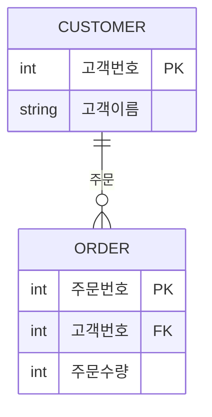
① 한 명의 고객은 여러 개의 제품을 주문할 수 있다. 주문은 할 수도 있고 안 할 수도 있다.
② 하나의 주문은 반드시 한 명의 고객에 의해 주문된다.
③ 주문의 데이터를 입력할 때는 반드시 고객데이터가 존재해야 한다.
④ 고객의 데이터를 입력할 때는 주문데이터가 존재하는 고객만을 입력할 수 있다.

---

### ✅ 8번

다음 중 ERD에 대한 설명으로 가장 부적절한 것은?
① 1976년 피터첸(Peter Chen)에 의해 Entity-Relationship Model(E-R Model)이라는 표기기법이 탄생하였다.
② 일반적으로 ERD를 작성할 때에는 엔터티들을 도형에 배치 → 관계 설정 → 관계명 기술 → 관계차수 기술 순으로 진행한다.
③ ERD 작성의 목적은 분석된 업무에 대해 데이터 측면에서 모델을 명확하게 표현하기 위함이다.
④ 가장 중요한 엔터티를 우선 배치하여 작성해 나가며, 애매한 엔터티들은 원칙과 규칙에 따라 배치하는 것이 일반적이다.

---

### ✅ 9번

다음 중 아래 시나리오에서 엔터티로 가장 적절한 것은?

> S병원은 여러 명의 환자가 존재하고 각 환자에 대한 이름, 주소 등을 관리하여야 한다. (단, 환자에 대한 엔터티의 특성을 살려 시나리오에 기술되어 있는 단어 중 단수형으로 대명사여야 함)

① 이름
② 환자
③ 나이
④ 주소

---

### ✅ 10번

다음 중 엔터티의 특징으로 가장 부적절한 것은?
① 속성이 없는 엔터티는 있을 수 없다. 엔터티는 반드시 속성을 가져야 한다.
② 엔터티는 다른 엔터티와 관계가 있을 수 밖에 없다. 단독 엔터티는 없다.
③ 객체지향적 디자인에서는 싱글턴 패턴처럼 단 하나의 인스턴스를 가지는 엔터티가 존재할 수 있다. 이와 유사히 엔터티는 단 1개의 인스턴스를 가질 수 있다.
④ 데이터로 존재하고 업무에서 필요로 하면 해당 업무에 따라 엔터티로 성립될 수 있다.

---

### ✅ 11번

다음 중 엔터티의 일반적인 특징으로 가장 부적절한 것은?
① 다른 엔터티와의 관계를 가지지 않는다.
② 유일한 식별자에 의해 식별이 가능해야 한다.
③ 엔터티는 업무 프로세스에 의해 이용되어야 한다.
④ 엔터티는 반드시 속성을 포함해야 한다.

---

### ✅ 12번

다른 엔터티로부터 주식별자를 상속받지 않고 자신의 고유한 주식별자를 가지며, 사원, 부서, 고객, 상품, 지점 등이 예가 될 수 있는 엔터티로 가장 적절한 것은?
① 기본 엔터티 (Key 엔터티)
② 중심 엔터티 (Main 엔터티)
③ 행위 엔터티 (Active 엔터티)
④ 개념 엔터티

---

### ✅ 13번

다음 중 엔터티의 이름을 부여하는 방법으로서 가장 부적절한 것은?
① 가능하면 약어를 사용하여 엔터티명을 부여한다.
② 현업에서 사용하는 용어를 사용하여 업무와 관련성을 높인다.
③ 엔터티명의 첫 글자는 반드시 한글로 표기한다.
④ 엔터티명 생성 시 의미대로 간결하고 명확하도록 한다.

---

### ✅ 14번

## 업무에서 필요로 하는 인스턴스에서 관리하고자 하는 의미상 더 이상 분리되지 않는 최소의 데이터 단위를 무엇이라 하는가?


### ✅ 15번

다음 중 속성에 대한 설명으로 가장 부적절한 것은?
① 엔터티에 대한 자세하거나 구체적인 정보를 나타낸다.
② 하나의 엔터티는 두 개 이상의 속성을 갖는다.
③ 하나의 인스턴스에서 각각의 속성은 하나 이상의 속성값을 가질 수 있다.
④ 속성은 독립적이다.

---

### ✅ 16번

다음 중 아래와 같은 사례에서 속성에 대한 설명으로 가장 부적절한 것은?

> 우리은행은 예금구분(보통예금, 정기예금 등)과 이율, 예치기간, 예금잔액을 관리한다고 할 때, 예금구분은 보통예금, 정기예금이라는 값을 가질 수 있으며, 이는 1000이상의 숫자로 표현되지 않는다. 이율 속성은 소수점 이하 5.0% 또는 3.0%와 같은 숫자로 표현되며, 예치기간 속성은 년단위로 표시한다. 예금잔액 속성은 원 단위로 숫자가 표현된다.

① 일반속성으로 코드 엔터티를 별도로 구성하고 참조하는 것이 관리상 효과적이다.
② 원래, 애기기간은 기본(BASIC) 속성이다.
③ 이자와 이율과 같은 파생(DERIVED) 속성일 수 있다.
④ 예금분류는 설계(DESIGNED) 속성이다.

---

### ✅ 17번

다음 중 데이터를 조회할 때 빠른 성능을 낼 수 있도록 하기 위해 원래 속성의 값을 계산하여 저장할 수 있도록 만든 속성으로 가장 적절한 것은?
① 파생속성 (Derived Attribute)
② 기본속성 (Basic Attribute)
③ 설계속성 (Designed Attribute)
④ PK속성 (Derived Attribute)

---

### ✅ 18번

다음 중 아래 설명이 나타내는 데이터모델의 개념으로 가장 적절한 것은?

> 주문이라는 엔터티가 있을 때 단가라는 속성 값의 범위는 100에서 10,000 사이의 실수 값이며, 제품명이라는 속성은 길이가 20자 이내의 문자열로 정의할 수 있다.

① 시스템카탈로그 (System Catalog)
② 용어사전 (Word Dictionary)
③ 속성사전 (Attribute Dictionary)
④ 도메인 (Domain)


---

### ✅ 19 
다음 중 데이터모델링을 할 때 속성의 명칭을 부여하는 방법으로 가장 부적절한 것은?

① 속성의 이름에 약어를 사용할 경우 그 의미를 명확하게 이해할 수 없고
혼돈을 초래하여 커뮤니케이션의 혼란을 야기할 수 있으므로 지나친
약어 사용은 가급적 제한하도록 한다.
② 속성의 이름에는 서술식 용어는 사용하지 않도록 한다.
③ 직원 엔터티의 이름, 고객 엔터티의 이름과 같이 각 엔터티별로 동일한
속성명을 사용하여 데이터모델의 일관성을 가져가는 것이 좋다.
④ 데이터모델링 대상에서 사용하는 용어도 있고 외부에서 사용하는 용어
도 있어 중복이 있을 때, 가급적 해당 업무에서 자주 사용하는 이름을
이용하도록 한다.


---

### ✅ 20 
다음 중 데이터모델링의 관계에 대한 설명으로 가장 부적절한 것을 2개 고르시오.

① 관계는 존재에 의한 관계와 행위에 의한 관계로 구분될 수 있으나 ERD
에서는 관계를 연결할 때, 존재와 행위를 구분하지 않고 단일화된 표기
법을 사용한다.
② UML(Unified Modeling Language)에는 클래스다이어그램의 관계 중
연관관계(Association)와 의존관계(Dependency)가 있고 이것은 실선과
점선의 표기법으로 다르게 표현이 된다.
③ 관계는 존재에 의한 관계와 행위에 의한 관계로 구분될 수 있고 ERD
에서는 관계를 연결할 때, 존재와 행위를 구분하여 실선과 접선의 표기
법으로 다르게 표현한다.
④ UML(Unified Modeling Language)에는 클래스다이어그램의 관계 중
연관관계(Association)와 의존관계(Dependency)가 있고 있으나 구분
하지 않고 단일화된 표기법을 사용한다.


---

### ✅ 21 
다음 중 관계에 대한 설명으로 가장 부적절한 것은?

① 관계는 존재적 관계와 행위에 의한 관계로 나누어볼 수 있다.
② 관계의 표기법은 관계명, 관계차수, 식별성의 3가지 개념을 사용한다.
③ 부서와 사원 엔터티 간의 '소속' 관계는 존재적 관계의 사례이다.
④ 주문과 배송 엔터티 간의 '배송근거' 관계는 행위에 의한 관계의 사례이다.


---

### ✅22
다음 중 엔터티간의 관계에서 1:1, 1:M과 같이 관계의 기수성을 나타내는
것으로 가장 적절한 것은?
① 관계명(Relationship Membership)
② 관계차수(Relationship Degree/Cardinality)
③ 관계선택사양(Relationship Optionality)
④ 관계정의(Relationship Definition)

---

### ✅23
다음 중 두 개의 엔터티 사이에 정의한 관계를 체크하는 사항으로 가장
부적절한 것은?
① 두 개의 엔터티 사이에 관심 있는 연관규칙이 존재하는가?
② 두 개의 엔터티 사이에 정보의 조합이 발생되는가?
③ 업무기술서, 장표에 관계연결을 가능하게 하는 명사 (Noun)가 있는가?
④ 업무기술서, 장표에 관계연결에 대한 규칙이 서술되어 있는가?

---

### ✅24
다음 중 두 개의 엔터티 사이에서 관계를 도출 할 때 체크 할 사항을
모두 고른 것은?

가. 두 개의 엔터티 사이에 관심있는 연관규칙이 존재하는가?
나. 두 개의 엔터티 사이에 정보의 조합이 발생되는가?
다. 업무기술서, 장표에 관계연결에 대한 규칙이 서술되어 있는가?
라. 업무기술서, 장표에 관계연결을 가능하게 하는 동사(Verb)가 있
는가?

① 가. 다. 라
② 가. 다. 라
③ 가. 나. 다
④ 가. 나. 다. 라


---

### ✅25 
다음 중 아래에서 주식별자를 지정할 때 고려해야 할 사항을 묶은 것으로 가장 적절한 것은?
 
가. 주식별자에 의해 엔티티 내의 모든 인스턴스들이 유일하게 구분
되어야 한다.
나. 주식별자를 구성하는 속성의 수는 유일성을 만족하는 최소의 수
가 되어야 한다.
다. 지정된 주식별자의 값은 자주 변하지 않는 것이어야 한다.
라. 주식별자가 지정이 되면 반드시 값이 들어와야 한다.

①가. 나. 다
②가. 나. 라
③나. 다. 라
④ 가. 나. 다. 라


---

### ✅26 
다음 중 사원엔터티에서 식별자의 특성에 해당하지 않는 것은 무엇인가?
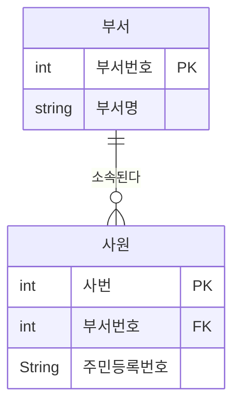

① 주식별자
② 단일식별자
③ 내부식별자
④ 인조식별자


---

### ✅27 
다음 중 식별자로 가장 부적절한 것은?

①  
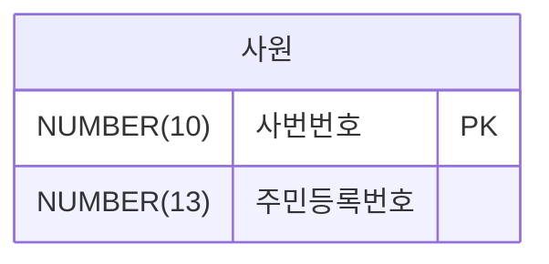

② 사원
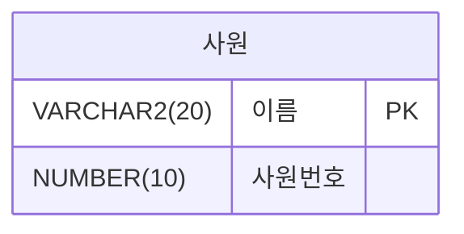
이름: VARCHAR2(20)

③ 
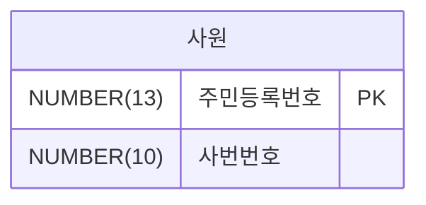

④ 

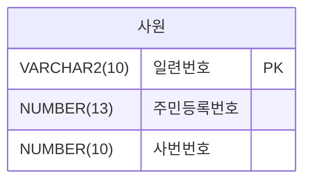
 

---

### ✅28
다음 중 아래에서 엔터티 내에 주식별자를 도출하는 기준을 묶은 것으로
가장 적절한 것은?

가. 해당 업무에서 자주 이용되는 속성을 주식별자로 지정한다.
나. 명칭, 내역 등과 같이 이름으로 기술되는 것들을 주식별자로 지정한다.
다. 복합으로 주식별자를 구성할 경우 너무 많은 속성을 포함하지 않도록 한다.
라. 자주 수정되는 속성을 주식별자로 지정한다.

① 가, 나
② 가. 다
③ 다. 라
④나, 라


---

### ✅29
프로젝트를 전개할 때는 식별자관계와 비식별자관계를 선택하여 연결
해야 하는 높은 수준의 데이터모델링 기술이 필요하다. 다음 중 비식별자
관계를 선택하는 기준으로 가장 부적절한 것은?

① 관계의 강약을 분석하여 상호간에 연관성이 약할 경우 비식별자관계를 고려한다.
② 자식테이블에서 독립적인 Primary Key의 구조를 가지기 원할 때 비식별자관계를 고려한다.
③ 모든 관계가 식별자 관계로 연결되면 SQL Where절에서 비교하는 항목이 증가되어 조인에 참여하는 테이블에 따라 SQL문장이 길어져 SQL문의 복잡성이 증가되는 것을 방지하기 위해 비식별자관계를 고려한다.
④ 부모엔터티의 주식별자를 자식엔터티에서 받아 손자엔터티까지 계속 흘려보내기 위해 비식별자관계를 고려한다.


---

### ✅30
다음 중 비식별자 관계로 연결하는 것을 고려해야 하는 경우로 가장 부적절한 것은?
① 부모엔터티에 참조값이 없어도 자식엔터티의 인스턴스가 생성될 수 있는 경우
② 부모엔터티의 인스턴스가 자식 엔터터와 같이 소멸되는 경우
③ 여러 개의 엔터티를 하나로 통합하면서 각각의 엔터티가 갖고 있던 여러 개의 개별 관계가 통합되는 경우
④ 자식쪽 엔터티의 주식별자를 부모엔터티와는 별도로 생성하는 것이 더 유리하다고 판단하는 경우


<br/>
<br/>
<br/>

## PART001  -  2  데이터 모델링의 이해

---
1. 성능 데이터 모델링의 개요
2. 정규화와 성능
3. 반정규화와 성능
4. 대량 데이터에 따른 성능
5. 데이터베이스 구조와 성능
6. 분산 데이터베이스와 성능
---


### ✅31
다음 중 성능 데이터모델링에 대한 설명으로 가장 부적절한 것은?
① 성능이 저하된 결과를 대상으로 데이터모델 보다는 문제발생 시점의
SQL을 중심으로 집중하여 튜닝을 한다.
② 데이터의 증가가 빠를수록 성능저하에 따른 성능개선비용은 증가한다
③ 데이터모델은 성능을 튜닝하면서 변경이 될 수 있는 특징이 있다.
④ 분석/설계 단계에서 성능을 고려한 데이터모델링을 수행할 경우 성능


---

### ✅32
저하에 따른 Rework비용을 최소화 할 수 있는 기회를 가지게 된다.
아래 설명을 읽고 다음에 들어갈 단어를 작성하시오.
아래
첫번째, 데이터모델링을 할 때 정규화를 정확하게 수행한다.
두번째, 데이터베이스 용량산정을 수행한다.
세번째, 데이터베이스에 발생되는 트랜잭션의 유형을 파악한다.
네번째, 용량과 트랜잭션의 유형에 따라 [    ]를 수행
한다.
다섯번째, 이력모델의 조정, PK/FK조정, 슈퍼타입/서브타입 조정
등을 수행한다.


---

### ✅33
다음 중 아래에서 성능을 고려한 데이터 모델링의 순서로 가장 적절한 것은?
 
가. 데이터 모델링을 할 때 정규화를 정확하게 수행한다.
나. 용량과 트랜잭션의 유형에 따라 반정규화를 수행한다.
다. 데이터베이스 용량산정을 수행한다.
라. 데이터베이스에 발생되는 트랜잭션의 유형을 파악한다.
마. 성능관점에서 데이터 모델을 검증한다.
바. 이력모델의 조정, PK/FK조정, 슈퍼타입/서브타입 조정 등을 수행한다.

① 가-나-다-라-마-바
② 가-나-다-라-바-마
③ 가-다-라-바-나-마
④ 가-다-라-나-바-마


---

### ✅34
다음 중 성능데이터 모델링을 할 때 고려사항으로 가장 부적절한 것은?
① 데이터 모델링의 정규화는 항상 조회 성능저하를 나타내므로 반정규화 관점에서만 성능을 고려하여 설계하도록 한다.
② 용량산정은 전체적인 데이터베이스에 발생되는 트랜잭션의 유형과 양을 분석하는 자료가 되므로 성능데이터 모델링을 할 때 중요한 작업이 될 수 있다.
③ 물리적인 데이터 모델링을 할 때 PK/FK의 칼럽의 순서조정, FK인덱스 생성 등은 성능 향상을 위한 데이터 모델링 작업에 중요한 요소가 된다.
④ 이력데이터는 시간에 따라 반복적으로 발생이 되기 때문에 대량 데이터일 가능성이 높아 특별히 성능을 고려하여 칼럼 등을 추가하도록 설계해야 한다.

---

### ✅35
아래와 같은 보관금원장 엔터티에서 관서에 대한 정보가 반정규화 되어 있기 때문에 관서정보를 조회할 때 성능저하가 발생하고 있다. 이 엔터티에 대해 몇 차 정규화가 필요한 지와 분리된 스키마 구조를 가장 바르게 짝지은 것은?

 

 
| 사원 |
|------|
| 관서번호 <br/> 납부자번호|
| 관리점번호 <br/> 관서명 <br/>상태 <br/>관서등록일자<br/>직급명<br/>통신번호 |

```
함수종속성(FD) :
(관서번호, 납부자번호)→ (직급명, 통신번호)
(관서번호)→(관리점번호, 관서명, 상태, 관서등록일자)
```

① 2차 정규화 - 정규화테이블(<u>관서번호, 납부자번호</u>, 관리점번호, 관서명, 상태, 관서등록일자)
② 3차 정규화 - 정규화테이블(<u>관서번호, 납부자번호</u>, 관리점번호, 관서명,
상태, 관서등록일자)
③ 2차 정규화 - 정규화테이블(<u>관서번호</u>, 관리점번호, 관서명, 상태, 관서
등록일자)
④ 3차 정규화 - 정규화테이블(<u>관서번호</u>, 관리점번호, 관서명, 상태, 관서
등록일자)

 


---

### ✅ 36
다음 중 아래 '일자별매각물건' 엔터티에 대한 설명으로 가장 적절한
것은?

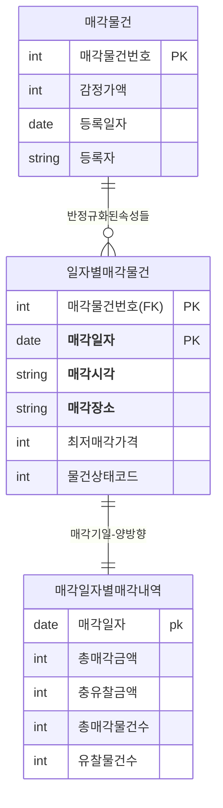
- 일자별매각물건: 약 100만 건
- 매각일자별매각내역: 약 2만 건
- **반정규화된 속성들**
    

① 1차 정규화가 필요한 엔터티로서 매각기일과 일자별매각물건으로 1:M
관계가 될 수 있다.
② 1차 정규화가 필요한 엔터티로서 매각기일과 일자별매각물건으로 1:1
관계가 될 수 있다.
③ 2차 정규화가 필요한 엔터티로서 매각기일과 일자별매각물건으로 1:M
관계가 될 수 있다.
④ 2차 정규화가 필요한 엔터티로서 매각기일과 일자별매각물건으로 1:1
관계가 될 수 있다.


---

### ✅ 037  
아래의 데이터 모델처럼 동일한 유형의 속성이 칼럼단위로 반복되는 경우가 실제 프로젝트를 하면서 많이 발생 될 수 있다. 다음 중 아래와 같이 전제조건이 있을 때 테이블에서 나타날 수 있는 현상으로 가장 적절한 것은?
```
전제조건: 
유형기능분류코드에 해당하는 속성들은 분포도가 양호 하며, 
SQL Where절에서 각각의 값이 상수값으로 조건 입력될 수 있는 특징을 가진다.
```

| 모델 |
|------|
|모델코드 (pk) |
|모델명   <br/> 제품류코드 <br/>  물품가    <br/> 출하가    <br/> **A유형기능분류코드1** <br/> **B유형기능분류코드2** <br/> **C유형기능분류코드3** <br/> **D유형기능분류코드4** <br/> **E유형기능분류코드5** <br/> **F유형기능분류코드6** <br/> **G유형기능분류코드7** <br/> **H유형기능분류코드8** <br/> **I유형기능분류코드9**  <br/> 바코드  <br/> 가로  <br/> 세로  <br/> 높이  <br/> 모델구분 |
 
 


1 조회 조건이 유형기능분류코드에 따라 반복되는 그룹이 칼럼단위로 되어 있으므로 제 1정규형이라고 할 수 있다.
2 유형기능분류코드에 대해 Where절에 조건으로 들어오는 값이 있으므로 PK와 이에 대한 Index만 있으면 SQL 문장은 빠르게 수행될 수 있다고 할 수 있다.
3 유형기능분류코드가 일반속성 안에서 반복적으로 속성이 구분되어 있기 때문에 이전을 수행해야 하는 제 2정규형이라 할 수 있다.
4 유형기능분류코드 각각에 대하여 개별로 Index를 모두 생성할 경우 입력, 수정, 삭제 때 성능이 저하되므로 제1차 정규화를 수행한 후 인덱 스를 적용하는 것이 좋다.


<br/><br/><br/>❓**■038 다음 중 아래 '일재고' 엔터티에 대한 설명으로 가장 적절한 것은?**


[  일재고 ]
물류센터코드
재고일자
---------------
월초재고수량
장기재고 1개월수량
장기재고  2개월수량
장기재고  3개월수량
장기재고 1개월주문수량
장기재고 2개월주문수량
장기재고 3개월주문수량
장기재고 1개월금액
장기재고  2개월금액
장기재고  3개월금액
장기재고 1개월주문금액
장기재고 2개월주문금액
장기재고 3개월주문금액
 

1 1차 정규화가 필요한 엔터티로서 일재고와 일재고상세로 1:M의 관계가 될 수 있다.
2 1차 정규화가 필요한 엔터티로서 일재고와 일재고상세로 1:1의 관계가 될 수 있다.
3 2차 정규화가 필요한 엔터티로서 일재고와 일재고상세로 1:M의 관계가 될 수 있다.
4 2차 정규화가 필요한 엔터티로서 일재고와 일재고상세로 1:1의 관계가 될 수 있다.


---

### ✅ 38
다음 중 아래 '일재고' 엔터티에 대한 설명으로 가장 적절한 것은?


| 일재고 |
|------|
|물류센터코드 <BR> 재고일자 |
| 월초재고수량 <br/> 장기재고1개월 수량 <br/> 장기재고2개월 수량 <br/> 장기재고3개월 수량 <br/> 장기재고1개월 주문수량 <br/> 장기재고2개월 주문수량 <br/> 장기재고3개월 주문수량 <br/> 장기재고1개월 금액 <br/> 장기재고2개월 금액 <br/> 장기재고3개월 금액 <br/> 장기재고1개월 주문금액 <br/> 장기재고2개월 주문금액 <br/> 장기재고3개월 주문금액  |

① 1차 정규화가 필요한 엔터티로서 일재고와 일재고상세로 1:M의 관계가
될 수 있다.
②1차 정규화가 필요한 엔터티로서 일재고와 일재고상세로 1:1의 관계가
될 수 있다.
③ 2차 정규화가 필요한 엔터티로서 일재고와 일재고상세로 1:M의 관계가
될 수 있다.
④2차 정규화가 필요한 엔터티로서 일재고와 일재고상세로 1:1의 관계가
될 수 있다.


---

### ✅ 39
다음 중 아래와 같이 수강지도 엔터티를 만들었을 때 이에 해당하는 정규형과 정규화의 대상으로 가장 바르게 짝지어진 것은?


| 수강지도 |
|------|
|학번 <BR> 과목코드 |
|성적   <br/> 지도교수명 <br/>  학과명   |

```
함수종속성(FD)
1. 학번 || 과목번호 → 성적
2. 학번→ 지도교수명
3. 학번→ 학과명
```

① 1차 정규형 - 2차 정규화 대상
② 2차 정규형 - 3차 정규화 대상
③ 3차 정규형 - 보이스코드 정규화대상
④ 보이스코드정규형 4차 정규화 대상


---

### ✅ 40
다음 중 데이터 모델에 대한 반정규화를 고려할 때 판단요소에 대한 설명으로 가장 적절한 것은?
① 반정규화 정보에 대한 재현의 적시성으로 판단한다. 예들 들어, 빌링의 잔액(balance)은 다수 테이블에 대한 다량의 조인이 불가피하므로 데이터 제공의 적시성 확보를 위한 필수 반정규화 대상 정보이다.
② 탐색 대상 데이터의 크기로 판단한다. 왜냐하면 다량 데이터에 대한 인덱스를 활용한 밤색은 Random처리의 특성으로 성능 저하가 불가피하다.
③ RDBMS는 현재 레코드 기준으로 이전 또는 이후 위치의 레코드에 대한 접근이 원천적으로 불가능하므로 반정규화를 하지 않으면 해당 정보에 대한 데이터 접근 자체가 불가능하다.
④ 반정규화 테이블은 집계 테이블에 국한하여 적용하도록 한다.

---

### ✅ 41
다음 중 하나의 테이블의 전체 칼럼 중 자주 이용하는 집중화된 칼럼들이 있을 때 디스크 1/0를 줄이기 위해 해당 칼럼들을 별도로 모아놓는 반정규화 기법으로 가장 적절한 것은?
① 칼럼추가 - 부분갈림 추가
② 칼럼추가 - 중복칼럼 추가
③ 테이블추가 - 중복테이블추가
④ 테이블추가 - 부분테이블추가


---

### ✅ 42
다음 중 칼럼에 대한 반정규화 기법으로 가장 부적절한 것은?
① 중복칼럼을 추가 - 조인감소를 위해 여러 테이블에 동일한 칼럼을
갖도록 한다.
② 파생칼럼을 추가한다 - 조회 성능을 우수하게 하기 위해 미리 계산된
칼럼을 갖도록 한다.
③FK에 대한 속성을 추가한다 - FK관계에 해당하는 속성을 추가하여
조인성능을 높인다.
④ 이력테이블에 기능 칼럼을 추가한다. - 최신값을 처리하는 이력의
특성을 고려하여 기능성 칼럼을 추가한다.


###########  43, 44,  47

---

### ✅ 43
다음 중 아래의 주문, 주문목록, 제품에 대한 데이터모델과 이를 이용하여 데이터를 조회하는 SQL문에서 조회를 빠르게 수행하기 위한 반정규화 방법으로 가장 적절한 것은?

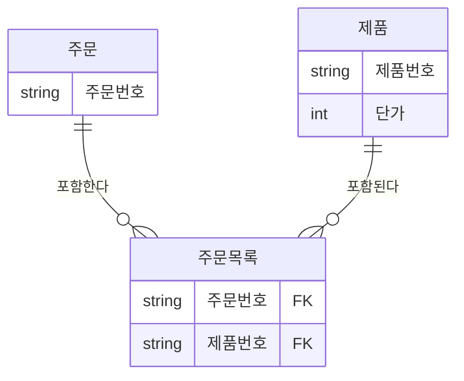
```
SELECT A.주문번호, SUM(C. 단가)
FROM 주문 A, 주문목록 B, 제품 C
WHERE A.주문번호 = '2015-02-001
AND A.주문번호 = B.주문번호
AND B.제품번호 = C.제품번호
GROUP BY A.주문번호
```

① 제품 엔터티에 단가를 합한 계산된 칼럼을 추가하도록 한다.
② 주문목록 엔터티에 단가를 합한 계산된 칼럼을 추가하도록 한다.
③ 주문 엔터티에 단가를 합한 계산된 칼럼을 추가하도록 한다.
④ 제품 엔터티에 최근값 여부에 대한 칼럼을 추가하도록 한다.


---

### ✅ 44
다음 중 아래 데이터모델에 대한 설명으로 가장 부적절한 것은?
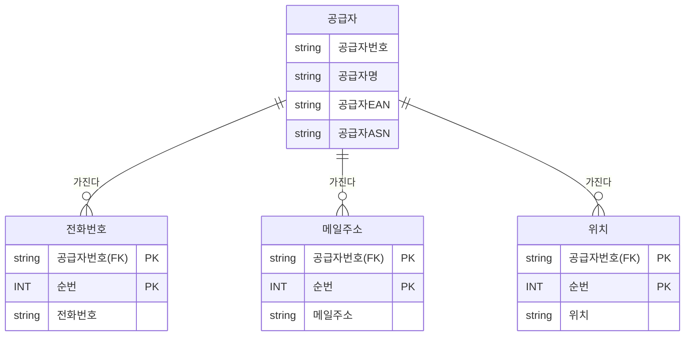
- 공급자의 데이터는 1000만건 이상의 대량 데이터를 가진 테이블임
- 전화번호, 메일주소, 위치는 자주 변경이 될 수 있으며 데이터 조회를 할 때는 항상 최근에 변경된 값을 조회하게 됨


① 공급자별로 최근에 변경된 전화번호, 메일주소, 위치와 공급자 이름을
같이 조회할 때 이 값들을 공급자 테이블에 반정규화로 갖고 있는 경우
에 비해 조회 성능이 저하되지 않는다.
② 데이터를 조회할 때 과도한 조인으로 인해 조회성능이 저하될 수 있으
므로 공급자 테이블에 가장 빈번하게 조회되는 값인 최근 변경값에
해당하는 전화번호, 메일주소, 위치를 반정규화하여 조회 성능을 향상
시킬 수 있다.
③ 전화번호, 메일주소, 위치에 대한 가장 최근에 변경된 값을 알 수 있도
록 최신여부 라는 속성을 추가함으로써 최근 값을 찾기 위한 조회 성능
저하를 예방할 수 있다.
④ 조회 성능을 위해서는 하나의 테이블로 통합하여 전화번호, 메일주소,
위치 등이 변경될 경우 전체 속성이 계속 발생되는 이력의 형태로 설계
될 수 있다. 이럴 경우 조회에 대한 성능은 향상이 되나, 과도한 데이터
가 한 테이블에 발생하게 되어 용량이 너무 커지는 단점이 있다.


---

### ✅ 45
다음 중 칼럼수가 많은 테이블에 대한 설명으로 가장 적절한 것은?
①한 테이블에 많은 칼럼을 가지고 있으면 조인이 발생되지 않아 여러
개 테이블일 때에 비해 성능이 항상 우수하다고 할 수 있다.
② 로우체이닝이 발생할 정도로 한 테이블에 많은 칼럼들이 존재할 경우
조회성능저하가 발생할 수 있다. 한 테이블내에서 칼럼의 위치를 조정
하면 디스크 1/0가 줄어들어 조회 성능을 향상 시킬 수 있다.
③로우채이닝이 발생할 정도로 한 테이블에 많은 칼럼들이 존재할 경우
조회성능저하가 발생할 수 있다. 트랜잭션이 접근하는 칼럼유형을 분
석하여 1:1로 테이블을 분리하면 디스크 1/0가 줄어들어 조회 성능을
향상 시킬 수 있다.
④ 로우체이닝이 발생할 정도로 한 테이블에 많은 칼럼들이 존재할 경우
조회성능저하가 발생할 수 있다. 그러나 이를 분리할 경우 조인으로
인한 성능 저하가 더 심하게 나타날 수 있으므로 감수하는 것이 좋다.

---

### ✅ 46
아래 설명에서 데이터 액세스 성능을 향상시키기 위해 적용하는 방법에 대해서 [   빈칸  ] 채우시오.

>하나의 데이블에 많은 양의 데이터가 저장되면 인덱스를 추가하고
테이블을 몇 개로 쪼개도 성능이 저하되는 경우가 있다. 이때 논리적
으로는 하나의 테이블이지만 물리적으로는 여러 개의 테이블로 분리
하여 데이터 액세스 성능도 향상시키고, 데이터 관리방법도 개선할
수 있도록 테이블에 적용하는 기법을 [  빈칸  ]이라고 한다.

---

### ✅ 47
다음 중 아래 데이터 모델과 SQL문에 대해 개선해야 할 사항에 대한
설명으로 가장 적절한 것은?

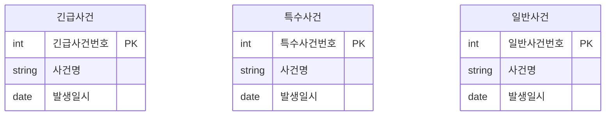

```
SELECT 긴급사건번호, 사건명 FROM 긴급사건 WHERE 발생일시 = '20150905'
UNION ALL
SELECT 특수사건번호, 사건명 FROM 특수사건 WHERE 발생일시 = '20150905'
UNIONALL
SELECT 일반사건번호, 사건명 FROM 일반사건 WHERE 발생일시 = '20150905

※ 전제조건 : 위 세 테이블은 함께 조회하는 경우가 대부분이고 아직 시스템을
오픈하지 않았다.
```

① UNION ALL로 조회하면 정렬로 인한 성능이 저하되므로 UNION으로 조합하여 조회한다.
② 긴급사건, 특수사건, 일반사건을 하나의 테이블로 통합하고 PK를 사건 분류코드 + 사건번호로 조합하여 구성하도록 한다.
③ 긴급사건, 특수사건, 일반사건 테이블을 개별로 유지하되 PK에 사건 분류코드를 포함하도록 한다.
④ 세 개의 테이블을 그대로 유지하되 반정규화된 형태의 통합테이블을 하나 더 생성하여 조회의 성능을 향상하도록 한다.

---

### ✅ 48
다음 중 논리데이터모델의 슈퍼타입과 서브타입 데이터모델을 물리적인 테이블 형식으로 변환할 때 설명으로 가장 부적절한 것은?
① 트랜잭션은 항상 전체를 대상으로 일괄 처리하는데 테이블은 서브타입 별로 개별 유지하는 것으로 변환하면 Union 연산에 의해 성능이 저하 될 수 있다.
② 트랜잭션은 항상 서브타입 개별로 처리하는데 테이블은 하나로 통합하여 변환하면 불필요하게 많은 양의 데이터가 집적되어 있어 성능이 저하될 수 있다.
③ 트랜잭션은 항상 슈퍼+서브 타입을 함께 처리하는데 개별로 유지 하면 조인에 의해 성능이 저하될 수 있다.
④ 트랜잭션은 항상 전체를 통합하여 분석 처리하는데 하나로 통합되어 있으면 데이터 집적으로 인해 성능이 저하될 수 있다.


---

### ✅ 049  
다음 중 아래와 같은 '현금출급기실적' 테이블과 이 테이블에서 데이터를 조회할 때 사용되는 아래의 SQL패턴에 대한 설명으로 가장 적절한 것은?

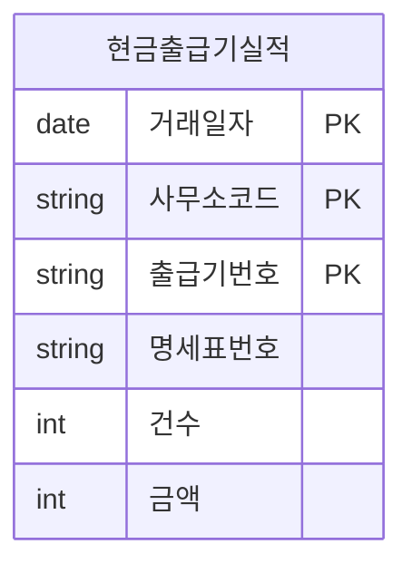

```sql
SELECT 건수, 금액
FROM 현금출급기실적
WHERE 거래일자 BETWEEN  '20140701' AND '20140702'
AND 사무소코드= '000368'
(단, PK인덱스는 설계된 순서 그대로 생성함) 
```

① 사무소코드가 '='로 상수값이 들어 왔고, 거래일자가 범위 'BETWEEN'으로 들어왔기 때문에 거래일자+사무소코드+출급기번호+명세표번호로 구성된 PK인덱스는 최적의 효율성을 가지고 있음.  
② 사무소코드가 '='로 상수값이 들어 왔고, 거래일자가 범위 'BETWEEN'으로 들어왔기 때문에 PK의 순서를 사무소코드+출급기번호+명세표번호+거래일자로 바꾸고 인덱스를 생성하는 것이 성능에 유리함.  
③ 사무소코드가 '='로 상수값이 들어 왔고, 거래일자가 범위 'BETWEEN'으로 들어왔기 때문에 PK의 순서를 거래일자+출급기번호+명세표번호+사무소코드로 바꾸고 인덱스를 생성하는 것이 성능에 유리함.  
④ 사무소코드가 '='로 상수값이 들어 왔고, 거래일자가 범위 'BETWEEN'으로 들어왔기 때문에 PK의 순서를 사무소코드+거래일자+출급기번호+명세표번호로 바꾸고 인덱스를 생성하는 것이 성능에 유리함.

---

### ✅ 050  
다음 중 아래의 엔터티와 이 엔터티를 매우 빈번하게 참조하는 SQL의 성능에 대한 설명으로 가장 적절한 것은?

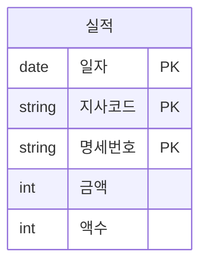
```sql
SELECT 건수, 금액
FROM 실적
WHERE 일자 BETWEEN '20110101' AND '20110102'
AND 지사코드 ='1001'

(단, PK 인덱스가 존재하며 칼럼순서대로 인덱스가 생성되어 있고, 이 SQL이 트랜잭션의 대부분을 차지한다고 가정함)
```

① 명세번호를 실적 테이블에 맨 처음 칼럼으로 옮기면 PK 인덱스의 이용 효율성이 향상된다.  
② 지사코드에 대해 입력 값이 EQUAL 조건으로 사용되므로 지사코드를 실적 테이블의 맨 처음 위치로 옮겨서 일자 칼럼의 앞에 두면 인덱스 이용 효율성이 높아진다.  
③ 일자가 SQL 문장의 WHERE절에 첫 번째 조건으로 나왔으므로 칼럼 순서에서도 첫 번째에 위치하는 것이 효율성이 높다.  
④ 일자, 명세번호, 지사코드로 칼럼 순서를 바꾸어야 일자 범위에 대한 내용을 먼저 식별하고, 그 다음으로 지사코드를 찾기에 용이할 수 있으므로 이때 인덱스의 효율성이 가장 높다.

---

### ✅ 051  
다음 중 아래 데이터모델에 표현된 FK(Foreign Key)에 대한 설명으로 가장 적절한 것을 2개 고르시오.  

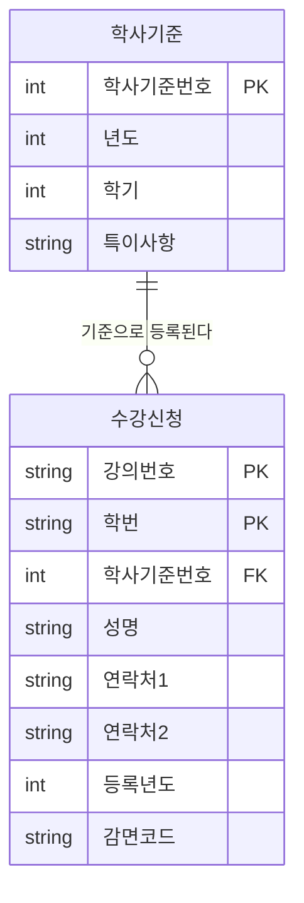

```
단, 학사기준과 수강신청은 조인하여 정보를 조회할 업무가 많음
```
① 학사기준번호는 부모 테이블에 이미 인덱스가 존재하기 때문에 상속받아 생긴 수강신청에는 학사기준번호 칼럼에 대한 별도의 인덱스가 필요하지 않다.  
② 학사기준번호는 부모 테이블에 이미 인덱스가 존재하나 수강신청과 조인에 의한 성능저하 예방을 위해 상속받아 생긴 수강신청에도 학사기준번호 칼럼에 대한 별도의 인덱스가 필요하다.  
③ 데이터모델에서는 관계를 연결하고 데이터베이스에 FK 제약조건 생성을 생략하는 경우에 학사기준번호에 대한 인덱스를 생성할 필요가 없다.  
④ 데이터모델에서는 관계를 연결하고 데이터베이스에 FK 제약조건 생성을 생략하는 경우에도 데이터의 조인관계가 필요하므로 학사기준번호에 대한 인덱스를 생성할 필요가 있다.

---

### ✅ 052  
다음 중 데이터가 여러 지역에 분산되어 있지만 하나의 데이터베이스처럼 사용하기를 원하는 분산데이터베이스 환경에서 데이터베이스 분산 설계를 적용하여 효율성을 증대시킬 수 없는 것은?

① 공통코드, 기준정보 등 마스터 데이터는 분산데이터베이스에 복제분산을 적용한다.  
② 거의 실시간(Near Real Time) 업무적인 특성을 가지고 있을 때 분산 데이터베이스를 사용하여 구성할 수 있다.  
③ 백업 사이트를 구성할 때 간단하게 분산기능을 적용하여 구성할 수 있다.  
④ Global Single Instance(GSI)를 구성할 때 분산데이터베이스를 활용하여 구성하는 것이 효율적이다.
