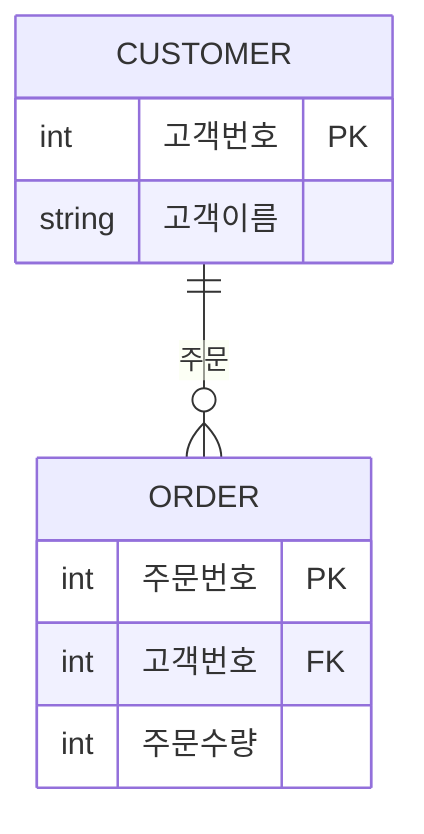

<style>
pre, code {
  white-space: pre-wrap !important;
  word-break: break-word !important;
  overflow-x: hidden !important;
  display: block !important;
  max-width: 100% !important;
  box-sizing: border-box !important;
}
</style> 

---
### 📁 모델링 BASIC (3구간 분할)

| 구간       | 문제 번호 | 주제 범위                              | 난이도     |
|------------|------------|----------------------------------------|------------|
| 1단계      | 001~020    | 모델링 개념, 엔터티·속성·관계의 기초  | ⭐ 초급~중급 |
| 2단계      | 021~036    | 관계 유형, 식별자, 성능 모델링 개요    | ⭐⭐ 중급~고급 |
| 3단계      | 037~052    | 정규화/반정규화 판단 및 실무 사례 분석 | ⭐⭐⭐ 고급~실무형 |

>“기초 → 관계/식별자 → 정규화/실무” 

#### ✅ 1단계: 001~020  
- 모델링의 정의, 필요성, 추상화/정확화 개념을 익히고  
- 엔터티, 속성, 관계의 기본 구조와 명명 규칙을 학습합니다.
 


---

```bash
[문제 1]  
모델링은 현실세계를 표현하는 것으로 이해할 수 있다. 다음 중 모델링의 특징으로 가장 부적절한 것은?

① 현실세계를 일정한 형식의 모델로 표현하는 추상화의 의미를 가짐  
② 시스템 구현만을 위해 진행하는 사전단계의 작업으로서 데이터베이스 구축을 위한 사전 작업의 의미만 가짐  
③ 복잡한 현실을 제한된 언어나 표기방법을 통해 쉽게 이해할 수 있는 단순화 의미를 가짐  
④ 현실세계를 일정한 형식으로 누구나 이해가 가능하도록 정확하게 현상을 기술하는 정확화 의미를 가짐  
```

**정답:** ②

**해설:**  
**🧸 쉬운 해설**  
모델링은 세상을 쉽게 설명하는 그림이야.  
②번은 “그림은 오직 컴퓨터 만들려고 그리는 거야!”라고 말하는데, 너무 좁게 본 거야!

**📚 전문 해설**  
모델링은 현실 세계를 표현하는 작업으로,  
- **추상화**: 핵심만 뽑아 표현  
- **단순화**: 이해하기 쉽게 구조화  
- **정확화**: 누구나 이해할 수 있도록 명확하게 기술  
②번은 모델링을 단순히 시스템 구현을 위한 사전 작업으로 한정하고 있어 부적절합니다.

**🔍 보기 설명**

| 번호 | 설명 | 적절성 |
|------|------|--------|
| ① | 추상화 | ✅ |
| ② | 시스템 구현만을 위한 작업 | ❌ |
| ③ | 단순화 | ✅ |
| ④ | 정확화 | ✅ |

**🧠 기억법**  
모델링의 3대 특징 = **추단정** → 추상화, 단순화, 정확화

**🃏 암기카드**  
- 카드 1: 모델링 = 현실을 추상화하여 표현하는 기술  
- 카드 19: 좋은 모델 = 완·중·재·통·의·업


---

```bash
[문제 2]  
다음 설명 중 데이터 모델링이 필요한 주요 이유로 가장 부적절한 것은?

① 업무규모를 구성하는 기초가 되는 정보를 대체 일정한 표기방법에 의해 표현함.  
② 분석된 결과물을 가지고 데이터베이스를 설계할 수 있는 기초 자료로 사용하기 위함.  
③ 데이터베이스를 구축하기 위한 용도를 위해 데이터모델링을 수행하고 업무에 대한 설명은 별도로 표기방법을 이용한다.  
④ 데이터모델링은 자료로서의 업무를 설명하고 분석하는 부분에 의미를 가지고 있다.  
```

**정답:** ③

**🧸 쉬운 해설  
데이터모델링은 일도 설명하는 표야.  
③번은 “일은 따로 설명하고 표는 컴퓨터용이야!”라고 말하는데, 그건 틀렸어!

### 📚 전문 해설  
데이터 모델링은  
- 업무를 **설명**하고  
- 업무를 **분석**하며  
- DB 설계의 **기초 자료**로 활용됩니다.  
③번은 업무 설명을 모델링과 분리한다고 하여 본질을 축소한 설명입니다.

### 🔍 보기 설명

| 번호 | 설명 | 적절성 |
|------|------|--------|
| ① | 정보 표현 | ✅ |
| ② | 설계 기초 | ✅ |
| ③ | 업무 설명은 별도 | ❌ |
| ④ | 업무 분석 | ✅ |

### 🧠 기억법  
데이터모델링 = **설명 + 분석 + 설계**

### 🃏 암기카드  
- 카드 1: 모델링 = 현실을 추상화하여 표현하는 기술  
- 카드 19: 좋은 모델 = 완·중·재·통·의·업


---

```bash
[문제 3]  
다음 중 데이터모델링을 할 때 유의해야 할 사항으로 가장 부적절한 것은?

① 여러 장소의 데이터베이스에 같은 정보를 저장하지 않도록 하여 중복을 최소화한다.  
② 데이터의 정의를 데이터의 사용 프로세스와 분리하여 독립성을 높인다.  
③ 사용자가 처리하는 프로세스나 정보 등에 따라 매번 달라질 수 있도록 프로그램과 데이터베이스의 관계를 늘 높인다.  
④ 데이터 간의 상호 연관관계를 명확하게 정의하여 일관성 있게 데이터를 유지되도록 한다.  
```

**정답:** ③

### 🧸 쉬운 해설  
③번은 “정보는 자꾸 바뀌게 만들자!”고 해서 틀렸어!  
정보는 깔끔하게 정리해야 해.

### 📚 전문 해설  
데이터 모델링의 핵심은  
- **중복 최소화**  
- **독립성 확보**  
- **일관성 유지**  
③번은 관계를 자주 변경하도록 유도하여 유지보수성과 안정성을 해치는 부적절한 접근입니다.

### 🔍 보기 설명

| 번호 | 설명 | 적절성 |
|------|------|--------|
| ① | 중복 최소화 | ✅ |
| ② | 독립성 강화 | ✅ |
| ③ | 관계 늘리기 | ❌ |
| ④ | 일관성 유지 | ✅ |

🧠 **기억법:**  
데이터모델링의 핵심은 **중독일**  
→ 중복 최소화, 독립성, 일관성 유지  
❌ 관계를 늘려서 복잡하게 만들면 안 돼!
 
**필요 암기카드:**  
- 🃏 카드 19: 좋은 모델 = 완·중·재·통·의·업  
- 🃏 카드 66: 도메인 무결성 = 값의 규칙  
- 🃏 카드 67: 엔터티 무결성 = 고유성 유지 
 

 
---
```bash
[문제 4]  
다음 중 아래 설명이 의미하는 데이터모델링의 유의점에 해당하는 특성은 무엇인가?

> 데이터 모델을 어떻게 설계했느냐에 따라 사소한 업무변화에도 데이터 모델이 수시로 변경되므로 유연성의 어려움을 가중시킬 수 있다. 데이터의 정의를 데이터의 사용 프로세스와 분리함으로써 데이터 모델은 데이터 혹은 프로세스의 변화가 애플리케이션과 데이터베이스에 중대한 변화를 일으킬 수 있는 가능성을 줄일 수 있다.

① 중복 ② 비유연성 ③ 비일관성 ④ 일관성
```


**정답:** ②

### 🧸 쉬운 해설  
②번은 “표가 너무 딱딱해서 조금만 바뀌어도 다시 만들어야 해!”라는 뜻이야.

### 📚 전문 해설  
비유연성은 데이터 모델이 업무 변화에 민감하게 반응하여 자주 수정이 필요한 상태를 의미합니다.  
유연한 모델은 데이터 정의와 사용 프로세스를 분리하여 변화에 강한 구조를 유지합니다.

**보기 설명:**  
① 중복: 같은 정보가 여러 번 나와요  
② 비유연성: 조금만 바뀌어도 다시 만들어야 해요  
③ 비일관성: 내용이 들쭉날쭉해요  
④ 일관성: 항상 똑같고 정돈돼 있어요  

🧸 **쉬운 해설:**  
②번은 “표가 너무 딱딱해서 조금만 바뀌어도 다시 만들어야 해!”라는 뜻이야.  
그래서 정답이야!

🧠 **기억법:**  
데이터모델링은 **유연성**이 중요!  
비유연성은 업무 변화에 약한 구조!

**필요 암기카드:**  
- 🃏 카드 19: 좋은 모델 = 완·중·재·통·의·업


---

```bash
[문제 5]  
다음 중 아래 데이터모델링 개념에 대한 설명에서 (가) , (나)에 들어갈 단어로 가장 적절한 것은?

> 전사적 데이터 모델링을 수행할 때 많이 하며, 추상화 수준이 높고 업무 중심적이고 포괄적인 수준의 모델링을 진행하는 것을 (가)  데이터 모델링이라고 한다. 이후 논리적 설계로 데이터베이스에 이식할 수 있도록 성능, 저장 등 물리적인 성격을 고려한 데이터 모델링을 (나)데이터모델링이라고 한다.

① (가)=개념적, (나)=물리적  
② (가)=논리적, (나)=개념적  
③ (가)=논리적, (나)=물리적  
④ (가)=개념적, (나)=논리적
```

**정답:** ①

**🧸 쉬운 해설** 
①번은 “먼저 큰 그림 그리고, 그다음 저장소에 맞게 조정하는 거야!”라는 뜻이야! 먼저 마을 전체를 그리는 큰 그림을 그려요.  그다음, 그림을 실제로 만들기 위해 저장소나 성능을 생각해요.  처음은 개념적, 나중은 물리적이에요!

**📚 전문 해설**  
모델링 단계는  
- **개념적 모델링**: 추상화 수준이 높고 업무 중심  
- **논리적 모델링**: 구조와 관계 정의  
- **물리적 모델링**: 성능, 저장소 등 기술적 요소 고려  
①번은 이 순서를 정확히 반영한 설명입니다.

**보기 설명:**  
① 개념적: 큰 그림을 그려요  
② 논리적: 구조를 정리해요  
③ 물리적: 저장과 성능을 생각해요  
④ 논리적: 실제 설계에 가까워요  

| 번호 | 설명 | 적절성 |
|------|------|--------|
| ① | 개념 → 물리 | ✅ |
| ② | 논리 → 개념 | ❌ |
| ③ | 논리 → 물리 | ❌ |
| ④ | 개념 → 논리 | ❌ |


🧸 **쉬운 해설:**  
①번은 “먼저 큰 그림 그리고, 그다음 저장소에 맞게 조정하는 거야!”라는 뜻이야!

🧠 **기억법:**  
모델링 단계는 **개→논→물** 순서!  
개념적 → 논리적 → 물리적

**필요 암기카드:**  
- 🃏 카드 20: 모델링 단계 = 개념 → 논리 → 물리


---
```bash
[문제 6]  
다음 중 ANSI-SPARC에서 정의한 3단계구조(three-level architecture)에서 아래 내용이 설명하는 스키마구조로 가장 적절한 것은?

> * 모든 사용자 관점을 통합한 조직 전체 관점의 통합적 표현  
> * 모든 응용시스템이나 사용자들의 필요를 하나의 데이터로 통합한 전체적 DB를 기술한 것  
> * DB의 개체들, 속성들, 관계를 정의하고 데이터 그룹 간의 관계를 표현하는 스키마

① 외부스키마 (External Schema)  
② 개념스키마 (Conceptual Schema)  
③ 내부스키마 (Internal Schema)  
④ 논리스키마 (Logical Schema)
```

**정답:** ②

**🧸 쉬운 해설**
모든 사람의 관점을 하나로 모은 그림을 ‘개념스키마’라고 해요.  이건 전체 조직을 위한 큰 그림이에요.

**📚 전문 해설  
ANSI-SPARC 3단계 구조에서  
- **외부스키마**: 사용자 관점  
- **개념스키마**: 조직 전체 관점  
- **내부스키마**: 저장소 중심  
②번은 조직 전체 관점을 표현하는 개념스키마에 해당합니다.

**보기 설명:**  
① 외부스키마: 개인용 그림이에요  
② 개념스키마: 모두를 위한 큰 그림이에요  
③ 내부스키마: 저장소 중심 그림이에요  
④ 논리스키마: 실제 용어엔 없어요  


🧸 **쉬운 해설:**  
②번은 “모든 사람의 관점을 하나로 모은 그림”이야!

🧠 **기억법:**  
ANSI-SPARC 3단계: **외→개→내**  
외부(사용자) → 개념(전체) → 내부(저장)

1. ANSI-SPARC 3단계 - DB 시스템의 구조적 계층 설명 - 사용자 화면 → ERD → 저장 구조
2. 모델링 단계       - DB를 설계하는 절차 - 요구사항 분석 → ERD → 테이블/인덱스 설계

**필요 암기카드:**  
- 🃏 카드 20: 모델링 단계 = 개념 → 논리 → 물리


---

```bash
[문제 7]  
다음 중 고객과 주문의 ERD에 대한 설명으로 가장 부적절한 것은?

① 한 명의 고객은 여러 개의 제품을 주문할 수 있다. 주문은 할 수도 있고 안 할 수도 있다.  
② 하나의 주문은 반드시 한 명의 고객에 의해 주문된다.  
③ 주문의 데이터를 입력할 때는 반드시 고객데이터가 존재해야 한다.  
④ 고객의 데이터를 입력할 때는 주문데이터가 존재하는 고객만을 입력할 수 있다.
```


① 한 명의 고객은 여러 개의 제품을 주문할 수 있다. 주문은 할 수도 있고 안 할 수도 있다.
② 하나의 주문은 반드시 한 명의 고객에 의해 주문된다.
③ 주문의 데이터를 입력할 때는 반드시 고객데이터가 존재해야 한다.
④ 고객의 데이터를 입력할 때는 주문데이터가 존재하는 고객만을 입력할 수 있다.

**정답:** ④

**🧸 쉬운 해설**  
④번은 “주문한 고객만 등록돼!”라는 말인데, 그건 아니지~ 고객은 주문하지 않아도 존재할 수 있어!

**📚 전문 해설  
ERD에서 고객과 주문은 1:N 관계입니다.  
- 고객은 주문을 하지 않아도 존재 가능  
- 주문은 반드시 고객에 의해 발생  
④번은 고객 등록을 주문 여부에 따라 제한하고 있어 부적절합니다.

**보기 설명:**  
| 번호 | 설명 | 적절성 |
|------|------|--------|
| ① | 주문은 선택적 | ✅ |
| ② | 주문은 고객 필수 | ✅ |
| ③ | 주문 시 고객 필요 | ✅ |
| ④ | 고객은 주문한 경우만 등록 | ❌ |


 
🧠 **기억법:**  
고객은 주문 없어도 존재 가능!  
주문은 고객이 있어야 가능!


**필요 암기카드:**  
- 🃏 카드 17: 식별 관계 = 생명주기 공유  
- 🃏 카드 18: 비식별 관계 = 독립적 연결


---

```bash
[문제 8]  
다음 중 ERD에 대한 설명으로 가장 부적절한 것은?

① 1976년 피터첸(Peter Chen)에 의해 Entity-Relationship Model(E-R Model)이라는 표기기법이 탄생하였다.  
② 일반적으로 ERD를 작성할 때에는 엔터티들을 도형에 배치 → 관계 설정 → 관계명 기술 → 관계차수 기술 순으로 진행한다.  
③ ERD 작성의 목적은 분석된 업무에 대해 데이터 측면에서 모델을 명확하게 표현하기 위함이다.  
④ 가장 중요한 엔터티를 우선 배치하여 작성해 나가며, 애매한 엔터티들은 원칙과 규칙에 따라 배치하는 것이 일반적이다.
```

**정답:** ④

 **🧸 쉬운 해설**
ERD는 전체 흐름과 관계를 고려해서 배치해야 해요. ④번은 “중요한 것부터 막 배치해!”라는 말인데,  그건 ERD 방식이 아니야!

**📚 전문 해설**  
ERD는 전체 흐름과 관계를 고려하여 배치해야 하며, 중요도보다는 구조적 연결성과 업무 흐름이 우선입니다.   ④번은 무조건 중요 엔터티부터 배치한다는 오해를 줍니다.

**보기 설명:**  
| 번호 | 설명 | 적절성 |
|------|------|--------|
| ① | ERD 창시자 | ✅ |
| ② | 작성 순서 | ✅ |
| ③ | 데이터 표현 목적 | ✅ |
| ④ | 중요도 우선 배치 | ❌ |


🧠 **기억법:**  
ERD 작성 순서: **도형 → 관계 → 이름 → 차수**  
중요도보다 구조와 흐름이 우선!

**필요 암기카드:**  
- 🃏 카드 1: 모델링 = 현실을 추상화하여 표현하는 기술  
- 🃏 카드 14: 엔터티 분류 = 유·개·사 / 기·중·행


###### ① **유·개·사** = **유형 / 개념 / 사건 엔터티**

| 축약 | 의미     | 설명 |
|------|----------|------|
| **유** | 유형 엔터티 | 실체가 있는 것 (예: 학생, 제품, 직원) |
| **개** | 개념 엔터티 | 실체는 없지만 관리 대상인 것 (예: 과목, 부서, 직급) |
| **사** | 사건 엔터티 | 활동이나 이벤트 (예: 수강신청, 주문, 입사기록) |

###### ② **기·중·행** = **기본 / 중심 / 행위 엔터티**

| 축약 | 의미     | 설명 |
|------|----------|------|
| **기** | 기본 엔터티 | 독립적으로 존재, 다른 엔터티에 의존하지 않음 (예: 회원, 상품) |
| **중** | 중심 엔터티 | 기본 엔터티 간 관계를 연결 (예: 주문, 수강신청) |
| **행** | 행위 엔터티 | 업무 처리 과정에서 발생하는 기록 (예: 결제내역, 출결기록) |

- **유·개·사**: “**무엇을 관리할까?**” → 실체, 개념, 사건
- **기·중·행**: “**어떻게 연결되고 기록될까?**” → 독립, 연결, 기록


---

```bash
[문제 9]  
다음 중 아래 시나리오에서 엔터티로 가장 적절한 것은?

> S병원은 여러 명의 환자가 존재하고 각 환자에 대한 이름, 주소 등을 관리하여야 한다. (단, 환자에 대한 엔터티의 특성을 살려 시나리오에 기술되어 있는 단어 중 단수형으로 대명사여야 함)

① 이름  
② 환자  
③ 나이  
④ 주소  
```

**정답:** ②

**해설:**  
병원에서는 ‘환자’를 관리하려고 해요.  ‘이름’, ‘주소’, ‘나이’는 환자에 대한 정보일 뿐, 관리 대상은 아니에요.  그래서 ‘환자’가 엔터티로 가장 적절해요.

**📚 전문 해설**  
엔터티는 관리 대상이며, 속성은 그 대상의 특징입니다.  
‘환자’는 관리 대상이고, 이름·주소·나이 등은 속성입니다.

**보기 설명:**  
| 번호 | 설명 | 적절성 |
|------|------|--------|
| ① | 이름 | ❌ 환자정보 |
| ② | 환자 | ✅ 관리대상 |
| ③ | 나이 | ❌ 환자정보 |
| ④ | 주소 | ❌ 환자정보 |
 
🧠 **기억법:**  
엔터티는 **누구를 관리할지**를 나타내는 단어!  
속성은 그 대상의 **정보**!

**필요 암기카드:**  
- 🃏 카드 1: 엔터티 = 관리할 대상  
- 🃏 카드 2: 속성 = 대상의 특징


---

```bash
[문제 10]  
다음 중 엔터티의 특징으로 가장 부적절한 것은?

① 속성이 없는 엔터티는 있을 수 없다. 엔터티는 반드시 속성을 가져야 한다.  
② 엔터티는 다른 엔터티와 관계가 있을 수 밖에 없다. 단독 엔터티는 없다.  
③ 객체지향적 디자인에서는 싱글턴 패턴처럼 단 하나의 인스턴스를 가지는 엔터티가 존재할 수 있다. 이와 유사히 엔터티는 단 1개의 인스턴스를 가질 수 있다.  
④ 데이터로 존재하고 업무에서 필요로 하면 해당 업무에 따라 엔터티로 성립될 수 있다.  
```

**정답:** ③

**해설:**  
③번은 “이건 하나만 있어도 돼!”라고 말하는데, 데이터는 보통 여러 개가 있어야 하니까 틀린 거야!

**📚 전문 해설**  
엔터티는 반복적으로 사용되는 데이터를 표현합니다.  ③번은 객체지향의 싱글턴 개념을 데이터모델링에 적용한 것으로 부적절합니다.

**보기 설명:**  

| 번호 | 설명 | 적절성 |
|------|------|--------|
| ① | 속성 필수 | ✅엔터티는 정보를 담아야 |
| ② | 관계 필수 | ✅다른 엔터티와 연결 |
| ③ | 단일 인스턴스 | ❌ 하나만 존재한다는 건 객체지향 개념|
| ④ | 업무 필요 기반 | ✅ 필요하면 엔터티로 만들 수 있어요 |


🧠 **기억법:**  
엔터티는 **반복되는 데이터**를 표현하는 거야!  객체지향의 싱글턴 개념은 데이터모델링에 적용하면 안 돼!
❌ 싱글턴 개념은 모델링에 적용 불가

**필요 암기카드:**  
- 🃏 카드 1: 엔터티 = 관리할 대상  
- 🃏 카드 61: PRIMARY KEY = 고유 이름표
 


---

```bash
[문제 11]  
다음 중 엔터티의 일반적인 특징으로 가장 부적절한 것은?

① 다른 엔터티와의 관계를 가지지 않는다.  
② 유일한 식별자에 의해 식별이 가능해야 한다.  
③ 엔터티는 업무 프로세스에 의해 이용되어야 한다.  
④ 엔터티는 반드시 속성을 포함해야 한다.
```

**정답:** ①

**🧸 쉬운 해설:**  
①번은 “엔터티는 혼자야!”라고 말하는데, 데이터는 서로 연결돼야 하니까 틀렸어!

**📚 전문 해설:**
엔터티는 일반적으로 다른 엔터티와 관계를 맺으며 업무 흐름을 구성합니다. ①번은 관계가 없다고 하여, 엔터티의 기본 개념에 어긋납니다.

**보기 설명:**  
| 번호 | 설명 | 적절성 |
|------|------|--------|
| ① | 관계 없음 | ❌ |
| ② | 식별자 필요 | ✅ |
| ③ | 업무 활용 | ✅ |
| ④ | 속성 포함 | ✅ |
 

🧠 **기억법:**  
엔터티는 **속성 + 관계 + 식별자**가 기본!


**필요 암기카드:**  
- 🃏 카드 1: 엔터티 = 관리할 대상  
- 🃏 카드 61: PRIMARY KEY = 고유 이름표  
- 🃏 카드 62: FOREIGN KEY = 연결 다리

---

```bash
[문제 12]  
다른 엔터티로부터 주식별자를 상속받지 않고 자신의 고유한 주식별자를 가지며,  
사원, 부서, 고객, 상품, 지점 등이 예가 될 수 있는 엔터티로 가장 적절한 것은?

① 기본 엔터티 (Key 엔터티)  
② 중심 엔터티 (Main 엔터티)  
③ 행위 엔터티 (Active 엔터티)  
④ 개념 엔터티
```

**정답:** ①

**🧸 쉬운 해설**  
①번은 “나는 내 이름으로 불려요!”라고 말하는 엔터티야.  
다른 엔터티한테 의존하지 않아!

**📚 전문 해설**  
기본 엔터티는 독립적으로 존재하며, 고유한 주식별자(PK)를 가집니다.  
사원, 부서, 고객 등은 다른 엔터티에 의존하지 않고 독립적으로 관리됩니다.


**🔍 보기 설명** 
| 번호 | 설명 | 적절성 |
|------|------|--------|
| ① | 기본 엔터티: 독립적이고 고유 식별자 보유 | ✅ |
| ② |  중심 엔터티: 전체 모델의 중심이지만 식별자 상속 여부와는 무관| ❌ |
| ③ | 행위 엔터티: 이벤트나 활동 중심   | ❌ |
| ④ | 개념 엔터티: 추상적 개념 | ❌ |


🧠 **기억법:**  
기본 엔터티 = **고유 식별자 + 독립적 존재**  
예: 고객, 사원, 부서, 상품 등

**필요 암기카드:**  
- 🃏 카드 14: 엔터티 분류 = 유·개·사 / 기·중·행  
- 🃏 카드 61: PRIMARY KEY = 고유 이름표

---

```bash
[문제 13]  
다음 중 엔터티의 이름을 부여하는 방법으로서 가장 부적절한 것은?

① 가능하면 약어를 사용하여 엔터티명을 부여한다.  
② 현업에서 사용하는 용어를 사용하여 업무와 관련성을 높인다.  
③ 엔터티명의 첫 글자는 반드시 한글로 표기한다.  
④ 엔터티명 생성 시 의미대로 간결하고 명확하도록 한다.
```

**정답:** ①

**🧸 쉬운 해설**  
①번은 “엔터티 이름을 줄여서 쓰자!”는 말인데,  
줄이면 사람들이 무슨 뜻인지 몰라서 헷갈릴 수 있어!

**📚 전문 해설**  
엔터티명에 약어를 사용하면 의미가 불명확해지고, 커뮤니케이션에 혼란을 줄 수 있습니다.  
가능하면 약어 사용은 피하는 것이 원칙입니다.

**보기 설명:**  
| 번호 | 설명 | 적절성 |
|------|------|--------|
| ① |  약어 사용:  의미가 불명확해질 수 있음 | ❌ |
| ② |  현업 용어: 업무와 연결돼서 좋음  | ✅ |
| ③ |한글 표기: 일부 표준에서는 요구되기도 함   | ✅ (표준에 따라 다름) |
| ④ | 간결 명확: 좋은 방식   | ✅ |
 

🧠 **기억법:**  
엔터티명은 **풀어서 명확하게!**  
❌ 약어는 혼란의 원인!
 
**필요 암기카드:**  
- 🃏 카드 1: 엔터티 = 관리할 대상  
- 🃏 카드 19: 좋은 모델 = 완·중·재·통·의·업


---

```bash
[문제 14]  
업무에서 필요로 하는 인스턴스에서 관리하고자 하는 의미상  
더 이상 분리되지 않는 최소의 데이터 단위를 무엇이라 하는가?
```

**정답:** 속성

**🧸 쉬운 해설**  
속성은 “이름, 나이, 주소”처럼 하나하나의 정보야!

**📚 전문 해설**  
속성(Attribute)은 엔터티를 구성하는 가장 작은 정보 단위입니다.  
예: 고객이라는 엔터티는 이름, 주소, 전화번호 등의 속성으로 구성됩니다.
 

🧠 **기억법:**  
속성 = **더 이상 나눌 수 없는 정보 조각**

**필요 암기카드:**  
- 🃏 카드 2: 속성 = 대상의 특징  
- 🃏 카드 15: 속성 구조 = 단일 / 복합 / 다중값

---

```bash
[문제 15]  
다음 중 속성에 대한 설명으로 가장 부적절한 것은?

① 엔터티에 대한 자세하거나 구체적인 정보를 나타낸다.  
② 하나의 엔터티는 두 개 이상의 속성을 갖는다.  
③ 하나의 인스턴스에서 각각의 속성은 하나 이상의 속성값을 가질 수 있다.  
④ 속성은 독립적이다.
```

**정답:** ③

**🧸 쉬운 해설**  
③번은 “이름이 두 개 있어도 돼!”라고 말하는데,  
한 사람은 이름 하나만 있어야지!

**📚 전문 해설**  
속성은 하나의 인스턴스에 대해 하나의 값만 가져야 합니다.  
③번은 하나의 속성이 여러 값을 가질 수 있다고 하여 1NF(제1정규형)에 위배됩니다.

**보기 설명:**  

| 번호 | 설명 | 적절성 |
|------|------|--------|
| ① | 구체 정보 | ✅ |
| ② | 속성 여러 개 | ✅ |
| ③ | 속성값 여러 개 | ❌ |
| ④ | 속성은 독립적 | ✅ |
 

🧠 **기억법:**  
속성은 **하나의 값만** 가져야 해요!  → 제1정규형(1NF) 위배 주의!

**필요 암기카드:**  
- 🃏 카드 15: 속성 구조 = 단일 / 복합 / 다중값  
- 🃏 카드 5: 1NF = 셀 안에 값 하나만

---

```bash
[문제 16]  
다음 중 아래와 같은 사례에서 속성에 대한 설명으로 가장 부적절한 것은?

> 우리은행은 예금구분(보통예금, 정기예금 등)과 이율, 예치기간, 예금잔액을 관리한다고 할 때,  
> 예금구분은 보통예금, 정기예금이라는 값을 가질 수 있으며, 이는 1000이상의 숫자로 표현되지 않는다.  
> 이율 속성은 소수점 이하 5.0% 또는 3.0%와 같은 숫자로 표현되며, 예치기간 속성은 년단위로 표시한다.  
> 예금잔액 속성은 원 단위로 숫자가 표현된다.

① 일반속성으로 코드 엔터티를 별도로 구성하고 참조하는 것이 관리상 효과적이다.  
② 예치기간은 기본(BASIC) 속성이다.  
③ 이자와 이율과 같은 파생(DERIVED) 속성일 수 있다.  
④ 예금분류는 설계(DESIGNED) 속성이다.
```

**정답:** ③

**🧸 쉬운 해설**  
③번은 “이율은 계산해서 나오는 값이야!”라고 말하는데, 사실은 그냥 입력하는 값이야! 
이율은 계산된 값이 아니라 직접 입력되는 값이기 때문에 파생 속성이라고 보기 어려워요.  
파생 속성은 예를 들어 ‘총금액 = 단가 × 수량’처럼 계산된 결과를 저장하는 속성이에요.

**📚 전문 해설**  
파생 속성은 계산된 결과를 저장하는 속성입니다.  
이율은 직접 입력되는 값이므로 파생 속성이 아니라 기본 속성입니다.


**보기 설명:**  
| 번호 | 설명 | 적절성 |
|------|------|--------|
| ① | 코드 참조 | ✅ |
| ② | 예치기간 = 기본속성 | ✅ |
| ③ | 이율 = 파생속성 | ❌ |
| ④ | 예금분류 = 설계속성 | ✅ |
 

🧠 **기억법:**  
파생 속성 = **계산해서 나오는 값**  
이율은 직접 입력하는 값 → 기본 속성!

**필요 암기카드:**  
- 🃏 카드 15: 속성 구조 = 단일 / 복합 / 다중값  
- 🃏 카드 3: 관계 = 연결선  
- 🃏 카드 66: 도메인 무결성 = 값의 규칙


---

```bash
[문제 17]  
다음 중 데이터를 조회할 때 빠른 성능을 낼 수 있도록 하기 위해  
원래 속성의 값을 계산하여 저장할 수 있도록 만든 속성으로 가장 적절한 것은?

① 파생속성 (Derived Attribute)  
② 기본속성 (Basic Attribute)  
③ 설계속성 (Designed Attribute)  
④ PK속성 (Primary Key Attribute)
```

**정답:** ①

**🧸 쉬운 해설**  
①번은 “미리 계산해서 저장해두는 정보”야!

**📚 전문 해설**  
파생 속성은 계산된 값을 저장하여 조회 성능을 높이는 속성입니다.  
예: ‘총금액 = 단가 × 수량’ 같은 계산 결과를 미리 저장해두는 방식입니다.

**보기 설명:**  
| 번호 | 설명 | 적절성 |
|------|------|--------|
| ① | 계산된 값 저장 | ✅ |
| ② | 기본값: 그냥 있는 값 | ❌ |
| ③ | 설계 속성: 설계 시 정의 | ❌ |
| ④ | PK속성: 식별자 속성 | ❌ |
  

🧠 **기억법:**  
파생속성 = **계산해서 미리 저장하는 값**

**필요 암기카드:**  
- 🃏 카드 15: 속성 구조 = 단일 / 복합 / 다중값  
- 🃏 카드 66: 도메인 무결성 = 값의 규칙


---

```bash
[문제 18]  
다음 중 아래 설명이 나타내는 데이터모델의 개념으로 가장 적절한 것은?

> 주문이라는 엔터티가 있을 때 단가라는 속성 값의 범위는 100에서 10,000 사이의 실수 값이며,  
> 제품명이라는 속성은 길이가 20자 이내의 문자열로 정의할 수 있다.

① 시스템카탈로그 (System Catalog)  
② 용어사전 (Word Dictionary)  
③ 속성사전 (Attribute Dictionary)  
④ 도메인 (Domain)
```

**정답:** ④

**🧸 쉬운 해설**  
④번은 “이 값은 이 범위 안에서만 써야 해!”라는 뜻이야!
 
**📚 전문 해설**  
도메인은 속성 값이 가질 수 있는 **범위나 형식**을 정의하는 개념입니다.  
예: 단가는 100~10,000 사이의 숫자, 제품명은 20자 이내의 문자열 등.
 

**보기 설명:**  
| 번호 | 설명 | 적절성 |
|------|------|--------|
| ① |시스템카탈로그: DB 구조 정보 저장 | ❌ |
| ② | 용어 정의: 용어 정의 | ❌ |
| ③ | 속성 목록: 속성 목록 | ❌ |
| ④ | 도메인: 값의 범위와 형식 정의 | ✅ |


🧠 **기억법:**  
도메인 = **값의 허용 범위 + 형식**

**필요 암기카드:**  
- 🃏 카드 66: 도메인 무결성 = 값의 규칙  
- 🃏 카드 65: CHECK = 조건 필터

---

```bash
[문제 19]  
다음 중 데이터모델링을 할 때 속성의 명칭을 부여하는 방법으로 가장 부적절한 것은?

① 속성의 이름에 약어를 사용할 경우 그 의미를 명확하게 이해할 수 없고  
혼돈을 초래하여 커뮤니케이션의 혼란을 야기할 수 있으므로 지나친  
약어 사용은 가급적 제한하도록 한다.  
② 속성의 이름에는 서술식 용어는 사용하지 않도록 한다.  
③ 직원 엔터티의 이름, 고객 엔터티의 이름과 같이 각 엔터티별로 동일한  
속성명을 사용하여 데이터모델의 일관성을 가져가는 것이 좋다.  
④ 데이터모델링 대상에서 사용하는 용어도 있고 외부에서 사용하는 용어  
도 있어 중복이 있을 때, 가급적 해당 업무에서 자주 사용하는 이름을  
이용하도록 한다.
```

**정답:** ③

**🧸 쉬운 해설**  
③번은 “모든 엔터티에 이름이라는 속성을 똑같이 써!”라는 말인데,  
그럼 헷갈릴 수 있어!

**📚 전문 해설**  
각 엔터티에 동일한 속성명을 사용하는 것은 혼동을 줄 수 있습니다.  
예: ‘이름’이라는 속성이 고객과 직원 모두에 있을 때, 구분이 어려워질 수 있습니다.


**보기 설명:**  
| 번호 | 설명 | 적절성 |
|------|------|--------|
| ① | 약어 제한 | ✅ |
| ② | 서술식 지양 | ✅ |
| ③ | 동일 속성명 반복 사용-혼동 유발 | ❌ |
| ④ | 자주 쓰는 용어 우선 | ✅ |
 

🧠 **기억법:**  
속성명은 **명확하고 구분 가능하게!**  
❌ 모든 엔터티에 같은 이름 쓰면 혼란!

 
**필요 암기카드:**  
- 🃏 카드 2: 속성 = 대상의 특징  
- 🃏 카드 19: 좋은 모델 = 완·중·재·통·의·업
 

---

```bash
[문제 20]  
다음 중 데이터모델링의 관계에 대한 설명으로 가장 부적절한 것을 2개 고르시오.

① 관계는 존재에 의한 관계와 행위에 의한 관계로 구분될 수 있으나 ERD에서는 관계를 연결할 때, 존재와 행위를 구분하지 않고 단일화된 표기법을 사용한다.  
② UML(Unified Modeling Language)에는 클래스다이어그램의 관계 중  연관관계(Association)와 의존관계(Dependency)가 있고 이것은 실선과 점선의 표기법으로 다르게 표현이 된다.  
③ 관계는 존재에 의한 관계와 행위에 의한 관계로 구분될 수 있고 ERD 에서는 관계를 연결할 때, 존재와 행위를 구분하여 실선과 접선의 표기법으로 다르게 표현한다.  
④ UML(Unified Modeling Language)에는 클래스다이어그램의 관계 중  연관관계(Association)와 의존관계(Dependency)가 있고 있으나 구분하지 않고 단일화된 표기법을 사용한다.
```

**정답:** ③, ④

**🧸 쉬운 해설**  
③번은 “ERD에서도 실선과 점선을 써!”라고 말하는데,  
ERD는 실선 하나로 표현해!

**📚 전문 해설**  
ERD에서는 관계를 연결할 때 존재적 관계와 행위적 관계를 **구분하지 않고** 단일한 표기법(보통 실선)을 사용합니다.  
③번은 ERD에서 실선과 점선을 구분한다고 했는데, 이는 UML의 특징이지 ERD의 특징이 아니에요.  
④번은 UML에서 연관관계와 의존관계를 구분하지 않는다고 했는데, 실제로는 **구분해서 다른 표기법(실선과 점선)**을 사용합니다.

**보기 설명:**  

| 번호 | 설명 | 적절성 |
|------|------|--------|
| ① | ERD = 실선 하나 (관계 구분 없이 단일 표기법 사용)| ✅ |
| ② | UML = 실선/점선 구분 | ✅ |
| ③ | ERD = 실선/점선 구분 | ❌ |
| ④ | UML = 방향성과 다중성 표현( UML에서 관계를 구분하지 않는다 ) | ✅ |
 

🧠 **기억법:**  
- **ERD**는 관계를 **단일 실선**으로 표현  
- **UML**은 관계를 **실선(Association)** 과 **점선(Dependency)** 으로 구분  
UML = 실선(연관), 점선(의존)
❌ ERD에서 선을 구분하거나 UML에서 구분하지 않는다는 설명은 틀림!
 
**필요 암기카드:**  
- 🃏 카드 41: JOIN 유형 = INNER / LEFT / FULL  
- 🃏 카드 20: 모델링 단계 = 개념 → 논리 → 물리

