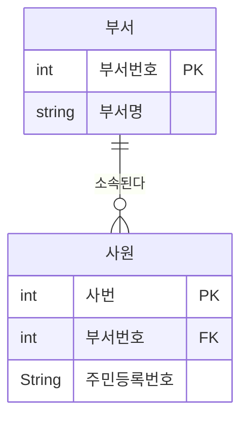
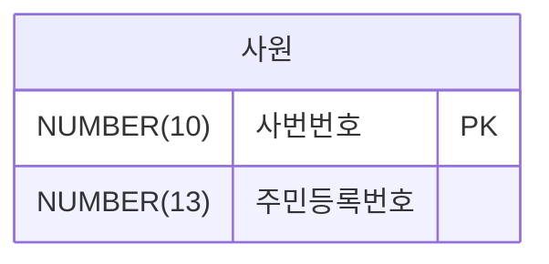
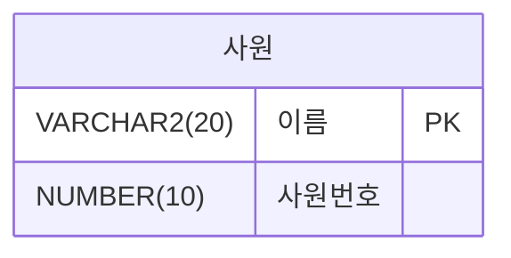
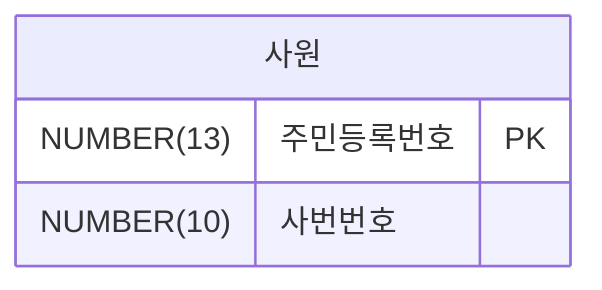
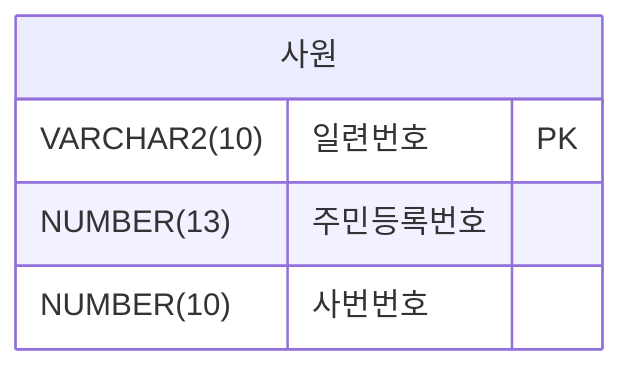
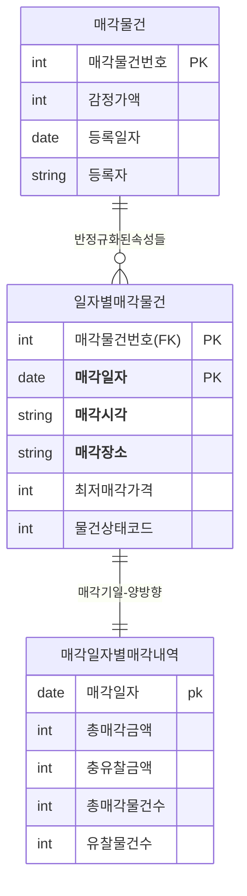

<style>
pre, code {
  white-space: pre-wrap !important;
  word-break: break-word !important;
  overflow-x: hidden !important;
  display: block !important;
  max-width: 100% !important;
  box-sizing: border-box !important;
}
</style> 

---
### 📁 모델링 BASIC (3구간 분할)

| 구간       | 문제 번호 | 주제 범위                              | 난이도     |
|------------|------------|----------------------------------------|------------|
| 1단계      | 001~020    | 모델링 개념, 엔터티·속성·관계의 기초  | ⭐ 초급~중급 |
| 2단계      | 021~036    | 관계 유형, 식별자, 성능 모델링 개요    | ⭐⭐ 중급~고급 |
| 3단계      | 037~052    | 정규화/반정규화 판단 및 실무 사례 분석 | ⭐⭐⭐ 고급~실무형 |

>“기초 → 관계/식별자 → 정규화/실무” 


#### ✅ 2단계: 021~036  
- 관계의 차수, 방향성, 식별자/비식별자 관계를 구분하고  
- 성능을 고려한 모델링 흐름과 트랜잭션 유형을 이해합니다.


---
```bash
[문제 21]  
다음 중 관계에 대한 설명으로 가장 부적절한 것은?

① 관계는 존재적 관계와 행위에 의한 관계로 나누어볼 수 있다.  
② 관계의 표기법은 관계명, 관계차수, 식별성의 3가지 개념을 사용한다.  
③ 부서와 사원 엔터티 간의 '소속' 관계는 존재적 관계의 사례이다.  
④ 주문과 배송 엔터티 간의 '배송근거' 관계는 행위에 의한 관계의 사례이다.
```

**정답:** ②


**🧸쉬운 해설:**  
②번은 “관계 그릴 때 식별성도 같이 표시해!”라고 말하는데,  
그건 관계의 속성이지 그림 요소는 아니야!

**📚 전문 해설**  
관계의 표기법은 일반적으로 **관계명과 관계차수**를 사용하지만,  
‘식별성’은 관계의 속성이지 표기법의 구성 요소는 아니에요.  
②번은 표기법과 관계 속성을 혼동한 설명입니다.

**보기 설명:**  
| 번호 | 설명 | 적절성 |
|------|------|--------|
| ① | 관계 유형 구분 (존재적/행위적) | ✅ |
| ② | 표기법에 식별성 포함 | ❌ |
| ③ | '소속' 관계 = 존재적 관계 | ✅ |
| ④ | '배송근거' 관계 = 행위적 관계 | ✅ | 


🧠 **기억법:**  
관계 표기법 = **관계명 + 관계차수**  
❌ 식별성은 표기법이 아니라 관계의 속성!

**필요 암기카드:**  
- 🃏 카드 12: 관계의 차수 = 몇 명이 연결?  
- 🃏 카드 13: 관계의 참여도 = 꼭 연결돼야 하나?

---

```bash
[문제 22]  
다음 중 엔터티간의 관계에서 1:1, 1:M과 같이 관계의 기수성을 나타내는  
것으로 가장 적절한 것은?

① 관계명(Relationship Membership)  
② 관계차수(Relationship Degree/Cardinality)  
③ 관계선택사양(Relationship Optionality)  
④ 관계정의(Relationship Definition)
```

**정답:** ②

**🧸 쉬운 해설:**  
②번은 “몇 명이 연결되는지 알려주는 숫자야!”  
예: 고객 1명은 주문 여러 개 가능 → 1:N

**📚 전문 해설**  
관계차수(Cardinality)는 관계의 **기수성**, 즉 몇 개의 인스턴스가 연결되는지를 나타내요.  
예: 1:1, 1:N, N:M 같은 표현이 바로 관계차수입니다.

**보기 설명:**  
| 보기 번호 | 설명 | 적절성 |
|-----------|------|--------|
| ① | 관계명: 관계의 이름 | ❌ |
| ② | 관계차수: 인스턴스 수 표현 | ✅ |
| ③ | 선택사양: 필수/선택 여부 | ❌ |
| ④ | 정의: 관계 설명 | ❌ |

**🧠 기억법:**  
기수성 = **Cardinality = 관계차수**

**필요 암기카드:**  
- 🃏 카드 12: 관계의 차수 = 몇 명이 연결?


---

```bash
[문제 23]  
다음 중 두 개의 엔터티 사이에 정의한 관계를 체크하는 사항으로 가장 부적절한 것은?

① 두 개의 엔터티 사이에 관심 있는 연관규칙이 존재하는가?  
② 두 개의 엔터티 사이에 정보의 조합이 발생되는가?  
③ 업무기술서, 장표에 관계연결을 가능하게 하는 명사 (Noun)가 있는가?  
④ 업무기술서, 장표에 관계연결에 대한 규칙이 서술되어 있는가?
```

**정답:** ③

🧸 **쉬운 해설:**  
③번은 “명사로 관계를 연결해!”라고 말하는데,  
관계는 동사로 연결해야 돼!

**📚 전문 해설**   
관계를 도출할 때는 **동사(Verb)** 가 핵심이에요.  
명사(Noun)는 엔터티를 나타내고, 관계를 연결하는 건 동사입니다.  
③번은 관계 연결 요소로 명사를 제시했기 때문에 부적절합니다.

**보기 설명:**  
| 보기 번호 | 설명 | 적절성 |
|-----------|------|--------|
| ① | 연관규칙 존재 여부 | ✅ |
| ② | 정보 조합 발생 여부 | ✅ |
| ③ | 명사로 관계 연결 | ❌ |
| ④ | 규칙 서술 여부 | ✅ |


🧠 **기억법:**  
관계 연결 키워드 = **동사(Verb)**  
❌ 명사는 엔터티 이름!

**필요 암기카드:**  
- 🃏 카드 13: 관계의 참여도 = 꼭 연결돼야 하나?  
- 🃏 카드 3: 관계 = 대상 간 연결
---

```bash
[문제 24]  
다음 중 두 개의 엔터티 사이에서 관계를 도출 할 때 체크 할 사항을  모두 고른 것은?

> 가. 두 개의 엔터티 사이에 관심있는 연관규칙이 존재하는가?  
> 나. 두 개의 엔터티 사이에 정보의 조합이 발생되는가?  
> 다. 업무기술서, 장표에 관계연결에 대한 규칙이 서술되어 있는가?  
> 라. 업무기술서, 장표에 관계연결을 가능하게 하는 동사(Verb)가 있는가?

① 가. 다. 라  
② 가. 다. 라  
③ 가. 나. 다  
④ 가. 나. 다. 라
```

**정답:** ④

🧸 **쉬운 해설:**  
④번은 “관계를 찾을 때 필요한 건 다 들어 있어!”  
규칙도 보고, 동사도 보고, 정보도 보고!

**📚 전문 해설**   
관계를 도출할 때는 연관규칙, 정보 조합, 규칙 서술, 동사 표현 모두 중요해요.  
이 네 가지가 모두 체크 포인트입니다.

**보기 설명:**  
| 보기 번호 | 설명 | 적절성 |
|-----------|------|--------|
| ① | 일부만 포함 | ❌ |
| ② | 일부만 포함 | ❌ |
| ③ | 라 누락 | ❌ |
| ④ | 전체 포함 | ✅ | 


🧠 **기억법:**  
관계 도출 4요소 = **규칙 + 조합 + 설명 + 동사**

**필요 암기카드:**  
- 🃏 카드 13: 관계의 참여도 = 꼭 연결돼야 하나?  
- 🃏 카드 3: 관계 = 대상 간 연결


---

```bash
[문제 25]  
다음 중 아래에서 주식별자를 지정할 때 고려해야 할 사항을 묶은 것으로 가장 적절한 것은?

> 가. 주식별자에 의해 엔티티 내의 모든 인스턴스들이 유일하게 구분되어야 한다.  
> 나. 주식별자를 구성하는 속성의 수는 유일성을 만족하는 최소의 수가 되어야 한다.  
> 다. 지정된 주식별자의 값은 자주 변하지 않는 것이어야 한다.  
> 라. 주식별자가 지정이 되면 반드시 값이 들어와야 한다.

① 가. 나. 다  
② 가. 나. 라  
③ 나. 다. 라  
④ 가. 나. 다. 라
```

**정답:** ④

🧸 **쉬운 해설:**  
④번은 “식별자는 꼭 있어야 하고, 안 바뀌고, 하나만 있어야 돼!”  
모든 조건을 다 갖췄어!


**📚 전문 해설**  
주식별자는 유일성, 안정성, 필수성 모두 만족해야 해요.  
④번은 이 모든 조건을 포함한 완전한 설명입니다.

**보기 설명:**  
| 보기 번호 | 설명 | 적절성 |
|-----------|------|--------|
| ① | 라 누락 | ❌ |
| ② | 다 누락 | ❌ |
| ③ | 가 누락 | ❌ |
| ④ | 전체 포함 | ✅ |


🧠 **기억법:**  
주식별자 4조건 = **유일성 + 최소성 + 안정성 + 필수성**

**필요 암기카드:**  
- 🃏 카드 61: PRIMARY KEY = 고유 이름표  
- 🃏 카드 60: 제약조건 = 생성 또는 수정 시 설정


 
---

```bash
[문제 26]  
다음 중 사원엔터티에서 식별자의 특성에 해당하지 않는 것은 무엇인가?

① 주식별자  
② 단일식별자  
③ 내부식별자  
④ 인조식별자
```


**정답:** ④

🧸 **쉬운 해설:**  
④번은 “사번은 시스템이 만든 번호야!”라고 말하는데,  
④번은 사람이 정한 번호니까 틀렸어!

**📚 전문 해설**  
사번은 실제 업무에서 사용되는 자연식별자예요.  
인조식별자는 시스템에서 생성된 값인데, ④ 번은 그렇지 않기 때문에 해당되지 않아요.

**보기 설명:**  
| 보기 번호 | 설명 | 적절성 |
|-----------|------|--------|
| ① | 주식별자 | ✅ |
| ② | 단일식별자 | ✅ |
| ③ | 내부식별자 | ✅ |
| ④ | 인조식별자 | ❌ | 


🧠 **기억법:**  
인조식별자 = **시스템이 자동 생성한 값**  
④ 사번은 자연식별자!
 
**필요 암기카드:**  
- 카드 61: PRIMARY KEY = 고유 이름표  
- 카드 63: UNIQUE = 중복 ❌, NULL 가능


---

```bash
[문제 27]  
다음 중 식별자로 가장 부적절한 것은?
```
①  


②  


③ 


④ 




**정답:** ②

🧸 **쉬운 해설:**  
②번은 “이름으로 사람을 구분할 수 있어!”라고 말하는데,  
세상에 같은 이름 가진 사람 많잖아!

**📚 전문 해설:**  
식별자는 반드시 **유일성**을 만족해야 해요.  
이름은 중복될 수 있기 때문에 식별자로 부적절합니다.
예를 들어 ‘김민수’라는 이름을 가진 사람이 여러 명 있을 수 있어요.

**보기 설명:**  
| 보기 번호 | 설명 | 적절성 |
|-----------|------|--------|
| ① | 사번번호: 유일함 | ✅ |
| ② | 이름: 중복 가능 | ❌ |
| ③ | 주민등록번호: 유일함 | ✅ |
| ④ | 일련번호: 시스템 생성 가능 | ✅ |


🧠 **기억법:**  
식별자는 **중복되면 안 돼!**  
이름은 절대 식별자로 쓰지 말기!

**필요 암기카드:**  
- 🃏 카드 61: PRIMARY KEY = 고유 이름표  
- 🃏 카드 63: UNIQUE = 중복 ❌, NULL 가능

---

```bash
[문제 28]  
다음 중 아래에서 엔터티 내에 주식별자를 도출하는 기준을 묶은 것으로  
가장 적절한 것은?

> 가. 해당 업무에서 자주 이용되는 속성을 주식별자로 지정한다.  
> 나. 명칭, 내역 등과 같이 이름으로 기술되는 것들을 주식별자로 지정한다.  
> 다. 복합으로 주식별자를 구성할 경우 너무 많은 속성을 포함하지 않도록 한다.  
> 라. 자주 수정되는 속성을 주식별자로 지정한다.

① 가, 나  
② 가, 다  
③ 다, 라  
④ 나, 라
```

**정답:** ②

🧸 **쉬운 해설:**  
②번은 “자주 쓰고, 너무 복잡하지 않은 걸로 골라!”  
이름이나 자주 바뀌는 건 식별자에 안 맞아!

**📚 전문 해설**  
주식별자는 자주 사용하는 속성이면서, 너무 많은 속성을 포함하지 않아야 해요.  
‘명칭’이나 ‘자주 수정되는 속성’은 식별자로 부적절합니다.

**보기 설명:**  
| 보기 번호 | 설명 | 적절성 |
|-----------|------|--------|
| ① | 나 포함: 이름 → ❌ | ❌ |
| ② | 가, 다 포함 | ✅ |
| ③ | 라 포함: 자주 수정 → ❌ | ❌ |
| ④ | 나, 라 포함 | ❌ |


🧠 **기억법:**  
식별자 도출 기준 = **자주 쓰는 + 안정적 + 간단한 속성**

**필요 암기카드:**  
- 🃏 카드 61: PRIMARY KEY = 고유 이름표  
- 🃏 카드 64: NOT NULL = 빈칸 금지

---

```bash
[문제 29]  
프로젝트를 전개할 때는 식별자관계와 비식별자관계를 선택하여 연결  
해야 하는 높은 수준의 데이터모델링 기술이 필요하다. 다음 중 비식별자  
관계를 선택하는 기준으로 가장 부적절한 것은?

① 관계의 강약을 분석하여 상호간에 연관성이 약할 경우 비식별자관계를 고려한다.  
② 자식테이블에서 독립적인 Primary Key의 구조를 가지기 원할 때 비식별자관계를 고려한다.  
③ 모든 관계가 식별자 관계로 연결되면 SQL Where절에서 비교하는 항목이 증가되어 조인에 참여하는 테이블에 따라 SQL문장이 길어져 SQL문의 복잡성이 증가되는 것을 방지하기 위해 비식별자관계를 고려한다.  
④ 부모엔터티의 주식별자를 자식엔터티에서 받아 손자엔터티까지 계속 흘려보내기 위해 비식별자관계를 고려한다.
```

**정답:** ④


🧸 **쉬운 해설:**  
④번은 “식별자를 계속 전달해!”라고 말하는데,  
비식별자는 전달 안 해도 되는 구조야!

**📚 전문 해설**  
④번은 오히려 식별자 관계를 사용할 때의 특징이에요.  
비식별자 관계는 부모의 식별자를 자식이 **받지 않는** 구조입니다.  
식별자를 계속 흘려보내는 건 비식별자 관계와 반대예요.

**보기 설명:**  
| 보기 번호 | 설명 | 적절성 |
|-----------|------|--------|
| ① | 연관성 약할 때 | ✅ |
| ② | 자식 PK 독립 | ✅ |
| ③ | SQL 복잡성 방지 | ✅ |
| ④ | 식별자 흘려보내기 | ❌ |

🧠 **기억법:**  
비식별자 관계 = **식별자 전달 안 함 + 자식 독립적**

**필요 암기카드:**  
- 🃏 카드 18: 비식별 관계 = 독립적 연결  
- 🃏 카드 61: PRIMARY KEY = 고유 이름표

---

```bash
[문제 30]  
다음 중 비식별자 관계로 연결하는 것을 고려해야 하는 경우로 가장 부적절한 것은?

① 부모엔터티에 참조값이 없어도 자식엔터티의 인스턴스가 생성될 수 있는 경우  
② 부모엔터티의 인스턴스가 자식 엔터티와 같이 소멸되는 경우  
③ 여러 개의 엔터티를 하나로 통합하면서 각각의 엔터티가 갖고 있던 여러 개의 개별 관계가 통합되는 경우  
④ 자식쪽 엔터티의 주식별자를 부모엔터티와는 별도로 생성하는 것이 더 유리하다고 판단하는 경우
```

**정답:** ②


🧸 **쉬운 해설:**  
②번은 “부모랑 자식이 같이 사라져!”라고 말하는데,  
그건 서로 너무 강하게 연결된 관계야!

**📚 전문 해설**   
②번은 식별자 관계의 특징이에요.  
부모와 자식이 함께 소멸되는 경우는 **강한 연관성**이 있기 때문에 식별자 관계로 연결하는 게 맞습니다.  
비식별자 관계는 자식이 독립적으로 존재할 수 있어야 해요.

**보기 설명:**  
| 보기 번호 | 설명 | 적절성 |
|-----------|------|--------|
| ① | 자식 독립 생성 | ✅ |
| ② | 함께 소멸 | ❌ 식별자 관계 특징 |
| ③ | 관계 단순화 | ✅ |
| ④ | 자식 PK 독립 생성 | ✅ | 


🧠 **기억법:**  
비식별자 관계 = **자식 독립 + 부모 없어도 존재 가능**

**필요 암기카드:**  
- 🃏 카드 18: 비식별 관계 = 독립적 연결  
- 🃏 카드 62: FOREIGN KEY = 연결 다리


---

```bash
[문제 31]  
다음 중 성능 데이터모델링에 대한 설명으로 가장 부적절한 것은?

① 성능이 저하된 결과를 대상으로 데이터모델 보다는 문제발생 시점의 SQL을 중심으로 집중하여 튜닝을 한다.  
② 데이터의 증가가 빠를수록 성능저하에 따른 성능개선비용은 증가한다  
③ 데이터모델은 성능을 튜닝하면서 변경이 될 수 있는 특징이 있다.  
④ 분석/설계 단계에서 성능을 고려한 데이터모델링을 수행할 경우 성능저하에 따른 Rework비용을 최소화 할 수 있는 기회를 가지게 된다.
```

**정답:** ①

🧸 **쉬운 해설:**  
①번은 “문제 생기면 SQL만 고치면 돼!”라고 말하는데,  
모델 자체가 문제일 수도 있어!

**📚 전문 해설:**  
성능 문제는 단순히 SQL 튜닝만으로 해결되지 않아요.  
데이터모델 자체가 성능에 영향을 주기 때문에 모델링 단계에서부터 고려해야 해요.

**보기 설명:**  
| 보기 번호 | 설명 | 적절성 |
|-----------|------|--------|
| ① | SQL만 튜닝 | ❌ |
| ② | 데이터 증가 → 비용 증가 | ✅ |
| ③ | 모델 변경 가능 | ✅ |
| ④ | 설계단계에서 성능 고려 | ✅ |

 

🧠 **기억법:**  
성능 튜닝은 **SQL + 모델링** 함께 고려해야 함!


**필요 암기카드:**  
- 🃏 카드 65: 성능 모델링 흐름 = 정규화 → 반정규화  
- 🃏 카드 66: 반정규화 = 성능 개선 전략


---

```bash
[문제 32]  
아래 설명을 읽고 다음 (가)에 들어갈 단어를 작성하시오.

> 첫번째, 데이터모델링을 할 때 정규화를 정확하게 수행한다.  
> 두번째, 데이터베이스 용량산정을 수행한다.  
> 세번째, 데이터베이스에 발생되는 트랜잭션의 유형을 파악한다.  
> 네번째, 용량과 트랜잭션의 유형에 따라 [  가  ]를 수행한다.  
> 다섯번째, 이력모델의 조정, PK/FK조정, 슈퍼타입/서브타입 조정 등을 수행한다.
```

**정답:** 반정규화

🧸 **쉬운 해설:**  
“정리 먼저 하고, 필요하면 다시 합쳐서 빠르게 만들자!”  
그게 반정규화야!

**📚 전문 해설:**  
정규화를 먼저 수행한 후, 성능이나 트랜잭션 특성에 따라 반정규화를 적용해요.  
반정규화는 성능 개선을 위한 전략입니다.

**🧠 기억법:**  
정규화 → 반정규화 = **정리 후 성능 최적화**


**필요 암기카드:**  
- 🃏 카드 66: 반정규화 = 성능 개선 전략  
- 🃏 카드 65: 성능 모델링 흐름 = 정규화 → 반정규화


---

```bash
[문제 33]  
다음 중 아래에서 성능을 고려한 데이터 모델링의 순서로 가장 적절한 것은?

① 가-나-다-라-마-바  
② 가-나-다-라-바-마  
③ 가-다-라-바-나-마  
④ 가-다-라-나-바-마
```
>가. 데이터 모델링을 할 때 정규화를 정확하게 수행한다.
나. 용량과 트랜잭션의 유형에 따라 반정규화를 수행한다.
다. 데이터베이스 용량산정을 수행한다.
라. 데이터베이스에 발생되는 트랜잭션의 유형을 파악한다.
마. 성능관점에서 데이터 모델을 검증한다.
바. 이력모델의 조정, PK/FK조정, 슈퍼타입/서브타입 조정 등을 수행한다.

**정답:** ④

🧸 **쉬운 해설:**  
④번은 “먼저 정리하고, 양과 흐름 보고, 다시 조정해서 성능 체크!”  
실제 프로젝트에서도 이렇게 해!

**📚 전문 해설:**  
정규화 → 용량산정 → 트랜잭션 파악 → 반정규화 → 구조 조정 → 성능 검증  
이 순서가 가장 논리적이고 실무에 적합합니다.


**보기 설명:**  
| 보기 번호 | 설명 | 적절성 |
|-----------|------|--------|
| ① | 순서 오류 | ❌ |
| ② | 순서 오류 | ❌ |
| ③ | 순서 오류 | ❌ |
| ④ | 논리적 순서 | ✅ |

🧠 **기억법:**  
모델링 순서 = **정→용→트→반→조→검**

**필요 암기카드:**  
- 🃏 카드 65: 성능 모델링 흐름 = 정규화 → 반정규화  
- 🃏 카드 66: 반정규화 = 성능 개선 전략


---

```bash
[문제 34]  
다음 중 성능데이터 모델링을 할 때 고려사항으로 가장 부적절한 것은?

① 데이터 모델링의 정규화는 항상 조회 성능저하를 나타내므로 반정규화 관점에서만 성능을 고려하여 설계하도록 한다.  
② 용량산정은 전체적인 데이터베이스에 발생되는 트랜잭션의 유형과 양을 분석하는 자료가 되므로 성능데이터 모델링을 할 때 중요한 작업이 될 수 있다.  
③ 물리적인 데이터 모델링을 할 때 PK/FK의 칼럼의 순서조정, FK인덱스 생성 등은 성능 향상을 위한 데이터 모델링 작업에 중요한 요소가 된다.  
④ 이력데이터는 시간에 따라 반복적으로 발생이 되기 때문에 대량 데이터일 가능성이 높아 특별히 성능을 고려하여 칼럼 등을 추가하도록 설계해야 한다.
```

**정답:** ①

🧸 **쉬운 해설:**  
①번은 “무조건 반정규화 해야 성능 좋아져!”라고 말하는데,  
그건 상황에 따라 달라!

**📚 전문 해설:**  
정규화는 반드시 성능을 저하시키는 것이 아니며,  
반정규화는 필요할 때만 적용해야 해요.  
①번은 지나치게 반정규화만 강조해서 부적절합니다.

**보기 설명:**  
| 보기 번호 | 설명 | 적절성 |
|-----------|------|--------|
| ① | 반정규화만 강조 | ❌ |
| ② | 용량산정 중요성 | ✅ |
| ③ | 물리적 설계 요소 | ✅ |
| ④ | 이력데이터 고려 | ✅ |


🧠 **기억법:**  
정규화 ≠ 성능 저하  
반정규화는 **선택적 전략**

**필요 암기카드:**  
- 🃏 카드 65: 성능 모델링 흐름 = 정규화 → 반정규화  
- 🃏 카드 66: 반정규화 = 성능 개선 전략


---

```bash
[문제 35]  
아래와 같은 보관금원장 엔터티에서 관서에 대한 정보가 반정규화 되어 있기 때문에 관서정보를 조회할 때 성능저하가 발생하고 있다. 이 엔터티에 대해 몇 차 정규화가 필요한 지와 분리된 스키마 구조를 가장 바르게 짝지은 것은?

함수종속성(FD):  
(관서번호, 납부자번호) → (직급명, 통신번호)  
(관서번호) → (관리점번호, 관서명, 상태, 관서등록일자)
```

 
| 사원 |
|------|
| 관서번호 <br/> 납부자번호|
| 관리점번호 <br/> 관서명 <br/>상태 <br/>관서등록일자<br/>직급명<br/>통신번호 |

 

① 2차 정규화 - 정규화테이블(<u>관서번호, 납부자번호</u>, 관리점번호, 관서명, 상태, 관서등록일자)
② 3차 정규화 - 정규화테이블(<u>관서번호, 납부자번호</u>, 관리점번호, 관서명,상태, 관서등록일자)
③ 2차 정규화 - 정규화테이블(<u>관서번호</u>, 관리점번호, 관서명, 상태, 관서등록일자)
④ 3차 정규화 - 정규화테이블(<u>관서번호</u>, 관리점번호, 관서명, 상태, 관서등록일자)

 

**정답:** ③

🧸 **쉬운 해설:**  
③번은 “관서번호만으로 정리되는 정보는 따로 떼자!”  
그게 2차 정규화야!

**📚 전문 해설:**  
관서번호에만 종속된 속성들을 분리해야 하므로 2차 정규화가 필요해요.  
③번은 정확히 그 구조를 반영한 정답입니다.

**보기 설명:**  
| 보기 번호 | 설명 | 적절성 |
|-----------|------|--------|
| ① | 복합키 유지 | ❌ |
| ② | 정규화 단계 과도 | ❌ |
| ③ | 부분 종속 제거 | ✅ |
| ④ | 단계 과도 | ❌ |


🧠 **기억법:**  
2차 정규화 = **부분 종속 제거**

**필요 암기카드:**  
- 🃏 카드 67: 2차 정규화 = 부분 종속 제거  
- 🃏 카드 68: 정규화 판단 기준 = 함수 종속성 분석


---

```bash
[문제 36]  
다음 중 아래 '일자별매각물건' 엔터티에 대한 설명으로 가장 적절한 것은?

- 일자별매각물건: 약 100만 건  
- 매각일자별매각내역: 약 2만 건
```

- 일자별매각물건: 약 100만 건
- 매각일자별매각내역: 약 2만 건
- **반정규화된 속성들**
    

```
① 1차 정규화가 필요한 엔터티로서 매각기일과 일자별매각물건으로 1:M
관계가 될 수 있다.
② 1차 정규화가 필요한 엔터티로서 매각기일과 일자별매각물건으로 1:1
관계가 될 수 있다.
③ 2차 정규화가 필요한 엔터티로서 매각기일과 일자별매각물건으로 1:M
관계가 될 수 있다.
④ 2차 정규화가 필요한 엔터티로서 매각기일과 일자별매각물건으로 1:1
관계가 될 수 있다.
```


**정답:** ③

🧸 **쉬운 해설:**  
③번은 “하나의 날짜에 여러 물건이 팔려!”  
그래서 1:M이고, 반복 정보는 정리해야 해!

**📚 전문 해설:**  
매각기일과 매각물건은 1:M 관계이며,  
반복되는 속성이 존재하므로 2차 정규화가 필요합니다.  
2차 정규화는 부분 함수 종속을 제거하는 과정입니다.

**보기 설명:**  
| 보기 번호 | 설명 | 적절성 |
|-----------|------|--------|
| ① | 1차 정규화 언급 → 부족 | ❌ |
| ② | 1:1 관계 → 구조 불일치 | ❌ |
| ③ | 2차 정규화 + 1:M 관계 → 정확 | ✅ |
| ④ | 2차 정규화 + 1:1 관계 → 관계 오류 | ❌ |

🧠 **기억법:**  
2차 정규화 = **반복 속성 정리 + 관계 파악**

**필요 암기카드:**  
- 🃏 카드 67: 2차 정규화 = 부분 종속 제거  
- 🃏 카드 68: 정규화 판단 기준 = 함수 종속성 분석