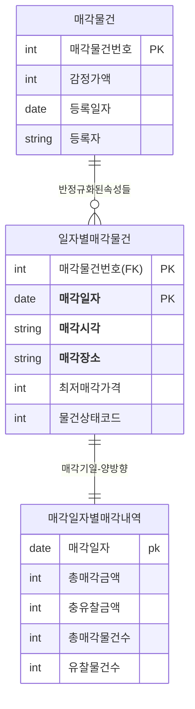

<style>
pre, code {
  white-space: pre-wrap !important;
  word-break: break-word !important;
  overflow-x: hidden !important;
  display: block !important;
  max-width: 100% !important;
  box-sizing: border-box !important;
}
</style> 


---

```bash
[문제 31]  
다음 중 성능 데이터모델링에 대한 설명으로 가장 부적절한 것은?

① 성능이 저하된 결과를 대상으로 데이터모델 보다는 문제발생 시점의 SQL을 중심으로 집중하여 튜닝을 한다.  
② 데이터의 증가가 빠를수록 성능저하에 따른 성능개선비용은 증가한다  
③ 데이터모델은 성능을 튜닝하면서 변경이 될 수 있는 특징이 있다.  
④ 분석/설계 단계에서 성능을 고려한 데이터모델링을 수행할 경우 성능저하에 따른 Rework비용을 최소화 할 수 있는 기회를 가지게 된다.
```

**정답:** ①

**해설:**  
성능 문제는 단순히 SQL 튜닝만으로 해결되지 않아요.  
데이터모델 자체가 성능에 영향을 주기 때문에 모델링 단계에서부터 고려해야 해요.  
①번은 너무 좁은 관점이라 부적절합니다.

**보기 설명:**  
① SQL만 튜닝 → ❌  
② 데이터 증가 → 비용 증가  
③ 모델 변경 가능  
④ 설계단계에서 성능 고려  

🧸 **쉬운 해설:**  
①번은 “문제 생기면 SQL만 고치면 돼!”라고 말하는데,  
모델 자체가 문제일 수도 있어!

🧠 **기억법:**  
성능 튜닝은 **SQL + 모델링** 함께 고려해야 함!


---

```bash
[문제 32]  
아래 설명을 읽고 다음 (가)에 들어갈 단어를 작성하시오.

> 첫번째, 데이터모델링을 할 때 정규화를 정확하게 수행한다.  
> 두번째, 데이터베이스 용량산정을 수행한다.  
> 세번째, 데이터베이스에 발생되는 트랜잭션의 유형을 파악한다.  
> 네번째, 용량과 트랜잭션의 유형에 따라 [  가  ]를 수행한다.  
> 다섯번째, 이력모델의 조정, PK/FK조정, 슈퍼타입/서브타입 조정 등을 수행한다.
```

**정답:** 반정규화

**해설:**  
정규화를 먼저 수행한 후, 성능이나 트랜잭션 특성에 따라 반정규화를 적용해요.  
반정규화는 성능 개선을 위한 전략입니다.

🧸 **쉬운 해설:**  
“정리 먼저 하고, 필요하면 다시 합쳐서 빠르게 만들자!”  
그게 반정규화야!

🧠 **기억법:**  
정규화 → 반정규화 = **정리 후 성능 최적화**


---

```bash
[문제 33]  
다음 중 아래에서 성능을 고려한 데이터 모델링의 순서로 가장 적절한 것은?

① 가-나-다-라-마-바  
② 가-나-다-라-바-마  
③ 가-다-라-바-나-마  
④ 가-다-라-나-바-마
```
>가. 데이터 모델링을 할 때 정규화를 정확하게 수행한다.
나. 용량과 트랜잭션의 유형에 따라 반정규화를 수행한다.
다. 데이터베이스 용량산정을 수행한다.
라. 데이터베이스에 발생되는 트랜잭션의 유형을 파악한다.
마. 성능관점에서 데이터 모델을 검증한다.
바. 이력모델의 조정, PK/FK조정, 슈퍼타입/서브타입 조정 등을 수행한다.

**정답:** ④

**해설:**  
정규화 → 용량산정 → 트랜잭션 파악 → 반정규화 → 구조 조정 → 성능 검증  
이 순서가 가장 논리적이고 실무에 적합합니다.

🧸 **쉬운 해설:**  
④번은 “먼저 정리하고, 양과 흐름 보고, 다시 조정해서 성능 체크!”  
실제 프로젝트에서도 이렇게 해!

🧠 **기억법:**  
모델링 순서 = **정→용→트→반→조→검**


---

```bash
[문제 34]  
다음 중 성능데이터 모델링을 할 때 고려사항으로 가장 부적절한 것은?

① 데이터 모델링의 정규화는 항상 조회 성능저하를 나타내므로 반정규화 관점에서만 성능을 고려하여 설계하도록 한다.  
② 용량산정은 전체적인 데이터베이스에 발생되는 트랜잭션의 유형과 양을 분석하는 자료가 되므로 성능데이터 모델링을 할 때 중요한 작업이 될 수 있다.  
③ 물리적인 데이터 모델링을 할 때 PK/FK의 칼럼의 순서조정, FK인덱스 생성 등은 성능 향상을 위한 데이터 모델링 작업에 중요한 요소가 된다.  
④ 이력데이터는 시간에 따라 반복적으로 발생이 되기 때문에 대량 데이터일 가능성이 높아 특별히 성능을 고려하여 칼럼 등을 추가하도록 설계해야 한다.
```

**정답:** ①

**해설:**  
정규화는 반드시 성능을 저하시키는 것이 아니며,  
반정규화는 필요할 때만 적용해야 해요.  
①번은 지나치게 반정규화만 강조해서 부적절합니다.

🧸 **쉬운 해설:**  
①번은 “무조건 반정규화 해야 성능 좋아져!”라고 말하는데,  
그건 상황에 따라 달라!

🧠 **기억법:**  
정규화 ≠ 성능 저하  
반정규화는 **선택적 전략**


---

```bash
[문제 35]  
아래와 같은 보관금원장 엔터티에서 관서에 대한 정보가 반정규화 되어 있기 때문에 관서정보를 조회할 때 성능저하가 발생하고 있다. 이 엔터티에 대해 몇 차 정규화가 필요한 지와 분리된 스키마 구조를 가장 바르게 짝지은 것은?

함수종속성(FD):  
(관서번호, 납부자번호) → (직급명, 통신번호)  
(관서번호) → (관리점번호, 관서명, 상태, 관서등록일자)
```

 
| 사원 |
|------|
| 관서번호 <br/> 납부자번호|
| 관리점번호 <br/> 관서명 <br/>상태 <br/>관서등록일자<br/>직급명<br/>통신번호 |

 

① 2차 정규화 - 정규화테이블(<u>관서번호, 납부자번호</u>, 관리점번호, 관서명, 상태, 관서등록일자)
② 3차 정규화 - 정규화테이블(<u>관서번호, 납부자번호</u>, 관리점번호, 관서명,상태, 관서등록일자)
③ 2차 정규화 - 정규화테이블(<u>관서번호</u>, 관리점번호, 관서명, 상태, 관서등록일자)
④ 3차 정규화 - 정규화테이블(<u>관서번호</u>, 관리점번호, 관서명, 상태, 관서등록일자)

 

**정답:** ③

**해설:**  
관서번호에만 종속된 속성들을 분리해야 하므로 2차 정규화가 필요해요.  
③번은 정확히 그 구조를 반영한 정답입니다.

🧸 **쉬운 해설:**  
③번은 “관서번호만으로 정리되는 정보는 따로 떼자!”  
그게 2차 정규화야!

🧠 **기억법:**  
2차 정규화 = **부분 종속 제거**


---

```bash
[문제 36]  
다음 중 아래 '일자별매각물건' 엔터티에 대한 설명으로 가장 적절한 것은?

- 일자별매각물건: 약 100만 건  
- 매각일자별매각내역: 약 2만 건
```

- 일자별매각물건: 약 100만 건
- 매각일자별매각내역: 약 2만 건
- **반정규화된 속성들**
    

① 1차 정규화가 필요한 엔터티로서 매각기일과 일자별매각물건으로 1:M
관계가 될 수 있다.
② 1차 정규화가 필요한 엔터티로서 매각기일과 일자별매각물건으로 1:1
관계가 될 수 있다.
③ 2차 정규화가 필요한 엔터티로서 매각기일과 일자별매각물건으로 1:M
관계가 될 수 있다.
④ 2차 정규화가 필요한 엔터티로서 매각기일과 일자별매각물건으로 1:1
관계가 될 수 있다.


**정답:** ③

**해설:**  
매각기일과 매각물건은 1:M 관계이며,  
반복되는 속성이 존재하므로 2차 정규화가 필요합니다.

🧸 **쉬운 해설:**  
③번은 “하나의 날짜에 여러 물건이 팔려!”  
그래서 1:M이고, 반복 정보는 정리해야 해!

🧠 **기억법:**  
2차 정규화 = **반복 속성 정리 + 관계 파악**


---

```bash
[문제 37]  
아래의 데이터 모델처럼 동일한 유형의 속성이 칼럼단위로 반복되는 경우가 실제 프로젝트를 하면서 많이 발생 될 수 있다. 다음 중 아래와 같이 전제조건이 있을 때 테이블에서 나타날 수 있는 현상으로 가장 적절한 것은?


전제조건: 
유형기능분류코드에 해당하는 속성들은 분포도가 양호 하며, 
SQL Where절에서 각각의 값이 상수값으로 조건 입력될 수 있는 특징을 가진다.
```

| 모델 |
|------|
|모델코드 (pk) |
|모델명   <br/> 제품류코드 <br/>  물품가    <br/> 출하가    <br/> **A유형기능분류코드1** <br/> **B유형기능분류코드2** <br/> **C유형기능분류코드3** <br/> **D유형기능분류코드4** <br/> **E유형기능분류코드5** <br/> **F유형기능분류코드6** <br/> **G유형기능분류코드7** <br/> **H유형기능분류코드8** <br/> **I유형기능분류코드9**  <br/> 바코드  <br/> 가로  <br/> 세로  <br/> 높이  <br/> 모델구분 |
 


①  조회 조건이 유형기능분류코드에 따라 반복되는 그룹이 칼럼단위로 되어 있으므로 제 1정규형이라고 할 수 있다.
② 유형기능분류코드에 대해 Where절에 조건으로 들어오는 값이 있으므로 PK와 이에 대한 Index만 있으면 SQL 문장은 빠르게 수행될 수 있다고 할 수 있다.
③ 유형기능분류코드가 일반속성 안에서 반복적으로 속성이 구분되어 있기 때문에 이전을 수행해야 하는 제 2정규형이라 할 수 있다.
④ 유형기능분류코드 각각에 대하여 개별로 Index를 모두 생성할 경우 입력, 수정, 삭제 때 성능이 저하되므로 제1차 정규화를 수행한 후 인덱 스를 적용하는 것이 좋다.


**정답:** ④

**해설:**  
반복 속성에 대해 인덱스를 모두 생성하면  
입력/수정/삭제 시 성능 저하가 발생할 수 있어요.  
정규화를 먼저 수행한 후 인덱스를 적용하는 것이 좋습니다.

🧸 **쉬운 해설:**  
④번은 “너무 많은 인덱스는 느려져!”  
먼저 정리하고 인덱스 걸자!

🧠 **기억법:**  
정규화 → 인덱스  
❌ 반복 속성에 무작정 인덱스 금지!


---

```bash
[문제 38]  
다음 중 아래 '일재고' 엔터티에 대한 설명으로 가장 적절한 것은?
```

```sql
[  일재고 ]
물류센터코드
재고일자
---------------
월초재고수량
장기재고 1개월수량
장기재고  2개월수량
장기재고  3개월수량
장기재고 1개월주문수량
장기재고 2개월주문수량
장기재고 3개월주문수량
장기재고 1개월금액
장기재고  2개월금액
장기재고  3개월금액
장기재고 1개월주문금액
장기재고 2개월주문금액
장기재고 3개월주문금액
 ```

① 1차 정규화가 필요한 엔터티로서 일재고와 일재고상세로 1:M의 관계가 될 수 있다.
② 1차 정규화가 필요한 엔터티로서 일재고와 일재고상세로 1:1의 관계가 될 수 있다.
③ 2차 정규화가 필요한 엔터티로서 일재고와 일재고상세로 1:M의 관계가 될 수 있다.
④ 2차 정규화가 필요한 엔터티로서 일재고와 일재고상세로 1:1의 관계가 될 수 있다.


**정답:** ①

**해설:**  
속성이 반복되고, 상세 정보로 분리 가능하므로  
1차 정규화가 필요하며, 일재고와 상세는 1:M 관계입니다.

🧸 **쉬운 해설:**  
①번은 “재고가 여러 달 걸쳐 반복돼!”  
그래서 상세로 나눠야 해!

🧠 **기억법:**  
1차 정규화 = **반복 속성 → 행으로 분리**

 

 

---

```bash
[문제 39]  
다음 중 아래와 같이 수강지도 엔터티를 만들었을 때 이에 해당하는 정규형과 정규화의 대상으로 가장 바르게 짝지어진 것은?

 
함수종속성(FD)  
1. 학번 || 과목번호 → 성적  
2. 학번 → 지도교수명  
3. 학번 → 학과명
```
| 수강지도 |
|------|
|학번 <BR> 과목코드 |
|성적   <br/> 지도교수명 <br/>  학과명   |


① 1차 정규형 - 2차 정규화 대상
② 2차 정규형 - 3차 정규화 대상
③ 3차 정규형 - 보이스코드 정규화대상
④ 보이스코드정규형 4차 정규화 대상


**정답:** ①

**해설:**  
현재 구조는 1차 정규형은 만족하지만,  
부분 함수 종속(학번 → 지도교수명, 학과명)이 존재하므로  
2차 정규화를 수행해야 합니다.

**보기 설명:**  
① 1차 정규형 상태, 2차 정규화 필요 → ✅  
② 2차 정규형 상태 아님  
③ 보이스코드 정규형은 아직 아님  
④ 4차 정규화는 너무 고차원  

🧸 **쉬운 해설:**  
①번은 “지금은 기본 정리만 돼 있고, 더 정리해야 해!”  
학번만으로 결정되는 정보는 따로 떼야 해!

🧠 **기억법:**  
2차 정규화 = **부분 함수 종속 제거**


---

```bash
[문제 40]  
다음 중 데이터 모델에 대한 반정규화를 고려할 때 판단요소에 대한 설명으로 가장 적절한 것은?

① 반정규화 정보에 대한 재현의 적시성으로 판단한다. 예들 들어, 빌링의 잔액(balance)은 다수 테이블에 대한 다량의 조인이 불가피하므로 데이터 제공의 적시성 확보를 위한 필수 반정규화 대상 정보이다.  
② 탐색 대상 데이터의 크기로 판단한다. 왜냐하면 다량 데이터에 대한 인덱스를 활용한 탐색은 Random처리의 특성으로 성능 저하가 불가피하다.  
③ RDBMS는 현재 레코드 기준으로 이전 또는 이후 위치의 레코드에 대한 접근이 원천적으로 불가능하므로 반정규화를 하지 않으면 해당 정보에 대한 데이터 접근 자체가 불가능하다.  
④ 반정규화 테이블은 집계 테이블에 국한하여 적용하도록 한다.
```

**정답:** ①

**해설:**  
반정규화는 **데이터 제공의 적시성**을 확보하기 위한 전략이에요.  
특히 잔액처럼 여러 테이블을 조인해야 하는 경우,  
성능을 위해 미리 계산된 값을 저장하는 것이 효과적입니다.

**보기 설명:**  
① 적시성 확보 → ✅  
② 탐색 크기만으로 판단은 부족  
③ RDBMS는 순차 접근 가능  
④ 집계 테이블에만 적용은 제한적  

🧸 **쉬운 해설:**  
①번은 “빨리 보여줘야 할 정보는 미리 계산해서 저장해!”  
잔액 같은 건 바로 보여줘야 하니까!

🧠 **기억법:**  
반정규화 판단 기준 = **성능 + 적시성**


---

```bash
[문제 41]  
다음 중 하나의 테이블의 전체 칼럼 중 자주 이용하는 집중화된 칼럼들이 있을 때  디스크 I/O를 줄이기 위해 해당 칼럼들을 별도로 모아놓는 반정규화 기법으로 가장 적절한 것은?

① 칼럼추가 - 부분갈림 추가  
② 칼럼추가 - 중복칼럼 추가  
③ 테이블추가 - 중복테이블추가  
④ 테이블추가 - 부분테이블추가
```

**정답:** ④

**해설:**  
자주 사용하는 칼럼만 따로 모아서 별도 테이블로 분리하면  
디스크 접근량이 줄어들고 성능이 향상돼요.  
이런 방식이 바로 **부분테이블추가** 기법입니다.

**보기 설명:**  
① 칼럼 분기: 구조 복잡  
② 중복 칼럼: 관리 어려움  
③ 중복 테이블: 데이터 중복  
④ 부분 테이블: ✅ 성능 향상  

🧸 **쉬운 해설:**  
④번은 “자주 쓰는 정보만 따로 모아놓자!”  
그래야 빨리 찾고 덜 느려져!

🧠 **기억법:**  
부분테이블추가 = **핵심 칼럼만 따로 빼서 빠르게 접근**

