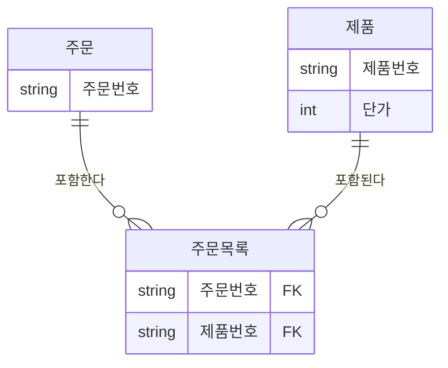
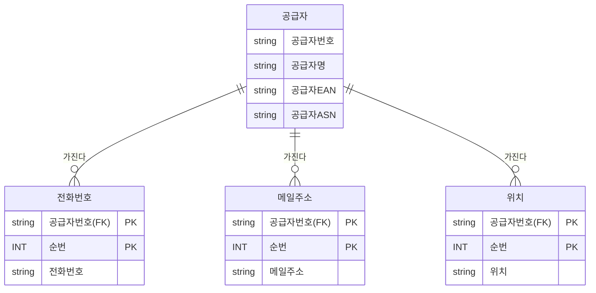
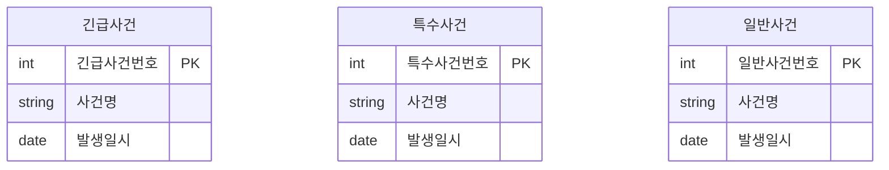
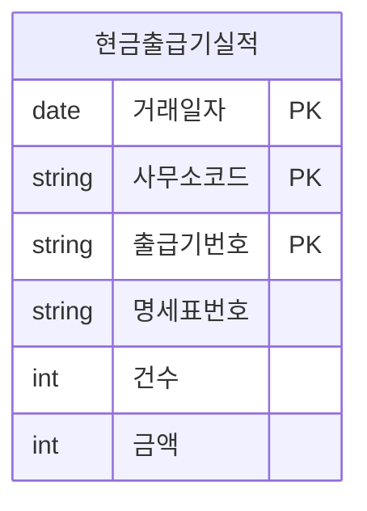
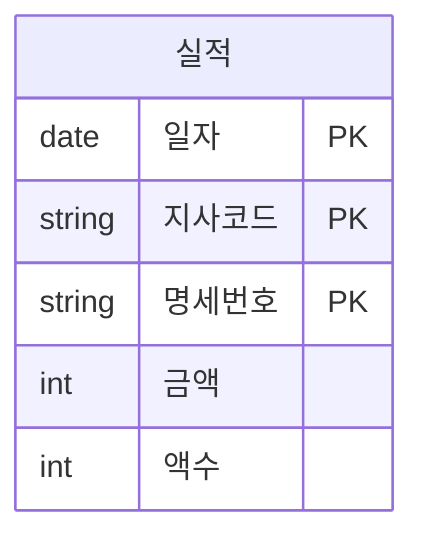
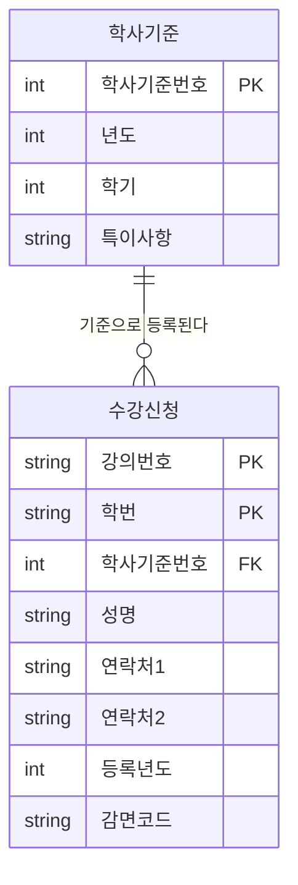

<style>
pre, code {
  white-space: pre-wrap !important;
  word-break: break-word !important;
  overflow-x: hidden !important;
  display: block !important;
  max-width: 100% !important;
  box-sizing: border-box !important;
}
</style> 


---

```bash
[문제 42]  
다음 중 칼럼에 대한 반정규화 기법으로 가장 부적절한 것은?

① 중복칼럼을 추가 - 조인감소를 위해 여러 테이블에 동일한 칼럼을 갖도록 한다.  
② 파생칼럼을 추가한다 - 조회 성능을 우수하게 하기 위해 미리 계산된 칼럼을 갖도록 한다.  
③ FK에 대한 속성을 추가한다 - FK관계에 해당하는 속성을 추가하여 조인성능을 높인다.  
④ 이력테이블에 기능 칼럼을 추가한다 - 최신값을 처리하는 이력의 특성을 고려하여 기능성 칼럼을 추가한다.
```

 
**정답:** ③

**해설:**  
FK 속성을 추가하는 것은 반정규화가 아니라 **정규화된 관계를 유지하는 방식**이에요.  
반정규화는 성능 향상을 위해 **중복, 계산값, 기능성 칼럼** 등을 추가하는 방식입니다.

**보기 설명:**  
① 중복칼럼 추가: 반정규화 맞음  
② 파생칼럼 추가: 반정규화 맞음  
③ FK 속성 추가: ❌ 정규화 유지 목적  
④ 기능 칼럼 추가: 반정규화 맞음  

🧸 **쉬운 해설:**  
③번은 “외래키 속성을 그냥 더 넣자!”는 말인데,  
그건 반정규화가 아니라 관계 유지야!

🧠 **기억법:**  
반정규화 = **중복, 계산, 기능 칼럼 추가**  
❌ FK 속성 추가는 관계 유지 목적!

---

```bash
[문제 43]  
다음 중 아래의 주문, 주문목록, 제품에 대한 데이터모델과 이를 이용하여 데이터를 조회하는 SQL문에서 조회를 빠르게 수행하기 위한 반정규화 방법으로 가장 적절한 것은?
```


```sql
SELECT A.주문번호, SUM(C.단가)
FROM 주문 A, 주문목록 B, 제품 C
WHERE A.주문번호 = '2015-02-001
AND A.주문번호 = B.주문번호
AND B.제품번호 = C.제품번호
GROUP BY A.주문번호
```
```
① 제품 엔터티에 단가를 합한 계산된 칼럼을 추가하도록 한다.
② 주문목록 엔터티에 단가를 합한 계산된 칼럼을 추가하도록 한다.
③ 주문 엔터티에 단가를 합한 계산된 칼럼을 추가하도록 한다.
④ 제품 엔터티에 최근값 여부에 대한 칼럼을 추가하도록 한다.
```

**정답:** ③

**해설:**  
단가의 합계는 주문 단위로 자주 조회되므로,  
주문 엔터티에 **계산된 합계 칼럼**을 추가하면 성능이 향상됩니다.

**보기 설명:**  
① 제품에 합계 추가: ❌ 제품은 단가만 가짐  
② 주문목록에 합계 추가: ❌ 주문 단위 아님  
③ 주문에 합계 추가: ✅ 정답  
④ 최근값 여부: 성능과 무관  

🧸 **쉬운 해설:**  
③번은 “주문할 때마다 총액을 미리 계산해서 넣자!”  
그래야 조회가 빠르지!

🧠 **기억법:**  
반정규화 = **자주 쓰는 계산값 미리 저장**


 
---

```bash
[문제 44]  
다음 중 아래 데이터모델에 대한 설명으로 가장 부적절한 것은?
```


>- 공급자의 데이터는 1000만건 이상의 대량 데이터를 가진 테이블임
>- 전화번호, 메일주소, 위치는 자주 변경이 될 수 있으며 데이터 조회를 할 때는 항상 최근에 변경된 값을 조회하게 됨
```
① 공급자별로 최근에 변경된 전화번호, 메일주소, 위치와 공급자 이름을
같이 조회할 때 이 값들을 공급자 테이블에 반정규화로 갖고 있는 경우
에 비해 조회 성능이 저하되지 않는다.
② 데이터를 조회할 때 과도한 조인으로 인해 조회성능이 저하될 수 있으
므로 공급자 테이블에 가장 빈번하게 조회되는 값인 최근 변경값에
해당하는 전화번호, 메일주소, 위치를 반정규화하여 조회 성능을 향상
시킬 수 있다.
③ 전화번호, 메일주소, 위치에 대한 가장 최근에 변경된 값을 알 수 있도
록 최신여부 라는 속성을 추가함으로써 최근 값을 찾기 위한 조회 성능
저하를 예방할 수 있다.
④ 조회 성능을 위해서는 하나의 테이블로 통합하여 전화번호, 메일주소,
위치 등이 변경될 경우 전체 속성이 계속 발생되는 이력의 형태로 설계
될 수 있다. 이럴 경우 조회에 대한 성능은 향상이 되나, 과도한 데이터
가 한 테이블에 발생하게 되어 용량이 너무 커지는 단점이 있다.
```


**정답:** ①

**해설:**  
최근 변경된 값들을 공급자 테이블에 반정규화하지 않으면  
조회 시마다 조인이 발생해 성능이 저하됩니다.  
①번은 반정규화가 없어도 성능이 저하되지 않는다고 했으므로 틀렸어요.

**보기 설명:**  
① 반정규화 없어도 성능 저하 없음 → ❌  
② 최근값 반정규화 → 맞음  
③ 최신여부 속성 추가 → 맞음  
④ 통합 테이블 설계 → 맞음  

🧸 **쉬운 해설:**  
①번은 “조인 없이도 성능 괜찮아!”라고 말하는데,  
실제로는 조인 때문에 느려질 수 있어!

🧠 **기억법:**  
자주 조회되는 값 = **반정규화 대상**

---

```bash
[문제 45]  
다음 중 칼럼수가 많은 테이블에 대한 설명으로 가장 적절한 것은?

①한 테이블에 많은 칼럼을 가지고 있으면 조인이 발생되지 않아 여러
개 테이블일 때에 비해 성능이 항상 우수하다고 할 수 있다.
② 로우체이닝이 발생할 정도로 한 테이블에 많은 칼럼들이 존재할 경우
조회성능저하가 발생할 수 있다. 한 테이블내에서 칼럼의 위치를 조정
하면 디스크 1/0가 줄어들어 조회 성능을 향상 시킬 수 있다.
③로우채이닝이 발생할 정도로 한 테이블에 많은 칼럼들이 존재할 경우
조회성능저하가 발생할 수 있다. 트랜잭션이 접근하는 칼럼유형을 분
석하여 1:1로 테이블을 분리하면 디스크 1/0가 줄어들어 조회 성능을
향상 시킬 수 있다.
④ 로우체이닝이 발생할 정도로 한 테이블에 많은 칼럼들이 존재할 경우
조회성능저하가 발생할 수 있다. 그러나 이를 분리할 경우 조인으로
인한 성능 저하가 더 심하게 나타날 수 있으므로 감수하는 것이 좋다.

```


**정답:** ③

**해설:**  
칼럼이 많으면 로우체이닝이 발생해 성능이 저하될 수 있어요.  
트랜잭션이 접근하는 칼럼 유형에 따라 **1:1 테이블 분리**가 성능 개선에 효과적입니다.

>로우체이닝(Row Chaining)은 데이터베이스에서 하나의 행(row)이 여러 블록에 나뉘어 저장되는 현상을 말해요. 이 현상은 특히 칼럼이 많거나, 자주 업데이트되는 테이블에서 발생

> 해결 방법: 칼럼 유형별 테이블 분리
자주 접근하는 칼럼과 그렇지 않은 칼럼을 1:1 관계로 분리

예: 사용자 테이블에서 로그인 정보는 자주 쓰지만 프로필 사진은 드물게 쓰임 → 따로 분리!

**보기 설명:**  
① 칼럼 많아도 성능 우수 → ❌  
② 칼럼 위치 조정 → 일부 효과  
③ 칼럼 유형별 분리 → ✅  
④ 분리하면 더 느려짐 → ❌  

🧸 **쉬운 해설:**  
③번은 “자주 쓰는 칼럼만 따로 떼자!”  
그래야 디스크 접근이 줄어들어 빨라져!

🧠 **기억법:**  
칼럼 많을 땐 → **접근 패턴 따라 분리**

---

```bash
[문제 46]  
아래 설명에서 데이터 액세스 성능을 향상시키기 위해 적용하는 방법에 대해서 [빈칸] 채우시오.


>하나의 데이블에 많은 양의 데이터가 저장되면 인덱스를 추가하고
테이블을 몇 개로 쪼개도 성능이 저하되는 경우가 있다. 이때 논리적
으로는 하나의 테이블이지만 물리적으로는 여러 개의 테이블로 분리
하여 데이터 액세스 성능도 향상시키고, 데이터 관리방법도 개선할
수 있도록 테이블에 적용하는 기법을 [  빈칸  ]이라고 한다.
```

**정답:** 파티셔닝

**해설:**  
파티셔닝은 하나의 테이블을 **물리적으로 여러 개로 나누는 기법**이에요.  
대량 데이터의 성능 향상과 관리 효율을 위해 사용됩니다.

🧸 **쉬운 해설:**  
“너무 큰 테이블은 나눠서 관리하자!”  
그게 바로 파티셔닝이야!

🧠 **기억법:**  
파티셔닝 = **물리적 분할로 성능 향상**


---

```bash
[문제 47]  
다음 중 아래 데이터 모델과 SQL문에 대해 개선해야 할 사항에 대한 설명으로 가장 적절한 것은?
```



```sql
SELECT 긴급사건번호, 사건명 FROM 긴급사건 WHERE 발생일시 = '20150905'
UNION ALL
SELECT 특수사건번호, 사건명 FROM 특수사건 WHERE 발생일시 = '20150905'
UNIONALL
SELECT 일반사건번호, 사건명 FROM 일반사건 WHERE 발생일시 = '20150905

※ 전제조건 : 위 세 테이블은 함께 조회하는 경우가 대부분이고 아직 시스템을
오픈하지 않았다.
```

```
① UNION ALL로 조회하면 정렬로 인한 성능이 저하되므로 UNION으로 조합하여 조회한다.
② 긴급사건, 특수사건, 일반사건을 하나의 테이블로 통합하고 PK를 사건 분류코드 + 사건번호로 조합하여 구성하도록 한다.
③ 긴급사건, 특수사건, 일반사건 테이블을 개별로 유지하되 PK에 사건 분류코드를 포함하도록 한다.
④ 세 개의 테이블을 그대로 유지하되 반정규화된 형태의 통합테이블을 하나 더 생성하여 조회의 성능을 향상하도록 한다.
```


**정답:** ②

**해설:**  
세 테이블을 자주 함께 조회하므로  하나의 테이블로 통합하고 **사건 분류코드 + 사건번호**로 PK를 구성하는 것이 효율적입니다.

**보기 설명:**  
① UNION 사용 → 정렬 오버헤드  
② 통합 + 복합 PK → ✅  
③ 개별 유지 + 분류코드 → 불필요  
④ 통합테이블 추가 → 중복 관리  

🧸 **쉬운 해설:**  
②번은 “자주 같이 쓰니까 하나로 합치자!”  
그리고 구분코드로 구분하면 돼!

🧠 **기억법:**  
자주 함께 조회 = **통합 + 구분코드**

---

 

```bash
[문제 48]  
다음 중 논리데이터모델의 슈퍼타입과 서브타입 데이터모델을 물리적인 테이블 형식으로 변환할 때 설명으로 가장 부적절한 것은?

① 트랜잭션은 항상 전체를 대상으로 일괄 처리하는데 테이블은 서브타입 별로 개별 유지하는 것으로 변환하면 Union 연산에 의해 성능이 저하 될 수 있다.
② 트랜잭션은 항상 서브타입 개별로 처리하는데 테이블은 하나로 통합하여 변환하면 불필요하게 많은 양의 데이터가 집적되어 있어 성능이 저하될 수 있다.
③ 트랜잭션은 항상 슈퍼+서브 타입을 함께 처리하는데 개별로 유지 하면 조인에 의해 성능이 저하될 수 있다.
④ 트랜잭션은 항상 전체를 통합하여 분석 처리하는데 하나로 통합되어 있으면 데이터 집적으로 인해 성능이 저하될 수 있다.
```

**정답:** ④

**해설:**  
통합 테이블은 데이터 집적이 심해져서 성능 저하가 발생할 수 있어요.  
④번은 통합이 항상 좋다고 했기 때문에 부적절합니다.

**보기 설명:**  
① 서브타입 분리 → UNION 성능 저하  
② 통합 시 과도한 집적 → 맞음  
③ 개별 유지 시 조인 성능 저하 → 맞음  
④ 통합이 항상 좋다 → ❌  

🧸 **쉬운 해설:**  
④번은 “하나로 합치면 무조건 좋아!”라고 말하는데,  
너무 많으면 오히려 느려져!

🧠 **기억법:**  
통합 = 관리 편함  
하지만 **성능은 상황 따라 다름**


---

```bash
[문제 49]  
다음 중 아래와 같은 '현금출급기실적' 테이블과 이 테이블에서 데이터를 조회할 때 사용되는 아래의 SQL패턴에 대한 설명으로 가장 적절한 것은?
```



```sql
SELECT 건수, 금액
FROM 현금출급기실적
WHERE 거래일자 BETWEEN  '20140701' AND '20140702'
AND 사무소코드= '000368'
(단, PK인덱스는 설계된 순서 그대로 생성함) 
```
```
① 사무소코드가 '='로 상수값이 들어 왔고, 거래일자가 범위 'BETWEEN'으로 들어왔기 때문에 거래일자+사무소코드+출급기번호+명세표번호로 구성된 PK인덱스는 최적의 효율성을 가지고 있음.  
② 사무소코드가 '='로 상수값이 들어 왔고, 거래일자가 범위 'BETWEEN'으로 들어왔기 때문에 PK의 순서를 사무소코드+출급기번호+명세표번호+거래일자로 바꾸고 인덱스를 생성하는 것이 성능에 유리함.  
③ 사무소코드가 '='로 상수값이 들어 왔고, 거래일자가 범위 'BETWEEN'으로 들어왔기 때문에 PK의 순서를 거래일자+출급기번호+명세표번호+사무소코드로 바꾸고 인덱스를 생성하는 것이 성능에 유리함.  
④ 사무소코드가 '='로 상수값이 들어 왔고, 거래일자가 범위 'BETWEEN'으로 들어왔기 때문에 PK의 순서를 사무소코드+거래일자+출급기번호+명세표번호로 바꾸고 인덱스를 생성하는 것이 성능에 유리함.
```

**정답:** ④

**해설:**  
인덱스는 WHERE절 조건의 사용 순서와 일치해야 성능이 좋습니다.  
사무소코드가 '=' 조건이고 거래일자가 범위 조건이므로,  
사무소코드가 먼저 오고 거래일자가 뒤에 오는 인덱스 순서가 가장 효율적입니다.

**보기 설명:**  
① 거래일자 먼저 → 범위 조건 먼저는 비효율  
② 사무소코드 먼저, 거래일자 맨 뒤 → ❌  
③ 거래일자 먼저, 사무소코드 맨 뒤 → ❌  
④ 사무소코드 + 거래일자 순서 → ✅  

🧸 **쉬운 해설:**  
④번은 “먼저 정확히 찾고, 그다음 범위로 좁히자!”  
정확한 조건이 앞에 있어야 빨라!

🧠 **기억법:**  
인덱스 순서 = **EQUAL 조건 먼저, 범위 조건 뒤**

---

```bash
[문제 50]  
다음 중 아래의 엔터티와 이 엔터티를 매우 빈번하게 참조하는 SQL의 성능에 대한 설명으로 가장 적절한 것은?
```


```sql
SELECT 건수, 금액
FROM 실적
WHERE 일자 BETWEEN '20110101' AND '20110102'
AND 지사코드 ='1001'

(단, PK 인덱스가 존재하며 칼럼순서대로 인덱스가 생성되어 있고, 이 SQL이 트랜잭션의 대부분을 차지한다고 가정함)
```
```
① 명세번호를 실적 테이블에 맨 처음 칼럼으로 옮기면 PK 인덱스의 이용 효율성이 향상된다.  
② 지사코드에 대해 입력 값이 EQUAL 조건으로 사용되므로 지사코드를 실적 테이블의 맨 처음 위치로 옮겨서 일자 칼럼의 앞에 두면 인덱스 이용 효율성이 높아진다.  
③ 일자가 SQL 문장의 WHERE절에 첫 번째 조건으로 나왔으므로 칼럼 순서에서도 첫 번째에 위치하는 것이 효율성이 높다.  
④ 일자, 명세번호, 지사코드로 칼럼 순서를 바꾸어야 일자 범위에 대한 내용을 먼저 식별하고, 그 다음으로 지사코드를 찾기에 용이할 수 있으므로 이때 인덱스의 효율성이 가장 높다.
```


**정답:** ②

**해설:**  
지사코드가 '=' 조건으로 자주 사용되므로,  
인덱스 순서에서 지사코드를 앞에 배치하면 성능이 향상됩니다.  
범위 조건인 일자는 뒤로 배치하는 것이 효율적입니다.

**보기 설명:**  
① 명세번호 먼저 → ❌  
② 지사코드 먼저 → ✅  
③ 일자 먼저 → 범위 조건 우선은 비효율  
④ 일자 먼저, 명세번호 중간 → ❌  

🧸 **쉬운 해설:**  
②번은 “정확히 찾는 조건을 먼저 써야 빨라!”  
지사코드가 '='니까 앞에 두자!

🧠 **기억법:**  
인덱스 순서 = **정확 조건(EQUAL) 먼저, 범위(BETWEEN) 뒤**

---

```bash
[문제 51]  
다음 중 아래 데이터모델에 표현된 FK(Foreign Key)에 대한 설명으로 가장 적절한 것을 2개 고르시오.
```



```
단, 학사기준과 수강신청은 조인하여 정보를 조회할 업무가 많음

① 학사기준번호는 부모 테이블에 이미 인덱스가 존재하기 때문에 상속받아 생긴 수강신청에는 학사기준번호 칼럼에 대한 별도의 인덱스가 필요하지 않다.  
② 학사기준번호는 부모 테이블에 이미 인덱스가 존재하나 수강신청과 조인에 의한 성능저하 예방을 위해 상속받아 생긴 수강신청에도 학사기준번호 칼럼에 대한 별도의 인덱스가 필요하다.  
③ 데이터모델에서는 관계를 연결하고 데이터베이스에 FK 제약조건 생성을 생략하는 경우에 학사기준번호에 대한 인덱스를 생성할 필요가 없다.  
④ 데이터모델에서는 관계를 연결하고 데이터베이스에 FK 제약조건 생성을 생략하는 경우에도 데이터의 조인관계가 필요하므로 학사기준번호에 대한 인덱스를 생성할 필요가 있다.
```

**정답:** ②, ④

**해설:**  
조인 성능을 위해 FK 칼럼에도 인덱스를 생성하는 것이 좋습니다.  
제약조건을 생략하더라도 조인 성능을 위해 인덱스는 필요합니다.

```
CREATE INDEX 인덱스이름 ON 테이블이름(칼럼이름);
CREATE INDEX idx_수강신청_학사기준번호 ON 수강신청(학사기준번호);
```

**보기 설명:**  
① 부모 인덱스만 있으면 된다 → ❌  
② 자식 테이블에도 인덱스 필요 → ✅  
③ 제약조건 없으면 인덱스 불필요 → ❌  
④ 제약조건 없어도 인덱스 필요 → ✅  

🧸 **쉬운 해설:**  
②,④번은 “조인할 거면 인덱스는 꼭 있어야 해!”  
제약조건 없어도 성능엔 인덱스가 중요해!

🧠 **기억법:**  
FK 인덱스 = **조인 성능 확보용 필수 요소**


---

```bash
[문제 52]  
다음 중 데이터가 여러 지역에 분산되어 있지만 하나의 데이터베이스처럼 사용하기를 원하는 분산데이터베이스 환경에서 데이터베이스 분산 설계를 적용하여 효율성을 증대시킬 수 없는 것은?


① 공통코드, 기준정보 등 마스터 데이터는 분산데이터베이스에 복제분산을 적용한다.  
② 거의 실시간(Near Real Time) 업무적인 특성을 가지고 있을 때 분산 데이터베이스를 사용하여 구성할 수 있다.  
③ 백업 사이트를 구성할 때 간단하게 분산기능을 적용하여 구성할 수 있다.  
④ Global Single Instance(GSI)를 구성할 때 분산데이터베이스를 활용하여 구성하는 것이 효율적이다.
```
**정답:** ④

**해설:**  
Global Single Instance(GSI)는 **단일 인스턴스**로 운영되는 구조이기 때문에  
분산데이터베이스와는 개념적으로 맞지 않습니다.  
④번은 분산환경에 적합하지 않아요.

**보기 설명:**  
① 마스터 데이터 복제 → 맞음  
② 실시간 업무 → 맞음  
③ 백업 사이트 구성 → 맞음  
④ GSI에 분산DB 적용 → ❌  

🧸 **쉬운 해설:**  
④번은 “하나로 운영하는 시스템에 분산을 쓰자!”는 말인데,  
그건 구조가 안 맞아!

🧠 **기억법:**  
GSI = **단일 인스턴스**  
❌ 분산 구조와는 반대 개념