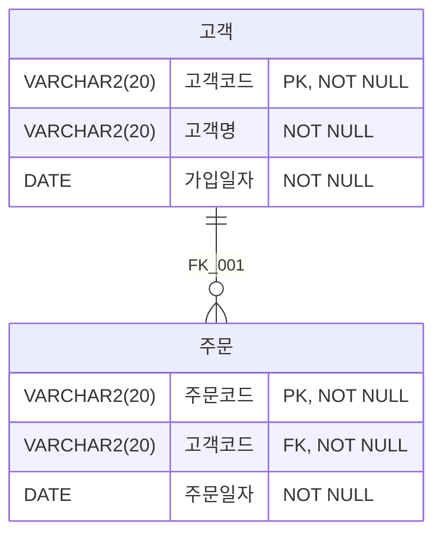
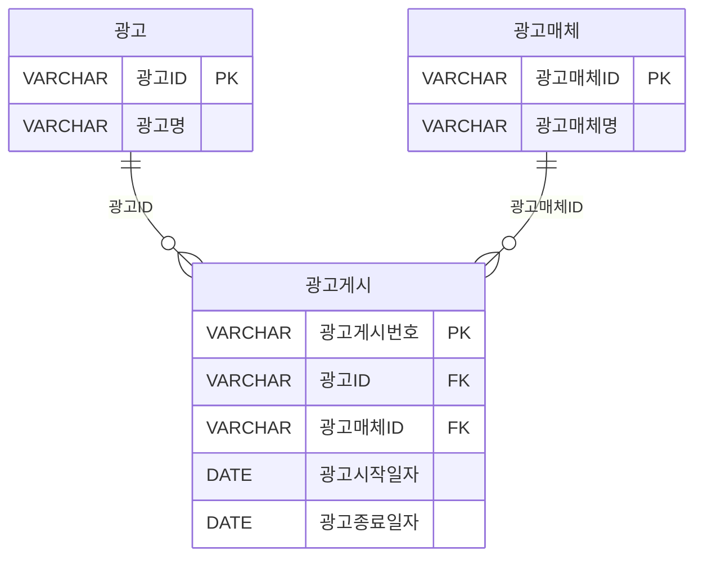

---
### 📁 SQL BASIC

| 구간 | 문제 번호 | 주제 | 난이도 |
|------|------------|------|--------|
| 1~10 | 001~010 | SQL 명령어 분류 및 기본 | ⭐ 초급 |
| 11~20 | 011~020 | 테이블 생성 및 제약조건 | ⭐⭐ 초~중급 |
| 21~30 | 021~030 | 관계 설정 및 트랜잭션 | ⭐⭐ 중급 |
| 31~40 | 031~040 | SELECT 조건 및 NULL 처리 | ⭐⭐⭐ 중~고급 |
| 41~50 | 041~050 | 고급 함수 및 날짜/CASE | ⭐⭐⭐ 고급 |
| 51~64 | 051~064 | 실전 SELECT + GROUP BY/HAVING + JOIN | ⭐⭐⭐⭐ 실무형 |

#### ✅ 1~10번: SQL 명령어 분류 및 기본 개념
- DDL, DML, DCL, TCL 구분
- 기본 테이블 생성 및 제약조건
- 초보자 필수 개념

#### ✅ 11~20번: 테이블 생성, 제약조건, 데이터 조작
- 테이블 명명 규칙, DEFAULT, INDEX, PK/FK
- INSERT/DELETE/ALTER 관련 실습 문제

#### ✅ 21~30번: 관계 설정, FK 제약, 트랜잭션 처리
- 관계형 모델, FK 삭제 동작, COMMIT/ROLLBACK
- 오류 발생 조건, 데이터 무결성

#### ✅ 31~40번: 트랜잭션, SELECT, 집계 함수, NULL 처리
- 트랜잭션 흐름, SAVEPOINT, SELECT 조건절
- COUNT, DISTINCT, IS NULL 등 실전 활용

#### ✅ 41~50번: 고급 SQL 함수, 날짜 처리, CASE 문
- LENGTH, REPLACE, TO_DATE, TO_CHAR
- CASE 문 변형, GROUP BY 조건


#### ✅ 51~64번: 실전 SELECT + GROUP BY/HAVING + JOIN
- 집계 함수와 조건 필터링, 정렬, 다중 테이블 JOIN 
- CASE + ORDER BY, 서브쿼리, 실행 순서 등 실무형 SQL


---

### ✅001. 
다음 중 데이터 제어어(DCL)에 해당하는 명령어는?
① INSERT  
② RENAME  
③ COMMIT  
④ REVOKE  

**정답** : 4


---

### ✅002. 
다음 중 아래 내용의 범주에 해당하는 SQL 명령어로 옳지 않은 것은?

> 테이블의 구조를 생성, 변경, 삭제하는 등 데이터 구조를 정의하는데 사용되는 명령어이다.

① CREATE  
② GRANT  
③ ALTER  
④ DROP  


**정답** : 2


---

### ✅003. 
아래 내용에 해당하는 SQL 명령어의 종류를 작성하시오.
   
> 논리적인 작업의 단위를 묶어 DML에 의해 조작된 결과를 작업 단위(Transaction)별로 제어하는 명령어인 Commit, Rollback, Savepoint 등이 여기에 해당하며, 일부에서는 DCL(Data Control Language)로 분류하기도 한다.
 


**정답** : TCL


---

### ✅004. 
데이터베이스를 정의하고 접근하기 위해서는 데이터베이스 관리 시스 템과의 통신수단이 필요한데 이를 데이터 언어(Data Language) 라고 하며, 그 기능과 사용 목적에 따라 데이터 정의어(DDL), 데이터 조작어 (DML), 데이터 제어어(DCL)로 구분된다. 다음 중 데이터 언어와 SQL 명령어에 대한 설명으로 가장 부적절한 것은?

① 비절차적 데이터 조작어(DML)는 사용자가 무슨 데이터를 원하며, 어떻게 그것을 접근해야 되는지를 명세하는 언어이다.  
② DML은 데이터베이스 사용자가 응용 프로그램이나 질의어를 통하여 저장된 데이터베이스를 실질적으로 접근하는데 사용되며 SELECT, INSERT, DELETE, UPDATE 등이 있다.  
③ DDL은 스키마, 도메인, 테이블, 뷰, 인덱스를 정의하거나 변경 또는 제거할 때 사용되며 CREATE, ALTER, DROP, RENAME 등이 있다.  
④ 호스트 프로그램 속에 삽입되어 사용되는 DML 명령어들을 데이터 부속어(Data Sub Language)라고 한다.  


**정답** : 1

---

### ✅005.  
다음 중 데이터베이스 시스템 언어의 종류와 해당되는 명령어를 바르게 연결한 것을 2개 고르시오.

① DML - SELECT  
② TCL - COMMIT  
③ DCL - DROP  
④ DML - ALTER  


**정답** : 1,2


---

### ✅006  
다음 중 아래의 데이터 모델과 같은 테이블 및 PK 제약조건을 생성하는 DDL 문장으로 올바른 것은? (단, DBMS는 Oracle을 기준으로 한다.)
 
| PRODUCT |
|------|
| PROD_ID: VARCHAR2(10) NOT NULL |
| PROD_NM VARCHAR2(100) NOT NULL <br/> REG DT: DATE NOT NULL <br/> REGR NO NUMBER(10) NULL |

[IE 표기법]
 

 
| PRODUCT |
|------|
| **PRODUCT()** <br/> # PROD_ID VARCHAR2(10) <br/> +PROD_NM VARCHAR2(100) <br/> + REG_DT DATE <br/>o REGR NO NUMBER(10)|

[Barker 표기법]

①  
```sql
CREATE TABLE PRODUCT
(PROD_ID VARCHAR2(10) NOT NULL,
 PROD_NM VARCHAR2(100) NOT NULL,
 REG DT DATE NOT NULL,
 REGR NO NUMBER(10) NULL);
ALTER TABLE PRODUCT ADD PRIMARY KEY PRODUCT_PK ON (PROD_ID);
```

②  
```sql
CREATE TABLE PRODUCT
(PROD_ID VARCHAR2(10),
 PROD_NM VARCHAR2(100),
 REG_DT DATE,
 REGR_NO NUMBER(10));
ALTER TABLE PRODUCT ADD CONSTRAINT PRODUCT_PK
PRIMARY KEY (PROD_ID);
```

③  
```sql
CREATE TABLE PRODUCT
(PROD_ID VARCHAR2(10) NOT NULL,
 PROD_NM VARCHAR2(100) NOT NULL,
 REG_DT DATE NOT NULL,
 REGR NO NUMBER(10) NULL,
 ADD CONSTRAINT PRIMARY KEY (PROD_ID));
```

④  
```sql
CREATE TABLE PRODUCT
(PROD_ID VARCHAR2(10) NOT NULL,
 PROD_NM VARCHAR2(100) NOT NULL,
 REG_DT DATE NOT NULL,
 REGR_NO NUMBER(10),
 CONSTRAINT PRODUCT_PK PRIMARY KEY (PROD_ID));
```


**정답** : 4


---

### ✅007   
아래와 같이 데이터가 들어있지 않은 왼쪽의 기관분류 테이블 (가)를 오른쪽 기관분류 테이블 (나)처럼 변경하고자 할 때 다음 중 올바른 SQL 문장은? (단, DBMS는 SQLServer로 가정한다.) 

```
(가)
[  기관분류  ]
분류 ID:VARCHAR(10) NOT NULL 
-------------------------------
분류명 : VARCHAR(10) NOT NULL 
등록일자: VARCHAR(10) NULL

(나)
[  기관분류  ]
분류 ID:VARCHAR(10) NOT NULL
-------------------------------
분류명 : VARCHAR(30) NOT NULL 
등록일자: DATE NOT NULL 
```

① ALTER TABLE 기관분류 ALTER COLUMN (분류명 VARCHAR(30), 등록일자 DATE NOT NULL);  
② ALTER TABLE 기관분류 ALTER COLUMN (분류명 VARCHAR(30) NOT NULL, 등록일자 DATE NOT NULL);  
③ ALTER TABLE 기관분류 ALTER COLUMN 분류명 VARCHAR(30);  
  ALTER TABLE 기관분류 ALTER COLUMN 등록일자 DATE NOT NULL;  
④ ALTER TABLE 기관분류 ALTER COLUMN 분류명 VARCHAR(30) NOT NULL;  
  ALTER TABLE 기관분류 ALTER COLUMN 등록일자 DATE NOT NULL;  


**정답** : 4

---

### ✅008.  
다음 중 NULL의 설명으로 가장 부적절한 것은?

① 모르는 값을 의미한다.  
② 값의 부재를 의미한다.  
③ 공백문자(Empty String) 혹은 숫자 0을 의미한다.  
④ NULL과의 모든 비교(IS NULL 제외)는 알 수 없음(Unknown)을 반환한다.  

 
**정답** : 3

---

### ✅009. 
아래 테이블 T, S, R이 각각 다음과 같이 선언되었다. 다음 중 DELETE FROM T; 를 수행한 후에 테이블 R에 남아있는 데이터로 가장 적절한 것은? 

```sql
CREATE TABLE T
(C INTEGER PRIMARY KEY,
D INTEGER):


CREATE TABLE S
(B INTEGER PRIMARY KEY,
 C INTEGER REFERENCES T(C) ON DELETE CASCADE);


CREATE TABLE R
(A INTEGER PRIMARY KEY,
 B INTEGER REFERENCES S(B) ON DELETE SET NULL);
```

######  T 테이블

| C | D |
|---|---|
| 1 | 1 |
| 2 | 1 |
 

###### S 테이블

| B | C |
|---|---|
| 1 | 1 |
| 2 | 1 |
 

###### R 테이블

| A | B |
|---|---|
| 1 | 1 |
| 2 | 2 |
 

① (1, NULL)과 (2, 2)  
② (1, NULL)과 (2, NULL)  
③ (2, 2)  
④ (1, 1)  


**정답** : 2

---

### ✅010.  
다음 중 테이블 생성 시 칼럼별 생성할 수 있는 제약조건(Constraints)에 대한 설명으로 가장 부적절한 것은?

① UNIQUE: 테이블 내에서 중복되는 값이 없으며 NULL 입력이 불가능하다.  
② PK: 주키로 테이블당 1개만 생성이 가능하다.  
③ FK: 외래키로 테이블당 여러 개 생성이 가능하다.  
④ NOT NULL: 명시적으로 NULL 입력을 방지한다.  


**정답** : 1


---

### ✅011. 
다음 중 물리적 테이블 명으로 가장 적절한 것은?  
①EMP_10
②100-EMP
③EMP-100
④100_EMP


**정답** : 1


---

### ✅012.

아래와 같은 테이블 구조를 정의하려고 한다. 이때 아직 부서가 정의되지 않은 사원은 기본부서(코드 : '0000')로 배치하고, 입사일자(JOIN DATE) 기준으로 많은 조회가 발생하므로 입사일자에 Index를 생성하려고 한다.
다음 중 올바른 SQL 문장을 2개 고르시오

EMP
| EMP_NO: VARCHAR2(10) NOT NULL |
|---|
| EMP NM. VARCHAR2(30) NOT NULL <br/> DEPT_CODE: VARCHAR2(4) NOT NULL <br/> JOIN DATE: DATE NOT NULL<br/> REGIST_DATE: DATE NULL |


```sql
① CREATE TABLE EMP
(EMP_NO VARCHAR2(10) PRIMARY KEY,
EMP NM VARCHAR2(30) NOT NULL,
DEPT CODE VARCHAR2(4) DEFAULT '0000' NOT NULL,
JOIN DATE DATE NOT NULL,
REGIST DATE DATE NULL);
CREATE INDEX IDX EMP 01 ON EMP (JOIN DATE);

② CREATE TABLE EMP
(EMP NO VARCHAR2(10) PRIMARY KEY,
EMP_NM VARCHAR2(30) NOT NULL,
DEPT CODE VARCHAR2(4) DEFAULT '0000',
JOIN DATE DATE NOT NULL,
REGIST DATE DATE );
CREATE INDEX IDX_EMP_01 ON EMP (JOIN_DATE);

③ CREATE TABLE EMP
(EMP_NO VARCHAR2(10) NOT NULL,
EMP_NM VARCHAR2(30) NOT NULL,
DEPT_CODE VARCHAR2(4) DEFAULT '0000' NOT NULL,
JOIN_DATE DATE NOT NULL,
REGIST_DATE DATE):
ALTER TABLE EMP ADD CONSTRAINT EMP_PK PRIMARY KEY
(EMP_NO):
CREATE INDEX IDX_EMP_01 ON EMP (JOIN_DATE):

④ CREATE TABLE EMP
(EMP_NO VARCHAR2(10) NOT NULL PRIMARY KEY,
EMP_NM VARCHAR2(30) NOT NULL,
DEPT_CODE VARCHAR2(4) DEFAULT '0000' NOT NULL,
JOIN_DATE DATE NOT NULL,
REGIST_DATE DATE NULL );
ALTER TABLE EMP ADD CONSTRAINT EMP_PK PRIMARY KEY
(EMP_NO):
CREATE INDEX IDX_EMP_01 ON EMP (JOIN_DATE):
```


**정답** : 1,3

---

### ✅013
다음 중 아래와 같은 문장으로 '학생' 테이블을 생성한 후, 유효한 튜플(Tuple)들을 삽입하였다. SQL 1, SQL 2 문장의 실행 결과로 가장 적절한 것은?

아래

생성) create table 학생 (학번 char (8) primary key,
장학금 integer):

SQL1: select count(*) from 학생
SQL2: select count(학번) from 학생

① SQL1, SQL2 문장의 실행 결과는 다를 수 있으며, 그 이유는 장학금
속성(Attribute)에 널(Null)값이 존재할 수 있기 때문이다.
② SQL1, SQL2 문장의 실행 결과는 항상 다르다.
③ SQL1, SQL2 문장의 실행 결과는 항상 같다.
④ SQL1, SQL2 문장의 실행 결과는 다를 수 있으며, 그 이유는 학번
속성(Attribute)에 널(Null)값이 존재할 수 있기 때문이다.


**정답** : 3

---

### ✅014
다음 중 외래키에 대한 설명으로 가장 부적절한 것을 2개 고르시오.
① 테이블 생성시 설정할 수 있다.
② 외래키 값은 널 값을 가질 수 없다.
③ 한 테이블에 하나만 존재해야 한다.
④ 외래키 값은 참조 무결성 제약을 받을 수 있다.


**정답** : 2,3


---

### ✅015

다음 중 데이터베이스 테이블의 제약조건(Constraint)에 대한 설명으로 가장 부적절한 것은?
①Check 제약조건(Constraint)은 데이터베이스에서 데이터의 무결성을 유지하기 위하여 테이블의 특정 컬럼(Column)에 설정하는 제약이다.
② 기본키(Primary Key)는 반드시 테이블 당 하나의 제약만을 정의할 수 있다.
③ 고유키(Unique Key)로 지정된 모든 컬럼들은 Null 값을 가질 수 없다.
④ 외래키(Foreign Key)는 테이블간의 관계를 정의하기 위해 기본키(Primary Key)를 다른 테이블의 외래키가 참조하도록 생성한다.


**정답** : 3
 

---

### ✅016
4개의 칼럼으로 이루어진 EMP 테이블에서 COMM 칼럼을 삭제하고자 할 때, 아래 SQL 문장의 안에 들어갈 내용을 기술하시오.
 
######  EMP 테이블 

| MGR  | ENAME  | SAL  | COMM |
|------|--------|------|------|
| 7566 | FORD   | 3000 |      |
| 7566 | SCOTT  | 3000 |      |
| 7698 | JAMES  | 950  |      |
| 7698 | ALLEN  | 1600 | 300  |
| 7698 | WARD   | 1250 | 500  |
| 7698 | TURNER | 1500 | 0    |
| 7698 | MARTIN | 1250 | 1400 |
| 7782 | MILLER | 1300 |      |
| 7839 | ADAMS  | 1100 |      |
| 7839 | BLAKE  | 2850 |      |
| 7839 | JONES  | 2975 |      |
| 7839 | CLARK  | 2450 |      |
| 7839 | SMITH  | 800  |      |


[ ① ]  TABLE EMP
[ ② ]  COMM:


**정답** : ALTER  , DROP COLUMN

---

### ✅017

아래 7개의 SQL 문장이 성공적으로 수행되었다고 할 때, A, B, C 세 개의 SQL 문장을 차례대로 실행하면 A와 C의 SELECT 문장 수행결과는 각각 무엇인가?
```sql
CREATE TABLE 부서(부서번호 CHAR(10), 부서명 CHAR(10),
PRIMARY KEY(부서번호));

CREATE TABLE 직원(직원번호 CHAR(10), 소속부서 CHAR(10),
PRIMARY KEY(직원번호),
FOREIGN KEY(소속부서) REFERENCES 부서(부서번호)
ON DELETE CASCADE);

INSERT INTO 부서 VALUES('10', '영업과');
INSERT INTO 부서 VALUES('20', '기획과');

INSERT INTO 직원 VALUES('1000', '10');
INSERT INTO 직원 VALUES('2000', '20');
INSERT INTO 직원 VALUES('3000', '20');
COMMIT:
```
```sql
A. SELECT COUNT(직원번호) FROM 직원
B. DELETE FROM 부서 WHERE 부서번호 = '20':
C. SELECT COUNT(직원번호) FROM 직원
COMMIT;
```

① 3, null
② 3, 1
③ 3, 2
④ 3, 3


**정답** : 2


---

### ✅018
STADIUM 테이블의 이름을 STADIUM_JSC로 변경하는 SQL을 작성하시오. (ANSI 표준 기준)


**정답** : REMANE STADIUM TO STADIUM_JSC

---

### ✅019
표준 SQL(SQL:1999)에서 테이블 생성시 참조관계를 정의하기 위해 외래키(Foreign Key)를 선언한다. 관계형 데이터베이스에서 Child Table의 FK 데이터 생성시 Parent Table에 PK가 없는 경우, Child Table 데이터 입력을 허용하지 않는 참조동작(Referential Action)인 것은?
① CASCADE
② RESTRICT
③ AUTOMATIC
④ DEPENDENT


**정답** : 4


---

### ✅020

아래와 같은 SQL문에 대해 삽입이 성공하는 SQL문은?
```sql
CREATE TABLE TBL
(
ID NUMBER PRIMARY KEY,
AMT NUMBER NOT NULL,
DEGREE VARCHAR2(1)
)
```
1. INSERT INTO TBL VALUES(1, 100)
2. INSERT INTO TBL(ID, AMT, DEGREE) VALUES(2, 200, 'AB')
3. INSERT INTO TBL(ID, DEGREE) VALUES(4, 'X')
4. INSERT INTO TBL(ID, AMT) VALUES(3, 300)
5. INSERT INTO TBL VALUES(5, 500, NULL)

① 1, 2
② 2, 3
③ 3, 4
④ 4, 5

 
**정답** : 4

---

### ✅021

아래와 같은 데이터 모델에서 데이터를 조작하려고 한다. 다음 중 오류가
발생하는 SQL 문장인 것은?


| BOARD |
|------|
| BOARD_ID: VARCHAR2(10) NOT NULL |
| BOARD_NM: VARCHAR2(50) NOT NULL  <br/> USE_YN: VARCHAR2(1) NOT NULL <br/> REG_DATE: DATE NOT NULL <br/> BOARD_DESC: VARCHAR2(100) NULL |


① INSERT INTO BOARD VALUES (1, 'Q&A', 'Y', SYSDATE, 'Q&A 게시판');
② INSERT INTO BOARD (BOARD_ID, BOARD_NM, USE_YN,
BOARD_DESC) VALUES ('100', 'FAQ', 'Y', 'FAQ 게시판');
③ UPDATE BOARD SET USE_YN = 'N' WHERE BOARD_ID = '1';
④ UPDATE BOARD SET BOARD_ID = 200 WHERE BOARD_ID = '100';


**정답** : 2

---

### ✅022
아래 데이터 모델과 같이 고객과 주문 테이블이 생성되어 있으며 고객과 주문 테이블에 입력되어 있는 데이터는 아래 표와 같다. 이 때 FK_001 이라는 제약조건을 아래 SQL과 같이 설정하였다. 다음 중 오류 없이 정상적으로 수행되는 SQL을 2개 고르시오.
 




##### 📦 주문 테이블 (데이터)
| 주문코드(PK) | 고객코드 | 주문일자     |
|----------|-----------|--------------|
| O001     | C001      | 2013-12-24   |
| O002     | C001      | 2013-12-25   |
| O003     | C002      | 2013-12-26   |
| O004     | C002      | 2013-12-27   |

<br/>

##### 📋 고객 테이블 (데이터)
| 고객코드 | 고객명(FK) | 가입일자     |
|----------|--------|--------------|
| C001     | 홍길동 | 2013-12-12   |
| C002     | 이순신 | 2013-12-13   | 


```sql
[SQL]
ALTER TABLE 주문 ADD CONSTRAINT FK_001 FOREIGN KEY
(고객ID)
REFERENCES 고객 (고객ID) ON DELETE SET NULL;
```

① INSERT INTO 고객 VALUES ('C003', '강감찬', '2014-01-01');
② INSERT INTO 주문 VALUES ('0005', 'C003', '2013-12-28');
③ DELETE FROM 주문 WHERE 주문번호 IN ('0001', '0002');
④ DELETE FROM 고객 WHERE 고객ID = 'C002';


 
**정답** : 1 , 3


---

### ✅023
개발 프로젝트의 표준은 모든 삭제 데이터에 대한 로그를 남기는 것을 원칙으로 하고, 테이블 삭제의 경우는 허가된 인력만이 정기적으로 수행 가능하도록 정하고 있다. 개발팀에서 사용 용도가 없다고 판단한 STADIUM 테이블의 데이터를 삭제하는 가장 좋은 방법은 무엇인가?

① DELETE FROM STADIUM:
② DELETE * FROM STADIUM:
③ TRUNCATE TABLE STADIUM:
④ DROP TABLE STADIUM:


**정답** : 1


---

### ✅024

아래의 고객지역 테이블을 대상으로 질의 결과와 같이 거주지와 근무지를 출력하고자 한다. 아래 SQL의 ㉠ 안에 들어갈 내용을 작성하시오. 

##### 📋 고객지역 테이블  

| 고객ID | 거주지 | 근무지 |
|--------|--------|--------|
| C001   | 서울   | 서울   |
| C002   | 서울   | 부산   |
| C003   | 울산   | 서울   |
| C004   | 울산   | 부산   |
| C005   | 부산   | 부산   |

##### 📋 질의결과  

| 거주지 | 근무지 |
|--------|--------|
| 서울   | 서울   |
| 울산   | 서울   |
| 부산   | 부산   |
 

[SQL]
SELECT ㉠ 거주지, 근무지
FROM 고객지역;


**정답** : DISTINCT

---

### ✅025

다음 중 아래와 같은 상황에서 사용할 수 있는 SQL 명령어는?
```
우리가 관리하는 데이터베이스의 '매출' 테이블이 너무나 많은 디스크 용량을 차지하여 '매출' 테이블에서 필요한 데이터만을 추출하여 별도의 테이블로 옮겨 놓았다. 이후 "매출" 원본 테이블의 데이터를 모두 삭제함과 동시에, 디스크 사용량도 초기화 하고자 한다. (단, "매출" 테이블의 스키마 정의는 유지한다.)
```
① TRUNCATE TABLE 매출:
② DELETE FROM 매출:
③ DROP TABLE 매출:
④ DELETE TABLE FROM 매출;


**정답** : 1

---

### ✅026
 
다음 중 DELETE 와 TRUNCATE, DROP 명령어에 대해 비교한 설명으로 가장 부적절한 것을 2개 고르시오.
① 특정 테이블에 대하여 WHERE 조건절이 없는 DELETE 명령을 수행하면 DROP TABLE 명령을 수행했을 때와 똑같은 결과를 얻을 수 있다.
② DROP 명령어는 테이블 정의 자체를 삭제하고, TRUNCATE 명령어는 테이블을 초기상태로 만든다.
③ TRUNCATE 명령어는 UNDO를 위한 데이터를 생성하지 않기 때문에 동일 데이터량 삭제시 DELETE보다 빠르다.
④ DROP은 Auto Commit이 되고, DELETE와 TRUNCATE는 사용자 Commit으로 수행된다.


**정답** : 1,4


---

### ✅027

데이터베이스 트랜잭션에 대한 설명으로 가장 부적절한 것을 2개 고르시오.
① 원자성(atomicity): 트랜잭션에서 정의된 연산들은 모두 성공적으로 실행되던지 아니면 전혀 실행되지 않은 상태로 남아 있어야 한다.
② 일관성(consistency): 트랜잭션이 성공적으로 수행되면 그 트랜잭션이 갱신한 데이터베이스의 내용은 영구적으로 저장된다.
③ 고립성(isolation) : 트랜잭션이 실행되는 도중에 다른 트랜잭션의 영향을 받아 잘못된 결과를 만들어서는 안된다.
④ 지속성(durability): 트랜잭션이 실행 되기 전의 데이터베이스 내용이 잘못 되어 있지 않다면 트랜잭션이 실행된 이후에도 데이터베이스의 내용에 잘못이 있으면 안된다.


**정답** : 2,4

---

### ✅028
데이터베이스 트랜잭션에 대한 격리성이 낮은 경우 발생할 수 있는 문제점으로 가장 부적절한 것을 2개 고르시오.
① Dirty Read: 다른 트랜잭션에 의해 수정되었고 이미 커밋된 데이터를 읽는 것을 말한다.
② Non-Repeatable Read: 한 트랜잭션 내에서 같은 쿼리를 두 번 수행했는데, 그 사이에 다른 트랜잭션이 값을 수정 또는 삭제하는 바람에 두 쿼리 결과가 다르게 나타나는 현상을 말한다.
③ Phantom Read: 한 트랜잭션 내에서 같은 쿼리를 두 번 수행했는데, 첫번째 쿼리에서 없던 유령 레코드가 두번째 쿼리에서 나타나는 현상을 말한다.
④ isolation : 트랜잭션이 실행되는 도중에 다른 트랜잭션의 영향을 받아 잘못된 결과를 만들어서는 안된다.


**정답** : 1,4


---

### ✅029
테이블 A에 대해 아래와 같은 SQL을 수행하였을 때 테이블 A의 ID '001'에 해당하는 최종 VAL의 값이 ORACLE에서는 200, SQL Server 에서는 100이 되었다. 다음 설명 중 가장 부적절한 것은?(단, AUTO COMMIT은 FALSE로 설정되어 있다)

[테이블: A]
|ID(PK)|VAL|
|-|-|
|001|100|
|002|200|

 
```sql
[SQL]
UPDATE A SET VAL 200 WHERE ID = '001';
CREATE TABLE B (ID CHAR(3) PRIMARY KEY);
ROLLBACK;
```

① ORACLE에서는 CREATE TABLE 문장을 수행한 후, 묵시적으로 COMMIT이 수행 되어 VAL 값은 200이 되었다.
② SQL Server에서는 ROLLBACK 문장에 의해 UPDATE가 취소되어 VAL 값은 100이 되었다.
③ ORACLE에서는 CREATE TABLE 문장 수행에 의해 VAL 값은 200이 되었지만, ROLLBACK 실행으로 인하여 최종적으로 B 테이블은 생성되지 않았다.
④ SQL Server에서는 ROLLBACK 실행으로 인하여 UPDATE가 취소되었으며, 최종적으로 B 테이블은 생성되지 않았다.


**정답** : 3


---

### ✅030
아래 내용의 ㉠, ㉡, ㉢에 해당하는 단어를 순서대로 작성하시오.

```
㉠ 은 데이터베이스의 논리적 연산단위로서 밀접히관련되어 분리될 수 없는 한 개 이상의 데이터베이스 조작을 가리킨다.
㉠ 의 종료를 위한 대표적 명령어로서는 데이터에 대한 변경사항을 데이터베이스에 영구적으로 반영하는 ㉡ 과
데이터에 대한 변경사항을 모두 폐기하고 변경전의 상태로 되돌리는 ㉢ 이 있다.
```


**정답** : ㄱ - Transaction  ㄴ - Commit  ㄷ - rollback

---

### ✅031
아래와 같은 테이블에 SQL구문이 실행되었을 경우 최종 출력 값을 작성하시오.

[품목]
|품목ID|단가|
|-|-|
|001|1000|
|002|2000|
|003|1000|
|004|2000|


```sql
[SQL구문]  
BEGIN TRANSACTION

INSERT INTO 품목(품목ID, 단가) VALUES('005', 2000)
COMMIT

BEGIN TRANSACTION
DELETE 품목 WHERE 품목ID='002'

BEGIN TRANSACTION
UPDATE 품목 SET 단가=2000 WHERE 단가=1000
ROLLBACK

SELECT COUNT(품목ID) FROM 품목 WHERE 단가=2000
```

① 0
② 2
③ 3
④ 4


**정답** : 3

---

### ✅032
아래의 상품 테이블의 데이터에 대하여 관리자가 아래와 같이 SQL문장을 실행하여 데이터를 변경하였다. 데이터 변경 후의 상품ID '001'의 최종 상품명을 작성하시오.

[테이블 : 상품]
|상품ID|상품명|
|-|-|
|001|TV|

```sql
[SQL]
BEGIN TRANSACTION:
SAVE TRANSACTION SP1;

UPDATE 상품 SET 상품명 = 'LCD-TV' WHERE 상품ID = '001';
SAVE TRANSACTION SP2;

UPDATE 상품 SET 상품명 = '평면-TV' WHERE 상품ID = '001';
ROLLBACK TRANSACTION SP2;

COMMIT:
```


**정답** : LCD-TV


---

### ✅033
아래의 ① 에 들어갈 내용을 적으시오.
```
SQL을 사용하여 데이터베이스에서 데이터를 조회할 때 원하는 데이터 만을 검색하기 위해서 SELECT, FROM 절과 함께 ① 을(를) 이용하여 조회되는 데이터의 조건을 설정하여 데이터를 제한할 수 있다.
```


**정답** : WHERE

---

### ✅034

다음 중 SQL의 실행 결과로 가장 적절한 것은?

[테이블 : EMP_TBL]
|EMPNO|SAL|
|-|-|
|001|1500|
|002|3000|
|003|2000| 

```sql
SELECT COUNT(*)
FROM EMP_TBL
WHERE EMPNO > 100 AND SAL >= 3000 OR EMPNO = 200;
```

① 0
② 1
③ 2
④ 3


**정답** : 2

---

### ✅035

다음 중 SELECT COL1 + COL3 FROM TAB_A; 의 결과로 가장 적절한 것은?


TAB_A (레코드 3건)
|COL1|COL2|COL3|
|-|-|-|
|30| NULL|20|
|NULL| 10|40|
|50| NULL|NULL|

 
① NULL
②  
|COL1+COL3|
|-|
|80| 
|10|
|60| 

③ 150
④ 
|COL1+COL3|
|-|
|50| 
|NULL|
|NULL|   
 

**정답** : 4

---

### ✅036

다음 SQL 문장 중 COLUMN1의 값이 널(NULL)이 아닌 경우를 찾아내는 문장으로 가장 적절한 것은? (ANSI 표준 기준)
① SELECT * FROM MYTABLE WHERE COLUMNI IS NOT NULL
② SELECT * FROM MYTABLE WHERE COLUMNI ◊ NULL
③ SELECT * FROM MYTABLE WHERE COLUMNI != NULL
④ SELECT * FROM MYTABLE WHERE COLUMNI NOT NULL


**정답** : 1


---

### ✅037

아래와 같은 DDL 문장으로 테이블 생성하고, SQL률를 수행하였을 때 다음 설명 중 옳은 것은?

```sql
CREATE TABLE 서비스
(
    서비스번호 VARCHAR2(10) PRIMARY KEY,
    서비스명 VARCHAR2(100) NULL,
    개시일자 DATE NOT NULL
);

[SQL]
(가) SELECT * FROM 서비스 WHERE 서비스번호 = 1;
(나) INSERT INTO 서비스 VALUES ('999', ", '2015-11-11');
(다) SELECT * FROM 서비스 WHERE 서비스명 = ";
(라) SELECT * FROM 서비스 WHERE 서비스명 IS NULL;
```

① 서비스번호 컬럼에 모든 레코드 중에서 '001'과 같은 숫자형식으로 하나의 레코드만이라도 입력되어 (가)는 오류 없이 실행된다.
② ORACLE에서 (나)과같이 데이터를 입력하였을 때, 서비스명 컬럼에 공백문자 데이터가 입력된다.
③ ORACLE에서 (나)과같이 데이터를 입력하고, (다)과 같이 조회하였을 때, 데이터는 조회된다.
④ SQL Server에서 (나)과같이 데이터를 입력하고, (라)과 같이 조회하였을때, 데이터는 조회되지 않는다.


**정답** : 4

---

### ✅038

아래와 같이 월별매출 테이블에 데이터가 입력되어 있다. 다음 중 2014년 11월부터 2015년 03월까지의 매출금액 합계를 출력하는 SQL 문장으로 옳은 것은?
 
[테이블: 월별매출]

| 년(PK) | 월(PK) | 매출금액 |
|--------|--------|----------|
| 2014   | 01     | 1000     |
| 2014   | 02     | 2000     |
| 2014   | 03     | 3000     |
| 2014   | 11     | 4000     |
| 2014   | 12     | 5000     |
| 2015   | 01     | 6000     |
| 2015   | 02     | 7000     |
| 2015   | 03     | 8000     |
| 2015   | 11     | 9000     |
| 2015   | 12     | 10000    |


① SELECT SUM(매출금액) AS 매출금액합계
FROM 월별매출
WHERE 년 BETWEEN '2014' AND '2015'
AND 월 BETWEEN '03' AND '12';
② SELECT SUM(매출금액) AS 매출금액합계
FROM 월별매출
WHERE 년 IN ('2014', '2015')
AND 월 IN ('11', '12', '03', '04', '05');
③ SELECT SUM(매출금액) AS 매출금액합계
FROM 월별매출
WHERE (년 = '2014' OR 년 = '2015')
AND (월 BETWEEN '01' AND '03' OR 월 BETWEEN '11' AND '12');
④SELECT SUM(매출금액) AS 매출금액합계
FROM 월별매출
WHERE 년 = '2014' AND 월 BETWEEN '11' AND '12'
OR 년 = '2015' AND 월 BETWEEN '01' AND '03';


**정답** : 4

---

### ✅039

아래 테이블 스키마를 참조하여 SQL 문장을 작성하였다. 다음 중 결과가 다른 SQL 문장은?

[서비스_가입]
|고객ID <br/> 서비스ID <br/> 가입일자 <br/> 가입 시간|
|-|
|서비스시작일시 <br/>  서비스종료일시| 

(논리)

[SVC_JOIN]
|CUST_ID: VARCHAR2(10) NOT NULL <br/> SVC ID VARCHAR2(5) NOT NULL <br/> JOIN YMD: VARCHAR2(8) NOT NULL <br/> JOIN HH: VARCHAR2(4) NOT NULL|
|-|
|SVC START DATE: DATE NULL <br/>  SVC_END DATE: DATE NULL| 

(물리)

```sql
① SELECT SVC_ID, COUNT(*) AS CNT
FROM SVC JOIN
WHERE SVC_END_DATE > TO_DATE('20150101000000', 'YYYYMMDDHH24MISS')
AND SVC_END_DATE <= TO_DATE('20150131235959','YYYYMMDDHH24MISS')
AND CONCAT(JOIN_YMD, JOIN_HH) = '2014120100'
GROUP BY SVC_ID;

② SELECT SVC_ID, COUNT(*) AS CNT
FROM SVC JOIN
WHERE SVC_END_DATE >= TO_DATE('20150101', 'YYYYMMDD')
AND   SVC_END_DATE < TO_DATE('20150201', 'YYYYMMDD')
AND   (JOIN_YMD, JOIN_HH) IN (('20141201', '00'))
GROUP BY SVC_ID;

③ SELECT SVC_ID, COUNT(*) AS CNT
FROM SVC JOIN
WHERE '201501' = TO_CHAR(SVC_END_DATE, 'YYYYMM')
AND JOIN YMD = '20141201'
AND JOIN HH = '00'
GROUP BY SVC_ID;

④ SELECT SVC_ID, COUNT(*) AS CNT
FROM SVC_JOIN
WHERE TO_DATE('201501', 'YYYYMM') = SVC_END_DATE
AND JOIN_YMD||JOIN_HH = '2014120100'
GROUP BY SVC ID
```

  
  
**정답** : 4

---

### ✅040

아래와 같은 내장 함수에 대한 설명 중에서 옳은 것을 모두 묶은 것은?
```
가) 함수의 입력 행수에 따라 단일행 함수와 다중행 함수로 구분할 수 있다.
나) 단일행 함수는 SELECT, WHERE, ORDER BY, UPDATE의 SET 절에 사용이 가능하다.
다) 1:M 관계의 두 테이블을 조인할 경우 M쪽에 다중행이 출력되므로 단일행 함수는 사용할 수 없다.
라) 단일행 함수는 다중행 함수와 다르게 여러 개의 인수가 입력 되어도 단일 값만을 반환한다.
```
① 가
② 가, 나
③ 가, 나, 다
④ 가, 나, 다, 라


 

**정답** : 2

---

### ✅041
다음 중 아래와 같은 2건의 데이터 상황에서 SQL의 수행 결과로 가장 적절한 것은? (단, 이해를 돕기 위해 ↓는 줄바꿈을 의미 실제 저장값이 아님, CHR(10): ASCII 값 → 줄바꿈을 의미)

[TAB1]

|ROWNUM|C1|
|-|-|
|1|A <br/> ↓ <br/>A |
|2|B <br/> ↓ <br/> B <br/> ↓ <br/> B|

```sql
SELECT SUM(CC)
FROM (
   SELECT(LENGTH(C1) - LENGTH(REPLACE(C1, CHR(10))) + 1) CC
   FROM TABI
)
```

① 2
② 3
③ 5
④ 6


**정답** : 3


---

### ✅042
오라클환경에서 날짜형 데이터를 다룰 경우, 아래 SQL 결과로 가장 적절한 것은?
```sql
SELECT   TO_CHAR(TO_DATE('2015.01.10 10', 'YYYY, MM, DD HH24') + 1/24/(60/10), 'YYYY,MM,DD HH24:MI:SS')   FROM DUAL;
```
① 2015.01.10 11:01:00
② 2015.01.10 10:05:00
③ 2015.01.10 10:10:00
④ 2015.01.10. 10:30:00
 

**정답** : 3


---

### ✅043

아래는 SEARCHED_CASE_EXPRESSION SQL문장이다. 이때 사용된 SEARCHED_CASE_EXPRESSION은 SIMPLE_CASE_EXPRESSION을
이용해 똑 같은 기능을 표현할 수 있다. 아래 SQL 문장의 ㉠ 안에 들어갈 표현을 작성하시오. (스칼라 서브쿼리는 제외함)

```sql
[SEARCHED CASE EXPRESSION 문장 사례]
SELECT LOC,
    CASE WHEN LOC = 'NEW YORK' THEN 'EAST'
    ELSE 'ETC'
    END as AREA
FROM DEPT;

[SIMPLE_CASE EXPRESSION 문장 사례]
SELECT LOC,
    CASE ㉠
    ELSE 'ETC'
    END as AREA
FROM DEPT;
```

**정답** : LOC WHEN 'NEW YORK' THEN 'EAST'


---

### ✅044

팀별 포지션별 FW, MF, DF, GK 포지션의 인원수와 팀별 전체 인원수를 구하는 SQL을 작성할 때 결과가 다른 것은? (보기 1은 SQL Server 환경이고, 보기 2,3,4는 ORACLE 환경이다)

```sql
① SELECT TEAM ID,
    ISNULL(SUM(CASE WHEN POSITION = 'FW' THEN 1 END), 0) FW,
    ISNULL(SUM(CASE WHEN POSITION = 'MF' THEN 1 END), 0) MF,
    ISNULL(SUM(CASE WHEN POSITION = 'DF' THEN 1 END), 0) DF,
    ISNULL(SUM(CASE WHEN POSITION = 'GK' THEN 1 END), 0) GK,
    COUNT(*) SUM
FROM PLAYER
GROUP BY TEAM ID;

② SELECT TEAM ID,
    NVL(SUM(CASE POSITION WHEN 'FW' THEN 1 END),0) FW,
    NVL(SUM(CASE POSITION WHEN 'MF' THEN 1 END),0) MF,
    NVL(SUM(CASE POSITION WHEN 'DF' THEN 1 END),0) DF,
    NVL(SUM(CASE POSITION WHEN 'GK' THEN 1 END),0) GK,
    COUNT(*) SUM
FROM PLAYER
GROUP BY TEAM ID;

③ SELECT TEAM_ID,
    NVL(SUM(CASE WHEN POSITION = 'FW' THEN 1 END), 0) FW,
    NVL(SUM(CASE WHEN POSITION = 'MF' THEN 1 END), 0) MF,
    NVL(SUM(CASE WHEN POSITION = 'DF' THEN 1 END), 0) DF,
    NVL(SUM(CASE WHEN POSITION = 'GK' THEN 1 END), 0) GK,
    COUNT(*) SUM
FROM PLAYER
GROUP BY TEAM ID;

④ SELECT 
    TEAM_ID, 
    NVL(SUM(CASE POSITION WHEN 'FW' THEN 1 ELSE 1 END),0) FW,
    NVL(SUM(CASE POSITION WHEN 'MF' THEN 1 ELSE 1 END),0) MF,
    NVL(SUM(CASE POSITION WHEN 'DF' THEN 1 ELSE 1 END),0) DF,
    NVL(SUM(CASE POSITION WHEN 'GK' THEN 1 ELSE 1 END),0) GK,
    COUNT(*) SUM
FROM PLAYER
GROUP BY TEAM_ID;
```


**정답** : 4


---

### ✅045

다음 중아래 TAB1을 보고 각 SQL 실행 결과를 가장 올바르게 설명한 것을 고르시오.

[TAB1]  

|COL1|COL2|
|-|-|
|a|NULL|
|b|''|
|c|3| 
|d|4|
|e|3|

① SELECT COL2 FROM TAB1 WHERE COLI = 'b';
→ 실행 결과가 없다. (공집합)
② SELECT ISNULL(COL2, 'X') FROM TABI WHERE COLI = 'a':
→ 실행 결과로 'X'를 반환한다.
③ SELECT COUNT(COL1) FROM TABI WHERE COL2 = NULL;
→ 실행 결과는 1이다.
④ SELECT COUNT(COL2) FROM TABI WHERE COLI IN ('b', 'c');
→ 실행 결과는 1이다.


**정답** : 2

---

### ✅046

사원 테이블에서 MGR의 값이 7698과 같으면 NULL을 표시하고, 같지 않으면 MGR을 표시 하려고 한다. 
아래 SQL 문장의 [가] 안에 들어갈 함수명을 작성하시오.

```sql
SELECT ENAME, EMPNO, MGR, [가](MGR,7698) as NM
FROM EMP;
```


**정답** : NULIF

---

### ✅047

다음 중 아래 데이터를 가지고 있는 EMP_Q 테이블에서 세개의 SQL 결과로 가장 적절한 것은?
```sql
SELECT SAL/COMM FROM EMP_Q WHERE ENAME = 'KING';
SELECT SAL/COMM FROM EMP_Q WHERE ENAME = 'FORD';
SELECT SAL/COMM FROM EMP_Q WHERE ENAME = 'SCOTT';

※단, SCOTT의 COMM은 NULL 값임
```

[EMP_Q]
|ENAME (문자타입) |SAL(숫자타입)|COMM(숫자타입)|
|-|-|-|
|KING|0|300|
|FORD|5000|0|
|SCOTT|1000||

① 0, NULL, NULL
② 0, 에러 발생, 에러 발생
③ 에러 발생, 에러 발생, NULL
④ 0, 에러 발생, NULL


**정답** : 4

---

### ✅048

다음 중 아래와 같은 데이터 상황에서 SQL의 수행 결과로 가장 적절한 것은?

TAB1

|  C1 | C2|C3|
|-|-|-|
|1|2|3|
||2|3|
|||3|


```sql
SELECT SUM(COALESCE(C1, C2, C3))
FROM TAB1
```

① 0
② 1
③ 6
④ 14


**정답** : 3


---

### ✅049

아래의 각 함수에 대한 설명 중 (ㄱ), (ㄴ), (ㄷ)에 들어갈 함수를 차례대로 작성하시오.

```
(ㄱ)  (표현식1, 표현식2): 표현식1의 결과값이 NULL이면 표현식 2의 값을 출력한다.
(ㄴ)  (표현식1, 표현식2): 표현식1이 표현식2와 같으면 NULL을, 같지 않으면 표현식1을 리턴한다.
(ㄷ)  (표현식1, 표현식2): 임의의 개수 표현식에서 NULL이 아닌 최초의 표현식을 나타낸다.
```


**정답** : ㄱ- NVL   ㄴ-NVLIF  ㄷ- COALESCE

---

### ✅050

다음 중 아래 각각 3개의 SQL 수행 결과로 가장 적절한 것은?

```sql
SELECT AVG(COL3) FROM TAB_A:
SELECT AVG(COL3) FROM TAB_A WHERE COL1 > 0;
SELECT AVG(COL3) FROM TAB_A WHERE COL1 IS NOT NULL;
```
[TAB_A] 

|COL1 | COL2 | COL3|
|-|-|-|
|30|NULL|20|
|NULL|40|0|
|0|10|NULL|

① 20, 20, 20
② 20, 10, 10
③ 10, 20, 20
④ 10, 10, 10


**정답** : 3
 


---

### ✅051

어느 기업의 직원 테이블(EMP)이 직급(GRADE) 별로 사원 500명, 대리 100명, 과장 30명, 차장 10명, 부장 5명, 직급이 정해지지 않은(NULL) 사람 25명으로 구성되어 있을 때, 다음 중 SQL문을 SQL1)부터 SQL3)까지 순차적으로 실행한 결과 건수를 순서대로 나열한 것으로 가장 적절한 것은?

```sql
SQL1) SELECT COUNT(GRADE) FROM EMP;
SQL2) SELECT GRADE FROM EMP WHERE GRADE IN (차장', '부장', '널');
SQL3) SELECT GRADE, COUNT(*) FROM EMP GROUP BY GRADE:
```
① 670, 15, 5
② 645, 40, 5
③ 645, 15, 6
④ 670, 40, 6


**정답** : 3

---

### ✅052

아래는 어느 회사의 광고에 대한 데이터 모델이다. 다음 중 광고매체 ID별 최초로 게시한 광고명과 광고시작일자를 출력하기 위하여 아래 [가]에 들어갈 SQL로 옳은 것은?



```sql
[SQL]
SELECT C.광고매체명, B.광고명, A.광고시작일자
FROM 광고게시 A, 광고 B, 광고매체 C,
     (         [가]            )   D
WHERE A.광고시작일자 = D.광고시작일자
AND   A.광고매체ID  = D.광고매체ID
AND   A.광고ID = B.광고ID
AND   A.광고매체ID = C.광고매체ID
ORDER BY C.광고매체명:
```

① SELECT D.광고매체ID, MIN(D.광고시작일자) AS 광고시작일자
FROM 광고게시 D
WHERE D.광고매체ID = C.광고매체ID
GROUP BY D.광고매체ID

② SELECT 광고매체ID, MIN(광고시작일자) AS 광고시작일자
FROM 광고게시
GROUP BY 광고매체ID

③ SELECT MIN(광고매체ID) AS 광고매체ID, MIN(광고시작일자) AS 광고시작일자
FROM 광고게시
GROUP BY 광고ID

④ SELECT MIN(광고매체ID) AS 광고매체ID, MIN(광고시작일자) AS 광고시작일자
FROM 광고게시

**정답** : 2


---

### ✅053
 
다음 중 오류가 발생하는 SQL 문장인 것은?
```sql
① SELECT 회원ID, SUM(주문금액) AS 합계
FROM 주문
GROUP BY 회원ID
HAVING COUNT(*) > 1;

② SELECT SUM(주문금액) AS 합계
FROM 주문
HAVING AVG(주문금액) > 100;

③ SELECT 메뉴ID, 사용유형코드, COUNT(*) AS CNT
FROM 시스템사용이력
WHERE 사용일시 BETWEEN SYSDATE - 1 AND SYSDATE
GROUP BY 메뉴ID, 사용유형코드
HAVING 메뉴ID = 3 AND 사용유형코드 = 100;

④ SELECT 메뉴ID, 사용유형코드, AVG(COUNT(*)) AS AVGCNT
FROM 시스템사용이력
GROUP BY 메뉴ID, 사용유형코드:
```


**정답** : 4


---

### ✅054
다음 중 아래와 같은 테이블 A에 대해서 SQL을 수행하였을 때의 결과로 가장 적절한 것은?

```sql
CREATE TABLE A
(
가 VARCHAR(5) PRIMARY KEY,
나 VARCHAR(5) NOT NULL,
다 INT NOT NULL
):
```

[테이블 : A]

| 가   | 나    | 다   |
|------|-------|------|
| 001  | A001  | 100  |
| 002  | A001  | 200  |
| 003  | A002  | 100  |
| 004  | A002  | 200  |
| 005  | A002  | 200  |
| 006  | A003  | 100  |
| 007  | A003  | 200  |
| 008  | A003  | 100  |
| 009  | A003  | 200  |
| 010  | A004  | 300  |
 

```sql
[SQL]
SELECT MAX(가) AS 가, 나, SUM(다) AS 다
FROM A
GROUP BY 나
HAVING COUNT(*) > 1
ORDER BY 다 DESC:
```


######  ①
| 가   | 나    | 다   |
|------|-------|------|
| 009  | A003  | 600  |
| 005  | A002  | 500  |
 

######  ②
| 가   | 나    | 다   |
|------|-------|------|
| 009  | A003  | 600  |
| 005  | A002  | 500  |
| 002  | A001  | 300  |
 

###### ③
| 가   | 나    | 다   |
|------|-------|------|
| 009  | A003  | 600  |
| 005  | A002  | 500  |
| 002  | A001  | 300  |
| 010  | A004  | 200  |
 
④ 위의 SQL은 SELECT 절에 COUNT를 사용하지 않았으므로, HAVING
절에서 오류가 발생한다.


**정답** : 2

---

### ✅055

다음 중 아래 SQL의 실행결과로 가장 적절한 것은?


TBL

| ID  |
|-----|
| 100 |
| 100 |
| 200 |
| 200 |
| 200 |
| 999 |
| 999 |

```sql
SELECT ID FROM TBL
GROUP BY ID
HAVING COUNT(*) = 2
ORDER BY (CASE WHEN ID = 999 THEN O ELSE ID END)
```


 ①
| ID  |
|-----|
| 100 |
| 999 |


②

| ID  |
|-----|
| 999 |
| 100 |


 ③
| ID  |
|-----|
| 100 |
| 200 |
| 999 |

 ④

| ID  |
|-----|
| 999 |
| 200 |
| 100 |
  
**정답** : 2


---

### ✅056
 
다음 SQL 중 오류가 발생하는 것은?

① SELECT 지역, SUM(매출금액) AS 매출금액
FROM 지역별매출
GROUP BY 지역
ORDER BY 매출금액 DESC;

② SELECT 지역, 매출금액
FROM 지역별매출
ORDER BY 년 ASC;

③ SELECT 지역, SUM(매출금액) AS 매출금액
FROM 지역별매출
GROUP BY 지역
ORDER BY 년 DESC;

④ SELECT 지역, SUM(매출금액) AS 매출금액
FROM 지역별매출
GROUP BY 지역
HAVING SUM(매출금액) > 1000
ORDER BY COUNT(*) ASC;


**정답** : 3

---

### ✅057

다음 중 ORDER BY 절에 대한 설명으로 가장 부적절한 것은?

① SQL 문장으로 조회된 데이터들을 다양한 목적에 맞게 특정 컬럼을 기준으로 정렬하는데 사용한다.
② DBMS마다 NULL 값에 대한 정렬 순서가 다를 수 있으므로 주의하여야 한다.
③ ORDER BY 절에서 컬럼명 대신 Alias 명이나 컬럼 순서를 나타내는 정수도 사용이 가능하나, 이들을 혼용하여 사용할 수 없다.
④ GROUP BY 절을 사용하는 경우 ORDER BY 절에 집계 함수를 사용할 수도 있다.


**정답** : 3

---

### ✅058

다음 SQL의 실행 결과로 가장 적절한 것은?

TBL

| ID | AMT |
|----|-----|
| A  | 50  |
| A  | 200 |
| B  | 300 |
| C  | 100 |

```sql
[SQL]
SELECT ID, AMT
FROM TBL
ORDER BY (CASE WHEN ID = 'A' THEN 1 ELSE 2 END),
AMT DESC
```
 
①
| ID | AMT |
|----|-----|
| B  | 300 |
| A  | 200 |
| C  | 100 |
| A  | 50  |


②
| ID | AMT |
|----|-----|
| A  | 200 |
| A  | 50  |
| B  | 300 |
| C  | 100 |

③
| ID | AMT |
|----|-----|
| A  | 50  |
| C  | 100 |
| A  | 200 |
| B  | 300 |


 ④
| ID | AMT |
|----|-----|
| B  | 300 |
| A  | 200 |
| A  | 50  |
| C  | 100 | 


**정답** : 2

---

### ✅059
 다음 중 SELECT 문장의 실행 순서를 올바르게 나열한 것은?

① SELECT-FROM-WHERE-GROUP BY-HAVING-ORDER BY
② FROM-SELECT-WHERE-GROUP BY-HAVING-ORDER BY
③ FROM-WHERE-GROUP BY-HAVING-ORDER BY - SELECT
④ FROM-WHERE-GROUP BY-HAVING-SELECT-ORDER BY


**정답** : 4

---

### ✅060

아래의 팀별성적 테이블에서 승리건수가 높은 순으로 3위까지 출력하되 3위의 승리건수가 동일한 팀이 있다면 함께 출력하기 위한 SQL 문장으로 올바른 것은?
 
[테이블: 팀별성적]

| 팀명 | 승리건수 | 패배건수 |
|------|-----------|-----------|
| A팀 | 120       | 80        |
| B팀 | 20        | 180       |
| C팀 | 10        | 190       |
| D팀 | 100       | 100       |
| E팀 | 110       | 90        |
| F팀 | 100       | 100        |
| G팀 | 70        | 130       |

```sql
① SELECT TOP(3) 팀명, 승리건수
FROM 팀별성적
ORDER BY 승리건수 DESC;

② SELECT TOP(3) 팀명, 승리건수
FROM 팀별성적;

③ SELECT 팀명, 승리건수
FROM 팀별성적
WHERE ROWNUM <= 3
ORDER BY 승리건수 DESC;

④ SELECT TOP(3) WITH TIES 팀명, 승리건수
FROM 팀별성적
ORDER BY 승리건수 DESC:
```

**정답** : 4
 


---

### ✅061

다음 중 5개의 테이블로부터 필요한 칼럼을 조회하려고 할 때, 최소 몇 개의 JOIN 조건이 필요한가?
① 2개
③ 4개
② 3개
④ 5개


**정답** : 3

---

### ✅062

아래의 영화 데이터베이스 테이블의 일부에서 밑줄 친 속성들은 테이블의 기본키이며 출연료가 8888 이상인 영화명, 배우명, 출연료를 구하는 SQL로 가장 적절한 것은?


배우(<u>배우번호</u>, 배우명, 성별)
영화(<u>영화번호</u>, 영화명, 제작년도)
출연(<u>배우번호, 영화번호</u>, 출연료)

```sql
① SELECT 출연, 영화명, 영화, 배우명, 출연, 출연료
FROM 배우, 영화, 출연
WHERE 출연료 >= 8888
AND 출연.영화번호 = 영화.영화번호
AND 출연.배우번호 = 배우.배우번호:

② SELECT 영화, 영화명, 배우, 배우명, 출연료
FROM 영화, 배우, 출연
WHERE 출연, 출연료 > 8888
AND   출연.영화번호 = 영화.영화번호
AND   영화.영화번호 = 배우.배우번호;

③ SELECT 영화명, 배우명, 출연료
FROM 배우, 영화, 출연
WHERE 출연료 >= 8888
AND 영화번호 = 영화.영화번호
AND 배우번호 = 배우.배우번호:

④ SELECT 영화, 영화명, 배우, 배우명, 출연료
FROM 배우, 영화, 출연
WHERE 출연료 >= 8888
AND 출연.영화번호 = 영화.영화번호
AND 출연.배우번호 = 배우.배우번호;
```


**정답** : 4


---

### ✅063
 
다음 중 아래에서 Join에 대한 설명으로 가장 적절한 것은?

```
가) 일반적으로 Join은 PK와 FK 값의 연관성에 의해 성립된다.
나) DBMS 옵티마이져는 From 절에 나열된 테이블들을 임의로 3개 정도씩 묶어서 Join을 처리한다.
다) EQUI Join은 Join에 관여하는 테이블 간의 컬럼 값들이 정확하게 일치하는 경우에 사용되는 방법이다.
라) EQUI Join은 '=' 연산자에 의해서만 수행되며, 그 이외의 비교 연산자를 사용하는 경우에는 모두 Non EQUI Join이다.
마) 대부분 Non EQUI Join을 수행할 수 있지만, 때로는 설계상의 이유로 수행이 불가능한 경우도 있다.
```

① 가. 다. 라
② 가. 나. 다
③ 가, 나, 다. 라
④ 가. 다. 라, 마


**정답** : 4


---

### ✅064

다음 SQL의 실행 결과로 맞는 것은? 

[EMP_TBL]
| EMPNO | ENAME |
|-------|--------|
| 1000  | SMITH  |
| 1050  | ALLEN  |
| 1100  | SCOTT  |

[RULE_TBL]
| RULE_NO | RULE  |
|---------|-------|
| 1       | S%    |
| 2       | %T%   |


```sql
[SQL]
SELECT COUNT(*) CNT
FROM EMP_TBL A, RULE_TBL B
WHERE A, ENAME LIKE B.RULE
```
① 0
② 2
③ 4
④ 6
 


**정답** : 3 