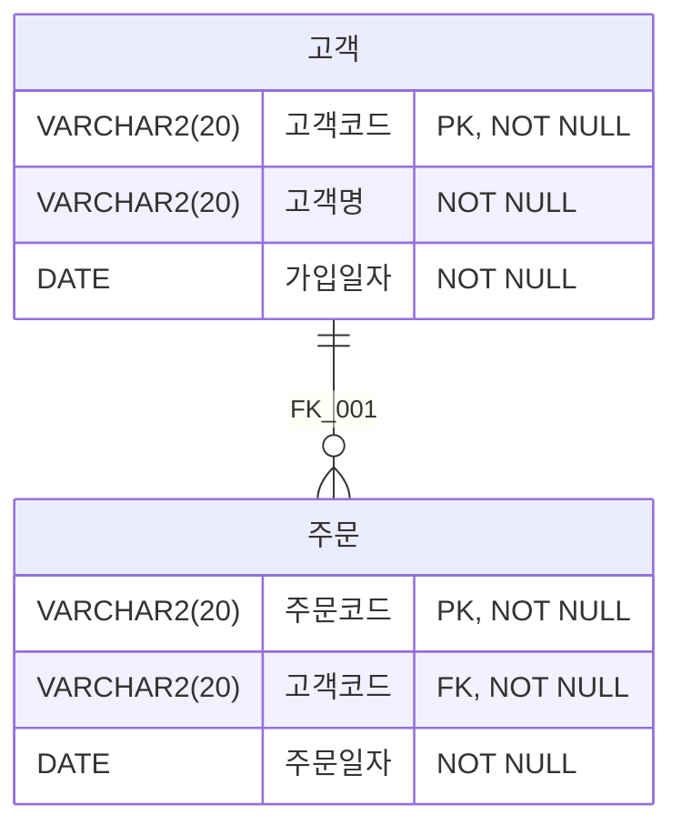

<style>
pre, code {
  white-space: pre-wrap !important;
  word-break: break-word !important;
  overflow-x: hidden !important;
  display: block !important;
  max-width: 100% !important;
  box-sizing: border-box !important;
}
</style> 

---
### SQL BASIC

| 구간 | 문제 번호 | 주제 | 난이도 |
|------|------------|------|--------|
| 1~10 | 001~010 | SQL 명령어 분류 및 기본 | ⭐ 초급 |
| 11~20 | 011~020 | 테이블 생성 및 제약조건 | ⭐⭐ 초~중급 |
| 21~30 | 021~030 | 관계 설정 및 트랜잭션 | ⭐⭐ 중급 |
| 31~40 | 031~040 | SELECT 조건 및 NULL 처리 | ⭐⭐⭐ 중~고급 |
| 41~50 | 041~050 | 고급 함수 및 날짜/CASE | ⭐⭐⭐ 고급 |
| 51~64 | 051~064 | 실전 SELECT + GROUP BY/HAVING + JOIN | ⭐⭐⭐⭐ 실무형 |


#### ✅ 21~30번: 관계 설정, FK 제약, 트랜잭션 처리
- 관계형 모델, FK 삭제 동작, COMMIT/ROLLBACK
- 오류 발생 조건, 데이터 무결성


---

```bash
[문제 021]  
아래와 같은 데이터 모델에서 데이터를 조작하려고 한다. 다음 중 오류가 발생하는 SQL 문장인 것은?
```

| BOARD |
|------|
| BOARD_ID: VARCHAR2(10) NOT NULL |
| BOARD_NM: VARCHAR2(50) NOT NULL  <br/> USE_YN: VARCHAR2(1) NOT NULL <br/> REG_DATE: DATE NOT NULL <br/> BOARD_DESC: VARCHAR2(100) NULL |

```
① INSERT INTO BOARD VALUES (1, 'Q&A', 'Y', SYSDATE, 'Q&A 게시판');
② INSERT INTO BOARD (BOARD_ID, BOARD_NM, USE_YN,
BOARD_DESC) VALUES ('100', 'FAQ', 'Y', 'FAQ 게시판');
③ UPDATE BOARD SET USE_YN = 'N' WHERE BOARD_ID = '1';
④ UPDATE BOARD SET BOARD_ID = 200 WHERE BOARD_ID = '100';
```

**정답:** ②

🧸 **쉬운 해설:**  
②번은 REG_DATE 값을 안 넣었어!  
REG_DATE는 NOT NULL이라 생략하면 오류야!

**📚 전문 해설:**  
BOARD 테이블의 REG_DATE 컬럼은 NOT NULL 제약이 걸려 있어 반드시 값을 입력해야 합니다.  
②번 SQL은 REG_DATE 값을 생략했기 때문에 오류가 발생합니다.

**보기 설명:**  
| 보기 번호 | 설명 | 적절성 |
|-----------|-------------------------------|--------|
| ① | 모든 컬럼 값 입력 (NOT NULL 만족) | ✅ |
| ② | REG_DATE 누락 (NOT NULL 위반) | ❌ |
| ③ | 조건에 맞는 UPDATE | ✅ |
| ④ | PK 변경 가능 (제약 조건 없음) | ✅ |

🧠 **기억법:**  
NOT NULL → 반드시 값을 넣어야 함!

**필요 암기카드:**  
- 🃏 카드 64: NOT NULL = 빈칸 금지

---

```bash
[문제 022]  
아래 데이터 모델과 같이 고객과 주문 테이블이 생성되어 있으며 고객과 주문 테이블에 입력되어 있는 데이터는 아래 표와 같다. 이 때 FK_001 이라는 제약조건을 아래 SQL과 같이 설정하였다. 다음 중 오류 없이 정상적으로 수행되는 SQL을 2개 고르시오.
```
 




##### 📦 주문 테이블 (데이터)
| 주문코드(PK) | 고객코드 | 주문일자     |
|----------|-----------|--------------|
| O001     | C001      | 2013-12-24   |
| O002     | C001      | 2013-12-25   |
| O003     | C002      | 2013-12-26   |
| O004     | C002      | 2013-12-27   |

<br/>

##### 📋 고객 테이블 (데이터)
| 고객코드 | 고객명(FK) | 가입일자     |
|----------|--------|--------------|
| C001     | 홍길동 | 2013-12-12   |
| C002     | 이순신 | 2013-12-13   | 


```sql
[SQL]
ALTER TABLE 주문 ADD CONSTRAINT FK_001 FOREIGN KEY
(고객ID)
REFERENCES 고객 (고객ID) ON DELETE SET NULL;
```
```
① INSERT INTO 고객 VALUES ('C003', '강감찬', '2014-01-01');
② INSERT INTO 주문 VALUES ('0005', 'C003', '2013-12-28');
③ DELETE FROM 주문 WHERE 주문번호 IN ('0001', '0002');
④ DELETE FROM 고객 WHERE 고객ID = 'C002';
```

**정답:** ①, ③

🧸 **쉬운 해설:**  
①은 신규 고객 추가!  
③은 주문 삭제! 둘 다 문제 없어!

**📚 전문 해설:**  
②는 존재하지 않는 고객코드(C003)를 참조하므로 FK 제약조건 위반입니다.  
④는 FK 설정이 잘못되어 오류 발생 가능성이 있습니다.

**보기 설명:**  
| 보기 번호 | 설명 | 적절성 |
|-----------|-------------------------------|--------|
| ① | 신규 고객 추가 | ✅ |
| ② | FK 위반 | ❌ |
| ③ | 주문 삭제 | ✅ |
| ④ | FK 설정 오류 가능 | ❌ |

🧠 **기억법:**  
FK 제약 → 참조 무결성 유지

**필요 암기카드:**  
- 🃏 카드 62: FK = 연결 다리


---
```bash
[문제 023] 
개발 프로젝트의 표준은 모든 삭제 데이터에 대한 로그를 남기는 것을 원칙으로 하고, 테이블 삭제의 경우는 허가된 인력만이 정기적으로 수행 가능하도록 정하고 있다. 개발팀에서 사용 용도가 없다고 판단한 STADIUM 테이블의 데이터를 삭제하는 가장 좋은 방법은 무엇인가?

① DELETE FROM STADIUM:
② DELETE * FROM STADIUM:
③ TRUNCATE TABLE STADIUM:
④ DROP TABLE STADIUM:
```

**정답:** ①

🧸 **쉬운 해설:**  
DELETE는 로그 남기니까 안전하게 삭제 가능!

**📚 전문 해설:**  
DELETE는 트랜잭션 로그를 남기므로 데이터 삭제 이력을 관리할 수 있습니다.  
TRUNCATE나 DROP은 로그를 남기지 않거나 테이블 자체를 삭제하므로 부적절합니다.

**보기 설명:**  
| 보기 번호 | 설명 | 적절성 |
|-----------|-------------------------------|--------|
| ① | 안전한 삭제 | ✅ |
| ② | 문법 오류 | ❌ |
| ③ | 로그 없음 | ❌ |
| ④ | 테이블 삭제 | ❌ |

🧠 **기억법:**  
DELETE = 안전한 삭제 + 로그 남김

**필요 암기카드:**  
- 🃏 카드 37: DELETE = 삭제


---
```bash
[문제 024]  

아래의 고객지역 테이블을 대상으로 질의 결과와 같이 거주지와 근무지를 출력하고자 한다. 아래 SQL의 ㉠ 안에 들어갈 내용을 작성하시오. 
```
##### 📋 고객지역 테이블  

| 고객ID | 거주지 | 근무지 |
|--------|--------|--------|
| C001   | 서울   | 서울   |
| C002   | 서울   | 부산   |
| C003   | 울산   | 서울   |
| C004   | 울산   | 부산   |
| C005   | 부산   | 부산   |

##### 📋 질의결과  

| 거주지 | 근무지 |
|--------|--------|
| 서울   | 서울   |
| 울산   | 서울   |
| 부산   | 부산   |
 
```sql
[SQL]
SELECT ㉠ 거주지, 근무지
FROM 고객지역;
```

**정답:** DISTINCT

🧸 **쉬운 해설:**  
중복 제거할 땐 DISTINCT 써야지!

**📚 전문 해설:**  
DISTINCT는 SELECT 결과에서 중복된 행을 제거합니다.  
거주지와 근무지 조합이 중복되는 경우 하나만 출력됩니다.

🧠 **기억법:**  
DISTINCT = 중복 제거

**필요 암기카드:**  
- 🃏 카드 21: SELECT = 꺼내기


---
```bash
[문제 025]  

다음 중 아래와 같은 상황에서 사용할 수 있는 SQL 명령어는?
 
> 우리가 관리하는 데이터베이스의 '매출' 테이블이 너무나 많은 디스크 용량을 차지하여 '매출' 테이블에서 필요한 데이터만을 추출하여 별도의 테이블로 옮겨 놓았다. 이후 "매출" 원본 테이블의 데이터를 모두 삭제함과 동시에, 디스크 사용량도 초기화 하고자 한다. (단, "매출" 테이블의 스키마 정의는 유지한다.)
 
① TRUNCATE TABLE 매출:
② DELETE FROM 매출:
③ DROP TABLE 매출:
④ DELETE TABLE FROM 매출;
```


**정답:** ①

🧸 **쉬운 해설:**  
TRUNCATE는 빠르고 디스크도 정리돼!

**📚 전문 해설:**  
TRUNCATE는 테이블의 모든 데이터를 삭제하면서 디스크 공간도 초기화합니다.  
DELETE는 로그를 남기고 느리며, DROP은 테이블 정의까지 삭제합니다.

🧠 **기억법:**  
TRUNCATE = 빠른 전체 삭제 + 디스크 초기화

**필요 암기카드:**  
- 🃏 카드 40: DDL = 구조 변경


---

```bash
[문제 026]  
다음 중 DELETE 와 TRUNCATE, DROP 명령어에 대해 비교한 설명으로 가장 부적절한 것을 2개 고르시오.

① 특정 테이블에 대하여 WHERE 조건절이 없는 DELETE 명령을 수행하면 DROP TABLE 명령을 수행했을 때와 똑같은 결과를 얻을 수 있다.
② DROP 명령어는 테이블 정의 자체를 삭제하고, TRUNCATE 명령어는 테이블을 초기상태로 만든다.
③ TRUNCATE 명령어는 UNDO를 위한 데이터를 생성하지 않기 때문에 동일 데이터량 삭제시 DELETE보다 빠르다.
④ DROP은 Auto Commit이 되고, DELETE와 TRUNCATE는 사용자 Commit으로 수행된다.
```

**정답:** ①, ④

🧸 **쉬운 해설:**  
DELETE는 DROP이랑 달라!  
그리고 TRUNCATE도 Auto Commit이야!

**📚 전문 해설:**  
① DELETE는 데이터만 삭제하고 테이블 정의는 유지합니다.  
④ TRUNCATE와 DROP은 Auto Commit이 발생합니다.

**보기 설명:**  
| 보기 번호 | 설명 | 적절성 |
|-----------|-------------------------------|--------|
| ① | DELETE는 DROP과 다름 | ❌ |
| ② | 정의 정확 | ✅ |
| ③ | 성능 설명 정확 | ✅ |
| ④ | COMMIT 설명 오류 | ❌ |

🧠 **기억법:**  
DROP = 테이블 삭제  
DELETE = 데이터 삭제  
TRUNCATE = 빠른 초기화 + Auto Commit

**필요 암기카드:**  
- 🃏 카드 40: DDL = 구조 변경


---
```bash
[문제 027]  
데이터베이스 트랜잭션에 대한 설명으로 가장 부적절한 것을 2개 고르시오.

① 원자성(atomicity): 트랜잭션에서 정의된 연산들은 모두 성공적으로 실행되던지 아니면 전혀 실행되지 않은 상태로 남아 있어야 한다.
② 일관성(consistency): 트랜잭션이 성공적으로 수행되면 그 트랜잭션이 갱신한 데이터베이스의 내용은 영구적으로 저장된다.
③ 고립성(isolation) : 트랜잭션이 실행되는 도중에 다른 트랜잭션의 영향을 받아 잘못된 결과를 만들어서는 안된다.
④ 지속성(durability): 트랜잭션이 실행 되기 전의 데이터베이스 내용이 잘못 되어 있지 않다면 트랜잭션이 실행된 이후에도 데이터베이스의 내용에 잘못이 있으면 안된다.
```


**정답:** ②, ④

🧸 **쉬운 해설:**  
②, ④는 정의가 틀렸어!

**📚 전문 해설:**  
② 일관성은 트랜잭션 전후 데이터의 일관성을 유지하는 것이며, 영구 저장과는 무관합니다.  
④ 지속성은 트랜잭션 완료 후 변경사항이 영구적으로 유지되는 것을 의미합니다.

**보기 설명:**  
| 보기 번호 | 설명 | 적절성 |
|-----------|-------------------------------|--------|
| ① | 원자성 정의 정확 | ✅ |
| ② | 일관성 정의 오류 | ❌ |
| ③ | 고립성 정의 정확 | ✅ |
| ④ | 지속성 정의 오류 | ❌ |

🧠 **기억법:**  
ACID = Atomicity, Consistency, Isolation, Durability

※ ACID는 컴퓨터가 일을 할 때 전부 다 하거나 안 하고(A), 항상 깔끔하게 정리하고(C), 서로 방해 없이 따로따로 하고(I), 끝난 일은 절대 잊지 않는(D) 똑똑한 약속이에요! 🎯

**필요 암기카드:**  
- 🃏 카드 47~50: ACID 4대 원칙


---
```bash
[문제 028] 
데이터베이스 트랜잭션에 대한 격리성이 낮은 경우 발생할 수 있는 문제점으로 가장 부적절한 것을 2개 고르시오.

① Dirty Read: 다른 트랜잭션에 의해 수정되었고 이미 커밋된 데이터를 읽는 것을 말한다.
② Non-Repeatable Read: 한 트랜잭션 내에서 같은 쿼리를 두 번 수행했는데, 그 사이에 다른 트랜잭션이 값을 수정 또는 삭제하는 바람에 두 쿼리 결과가 다르게 나타나는 현상을 말한다.
③ Phantom Read: 한 트랜잭션 내에서 같은 쿼리를 두 번 수행했는데, 첫번째 쿼리에서 없던 유령 레코드가 두번째 쿼리에서 나타나는 현상을 말한다.
④ isolation : 트랜잭션이 실행되는 도중에 다른 트랜잭션의 영향을 받아 잘못된 결과를 만들어서는 안된다.
```

**정답:** ①, ④

🧸 **쉬운 해설:**  
①은 커밋된 데이터 읽는 게 아니야!  
④는 그냥 정의야!

**📚 전문 해설:**  
① Dirty Read는 커밋되지 않은 데이터를 읽는 현상입니다.  
④는 문제 유형이 아니라 트랜잭션의 성질입니다.

**보기 설명:**  
| 보기 번호 | 설명 | 적절성 |
|-----------|-------------------------------|--------|
| ① | Dirty Read 정의 오류 | ❌ |
| ② | Non-Repeatable Read 정의 정확 | ✅ |
| ③ | Phantom Read 정의 정확 | ✅ |
| ④ | 격리성 정의 자체 | ❌ |

🧠 **기억법:**  
격리성 낮으면 → Dirty / Non-Repeatable / Phantom 발생

※ 격리성이 낮으면, 예를 들어 친구가 아직 저장 안 한 숙제를 내가 먼저 보고(더러운 읽기), 같은 질문을 두 번 했는데 답이 달라지고(반복 안 됨), 처음엔 없던 친구가 갑자기 명단에 생기는(유령 등장) 일이 생길 수 있어요! 👻📚

**필요 암기카드:**  
- 🃏 카드 51: 격리 수준 = 충돌


---
```bash
[문제 029]  
테이블 A에 대해 아래와 같은 SQL을 수행하였을 때 테이블 A의 ID '001'에 해당하는 최종 VAL의 값이 ORACLE에서는 200, SQL Server 에서는 100이 되었다. 다음 설명 중 가장 부적절한 것은?(단, AUTO COMMIT은 FALSE로 설정되어 있다)
```
[테이블: A]
|ID(PK)|VAL|
|-|-|
|001|100|
|002|200|

```sql
[SQL]
UPDATE A SET VAL 200 WHERE ID = '001';
CREATE TABLE B (ID CHAR(3) PRIMARY KEY);
ROLLBACK;
```
```
① ORACLE에서는 CREATE TABLE 문장을 수행한 후, 묵시적으로 COMMIT이 수행 되어 VAL 값은 200이 되었다.
② SQL Server에서는 ROLLBACK 문장에 의해 UPDATE가 취소되어 VAL 값은 100이 되었다.
③ ORACLE에서는 CREATE TABLE 문장 수행에 의해 VAL 값은 200이 되었지만, ROLLBACK 실행으로 인하여 최종적으로 B 테이블은 생성되지 않았다.
④ SQL Server에서는 ROLLBACK 실행으로 인하여 UPDATE가 취소되었으며, 최종적으로 B 테이블은 생성되지 않았다.
```

**정답:** ③

🧸 **쉬운 해설:**  
③번은 ORACLE의 특징을 잘못 설명했어!  
ORACLE은 CREATE TABLE 하면 자동 COMMIT돼서 B 테이블은 남아!

**📚 전문 해설:**  
ORACLE은 DDL 명령어(CREATE, ALTER 등)를 실행하면 자동으로 COMMIT이 발생합니다.  
따라서 ROLLBACK을 해도 이전 DDL 작업은 취소되지 않으며, B 테이블은 생성된 상태로 남습니다.

**보기 설명:**  
| 보기 번호 | 설명 | 적절성 |
|-----------|-------------------------------|--------|
| ① | ORACLE의 Auto Commit 설명 | ✅ |
| ② | SQL Server의 ROLLBACK 설명 | ✅ |
| ③ | ORACLE에서 B 테이블이 생성되지 않았다고 함 | ❌ |
| ④ | SQL Server에서 ROLLBACK으로 B 테이블 생성 안 됨 | ✅ |

🧠 **기억법:**  
ORACLE DDL → Auto Commit  
ROLLBACK은 DML만 되돌림

**필요 암기카드:**  
- 🃏 카드 52: COMMIT = 저장  
- 🃏 카드 53: ROLLBACK = 취소


---
```bash
[문제 030]  
아래 내용의 ㉠, ㉡, ㉢에 해당하는 단어를 순서대로 작성하시오.

 
㉠ 은 데이터베이스의 논리적 연산단위로서 밀접히관련되어 분리될 수 없는 한 개 이상의 데이터베이스 조작을 가리킨다.
㉠ 의 종료를 위한 대표적 명령어로서는 데이터에 대한 변경사항을 데이터베이스에 영구적으로 반영하는 ㉡ 과
데이터에 대한 변경사항을 모두 폐기하고 변경전의 상태로 되돌리는 ㉢ 이 있다.
```


**정답:** Transaction, Commit, Rollback

🧸 **쉬운 해설:**  
㉠은 트랜잭션!  
㉡은 저장(COMMIT),  
㉢은 취소(ROLLBACK)!

**📚 전문 해설:**  
트랜잭션(Transaction)은 데이터베이스에서 하나의 논리적 작업 단위입니다.  
COMMIT은 변경사항을 저장하고, ROLLBACK은 변경사항을 취소하여 이전 상태로 되돌립니다.

**보기 설명:**  
| 항목 | 설명 | 정답 |
|------|-------------------------------|--------|
| ㉠ | 논리적 작업 단위 | Transaction |
| ㉡ | 변경사항 저장 | Commit |
| ㉢ | 변경사항 취소 | Rollback |

🧠 **기억법:**  
트랜잭션 종료 → COMMIT or ROLLBACK  
COMMIT = 저장 / ROLLBACK = 취소

**필요 암기카드:**  
- 🃏 카드 46: 트랜잭션 = 묶음 처리  
- 🃏 카드 52: COMMIT = 저장  
- 🃏 카드 53: ROLLBACK = 취소
