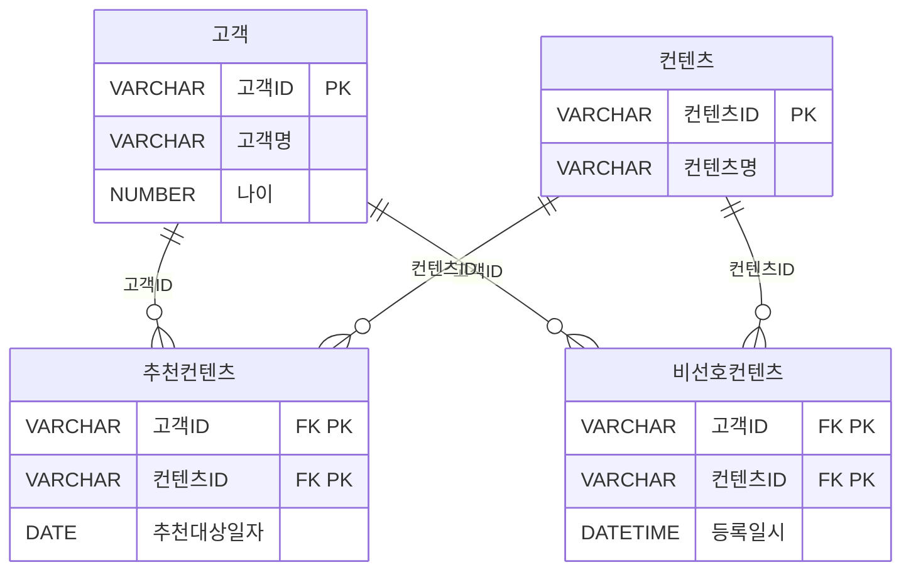
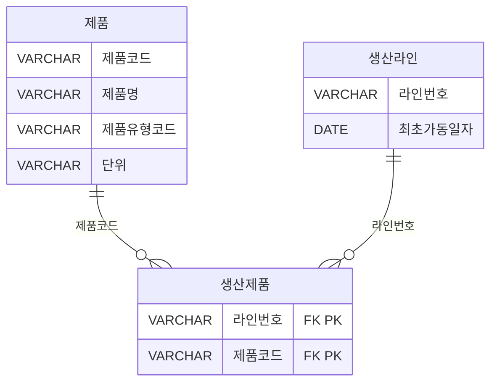
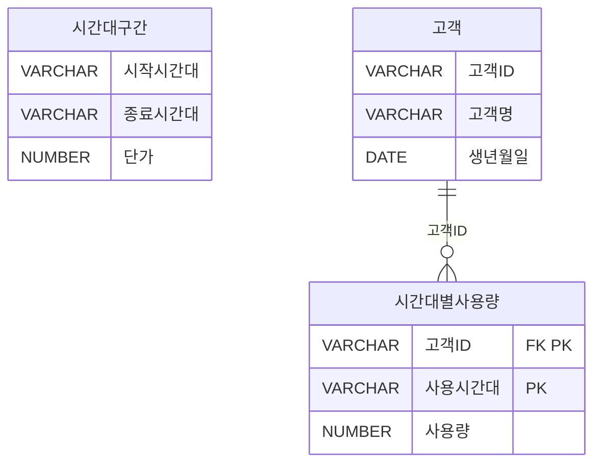
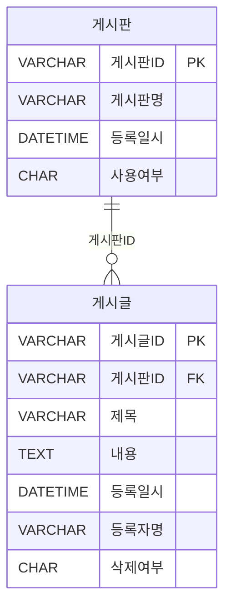

<style>
pre, code {
  white-space: pre-wrap !important;
  word-break: break-word !important;
  overflow-x: hidden !important;
  display: block !important;
  max-width: 100% !important;
  box-sizing: border-box !important;
}
</style> 

---

### 📁 SQL USING

| 구간   | 문제 번호 | 주제                                      | 난이도     |
|--------|------------|-------------------------------------------|------------|
| 1~15   | 065~079    | 관계 연산자, JOIN 실무, 집합 연산자       | ⭐⭐ 초~중급 |
| 16~30  | 080~094    | INTERSECT, EXCEPT, 계층형 질의            | ⭐⭐⭐ 중~고급 |
| 31~45  | 095~109    | 집합 연산자, JOIN 조건, 서브쿼리 활용     | ⭐⭐⭐ 고급    |
| 46~63  | 110~127    | 실무형 SQL 로직, 집계, 조건부 연산        | ⭐⭐⭐⭐ 실무형 |


#### ✅ 1~15번 ( 065~079 ): 관계 연산자, JOIN 실무, 집합 연산자  
- SELECT, JOIN, OUTER JOIN, 집합 연산자(EXCEPT, UNION 등)의 기본 구조를 익힙니다.  
- 복합키, 비선호 필터링, 카티시안 곱 등 실무에서 자주 쓰이는 SQL 로직을 다룹니다.

#### ✅ 16~30번 (  080~094 ): INTERSECT, EXCEPT, 계층형 질의  
- INTERSECT, MINUS, EXCEPT의 차이와 활용법을 비교합니다.  
- START WITH, CONNECT BY, ORDER SIBLINGS BY 등 계층형 질의 구문을 학습합니다.

#### ✅ 31~45번 (095~109  ): 집합 연산자, JOIN 조건, 서브쿼리 활용  
- UNION ALL, 집합 연산자 조합, 서브쿼리와 EXISTS 활용을 집중적으로 다룹니다.  
- JOIN 조건에 따른 결과 건수와 정렬 방식까지 실무 중심으로 분석합니다.

#### ✅ 46~63번 (110~127): 실무형 SQL 로직, 집계, 조건부 연산  
- 조건부 집계, 서브쿼리 필터링, 복잡한 JOIN 조합을 실무 사례로 학습합니다.  
- SQL 성능, 정렬 우선순위, 집계 함수 조합까지 고급 SQL 로직을 익힙니다.

 


---

```bash
[문제 065]  
다음 중 순수 관계 연산자에 해당하지 않는 것은?
 
① SELECT  
② UPDATE  
③ JOIN  
④ DIVIDE
```

**정답:** ②

🧸 **쉬운 해설:**  
UPDATE는 데이터를 수정하는 명령어예요. 관계형 대수에서 말하는 순수 관계 연산자에는 포함되지 않아요!

**📚 전문 해설:**  
관계형 데이터베이스에서 순수 관계 연산자는 데이터를 검색하거나 조합하는 연산을 의미해요.  
- SELECT: 조건에 맞는 행을 선택  
- JOIN: 두 테이블을 연결  
- DIVIDE: 특정 조건을 만족하는 집합을 추출  
→ 모두 관계형 대수의 연산자예요.  
하지만 UPDATE는 데이터를 수정하는 DML(Data Manipulation Language) 명령어로, 관계 연산자가 아니에요.

**보기 설명:**  
| 보기 번호 | 설명 | 적절성 |
|-----------|-------------------------------|--------|
| ① | SELECT는 관계 연산자 | ✅ |
| ② | UPDATE는 DML 명령어 | ❌ |
| ③ | JOIN은 관계 연산자 | ✅ |
| ④ | DIVIDE는 관계 연산자 | ✅ |

🧠 **기억법:**  
관계 연산자는 데이터를 "조회하고 연결"하는 연산  
UPDATE는 데이터를 "수정"하는 명령어

**필요 암기카드:**  
- 🃏 카드 23: JOIN = 연결  
- 🃏 카드 21: SELECT = 꺼내기  
- 🃏 카드 36: UPDATE = 수정  
- 🃏 카드 44: DML과 DDL의 차이 = DML은 행 조작, DDL은 구조 변경


---
```bash
[문제 066]  
고객에게 추천할 컨텐츠를 생성하는 배치작업에서, 추천 대상일자에 해당하고 비선호 컨텐츠에 포함되지 않은 컨텐츠만 추천해야 한다.  
아래 데이터 모델을 참고하여 올바르게 작성된 SQL 문장을 2개 고르시오.
```



※ 추천컨텐츠 테이블의 복합키: 고객ID + 컨텐츠ID
※ 비선호컨텐츠 테이블의 복합키: 고객ID + 컨텐츠ID


[설명]
우리는 매일 배치작업을 통하여 고객에게 추천할 컨텐츠를 생성하고 고객에게 추천서비스를 제공한다.
추천 컨텐츠 엔터티에서 언제 추천을 해야 하는지를 정의하는 추천 대상일자가 있어 해당일자에만 컨텐츠를 추천해야 한다. 또한 고객이 컨텐츠를 추천 받았을 때 선호하는 컨텐츠가 아닌 경우에는 고객이 비선호 컨텐츠로 분류하여 더 이상 추천 받기를 원하지 않는다. 그러므로 우리는 비선호 컨텐츠 엔터티에 등록된 데이터에 대해서는 추천을 수행하지 않아야 한다.

※ 배치작업이란? 어떤 처리를 연속적으로 하는 것이 아니고 일정량씩 나누어 처리하는 경우 그 일정량을 배치(batch)라고 한다. 배치의 원뜻은 한 묶음이라는 의미다. [기계공학용어사전]
예) 상품을 주문하는 로직은 그당시에 발생하는 트랜잭션에 대한 처리이므로 배치작업이라 표현하지는 않는다. 하지만 상품별 주문량을 집계하는 로직의 경우 특정조건(기간등)으로 일괄처리를 해야함으로 배치작업이라 표현할 수 있다.


```sql
① SELECT C.컨텐츠ID, C.컨텐츠명  
FROM 고객 A  
INNER JOIN 추천컨텐츠 B ON A.고객ID = B.고객ID  
INNER JOIN 컨텐츠 C ON B.컨텐츠ID = C.컨텐츠ID  
WHERE A.고객ID = #custId#  
AND B.추천대상일자 = TO_CHAR(SYSDATE, 'YYYY.MM.DD')  
AND NOT EXISTS (  
  SELECT X.컨텐츠ID  
  FROM 비선호컨텐츠 X  
  WHERE X.고객ID = B.고객ID AND X.컨텐츠ID = B.컨텐츠ID  
);

② SELECT C.컨텐츠ID, C.컨텐츠명  
FROM 고객 A  
INNER JOIN 추천컨텐츠 B ON A.고객ID = #custId# AND A.고객ID = B.고객ID  
INNER JOIN 컨텐츠 C ON B.컨텐츠ID = C.컨텐츠ID  
RIGHT OUTER JOIN 비선호컨텐츠 D ON B.고객ID = D.고객ID AND B.컨텐츠ID = D.컨텐츠ID  
WHERE B.추천대상일자 = TO_CHAR(SYSDATE, 'YYYY.MM.DD')  
AND B.컨텐츠ID IS NOT NULL;

③ SELECT C.컨텐츠ID, C.컨텐츠명  
FROM 고객 A  
INNER JOIN 추천컨텐츠 B ON A.고객ID = B.고객ID  
INNER JOIN 컨텐츠 C ON B.컨텐츠ID = C.컨텐츠ID  
LEFT OUTER JOIN 비선호컨텐츠 D ON B.고객ID = D.고객ID AND B.컨텐츠ID = D.컨텐츠ID  
WHERE A.고객ID = #custId#  
AND B.추천대상일자 = TO_CHAR(SYSDATE, 'YYYY.MM.DD')  
AND D.컨텐츠ID IS NULL;

④ SELECT C.컨텐츠ID, C.컨텐츠명  
FROM 고객 A  
INNER JOIN 추천컨텐츠 B ON A.고객ID = #custId# AND A.고객ID = B.고객ID  
INNER JOIN 컨텐츠 C ON B.컨텐츠ID = C.컨텐츠ID  
WHERE B.추천대상일자 = TO_CHAR(SYSDATE, 'YYYY.MM.DD')  
AND NOT EXISTS (  
  SELECT X.컨텐츠ID  
  FROM 비선호컨텐츠 X  
  WHERE X.고객ID = B.고객ID AND X.컨텐츠ID = B.컨텐츠ID  
);

```


**정답:** ③, ④

🧸 **쉬운 해설:**  
비선호 컨텐츠는 추천에서 제외해야 해요!  
LEFT JOIN 후 IS NULL 또는 NOT EXISTS로 제외하는 방식이 정답이에요.

**📚 전문 해설:**  
- 추천 대상일자 조건: **B.추천대상일자 = TO_CHAR(SYSDATE, 'YYYY.MM.DD')**  
- 비선호 제외 조건:  
  - **LEFT JOIN ... IS NULL 방식 (③)  
  - **NOT EXISTS** 방식 (④)  
- ①은 오타로 인해 실행 불가  
- ②는 RIGHT JOIN을 사용했지만 논리적으로 추천 대상이 아닌 비선호 중심으로 조인되어 부적절

**보기 설명:**  
| 보기 번호 | 설명 | 적절성 |
|-----------|-------------------------------|--------|
| ① | 컨텐츠ID 오타로 실행 불가 | ❌ |
| ② | JOIN 방향과 조건이 부적절 | ❌ |
| ③ | LEFT JOIN + IS NULL로 비선호 제외 | ✅ |
| ④ | NOT EXISTS로 비선호 제외 | ✅ |

🧠 **기억법:**  
- 비선호 컨텐츠 제외: **LEFT JOIN + IS NULL** 또는 **NOT EXISTS**  
- 추천 대상일자 필터링: **SYSDATE** 기준

**필요 암기카드:**  
- 🃏 카드 22: WHERE = 필터링  
- 🃏 카드 26: 서브쿼리 = 쿼리 속 쿼리  
- 🃏 카드 45: 상관 서브쿼리 = 외부 컬럼 참조  
- 🃏 카드 41: JOIN 유형 = INNER, LEFT, RIGHT, FULL


---
```bash
[문제 067]    
아래는 어느 회사의 생산설비를 위한 데이터 모델의 일부에 대한 설명으로 가장 적절한 것을 2개 고르시오.
```


```
※ 생산제품 테이블의 복합키: 라인번호 + 제품코드

① 제품, 생산제품, 생산라인 엔터티를 Inner Join 하기 위해서 생산제품 엔터티는 WHERE절에 최소 2번이 나타나야 한다.
② 제품과 생산라인 엔터티를 Join시 적절한 Join조건이 없으므로 카티시안곱(Cartesian Product)이 발생한다.
③ 제품과 생산라인 엔터티에는 생산제품과 대응되지 않는 레코드는 없다.
④ 특정 생산라인번호에서 생산되는 제품의 제품명을 알기위해서는 제품,생산제품, 생산라인까지 3개 엔터티의 Inner Join인 필요하다.
```

 
**정답:** ①, ②

🧸 **쉬운 해설:**  
생산제품이 두 테이블을 연결하는 다리 역할이에요.  
제품과 생산라인은 직접 연결되지 않아서 그냥 JOIN하면 곱셈돼요!

**📚 전문 해설:**  
- 생산제품은 제품과 생산라인을 연결하는 중간 엔터티  
- 제품과 생산라인은 직접 JOIN할 수 없기 때문에 중간 테이블 필요  
- WHERE절에 2번 등장한다는 표현은 다소 부정확하지만, 관계를 2번 맺는다는 의미로 해석 가능

> 1번답안 : 
생산제품 테이블이 두 관계를 연결한다는 점을 강조하려는 의도로 보임. 하지만 WHERE절에 2번 등장해야 한다는 표현은 부정확하고 오해의 소지가 있음.
이처럼 생산제품 테이블은 ON절에서 2번 사용되지만, WHERE절에 2번 등장할 필요는 없음
그래도 굳이 2개 고르라고 했으므로 완전틀린 3,4 제외

```
SELECT ...
FROM 제품 P
JOIN 생산제품 SP ON P.제품코드 = SP.제품코드
JOIN 생산라인 L ON SP.라인번호 = L.라인번호
```


**보기 설명:**  
| 보기 번호 | 설명 | 적절성 |
|-----------|-------------------------------|--------|
| ① | 생산제품이 두 관계를 연결 | ✅ |
| ② | 직접 JOIN 불가 → 곱셈 발생 | ✅ |
| ③ | 대응되지 않는 레코리 여부는 알 수 없음 | ❌ |
| ④ | 3개 엔터티 JOIN은 맞지만 정답 2개 요구 | ❌ |

🧠 **기억법:**  
중간 테이블이 없으면 곱셈이 발생한다!

**필요 암기카드:**  
- 🃏 카드 23: JOIN = 연결  
- 🃏 카드 41: JOIN 유형  
- 🃏 카드 44: DML vs DDL


---
```bash
[문제 068]  
아래의 테이블 스키마 정보를 참고하여, 다음 중 '구매 이력이 있는 고객 중 구매 횟수가 3회 이상인 고객의 이름과 등급을 출력하시오.'라는 질의에 대해 아래 SQL 문장의 (가), (나)에 들어 갈 구문으로 가장 적절한 것은?
```

```sql
[테이블]
고객(고객번호(PK), 이름, 등급)
구매정보(구매번호(PK), 구매금액, 고객번호(FK))

* 구매정보 테이블의 고객번호는 고객 테이블의 고객번호를 참조하는 외래키(Foreign Key)이다.

[SQL 문장]
SELECT A.이름, A.등급
FROM 고객 A
(가)
GROUP BY A.이름, A.등급
(나)
```
```sql
① (가): INNER JOIN 구매정보 B ON A, 고객번호=B, 고객번호
  (나): HAVING SUM(B.구매번호) >=3

② (가): INNER JOIN 구매정보 B ON A.고객번호=B, 고객번호
  (나): HAVING COUNT(B.구매번호) >=3

③ (가): LEFT OUTER JOIN 구매정보 B ON A, 고객번호=B.고객번호
  (나): HAVING SUM(B.구매번호)>=3

④ (가): INNER JOIN 구매정보 B ON A.고객번호=B.고객번호
  (나): WHERE B.구매번호 >=3
```

**정답:** ②

🧸 **쉬운 해설:**  
구매 횟수니까 COUNT로 세야 해요!  
HAVING은 GROUP BY 이후 조건 필터링이에요!

**📚 전문 해설:**  
- INNER JOIN으로 구매정보와 연결  
- GROUP BY로 고객별 집계  
- HAVING COUNT로 3회 이상 필터링  
- SUM(B.구매번호)는 구매번호가 숫자일 때만 의미 있음

**보기 설명:**  
| 보기 번호 | 설명 | 적절성 |
|-----------|-------------------------------|--------|
| ① | SUM은 구매번호에 부적절 | ❌ |
| ② | COUNT로 횟수 집계 → 정답 | ✅ |
| ③ | LEFT JOIN은 불필요 | ❌ |
| ④ | WHERE는 집계 전 필터링 | ❌ |

🧠 **기억법:**  
- 횟수는 COUNT  
- HAVING은 GROUP BY 이후

**필요 암기카드:**  
- 🃏 카드 24: GROUP BY = 묶기  
- 🃏 카드 25: HAVING = 그룹 필터  
- 🃏 카드 22: WHERE = 필터링


---


```bash
[문제 069]  
아래는 어느 회사의 정산 데이터 모델의 일부이며 고객이 서비스를 사용한 시간대에 따라 차등 단가를 적용하려고 한다. 다음 중 시간대별사용량 테이블을 기반으로 고객별 사용금액을 추출하는 SQL으로 가장 적절한 것은?
```

```
※ 시간대별사용량 테이블의 복합키: 고객ID + 사용시간대
```
```sql
①  SELECT A.고객ID, A.고객명, SUM(B.사용량 * C.단가) AS 사용금액
FROM 고객 A INNER JOIN 시간대별사용량 B
ON (A.고객ID = B.고객ID) INNER JOIN 시간대구간 C
ON (B.사용시간대 <= C.시작시간대 AND B.사용시간대 >= C.종료시간대)
GROUP BY A.고객ID, A.고객명
ORDER BY A.고객ID, A.고객명;

② SELECT A.고객ID, A.고객명, SUM(B.사용량 * C.가) AS 사용금액
FROM 고객 A INNER JOIN 시간대별사용량 B INNER JOIN 시간대구간 C
ON (A.고객ID = B.고객ID AND B.사용시간대  BETWEEN C.시작시간대 AND C.종료시간대)
GROUP BY A.고객ID, A.고객명
ORDER BY A.고객ID, A.고객명:

③ SELECT A.고객ID, A.고객명, SUM(B.사용량 * C.단가) AS 사용금액
FROM 고객 A INNER JOIN 시간대별사용량 B
ON (A.고객ID = B.고객ID) INNER JOIN 시간대구간 C
ON B.사용시간대 BETWEEN C.시작시간대 AND C.종료시간대
GROUP BY A.고객ID, A.고객명
ORDER BY A.고객ID, A.고객명:

④ SELECT A.고객ID, A.고객명, SUM(B.사용량 * C.단가) AS 사용금액
FROM 고객 A INNER JOIN 시간대별사용량 B
ON (A.고객ID = B.고객ID) BETWEEN JOIN 시간대구간 C
GROUP BY A.고객ID, A.고객명
ORDER BY A.고객ID, A.고객명:
```


**정답:** ③

🧸 **쉬운 해설:**  
시간대가 단가 범위 안에 있어야 하니까 BETWEEN으로 연결해요!

**📚 전문 해설:**  
- 시간대별사용량과 시간대구간을 시간대 기준으로 연결  
- BETWEEN으로 시작~종료 범위 조건  
- SUM(사용량 × 단가)로 금액 계산


###### 🧠 SQL 처리 순서 설명

1. **FROM 고객 A**
   - 가장 먼저 **고객** 테이블을 기준으로 시작합니다. 별칭 **A**를 붙여 이후 참조에 사용됩니다.

2. **INNER JOIN 시간대별사용량 B ON (A.고객ID = B.고객ID)**
   - **고객** 테이블과 **시간대별사용량** 테이블을 **고객ID** 기준으로 내부 조인합니다. 즉, 두 테이블에서 **고객ID**가 일치하는 행만 남깁니다.

3. **INNER JOIN 시간대구간 C ON B.사용시간대 BETWEEN C.시작시간대 AND C.종료시간대**
   - 앞서 조인된 결과에 **시간대구간** 테이블을 추가로 조인합니다. **사용시간대**가 **시작시간대**와 **종료시간대** 사이에 있는 경우만 남깁니다.

4. **WHERE (없음)**
   - 이 구문에는 **WHERE** 절이 없지만, 있다면 이 단계에서 조건 필터링이 수행됩니다.

5. **GROUP BY A.고객ID, A.고객명**
   - 조인된 결과를 **고객ID**와 **고객명** 기준으로 그룹화합니다. 즉, 고객별로 데이터를 묶습니다.

6. **SELECT A.고객ID, A.고객명, SUM(B.사용량 * C.단가) AS 사용금액**
   - 그룹화된 각 고객에 대해 **사용량 × 단가**의 합계를 계산하여 **사용금액**으로 출력합니다.

7. **ORDER BY A.고객ID, A.고객명**
   - 최종 결과를 **고객ID**, **고객명** 기준으로 오름차순 정렬합니다.

 
###### 🧾 요약 순서

| 순서 | 처리 단계 | 설명 |
|------|------------|------|
| 1 | **FROM** | 기준 테이블 선택 |
| 2 | **JOIN** | 테이블 간 조인 수행 |
| 3 | **ON** | 조인 조건 적용 |
| 4 | **WHERE** | 조건 필터링 (해당 구문엔 없음) |
| 5 | **GROUP BY** | 그룹화 수행 |
| 6 | **SELECT** | 원하는 컬럼과 집계 계산 |
| 7 | **ORDER BY** | 결과 정렬 |
 

**보기 설명:**  
| 보기 번호 | 설명 | 적절성 |
|-----------|-------------------------------|--------|
| ① | 조건 방향 반대 | ❌ |
| ② | 단가 컬럼 오타 | ❌ |
| ③ | 조건 정확, 컬럼 정확 | ✅ |
| ④ | JOIN 문법 오류 | ❌ |

🧠 **기억법:**  
시간대 조건은 BETWEEN  
금액 계산은 SUM(사용량 × 단가)

**필요 암기카드:**  
- 🃏 카드 24: GROUP BY = 묶기  
- 🃏 카드 29: 윈도우 함수 = 행별 분석  
- 🃏 카드 35: INSERT = 추가


---
```bash
[문제 070]    

다음 중 팀(TEAM) 테이블과 구장(STADIUM) 테이블의 관계를 이용해서 소속팀이 가지고 있는 전용구장의 정보를 팀의 정보와 함께 출력하는 SQL을 작성할 때 결과가 다른 것은?
```
```sql
① SELECT T.REGION_NAME, T.TEAM_NAME, T.STADIUM_ID, S.STADIUM_NAME
FROM TEAM T INNER JOIN STADIUM S
USING (T.STADIUM_ID = S.STADIUM_ID);

② SELECT TEAM.REGION_NAME, TEAM.TEAM_NAME, TEAM.STADIUM_ID, STADIUM.STADIUM_NAME
FROM TEAM INNER JOIN STADIUM
ON (TEAM.STADIUM_ID = STADIUM.STADIUM_ID);

③ SELECT T.REGION_NAME, T.TEAM_NAME, T.STADIUM_ID, S.STADIUM_NAME
FROM TEAM T, STADIUM S
WHERE T.STADIUM_ID = S.STADIUM_ID;

④ SELECT TEAM.REGION_NAME, TEAM.TEAM_NAME, TEAM.STADIUM_ID, STADIUM.STADIUM_NAME
FROM TEAM, STADIUM
WHERE TEAM.STADIUM_ID = STADIUM.STADIUM_ID;
```

**정답:** ①

🧸 **쉬운 해설:**  
USING은 컬럼명이 같을 때만 써요!  
조건식이 들어가면 오류가 나요!

**📚 전문 해설:**  
- USING은 단순 컬럼명만 지정 가능  
- `USING (T.STADIUM_ID = S.STADIUM_ID)`는 문법 오류  
- 나머지는 모두 ON 또는 WHERE로 조건 지정

**보기 설명:**  
| 보기 번호 | 설명 | 적절성 |
|-----------|-------------------------------|--------|
| ① | USING 문법 오류 | ❌ |
| ② | ON 조건 적절 | ✅ |
| ③ | WHERE 조건 적절 | ✅ |
| ④ | WHERE 조건 적절 | ✅ |

🧠 **기억법:**  
USING은 **컬럼명**만! 조건식은 안 돼요!

**필요 암기카드:**  
- 🃏 카드 41: JOIN 유형  
- 🃏 카드 23: JOIN = 연결


---
```bash
[문제 071]  
아래의 사례1은 Cartesian Product를 만들기 위한 SQL 문장이며 사례1과 같은 결과를 얻기 위해 사례2 SQL 문장의 ㉠ 안에 들어갈 내용을 작성하시오.
```
```sql
[사례1]
SELECT ENAME, DNAME
FROM EMP, DEPT
ORDER BY ENAME;

[사례2]
SELECT ENAME, DNAME
FROM EMP  ㉠ DEPT 
ORDER BY ENAME;
```


**정답** : CROSS JOIN

🧸 **쉬운 해설:**  
EMP와 DEPT를 조건 없이 연결하면 곱셈처럼 모든 조합이 나와요. 그게 바로 CROSS JOIN이에요!

**📚 전문 해설:**  
- CROSS JOIN은 조건 없이 두 테이블의 모든 조합을 반환  
- EMP와 DEPT를 단순히 나열하면 CROSS JOIN과 동일한 결과  
- INNER JOIN은 조건이 필요함

**보기 설명:**  
| 보기 번호 | 설명 | 적절성 |
|-----------|-------------------------------|--------|
| ① | 조건 기반 JOIN | ❌ |
| ② | 방향성 있는 JOIN | ❌ |
| ③ | 곱셈 조합 → 정답 | ✅ |
| ④ | 동일 컬럼명 기준 JOIN | ❌ |

🧠 **기억법:**  
CROSS JOIN = 곱셈 조합

**필요 암기카드:**  
- 🃏 카드 41: JOIN 유형  
- 🃏 카드 23: JOIN = 연결

---

```bash
[문제 072] 
다음 중 아래 테이블들을 대상으로 SQL 문장을 수행한 결과로 가장 적절한 것은?
```

[테이블: OS]
| OSID (PK) | OS명     |
|-----------|----------|
| 100       | Android  |
| 200       | IOS      |
| 300       | Bada     |

[테이블: 단말기]
| 단말기ID (PK) | 단말기명 | OSID (FK) |
|---------------|-----------|------------|
| 1000          | A1000     | 100        |
| 2000          | B2000     | 100        |
| 3000          | C3000     | 200        |
| 4000          | D3000     | 300        |

[테이블: 고객]
| 고객번호 (PK) | 고객명 | 단말기ID (FK) |
|----------------|--------|----------------|
| 11000          | 홍길동 | 1000           |
| 12000          | 강감찬 | NULL           |
| 13000          | 이순신 | NULL           |
| 14000          | 안중근 | 3000           |
| 15000          | 고길동 | 4000           |
| 16000          | 이대로 | 4000           |

 


```sql
[SQL]
SELECT A.고객번호, A.고객명, B.단말기ID, B.단말기명, C.OSID, C.OS명
FROM 고객 A LEFT OUTER JOIN 단말기 B
ON (A.고객번호 IN (11000,12000)  AND  A.단말기ID=B.단말기ID)  LEFT OUTER JOIN OS C
ON (B.OSID = C.OSID)
ORDER BY A.고객번호;
```

 ①
| 고객번호 | 고객명 | 단말기ID | 단말기명 | OSID | OS명    |
|----------|--------|-----------|-----------|------|---------|
| 11000    | 홍길동 | 1000      | A1000     | 100  | Android |
| 12000    | 강감찬 | NULL      | NULL      | NULL | NULL    |
| 13000    | 이순신 | NULL      | NULL      | NULL | NULL    |
| 14000    | 안중근 | NULL      | NULL      | NULL | NULL    |
| 15000    | 고길동 | NULL      | NULL      | NULL | NULL    |
| 16000    | 이대로 | NULL      | NULL      | NULL | NULL    |

② 단말기 
| 고객번호 | 고객명 | 단말기ID | 단말기명 | OSID | OS명    |
|----------|--------|-----------|-----------|------|---------|
| 11000    | 홍길동 | 1000      | A1000     | 100  | Android |
| 12000    | 강감찬 | NULL      | NULL      | NULL | NULL    |

③ 
| 고객번호 | 고객명 | 단말기ID | 단말기명 | OSID | OS명    |
|----------|--------|-----------|-----------|------|---------|
| 11000    | 홍길동 | 1000      | A1000     | 100  | Android |


④ 
| 고객번호 | 고객명 | 단말기ID | 단말기명 | OSID | OS명    |
|----------|--------|-----------|-----------|------|---------|
| 11000    | 홍길동 | 1000      | A1000     | 100  | Android |
| 12000    | 강감찬 | NULL      | NULL      | NULL | NULL    |
| 13000    | 이순신 | NULL      | NULL      | NULL | NULL    |
| 14000    | 안중근 | 3000      | C3000     | 200  | iOS     |
| 15000    | 고길동 | 4000      | D4000     | 300  | Bada    |
| 16000    | 이대로 | 4000      | D4000     | 300  | Bada    |

 


🧸 **쉬운 해설:**  
JOIN 조건에 고객번호 IN (11000,12000)이 들어가서 나머지 고객은 결과에 안 나와요!

**📚 전문 해설:**  
- LEFT JOIN이지만 조건에 고객번호 제한이 있어 결과가 제한됨  
- 단말기ID가 NULL인 고객은 단말기/OS 정보도 NULL  
- 전체 고객이 아닌 일부만 조회됨


###### 🧠 SQL 처리 순서 설명

1. **FROM 고객 A**
   - 가장 먼저 **고객** 테이블을 기준으로 시작합니다. 별칭 **A**를 붙여 이후 참조에 사용됩니다.

2. **LEFT OUTER JOIN 단말기 B ON (A.고객번호 IN (11000,12000) AND A.단말기ID = B.단말기ID)**
   - **고객** 테이블과 **단말기** 테이블을 외부 조인합니다.
   - 단말기 정보가 없어도 **고객번호**가 11000 또는 12000인 고객은 결과에 포함됩니다.
   - 조인 조건은 두 가지:
     - **A.고객번호**가 11000 또는 12000
     - **A.단말기ID = B.단말기ID**

3. **LEFT OUTER JOIN OS C ON (B.OSID = C.OSID)**
   - 앞서 조인된 결과에 **OS** 테이블을 외부 조인합니다.
   - 단말기의 OS 정보가 없어도 단말기 정보가 있으면 결과에 포함됩니다.

4. **WHERE (없음)**
   - 이 구문에는 **WHERE** 절이 없지만, 있다면 이 단계에서 조건 필터링이 수행됩니다.

5. **SELECT A.고객번호, A.고객명, B.단말기ID, B.단말기명, C.OSID, C.OS명**
   - 조인된 결과에서 원하는 컬럼들을 선택합니다.

6. **ORDER BY A.고객번호**
   - 최종 결과를 **고객번호** 기준으로 오름차순 정렬합니다.


###### 🧾 요약 순서

| 순서 | 처리 단계 | 설명 |
|------|------------|------|
| 1 | **FROM** | 기준 테이블 선택 (**고객**) |
| 2 | **LEFT OUTER JOIN** | **단말기** 테이블과 외부 조인 |
| 3 | **ON** | 조인 조건 적용 |
| 4 | **LEFT OUTER JOIN** | **OS** 테이블과 외부 조인 |
| 5 | **ON** | OS 조인 조건 적용 |
| 6 | **SELECT** | 원하는 컬럼 선택 |
| 7 | **ORDER BY** | 결과 정렬 |
 

**보기 설명:**  
| 보기 번호 | 설명 | 적절성 |
|-----------|-------------------------------|--------|
| ① | 조건에 맞는 고객만 조회됨 | ✅ |
| ② | 일부만 조회되지만 설명 부족 | ❌ |
| ③ | 단일 고객만 조회 | ❌ |
| ④ | 전체 고객 조회됨 → 조건 무시 | ❌ |

🧠 **기억법:**  
JOIN 조건에 필터가 있으면 LEFT JOIN이라도 제한됨

**필요 암기카드:**  
- 🃏 카드 22: WHERE = 필터링  
- 🃏 카드 41: JOIN 유형


---

```bash
[문제 073]    
다음 중 아래 (1), (2), (3)의 SQL에서 실행결과가 같은 것은?
```
```sql
(1) SELECT A.ID, B.ID
FROM TBL1 A FULL OUTER JOIN TBL2 B
ON A.ID = B.ID

(2) SELECT A.ID, B.ID
FROM TBL1 A LEFT OUTER JOIN TBL2 B
ON A.ID = B.ID
UNION
SELECT A.ID, B.ID
FROM TBL1 A RIGHT OUTER JOIN TBL2 B
ON A.ID = B.ID

(3) SELECT A.ID, B.ID
FROM TBL1 A, TBL2 B
WHERE A.ID = B.ID
UNION ALL
SELECT A.ID, NULL
FROM TBL1 A
WHERE NOT EXISTS (SELECT 1 FROM TBL2 B WHERE A.ID = B.ID)
UNION ALL
SELECT NULL, B.ID
FROM TBL2 B
WHERE NOT EXISTS (SELECT 1 FROM TBL1 A WHERE B.ID = A.ID)
```

① 1, 2
② 1, 3
③ 2, 3
④ 1, 2, 3


**정답:** ④ (1, 2, 3)

🧸 **쉬운 해설:**  
FULL OUTER JOIN은 양쪽 모두 포함!  
(2), (3)도 같은 결과를 다른 방식으로 만든 거예요!

**📚 전문 해설:**  
- (1): FULL OUTER JOIN은 모든 행 포함  
- (2): LEFT + RIGHT JOIN을 UNION하면 FULL과 동일  
- (3): INNER JOIN + NOT EXISTS로 누락된 행 보완

**보기 설명:**  
| 보기 번호 | 설명 | 적절성 |
|-----------|-------------------------------|--------|
| ① | 일부만 포함 | ❌ |
| ② | 일부만 포함 | ❌ |
| ③ | 일부만 포함 | ❌ |
| ④ | 모두 동일 결과 | ✅ |

🧠 **기억법:**  
FULL OUTER JOIN = LEFT + RIGHT

**필요 암기카드:**  
- 🃏 카드 41: JOIN 유형  
- 🃏 카드 42: 서브쿼리 유형


---
```bash
[문제 074] 
아래의 EMP 테이블과 DEPT 테이블에서 밑줄 친 속성은 주키이며 EMP.C는 DEPT와 연결된 외래키이다. EMP 테이블과 DEPT 테이블을 LEFT, FULL, RIGHT 외부조인(outer join)하면 생성되는 결과 건수로 가장 적절한 것은?
```

[ EMP 테이블]
| <u>A</u> | B | C |
|---|---|---|
| 1 | b | w |
| 3 | d | w |
| 5 | y | y |

[DEPT 테이블]
| <u>C</u> | D | E  |
|---|---|----|
| w | 1 | 10 |
| z | 4 | 11 |
| v | 2 | 22 |


① 3건, 5건, 4건
② 4건, 5건, 3건
③ 3건, 4건, 4건
④ 3건, 4건, 5건


**정답:** ①

🧸 **쉬운 해설:**  
FULL JOIN은 양쪽 모두 포함해서 가장 많아요!

**📚 전문 해설:**  
- LEFT JOIN: EMP 기준 → 3건  
- FULL JOIN: EMP + DEPT 모두 포함 → 5건  
- RIGHT JOIN: DEPT 기준 → 4건
 SQL 처리 순서별 설명

###### 1️⃣ LEFT OUTER JOIN (EMP 기준)

```sql
SELECT * FROM EMP LEFT OUTER JOIN DEPT ON EMP.C = DEPT.C;
```

- EMP 테이블의 **모든 행**을 기준으로 함.
- EMP.C = DEPT.C 조건이 맞는 경우 DEPT 정보도 붙음.
- EMP.C = w → DEPT.C = w 와 매칭됨 → 2건
- EMP.C = y → DEPT에 y 없음 → NULL 붙음 → 1건

✅ **총 3건**


###### 2️⃣ FULL OUTER JOIN (EMP + DEPT 모두 기준)

```sql
SELECT * FROM EMP FULL OUTER JOIN DEPT ON EMP.C = DEPT.C;
```

- EMP와 DEPT **모두 포함** (조건이 맞지 않아도 NULL로 채움)
- EMP.C = w → DEPT.C = w 와 매칭됨 → 2건
- EMP.C = y → DEPT에 없음 → 1건
- DEPT.C = z, v → EMP에 없음 → 2건

✅ **총 5건**

---

###### 3️⃣ RIGHT OUTER JOIN (DEPT 기준)

```sql
SELECT * FROM EMP RIGHT OUTER JOIN DEPT ON EMP.C = DEPT.C;
```

- DEPT 테이블의 **모든 행**을 기준으로 함.
- DEPT.C = w → EMP.C = w 와 매칭됨 → 2건
- DEPT.C = z, v → EMP에 없음 → NULL 붙음 → 2건

✅ **총 4건**

 


🧠 **기억법:**  
FULL JOIN = 가장 많은 건수

**필요 암기카드:**  
- 🃏 카드 41: JOIN 유형  
- 🃏 카드 33: COUNT(*) = 전체 행


---
```bash
[문제 075]    
신규 부서의 경우 일시적으로 사원이 없는 경우도 있다고 가정하고 DEPT와 EMP를 조인하되 사원이 없는 부서 정보도 같이 출력하도록 할 때, 아래 SQL 문장의 (가) 안에 들어갈 내용을 기술하시오.
```
```sql
SELECT E, ENAME, D. DEPTNO, D. DNAME
FROM  DEPT D  (가)  EMP E
ON    D.DEPTNO = E.DEPTNO;
```

**정답:** LEFT JOIN

🧸 **쉬운 해설:**  
LEFT JOIN은 왼쪽(DEPT)을 기준으로 사원이 없어도 보여줘요!

**📚 전문 해설:**  
- LEFT JOIN은 기준 테이블(DEPT)의 모든 행을 유지  
- EMP에 대응되는 값이 없어도 NULL로 출력됨

###### 🧠 SQL 처리 순서 설명

```
SELECT E, ENAME, D.DEPTNO, D.DNAME
FROM DEPT D LEFT JOIN EMP E
ON D.DEPTNO = E.DEPTNO;
```

###### 1️⃣ **FROM DEPT D**
- 가장 먼저 **DEPT** 테이블을 기준으로 시작합니다.
- 이 테이블이 **왼쪽 테이블**이 되며, LEFT JOIN의 기준이 됩니다.

###### 2️⃣ **LEFT JOIN EMP E**
- **EMP** 테이블을 **DEPT**에 **외부 조인**합니다.
- **EMP**는 **오른쪽 테이블**이며, 사원이 없어도 **DEPT**의 모든 행은 유지됩니다.

###### 3️⃣ **ON D.DEPTNO = E.DEPTNO**
- 조인 조건: 부서번호가 같은 경우만 **EMP**의 정보가 붙습니다.
- 조건이 맞지 않으면 **EMP** 쪽은 **NULL**로 채워집니다.

###### 4️⃣ **WHERE** (없음)
- 이 구문에는 **WHERE** 절이 없지만, 있다면 이 단계에서 조건 필터링이 수행됩니다.

###### 5️⃣ **SELECT E, ENAME, D.DEPTNO, D.DNAME**
- 조인된 결과에서 원하는 컬럼을 선택합니다.
- 사원이 없는 부서의 경우 **E**, **ENAME**는 **NULL**로 출력됩니다.

###### 🧾 요약 순서

| 순서 | 처리 단계         | 설명 |
|------|------------------|------|
| 1    | **FROM**           | 기준 테이블 선택 (**DEPT**) |
| 2    | **LEFT JOIN**      | **EMP** 테이블과 외부 조인 |
| 3    | **ON**             | 조인 조건 적용 |
| 4    | **SELECT**         | 원하는 컬럼 선택 |
| 5    | **WHERE** (없음)   | 조건 필터링 없음 |
 

###### ✅ 핵심 요점

- **LEFT JOIN**은 왼쪽 테이블(DEPT)의 모든 행을 유지합니다.
- EMP에 대응되는 사원이 없어도 DEPT 정보는 출력됩니다.
- 신규 부서처럼 사원이 없는 경우에도 부서 정보가 보장됩니다.

 

🧠 **기억법:**  
LEFT JOIN = 왼쪽 기준 유지

**필요 암기카드:**  
- 🃏 카드 41: JOIN 유형


---

```bash
[문제 076]  
다음 중 아래와 같은 데이터 상황에서 SQL의 수행 결과로 가장 적절한 것은?
```
[ 테이블 1: TAB1]
| C1 | C2 |
|----|----|
| A  | 1  |
| B  | 2  |
| C  | 3  |
| D  | 4  |
| E  | 5  |

[ 테이블 2: TAB2]
| C1 | C2 |
|----|----|
| B  | 2  |
| C  | 3  |
| D  | 4  |


```sql
SELECT *
FROM TABI A LEFT OUTER JOIN TAB2 B
ON (A.C1 = B.C1 AND B.C2 BETWEEN 1 AND 3)
```

 ①
| C1 | C2 | C1 | C2 |
|----|----|----|----|
| A  | 1  | | |
| B  | 2  | B  | 2  |
| C  | 3  |C  | 3  |
| D  | 4  |D  | 4  |
| E  | 5  | |   | 

②
| C1 | C2 | C1 | C2 |
|----|----|----|----|
| A  | 1  | | |
| B  | 2  | B  | 2  |
| C  | 3  |C  | 3  |
| D  | 4  |  |   |
| E  | 5  | |   | 

③
| C1 | C2 | C1 | C2 |
|----|----|----|----|
| A  | 1  | | |
| B  | 2  | B  | 2  |
| C  | 3  |C  | 3  |

④
| C1 | C2 | C1 | C2 |
|----|----|----|----|
| A  | 1  | | |
| B  | 2  | B  | 2  |
| C  | 3  |C  | 3  |
| D  | 4  |D  | 4  |


**정답:** ②

🧸 **쉬운 해설:**  
BETWEEN 조건에 안 맞는 D, E는 NULL로 나와요!

**📚 전문 해설:**  
- B.C2가 1~3 사이인 경우만 JOIN됨  
- D(4), E(5)는 조건에 안 맞아 NULL


###### 🧠 SQL 처리 순서별 설명

```sql
SELECT *
FROM TAB1 A LEFT OUTER JOIN TAB2 B
ON (A.C1 = B.C1 AND B.C2 BETWEEN 1 AND 3)
```

###### 1️⃣ **FROM TAB1 A**
- **TAB1** 테이블을 기준으로 시작합니다.
- 이 테이블이 **LEFT JOIN의 왼쪽 테이블**이 됩니다.

###### 2️⃣ **LEFT OUTER JOIN TAB2 B**
- **TAB2** 테이블을 외부 조인합니다.
- **TAB1**의 모든 행은 결과에 **무조건 포함**됩니다.
- **TAB2**에 매칭되는 값이 없으면 **NULL**로 채워집니다.

###### 3️⃣ **ON (A.C1 = B.C1 AND B.C2 BETWEEN 1 AND 3)**
- 조인 조건은 두 가지를 모두 만족해야 합니다:
  - **A.C1 = B.C1**
  - **B.C2** 값이 1 이상 3 이하
- 이 조건을 만족하는 경우에만 **TAB2**의 값이 붙습니다.
- 조건을 만족하지 않으면 **TAB2**의 컬럼은 **NULL**로 채워집니다.

###### 4️⃣ **SELECT ***
- 조인된 결과에서 모든 컬럼을 출력합니다.

###### 📊 조인 조건 적용 예시

| A.C1 | A.C2 | B.C1 | B.C2 | 조인 여부 |
|------|------|------|------|-----------|
| A    | 1    | —    | —    | ❌ 없음 (TAB2에 A 없음) |
| B    | 2    | B    | 2    | ✅ B.C2=2 (조건 만족) |
| C    | 3    | C    | 3    | ✅ B.C2=3 (조건 만족) |
| D    | 4    | D    | 4    | ❌ B.C2=4 (조건 불만족) |
| E    | 5    | —    | —    | ❌ 없음 (TAB2에 E 없음) |

###### ✅ 최종 결과

| A.C1 | A.C2 | B.C1 | B.C2 |
|------|------|------|------|
| A    | 1    | NULL | NULL |
| B    | 2    | B    | 2    |
| C    | 3    | C    | 3    |
| D    | 4    | NULL | NULL |
| E    | 5    | NULL | NULL |

👉 **총 5건** 출력되며, **TAB1**의 모든 행이 유지되고 조건에 맞는 **TAB2** 값만 붙습니다.

###### 🧷 핵심 요약

- **LEFT JOIN**은 왼쪽 테이블(TAB1)의 모든 행을 유지합니다.
- **ON** 조건이 **두 조건 모두** 만족해야 조인됩니다.
- **B.C2 BETWEEN 1 AND 3** 조건 때문에 D는 조인되지 않습니다.
 

**보기 설명:**  
| 보기 번호 | 설명 | 적절성 |
|-----------|-------------------------------|--------|
| ① | D도 포함됨 → 오류 | ❌ |
| ② | 조건 정확 → 정답 | ✅ |
| ③ | 일부 누락 | ❌ |
| ④ | 조건 무시 | ❌ |

🧠 **기억법:**  
JOIN 조건에 안 맞으면 NULL

**필요 암기카드:**  
- 🃏 카드 22: WHERE = 필터링  
- 🃏 카드 41: JOIN 유형


---

```bash
[문제 077]  
아래와 같은 데이터 모델에서 ORACLE을 기준으로 SQL을 작성하였다. 그러나 SQL Server에서도 동일한 결과를 보장할 수 있도록 ANSI 구문으로 SQL을 변경하려고 한다. 다음 중 아래의 SQL을 ANSI 표준 구문으로 변경한 것으로 가장 적절한 것은?
```


```sql
[SQL]
SELECT A.게시판ID, A.게시판명, COUNT(B.게시글ID) AS CNT
FROM 게시판 A, 게시글 B
WHERE A.게시판ID = B.게시판ID(+)
AND   B.삭제여부(+) = 'N'
AND   A.사용여부 = 'Y'
GROUP BY A.게시판ID, A.게시판명
ORDER BY A.게시판ID;
```

**[보기]**
```sql
① SELECT A.게시판ID, A.게시판명, COUNT(B.게시글ID) AS CNT
FROM    게시판 A LEFT OUTER JOIN 게시글 B
ON (A.게시판ID = B.게시판ID AND B.삭제여부 = 'N')
WHERE A.사용여부 = 'Y'
GROUP BY A.게시판ID, A.게시판명
ORDER BY A.게시판ID;

② SELECT A.게시판ID, A.게시판명, COUNT(B.게시글ID) AS CNT
FROM 게시판 A LEFT OUTER JOIN 게시글 B
ON (A.게시판ID = B.게시판ID AND A.사용여부 = 'Y')
WHERE B.삭제여부 = 'N'
GROUP BY A.게시판ID, A.게시판명
ORDER BY A.게시판ID:

③ SELECT A.게시판ID, A.게시판명, COUNT(B.게시글ID) AS CNT
FROM 게시판 A LEFT OUTER JOIN 게시글 B
ON (A.게시판ID = B.게시판ID)
WHERE A.사용여부 = 'Y' AND B.삭제여부 = 'N'
GROUP BY A.게시판ID, A.게시판명
ORDER BY A.게시판ID;

④ SELECT A.게시판ID, A.게시판명 , COUNT(B.게시글ID) AS CNT
FROM 게시판 A RIGHT OUTER JOIN 게시글 B
ON  (A.게시판ID = B.게시판ID AND A.사용여부 = 'Y' AND B.삭제여부 = 'N')
GROUP BY A.게시판ID, A.게시판명
ORDER BY A.게시판ID:
```


**정답:** ①

🧸 **쉬운 해설:**  
Oracle의 (+)는 ANSI에서 LEFT JOIN으로 바꿔요.  
삭제여부 조건도 ON절에 넣어야 정확한 결과가 나와요!

**📚 전문 해설:**  
- `B.삭제여부(+) = 'N'` → 삭제여부 조건도 JOIN 조건으로 포함  
- ANSI에서는 `LEFT OUTER JOIN ... ON (...)`으로 표현  
- WHERE절에 넣으면 JOIN 결과가 왜곡될 수 있음


###### 🧠 SQL 처리 순서 설명

```sql
SELECT A.게시판ID, A.게시판명, COUNT(B.게시글ID) AS CNT  
FROM 게시판 A, 게시글 B  
WHERE A.게시판ID = B.게시판ID(+)  
AND B.삭제여부(+) = 'N'  
AND A.사용여부 = 'Y'  
GROUP BY A.게시판ID, A.게시판명  
ORDER BY A.게시판ID;
```

###### 1️⃣ **FROM 게시판 A, 게시글 B**
- 두 테이블을 나열합니다. 이 구문은 **오라클의 ANSI 이전 조인 방식**입니다.
- **게시판 A**가 **기준 테이블**이며, **게시글 B**는 외부 조인 대상입니다.

###### 2️⃣ **WHERE A.게시판ID = B.게시판ID(+)**
- 외부 조인 조건입니다.
- **게시판ID**가 같은 경우를 매칭하며, **게시글 B**에 해당 게시글이 없어도 **게시판 A**의 행은 유지됩니다.
- 즉, **게시글이 없는 게시판도 결과에 포함**됩니다.

###### 3️⃣ **AND B.삭제여부(+) = 'N'**
- 외부 조인 조건에 추가 필터입니다.
- 삭제되지 않은 게시글만 포함되며, 게시글이 없을 경우에도 **게시판**은 유지됩니다.

###### 4️⃣ **AND A.사용여부 = 'Y'**
- 게시판이 사용 중인 경우만 결과에 포함됩니다.
- 이 조건은 **내부 필터링**이며, 외부 조인과 무관하게 적용됩니다.

###### 5️⃣ **GROUP BY A.게시판ID, A.게시판명**
- 게시판별로 그룹화합니다.
- 각 게시판에 대해 게시글 수를 집계할 수 있도록 준비합니다.

###### 6️⃣ **SELECT A.게시판ID, A.게시판명, COUNT(B.게시글ID) AS CNT**
- 그룹화된 결과에서 게시판 정보와 게시글 수를 출력합니다.
- 게시글이 없는 경우 **COUNT**는 0으로 나옵니다.

###### 7️⃣ **ORDER BY A.게시판ID**
- 결과를 게시판ID 기준으로 오름차순 정렬합니다.

###### ✅ 핵심 요약

| 처리 단계 | 설명 |
|-----------|------|
| **FROM** | 두 테이블 나열 (오라클 방식) |
| **WHERE** | 외부 조인 조건 적용 (**(+)**) |
| **AND** | 삭제여부 조건 추가 |
| **AND** | 게시판 사용 여부 필터링 |
| **GROUP BY** | 게시판별 그룹화 |
| **SELECT** | 게시판 정보 + 게시글 수 출력 |
| **ORDER BY** | 게시판ID 기준 정렬 |
 


**보기 설명:**  
| 보기 번호 | 설명 | 적절성 |
|-----------|-------------------------------|--------|
| ① | JOIN 조건 정확히 변환 | ✅ |
| ② | 사용여부는 WHERE절에 있어야 함 | ❌ |
| ③ | 삭제여부를 WHERE에 넣으면 NULL 제외됨 | ❌ |
| ④ | 방향이 반대이고 조건 과도함 | ❌ |

🧠 **기억법:**  
Oracle의 (+) → ANSI의 LEFT JOIN  
조건은 ON절에 포함해야 누락 방지!

**필요 암기카드:**  
- 🃏 카드 41: JOIN 유형  
- 🃏 카드 60: 제약조건 설정 시점  
- 🃏 카드 57: 뷰 = 가상의 창문


---
```bash
[문제 078]   
다음과 같은 2개의 릴레이션이 있다고 가정하자. student의 기본키는 st_num이고, department의 기본키는 dept_nurn이다. 또한 student의 d_num은 department의 dept_num을 참조하는 외래키이다. 아래 SQL문의 실행 결과 건수는?
```

```sql
SELECT count(st name)
FROM student s
WHERE not exists
(   SELECT *
    FROM department d
    WHERE s.d_num = d.dept_num  and dept_name = '전자계산학과');
```
 

[테이블 1: Student]
| st_num | st_name | d_num |
|--------|---------|-------|
| 1001   | Yoo     | 10    |
| 1002   | Kim     | 30    |
| 1003   | Lee     | 20    |
| 1004   | Park    | 10    |
| 1005   | Choi    | 20    |
| 1006   | Jeong   | 10    |

[테이블 2: Department]
| dept_num | dept_name       |
|----------|------------------|
| 10       | 컴퓨터공학과       |
| 20       | 원자력공학과       |
| 30       | 전자계산학과       |

 
**정답:** 5

🧸 **쉬운 해설:**  
전자계산학과는 30번이니까 d_num이 30인 학생만 제외하면 돼요!

**📚 전문 해설:**  
- Kim(1002)이 전자계산학과 → 제외  
- 나머지 5명은 다른 학과 → 포함  
- NOT EXISTS는 조건 만족하는 행이 없을 때 TRUE


###### 🧠 SQL 처리 순서 설명
```sql
SELECT COUNT(st_name)
FROM student s
WHERE NOT EXISTS (
  SELECT *
  FROM department d
  WHERE s.d_num = d.dept_num AND dept_name = '전자계산학과'
);
```

###### 1️⃣ **FROM student s**
- 메인 쿼리의 기준 테이블은 **student**.
- 모든 학생을 대상으로 시작합니다.

###### 2️⃣ **WHERE NOT EXISTS (...)**
- 각 학생에 대해 서브쿼리를 실행하여 조건을 만족하는 **department**가 존재하는지 확인합니다.
- 조건을 만족하는 **department**가 **존재하지 않을 경우에만** 해당 학생이 결과에 포함됩니다.

###### 3️⃣ **SELECT * FROM department d WHERE s.d_num = d.dept_num AND dept_name = '전자계산학과'**
- 서브쿼리: 학생의 **d_num**과 **department.dept_num**이 같고, **dept_name**이 **'전자계산학과'**인 경우를 찾습니다.
- 즉, 학생이 **'전자계산학과'** 소속이면 **EXISTS**가 참이 되고, **NOT EXISTS**는 거짓이 되어 제외됩니다.

###### 4️⃣ **SELECT COUNT(st_name)**
- 최종적으로 조건을 만족하는 학생 수를 세어 출력합니다.

###### 📊 조건 적용 예시

| st_num | st_name | d_num | 해당 학과 | 포함 여부 |
|--------|---------|-------|-----------|------------|
| 1001   | Yoo     | 10    | ❌         | ✅ 포함 |
| 1002   | Kim     | 30    | ✅ 전자계산학과 | ❌ 제외 |
| 1003   | Lee     | 20    | ❌         | ✅ 포함 |
| 1004   | Park    | 10    | ❌         | ✅ 포함 |
| 1005   | Choi    | 20    | ❌         | ✅ 포함 |
| 1006   | Jeong   | 10    | ❌         | ✅ 포함 |

###### ✅ 최종 결과

- **'전자계산학과'** 소속인 학생은 **1002번 Kim** 한 명뿐입니다.
- 나머지 5명은 해당 학과가 아니므로 **NOT EXISTS** 조건을 만족합니다.

🔢 **결과 건수: 5명**

###### 🧷 핵심 요약

| 처리 단계 | 설명 |
|-----------|------|
| **FROM student** | 기준 테이블 선택 |
| **WHERE NOT EXISTS (...)** | 해당 학과가 존재하지 않는 경우만 필터링 |
| **SELECT COUNT(st_name)** | 조건 만족하는 학생 수 계산 | 

🧠 **기억법:**  
NOT EXISTS = 조건 만족하는 행이 없을 때만 TRUE

**필요 암기카드:**  
- 🃏 카드 45: 상관 서브쿼리 = 외부 컬럼 참조  
- 🃏 카드 26: 서브쿼리 = 쿼리 속 쿼리  
- 🃏 카드 28: EXISTS = 존재 확인


---

```bash
[문제 079]   
(SQL Server) 다음 중 아래의 SQL과 동일한 결과를 추출하는 SQL은?
(단, 테이블 TAB1, TAB2의 PK 컬럼은 A, B 이다)
```
```sql
[SQL]
SELECT A, B
FROM TAB1
EXCEPT
SELECT A, B
FROM TAB2;
```

**[보기]**
```sql
① SELECT TAB2.A, TAB2.B
FROM TABI, TAB2
WHERE TABI.A <> TAB2.A
AND TAB1.B <> TAB2.B

② SELECT TAB2.A, TAB2.B
FROM TAB1
WHERE TAB1.A NOT IN (SELECT TAB2.A FROM TAB2)
AND   TAB1.B NOT IN (SELECT TAB2.B FROM TAB2);

③ SELECT TAB2.A, TAB2.B
FROM TAB1, TAB2
WHERE TAB1.A = TAB2.A
AND   TAB1.B = TAB2.B

④ SELECT TAB1.A, TAB1.B
FROM TAB1
WHERE NOT EXISTS 
(SELECT 'X' FROM TAB2 WHERE TAB1.A = TAB2.A AND TAB1.B = TAB2.B);
```

**정답:** ④

🧸 **쉬운 해설:**  
EXCEPT은 TAB1에만 있는 행을 찾는 거예요!  
NOT EXISTS로 TAB2에 없는 걸 찾으면 같은 결과예요!

**📚 전문 해설:**  
- EXCEPT: TAB1 - TAB2  
- NOT EXISTS: TAB2에 없는 TAB1의 행을 찾음  
- NOT IN은 NULL이 있으면 결과가 왜곡됨


###### 🎯 원래 SQL

```sql
SELECT A, B
FROM TAB1
EXCEPT
SELECT A, B
FROM TAB2;
```

- **EXCEPT**는 **차집합**을 의미합니다.
- 즉, TAB1에만 존재하고 TAB2에는 없는 **(A, B)** 조합을 추출합니다.

###### ✅ 보기 ④ SQL (정답)

```sql
SELECT TAB1.A, TAB1.B
FROM TAB1
WHERE NOT EXISTS (
  SELECT 'X'
  FROM TAB2
  WHERE TAB1.A = TAB2.A AND TAB1.B = TAB2.B
);
```

###### 🧠 SQL 처리 순서 설명

###### 1️⃣ **FROM TAB1**
- 메인 쿼리의 기준 테이블은 **TAB1**.
- 모든 행을 대상으로 시작합니다.

###### 2️⃣ **WHERE NOT EXISTS (...)**
- 각 TAB1의 행에 대해 서브쿼리를 실행합니다.
- 서브쿼리 결과가 **존재하지 않을 경우**에만 해당 행을 결과에 포함합니다.

###### 3️⃣ **SELECT 'X' FROM TAB2 WHERE TAB1.A = TAB2.A AND TAB1.B = TAB2.B**
- 서브쿼리: TAB2에서 TAB1과 **(A, B)**가 모두 같은 행을 찾습니다.
- 조건을 만족하면 **EXISTS**는 참 → **NOT EXISTS**는 거짓 → 제외됨
- 조건을 만족하지 않으면 **EXISTS**는 거짓 → **NOT EXISTS**는 참 → 포함됨

###### 4️⃣ **SELECT TAB1.A, TAB1.B**
- 최종적으로 조건을 만족하는 TAB1의 행만 출력합니다.
- 즉, TAB2에 없는 **(A, B)** 조합만 남습니다.

###### 📊 핵심 요약

| 처리 단계 | 설명 |
|-----------|------|
| **FROM TAB1** | 기준 테이블 선택 |
| **WHERE NOT EXISTS** | TAB2에 동일한 행이 없을 경우만 필터링 |
| **SELECT 'X' FROM TAB2 ...** | 존재 여부 확인용 서브쿼리 |
| **SELECT TAB1.A, TAB1.B** | 조건 만족하는 행 출력 |
 

**보기 설명:**  
| 보기 번호 | 설명 | 적절성 |
|-----------|-------------------------------|--------|
| ① | 조건이 잘못됨 | ❌ |
| ② | NOT IN은 NULL에 민감 | ❌ |
| ③ | INNER JOIN은 교집합 | ❌ |
| ④ | NOT EXISTS로 차집합 구현 | ✅ |

🧠 **기억법:**  
EXCEPT = NOT EXISTS로 구현 가능

**필요 암기카드:**  
- 🃏 카드 42: 서브쿼리 유형  
- 🃏 카드 28: EXISTS = 존재 확인  
- 🃏 카드 44: DML vs DDL


