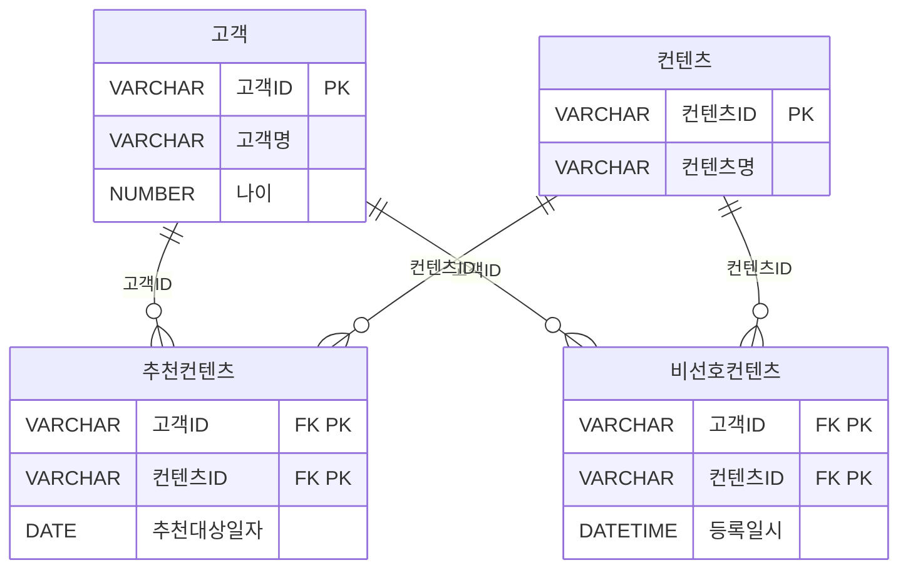
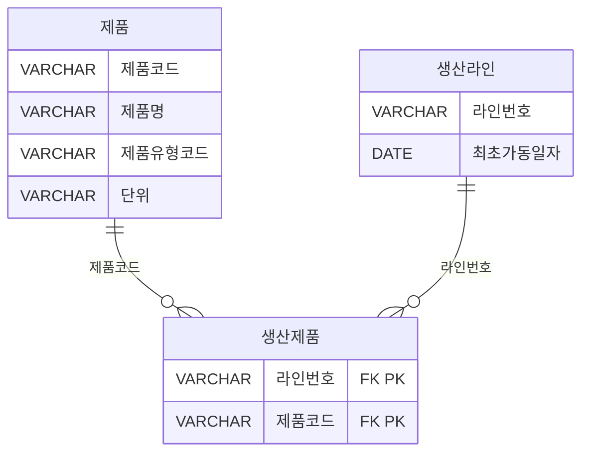
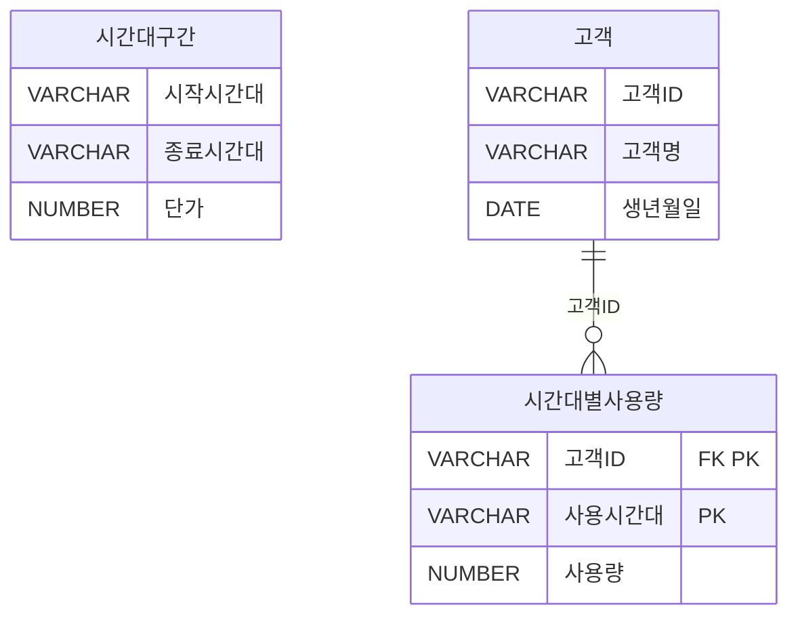
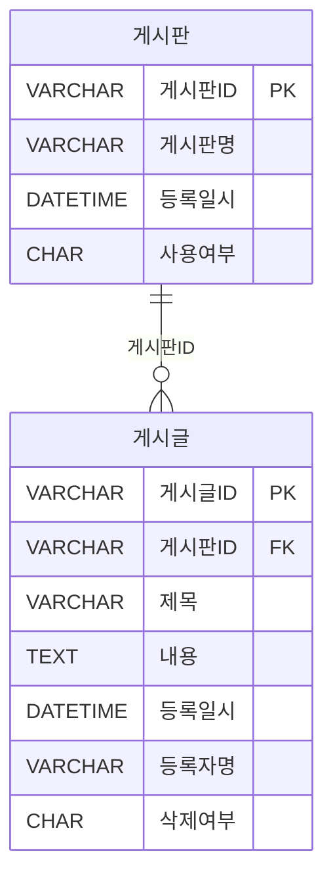

---

### 📁 SQL USING

| 구간   | 문제 번호 | 주제                                      | 난이도     |
|--------|------------|-------------------------------------------|------------|
| 1~15   | 065~079    | 관계 연산자, JOIN 실무, 집합 연산자       | ⭐⭐ 초~중급 |
| 16~30  | 080~094    | INTERSECT, EXCEPT, 계층형 질의            | ⭐⭐⭐ 중~고급 |
| 31~45  | 095~109    | 집합 연산자, JOIN 조건, 서브쿼리 활용     | ⭐⭐⭐ 고급    |
| 46~63  | 110~127    | 실무형 SQL 로직, 집계, 조건부 연산        | ⭐⭐⭐⭐ 실무형 |


#### ✅ 1~15번 ( 065~079 ): 관계 연산자, JOIN 실무, 집합 연산자  
- SELECT, JOIN, OUTER JOIN, 집합 연산자(EXCEPT, UNION 등)의 기본 구조를 익힙니다.  
- 복합키, 비선호 필터링, 카티시안 곱 등 실무에서 자주 쓰이는 SQL 로직을 다룹니다.

#### ✅ 16~30번 (  080~094 ): INTERSECT, EXCEPT, 계층형 질의  
- INTERSECT, MINUS, EXCEPT의 차이와 활용법을 비교합니다.  
- START WITH, CONNECT BY, ORDER SIBLINGS BY 등 계층형 질의 구문을 학습합니다.

#### ✅ 31~45번 (095~109  ): 집합 연산자, JOIN 조건, 서브쿼리 활용  
- UNION ALL, 집합 연산자 조합, 서브쿼리와 EXISTS 활용을 집중적으로 다룹니다.  
- JOIN 조건에 따른 결과 건수와 정렬 방식까지 실무 중심으로 분석합니다.

#### ✅ 46~63번 (110~127): 실무형 SQL 로직, 집계, 조건부 연산  
- 조건부 집계, 서브쿼리 필터링, 복잡한 JOIN 조합을 실무 사례로 학습합니다.  
- SQL 성능, 정렬 우선순위, 집계 함수 조합까지 고급 SQL 로직을 익힙니다.

 


---
### ✅065  

다음 중 순수 관계 연산자에 해당하지 않는 것은?
① SELECT
② UPDATE
③ JOIN
④ DIVIDE


**정답** : 2

---
### ✅066  
다음 중 아래 데이터 모델을 참고하여 설명에 맞게 올바르게 작성한 SQL 문장을 2개 고르시오.



※ 추천컨텐츠 테이블의 복합키: 고객ID + 컨텐츠ID
※ 비선호컨텐츠 테이블의 복합키: 고객ID + 컨텐츠ID


[설명]
우리는 매일 배치작업을 통하여 고객에게 추천할 컨텐츠를 생성하고 고객에게 추천서비스를 제공한다.
추천 컨텐츠 엔터티에서 언제 추천을 해야 하는지를 정의하는 추천 대상일자가 있어 해당일자에만 컨텐츠를 추천해야 한다. 또한 고객이 컨텐츠를 추천 받았을 때 선호하는 컨텐츠가 아닌 경우에는 고객이 비선호 컨텐츠로 분류하여 더 이상 추천 받기를 원하지 않는다. 그러므로 우리는 비선호 컨텐츠 엔터티에 등록된 데이터에 대해서는 추천을 수행하지 않아야 한다.

※ 배치작업이란? 어떤 처리를 연속적으로 하는 것이 아니고 일정량씩 나누어 처리하는 경우 그 일정량을 배치(batch)라고 한다. 배치의 원뜻은 한 묶음이라는 의미다. [기계공학용어사전]
예) 상품을 주문하는 로직은 그당시에 발생하는 트랜잭션에 대한 처리이므로 배치작업이라 표현하지는 않는다. 하지만 상품별 주문량을 집계하는 로직의 경우 특정조건(기간등)으로 일괄처리를 해야함으로 배치작업이라 표현할 수 있다.


```sql
① SELECT C.컨텐츠ID, C.컨텐츠명
FROM 고객 A INNER JOIN 추천컨텐츠 B
ON (A.고객ID  = B.고객ID) INNER JOIN 컨텐츠 C
ON (B.컨텐츠ID = C.컨텐츠최D)
WHERE A.고객ID = #custId#
AND   B.추천대상일자 = TO CHAR(SYSDATE, 'YYYY.MM.DD')
AND NOT EXISTS (SELECT X.컨텐츠ID  FROM 비선호컨텐츠 X  WHERE X.고객ID = B.고객ID):

② SELECT C.컨텐츠ID, C.컨텐츠명
FROM 고객 A INNER JOIN 추천컨텐츠 B
ON (A.고객ID = #custId# AND A.고객ID = B.고객ID) INNER JOIN 컨텐츠 C
ON (B.컨텐츠ID = C.컨텐츠ID) RIGHT OUTER JOIN 비선호컨텐츠 D
ON (B.고객ID = D.고객ID AND B.컨텐츠ID = D.컨텐츠치D)
WHERE B.추천대상일자 = TO CHAR(SYSDATE, 'YYYY.MM.DD')
AND   B.컨텐츠ID IS NOT NULL;

③ SELECT C.컨텐츠ID, C.컨텐츠명
FROM 고객 A INNER JOIN 추천컨텐츠 B
ON (A.고객ID = B.고객ID) INNER JOIN 컨텐츠 C
ON (B.컨텐츠ID = C.컨텐츠ID) LEFT OUTER JOIN 비선호컨텐츠 D
ON (B.고객ID = D.고객ID AND B.컨텐츠최ID = D.컨텐츠ID)
WHERE A.고객ID = #custId#
AND   B.추천대상일자 = TO_CHAR(SYSDATE, 'YYYY.MM.DD')
AND   D.컨텐츠ID IS NULL;

④ SELECT C.컨텐츠ID, C.컨텐츠명
FROM 고객 A INNER JOIN 추천컨텐츠 B
ON (A.고객ID = #custId# AND A.고객ID = B.고객ID) INNER JOIN 컨텐츠 C
ON (B.컨텐츠ID = C.컨텐츠ID)
WHERE B.추천대상일자 = TO_CHAR(SYSDATE, 'YYYY.MM.DD')
AND NOT EXISTS ( SELECT X.컨텐츠ID   FROM 비선호컨텐츠 X  
                    WHERE X.고객ID = B.고객ID  AND X.컨텐츠ID = B.컨텐츠ID);
```


**정답** : 3,4


---

### ✅067  
아래는 어느 회사의 생산설비를 위한 데이터 모델의 일부에 대한 설명으로 가장 적절한 것을 2개 고르시오.



※ 생산제품 테이블의 복합키: 라인번호 + 제품코드


① 제품, 생산제품, 생산라인 엔터티를 Inner Join 하기 위해서 생산제품 엔터티는 WHERE절에 최소 2번이 나타나야 한다.
② 제품과 생산라인 엔터티를 Join시 적절한 Join조건이 없으므로 카티시안곱(Cartesian Product)이 발생한다.
③ 제품과 생산라인 엔터티에는 생산제품과 대응되지 않는 레코드는 없다.
④ 특정 생산라인번호에서 생산되는 제품의 제품명을 알기위해서는 제품,생산제품, 생산라인까지 3개 엔터티의 Inner Join인 필요하다.


**정답** : 1,2

> 1번답안 : 
생산제품 테이블이 두 관계를 연결한다는 점을 강조하려는 의도로 보임. 하지만 WHERE절에 2번 등장해야 한다는 표현은 부정확하고 오해의 소지가 있음.
이처럼 생산제품 테이블은 ON절에서 2번 사용되지만, WHERE절에 2번 등장할 필요는 없음
그래도 굳이 2개 고르라고 했으므로 완전틀린 3,4 제외

```
SELECT ...
FROM 제품 P
JOIN 생산제품 SP ON P.제품코드 = SP.제품코드
JOIN 생산라인 L ON SP.라인번호 = L.라인번호
```

---
### ✅068  
아래의 테이블 스키마 정보를 참고하여, 다음 중 '구매 이력이 있는 고객 중 구매 횟수가 3회 이상인 고객의 이름과 등급을 출력하시오.'라는 질의에 대해 아래 SQL 문장의 (가), (나)에 들어 갈 구문으로 가장 적절한 것은?

```sql
[테이블]
고객(고객번호(PK), 이름, 등급)
구매정보(구매번호(PK), 구매금액, 고객번호(FK))

* 구매정보 테이블의 고객번호는 고객 테이블의 고객번호를 참조하는 외래키(Foreign Key)이다.

[SQL 문장]
SELECT A.이름, A.등급
FROM 고객 A
(가)
GROUP BY A.이름, A.등급
(나)
```

① (가): INNER JOIN 구매정보 B ON A, 고객번호=B, 고객번호
  (나): HAVING SUM(B.구매번호) >=3

② (가): INNER JOIN 구매정보 B ON A.고객번호=B, 고객번호
  (나): HAVING COUNT(B.구매번호) >=3

③ (가): LEFT OUTER JOIN 구매정보 B ON A, 고객번호=B.고객번호
  (나): HAVING SUM(B.구매번호)>=3

④ (가): INNER JOIN 구매정보 B ON A.고객번호=B.고객번호
  (나): WHERE B.구매번호 >=3


**정답** : 2


---

### ✅069  
아래는 어느 회사의 정산 데이터 모델의 일부이며 고객이 서비스를 사용한 시간대에 따라 차등 단가를 적용하려고 한다. 다음 중 시간대별사용량 테이블을 기반으로 고객별 사용금액을 추출하는 SQL으로 가장 적절한 것은?



※ 시간대별사용량 테이블의 복합키: 고객ID + 사용시간대

```sql
①  SELECT A.고객ID, A.고객명, SUM(B.사용량 * C.단가) AS 사용금액
FROM 고객 A INNER JOIN 시간대별사용량 B
ON (A.고객ID = B.고객ID) INNER JOIN 시간대구간 C
ON (B.사용시간대 <= C.시작시간대 AND B.사용시간대 >= C.종료시간대)
GROUP BY A.고객ID, A.고객명
ORDER BY A.고객ID, A.고객명;

② SELECT A.고객ID, A.고객명, SUM(B.사용량 * C.가) AS 사용금액
FROM 고객 A INNER JOIN 시간대별사용량 B INNER JOIN 시간대구간 C
ON (A.고객ID = B.고객ID AND B.사용시간대  BETWEEN C.시작시간대 AND C.종료시간대)
GROUP BY A.고객ID, A.고객명
ORDER BY A.고객ID, A.고객명:

③ SELECT A.고객ID, A.고객명, SUM(B.사용량 * C.단가) AS 사용금액
FROM 고객 A INNER JOIN 시간대별사용량 B
ON (A.고객ID = B.고객ID) INNER JOIN 시간대구간 C
ON B.사용시간대 BETWEEN C.시작시간대 AND C.종료시간대
GROUP BY A.고객ID, A.고객명
ORDER BY A.고객ID, A.고객명:

④ SELECT A.고객ID, A.고객명, SUM(B.사용량 * C.단가) AS 사용금액
FROM 고객 A INNER JOIN 시간대별사용량 B
ON (A.고객ID = B.고객ID) BETWEEN JOIN 시간대구간 C
GROUP BY A.고객ID, A.고객명
ORDER BY A.고객ID, A.고객명:
```


**정답** : 3


---

### ✅070  

다음 중 팀(TEAM) 테이블과 구장(STADIUM) 테이블의 관계를 이용해서 소속팀이 가지고 있는 전용구장의 정보를 팀의 정보와 함께 출력하는 SQL을 작성할 때 결과가 다른 것은?
```sql
① SELECT T.REGION_NAME, T.TEAM_NAME, T.STADIUM_ID, S.STADIUM_NAME
FROM TEAM T INNER JOIN STADIUM S
USING (T.STADIUM_ID = S.STADIUM_ID);

② SELECT TEAM.REGION_NAME, TEAM.TEAM_NAME, TEAM.STADIUM_ID, STADIUM.STADIUM_NAME
FROM TEAM INNER JOIN STADIUM
ON (TEAM.STADIUM_ID = STADIUM.STADIUM_ID);

③ SELECT T.REGION_NAME, T.TEAM_NAME, T.STADIUM_ID, S.STADIUM_NAME
FROM TEAM T, STADIUM S
WHERE T.STADIUM_ID = S.STADIUM_ID;

④ SELECT TEAM.REGION_NAME, TEAM.TEAM_NAME, TEAM.STADIUM_ID, STADIUM.STADIUM_NAME
FROM TEAM, STADIUM
WHERE TEAM.STADIUM_ID = STADIUM.STADIUM_ID;
```


**정답** : 1


---

### ✅071  

아래의 사례1은 Cartesian Product를 만들기 위한 SQL 문장이며 사례1과 같은 결과를 얻기 위해 사례2 SQL 문장의 ㉠ 안에 들어갈 내용을 작성하시오.

```sql
[사례1]
SELECT ENAME, DNAME
FROM EMP, DEPT
ORDER BY ENAME;

[사례2]
SELECT ENAME, DNAME
FROM EMP  ㉠ DEPT 
ORDER BY ENAME;
```


**정답** : CROSS JOIN


---

### ✅072  

다음 중 아래 테이블들을 대상으로 SQL 문장을 수행한 결과로 가장 적절한 것은?

[테이블: OS]
| OSID (PK) | OS명     |
|-----------|----------|
| 100       | Android  |
| 200       | IOS      |
| 300       | Bada     |

[테이블: 단말기]
| 단말기ID (PK) | 단말기명 | OSID (FK) |
|---------------|-----------|------------|
| 1000          | A1000     | 100        |
| 2000          | B2000     | 100        |
| 3000          | C3000     | 200        |
| 4000          | D3000     | 300        |

[테이블: 고객]
| 고객번호 (PK) | 고객명 | 단말기ID (FK) |
|----------------|--------|----------------|
| 11000          | 홍길동 | 1000           |
| 12000          | 강감찬 | NULL           |
| 13000          | 이순신 | NULL           |
| 14000          | 안중근 | 3000           |
| 15000          | 고길동 | 4000           |
| 16000          | 이대로 | 4000           |

 


```sql
[SQL]
SELECT A.고객번호, A.고객명, B.단말기ID, B.단말기명, C.OSID, C.OS명
FROM 고객 A LEFT OUTER JOIN 단말기 B
ON (A.고객번호 IN (11000,12000)  AND  A.단말기ID=B.단말기ID)  LEFT OUTER JOIN OS C
ON (B.OSID = C.OSID)
ORDER BY A.고객번호;
```

 ①
| 고객번호 | 고객명 | 단말기ID | 단말기명 | OSID | OS명    |
|----------|--------|-----------|-----------|------|---------|
| 11000    | 홍길동 | 1000      | A1000     | 100  | Android |
| 12000    | 강감찬 | NULL      | NULL      | NULL | NULL    |
| 13000    | 이순신 | NULL      | NULL      | NULL | NULL    |
| 14000    | 안중근 | NULL      | NULL      | NULL | NULL    |
| 15000    | 고길동 | NULL      | NULL      | NULL | NULL    |
| 16000    | 이대로 | NULL      | NULL      | NULL | NULL    |

② 단말기 
| 고객번호 | 고객명 | 단말기ID | 단말기명 | OSID | OS명    |
|----------|--------|-----------|-----------|------|---------|
| 11000    | 홍길동 | 1000      | A1000     | 100  | Android |
| 12000    | 강감찬 | NULL      | NULL      | NULL | NULL    |

③ 
| 고객번호 | 고객명 | 단말기ID | 단말기명 | OSID | OS명    |
|----------|--------|-----------|-----------|------|---------|
| 11000    | 홍길동 | 1000      | A1000     | 100  | Android |


④ 
| 고객번호 | 고객명 | 단말기ID | 단말기명 | OSID | OS명    |
|----------|--------|-----------|-----------|------|---------|
| 11000    | 홍길동 | 1000      | A1000     | 100  | Android |
| 12000    | 강감찬 | NULL      | NULL      | NULL | NULL    |
| 13000    | 이순신 | NULL      | NULL      | NULL | NULL    |
| 14000    | 안중근 | 3000      | C3000     | 200  | iOS     |
| 15000    | 고길동 | 4000      | D4000     | 300  | Bada    |
| 16000    | 이대로 | 4000      | D4000     | 300  | Bada    |

 
**정답** : 1


---

### ✅073  
다음 중 아래 (1), (2), (3)의 SQL에서 실행결과가 같은 것은?

```sql
(1) SELECT A.ID, B.ID
FROM TBL1 A FULL OUTER JOIN TBL2 B
ON A.ID = B.ID

(2) SELECT A.ID, B.ID
FROM TBL1 A LEFT OUTER JOIN TBL2 B
ON A.ID = B.ID
UNION
SELECT A.ID, B.ID
FROM TBL1 A RIGHT OUTER JOIN TBL2 B
ON A.ID = B.ID

(3) SELECT A.ID, B.ID
FROM TBL1 A, TBL2 B
WHERE A.ID = B.ID
UNION ALL
SELECT A.ID, NULL
FROM TBL1 A
WHERE NOT EXISTS (SELECT 1 FROM TBL2 B WHERE A.ID = B.ID)
UNION ALL
SELECT NULL, B.ID
FROM TBL2 B
WHERE NOT EXISTS (SELECT 1 FROM TBL1 A WHERE B.ID = A.ID)
```

① 1, 2
② 1, 3
③ 2, 3
④ 1, 2, 3


**정답** : 4


---

### ✅074  
아래의 EMP 테이블과 DEPT 테이블에서 밑줄 친 속성은 주키이며 EMP.C는 DEPT와 연결된 외래키이다. EMP 테이블과 DEPT 테이블을 LEFT, FULL, RIGHT 외부조인(outer join)하면 생성되는 결과 건수로 가장 적절한 것은?

[ EMP 테이블]
| <u>A</u> | B | C |
|---|---|---|
| 1 | b | w |
| 3 | d | w |
| 5 | y | y |

[DEPT 테이블]
| <u>C</u> | D | E  |
|---|---|----|
| w | 1 | 10 |
| z | 4 | 11 |
| v | 2 | 22 |


① 3건, 5건, 4건
② 4건, 5건, 3건
③ 3건, 4건, 4건
④ 3건, 4건, 5건


**정답** : 1


---

### ✅075  
신규 부서의 경우 일시적으로 사원이 없는 경우도 있다고 가정하고 DEPT와 EMP를 조인하되 사원이 없는 부서 정보도 같이 출력하도록 할 때, 아래 SQL 문장의 (가) 안에 들어갈 내용을 기술하시오.

```sql
SELECT E, ENAME, D. DEPTNO, D. DNAME
FROM  DEPT D  (가)  EMP E
ON    D.DEPTNO = E.DEPTNO;
```


**정답** : LEFT JOIN

---

### ✅076  

다음 중 아래와 같은 데이터 상황에서 SQL의 수행 결과로 가장 적절한 것은?

[ 테이블 1: TAB1]
| C1 | C2 |
|----|----|
| A  | 1  |
| B  | 2  |
| C  | 3  |
| D  | 4  |
| E  | 5  |

[ 테이블 2: TAB2]
| C1 | C2 |
|----|----|
| B  | 2  |
| C  | 3  |
| D  | 4  |


```sql
SELECT *
FROM TABI A LEFT OUTER JOIN TAB2 B
ON (A.C1 = B.C1 AND B.C2 BETWEEN 1 AND 3)
```

 ①
| C1 | C2 | C1 | C2 |
|----|----|----|----|
| A  | 1  | | |
| B  | 2  | B  | 2  |
| C  | 3  |C  | 3  |
| D  | 4  |D  | 4  |
| E  | 5  | |   | 

②
| C1 | C2 | C1 | C2 |
|----|----|----|----|
| A  | 1  | | |
| B  | 2  | B  | 2  |
| C  | 3  |C  | 3  |
| D  | 4  |  |   |
| E  | 5  | |   | 

③
| C1 | C2 | C1 | C2 |
|----|----|----|----|
| A  | 1  | | |
| B  | 2  | B  | 2  |
| C  | 3  |C  | 3  |

④
| C1 | C2 | C1 | C2 |
|----|----|----|----|
| A  | 1  | | |
| B  | 2  | B  | 2  |
| C  | 3  |C  | 3  |
| D  | 4  |D  | 4  |


**정답** : 2


---
### ✅077  
아래와 같은 데이터 모델에서 ORACLE을 기준으로 SQL을 작성하였다. 그러나 SQL Server에서도 동일한 결과를 보장할 수 있도록 ANSI 구문으로 SQL을 변경하려고 한다. 다음 중 아래의 SQL을 ANSI 표준 구문으로 변경한 것으로 가장 적절한 것은?



```sql
[SQL]
SELECT A.게시판ID, A.게시판명, COUNT(B.게시글ID) AS CNT
FROM 게시판 A, 게시글 B
WHERE A.게시판ID = B.게시판ID(+)
AND   B.삭제여부(+) = 'N'
AND   A.사용여부 = 'Y'
GROUP BY A.게시판ID, A.게시판명
ORDER BY A.게시판ID;
```

**[보기]**
```sql
① SELECT A.게시판ID, A.게시판명, COUNT(B.게시글ID) AS CNT
FROM    게시판 A LEFT OUTER JOIN 게시글 B
ON (A.게시판ID = B.게시판ID AND B.삭제여부 = 'N')
WHERE A.사용여부 = 'Y'
GROUP BY A.게시판ID, A.게시판명
ORDER BY A.게시판ID;

② SELECT A.게시판ID, A.게시판명, COUNT(B.게시글ID) AS CNT
FROM 게시판 A LEFT OUTER JOIN 게시글 B
ON (A.게시판ID = B.게시판ID AND A.사용여부 = 'Y')
WHERE B.삭제여부 = 'N'
GROUP BY A.게시판ID, A.게시판명
ORDER BY A.게시판ID:

③ SELECT A.게시판ID, A.게시판명, COUNT(B.게시글ID) AS CNT
FROM 게시판 A LEFT OUTER JOIN 게시글 B
ON (A.게시판ID = B.게시판ID)
WHERE A.사용여부 = 'Y' AND B.삭제여부 = 'N'
GROUP BY A.게시판ID, A.게시판명
ORDER BY A.게시판ID;

④ SELECT A.게시판ID, A.게시판명 , COUNT(B.게시글ID) AS CNT
FROM 게시판 A RIGHT OUTER JOIN 게시글 B
ON  (A.게시판ID = B.게시판ID AND A.사용여부 = 'Y' AND B.삭제여부 = 'N')
GROUP BY A.게시판ID, A.게시판명
ORDER BY A.게시판ID:
```


**정답** : 1


---

### ✅078  
다음과 같은 2개의 릴레이션이 있다고 가정하자. student의 기본키는 st_num이고, department의 기본키는 dept_nurn이다. 또한 student의 d_num은 department의 dept_num을 참조하는 외래키이다. 아래 SQL문의 실행 결과 건수는?


```sql
SELECT count(st name)
FROM student s
WHERE not exists
(SELECT *
FROM department d
WHERE s.d_num = d.dept_num  and dept_name = '전자계산학과');
```
 

[테이블 1: Student]
| st_num | st_name | d_num |
|--------|---------|-------|
| 1001   | Yoo     | 10    |
| 1002   | Kim     | 30    |
| 1003   | Lee     | 20    |
| 1004   | Park    | 10    |
| 1005   | Choi    | 20    |
| 1006   | Jeong   | 10    |

[테이블 2: Department]
| dept_num | dept_name       |
|----------|------------------|
| 10       | 컴퓨터공학과       |
| 20       | 원자력공학과       |
| 30       | 전자계산학과       |

 


**정답** : 5


---

### ✅079  
(SQL Server) 다음 중 아래의 SQL과 동일한 결과를 추출하는 SQL은?
(단, 테이블 TAB1, TAB2의 PK 컬럼은 A, B 이다)

```sql
[SQL]
SELECT A, B
FROM TAB1
EXCEPT
SELECT A, B
FROM TAB2;
```

**[보기]**
```sql
① SELECT TAB2.A, TAB2.B
FROM TABI, TAB2
WHERE TABI.A <> TAB2.A
AND TAB1.B <> TAB2.B

② SELECT TAB2.A, TAB2.B
FROM TAB1
WHERE TAB1.A NOT IN (SELECT TAB2.A FROM TAB2)
AND   TAB1.B NOT IN (SELECT TAB2.B FROM TAB2);

③ SELECT TAB2.A, TAB2.B
FROM TAB1, TAB2
WHERE TAB1.A = TAB2.A
AND   TAB1.B = TAB2.B

④ SELECT TAB1.A, TAB1.B
FROM TAB1
WHERE NOT EXISTS 
(SELECT 'X' FROM TAB2 WHERE TAB1.A = TAB2.A AND TAB1.B = TAB2.B);
```


**정답** : 4


