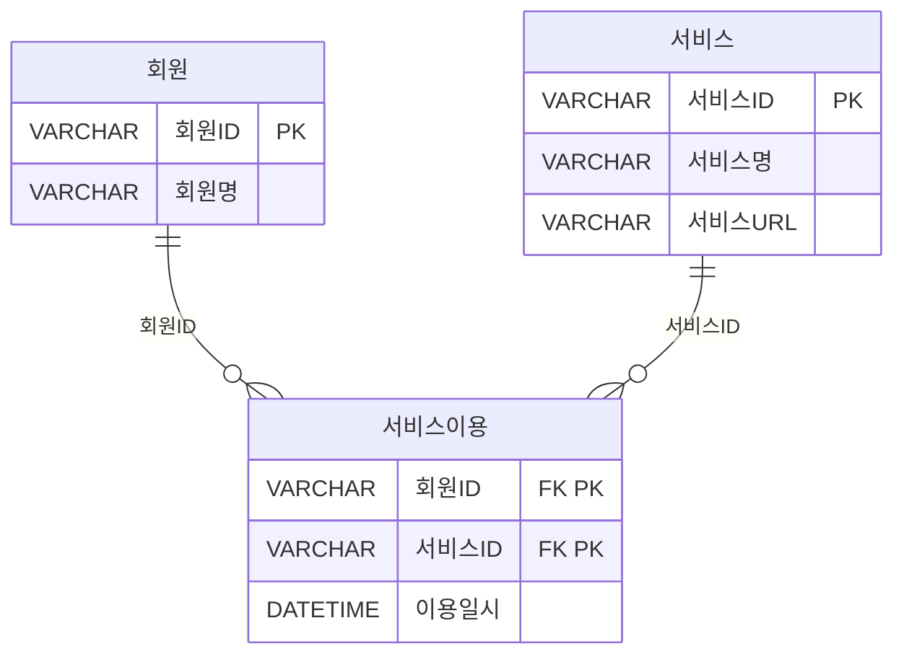
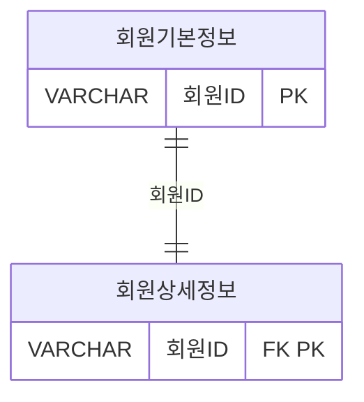

<style>
pre, code {
  white-space: pre-wrap !important;
  word-break: break-word !important;
  overflow-x: hidden !important;
  display: block !important;
  max-width: 100% !important;
  box-sizing: border-box !important;
}
</style> 

---

### 📁 SQL USING

| 구간   | 문제 번호 | 주제                                      | 난이도     |
|--------|------------|-------------------------------------------|------------|
| 1~15   | 065~079    | 관계 연산자, JOIN 실무, 집합 연산자       | ⭐⭐ 초~중급 |
| 16~30  | 080~094    | INTERSECT, EXCEPT, 계층형 질의            | ⭐⭐⭐ 중~고급 |
| 31~45  | 095~109    | 집합 연산자, JOIN 조건, 서브쿼리 활용     | ⭐⭐⭐ 고급    |
| 46~63  | 110~127    | 실무형 SQL 로직, 집계, 조건부 연산        | ⭐⭐⭐⭐ 실무형 |


#### ✅ 1~15번 ( 065~079 ): 관계 연산자, JOIN 실무, 집합 연산자  
- SELECT, JOIN, OUTER JOIN, 집합 연산자(EXCEPT, UNION 등)의 기본 구조를 익힙니다.  
- 복합키, 비선호 필터링, 카티시안 곱 등 실무에서 자주 쓰이는 SQL 로직을 다룹니다.

#### ✅ 16~30번 (  080~094 ): INTERSECT, EXCEPT, 계층형 질의  
- INTERSECT, MINUS, EXCEPT의 차이와 활용법을 비교합니다.  
- START WITH, CONNECT BY, ORDER SIBLINGS BY 등 계층형 질의 구문을 학습합니다.

#### ✅ 31~45번 (095~109  ): 집합 연산자, JOIN 조건, 서브쿼리 활용  
- UNION ALL, 집합 연산자 조합, 서브쿼리와 EXISTS 활용을 집중적으로 다룹니다.  
- JOIN 조건에 따른 결과 건수와 정렬 방식까지 실무 중심으로 분석합니다.

#### ✅ 46~63번 (110~127): 실무형 SQL 로직, 집계, 조건부 연산  
- 조건부 집계, 서브쿼리 필터링, 복잡한 JOIN 조합을 실무 사례로 학습합니다.  
- SQL 성능, 정렬 우선순위, 집계 함수 조합까지 고급 SQL 로직을 익힙니다.

 


---
```bash
[문제 080]  
아래와 같은 데이터 모델에 대해 SQL을 수행 하였다. 다음 중 수행된 SQL과 동일한 결과를 도출하는 SQL은?
```


```sql
[수행 SQL]
SELECT A.서비스ID, B.서비스명, B.서비스URL
FROM (SELECT 서비스ID  FROM 서비스
        INTERSECT
        SELECT 서비스ID
        FROM 서비스이용) A.서비스 B
WHERE A.서비스ID = B.서비스ID;
```

```sql
① SELECT B.서비스ID, A.서비스명, A.서비스URL
FROM 서비스 A , 서비스이용 B
WHERE A.서비스ID = B.서비스ID;

② SELECT X.서비스ID, X.서비스명, X.서비스URL
FROM 서비스 X
WHERE NOT EXISTS (
    SELECT 1
    FROM (SELECT 서비스ID  FROM 서비스
          MINUS
          SELECT 서비스ID  FROM 서비스이용) Y
    WHERE X. 서비스ID = Y. 서비스ID);

③ SELECT B.서비스ID, A.서비스명, A.서비스URL
FROM 서비스 A LEFT OUTER JOIN 서비스이용 B
ON (A.서비스ID = B.서비스ID)
WHERE B.서비스ID IS NULL
GROUP BY B.서비스ID, A.서비스명, A.서비스URL;

④ SELECT A.서비스ID, A.서비스명, A.서비스URL
FROM 서비스 A
WHERE 서비스ID IN (SELECT 서비스ID FROM 서비스이용
                MINUS
                SELECT 서비스ID  FROM 서비스);
```

**정답:** ②

🧸 **쉬운 해설:**  
INTERSECT은 두 테이블에 모두 있는 값만 보여줘요.  
MINUS로 제외된 걸 다시 NOT EXISTS로 걸러내면 같은 결과예요!

📚 **전문 해설:**  
- INTERSECT: 교집합  
- MINUS: 차집합  
- NOT EXISTS로 MINUS 결과 제외 → 교집합과 동일


###### 🎯 원래 수행 SQL

```sql
SELECT A.서비스ID, B.서비스명, B.서비스URL
FROM (
  SELECT 서비스ID FROM 서비스
  INTERSECT
  SELECT 서비스ID FROM 서비스이용
) A, 서비스 B
WHERE A.서비스ID = B.서비스ID;
```

###### 🔍 의미
- **INTERSECT**: 두 테이블에 모두 존재하는 **서비스ID**만 추출 (교집합)
- 그 결과를 서비스 테이블과 조인하여 상세 정보 출력

###### ✅ 정답 SQL (보기 ②)

```sql
SELECT X.서비스ID, X.서비스명, X.서비스URL
FROM 서비스 X
WHERE NOT EXISTS (
  SELECT 1
  FROM (
    SELECT 서비스ID FROM 서비스
    MINUS
    SELECT 서비스ID FROM 서비스이용
  ) Y
  WHERE X.서비스ID = Y.서비스ID
);
```

###### 🧠 SQL 처리 순서 설명

###### 1️⃣ **FROM 서비스 X**
- 기준 테이블은 **서비스**.
- 모든 서비스 행을 대상으로 시작합니다.

###### 2️⃣ **WHERE NOT EXISTS (...)**
- 각 서비스에 대해 서브쿼리를 실행하여 조건을 만족하는지 확인합니다.
- 서브쿼리 결과가 **존재하지 않을 경우**에만 해당 서비스가 결과에 포함됩니다.

###### 3️⃣ 서브쿼리 내부: **SELECT 서비스ID FROM 서비스 MINUS SELECT 서비스ID FROM 서비스이용**
- **MINUS**: 서비스 테이블에만 있고, 서비스이용에는 없는 **서비스ID** 추출 (차집합)
- 즉, **이용된 적 없는 서비스ID** 목록을 생성합니다.

###### 4️⃣ **WHERE X.서비스ID = Y.서비스ID**
- 메인 서비스ID가 서브쿼리 결과에 포함되어 있으면 제외
- 포함되어 있지 않으면 결과에 유지

###### 5️⃣ **SELECT X.서비스ID, X.서비스명, X.서비스URL**
- 최종적으로 **서비스이용 테이블에도 존재하는 서비스ID**만 출력
- 즉, **INTERSECT**와 동일한 결과

###### 📊 핵심 요약

| 처리 단계 | 설명 |
|-----------|------|
| **FROM 서비스 X** | 기준 테이블 선택 |
| **MINUS** | 서비스 중 이용되지 않은 것 추출 |
| **NOT EXISTS** | 이용되지 않은 서비스 제외 |
| **SELECT** | 이용된 서비스 정보 출력 |

###### ✅ 결과적으로

- **INTERSECT**는 교집합
- **MINUS + NOT EXISTS**는 교집합을 우회적으로 구현
- 보기 ②는 정확히 같은 결과를 도출합니다
 

| 보기 번호 | 설명 | 적절성 |
|-----------|-------------------------------|--------|
| ① | 단순 JOIN은 중복 포함 가능 | ❌ |
| ② | MINUS + NOT EXISTS로 교집합 구현 | ✅ |
| ③ | IS NULL은 제외 조건 | ❌ |
| ④ | MINUS 방향이 반대 | ❌ |

🧠 **기억법:**  
INTERSECT = NOT EXISTS + MINUS

🃏 관련 암기카드  
- 🃏 카드 42: 서브쿼리 유형  
- 🃏 카드 28: EXISTS = 존재 확인  
- 🃏 카드 23: JOIN = 연결


---
```bash
[문제 081]  
SET OPERATOR 중에서 수학의 교집합과 같은 기능을 하는 연산자로 가장 적절한 것은?

① UNION
② INTERSECT
③ MINUS
④ EXCEPT
```
**정답:** ②

🧸 **쉬운 해설:**  
교집합은 INTERSECT! 두 테이블에 모두 있는 값만 보여줘요.

📚 **전문 해설:**  
- UNION: 합집합  
- INTERSECT: 교집합  
- MINUS/EXCEPT: 차집합

| 보기 번호 | 설명 | 적절성 |
|-----------|-------------------------------|--------|
| ① | 합집합 | ❌ |
| ② | 교집합 | ✅ |
| ③ | 차집합 | ❌ |
| ④ | 차집합(SQL Server) | ❌ |

🧠 **기억법:**  
INTERSECT = 공통된 값만

🃏 관련 암기카드  
- 🃏 카드 42: 서브쿼리 유형  
- 🃏 카드 44: DML vs DDL


---
```bash
[문제 082]   
다음 중 아래의 EMP 테이블의 데이터를 참조하여 실행한 SQL의 결과로 가장 적절한 것은?
```
```sql
SELECT ENAME AAA, JOB AAB
FROM EMP
WHERE EMPNO = 7369
UNION ALL
SELECT ENAME BBA, JOB BBB
FROM EMP
WHERE EMPNO = 7566
ORDER BY 1, 2;
```

[ 테이블 1: EMP]
| EMPNO | ENAME  | JOB       | MGR  | HIREDATE   | SAL  | COMM | DEPTNO |
|-------|--------|-----------|------|------------|------|------|--------|
| 7369  | SMITH  | CLERK     | 7902 | 1980-12-17 | 800  |   | 20     |
| 7499  | ALLEN  | SALESMAN  | 7698 | 1981-02-20 | 1600 | 300  | 30     |
| 7521  | WARD   | SALESMAN  | 7698 | 1981-02-22 | 1250 | 500  | 30     |
| 7566  | JONES  | MANAGER   | 7839 | 1981-04-02 | 2975 |   | 20     |
| 7654  | MARTIN | SALESMAN  | 7698 | 1981-09-28 | 1250 | 1400 | 30     |
| 7698  | BLAKE  | MANAGER   | 7839 | 1981-05-01 | 2850 |   | 30     |
| 7782  | CLARK  | MANAGER   | 7839 | 1981-06-09 | 2450 |   | 10     |
| 7788  | SCOTT  | ANALYST   | 7566 | 1987-07-13 | 3000 |   | 20     |
| 7839  | KING   | PRESIDENT |   | 1981-11-17 | 5000 |   | 10     |
| 7844  | TURNER | SALESMAN  | 7698 | 1981-09-08 | 1500 | 0    | 30     |
| 7876  | ADAMS  | CLERK     | 7788 | 1987-07-13 | 1100 |   | 20     |
| 7900  | JAMES  | CLERK     | 7698 | 1981-12-03 | 950  |   | 30     |
| 7902  | FORD   | ANALYST   | 7566 | 1981-12-03 | 3000 |   | 20     |
| 7934  | MILLER | CLERK     | 7782 | 1982-01-23 | 1300 |   | 10     |

 

① 
| AAA | AAB     |
|--------|---------|
| SMITH  | CLERK   |
| JONES  | MANAGER |

 
②
| AAA | AAB     |
|--------|---------|
| JONES  | MANAGER |
| SMITH  | CLERK   |
 
③ 
| BBA | BBB     |
|--------|---------|
| SMITH  | CLERK   |
| JONES  | MANAGER |

 
④ 
| BBA | BBB     |
|--------|---------|
| JONES  | MANAGER |
| SMITH  | CLERK   |
 

**정답:** ②

🧸 **쉬운 해설:**  
UNION ALL은 중복 제거 안 해요!  
컬럼명은 첫 SELECT 기준으로 정렬돼요!

📚 **전문 해설:**  
- UNION ALL: 중복 포함  
- 컬럼명은 첫 SELECT 기준  
- ORDER BY 1, 2 → AAA, AAB 기준 정렬


###### 🧠 SQL 처리 순서 설명

```sql
SELECT ENAME AAA, JOB AAB
FROM EMP
WHERE EMPNO = 7369
UNION ALL
SELECT ENAME BBA, JOB BBB
FROM EMP
WHERE EMPNO = 7566
ORDER BY 1, 2;
```

###### 1️⃣ **SELECT ENAME AAA, JOB AAB FROM EMP WHERE EMPNO = 7369**
- EMP 테이블에서 사번이 7369인 행을 선택합니다.
- 결과: **ENAME = SMITH**, **JOB = CLERK**

###### 2️⃣ **SELECT ENAME BBA, JOB BBB FROM EMP WHERE EMPNO = 7566**
- EMP 테이블에서 사번이 7566인 행을 선택합니다.
- 결과: **ENAME = JONES**, **JOB = MANAGER**

###### 3️⃣ **UNION ALL**
- 두 SELECT 결과를 **합칩니다**.
- **UNION ALL**은 **중복 제거 없이** 모두 포함합니다.
- 결과: 2건 (SMITH + JONES)

###### 4️⃣ **ORDER BY 1, 2**
- 결과를 첫 번째 컬럼(ENAME), 두 번째 컬럼(JOB) 기준으로 오름차순 정렬합니다.
- 알파벳 순으로 **JONES**가 **SMITH**보다 먼저 나옵니다.

###### ✅ 최종 결과

| ENAME | JOB     |
|--------|----------|
| JONES  | MANAGER  |
| SMITH  | CLERK    |

###### 📊 핵심 요약

| 처리 단계 | 설명 |
|-----------|------|
| **SELECT ... WHERE EMPNO = 7369** | SMITH 추출 |
| **SELECT ... WHERE EMPNO = 7566** | JONES 추출 |
| **UNION ALL** | 두 결과 합치기 |
| **ORDER BY 1, 2** | 이름, 직무 기준 정렬 |
 

| 보기 번호 | 설명 | 적절성 |
|-----------|-------------------------------|--------|
| ① | 순서 반대 | ❌ |
| ② | 정렬 기준 정확 | ✅ |
| ③ | 컬럼명 기준 오류 | ❌ |
| ④ | 컬럼명 기준 오류 | ❌ |

🧠 **기억법:**  
UNION ALL = 중복 유지  
ORDER BY = 첫 SELECT 기준

🃏 관련 암기카드  
- 🃏 카드 24: GROUP BY = 묶기  
- 🃏 카드 33: COUNT(*) = 전체 행


---

```bash
[문제 083]  
다음 중 아래 TBL1, TBL2 테이블에 대해 SQL을 수행한 결과인 것은?
```
[테이블 1: TBL1]
| COL1 | COL2 |
|------|------|
| AA   | A1   |
| AB   | A2   |

[테이블 2: TBL2]
| COL1 | COL2 |
|------|------|
| AA   | A1   |
| AB   | A2   |
| AC   | A3   |
| AD   | A4   |

```sql
[SQL]
SELECT COL1, COL2, COUNT(*) AS CNT
FROM (SELECT COL1, COL2 FROM TBL1
      UNION ALL
      SELECT COL1, COL2 FROM TBL2
      UNION
      SELECT COL1, COL2 FROM TBL1)
GROUP BY COL1, COL2;
```


①
| COL1 | COL2 | CNT |
|------|------|-----|
| AA   | A1   | 1   |
| AB   | A2   | 1   |
| AC   | A3   | 1   |
| AD   | A4   | 1   |

②
| COL1 | COL2 | CNT |
|------|------|-----|
| AA   | A1   | 2   |
| AB   | A2   | 2   |
| AC   | A3   | 1   |
| AD   | A4   | 1   |

③
| COL1 | COL2 | CNT |
|------|------|-----|
| AA   | A1   | 3   |
| AB   | A2   | 3   |
| AC   | A3   | 1   |
| AD   | A4   | 1   |

 ④
| COL1 | COL2 | CNT |
|------|------|-----|
| AA   | A1   | 3   |
| AB   | A2   | 3   |
| AC   | A3   | 2   |
| AD   | A4   | 2   |


**정답:** ③

🧸 **쉬운 해설:**  
UNION ALL은 중복을 유지하고, UNION은 중복을 제거해요.  
TBL1이 2번 등장하지만 UNION이 중복을 제거하니까 총 6행이 돼요.

📚 **전문 해설:**  
- TBL1: 2행  
- TBL2: 4행  
- UNION ALL → 6행  
- UNION TBL1 → 중복 제거 → 추가 없음  
- 최종 6행 → AA/A1, AB/A2는 3번씩 등장

| 보기 번호 | 설명 | 적절성 |
|-----------|-------------------------------|--------|
| ① | 중복 제거된 결과 | ❌ |
| ② | 2번씩 등장 | ❌ |
| ③ | 정확한 중복 계산 | ✅ |
| ④ | TBL2가 2번 등장한 것처럼 계산 | ❌ |

🧠 **기억법:**  
UNION = 중복 제거  
UNION ALL = 중복 유지

🃏 관련 암기카드  
- 🃏 카드 42: 서브쿼리 유형  
- 🃏 카드 33: COUNT(*) = 전체 행

```
✅ UNION vs UNION ALL 복습
UNION → 중복 제거
UNION ALL → 중복 유지

SQL 실행 순서 분석

1. `SELECT COL1, COL2 FROM TBL1`  
   → 2 rows: AA/A1, AB/A2

2. `UNION ALL` with TBL2  
   → 4 rows added: AA/A1, AB/A2, AC/A3, AD/A4  
   → 총 6 rows

3. `UNION` with TBL1  
   → TBL1 has AA/A1, AB/A2  
   → `UNION` removes duplicates  
   → AA/A1, AB/A2 already exist → no new rows added  
   → 총 여전히 6 rows
```


---
```bash
[문제 084]
다음 중 아래에서 테이블 T1, T2에 대한 가, 나 두 개의 쿼리 결과 조회되는 행의 수로 가장 적절한 것은?
```
[ 테이블 1: T1]
| A  | B  | C  |
|----|----|----|
| A3 | B2 | C3 |
| A1 | B1 | C1 |
| A2 | B1 | C2 |

[테이블 2: T2]
| A  | B  | C  |
|----|----|----|
| A1 | B1 | C1 |
| A3 | B2 | C3 |

```sql
가. SELECT A, B, C FROM R1
UNION ALL
SELECT A, B, C FROM R2

나. SELECT A, B, C FROM R1
UNION
SELECT A, B, C FROM R2
```
① 가: 5개, 나: 3개
② 가: 5개, 나: 5개
③ 가: 3개, 나: 3개
④ 가: 3개, 나: 5개


**정답:** ① (가: 5개, 나: 3개)

🧸 **쉬운 해설:**  
UNION ALL은 중복 포함 → 3+2 = 5  
UNION은 중복 제거 → 3개만 남아요!

📚 **전문 해설:**  
- R1: 3행  
- R2: 2행 (1개 중복)  
- UNION ALL → 5행  
- UNION → 중복 제거 → 3행
 
🧠 **기억법:**  
ALL = 모두 포함  
UNION = 중복 제거

🃏 관련 암기카드  
- 🃏 카드 42: 서브쿼리 유형  
- 🃏 카드 44: DML vs DDL


---

```bash
[문제 085] 
다음 중 아래와 같은 집합이 존재 할 때, 집합 A와 B에 대하여 집합연산을
수행한 결과 집합 C가 되는 경우 이용되는 데이터베이스 집합연산은?
```
```sql
집합 A = {가, 나, 다, 라},
집합 B = {다, 라, 마, 바},
집합 C = {다, 라}
```

① Union
② Difference
③ Intersection
④ Product

**정답:** ③ (INTERSECTION)

🧸 **쉬운 해설:**  
두 집합에 모두 있는 값만 남기면 교집합이에요!

📚 **전문 해설:**  
- UNION: 합집합  
- INTERSECT: 교집합  
- DIFFERENCE: 차집합  
- PRODUCT: 곱집합

🧠 **기억법:**  
INTERSECT = 공통된 값만

🃏 관련 암기카드  
- 🃏 카드 42: 서브쿼리 유형


---

### ✅086  
```bash
[문제 086]  
아래와 같은 데이터 모델에 대한 설명으로 가장 적절한 것은? (단, 시스템적으로 회원기본정보와 회원상세정보는 1:1, 양쪽 필수 관계임을 보장한다.)
```

```
① 회원ID 컬럼을 대상으로 (회원기본정보 EXCEPT 회원상세정보) 연산을
수행하면 회원상세정보가 등록되지 않은 회원ID가 추출된다.
② 회원ID 컬럼을 대상으로 (회원기본정보 UNION ALL 회원상세정보)
연산을 수행한 결과의 건수는 회원기본정보의 전체건수와 동일하다.
③ 회원ID 컬럼을 대상으로 (회원기본정보 INTERSECT 회원상세정보)
연산을 수행한 결과의 건수와 두 테이블을 회원ID로 JOIN 연산을 수행한
결과의 건수는 동일하다.
④ 회원ID 컬럼을 대상으로 (회원기본정보 INTERSECT 회원상세정보)
연산을 수행한 결과와 (회원기본정보 UNION 회원상세정보) 연산을
수행한 결과는 다르다.
```
**정답:** ③

🧸 **쉬운 해설:**  
1:1 필수 관계면 JOIN과 INTERSECT 결과가 같아요!

📚 **전문 해설:**  
- EXCEPT: 차집합 → 존재하지 않으면 결과 없음  
- UNION ALL: 중복 포함 → 건수 증가  
- INTERSECT: 공통된 값 → JOIN과 동일

| 보기 번호 | 설명 | 적절성 |
|-----------|-------------------------------|--------|
| ① | EXCEPT 결과 없음 | ❌ |
| ② | UNION ALL은 중복 포함 | ❌ |
| ③ | INTERSECT = JOIN 결과 | ✅ |
| ④ | INTERSECT = UNION이면 안 됨 | ❌ |

🧠 **기억법:**  
1:1 필수 관계 → JOIN = INTERSECT

🃏 관련 암기카드  
- 🃏 카드 41: JOIN 유형  
- 🃏 카드 42: 서브쿼리 유형


---
```bash
[문제 087]  
아래와 같은 데이터 상황에서 아래의 SQL을 수행할 경우 정렬 순서상 2번째 표시될 값을 적으시오.
```
[TAB1]
| C1 | C2 | C3 |
|----|----|----|
|  1 |    | A  |
|  2 |  1 | B  |
|  3 |  1 | C  |
|  4 |  2 | D  |


```sql
SELECT C3
FROM TAB1
START WITH C2 IS NULL
CONNECT BY PRIOR C1 = C2
ORDER SIBLINGS BY C3 DESC
```

**정답:** C

🧸 **쉬운 해설:**  
형제 노드끼리 C3 내림차순 정렬 → A, C, B, D 순서  
두 번째는 C!

📚 **전문 해설:**  
- START WITH: C2 IS NULL → C1 = 1  
- CONNECT BY: C1 = C2  
- 형제 노드: C1 = 2, 3 → C3 = B, C  
- ORDER SIBLINGS BY C3 DESC → C, B


###### 🧠 SQL 처리 순서 설명

```sql
SELECT C3
FROM TAB1
START WITH C2 IS NULL
CONNECT BY PRIOR C1 = C2
ORDER SIBLINGS BY C3 DESC;
```

###### 🧾 원본 테이블: TAB1

| C1 | C2 | C3 |
|----|----|----|
| 1  |     | A  |
| 2  | 1   | B  |
| 3  | 1   | C  |
| 4  | 2   | D  |

###### 1️⃣ **FROM TAB1**

> 전체 테이블을 대상으로 시작

| C1 | C2 | C3 |
|----|----|----|
| **1**  |     | A  |
| 2  | **1**   | B  |
| 3  | **1**   | C  |
| 4  | 2   | D  |

###### 2️⃣ **START WITH C2 IS NULL**
> 루트 노드 선택: **C2 IS NULL** → **C1 = 1**
- C2 값이 NULL인 행을 루트 노드로 지정하겠다는 뜻
- C1 = 1, C3 = A 

| C1 | C2 | C3 |
|----|----|----|
| **1**  |     | A  |

###### 3️⃣ **CONNECT BY PRIOR C1 = C2**
> 계층 연결: 부모의 **C1** = 자식의 **C2**
- 루트의 C1 = 1 → 이 값과 일치하는 C2를 가진 행을 찾음
- TAB1에서 C2 = 1인 행은:
C1 = 2, C3 = B
C1 = 3, C3 = C

➡ 이 두 행이 루트 C1 = 1의 자식 노드가 됩니다

| 단계 | 부모 C1 | 자식 C1 | 자식 C2 | 자식 C3 |
|------|---------|---------|---------|---------|
| 1    | **1**       | 2       | **1**       | B       |
| 1    | **1**       | 3       | **1**       | C       |
| 2    | 2       | 4       | 2       | D       |

###### 4️⃣ 계층 구조 구성

| 계층 | C1 | C2 | C3 | 부모 |
|------|----|----|----|------|
| 1    | 1  |     | A  | —    |
| 2    | 3  | **1**   | C  | **1**    |
| 2    | 2  | **1**   | B  | **1**   |
| 3    | 4  | 2   | D  | 2    |

###### 5️⃣ **ORDER SIBLINGS BY C3 DESC**

> 형제 노드끼리 C3 기준 내림차순 정렬

| 부모 C1 | 자식 C1 | 자식 C3 | 정렬 순서 |
|---------|---------|---------|------------|
| 1       | 3       | C       | 1          |
| 1       | 2       | B       | 2          |
| 2       | 4       | D       | — (단일)   |

###### 6️⃣ 최종 출력 순서

| 출력 순서 | C1 | C3 |
|------------|----|----|
| 1          | 1  | A  |
| 2          | 3  | C  |
| 3          | 2  | B  |
| 4          | 4  | D  |

✅ **두 번째 출력 값은 **C****
 


🧠 **기억법:**  
ORDER SIBLINGS BY = 형제끼리 정렬

🃏 관련 암기카드  
- 🃏 카드 88: 계층형 질의 = START WITH + CONNECT BY  
- 🃏 카드 43: 윈도우 함수 예시


---

```bash
[문제 088]   
다음 중 Oracle 계층형 질의에 대한 설명으로 가장 부적절한 것은?

① START WITH절은 계층 구조의 시작점을 지정하는 구문이다.
② ORDER SIBLINGS BY절은 형제 노드 사이에서 정렬을 지정하는 구문이다.
③ 순방향전개란 부모 노드로부터 자식 노드 방향으로 전개하는 것을 말한다.
④ 루트 노드의 LEVEL 값은 0이다.
```

**정답:** ④

🧸 **쉬운 해설:**  
Oracle에서 LEVEL은 1부터 시작해요! 루트 노드의 LEVEL은 1이에요.

📚 **전문 해설:**  
- START WITH: 루트 노드 지정  
- CONNECT BY: 부모-자식 관계 지정  
- PRIOR 위치에 따라 순방향/역방향 결정  
- LEVEL: Oracle에서 루트는 1부터 시작

| 보기 번호 | 설명 | 적절성 |
|-----------|-------------------------------|--------|
| ① | 정확한 설명 | ✅ |
| ② | 형제 노드 정렬 | ✅ |
| ③ | 순방향 정의 | ✅ |
| ④ | LEVEL = 0 → 오류 | ❌ |

🧠 **기억법:**  
Oracle의 LEVEL은 1부터 시작!

🃏 관련 암기카드  
- 🃏 카드 88: 계층형 질의 = START WITH + CONNECT BY  
- 🃏 카드 43: 윈도우 함수 예시

---
```bash
[문제 089]  
다음 중 아래와 같은 사원 테이블에 대해서 SQL을 수행하였을 때의 결과로 가장 적절한 것은? 
```
 
[테이블 : 사원]
| 사원번호 (PK) | 사원명 | 입사일자   | 매니저사원번호 (FK) |
|---------------|--------|------------|----------------------|
| 001           | 홍길동 | 2012-01-01 | NULL                 |
| 002           | 강감찬 | 2012-01-01 | 001                  |
| 003           | 이순신 | 2013-01-01 | 001                  |
| 004           | 이민정 | 2013-01-01 | 001                  |
| 005           | 이병헌 | 2013-01-01 | NULL                 |
| 006           | 안성기 | 2014-01-01 | 005                  |
| 007           | 이수근 | 2014-01-01 | 005                  |
| 008           | 김병만 | 2014-01-01 | 005                  |


```sql
[SQL]
SELECT 사원번호, 사원명, 입사일자, 매니저사원번호
FROM 사원
START WITH 매니저사원번호 IS NULL
CONNECT BY PRIOR 사원번호 = 매니저사원번호
AND 입사일자 BETWEEN '2013-01-01' AND '2013-12-31'
ORDER SIBLINGS BY 사원번호:
```
 
① 
| 사원번호 (PK) | 사원명 | 입사일자   | 매니저사원번호 (FK) |
|---------------|--------|------------|----------------------|
| 001           | 홍길동 | 2012-01-01 | NULL                 |
| 003           | 이순신 | 2013-01-01 | 001                  |
| 004           | 이민정 | 2013-01-01 | 001                  |
| 005           | 이병헌 | 2013-01-01 | NULL                 |

② 사원 테이블
| 사원번호 (PK) | 사원명 | 입사일자   | 매니저사원번호 (FK) |
|---------------|--------|------------|----------------------|
| 003           | 이순신 | 2013-01-01 | 001                  |
| 004           | 이민정 | 2013-01-01 | 001                  |
| 005           | 이병헌 | 2013-01-01 | NULL                 |

③ 사원 테이블
| 사원번호 (PK) | 사원명 | 입사일자   | 매니저사원번호 (FK) |
|---------------|--------|------------|----------------------|
| 001           | 홍길동 | 2012-01-01 | NULL                 |

④ 사원 테이블
| 사원번호 (PK) | 사원명 | 입사일자   | 매니저사원번호 (FK) |
|---------------|--------|------------|----------------------|
| 001           | 홍길동 | 2012-01-01 | NULL                 |
| 005           | 이병헌 | 2013-01-01 | NULL                 |
| 006           | 안성기 | 2014-01-01 | 005                  |
| 007           | 이수근 | 2014-01-01 | 005                  |
| 008           | 김병만 | 2014-01-01 | 005                  |
 

 

###### 🧠 SQL 처리 순서 설명

```sql
SELECT 사원번호, 사원명, 입사일자, 매니저사원번호
FROM 사원
START WITH 매니저사원번호 IS NULL
CONNECT BY PRIOR 사원번호 = 매니저사원번호
AND 입사일자 BETWEEN '2013-01-01' AND '2013-12-31'
ORDER SIBLINGS BY 사원번호;
```

###### 1️⃣ **FROM 사원**

> 전체 테이블을 대상으로 시작

| 사원번호 | 사원명 | 입사일자   | 매니저사원번호 |
|----------|--------|------------|----------------|
| 001      | 홍길동 | 2012-01-01 | NULL           |
| 002      | 강감찬 | 2012-01-01 | 001            |
| 003      | 이순신 | 2013-01-01 | 001            |
| 004      | 이민정 | 2013-01-01 | 001            |
| 005      | 이병헌 | 2013-01-01 | NULL           |
| 006      | 안성기 | 2014-01-01 | 005            |
| 007      | 이수근 | 2014-01-01 | 005            |
| 008      | 김병만 | 2014-01-01 | 005            |

###### 2️⃣ **START WITH 매니저사원번호 IS NULL**

> 루트 노드 선택: 매니저가 없는 사원 → **001**, **005**

| 사원번호 | 사원명 | 입사일자   | 매니저사원번호 |
|----------|--------|------------|----------------|
| 001      | 홍길동 | 2012-01-01 | NULL           |
| 005      | 이병헌 | 2013-01-01 | NULL           |

###### 3️⃣ **CONNECT BY PRIOR 사원번호 = 매니저사원번호 AND 입사일자 BETWEEN '2013-01-01' AND '2013-12-31'**

> 계층 연결 조건:
- 부모의 사원번호 = 자식의 매니저사원번호
- 자식의 입사일자가 2013년 내에 있어야 함

###### 연결 흐름:

- 루트: **001** → 자식 후보: **003**, **004** (입사일자 조건 만족)
- **002**는 입사일자가 2012년 → 제외
- 루트: **005** → 자식 후보 없음 (자식들 입사일자 2014년 → 조건 불만족)

###### 🔗 연결 구조

| 계층 | 사원번호 | 사원명 | 입사일자   | 매니저사원번호 | 부모 |
|------|----------|--------|------------|----------------|-------|
| 1    | 001      | 홍길동 | 2012-01-01 | NULL           | —     |
| 2    | 003      | 이순신 | 2013-01-01 | 001            | 001   |
| 2    | 004      | 이민정 | 2013-01-01 | 001            | 001   |
| 1    | 005      | 이병헌 | 2013-01-01 | NULL           | —     |

➡ **002**, **006**, **007**, **008**는 제외됨

###### 4️⃣ **ORDER SIBLINGS BY 사원번호**

> 형제 노드끼리 사원번호 기준 오름차순 정렬

- 루트 레벨: **001**, **005** → 오름차순: **001**, **005**
- 자식 레벨 (부모: 001): **003**, **004** → 오름차순: **003**, **004**

###### ✅ 최종 출력 순서

| 출력 순서 | 사원번호 | 사원명 | 입사일자   | 매니저사원번호 |
|------------|----------|--------|------------|----------------|
| 1          | 001      | 홍길동 | 2012-01-01 | NULL           |
| 2          | 003      | 이순신 | 2013-01-01 | 001            |
| 3          | 004      | 이민정 | 2013-01-01 | 001            |
| 4          | 005      | 이병헌 | 2013-01-01 | NULL           |

###### 📊 핵심 요약

| 처리 단계 | 설명 |
|-----------|------|
| **START WITH** | 루트 노드 선택 (**001**, **005**) |
| **CONNECT BY** | 부모-자식 연결 + 입사일자 조건 |
| **ORDER SIBLINGS BY** | 형제끼리 사원번호 오름차순 정렬 |
| **SELECT** | 최종 출력: 4명 (**001**, **003**, **004**, **005**) |
 

---
```bash
[문제 090]  
다음 중 계층형 질의문에 대한 설명으로 가장 부적절한 것은?

① SQL Server에서의 계층형 질의문은 CTE(Common Table Expression)를 재귀 호출함으로써 계층 구조를 전개한다.
② SQL Server에서의 계층형 질의문은 앵커 멤버를 실행하여 기본 결과 집합을 만들고 이후 재귀 멤버를 지속적으로 실행한다.
③ 오라클의 계층형 질의문에서 WHERE 절은 모든 전개를 진행한 이후 필터 조건으로서 조건을 만족하는 데이터만을 추출하는데 활용된다.
④ 오라클의 계층형 질의문에서 PRIOR 키워드는 CONNECT BY 절에만 사용할 수 있으며 'PRIOR 자식 = 부모' 형태로 사용하면 순방향 전개로 수행 된다.
```
**정답:** ④

🧸 **쉬운 해설:**  
'PRIOR 자식 = 부모'는 순방향이에요! 부모 → 자식으로 내려가는 구조예요.

📚 **전문 해설:**  
- PRIOR 자식 = 부모 → 순방향  
- PRIOR 부모 = 자식 → 역방향  
- Oracle에서는 CONNECT BY에서 PRIOR 사용  
- WHERE는 전개 후 필터링

| 보기 번호 | 설명 | 적절성 |
|-----------|-------------------------------|--------|
| ① | SQL Server 방식 | ✅ |
| ② | CTE 구조 설명 | ✅ |
| ③ | Oracle WHERE 설명 | ✅ |
| ④ | 방향 설명 오류 | ❌ |

🧠 **기억법:**  
PRIOR 자식 = 부모 → 순방향  
PRIOR 부모 = 자식 → 역방향

🃏 관련 암기카드  
- 🃏 카드 88: 계층형 질의  
- 🃏 카드 43: 윈도우 함수 예시


---
```bash
[문제 091] 
아래 [부서]와 [매출] 테이블에 대해서 SQL 문장을 실행하여 아래 [결과]와 같이 데이터가 추출 되었다. 다음 중 동일한 결과를 추출하는 SQL 문장은?
```
[테이블 1: 부서]
| 부서코드(PK) | 부서명         | 상위부서코드 |
|----------|----------------|---------------|
| 100      | 아시아부       | NULL          |
| 110      | 한국지사       | 100           |
| 111      | 서울지점       | 110           |
| 112      | 부산지점       | 110           |
| 120      | 일본지사       | 100           |
| 121      | 도쿄지점       | 120           |
| 122      | 오사카지점     | 120           |
| 130      | 중국지사       | 100           |
| 131      | 베이징지점     | 130           |
| 132      | 상하이지점     | 130           |
| 200      | 남유럽지부         | NULL          |
| 210      | 스페인지사     | 200           |
| 211      | 마드리드지점       | 210           |
| 212      | 그라나다지점       | 210           |
| 220      | 포르투갈지사       | 200           |
| 221      | 리스본지점     | 220           |
| 222      | 포르투지점 | 220         |

[테이블 2: 매출]
| 부서코드 | 매출액 |
|----------|--------|
| 111      | 1000   |
| 112      | 2000   |
| 121      | 1500   |
| 122      | 1000   |
| 131      | 1500   |
| 132      | 2000   |
| 211      | 2000   |
| 212      | 1500   |
| 221      | 1000   |
| 222      | 2000   |

[테이블 3: 결과]
| 부서코드 | 부서명     | 상위부서코드 | 매출액 | LVL |
|----------|------------|---------------|--------|-----|
| 100      | 아시아지부   | NULL           | NULL   | 2   |
| 120      | 일본지사  | 100           | NULL   | 1   |
| 121      | 도쿄지점   | 120           | 1500   | 2   |
| 122      | 오사카지점 | 120           | 1000   | 2   |

 
```sql
① SELECT A.부서코드, A.부서명, A.상위부서코드, B.매출액, LVL
FROM (SELECT 부서코드, 부서명, 상위부서코드, LEVEL AS LVL 
        FROM 부서
        START WITH 부서코드 = '120'
        CONNECT BY PRIOR 상위부서코드 = 부서코드
        UNION
        SELECT 부서코드, 부서명, 상위부서코드, LEVEL AS LVL
        FROM 부서
        START WITH 부서코드 = '120'
        CONNECT BY 상위부서코드 = PRIOR 부서코드) A LEFT  OUTER JOIN 매출 B
ON (A.부서코드 = B.부서코드)
ORDER BY A.부서코드;

② SELECT A.부서코드, A.부서명, A.상위부서코드, B.매출액, LVL
        FROM (SELECT 부서코드, 부서명, 상위부서코드, LEVEL AS LVL
        FROM 부서
        START WITH 부서코드 = '100'
        CONNECT BY 상위부서코드 = PRIOR 부서코드) A LEFT  OUTER JOIN 매출 B
ON (A.부서코드 = B.부서코드)
ORDER BY A.부서코드;

③ SELECT A.부서코드, A.부서명, A.상위부서코드, B.매출액, LVL
FROM (SELECT 부서코드, 부서명, 상위부서코드, LEVEL AS LVL
    FROM 부서
    START WITH 부서코드 = '121'
    CONNECT BY PRIOR 상위부서코드 = 부서코드) A LEFT OUTER JOIN 매출 B
ON (A.부서코드 = B.부서코드)
ORDER BY A.부서코드;

④ SELECT A.부서코드, A.부서명, A.상위부서코드, B.매출액, LVL
FROM (SELECT 부서코드, 부서명, 상위부서코드, LEVEL AS LVL
        FROM 부서
        START WITH 부서코드 = (SELECT 부서코드
                                FROM 부서
                                WHERE 상위부서코드 IS NULL
                                START WITH 부서코드  = '120'
                                CONNECT BY PRIOR
                                상위부서코드 = 부서코드)
        CONNECT BY 상위부서코드 = PRIOR 부서코드) A LEFT
        OUTER JOIN 매출 B
ON (A.부서코드 = B.부서코드)
ORDER BY A.부서코드;
```

**정답:** ①

🧸 **쉬운 해설:**  
부서코드 120부터 시작해서 자식 부서까지 전개하고, 매출 LEFT JOIN으로 붙여요!

📚 **전문 해설:**  
- START WITH 부서코드 = '120'  
- CONNECT BY PRIOR 상위부서코드 = 부서코드 → 순방향  
- UNION으로 상하 전개 모두 포함  
- LEFT JOIN으로 매출액 연결


```sql
SELECT A.부서코드, A.부서명, A.상위부서코드, B.매출액, LVL
FROM (
  SELECT 부서코드, 부서명, 상위부서코드, LEVEL AS LVL
  FROM 부서
  START WITH 부서코드 = '120'
  CONNECT BY PRIOR 상위부서코드 = 부서코드
  UNION
  SELECT 부서코드, 부서명, 상위부서코드, LEVEL AS LVL
  FROM 부서
  START WITH 부서코드 = '120'
  CONNECT BY 상위부서코드 = PRIOR 부서코드
) A
LEFT OUTER JOIN 매출 B
ON A.부서코드 = B.부서코드
ORDER BY A.부서코드;
```

###### 🧠 SQL 처리 순서별 설명

###### 1️⃣ **FROM 부서**

- 전체 부서 테이블을 대상으로 시작합니다.

###### 2️⃣ 첫 번째 계층 질의 (상위로 전개)

```sql
START WITH 부서코드 = '120'
CONNECT BY PRIOR 상위부서코드 = 부서코드
```

- 시작점: **부서코드 = 120** (일본지사)
- 전개 방향: 상위부서코드를 따라 **상위로 올라감**
- 결과:
  - 120 (일본지사) → 상위: 100 (아시아부)

| 부서코드 | 부서명   | 상위부서코드 | LVL |
|----------|----------|---------------|-----|
| 120      | 일본지사 | 100           | 1   |
| 100      | 아시아부 | NULL          | 2   |

###### 3️⃣ 두 번째 계층 질의 (하위로 전개)

```sql
START WITH 부서코드 = '120'
CONNECT BY 상위부서코드 = PRIOR 부서코드
```

- 시작점: **부서코드 = 120** (일본지사)
- 전개 방향: 상위부서코드를 따라 **하위로 내려감**
- 결과:
  - 120 → 자식: 121 (도쿄지점), 122 (오사카지점)

| 부서코드 | 부서명     | 상위부서코드 | LVL |
|----------|------------|---------------|-----|
| 120      | 일본지사   | 100           | 1   |
| 121      | 도쿄지점   | 120           | 2   |
| 122      | 오사카지점 | 120           | 2   |

###### 4️⃣ **UNION**

- 위의 두 계층 질의 결과를 **합칩니다** (중복 제거)
- 최종 결과:

| 부서코드 | 부서명     | 상위부서코드 | LVL |
|----------|------------|---------------|-----|
| 100      | 아시아부   | NULL          | 2   |
| 120      | 일본지사   | 100           | 1   |
| 121      | 도쿄지점   | 120           | 2   |
| 122      | 오사카지점 | 120           | 2   |

###### 5️⃣ **LEFT OUTER JOIN 매출 B ON A.부서코드 = B.부서코드**

- 매출 테이블과 부서코드를 기준으로 LEFT JOIN
- 매출이 없는 부서는 NULL로 표시됨

| 부서코드 | 부서명     | 상위부서코드 | 매출액 | LVL |
|----------|------------|---------------|--------|-----|
| 100      | 아시아부   | NULL          | NULL   | 2   |
| 120      | 일본지사   | 100           | NULL   | 1   |
| 121      | 도쿄지점   | 120           | 1500   | 2   |
| 122      | 오사카지점 | 120           | 1000   | 2   |

###### 6️⃣ **ORDER BY A.부서코드**

- 부서코드 기준으로 정렬

###### ✅ 최종 출력 결과

| 부서코드 | 부서명     | 상위부서코드 | 매출액 | LVL |
|----------|------------|---------------|--------|-----|
| 100      | 아시아부   | NULL          | NULL   | 2   |
| 120      | 일본지사   | 100           | NULL   | 1   |
| 121      | 도쿄지점   | 120           | 1500   | 2   |
| 122      | 오사카지점 | 120           | 1000   | 2   |

###### 📌 핵심 요약

| 처리 단계 | 설명 |
|-----------|------|
| **START WITH 120** + **PRIOR 상위부서코드 = 부서코드** | 상위로 전개 (100 포함) |
| **START WITH 120** + **상위부서코드 = PRIOR 부서코드** | 하위로 전개 (121, 122 포함) |
| **UNION** | 중복 제거 후 병합 |
| **LEFT JOIN 매출** | 매출액 연결 |
| **ORDER BY 부서코드** | 정렬 |

 

🧠 **기억법:**  
계층 전개 + LEFT JOIN = 매출 연결

🃏 관련 암기카드  
- 🃏 카드 41: JOIN 유형  
- 🃏 카드 88: 계층형 질의


---


```bash
[문제 092]
다음 중 SELF JOIN을 수행해야 할 경우로 가장 적절한 것은?

① 한 테이블 내에서 두 칼럼이 연관 관계가 있다.
② 두 테이블에 연관된 칼럼은 없으나 JOIN을 해야 한다.
③ 두 테이블에 공통 칼럼이 존재하고 두 테이블이 연관 관계가 있다.
④ 한 테이블 내에서 연관된 칼럼은 없으나 JOIN을 해야 한다.
```
**정답:** ①

🧸 **쉬운 해설:**  
SELF JOIN은 같은 테이블 내에서 칼럼끼리 연결할 때 써요!

📚 **전문 해설:**  
- SELF JOIN: 같은 테이블에서 두 칼럼이 관계를 맺을 때 사용  
- 예: 사원 테이블에서 사원번호와 매니저사원번호 연결

| 보기 번호 | 설명 | 적절성 |
|-----------|-------------------------------|--------|
| ① | SELF JOIN 조건 만족 | ✅ |
| ② | 테이블이 다름 | ❌ |
| ③ | 일반 JOIN 조건 | ❌ |
| ④ | 관계 없음 | ❌ |

🧠 **기억법:**  
SELF JOIN = 같은 테이블 내 연결

🃏 관련 암기카드  
- 🃏 카드 41: JOIN 유형


---
```bash
[문제 093] 
아래와 같이 일자별매출 테이블이 존재할 때 아래 결과처럼 일자별 누적 매출액을 SQL로 구하려고 한다. WINDOW FUNCTION을 사용하지 않고 일자별 누적매출액을 구하는 SQL로 옳은 것은?
```
[테이블 1: 일자별매출]
| 일자         | 매출액 |
|--------------|--------|
| 2015.11.01   | 1000   |
| 2015.11.02   | 1000   |
| 2015.11.03   | 1000   |
| 2015.11.04   | 1000   |
| 2015.11.05   | 1000   |
| 2015.11.06   | 1000   |
| 2015.11.07   | 1000   |
| 2015.11.08   | 1000   |
| 2015.11.09   | 1000   |
| 2015.11.10   | 1000   |

[테이블 2: 일자별 누적매출액]
| 일자         | 누적매출액 |
|--------------|------------|
| 2015.11.01   | 1000       |
| 2015.11.02   | 2000       |
| 2015.11.03   | 3000       |
| 2015.11.04   | 4000       |
| 2015.11.05   | 5000       |
| 2015.11.06   | 6000       |
| 2015.11.07   | 7000       |
| 2015.11.08   | 8000       |
| 2015.11.09   | 9000       |
| 2015.11.10   | 10000      |
 
```sql
① SELECT A.일자, SUM(A.매출액) AS 누적매출액
FROM 일자별매출 A
GROUP BY A.일자
ORDER BY A.일자;

② SELECT B.일자, SUM(B.매출액) AS 누적매출액
FROM 일자별매출 A JOIN 일자별매출 B ON (A.일자 >= B.일자)
GROUP BY B, 일자
ORDER BY B.일자;

③ SELECT A.일자, SUM(B.매출액) AS 누적매출액
FROM 일자별매출 A JOIN 일자별매출 B ON (A.일자 >= B.일자)
GROUP BY A.일자
ORDER BY A.일자:

④ SELECT A.일자
, (SELECT SUM(B.매출액)
    FROM 일자별매출 B WHERE B.일자 >= A.일자) AS 누적매출액
FROM 일자별매출 A
GROUP BY A.일자
ORDER BY A.일자:
```

**정답:** ③

🧸 **쉬운 해설:**  
JOIN으로 이전 일자까지 매출을 누적해서 합산해요!

📚 **전문 해설:**  
- A.일자 기준으로 B.일자가 작거나 같은 행을 JOIN  
- SUM으로 누적  
- GROUP BY A.일자로 일자별 집계


```sql
SELECT A.일자, SUM(B.매출액) AS 누적매출액
FROM 일자별매출 A
JOIN 일자별매출 B ON (A.일자 >= B.일자)
GROUP BY A.일자
ORDER BY A.일자;
```

###### 🧠 SQL 처리 순서 설명

###### 1️⃣ **FROM 일자별매출 A JOIN 일자별매출 B ON (A.일자 >= B.일자)**

- 두 테이블을 자기 자신과 조인합니다.
- 조인 조건: A.일자 ≥ B.일자
- 즉, A의 일자보다 **같거나 이전인 B의 행들**을 모두 붙입니다.
- 이로써 A.일자 기준으로 **이전까지의 매출액을 누적할 수 있는 구조**가 만들어집니다.

#### 예시: A.일자 = '2015.11.03'
- B에서 붙는 행: '2015.11.01', '2015.11.02', '2015.11.03'
- 매출액 합계: 1000 + 1000 + 1000 = 3000

###### 2️⃣ **SELECT A.일자, SUM(B.매출액) AS 누적매출액**

- A.일자를 기준으로 누적합을 계산합니다.
- B에서 붙은 모든 매출액을 합산하여 누적매출액으로 출력합니다.

###### 3️⃣ **GROUP BY A.일자**

- A.일자별로 그룹화하여 누적매출액을 집계합니다.
- 각 일자마다 하나의 결과 행이 생성됩니다.

###### 4️⃣ **ORDER BY A.일자**

- 결과를 일자 기준으로 오름차순 정렬합니다.
- 누적매출액이 점점 증가하는 형태로 출력됩니다.

###### 📌 핵심 요약

| 처리 단계 | 설명 |
|-----------|------|
| **JOIN** | A.일자 기준으로 B.일자 ≤ A.일자인 행들 연결 |
| **SUM(B.매출액)** | 누적합 계산 |
| **GROUP BY A.일자** | 일자별 집계 |
| **ORDER BY A.일자** | 누적 순서대로 정렬 |
 

| 보기 번호 | 설명 | 적절성 |
|-----------|-------------------------------|--------|
| ① | 누적 안 됨 | ❌ |
| ② | GROUP BY 오류 | ❌ |
| ③ | 누적 로직 정확 | ✅ |
| ④ | GROUP BY 불필요 → 오류 | ❌ |

🧠 **기억법:**  
JOIN + 조건 + SUM = 누적 계산

🃏 관련 암기카드  
- 🃏 카드 24: GROUP BY = 묶기  
- 🃏 카드 29: 윈도우 함수 = 행별 분석


---
```bash
[문제 094] 
다음 중 아래의 SQL 수행 결과로 가장 적절한 것은?
```
```SQL
SELECT COUNT(DISTINCT A||B)
FROM EMP
WHERE D = (SELECT D FROM DEPT WHERE E = 'i'):
```

[테이블 1: EMP 테이블]
| A | B | C | D |
|---|---|---|---|
| 1 | a | 1 | x |
| 2 | a | 1 | x |
| 3 | b | 2 | y |

[ 테이블 2: DEPT 테이블]
| D | E | F |
|---|---|---|
| x | i | 5 |
| y | m | 6 |


① 0
② 1
③ 2  
④ 3 


🧸 **쉬운 해설:**  
WHERE 조건으로 D = 'x'인 EMP 행만 필터링돼요.  
그중 A||B 조합이 "1a", "2a" → 서로 다르니까 DISTINCT 2개!

📚 **전문 해설:**  
1️⃣ 서브쿼리 실행  
```sql
SELECT D FROM DEPT WHERE E = 'i' → 결과: 'x'
```

2️⃣ 메인 쿼리 필터링  
```sql
WHERE D = 'x' → EMP 테이블에서 2행 선택됨:  
(1, a, 1, x), (2, a, 1, x)
```

3️⃣ A||B 계산  
- 첫 행: '1a'  
- 두 번째 행: '2a'  
→ 서로 다른 문자열

4️⃣ COUNT(DISTINCT A||B)  
→ 결과: 2

<BR>

###### 🧠 SQL 처리 순서 설명

```sql
SELECT COUNT(DISTINCT A||B)
FROM EMP
WHERE D = (SELECT D FROM DEPT WHERE E = 'i');
```

###### 1️⃣ **SELECT D FROM DEPT WHERE E = 'i'**

- 먼저 서브쿼리가 실행됩니다.
- DEPT 테이블에서 **E = 'i'**인 행을 찾습니다.
- 결과: **D = 'x'**

| D | E | F |
|---|---|---|
| x | i | 5 |

➡ 서브쿼리 결과는 **'x'**

###### 2️⃣ **FROM EMP WHERE D = 'x'**

- EMP 테이블에서 **D = 'x'**인 행만 필터링합니다.

| A | B | C | D |
|---|---|---|---|
| 1 | a | 1 | x |
| 2 | a | 1 | x |

➡ 선택된 행은 2개

###### 3️⃣ **A || B** 문자열 연결

- 각 행의 A와 B를 문자열로 연결합니다.

| A | B | A||B |
|---|---|------|
| 1 | a | '1a' |
| 2 | a | '2a' |

➡ 연결된 문자열: **'1a'**, **'2a'**

###### 4️⃣ **COUNT(DISTINCT A||B)**

- 중복을 제거한 후 개수를 셉니다.
- **'1a'**, **'2a'** 는 서로 다르므로 DISTINCT 2개

➡ 결과: **2**

###### ✅ 최종 결과

| 결과 컬럼         | 값 |
|------------------|----|
| COUNT(DISTINCT A||B) | 2  |

###### 📌 핵심 요약

| 처리 단계 | 설명 |
|-----------|------|
| **SELECT D FROM DEPT WHERE E = 'i'** | 서브쿼리로 D값 추출 → **'x'** |
| **WHERE D = 'x'** | EMP 테이블에서 조건 필터링 |
| **A || B** | 문자열 연결: **'1a'**, **'2a'** |
| **DISTINCT** | 중복 제거 후 개수 세기 |
| **COUNT** | 결과: 2개 |

✅ 정답: **③ 2**
 
---

🧠 **기억법:**  
- `A||B`는 문자열 연결  
- `DISTINCT`는 중복 제거  
- `WHERE`는 서브쿼리 결과로 필터링

---

🃏 **관련 암기카드:**  
- 🃏 카드 22: WHERE = 필터링  
- 🃏 카드 33: COUNT(*) = 전체 행  
- 🃏 카드 26: 서브쿼리 = 쿼리 속 쿼리


