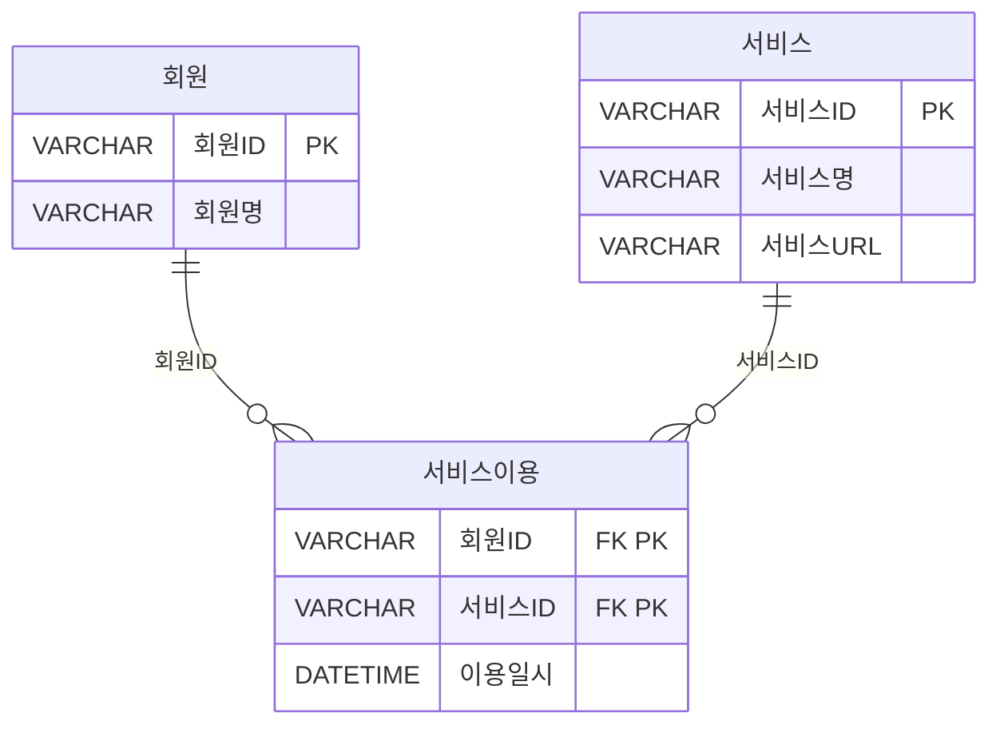
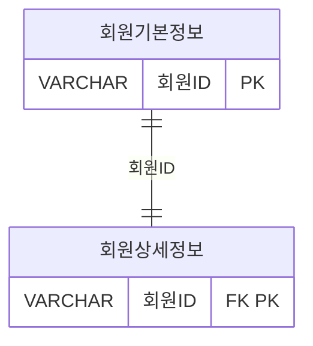

---

### 📁 SQL USING

| 구간   | 문제 번호 | 주제                                      | 난이도     |
|--------|------------|-------------------------------------------|------------|
| 1~15   | 065~079    | 관계 연산자, JOIN 실무, 집합 연산자       | ⭐⭐ 초~중급 |
| 16~30  | 080~094    | INTERSECT, EXCEPT, 계층형 질의            | ⭐⭐⭐ 중~고급 |
| 31~45  | 095~109    | 집합 연산자, JOIN 조건, 서브쿼리 활용     | ⭐⭐⭐ 고급    |
| 46~63  | 110~127    | 실무형 SQL 로직, 집계, 조건부 연산        | ⭐⭐⭐⭐ 실무형 |


#### ✅ 1~15번 ( 065~079 ): 관계 연산자, JOIN 실무, 집합 연산자  
- SELECT, JOIN, OUTER JOIN, 집합 연산자(EXCEPT, UNION 등)의 기본 구조를 익힙니다.  
- 복합키, 비선호 필터링, 카티시안 곱 등 실무에서 자주 쓰이는 SQL 로직을 다룹니다.

#### ✅ 16~30번 (  080~094 ): INTERSECT, EXCEPT, 계층형 질의  
- INTERSECT, MINUS, EXCEPT의 차이와 활용법을 비교합니다.  
- START WITH, CONNECT BY, ORDER SIBLINGS BY 등 계층형 질의 구문을 학습합니다.

#### ✅ 31~45번 (095~109  ): 집합 연산자, JOIN 조건, 서브쿼리 활용  
- UNION ALL, 집합 연산자 조합, 서브쿼리와 EXISTS 활용을 집중적으로 다룹니다.  
- JOIN 조건에 따른 결과 건수와 정렬 방식까지 실무 중심으로 분석합니다.

#### ✅ 46~63번 (110~127): 실무형 SQL 로직, 집계, 조건부 연산  
- 조건부 집계, 서브쿼리 필터링, 복잡한 JOIN 조합을 실무 사례로 학습합니다.  
- SQL 성능, 정렬 우선순위, 집계 함수 조합까지 고급 SQL 로직을 익힙니다.

 


---

### ✅080  

아래와 같은 데이터 모델에 대해 SQL을 수행 하였다. 다음 중 수행된 SQL과 동일한 결과를 도출하는 SQL은?



```sql
[수행 SQL]
SELECT A.서비스ID, B.서비스명, B.서비스URL
FROM (SELECT 서비스ID  FROM 서비스
        INTERSECT
        SELECT 서비스ID
        FROM 서비스이용) A.서비스 B
WHERE A.서비스ID = B.서비스ID;
```

**[보기]**
```sql
① SELECT B.서비스ID, A.서비스명, A.서비스URL
FROM 서비스 A , 서비스이용 B
WHERE A.서비스ID = B.서비스ID;

② SELECT X.서비스ID, X.서비스명, X.서비스URL
FROM 서비스 X
WHERE NOT EXISTS (
    SELECT 1
    FROM (SELECT 서비스ID  FROM 서비스
          MINUS
          SELECT 서비스ID  FROM 서비스이용) Y
    WHERE X. 서비스ID = Y. 서비스ID);

③ SELECT B.서비스ID, A.서비스명, A.서비스URL
FROM 서비스 A LEFT OUTER JOIN 서비스이용 B
ON (A.서비스ID = B.서비스ID)
WHERE B.서비스ID IS NULL
GROUP BY B.서비스ID, A.서비스명, A.서비스URL;

④ SELECT A.서비스ID, A.서비스명, A.서비스URL
FROM 서비스 A
WHERE 서비스ID IN (SELECT 서비스ID FROM 서비스이용
                MINUS
                SELECT 서비스ID  FROM 서비스);
```


**정답** : 2


---

### ✅081  
SET OPERATOR 중에서 수학의 교집합과 같은 기능을 하는 연산자로 가장 적절한 것은?
① UNION
② INTERSECT
③ MINUS
④ EXCEPT


**정답** : 2


---

### ✅082  
다음 중 아래의 EMP 테이블의 데이터를 참조하여 실행한 SQL의 결과로 가장 적절한 것은?

```sql
SELECT ENAME AAA, JOB AAB
FROM EMP
WHERE EMPNO = 7369
UNION ALL
SELECT ENAME BBA, JOB BBB
FROM EMP
WHERE EMPNO = 7566
ORDER BY 1, 2;
```

[ 테이블 1: EMP]
| EMPNO | ENAME  | JOB       | MGR  | HIREDATE   | SAL  | COMM | DEPTNO |
|-------|--------|-----------|------|------------|------|------|--------|
| 7369  | SMITH  | CLERK     | 7902 | 1980-12-17 | 800  |   | 20     |
| 7499  | ALLEN  | SALESMAN  | 7698 | 1981-02-20 | 1600 | 300  | 30     |
| 7521  | WARD   | SALESMAN  | 7698 | 1981-02-22 | 1250 | 500  | 30     |
| 7566  | JONES  | MANAGER   | 7839 | 1981-04-02 | 2975 |   | 20     |
| 7654  | MARTIN | SALESMAN  | 7698 | 1981-09-28 | 1250 | 1400 | 30     |
| 7698  | BLAKE  | MANAGER   | 7839 | 1981-05-01 | 2850 |   | 30     |
| 7782  | CLARK  | MANAGER   | 7839 | 1981-06-09 | 2450 |   | 10     |
| 7788  | SCOTT  | ANALYST   | 7566 | 1987-07-13 | 3000 |   | 20     |
| 7839  | KING   | PRESIDENT |   | 1981-11-17 | 5000 |   | 10     |
| 7844  | TURNER | SALESMAN  | 7698 | 1981-09-08 | 1500 | 0    | 30     |
| 7876  | ADAMS  | CLERK     | 7788 | 1987-07-13 | 1100 |   | 20     |
| 7900  | JAMES  | CLERK     | 7698 | 1981-12-03 | 950  |   | 30     |
| 7902  | FORD   | ANALYST   | 7566 | 1981-12-03 | 3000 |   | 20     |
| 7934  | MILLER | CLERK     | 7782 | 1982-01-23 | 1300 |   | 10     |

 

① 
| AAA | AAB     |
|--------|---------|
| SMITH  | CLERK   |
| JONES  | MANAGER |

 
②
| AAA | AAB     |
|--------|---------|
| JONES  | MANAGER |
| SMITH  | CLERK   |
 
③ 
| BBA | BBB     |
|--------|---------|
| SMITH  | CLERK   |
| JONES  | MANAGER |

 
④ 
| BBA | BBB     |
|--------|---------|
| JONES  | MANAGER |
| SMITH  | CLERK   |
 

**정답** : 2


---

### ✅083  
다음 중 아래 TBL1, TBL2 테이블에 대해 SQL을 수행한 결과인 것은?

[테이블 1: TBL1]
| COL1 | COL2 |
|------|------|
| AA   | A1   |
| AB   | A2   |

[테이블 2: TBL2]
| COL1 | COL2 |
|------|------|
| AA   | A1   |
| AB   | A2   |
| AC   | A3   |
| AD   | A4   |

```sql
[SQL]
SELECT COL1, COL2, COUNT(*) AS CNT
FROM (SELECT COL1, COL2 FROM TBL1
      UNION ALL
      SELECT COL1, COL2 FROM TBL2
      UNION
      SELECT COL1, COL2 FROM TBL1)
GROUP BY COL1, COL2;
```


①
| COL1 | COL2 | CNT |
|------|------|-----|
| AA   | A1   | 1   |
| AB   | A2   | 1   |
| AC   | A3   | 1   |
| AD   | A4   | 1   |

②
| COL1 | COL2 | CNT |
|------|------|-----|
| AA   | A1   | 2   |
| AB   | A2   | 2   |
| AC   | A3   | 1   |
| AD   | A4   | 1   |

③
| COL1 | COL2 | CNT |
|------|------|-----|
| AA   | A1   | 3   |
| AB   | A2   | 3   |
| AC   | A3   | 1   |
| AD   | A4   | 1   |

 ④
| COL1 | COL2 | CNT |
|------|------|-----|
| AA   | A1   | 3   |
| AB   | A2   | 3   |
| AC   | A3   | 2   |
| AD   | A4   | 2   |


**정답** : 3

```
✅ UNION vs UNION ALL 복습
UNION → 중복 제거
UNION ALL → 중복 유지

SQL 실행 순서 분석

1. `SELECT COL1, COL2 FROM TBL1`  
   → 2 rows: AA/A1, AB/A2

2. `UNION ALL` with TBL2  
   → 4 rows added: AA/A1, AB/A2, AC/A3, AD/A4  
   → 총 6 rows

3. `UNION` with TBL1  
   → TBL1 has AA/A1, AB/A2  
   → `UNION` removes duplicates  
   → AA/A1, AB/A2 already exist → no new rows added  
   → 총 여전히 6 rows
```


---

### ✅084  

다음 중 아래에서 테이블 T1, T2에 대한 가, 나 두 개의 쿼리 결과 조회되는 행의 수로 가장 적절한 것은?

[ 테이블 1: T1]
| A  | B  | C  |
|----|----|----|
| A3 | B2 | C3 |
| A1 | B1 | C1 |
| A2 | B1 | C2 |

[테이블 2: T2]
| A  | B  | C  |
|----|----|----|
| A1 | B1 | C1 |
| A3 | B2 | C3 |

```sql
가. SELECT A, B, C FROM R1
UNION ALL
SELECT A, B, C FROM R2

나. SELECT A, B, C FROM R1
UNION
SELECT A, B, C FROM R2
```
① 가: 5개, 나: 3개
② 가: 5개, 나: 5개
③ 가: 3개, 나: 3개
④ 가: 3개, 나: 5개


**정답** : 1


---

### ✅085  

다음 중 아래와 같은 집합이 존재 할 때, 집합 A와 B에 대하여 집합연산을
수행한 결과 집합 C가 되는 경우 이용되는 데이터베이스 집합연산은?

```sql
집합 A = {가, 나, 다, 라},
집합 B = {다, 라, 마, 바},
집합 C = {다, 라}
```

① Union
② Difference
③ Intersection
④ Product


**정답** : 3


---

### ✅086  

아래와 같은 데이터 모델에 대한 설명으로 가장 적절한 것은? (단, 시스템적으로 회원기본정보와 회원상세정보는 1:1, 양쪽 필수 관계임을 보장한다.)



① 회원ID 컬럼을 대상으로 (회원기본정보 EXCEPT 회원상세정보) 연산을
수행하면 회원상세정보가 등록되지 않은 회원ID가 추출된다.
② 회원ID 컬럼을 대상으로 (회원기본정보 UNION ALL 회원상세정보)
연산을 수행한 결과의 건수는 회원기본정보의 전체건수와 동일하다.
③ 회원ID 컬럼을 대상으로 (회원기본정보 INTERSECT 회원상세정보)
연산을 수행한 결과의 건수와 두 테이블을 회원ID로 JOIN 연산을 수행한
결과의 건수는 동일하다.
④ 회원ID 컬럼을 대상으로 (회원기본정보 INTERSECT 회원상세정보)
연산을 수행한 결과와 (회원기본정보 UNION 회원상세정보) 연산을
수행한 결과는 다르다.


**정답** : 3

---

### ✅087  

아래와 같은 데이터 상황에서 아래의 SQL을 수행할 경우 정렬 순서상 2번째 표시될 값을 적으시오.

[TAB1]
| C1 | C2 | C3 |
|----|----|----|
|  1 |    | A  |
|  2 |  1 | B  |
|  3 |  1 | C  |
|  4 |  2 | D  |


```sql
SELECT C3
FROM TAB1
START WITH C2 IS NULL
CONNECT BY PRIOR C1 = C2
ORDER SIBLINGS BY C3 DESC
```


**정답** : C


---
### ✅088  
다음 중 Oracle 계층형 질의에 대한 설명으로 가장 부적절한 것은?

① START WITH절은 계층 구조의 시작점을 지정하는 구문이다.
② ORDER SIBLINGS BY절은 형제 노드 사이에서 정렬을 지정하는 구문이다.
③ 순방향전개란 부모 노드로부터 자식 노드 방향으로 전개하는 것을 말한다.
④ 루트 노드의 LEVEL 값은 0이다.


**정답** : 4

---
### ✅089  

다음 중 아래와 같은 사원 테이블에 대해서 SQL을 수행하였을 때의 결과로 가장 적절한 것은? 

 
[테이블 : 사원]
| 사원번호 (PK) | 사원명 | 입사일자   | 매니저사원번호 (FK) |
|---------------|--------|------------|----------------------|
| 001           | 홍길동 | 2012-01-01 | NULL                 |
| 002           | 강감찬 | 2012-01-01 | 001                  |
| 003           | 이순신 | 2013-01-01 | 001                  |
| 004           | 이민정 | 2013-01-01 | 001                  |
| 005           | 이병헌 | 2013-01-01 | NULL                 |
| 006           | 안성기 | 2014-01-01 | 005                  |
| 007           | 이수근 | 2014-01-01 | 005                  |
| 008           | 김병만 | 2014-01-01 | 005                  |


```sql
[SQL]
SELECT 사원번호, 사원명, 입사일자, 매니저사원번호
FROM 사원
START WITH 매니저사원번호 IS NULL
CONNECT BY PRIOR 사원번호 = 매니저사원번호
AND 입사일자 BETWEEN '2013-01-01' AND '2013-12-31'
ORDER SIBLINGS BY 사원번호:
```
 
① 
| 사원번호 (PK) | 사원명 | 입사일자   | 매니저사원번호 (FK) |
|---------------|--------|------------|----------------------|
| 001           | 홍길동 | 2012-01-01 | NULL                 |
| 003           | 이순신 | 2013-01-01 | 001                  |
| 004           | 이민정 | 2013-01-01 | 001                  |
| 005           | 이병헌 | 2013-01-01 | NULL                 |

② 사원 테이블
| 사원번호 (PK) | 사원명 | 입사일자   | 매니저사원번호 (FK) |
|---------------|--------|------------|----------------------|
| 003           | 이순신 | 2013-01-01 | 001                  |
| 004           | 이민정 | 2013-01-01 | 001                  |
| 005           | 이병헌 | 2013-01-01 | NULL                 |

③ 사원 테이블
| 사원번호 (PK) | 사원명 | 입사일자   | 매니저사원번호 (FK) |
|---------------|--------|------------|----------------------|
| 001           | 홍길동 | 2012-01-01 | NULL                 |

④ 사원 테이블
| 사원번호 (PK) | 사원명 | 입사일자   | 매니저사원번호 (FK) |
|---------------|--------|------------|----------------------|
| 001           | 홍길동 | 2012-01-01 | NULL                 |
| 005           | 이병헌 | 2013-01-01 | NULL                 |
| 006           | 안성기 | 2014-01-01 | 005                  |
| 007           | 이수근 | 2014-01-01 | 005                  |
| 008           | 김병만 | 2014-01-01 | 005                  |
 

**정답** : 1

---

### ✅090  
다음 중 계층형 질의문에 대한 설명으로 가장 부적절한 것은?

① SQL Server에서의 계층형 질의문은 CTE(Common Table Expression)를 재귀 호출함으로써 계층 구조를 전개한다.
② SQL Server에서의 계층형 질의문은 앵커 멤버를 실행하여 기본 결과 집합을 만들고 이후 재귀 멤버를 지속적으로 실행한다.
③ 오라클의 계층형 질의문에서 WHERE 절은 모든 전개를 진행한 이후 필터 조건으로서 조건을 만족하는 데이터만을 추출하는데 활용된다.
④ 오라클의 계층형 질의문에서 PRIOR 키워드는 CONNECT BY 절에만 사용할 수 있으며 'PRIOR 자식 = 부모' 형태로 사용하면 순방향 전개로 수행 된다.


**정답** : 4

---

### ✅091  
아래 [부서]와 [매출] 테이블에 대해서 SQL 문장을 실행하여 아래 [결과]와 같이 데이터가 추출 되었다. 다음 중 동일한 결과를 추출하는 SQL 문장은?

[테이블 1: 부서]
| 부서코드(PK) | 부서명         | 상위부서코드 |
|----------|----------------|---------------|
| 100      | 아시아부       | NULL          |
| 110      | 한국지사       | 100           |
| 111      | 서울지점       | 110           |
| 112      | 부산지점       | 110           |
| 120      | 일본지사       | 100           |
| 121      | 도쿄지점       | 120           |
| 122      | 오사카지점     | 120           |
| 130      | 중국지사       | 100           |
| 131      | 베이징지점     | 130           |
| 132      | 상하이지점     | 130           |
| 200      | 남유럽지부         | NULL          |
| 210      | 스페인지사     | 200           |
| 211      | 마드리드지점       | 210           |
| 212      | 그라나다지점       | 210           |
| 220      | 포르투갈지사       | 200           |
| 221      | 리스본지점     | 220           |
| 222      | 포르투지점 | 220         |

[테이블 2: 매출]
| 부서코드 | 매출액 |
|----------|--------|
| 111      | 1000   |
| 112      | 2000   |
| 121      | 1500   |
| 122      | 1000   |
| 131      | 1500   |
| 132      | 2000   |
| 211      | 2000   |
| 212      | 1500   |
| 221      | 1000   |
| 222      | 2000   |

[테이블 3: 결과]
| 부서코드 | 부서명     | 상위부서코드 | 매출액 | LVL |
|----------|------------|---------------|--------|-----|
| 100      | 아시아지부   | NULL           | NULL   | 2   |
| 120      | 일본지사  | 100           | NULL   | 1   |
| 121      | 도쿄지점   | 120           | 1500   | 2   |
| 122      | 오사카지점 | 120           | 1000   | 2   |

 
```sql
① SELECT A.부서코드, A.부서명, A.상위부서코드, B.매출액, LVL
FROM (SELECT 부서코드, 부서명, 상위부서코드, LEVEL AS LVL 
        FROM 부서
        START WITH 부서코드 = '120'
        CONNECT BY PRIOR 상위부서코드 = 부서코드
        UNION
        SELECT 부서코드, 부서명, 상위부서코드, LEVEL AS LVL
        FROM 부서
        START WITH 부서코드 = '120'
        CONNECT BY 상위부서코드 = PRIOR 부서코드) A LEFT  OUTER JOIN 매출 B
ON (A.부서코드 = B.부서코드)
ORDER BY A.부서코드;

② SELECT A.부서코드, A.부서명, A.상위부서코드, B.매출액, LVL
        FROM (SELECT 부서코드, 부서명, 상위부서코드, LEVEL AS LVL
        FROM 부서
        START WITH 부서코드 = '100'
        CONNECT BY 상위부서코드 = PRIOR 부서코드) A LEFT  OUTER JOIN 매출 B
ON (A.부서코드 = B.부서코드)
ORDER BY A.부서코드;

③ SELECT A.부서코드, A.부서명, A.상위부서코드, B.매출액, LVL
FROM (SELECT 부서코드, 부서명, 상위부서코드, LEVEL AS LVL
    FROM 부서
    START WITH 부서코드 = '121'
    CONNECT BY PRIOR 상위부서코드 = 부서코드) A LEFT OUTER JOIN 매출 B
ON (A.부서코드 = B.부서코드)
ORDER BY A.부서코드;

④ SELECT A.부서코드, A.부서명, A.상위부서코드, B.매출액, LVL
FROM (SELECT 부서코드, 부서명, 상위부서코드, LEVEL AS LVL
        FROM 부서
        START WITH 부서코드 = (SELECT 부서코드
                                FROM 부서
                                WHERE 상위부서코드 IS NULL
                                START WITH 부서코드  = '120'
                                CONNECT BY PRIOR
                                상위부서코드 = 부서코드)
        CONNECT BY 상위부서코드 = PRIOR 부서코드) A LEFT
        OUTER JOIN 매출 B
ON (A.부서코드 = B.부서코드)
ORDER BY A.부서코드;
```

**정답** : 1


---

### ✅092  

다음 중 SELF JOIN을 수행해야 할 경우로 가장 적절한 것은?
① 한 테이블 내에서 두 칼럼이 연관 관계가 있다.
② 두 테이블에 연관된 칼럼은 없으나 JOIN을 해야 한다.
③ 두 테이블에 공통 칼럼이 존재하고 두 테이블이 연관 관계가 있다.
④ 한 테이블 내에서 연관된 칼럼은 없으나 JOIN을 해야 한다.


**정답** : 1

---

### ✅093  
아래와 같이 일자별매출 테이블이 존재할 때 아래 결과처럼 일자별 누적 매출액을 SQL로 구하려고 한다. WINDOW FUNCTION을 사용하지 않고 일자별 누적매출액을 구하는 SQL로 옳은 것은?

[테이블 1: 일자별매출]
| 일자         | 매출액 |
|--------------|--------|
| 2015.11.01   | 1000   |
| 2015.11.02   | 1000   |
| 2015.11.03   | 1000   |
| 2015.11.04   | 1000   |
| 2015.11.05   | 1000   |
| 2015.11.06   | 1000   |
| 2015.11.07   | 1000   |
| 2015.11.08   | 1000   |
| 2015.11.09   | 1000   |
| 2015.11.10   | 1000   |

[테이블 2: 일자별 누적매출액]
| 일자         | 누적매출액 |
|--------------|------------|
| 2015.11.01   | 1000       |
| 2015.11.02   | 2000       |
| 2015.11.03   | 3000       |
| 2015.11.04   | 4000       |
| 2015.11.05   | 5000       |
| 2015.11.06   | 6000       |
| 2015.11.07   | 7000       |
| 2015.11.08   | 8000       |
| 2015.11.09   | 9000       |
| 2015.11.10   | 10000      |
 
```sql
① SELECT A.일자, SUM(A.매출액) AS 누적매출액
FROM 일자별매출 A
GROUP BY A.일자
ORDER BY A.일자;

② SELECT B.일자, SUM(B.매출액) AS 누적매출액
FROM 일자별매출 A JOIN 일자별매출 B ON (A.일자 >= B.일자)
GROUP BY B, 일자
ORDER BY B.일자;

③ SELECT A.일자, SUM(B.매출액) AS 누적매출액
FROM 일자별매출 A JOIN 일자별매출 B ON (A.일자 >= B.일자)
GROUP BY A.일자
ORDER BY A.일자:

④ SELECT A.일자
, (SELECT SUM(B.매출액)
    FROM 일자별매출 B WHERE B.일자 >= A.일자) AS 누적매출액
FROM 일자별매출 A
GROUP BY A.일자
ORDER BY A.일자:
```

**정답** : 3


---

### ✅094  

다음 중 아래의 SQL 수행 결과로 가장 적절한 것은?
```
SELECT COUNT(DISTINCT A||B)
FROM EMP
WHERE D = (SELECT D FROM DEPT WHERE E = 'i'):
```

[테이블 1: EMP 테이블]
| A | B | C | D |
|---|---|---|---|
| 1 | a | 1 | x |
| 2 | a | 1 | x |
| 3 | b | 2 | y |

[ 테이블 2: DEPT 테이블]
| D | E | F |
|---|---|---|
| x | i | 5 |
| y | m | 6 |


① 0
② 1
③ 2  
④ 3 


**정답** : 3


