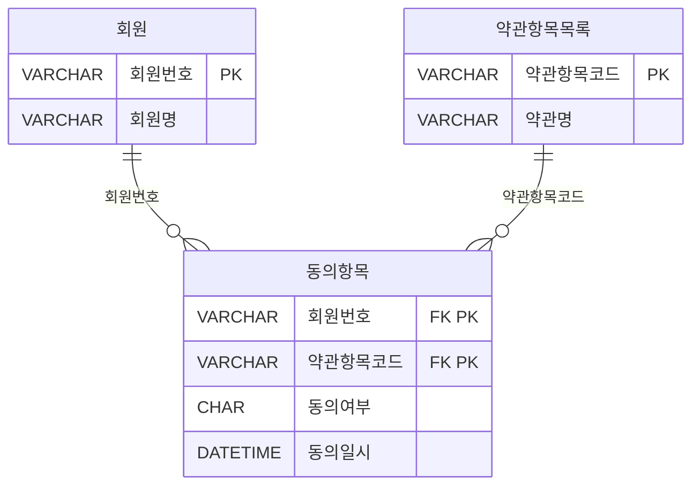
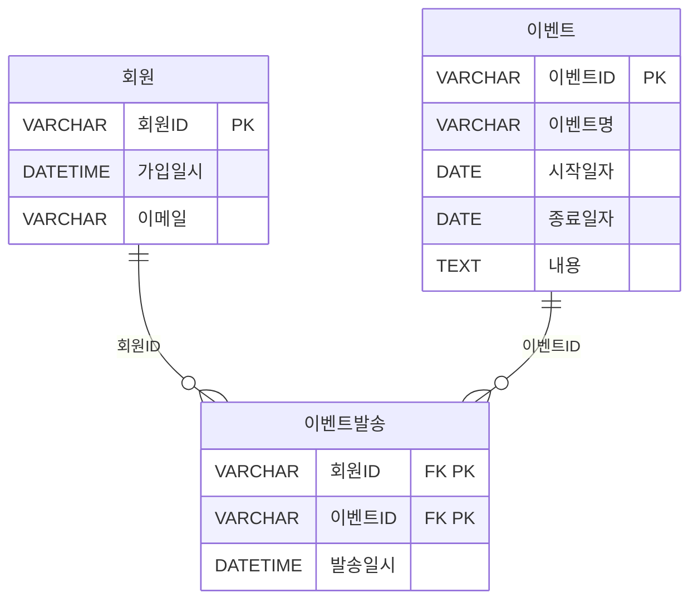
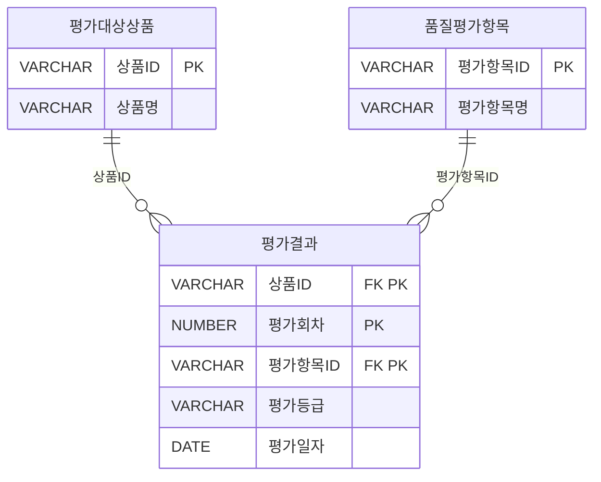
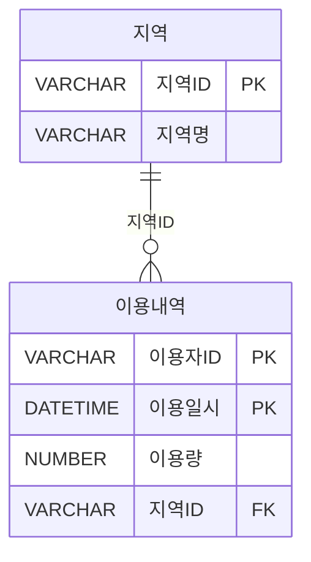

---

### 📁 SQL USING

| 구간   | 문제 번호 | 주제                                      | 난이도     |
|--------|------------|-------------------------------------------|------------|
| 1~15   | 065~079    | 관계 연산자, JOIN 실무, 집합 연산자       | ⭐⭐ 초~중급 |
| 16~30  | 080~094    | INTERSECT, EXCEPT, 계층형 질의            | ⭐⭐⭐ 중~고급 |
| 31~45  | 095~109    | 집합 연산자, JOIN 조건, 서브쿼리 활용     | ⭐⭐⭐ 고급    |
| 46~63  | 110~127    | 실무형 SQL 로직, 집계, 조건부 연산        | ⭐⭐⭐⭐ 실무형 |


#### ✅ 1~15번 ( 065~079 ): 관계 연산자, JOIN 실무, 집합 연산자  
- SELECT, JOIN, OUTER JOIN, 집합 연산자(EXCEPT, UNION 등)의 기본 구조를 익힙니다.  
- 복합키, 비선호 필터링, 카티시안 곱 등 실무에서 자주 쓰이는 SQL 로직을 다룹니다.

#### ✅ 16~30번 (  080~094 ): INTERSECT, EXCEPT, 계층형 질의  
- INTERSECT, MINUS, EXCEPT의 차이와 활용법을 비교합니다.  
- START WITH, CONNECT BY, ORDER SIBLINGS BY 등 계층형 질의 구문을 학습합니다.

#### ✅ 31~45번 (095~109  ): 집합 연산자, JOIN 조건, 서브쿼리 활용  
- UNION ALL, 집합 연산자 조합, 서브쿼리와 EXISTS 활용을 집중적으로 다룹니다.  
- JOIN 조건에 따른 결과 건수와 정렬 방식까지 실무 중심으로 분석합니다.

#### ✅ 46~63번 (110~127): 실무형 SQL 로직, 집계, 조건부 연산  
- 조건부 집계, 서브쿼리 필터링, 복잡한 JOIN 조합을 실무 사례로 학습합니다.  
- SQL 성능, 정렬 우선순위, 집계 함수 조합까지 고급 SQL 로직을 익힙니다.

 


---

### ✅095  

아래는 서브쿼리에 대한 설명이다. 다음 중 올바른 것끼리 묶인 것은?

```
가) 서브쿼리는 단일 행 (Single Row) 또는 복수행(Multi Row) 비교 연산자와 함께 사용할 수 있다.
나) 서브쿼리는 SELECT 정, FROM 절, HAVING 절, ORDER BY 절 등에서 사용이 가능하다.
다) 서브쿼리의 결과가 복수행(Multi Row) 결과를 반환하는 경우에는 '=','<=', '=>' 등의 연산자와 함께 사용이 가능하다.
라) 연관(Correlated) 서브쿼리는 서브쿼리가 메인쿼리 컬럼을 포함하고 있는 형태의 서브쿼리이다.
마) 다중 컬럼 서브쿼리는 서브쿼리의 결과로 여러 개의 컬럼이 반환되어 메인쿼리의 조건과 동시에 비교되는 것을 의미하며 Oracle 및 SQL Server 등의 DBMS에서 사용 할 수 있다.
```

① 나, 라, 마
② 가, 나, 라
③ 나, 다, 라
④ 가, 나, 마


**정답** : 2


---

### ✅096  

아래 테이블은 어느 회사의 사원들과 이들이 부양하는 가족에 대한 것으로 밑줄 친 칼럼은 기본키(Primary Key)를 표시한 것이다. 다음 중 '현재 부양하는 가족들이 없는 사원들의 이름을 구하라'는 질의에 대해 아래 SQL 문장의 (가) , (나) 들어 갈 내용으로 가장 적절한 것은?


[테이블]
사원 (<u>사번</u>, 이름, 나이)
가족 (<u>이름</u>, 나이, 부양사번)
※ 가족 테이블의 부양사번은 사원 테이블의 사번을 참조하는 외래키(Foreign Key)이다.

```sql
[SQL 문장]
SELECT 이름
FROM 사원
WHERE  (가) (SELECT * FROM 가족 WHERE  (나)  )
```
① (가): EXISTS      (나): 사번 = 부양사번
② (가): EXISTS      (나): 사번 <> 부양사번
③ (가): NOT EXISTS  (나): 사번 = 부양사번
④ (가): NOT EXISTS  (나): 사번 <> 부양사번

 
**정답** : 3 
  

---

### ✅097  

다음 중 아래의 ERD를 참조하여 아래 SQL과 동일한 결과를 출력하는 SQL로 가장 부적절한 것은?



```sql
[SQL]
SELECT A.회원번호, A.회원명
FROM 회원 A, 동의항목 B
WHERE A.회원번호 = B.회원번호
GROUP BY A.회원번호, A.회원명
HAVING COUNT(CASE WHEN B.동의여부 = 'N' THEN 0 ELSE NULL END) >= 1
ORDER BY A.회원번호:
```

**[보기]**
```sql
① SELECT A.회원번호, A.회원명
FROM 회원 A
WHERE EXISTS (SELECT 1 FROM 동의항목 B
              WHERE A.회원번호 = B.회원번호 AND B.동의여부 = 'N')
ORDER BY A.회원번호;

② SELECT A.회원번호, A.회원명
FROM 회원 A
WHERE A.회원번호 IN (SELECT B.회원번호 FROM 동의항목 B WHERE B.동의여부 = 'N')
ORDER BY A.회원번호:

③ SELECT A.회원번호, A.회원명
FROM 회원 A
WHERE 0 < (SELECT COUNT(*) FROM 동의항목 B WHERE B.동의여부 = 'N')
ORDER BY A.회원번호:

④ SELECT A.회원번호, A.회원명
FROM 회원 A, 동의항목 B
WHERE A.회원번호 = B.회원번호 AND B.동의여부 = 'N'
GROUP BY A.회원번호, A.회원명
ORDER BY A.회원번호:
```


**정답** : 3


---
### ✅098  

아래의 데이터 모델을 기준으로 SQL을 작성하였다. 다음 중 아래의 SQL에 대해 가장 바르게 설명한 것은?



```sql
[SQL]
SELECT A.회원ID, A.회원명, A.이메일
FROM 회원 A
```
```sql
(가)
WHERE EXISTS (SELECT 'X'
                FROM 이벤트 B.메일발송 C
                WHERE B.시작일자 >= '2014.10.01'
                AND B.이벤트ID = C.이벤트ID
```
```sql
(나)
                AND A.회원ID = C.회원ID
```
```sql
(다)
                HAVING COUNT(*) < (SELECT COUNT(*)
                                FROM 이벤트
                                WHERE 시작일자 >='2014.10.01'));
```

① 이벤트 시작일자가 '2014.10.01'과 같거나 큰 이벤트를 대상으로 이메일이 발송된 기록이 있는 모든 회원을 추출하는 SQL이다.
② (나)을 제거하고  (가)의 EXISTS 연산자를 IN연산자로 변경해도 결과는 동일하다.
③ (다)은 이벤트 시작일자가 '2014.10.01'과 같거나 큰 이벤트건수와 그 이벤트들을 기준으로 회원별 이메일 발송건수를 비교하는 것이다.
④ GROUP BY 및 집계함수를 사용하지 않고 HAVING절을 사용하였으므로 SQL이 실행되지 못하고 오류가 발생한다.


**정답** : 3

---

### ✅099  
다음 중 서브쿼리에 대한 설명으로 가장 적절한 것은?

① 단일 행 서브쿼리는 서브쿼리의 실행 결과가 항상 한 건 이하인 서브쿼리로서 IN, ALL 등의 비교 연산자를 사용하여야 한다.
② 다중 행 서브쿼리 비교 연산자는 단일 행 서브쿼리의 비교 연산자로도 사용할 수 있다.
③ 연관 서브쿼리는 주로 메인쿼리에 값을 제공하기 위한 목적으로 사용한다.
④ 서브 쿼리는 항상 메인쿼리에서 읽혀진 데이터에 대해 서브쿼리에서 해당 조건이 만족하는지를 확인하는 방식으로 수행된다.


**정답** : 2

---

### ✅100  
다음 중 아래 SQL에 대한 설명으로 가장 부적절한 것은?
```sql
[SQL]
SELECT B.사원번호, B.사원명, A.부서번호, A.부서명 
 , (SELECT COUNT(*) FROM 부양가족 Y WHERE Y.사원번호 = B.사원번호) AS 부양가족수
FROM 부서 A, (SELECT *
            FROM 사원
            WHERE 입사년도 = '2014') B
WHERE A.부서번호 = B.부서번호
AND EXISTS (SELECT 1 FROM 사원 X WHERE X. 부서번호 = A.부서번호);
```

① 위 SQL에는 다중 행 연관 서브쿼리, 단일 행 연관 서브쿼리, Inline View 가 사용되었다.
② SELECT절에 사용된 서브쿼리는 스칼라 서브쿼리라고도하며, 이러한 형태의 서브쿼리는 JOIN 으로 동일한 결과를 추출할 수도 있다.
③ WHERE 절의 서브쿼리에 사원 테이블 검색 조건으로 입사년도 조건을 FROM절의 서브쿼리와 동일하게 추가해야 원하는 결과를 추출할 수 있다.
④ FROM 절의 서브쿼리는 동적 뷰(Dynamic View)라고도 하며, SQL 문장 중 테이블 명이 올 수 있는 곳에서 사용할 수 있다.

**정답** : 3

---

### ✅101  

아래와 같은 데이터 모델에서 평가대상상품에 대한 품질평가항목별 최종 평가결과를 추출하는 SQL 문장으로 옳은 것은? (단, 평가항목에 대한 평가(평가등급)가 기대수준에 미치지 못할 경우 해당 평가항목에 대해서만 재평가를 수행한다)



**[보기]**
```sql
① SELECT B.상품ID, B.상품명, C.평가항목ID, C.평가항목명, 
         A.평가회차, A.평가등급, A.평가일자
FROM 평가결과 A, 평가대상상품 B, 품질평가항목 C,
      (SELECT MAX(평가회차) AS 평가회차 FROM 평가결과) D
WHERE A.상품ID = B.상품ID
AND   A.평가항목ID = C.평가항목ID
AND   A.평가회차 = D. 평가회차;

② SELECT B.상품ID, B.상품명, C.평가항목ID, C.평가항목명, 
      A.평가회차, A.평가등급, A.평가일자
FROM  평가결과 A, 평가대상상품 B, 품질평가항목 C
WHERE A.상품ID = B.상품ID
AND   A.평가항목ID = C.평가항목ID
AND   A.평가회차 = ( SELECT MAX(X.평가회차)
                    FROM 평가결과 X
                    WHERE X.상품ID = B.상품ID 
                    AND   X.평가항목ID = C.평가항목ID);

③ SELECT B.상품ID, B.상품명, C.평가항목ID, C.평가항목명
            ,MAX(A.평가회차) AS 평가회차
            ,MAX(A.평가등급) AS 평가등급
            ,MAX(A.평가일자) AS 평가일자
FROM   평가결과 A, 평가대상상품 B, 품질평가항목 C
WHERE  A.상품ID = B.상품ID
AND    A.평가항목ID = C.평가항목ID
GROUP BY  B.상품ID, B.상품명, C.평가항목ID, C.평가항목명;

④ SELECT B.상품ID, B.상품명, C.평가항목ID, C.평가항목명, A.평가회차,
         A.평가등급, A.평가일자
FROM (SELECT 상품ID, 평가항목ID
        ,MAX(평가회차) AS 평가회차
        ,MAX(평가등급) AS 평가등급
        ,MAX(평가일자) AS 평가일자
      FROM 평가결과
      GROUP BY 상품ID, 평가항목 ID) A, 평가대상상품 B, 품질평가항목 C
WHERE A.상품ID = B.상품ID
AND   A.평가항목ID = C.평가항목ID;
```

**정답** : 2


---

### ✅102  
아래 부서 테이블의 담당자 변경을 위해 부서임시 테이블에 입력된 데이터를 활용하여 주기적으로 부서 테이블을 아래 결과와 같이 반영하기 위한 SQL으로 가장 적절한 것은?(단, 부서임시 테이블에서 변경일자를 기준으로 가장 최근에 변경된 데이터를 기준으로 부서 테이블에 반영되어야 한다)

[테이블 1: 부서지]
| 부서코드(PK) | 부서명         | 상위부서코드 | 담당자   |
|--------------|----------------|---------------|----------|
| A001         | 대표이사       | NULL          | 김대표   |
| A002         | 영업본부        | A001       | 홍길동  |
| A003         | 경영지원본부     | A001          | 이순신   |
| A004         |  마케팅본부   | A001          | 강감찬  |
| A005         | 해외영업팀   | A002          | 이청용  |
| A006         | 국내영업팀    | A002          | 박지성   |
| A007         | 총무팀     | A003          | 차두리  |
| A008         | 인사팀     | A003          | 이민정   |
| A009         | 해외마케팅팀     | A004          | 이병헌   |
| A010         | 국내마케팅팀     | A004          | 차승원   |

[테이블 2: 부서임시]
| 변경일자     | 부서코드(PK) | 담당자 |
|--------------|--------------|--------|
| 2014.01.23   | A007         | 이달자 |
| 2015.01.25   | A007       | 홍경민 |
| 2015.01.25   | A008         | 유재석 |

[테이블 3: 결과]
| 부서코드(PK) | 부서명         | 상위부서코드 | 담당자   |
|--------------|----------------|---------------|----------|
| A001         | 대표이사       | NULL          | 김대표   |
| A002         | 영업본부        | A001       | 홍길동  |
| A003         | 경영지원본부     | A001          | 이순신   |
| A004         |  마케팅본부   | A001          | 강감찬  |
| A005         | 해외영업팀   | A002          | 이청용  |
| A006         | 국내영업팀    | A002          | 박지성   |
| A007         | 총무팀     | A003          | 홍경민  |
| A008         | 인사팀     | A003          | 유재석   |
| A009         | 해외마케팅팀     | A004          | 이병헌   |
| A010         | 국내마케팅팀     | A004          | 차승원   |

**[보기]**
```sql
① UPDATE 부서 A SET 담당자 = (SELECT C.부서코드
    FROM (SELECT 부서코드, MAX(변경일자) AS 변경일자
            FROM 부서임시
            GROUP BY 부서코드) B, 부서임시 C
    WHERE B.부서코드 = C.부서코드
    AND   B.변경일자 = C.변경일자
    AND   A.부서코드 = C.부서코드);

② UPDATE 부서 A SET 담당자 = (SELECT C.부서코드
    FROM (SELECT 부서코드, MAX(변경일자) AS 변경일자
            FROM 부서임시
            GROUP BY 부서코드) B, 부서임시 C
    WHERE B.부서코드 = C.부서코드
    AND B.변경일자 = C.변경일자
    AND A.부서코드 = C.부서코드)
  WHERE EXISTS (SELECT 1 FROM 부서 X WHERE A.부서코드 = X.부서코드);

③ UPDATE 부서 A SET 담당자 = (SELECT B.담당자
    FROM 부서임시 B
    WHERE B.부서코드 = A.부서코드
    AND B.변경일자 = (SELECT MAX(C.변경일자)
                    FROM 부서임시 C 
                    WHERE  C.부서코드 = B.부서코드))
 WHERE 부서코드 IN (SELECT 부서코드 FROM 부서임시);

④ UPDATE 부서 A SET 담당자 = (SELECT B.담당자
    FROM 부서임시 B
    WHERE B.부서코드 = A.부서코드
    AND B.변경일자 = '2015.01.25.');
```


**정답** : 3


---
### ✅103  
다음 중 뷰(View)에 대한 설명으로 가장 부적절한 것은?
① 뷰는 단지 정의만을 가지고 있으며, 실행 시점에 질의를 재작성하여 수행한다.
② 뷰는 복잡한 SQL 문장을 단순화 시켜주는 장점이 있는 반면, 테이블 구조가 변경되면 응용 프로그램을 변경해 주어야 한다.
③ 뷰는 보안을 강화하기 위한 목적으로도 활용할 수 있다.
④ 실제 데이터를 저장하고 있는 뷰를 생성하는 기능을 지원하는 DBMS도 있다.


**정답** : 2


---
### ✅104  
아래 테이블에 대한 [뷰 생성 스크립트]를 실행한 후, 조회 SQL의 실행결과로 맞는 것은?

 
[TBL]
| C1 | C2  |
|----|-----|
| A  | 100 |
| B  | 200 |
| B  | 100 |
| B  |   |
|    | 200 |

 
```sql
[뷰 생성 스크립트]
CREATE VIEW V_TBL
AS
SELECT *
FROM TBL
WHERE CI = 'B' OR C1 IS NULL

[조회 SQL]
SELECT SUM(C2) C2
FROM V TBL
WHERE C2 >= 200 AND C1 = 'B'
```

① 0 
② 200
③ 300 
④ 400


**정답** : 2


---

### ✅105  
다음 중 아래의 테이블에서 SQL을 실행할 때 결과로 가장 적절한 것은?

[테이블 : 서비스]

| 서비스ID(PK) | 서비스명 |
|--------------|-----------|
| 001          | 서비스1   |
| 002          | 서비스2   |
| 003          | 서비스3   |
| 004          | 서비스4   |


[테이블 : 서비스가입]
| 회원번호(PK) | 서비스ID(PK) | 가입일자    |
|--------------|---------------|-------------|
| 1            | 001           | 2013-01-01  |
| 1            | 002           | 2013-01-02  |
| 2            | 001           | 2013-01-01  |
| 2            | 002           | 2013-01-02  |
| 2            | 003           | 2013-01-03  |
| 3            | 001           | 2013-01-01  |
| 3            | 002           | 2013-01-02  |
| 3            | 003           | 2013-01-03  |

 
```sql
[SQL]
SELECT CASE WHEN GROUPING(A.서비스ID) = 0 
            THEN A.서비스ID
            ELSE '함게' END AS 서비스ID
      ,CASE WHEN GROUPING(B, 가입일자) = 0
            THEN NVL(B, 가입일자, '-') ELSE '소재' END AS 가입일자
      ,COUNT(B.회원번호) AS 가입건수
FROM 서비스 A LEFT OUTER JOIN 서비스가입 B
ON (    A.서비스ID = B.서비스ID
    AND B.가입일자 BETWEEN '2013-01-01' AND '2013-01-31')
GROUP BY ROLLUP (A.서비스ID, B.가입일자);
```

 

①
| 서비스ID | 가입일자 | 가입건수 |
|---|---|---|
| 001 | 2013-01-01 | 3 |
| 001 | 소계 | 3 |
| 002 | 2013-01-02 | 3 |
| 002 | 소계 | 3 |
| 003 | 2013-01-03 | 2 |
| 003 | 소계 | 2 |
| 합계 | 소계 | 8 |

②
| 서비스ID | 가입일자 | 가입건수 |
|---|---|---|
| 001 | 2013-01-01 | 3 |
| 002 | 2013-01-02 | 3 |
| 003 | 2013-01-03 | 2 |
| 합계 | 소계 | 8 |

③
| 서비스ID | 가입일자 | 가입건수 |
|---|---|---|
| 001 | 2013-01-01 | 3 |
| 001 | 소계 | 3 |
| 002 | 2013-01-02 | 3 |
| 002 | 소계 | 3 |
| 003 | 2013-01-03 | 2 |
| 003 | 소계 | 2 |
| 004 | - | 0 |
| 004 | 소계 | 0 |
| 합계 | 소계 | 8 |

④
| 서비스ID | 가입일자 | 가입건수 |
|---|---|---|
| 001 | 2013-01-01 | 3 |
| 002 | 2013-01-02 | 3 |
| 003 | 2013-01-03 | 2 |
| 004 | - | 0 |
| 합계 | 소계 | 8 |


**정답** : 3


---

### ✅106  

아래의 데이터 모델에서 SQL을 이용하여 표(지역별 월별 이용량)와 같은 형식의 데이터를 추출하려고 할 때 올바른 SQL 문장은?
 


[테이블 3: 지역별 월별 이용량]
| 지역명   | 이용월   | 이용량 |
|----------|----------|--------|
| 서울     | 2014.01  | 1,000  |
| 서울     | 2014.02  | 1,000  |
| 서울     | 월별합계 | 2,000  |
| 경기     | 2014.01  | 1,000  |
| 경기     | 2014.03  | 2,000  |
| 경기     | 월별합계 | 3,000  |
| 대전     | 2014.05  | 1,500  |
| 대전     | 2014.06  | 1,000  |
| 대전     | 월별합계 | 2,500  |
| 지역전체 | 월별합계 | 7,500  |

**[보기]**
```sql
① SELECT (CASE GROUPING(B.지역명) 
          WHEN 0 THEN '지역전체' 
          ELSE B.지역명 END) AS 지역명
        ,(CASE GROUPING(TO_CHAR(A.이용일시, 'YYYY.MM'))
          WHEN 0 THEN '월별합계'
          ELSE TO_CHAR(A.이용일시, 'YYYYMM) END) AS 이용월
        ,SUM(A.이용량) AS 이용량
FROM 이용내역 A INNER JOIN 지역 B ON (A.지역ID = B.지역ID)
GROUP BY ROLLUP(B.지역명, TO_CHAR(A.이용일시, 'YYYY.MM'))

② SELECT (CASE GROUPING(B.지역ID) 
         WHEN 1 THEN '지역전체'
         ELSE MIN(B.지역명) END) AS 지역명
       ,(CASE GROUPING(TO_CHAR(A, 이용일시, 'YYYY.MM'))
         WHEN 1 THEN '월별합계'
         ELSE TO_CHAR(A.이용일시, 'YYYY.MM') END) AS 이용월
       ,SUM(A.이용량) AS 이용량
FROM  이용내역 A INNER JOIN 지역 B ON (A.지역ID = B.지역ID)
GROUP BY ROLLUP(B.지역ID, TO_CHAR(A.이용일시, 'YYYY.MM'))

③ SELECT (CASE GROUPING(B.지역명) 
            WHEN THEN '지역전체'
            ELSE B.지역명 END) AS 지역명
         , (CASE GROUPING(TO_CHAR(A.이용일시, 'YYYY.MM'))
            WHEN 1 THEN '월별합계'
            ELSE TO_CHAR(A.이용일시, 'YYYY.MM') END) AS 이용월
         , SUM(A.이용량) AS 이용량
FROM 이용내역 A INNER JOIN 지역 B ON (A.지역ID = B.지역ID)
GROUP BY CUBE(B.지역명, TO_CHAR(A.이용일시, 'YYYY.MM'))

④ SELECT (CASE GROUPING(B.지역명) 
            WHEN THEN '지역전체'
            ELSE MIN(B.지역명) END) AS 지역명
        ,(CASE GROUPING(TO_CHAR(A.이용일시, 'YYYY.MM'))
            WHEN 1 THEN '월별합계'
            ELSE TO_CHAR(A.이용일시, 'YYYY.MM') END) AS 이용월
        ,SUM(A.이용량) AS 이용량
FROM 이용내역 A INNER JOIN 지역 B ON (A.지역ID = B.지역ID)
GROUP BY GROUPING SETS(B.지역ID, TO_CHAR(A.이용일시, 'YYYY.MM'))
```


**정답** : 2


---

### ✅107  
아래 결과를 얻기 위한 SQL문에서 [가]에 들어갈 함수를 작성하시오.

[테이블: 구매이력]
| 구매고객 | 구매월  | 총 구매건 | 총 구매액 |
|----------|---------|------------|------------|
| AAA      | 201001  | 1          | 1000       |
| AAA      | 201002  | 2          | 3000       |
| AAA      | 201003  | 1          | 2000       |
| AAA      |   	  | 4          | 5000       |
| BBB      | 201001  | 3          | 2000       |
| BBB      | 201002  | 5          | 3000       |
| BBB      | 201003  | 1          | 2000       |
| BBB      |    	  | 2          | 7000       |
| CCC      | 201101  | 1          | 5000       |
| CCC      | 201102  | 1          | 1000       |
| CCC      | 201103  | 1          | 8000       |
| CCC      |            | 3          | 8000       |
| 합계     |         | 16         | 20000      |

 
```sql
[SQL문]
SELECT 구매고객, 구매월, COUNT(*) '총 구매건', SUM(구매금액) '총 구매액'
FROM 구매이력
GROUP BY    [가] (구매고객, 구매월)
```

**정답** : ROLLUP


---

### ✅108  
다음 설명 중 가장 적절한 것은?

① 일반 그룹 함수를 사용하여 CUBE, GROUPING SETS와 같은 그룹함수와 동일한 결과를 추출할 수 있으나, ROLLUP 그룹 함수와 동일한 결과는 추출할 수 없다.
② GROUPING SETS 함수의 경우에는 함수의 인자로 주어진 컬럼의 순서에 따라 결과가 달라지므로 컬럼의 순서가 중요하다.
③ CUBE, ROLLUP, GROUPING SETS 함수들의 대상 컬럼 중 집계된 컬럼 이외의 대상 컬럼 값은 해당 컬럼의 데이터 중 가장 작은 값을 반환한다.
④ CUBE 그룹 함수는 인자로 주어진 컬럼의 결합 가능한 모든 조합에 대해서 집계를 수행하므로 다른 그룹 함수에 비해 시스템에 대한 부하가 크다.


**정답** : 4

---

### ✅109  

아래와 같이 설비와 에너지사용 테이블을 이용하여 결과를 나타내려할때 SQL으로 가장 적절한 것을 2개 고르시오.

[테이블 1: 설비]
| 설비ID | 설비명 |
|--------|--------|
| 1      | 설비1  |
| 2      | 설비2  |
| 3      | 설비3  |

[테이블 2: 에너지사용]
| 설비ID | 에너지코드 | 사용량 |
|--------|-------------|--------|
| 1      | 전기        | 100    |
| 1      | 용수        | 200    |
| 1      | 바람        | 300    |
| 2      | 전기        | 200    |
| 2      | 용수        | 200    |
| 3      | 전기        | 300    |

[테이블 3: 결과]
| 설비ID | 에너지코드 | 사용량합계 |
|--------|-------------|-------------|
| 1      | 바람        | 300         |
| 1      | 용수        | 200         |
| 1      | 전기        | 100         |
| 1      | NULL        | 600         |
| 2      | 용수        | 300         |
| 2      | 전기        | 200         |
| 2      | NULL        | 500         |
| 3      | 전기        | 300         |
| 3      | NULL        | 300         |
| NULL   | 바람        | 300         |
| NULL   | 용수        | 500         |
| NULL   | 전기        | 600        |
| NULL   | NULL        | 1400        |

 
**[보기]**
```sql
① SELECT A.설비ID, B.에너지코드, SUM(B.사용량) AS 사용량합계
    FROM 설비 A INNER JOIN 에너지사용량 B
    ON (A.설비ID = B.설비ID)
    GROUP BY CUBE ((A.설비ID), (B.에너지코드), (A.설비ID, B.에너지코드))
    ORDER BY A.설비ID, B, 에너지코드;

② SELECT A.설비ID, B.에너지코드, SUM(B.사용량) AS 사용량합계
    FROM 설비 A INNER JOIN 에너지사용량 B
    ON (A.설비ID = B.설비ID)
    GROUP BY CUBE (A.설비ID, B.에너지코드)
    ORDER BY A.설비ID, B.에너지코드;

③ SELECT A.설비ID, B.에너지코드, SUM(B.사용량) AS 사용량합계
    FROM 설비 A INNER JOIN 에너지사용량 B
    ON (A.설비ID = B.설비ID)
    GROUP BY GROUPING SETS((A.설비ID), (B.에너지코드),  (A.설비ID, B.에너지코드),())
    ORDER BY A.설비ID, B.에너지코드;

④ SELECT A.설비ID, B.에너지코드, SUM(B.사용량) AS 사용량합계
    FROM 설비 A INNER JOIN 에너지사용량 B
    ON (A.설비ID = B.설비ID)
    GROUP BY GROUPING SETS ((A.설비ID), (B.에너지코드), (A.설비ID, B.에너지코드))
    ORDER BY A.설비ID, B.에너지코드;
```


**정답** : 2,3

 