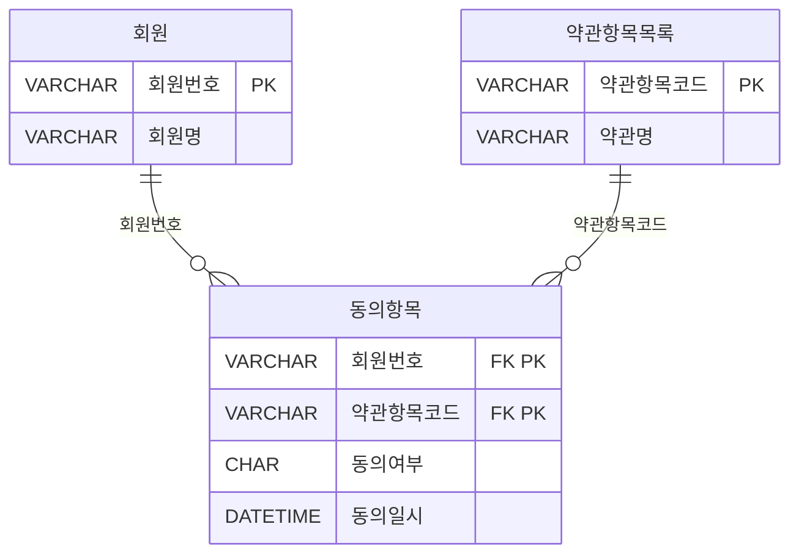
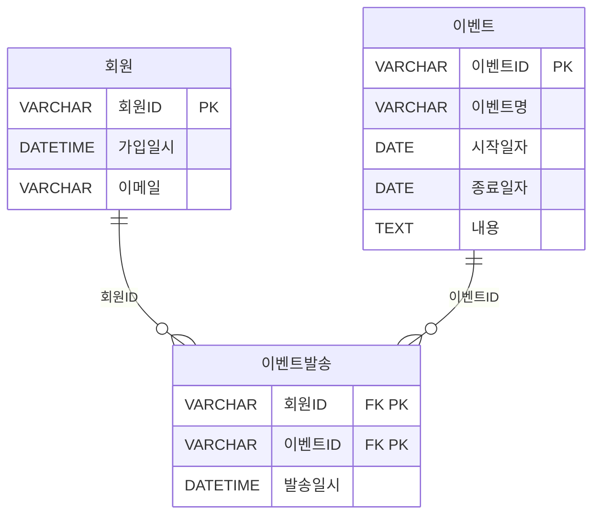
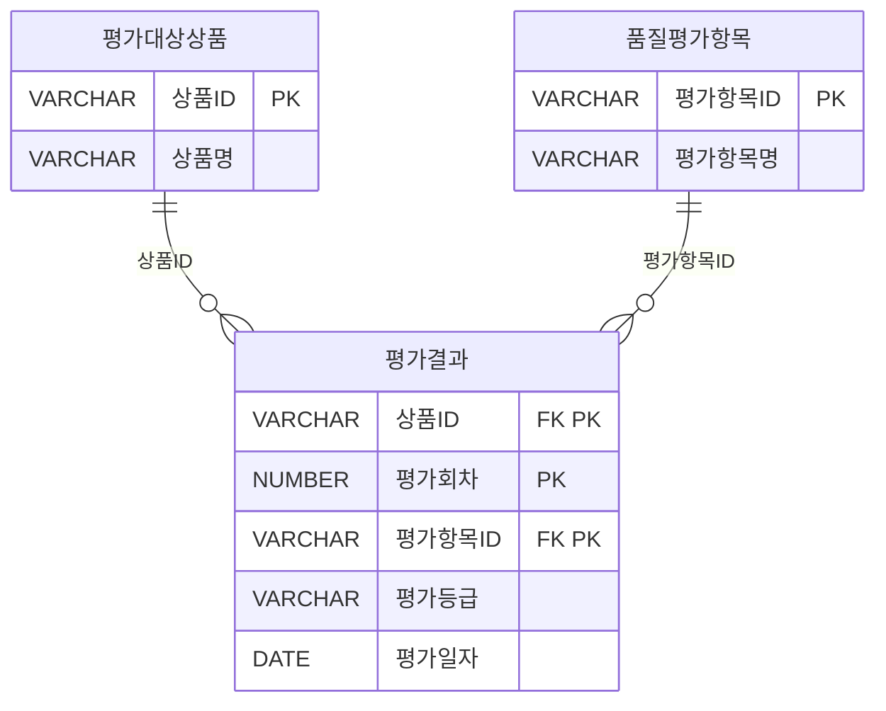
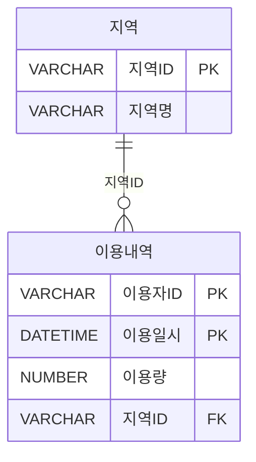

<style>
pre, code {
  white-space: pre-wrap !important;
  word-break: break-word !important;
  overflow-x: hidden !important;
  display: block !important;
  max-width: 100% !important;
  box-sizing: border-box !important;
}
</style> 

---

### 📁 SQL USING

| 구간   | 문제 번호 | 주제                                      | 난이도     |
|--------|------------|-------------------------------------------|------------|
| 1~15   | 065~079    | 관계 연산자, JOIN 실무, 집합 연산자       | ⭐⭐ 초~중급 |
| 16~30  | 080~094    | INTERSECT, EXCEPT, 계층형 질의            | ⭐⭐⭐ 중~고급 |
| 31~45  | 095~109    | 집합 연산자, JOIN 조건, 서브쿼리 활용     | ⭐⭐⭐ 고급    |
| 46~63  | 110~127    | 실무형 SQL 로직, 집계, 조건부 연산        | ⭐⭐⭐⭐ 실무형 |

#### ✅ 31~45번 (095~109): 집합 연산자, JOIN 조건, 서브쿼리 활용  
- UNION ALL, 집합 연산자 조합, 서브쿼리와 EXISTS 활용을 집중적으로 다룹니다.  
- JOIN 조건에 따른 결과 건수와 정렬 방식까지 실무 중심으로 분석합니다.


 


---

```bash
[문제 095]  
아래는 서브쿼리에 대한 설명이다. 다음 중 올바른 것끼리 묶인 것은?

 
가) 서브쿼리는 단일 행 (Single Row) 또는 복수행(Multi Row) 비교 연산자와 함께 사용할 수 있다.
나) 서브쿼리는 SELECT 정, FROM 절, HAVING 절, ORDER BY 절 등에서 사용이 가능하다.
다) 서브쿼리의 결과가 복수행(Multi Row) 결과를 반환하는 경우에는 '=','<=', '=>' 등의 연산자와 함께 사용이 가능하다.
라) 연관(Correlated) 서브쿼리는 서브쿼리가 메인쿼리 컬럼을 포함하고 있는 형태의 서브쿼리이다.
마) 다중 컬럼 서브쿼리는 서브쿼리의 결과로 여러 개의 컬럼이 반환되어 메인쿼리의 조건과 동시에 비교되는 것을 의미하며 Oracle 및 SQL Server 등의 DBMS에서 사용 할 수 있다.
```

① 나, 라, 마
② 가, 나, 라
③ 나, 다, 라
④ 가, 나, 마


**✅ 정답:** ② (가, 나, 라)

🧸 **쉬운 해설:**  
서브쿼리는 다양한 절에서 사용 가능하고, 연관 서브쿼리는 메인쿼리 컬럼을 참조해요!

📚 **전문 해설:**  
- 가: 단일/복수 행 모두 가능  
- 나: 다양한 절에서 사용 가능  
- 다: 복수 행에는 IN, EXISTS 등 사용해야 함  
- 라: 연관 서브쿼리 정의 정확  
- 마: 다중 컬럼 서브쿼리 가능

| 보기 번호 | 설명 | 적절성 |
|-----------|-------------------------------|--------|
| ① | 일부 누락 | ❌ |
| ② | 정확한 조합 | ✅ |
| ③ | 다 조건 오류 | ❌ |
| ④ | 다 조건 오류 | ❌ |

🧠 **기억법:**  
연관 서브쿼리 = 메인쿼리 컬럼 참조

🃏 관련 암기카드  
- 🃏 카드 26: 서브쿼리 = 쿼리 속 쿼리  
- 🃏 카드 45: 상관 서브쿼리 = 외부 컬럼 참조


---
```bash
[문제 096]  
아래 테이블은 어느 회사의 사원들과 이들이 부양하는 가족에 대한 것으로 밑줄 친 칼럼은 기본키(Primary Key)를 표시한 것이다. 다음 중 '현재 부양하는 가족들이 없는 사원들의 이름을 구하라'는 질의에 대해 아래 SQL 문장의 (가) , (나) 들어 갈 내용으로 가장 적절한 것은?
```

[테이블]
사원 (<u>사번</u>, 이름, 나이)
가족 (<u>이름</u>, 나이, 부양사번)
※ 가족 테이블의 부양사번은 사원 테이블의 사번을 참조하는 외래키(Foreign Key)이다.

```sql
[SQL 문장]
SELECT 이름
FROM 사원
WHERE  (가) (SELECT * FROM 가족 WHERE  (나)  )
```
① (가): EXISTS      (나): 사번 = 부양사번
② (가): EXISTS      (나): 사번 <> 부양사번
③ (가): NOT EXISTS  (나): 사번 = 부양사번
④ (가): NOT EXISTS  (나): 사번 <> 부양사번

**✅ 정답:** ③  
(가): NOT EXISTS  
(나): 사번 = 부양사번

🧸 **쉬운 해설:**  
가족 테이블에 사번이 없으면 → 가족이 없는 사원이죠!

📚 **전문 해설:**  
- NOT EXISTS: 조건 만족하는 행이 없을 때 TRUE  
- 사번 = 부양사번 → 가족이 있는 사원  
- NOT EXISTS → 가족이 없는 사원

| 보기 번호 | 설명 | 적절성 |
|-----------|-------------------------------|--------|
| ① | 가족이 있는 사원 | ❌ |
| ② | 조건 반대 | ❌ |
| ③ | 정확한 조건 | ✅ |
| ④ | 조건 반대 | ❌ |

🧠 **기억법:**  
NOT EXISTS = 존재하지 않음

🃏 관련 암기카드  
- 🃏 카드 28: EXISTS = 존재 확인  
- 🃏 카드 45: 상관 서브쿼리

---
```bash
[문제 097]  
다음 중 아래의 ERD를 참조하여 아래 SQL과 동일한 결과를 출력하는 SQL로 가장 부적절한 것은?
```


```sql
[SQL]
SELECT A.회원번호, A.회원명
FROM 회원 A, 동의항목 B
WHERE A.회원번호 = B.회원번호
GROUP BY A.회원번호, A.회원명
HAVING COUNT(CASE WHEN B.동의여부 = 'N' THEN 0 ELSE NULL END) >= 1
ORDER BY A.회원번호:
```

**[보기]**
```sql
① SELECT A.회원번호, A.회원명
FROM 회원 A
WHERE EXISTS (SELECT 1 FROM 동의항목 B
              WHERE A.회원번호 = B.회원번호 AND B.동의여부 = 'N')
ORDER BY A.회원번호;

② SELECT A.회원번호, A.회원명
FROM 회원 A
WHERE A.회원번호 IN (SELECT B.회원번호 FROM 동의항목 B WHERE B.동의여부 = 'N')
ORDER BY A.회원번호:

③ SELECT A.회원번호, A.회원명
FROM 회원 A
WHERE 0 < (SELECT COUNT(*) FROM 동의항목 B WHERE B.동의여부 = 'N')
ORDER BY A.회원번호:

④ SELECT A.회원번호, A.회원명
FROM 회원 A, 동의항목 B
WHERE A.회원번호 = B.회원번호 AND B.동의여부 = 'N'
GROUP BY A.회원번호, A.회원명
ORDER BY A.회원번호:
```


**✅ 정답:** ③

🧸 **쉬운 해설:**  
③은 모든 회원에게 COUNT(*)를 하므로 조건이 무시돼요!

📚 **전문 해설:**  
- HAVING COUNT(CASE WHEN 동의여부 = 'N' THEN 0 ELSE NULL END) ≥ 1  
→ 'N' 동의한 회원만 추출  
- ③은 조건 없이 COUNT만 하므로 모든 회원 포함됨


###### 🎯 원래 SQL

```sql
SELECT A.회원번호, A.회원명
FROM 회원 A, 동의항목 B
WHERE A.회원번호 = B.회원번호
GROUP BY A.회원번호, A.회원명
HAVING COUNT(CASE WHEN B.동의여부 = 'N' THEN 0 ELSE NULL END) >= 1
ORDER BY A.회원번호;
```

###### 🧠 처리 순서 설명

###### 1️⃣ **FROM 회원 A, 동의항목 B**
- 두 테이블을 조인합니다.
- 조인 조건은 나중에 WHERE에서 적용됨.

###### 2️⃣ **WHERE A.회원번호 = B.회원번호**
- 회원과 동의항목을 회원번호 기준으로 연결합니다.

###### 3️⃣ **GROUP BY A.회원번호, A.회원명**
- 회원별로 그룹화합니다.

###### 4️⃣ **HAVING COUNT(CASE WHEN B.동의여부 = 'N' THEN 0 ELSE NULL END) >= 1**
- 동의여부가 'N'인 항목이 **1개 이상 있는 회원만** 필터링합니다.
- CASE문은 'N'일 때 0을 반환 → COUNT는 0을 셈 → 조건 만족

###### 5️⃣ **SELECT A.회원번호, A.회원명**
- 조건을 만족한 회원만 출력

###### 6️⃣ **ORDER BY A.회원번호**
- 회원번호 기준으로 정렬


###### ❌ 보기 ③ SQL (부적절)

```sql
SELECT A.회원번호, A.회원명
FROM 회원 A
WHERE 0 < (SELECT COUNT(*) FROM 동의항목 B WHERE B.동의여부 = 'N')
ORDER BY A.회원번호;
```

###### 🧠 처리 순서 설명

###### 1️⃣ **FROM 회원 A**
- 회원 테이블 전체를 대상으로 시작

###### 2️⃣ **WHERE 0 < (SELECT COUNT(*) FROM 동의항목 B WHERE B.동의여부 = 'N')**
- **모든 회원에 대해 동일한 서브쿼리**를 실행
- 서브쿼리는 **전체 동의항목 테이블**에서 'N'인 항목 개수를 셈
- 즉, 조건은 **회원 A와 아무 관련 없이** 항상 참이 될 수 있음

###### 3️⃣ **SELECT A.회원번호, A.회원명**
- 모든 회원이 조건을 만족하면 전체 회원 출력됨

###### 4️⃣ **ORDER BY A.회원번호**
- 회원번호 기준 정렬

###### ⚠️ 왜 부적절한가?

- 서브쿼리가 **회원별로 필터링되지 않음**
- 조건이 **전체 동의항목 테이블**에 대해 적용되므로
  - 'N'이 하나라도 있으면 → 모든 회원이 출력됨
- 즉, **회원별로 'N' 동의 여부를 확인하지 않음**


| 보기 번호 | 설명 | 적절성 |
|-----------|-------------------------------|--------|
| ① | EXISTS 조건 정확 | ✅ |
| ② | IN 조건 정확 | ✅ |
| ③ | 조건 누락 | ❌ |
| ④ | JOIN + GROUP BY 정확 | ✅ |

🧠 **기억법:**  
CASE + COUNT → 조건 기반 집계

🃏 관련 암기카드  
- 🃏 카드 25: HAVING = 그룹 필터  
- 🃏 카드 26: 서브쿼리


---
```bash
[문제 098] 
아래의 데이터 모델을 기준으로 SQL을 작성하였다. 다음 중 아래의 SQL에 대해 가장 바르게 설명한 것은?
```


```sql
[SQL]
SELECT A.회원ID, A.회원명, A.이메일
FROM 회원 A
```
```sql
(가)
WHERE EXISTS (SELECT 'X'
                FROM 이벤트 B.메일발송 C
                WHERE B.시작일자 >= '2014.10.01'
                AND B.이벤트ID = C.이벤트ID
```
```sql
(나)
                AND A.회원ID = C.회원ID
```
```sql
(다)
                HAVING COUNT(*) < (SELECT COUNT(*)
                                FROM 이벤트
                                WHERE 시작일자 >='2014.10.01'));
```
```
① 이벤트 시작일자가 '2014.10.01'과 같거나 큰 이벤트를 대상으로 이메일이 발송된 기록이 있는 모든 회원을 추출하는 SQL이다.
② (나)을 제거하고  (가)의 EXISTS 연산자를 IN연산자로 변경해도 결과는 동일하다.
③ (다)은 이벤트 시작일자가 '2014.10.01'과 같거나 큰 이벤트건수와 그 이벤트들을 기준으로 회원별 이메일 발송건수를 비교하는 것이다.
④ GROUP BY 및 집계함수를 사용하지 않고 HAVING절을 사용하였으므로 SQL이 실행되지 못하고 오류가 발생한다.
```

**✅ 정답:** ③

🧸 **쉬운 해설:**  
HAVING절은 이벤트 건수와 발송 건수를 비교하는 용도예요!

📚 **전문 해설:**  
- 이벤트 시작일자 조건으로 이벤트 필터링  
- 회원별 발송 건수 < 전체 이벤트 건수 → 미발송 이벤트 존재  
- HAVING COUNT(*) < (SELECT COUNT(*) FROM 이벤트 ...)


###### ✅ 전체 SQL 구조

```sql
SELECT A.회원ID, A.회원명, A.이메일
FROM 회원 A
WHERE EXISTS (
  SELECT 'X'
  FROM 이벤트 B, 메일발송 C
  WHERE B.시작일자 >= '2014.10.01'
    AND B.이벤트ID = C.이벤트ID
    AND A.회원ID = C.회원ID
  HAVING COUNT(*) < (
    SELECT COUNT(*)
    FROM 이벤트
    WHERE 시작일자 >= '2014.10.01'
  )
);
```

###### 🧠 SQL 처리 순서 설명

###### 1️⃣ **FROM 회원 A**
- 회원 테이블을 기준으로 시작합니다.
- 모든 회원을 대상으로 조건을 평가합니다.

###### 2️⃣ **WHERE EXISTS (...)**
- 각 회원에 대해 서브쿼리를 실행하여 조건을 만족하는지 확인합니다.
- EXISTS는 **서브쿼리 결과가 존재하면 TRUE**를 반환합니다.

###### 3️⃣ 서브쿼리 **FROM 이벤트 B, 메일발송 C**
- 이벤트와 메일발송 테이블을 조인합니다.
- 조인 조건은 나중에 WHERE에서 적용됩니다.

###### 4️⃣ **WHERE B.시작일자 >= '2014.10.01'**
- 이벤트 중 시작일자가 2014년 10월 1일 이후인 것만 선택합니다.

###### 5️⃣ **AND B.이벤트ID = C.이벤트ID**
- 이벤트와 메일발송을 이벤트ID 기준으로 연결합니다.

###### 6️⃣ **AND A.회원ID = C.회원ID**
- 현재 회원이 해당 이벤트에 대해 메일을 받은 기록이 있는지 확인합니다.

###### 7️⃣ **HAVING COUNT(*) < (...)**
- 조인된 결과에서 **회원별 발송 건수**를 셉니다.
- 그 수가 전체 이벤트 건수보다 작으면 → 해당 회원은 **모든 이벤트에 대해 메일을 받지 않은 것**으로 판단

###### 8️⃣ 서브쿼리 내부 **SELECT COUNT(*) FROM 이벤트 WHERE 시작일자 >= '2014.10.01'**
- 전체 이벤트 중 시작일자가 조건을 만족하는 이벤트의 총 개수를 구합니다.
- 예: 조건에 맞는 이벤트가 5개라면, 회원이 3개만 받았으면 → 조건 만족


### 9️⃣ **SELECT A.회원ID, A.회원명, A.이메일**
- 조건을 만족한 회원만 출력합니다.

###### ✅ 최종 의미

- 이벤트 시작일자가 2014.10.01 이후인 이벤트가 N개 있다고 할 때,
- 특정 회원이 그 중 일부만 메일을 받았다면 → 그 회원은 결과에 포함됨
- 즉, **모든 이벤트에 대해 메일을 받지 않은 회원을 찾는 쿼리**

###### 📌 핵심 요약

| 처리 단계 | 설명 |
|-----------|------|
| **회원 A** | 기준 테이블 |
| **EXISTS** | 회원별로 조건 만족 여부 확인 |
| **JOIN 이벤트 + 메일발송** | 이벤트ID 기준 연결 |
| **WHERE 시작일자 ≥ 2014.10.01** | 이벤트 필터링 |
| **HAVING COUNT(*) < 전체 이벤트 수** | 회원별 발송 건수 비교 |
| **SELECT 회원정보** | 조건 만족 회원 출력 |


| 보기 번호 | 설명 | 적절성 |
|-----------|-------------------------------|--------|
| ① | 모든 회원 추출 아님 | ❌ |
| ② | EXISTS → IN 변경 시 결과 달라짐 | ❌ |
| ③ | 정확한 비교 설명 | ✅ |
| ④ | HAVING은 집계 후 필터링 가능 | ❌ |

🧠 **기억법:**  
HAVING = 집계 후 조건 비교

🃏 관련 암기카드  
- 🃏 카드 25: HAVING = 그룹 필터  
- 🃏 카드 42: 서브쿼리 유형
 


---
```bash
[문제 099]  
다음 중 서브쿼리에 대한 설명으로 가장 적절한 것은?

① 단일 행 서브쿼리는 서브쿼리의 실행 결과가 항상 한 건 이하인 서브쿼리로서 IN, ALL 등의 비교 연산자를 사용하여야 한다.
② 다중 행 서브쿼리 비교 연산자는 단일 행 서브쿼리의 비교 연산자로도 사용할 수 있다.
③ 연관 서브쿼리는 주로 메인쿼리에 값을 제공하기 위한 목적으로 사용한다.
④ 서브 쿼리는 항상 메인쿼리에서 읽혀진 데이터에 대해 서브쿼리에서 해당 조건이 만족하는지를 확인하는 방식으로 수행된다.
```
**✅ 정답:** ②

🧸 **쉬운 해설:**  
다중 행 비교 연산자(IN, ANY 등)는 단일 행에도 쓸 수 있어요!

📚 **전문 해설:**  
- 단일 행 서브쿼리: =, <, > 등 사용  
- 다중 행 서브쿼리: IN, ANY, ALL 등 사용  
- 일부 연산자는 단일/다중 모두 사용 가능

| 보기 번호 | 설명 | 적절성 |
|-----------|-------------------------------|--------|
| ① | 단일 행에 IN은 부적절 | ❌ |
| ② | 다중 연산자 일부는 단일에도 사용 가능 | ✅ |
| ③ | 연관 서브쿼리는 조건 필터링 목적 | ❌ |
| ④ | 항상 조건 확인은 아님 | ❌ |

🧠 **기억법:**  
IN, ANY, ALL → 다중 행  
=, <, > → 단일 행

🃏 관련 암기카드  
- 🃏 카드 26: 서브쿼리  
- 🃏 카드 45: 상관 서브쿼리

---
```bash
[문제 100]  
다음 중 아래 SQL에 대한 설명으로 가장 부적절한 것은?
```
```sql
[SQL]
SELECT B.사원번호, B.사원명, A.부서번호, A.부서명 
 , (SELECT COUNT(*) FROM 부양가족 Y WHERE Y.사원번호 = B.사원번호) AS 부양가족수
FROM 부서 A, (SELECT *
            FROM 사원
            WHERE 입사년도 = '2014') B
WHERE A.부서번호 = B.부서번호
AND EXISTS (SELECT 1 FROM 사원 X WHERE X. 부서번호 = A.부서번호);
```
```
① 위 SQL에는 다중 행 연관 서브쿼리, 단일 행 연관 서브쿼리, Inline View 가 사용되었다.
② SELECT절에 사용된 서브쿼리는 스칼라 서브쿼리라고도하며, 이러한 형태의 서브쿼리는 JOIN 으로 동일한 결과를 추출할 수도 있다.
③ WHERE 절의 서브쿼리에 사원 테이블 검색 조건으로 입사년도 조건을 FROM절의 서브쿼리와 동일하게 추가해야 원하는 결과를 추출할 수 있다.
④ FROM 절의 서브쿼리는 동적 뷰(Dynamic View)라고도 하며, SQL 문장 중 테이블 명이 올 수 있는 곳에서 사용할 수 있다.
```

**✅ 정답:** ③

🧸 **쉬운 해설:**  
WHERE절의 서브쿼리에 입사년도 조건을 추가할 필요는 없어요!

📚 **전문 해설:**  
- FROM절의 서브쿼리: Inline View  
- SELECT절의 서브쿼리: 스칼라 서브쿼리  
- EXISTS는 부서 존재 여부만 확인 → 입사년도 조건 불필요


###### ✅ 전체 SQL

```sql
SELECT B.사원번호, B.사원명, A.부서번호, A.부서명,
       (SELECT COUNT(*) FROM 부양가족 Y WHERE Y.사원번호 = B.사원번호) AS 부양가족수
FROM 부서 A,
     (SELECT * FROM 사원 WHERE 입사년도 = '2014') B
WHERE A.부서번호 = B.부서번호
  AND EXISTS (SELECT 1 FROM 사원 X WHERE X.부서번호 = A.부서번호);
```

###### 🧠 SQL 처리 순서 설명

###### 1️⃣ 서브쿼리: **SELECT * FROM 사원 WHERE 입사년도 = '2014'**

- 사원 테이블에서 입사년도 = '2014'인 사원만 추출
- 이 결과는 B라는 이름으로 FROM절에 사용됨 → **Inline View**

###### 2️⃣ **FROM 부서 A, (...) B**

- 부서 테이블 A와 서브쿼리 결과 B를 조인
- 조인 조건은 WHERE절에서 적용됨

###### 3️⃣ **WHERE A.부서번호 = B.부서번호**

- 부서번호를 기준으로 부서와 사원을 연결
- 즉, 입사년도 2014인 사원과 그 사원이 속한 부서 정보가 연결됨

###### 4️⃣ **AND EXISTS (...)**

```sql
EXISTS (SELECT 1 FROM 사원 X WHERE X.부서번호 = A.부서번호)
```

- 해당 부서에 사원이 하나라도 존재하는지 확인
- 조건이 참이면 해당 부서-사원 조합은 결과에 포함됨
- 이때 사원 X는 전체 사원 테이블을 대상으로 하며, 입사년도 조건은 없음
- ✅ 입사년도 조건은 이미 B에서 필터링했기 때문에 여기서 다시 넣을 필요 

###### 5️⃣ SELECT절의 스칼라 서브쿼리

```sql
(SELECT COUNT(*) FROM 부양가족 Y WHERE Y.사원번호 = B.사원번호)
```

- 각 사원에 대해 부양가족 테이블에서 해당 사원번호를 가진 가족 수를 계산
- 결과는 부양가족수 컬럼으로 출력됨
- ✅ 이건 **스칼라 서브쿼리**: 한 행당 하나의 값을 반환

###### 📌 핵심 요약

| 처리 단계 | 설명 |
|-----------|------|
| FROM절 서브쿼리 | 입사년도 2014인 사원만 추출 (Inline View) |
| JOIN | 부서와 사원 연결 |
| EXISTS | 해당 부서에 사원이 존재하는지만 확인 (입사년도 조건 불필요) |
| SELECT 스칼라 서브쿼리 | 사원별 부양가족 수 계산 |
| 최종 출력 | 사원 + 부서 + 가족 수 |

 

| 보기 번호 | 설명 | 적절성 |
|-----------|-------------------------------|--------|
| ① | 서브쿼리 유형 정확 | ✅ |
| ② | JOIN으로 대체 가능 | ✅ |
| ③ | 조건 추가 불필요 | ❌ |
| ④ | 동적 뷰 설명 정확 | ✅ |

🧠 **기억법:**  
EXISTS는 존재 여부만 확인

🃏 관련 암기카드  
- 🃏 카드 26: 서브쿼리  
- 🃏 카드 27: 스칼라 서브쿼리  
- 🃏 카드 45: 상관 서브쿼리


---

```bash
[문제 101]  
아래와 같은 데이터 모델에서 평가대상상품에 대한 품질평가항목별 최종 평가결과를 추출하는 SQL 문장으로 옳은 것은? (단, 평가항목에 대한 평가(평가등급)가 기대수준에 미치지 못할 경우 해당 평가항목에 대해서만 재평가를 수행한다)
```

 
```sql
① SELECT B.상품ID, B.상품명, C.평가항목ID, C.평가항목명, 
         A.평가회차, A.평가등급, A.평가일자
FROM 평가결과 A, 평가대상상품 B, 품질평가항목 C,
      (SELECT MAX(평가회차) AS 평가회차 FROM 평가결과) D
WHERE A.상품ID = B.상품ID
AND   A.평가항목ID = C.평가항목ID
AND   A.평가회차 = D. 평가회차;

② SELECT B.상품ID, B.상품명, C.평가항목ID, C.평가항목명, 
      A.평가회차, A.평가등급, A.평가일자
FROM  평가결과 A, 평가대상상품 B, 품질평가항목 C
WHERE A.상품ID = B.상품ID
AND   A.평가항목ID = C.평가항목ID
AND   A.평가회차 = ( SELECT MAX(X.평가회차)
                    FROM 평가결과 X
                    WHERE X.상품ID = B.상품ID 
                    AND   X.평가항목ID = C.평가항목ID);

③ SELECT B.상품ID, B.상품명, C.평가항목ID, C.평가항목명
            ,MAX(A.평가회차) AS 평가회차
            ,MAX(A.평가등급) AS 평가등급
            ,MAX(A.평가일자) AS 평가일자
FROM   평가결과 A, 평가대상상품 B, 품질평가항목 C
WHERE  A.상품ID = B.상품ID
AND    A.평가항목ID = C.평가항목ID
GROUP BY  B.상품ID, B.상품명, C.평가항목ID, C.평가항목명;

④ SELECT B.상품ID, B.상품명, C.평가항목ID, C.평가항목명, A.평가회차,
         A.평가등급, A.평가일자
FROM (SELECT 상품ID, 평가항목ID
        ,MAX(평가회차) AS 평가회차
        ,MAX(평가등급) AS 평가등급
        ,MAX(평가일자) AS 평가일자
      FROM 평가결과
      GROUP BY 상품ID, 평가항목 ID) A, 평가대상상품 B, 품질평가항목 C
WHERE A.상품ID = B.상품ID
AND   A.평가항목ID = C.평가항목ID;
```

**✅ 정답:** ②

🧸 **쉬운 해설:**  
상품ID와 평가항목ID별로 가장 큰 평가회차를 찾아야 해요!

📚 **전문 해설:**  
- 평가회차가 가장 큰 값 = 최종 평가  
- 서브쿼리에서 MAX(평가회차) 조건으로 필터링  
- GROUP BY 없이 조건 기반 추출


###### ✅ 정답 SQL (보기 ②)

```sql
SELECT B.상품ID, B.상품명, C.평가항목ID, C.평가항목명, 
       A.평가회차, A.평가등급, A.평가일자
FROM 평가결과 A, 평가대상상품 B, 품질평가항목 C
WHERE A.상품ID = B.상품ID
  AND A.평가항목ID = C.평가항목ID
  AND A.평가회차 = (
    SELECT MAX(X.평가회차)
    FROM 평가결과 X
    WHERE X.상품ID = B.상품ID 
      AND X.평가항목ID = C.평가항목ID
  );
```

###### 🧠 SQL 처리 순서 한 줄씩 설명

###### 1️⃣ **FROM 평가결과 A, 평가대상상품 B, 품질평가항목 C**
- 세 테이블을 조인할 준비를 합니다.
- 평가결과 A, 상품정보 B, 평가항목 C를 각각 참조합니다.

###### 2️⃣ **WHERE A.상품ID = B.상품ID**
- 평가결과와 상품 테이블을 상품ID 기준으로 조인합니다.

###### 3️⃣ **AND A.평가항목ID = C.평가항목ID**
- 평가결과와 평가항목 테이블을 평가항목ID 기준으로 조인합니다.

###### 4️⃣ **AND A.평가회차 = (...)**
- 각 상품ID + 평가항목ID 조합에 대해 가장 큰 평가회차만 선택합니다.
- 이 조건이 핵심입니다: 최신 평가만 추출하기 위한 필터링

###### 5️⃣ 서브쿼리 실행

```sql
SELECT MAX(X.평가회차)
FROM 평가결과 X
WHERE X.상품ID = B.상품ID 
  AND X.평가항목ID = C.평가항목ID
```

- 현재 행의 상품ID와 평가항목ID에 대해
- 평가결과 테이블에서 가장 큰 평가회차를 구합니다
- 이 결과가 메인 쿼리의 A.평가회차와 일치하는 경우만 유지됩니다

###### 6️⃣ **SELECT** 절 실행

- 조건을 만족하는 행에 대해
  - 상품ID, 상품명
  - 평가항목ID, 평가항목명
  - 평가회차, 평가등급, 평가일자
- 를 출력합니다
 


| 보기 번호 | 설명 | 적절성 |
|-----------|-------------------------------|--------|
| ① | 전체 MAX → 모든 상품에 동일 회차 | ❌ |
| ② | 상품ID + 항목ID별 MAX → 정확 | ✅ |
| ③ | GROUP BY로 집계 → 정확도 낮음 | ❌ |
| ④ | GROUP BY 후 JOIN → 복잡 | ❌ |

🧠 **기억법:**  
MAX(평가회차) → 최신 평가

🃏 관련 암기카드  
- 🃏 카드 24: GROUP BY  
- 🃏 카드 26: 서브쿼리


---
```bash
[문제 102]  
아래 부서 테이블의 담당자 변경을 위해 부서임시 테이블에 입력된 데이터를 활용하여 주기적으로 부서 테이블을 아래 결과와 같이 반영하기 위한 SQL으로 가장 적절한 것은?(단, 부서임시 테이블에서 변경일자를 기준으로 가장 최근에 변경된 데이터를 기준으로 부서 테이블에 반영되어야 한다)
```
[테이블 1: 부서지]
| 부서코드(PK) | 부서명         | 상위부서코드 | 담당자   |
|--------------|----------------|---------------|----------|
| A001         | 대표이사       | NULL          | 김대표   |
| A002         | 영업본부        | A001       | 홍길동  |
| A003         | 경영지원본부     | A001          | 이순신   |
| A004         |  마케팅본부   | A001          | 강감찬  |
| A005         | 해외영업팀   | A002          | 이청용  |
| A006         | 국내영업팀    | A002          | 박지성   |
| A007         | 총무팀     | A003          | 차두리  |
| A008         | 인사팀     | A003          | 이민정   |
| A009         | 해외마케팅팀     | A004          | 이병헌   |
| A010         | 국내마케팅팀     | A004          | 차승원   |

[테이블 2: 부서임시]
| 변경일자     | 부서코드(PK) | 담당자 |
|--------------|--------------|--------|
| 2014.01.23   | A007         | 이달자 |
| 2015.01.25   | A007       | 홍경민 |
| 2015.01.25   | A008         | 유재석 |

[테이블 3: 결과]
| 부서코드(PK) | 부서명         | 상위부서코드 | 담당자   |
|--------------|----------------|---------------|----------|
| A001         | 대표이사       | NULL          | 김대표   |
| A002         | 영업본부        | A001       | 홍길동  |
| A003         | 경영지원본부     | A001          | 이순신   |
| A004         |  마케팅본부   | A001          | 강감찬  |
| A005         | 해외영업팀   | A002          | 이청용  |
| A006         | 국내영업팀    | A002          | 박지성   |
| A007         | 총무팀     | A003          | 홍경민  |
| A008         | 인사팀     | A003          | 유재석   |
| A009         | 해외마케팅팀     | A004          | 이병헌   |
| A010         | 국내마케팅팀     | A004          | 차승원   |

**[보기]**
```sql
① UPDATE 부서 A SET 담당자 = (SELECT C.부서코드
    FROM (SELECT 부서코드, MAX(변경일자) AS 변경일자
            FROM 부서임시
            GROUP BY 부서코드) B, 부서임시 C
    WHERE B.부서코드 = C.부서코드
    AND   B.변경일자 = C.변경일자
    AND   A.부서코드 = C.부서코드);

② UPDATE 부서 A SET 담당자 = (SELECT C.부서코드
    FROM (SELECT 부서코드, MAX(변경일자) AS 변경일자
            FROM 부서임시
            GROUP BY 부서코드) B, 부서임시 C
    WHERE B.부서코드 = C.부서코드
    AND B.변경일자 = C.변경일자
    AND A.부서코드 = C.부서코드)
  WHERE EXISTS (SELECT 1 FROM 부서 X WHERE A.부서코드 = X.부서코드);

③ UPDATE 부서 A SET 담당자 = (SELECT B.담당자
    FROM 부서임시 B
    WHERE B.부서코드 = A.부서코드
    AND B.변경일자 = (SELECT MAX(C.변경일자)
                    FROM 부서임시 C 
                    WHERE  C.부서코드 = B.부서코드))
 WHERE 부서코드 IN (SELECT 부서코드 FROM 부서임시);

④ UPDATE 부서 A SET 담당자 = (SELECT B.담당자
    FROM 부서임시 B
    WHERE B.부서코드 = A.부서코드
    AND B.변경일자 = '2015.01.25.');
```

**✅ 정답:** ③

🧸 **쉬운 해설:**  
부서코드별로 가장 최근 변경일자를 찾아서 담당자를 업데이트해요!

📚 **전문 해설:**  
- 서브쿼리에서 MAX(변경일자)로 최신 데이터 추출  
- WHERE절에서 부서코드 일치 조건  
- UPDATE 대상만 IN으로 제한


###### ✅ 정답 SQL (보기 ③)

```sql
UPDATE 부서 A
SET 담당자 = (
  SELECT B.담당자
  FROM 부서임시 B
  WHERE B.부서코드 = A.부서코드
    AND B.변경일자 = (
      SELECT MAX(C.변경일자)
      FROM 부서임시 C
      WHERE C.부서코드 = B.부서코드
    )
)
WHERE 부서코드 IN (SELECT 부서코드 FROM 부서임시);
```

###### 🧠 SQL 처리 순서 설명

###### 1️⃣ **UPDATE 부서 A**
- 부서 테이블을 대상으로 업데이트를 시작합니다.
- A는 부서 테이블의 별칭입니다.

###### 2️⃣ **WHERE 부서코드 IN (SELECT 부서코드 FROM 부서임시)**
- 부서임시 테이블에 존재하는 부서코드만 업데이트 대상입니다.
- 즉, 변경 이력이 있는 부서만 수정됩니다.

###### 3️⃣ **SET 담당자 = (...)**
- 각 부서에 대해 담당자 값을 서브쿼리 결과로 설정합니다.

###### 4️⃣ 서브쿼리: **SELECT B.담당자 FROM 부서임시 B WHERE ...**
- 부서임시 테이블에서 해당 부서코드에 대한 담당자를 찾습니다.
- 단, 가장 최근 변경일자에 해당하는 담당자만 선택됩니다.

###### 5️⃣ 내부 서브쿼리: **SELECT MAX(C.변경일자) FROM 부서임시 C WHERE C.부서코드 = B.부서코드**
- 부서코드별로 가장 최근 변경일자를 구합니다.
- 이 값이 B.변경일자와 일치하는 경우만 유지됩니다.

###### 🔗 연결 흐름 예시

- A007의 변경일자: 2014.01.23, 2015.01.25 → MAX = 2015.01.25 → 담당자 = 홍경민
- A008의 변경일자: 2015.01.25 → 담당자 = 유재석

➡ 이 두 부서의 담당자가 최신값으로 업데이트됩니다.

###### ✅ 최종 반영 결과

| 부서코드 | 부서명     | 담당자   |
|----------|------------|----------|
| A007     | 총무팀     | 홍경민   |
| A008     | 인사팀     | 유재석   |

나머지 부서는 변경 이력이 없으므로 기존 담당자 유지

###### 📌 핵심 요약

| 처리 단계 | 설명 |
|-----------|------|
| **UPDATE 부서** | 부서 테이블 대상 |
| **WHERE IN** | 변경 이력 있는 부서만 |
| **SET 담당자 = 서브쿼리** | 최신 변경일자 기준 담당자 선택 |
| **MAX(변경일자)** | 부서코드별 최신 변경일자 추출 |
 

| 보기 번호 | 설명 | 적절성 |
|-----------|-------------------------------|--------|
| ① | 담당자 대신 부서코드 반환 | ❌ |
| ② | 부서코드 반환 → 오류 | ❌ |
| ③ | 담당자 반환 + 최신일자 조건 | ✅ |
| ④ | 날짜 하드코딩 → 유연성 없음 | ❌ |

🧠 **기억법:**  
MAX(변경일자) → 최신 담당자

🃏 관련 암기카드  
- 🃏 카드 36: UPDATE = 수정  
- 🃏 카드 26: 서브쿼리


---
```bash
[문제 103]  
다음 중 뷰(View)에 대한 설명으로 가장 부적절한 것은?

① 뷰는 단지 정의만을 가지고 있으며, 실행 시점에 질의를 재작성하여 수행한다.
② 뷰는 복잡한 SQL 문장을 단순화 시켜주는 장점이 있는 반면, 테이블 구조가 변경되면 응용 프로그램을 변경해 주어야 한다.
③ 뷰는 보안을 강화하기 위한 목적으로도 활용할 수 있다.
④ 실제 데이터를 저장하고 있는 뷰를 생성하는 기능을 지원하는 DBMS도 있다.
```

**✅ 정답:** ②

🧸 **쉬운 해설:**  
뷰는 테이블 구조가 바뀌어도 응용 프로그램을 반드시 변경할 필요는 없어요!

📚 **전문 해설:**  
- 뷰는 정의만 저장  
- 실행 시점에 질의 수행  
- 보안, 단순화 목적  
- 일부 DBMS는 물리적 뷰도 지원

| 보기 번호 | 설명 | 적절성 |
|-----------|-------------------------------|--------|
| ① | 정의만 저장 | ✅ |
| ② | 응용 프로그램 변경은 필수 아님 | ❌ |
| ③ | 보안 목적 활용 가능 | ✅ |
| ④ | 물리적 뷰 지원 DBMS 있음 | ✅ |

🧠 **기억법:**  
뷰 = 가상의 창문, 구조 변경과 무관

🃏 관련 암기카드  
- 🃏 카드 57: 뷰 = SELECT 결과 저장  
- 🃏 카드 58: 뷰 장점 = 보안 + 단순화


---
```bash
[문제 104] 
아래 테이블에 대한 [뷰 생성 스크립트]를 실행한 후, 조회 SQL의 실행결과로 맞는 것은?
```
 
[TBL]
| C1 | C2  |
|----|-----|
| A  | 100 |
| B  | 200 |
| B  | 100 |
| B  |   |
|    | 200 |

 
```sql
[뷰 생성 스크립트]
CREATE VIEW V_TBL
AS
SELECT *
FROM TBL
WHERE CI = 'B' OR C1 IS NULL

[조회 SQL]
SELECT SUM(C2) C2
FROM V_TBL
WHERE C2 >= 200 AND C1 = 'B'
```

① 0 
② 200
③ 300 
④ 400


**✅ 정답:** ②

🧸 **쉬운 해설:**  
조건에 맞는 행은 C1='B'이고 C2≥200인 1행뿐이에요!

📚 **전문 해설:**  
- 뷰 조건: C1='B' 또는 NULL  
- WHERE 조건: C1='B' AND C2≥200  
→ 해당되는 행: (B, 200) → SUM = 200


###### ✅ 전체 SQL 흐름

```sql
CREATE VIEW V_TBL
AS
SELECT *
FROM TBL
WHERE C1 = 'B' OR C1 IS NULL;
```

```sql
SELECT SUM(C2) C2
FROM V_TBL
WHERE C2 >= 200 AND C1 = 'B';
```

###### 🧠 SQL 처리 순서 설명

###### 1️⃣ 원본 테이블 TBL

| C1 | C2  |
|----|-----|
| A  | 100 |
| B  | 200 |
| B  | 100 |
| B  |     |
|     | 200 |

###### 2️⃣ **CREATE VIEW V_TBL AS SELECT * FROM TBL WHERE C1 = 'B' OR C1 IS NULL**

- 뷰 생성 시 조건: **C1 = 'B' OR C1 IS NULL**
- 선택된 행:

| C1 | C2  |
|----|-----|
| B  | 200 |
| B  | 100 |
| B  |     |
|     | 200 |

➡ 제외된 행: **C1 = 'A'** → (A, 100)

###### 3️⃣ **SELECT SUM(C2) FROM V_TBL WHERE C2 >= 200 AND C1 = 'B'**

- 뷰에서 다시 조건 필터링:
  - **C2 >= 200**
  - **C1 = 'B'**

- 해당되는 행:

| C1 | C2  |
|----|-----|
| B  | 200 |

➡ 제외된 행:
- (B, 100) → C2 < 200
- (B, NULL) → C2 IS NULL
- (NULL, 200) → C1 ≠ 'B'

###### 4️⃣ **SUM(C2)**

- 선택된 행: (B, 200)
- 합계: 200

###### ✅ 최종 결과

| C2 |
|----|
| 200 |

###### 📌 핵심 요약

| 처리 단계 | 설명 |
|-----------|------|
| 뷰 생성 | **C1 = 'B' OR C1 IS NULL** 조건으로 필터링 |
| SELECT 조건 | **C1 = 'B' AND C2 >= 200** 조건으로 재필터링 |
| SUM 집계 | 해당 행의 C2 합산 → 200 |

 

| 보기 번호 | 설명 | 적절성 |
|-----------|-------------------------------|--------|
| ① | 조건 미달 | ❌ |
| ② | 정확한 계산 | ✅ |
| ③ | C2 합산 오류 | ❌ |
| ④ | C2 합산 과다 | ❌ |

🧠 **기억법:**  
뷰 조건 + WHERE 조건 = 교집합

🃏 관련 암기카드  
- 🃏 카드 57: 뷰 = SELECT 결과 저장  
- 🃏 카드 22: WHERE = 필터링


---
```bash
[문제 105]   
다음 중 아래의 테이블에서 SQL을 실행할 때 결과로 가장 적절한 것은?
```
[테이블 : 서비스]

| 서비스ID(PK) | 서비스명 |
|--------------|-----------|
| 001          | 서비스1   |
| 002          | 서비스2   |
| 003          | 서비스3   |
| 004          | 서비스4   |


[테이블 : 서비스가입]
| 회원번호(PK) | 서비스ID(PK) | 가입일자    |
|--------------|---------------|-------------|
| 1            | 001           | 2013-01-01  |
| 1            | 002           | 2013-01-02  |
| 2            | 001           | 2013-01-01  |
| 2            | 002           | 2013-01-02  |
| 2            | 003           | 2013-01-03  |
| 3            | 001           | 2013-01-01  |
| 3            | 002           | 2013-01-02  |
| 3            | 003           | 2013-01-03  |

 
```sql
[SQL]
SELECT CASE WHEN GROUPING(A.서비스ID) = 0 
            THEN A.서비스ID
            ELSE '함게' END AS 서비스ID
      ,CASE WHEN GROUPING(B, 가입일자) = 0
            THEN NVL(B, 가입일자, '-') ELSE '소재' END AS 가입일자
      ,COUNT(B.회원번호) AS 가입건수
FROM 서비스 A LEFT OUTER JOIN 서비스가입 B
ON (    A.서비스ID = B.서비스ID
    AND B.가입일자 BETWEEN '2013-01-01' AND '2013-01-31')
GROUP BY ROLLUP (A.서비스ID, B.가입일자);
```

 

①
| 서비스ID | 가입일자 | 가입건수 |
|---|---|---|
| 001 | 2013-01-01 | 3 |
| 001 | 소계 | 3 |
| 002 | 2013-01-02 | 3 |
| 002 | 소계 | 3 |
| 003 | 2013-01-03 | 2 |
| 003 | 소계 | 2 |
| 합계 | 소계 | 8 |

②
| 서비스ID | 가입일자 | 가입건수 |
|---|---|---|
| 001 | 2013-01-01 | 3 |
| 002 | 2013-01-02 | 3 |
| 003 | 2013-01-03 | 2 |
| 합계 | 소계 | 8 |

③
| 서비스ID | 가입일자 | 가입건수 |
|---|---|---|
| 001 | 2013-01-01 | 3 |
| 001 | 소계 | 3 |
| 002 | 2013-01-02 | 3 |
| 002 | 소계 | 3 |
| 003 | 2013-01-03 | 2 |
| 003 | 소계 | 2 |
| 004 | - | 0 |
| 004 | 소계 | 0 |
| 합계 | 소계 | 8 |

④
| 서비스ID | 가입일자 | 가입건수 |
|---|---|---|
| 001 | 2013-01-01 | 3 |
| 002 | 2013-01-02 | 3 |
| 003 | 2013-01-03 | 2 |
| 004 | - | 0 |
| 합계 | 소계 | 8 |


**✅ 정답:** ③

🧸 **쉬운 해설:**  
ROLLUP은 소계와 합계를 자동으로 만들어줘요. 서비스ID별 소계, 전체 합계까지 포함돼요!

📚 **전문 해설:**  
- GROUP BY ROLLUP → 소계 + 합계 포함  
- LEFT JOIN → 가입 없는 서비스도 포함  
- NVL로 NULL 처리


###### ✅ 전체 SQL

```sql
SELECT CASE WHEN GROUPING(A.서비스ID) = 0 
            THEN A.서비스ID
            ELSE '합계' END AS 서비스ID,
       CASE WHEN GROUPING(B.가입일자) = 0
            THEN NVL(B.가입일자, '-') ELSE '소계' END AS 가입일자,
       COUNT(B.회원번호) AS 가입건수
FROM 서비스 A
LEFT OUTER JOIN 서비스가입 B
  ON A.서비스ID = B.서비스ID
 AND B.가입일자 BETWEEN '2013-01-01' AND '2013-01-31'
GROUP BY ROLLUP (A.서비스ID, B.가입일자);
```

###### 🧠 SQL 처리 순서 설명

###### 1️⃣ **FROM 서비스 A LEFT OUTER JOIN 서비스가입 B ON ...**

- 서비스 테이블 A와 서비스가입 테이블 B를 **LEFT OUTER JOIN**합니다.
- 조인 조건:
  - A.서비스ID = B.서비스ID
  - B.가입일자 BETWEEN '2013-01-01' AND '2013-01-31'
- LEFT JOIN이므로 가입이 없는 서비스도 포함됩니다 (예: 서비스ID = '004')

###### 2️⃣ **GROUP BY ROLLUP (A.서비스ID, B.가입일자)**

- ROLLUP은 다음과 같은 그룹을 생성합니다:
  - (서비스ID, 가입일자) → 상세
  - (서비스ID, NULL) → 서비스별 소계
  - (NULL, NULL) → 전체 합계

###### 3️⃣ **GROUPING(A.서비스ID)** 와 **GROUPING(B.가입일자)**

- **GROUPING()** 함수는 해당 컬럼이 **ROLLUP에 의해 집계된 행인지**를 판단합니다.
  - **GROUPING = 0** → 실제 값 있음
  - **GROUPING = 1** → 집계 행 (소계 또는 합계)

###### 4️⃣ **CASE WHEN GROUPING(...) THEN ... ELSE ... END**

- 서비스ID가 집계된 행이면 **'합계'**, 아니면 실제 서비스ID
- 가입일자가 집계된 행이면 **'소계'**, 아니면 NVL로 NULL을 **'-'**로 표시

###### 5️⃣ **COUNT(B.회원번호)**

- 각 그룹별로 회원번호를 COUNT합니다.
- 가입이 없는 서비스 (예: 서비스ID = '004')는 COUNT = 0

###### ✅ 최종 출력 결과

| 서비스ID | 가입일자     | 가입건수 |
|----------|--------------|-----------|
| 001      | 2013-01-01   | 3         |
| 001      | 소계         | 3         |
| 002      | 2013-01-02   | 3         |
| 002      | 소계         | 3         |
| 003      | 2013-01-03   | 2         |
| 003      | 소계         | 2         |
| 004      | -            | 0         |
| 004      | 소계         | 0         |
| 합계     | 소계         | 8         |

###### 📌 핵심 요약

| 처리 단계 | 설명 |
|-----------|------|
| **LEFT JOIN** | 가입 없는 서비스도 포함 |
| **ROLLUP** | 상세 + 소계 + 합계 생성 |
| **GROUPING()** | 소계/합계 판단 |
| **NVL()** | NULL 가입일자 → '-' 처리 |
| **COUNT()** | 가입건수 집계 |

 

| 보기 번호 | 설명 | 적절성 |
|-----------|-------------------------------|--------|
| ① | 서비스 004 누락 | ❌ |
| ② | 소계 누락 | ❌ |
| ③ | 소계 + 004 포함 | ✅ |
| ④ | 소계 누락 | ❌ |

🧠 **기억법:**  
ROLLUP = 소계 + 합계  
GROUPING = NULL 여부 판단

🃏 관련 암기카드  
- 🃏 카드 43: 윈도우 함수 예시  
- 🃏 카드 24: GROUP BY  
- 🃏 카드 57: 뷰 = SELECT 결과 저장


---
```bash
[문제 106] 
아래의 데이터 모델에서 SQL을 이용하여 표(지역별 월별 이용량)와 같은 형식의 데이터를 추출하려고 할 때 올바른 SQL 문장은?
```


[테이블 3: 지역별 월별 이용량]
| 지역명   | 이용월   | 이용량 |
|----------|----------|--------|
| 서울     | 2014.01  | 1,000  |
| 서울     | 2014.02  | 1,000  |
| 서울     | 월별합계 | 2,000  |
| 경기     | 2014.01  | 1,000  |
| 경기     | 2014.03  | 2,000  |
| 경기     | 월별합계 | 3,000  |
| 대전     | 2014.05  | 1,500  |
| 대전     | 2014.06  | 1,000  |
| 대전     | 월별합계 | 2,500  |
| 지역전체 | 월별합계 | 7,500  |

**[보기]**
```sql
① SELECT (CASE GROUPING(B.지역명) 
          WHEN 0 THEN '지역전체' 
          ELSE B.지역명 END) AS 지역명
        ,(CASE GROUPING(TO_CHAR(A.이용일시, 'YYYY.MM'))
          WHEN 0 THEN '월별합계'
          ELSE TO_CHAR(A.이용일시, 'YYYY.MM') END) AS 이용월
        ,SUM(A.이용량) AS 이용량
FROM 이용내역 A INNER JOIN 지역 B ON (A.지역ID = B.지역ID)
GROUP BY ROLLUP(B.지역명, TO_CHAR(A.이용일시, 'YYYY.MM'))

② SELECT (CASE GROUPING(B.지역ID) 
         WHEN 1 THEN '지역전체'
         ELSE MIN(B.지역명) END) AS 지역명
       ,(CASE GROUPING(TO_CHAR(A, 이용일시, 'YYYY.MM'))
         WHEN 1 THEN '월별합계'
         ELSE TO_CHAR(A.이용일시, 'YYYY.MM') END) AS 이용월
       ,SUM(A.이용량) AS 이용량
FROM  이용내역 A INNER JOIN 지역 B ON (A.지역ID = B.지역ID)
GROUP BY ROLLUP(B.지역ID, TO_CHAR(A.이용일시, 'YYYY.MM'))

③ SELECT (CASE GROUPING(B.지역명) 
            WHEN THEN '지역전체'
            ELSE B.지역명 END) AS 지역명
         , (CASE GROUPING(TO_CHAR(A.이용일시, 'YYYY.MM'))
            WHEN 1 THEN '월별합계'
            ELSE TO_CHAR(A.이용일시, 'YYYY.MM') END) AS 이용월
         , SUM(A.이용량) AS 이용량
FROM 이용내역 A INNER JOIN 지역 B ON (A.지역ID = B.지역ID)
GROUP BY CUBE(B.지역명, TO_CHAR(A.이용일시, 'YYYY.MM'))

④ SELECT (CASE GROUPING(B.지역명) 
            WHEN THEN '지역전체'
            ELSE MIN(B.지역명) END) AS 지역명
        ,(CASE GROUPING(TO_CHAR(A.이용일시, 'YYYY.MM'))
            WHEN 1 THEN '월별합계'
            ELSE TO_CHAR(A.이용일시, 'YYYY.MM') END) AS 이용월
        ,SUM(A.이용량) AS 이용량
FROM 이용내역 A INNER JOIN 지역 B ON (A.지역ID = B.지역ID)
GROUP BY GROUPING SETS(B.지역ID, TO_CHAR(A.이용일시, 'YYYY.MM'))
```


**✅ 정답:** ②

🧸 **쉬운 해설:**  
ROLLUP으로 지역ID와 월별 합계를 만들고, GROUPING으로 '지역전체'와 '월별합계'를 표현해요!

📚 **전문 해설:**  
- GROUPING(B.지역ID) → 1이면 '지역전체'  
- GROUPING(TO_CHAR(A.이용일시, 'YYYY.MM')) → 1이면 '월별합계'  
- ROLLUP으로 지역별 + 전체 합계 생성


###### ✅ 정답 SQL (보기 ②)

```sql
SELECT 
  (CASE GROUPING(B.지역ID) 
    WHEN 1 THEN '지역전체'
    ELSE MIN(B.지역명) END) AS 지역명,
  (CASE GROUPING(TO_CHAR(A.이용일시, 'YYYY.MM'))
    WHEN 1 THEN '월별합계'
    ELSE TO_CHAR(A.이용일시, 'YYYY.MM') END) AS 이용월,
  SUM(A.이용량) AS 이용량
FROM 이용내역 A 
INNER JOIN 지역 B ON A.지역ID = B.지역ID
GROUP BY ROLLUP(B.지역ID, TO_CHAR(A.이용일시, 'YYYY.MM'));
```

###### 🧠 SQL 처리 순서 설명

###### 1️⃣ **FROM 이용내역 A INNER JOIN 지역 B ON A.지역ID = B.지역ID**

- 두 테이블을 지역ID 기준으로 **INNER JOIN**합니다.
- 이용내역에 있는 지역ID만 연결되며, 지역 테이블의 지역명도 함께 가져옵니다.

###### 2️⃣ **GROUP BY ROLLUP(B.지역ID, TO_CHAR(A.이용일시, 'YYYY.MM'))**

- **ROLLUP**은 다음과 같은 그룹을 생성합니다:
  - (지역ID, 이용월) → 상세
  - (지역ID, NULL) → 지역별 소계
  - (NULL, NULL) → 전체 합계

###### 3️⃣ **GROUPING(B.지역ID)**

- **GROUPING = 1**이면 지역ID가 NULL → 전체 합계 행
- **GROUPING = 0**이면 실제 지역ID가 존재 → 지역별 행

###### 4️⃣ **GROUPING(TO_CHAR(A.이용일시, 'YYYY.MM'))**

- **GROUPING = 1**이면 이용월이 NULL → 지역별 소계 또는 전체 합계
- **GROUPING = 0**이면 실제 이용월이 존재 → 월별 상세 행

###### 5️⃣ **CASE WHEN GROUPING(...) THEN ... ELSE ... END**

- 지역ID가 집계된 행이면 **'지역전체'**, 아니면 지역명
- 이용월이 집계된 행이면 **'월별합계'**, 아니면 실제 월

###### 6️⃣ **SUM(A.이용량)**

- 각 그룹별로 이용량을 합산합니다
- 지역+월별, 지역별 소계, 전체 합계까지 모두 포함

###### ✅ 최종 출력 예시

| 지역명   | 이용월     | 이용량 |
|----------|------------|--------|
| 서울     | 2014.01    | 1,000  |
| 서울     | 2014.02    | 1,000  |
| 서울     | 월별합계   | 2,000  |
| 경기     | 2014.01    | 1,000  |
| 경기     | 2014.03    | 2,000  |
| 경기     | 월별합계   | 3,000  |
| 대전     | 2014.05    | 1,500  |
| 대전     | 2014.06    | 1,000  |
| 대전     | 월별합계   | 2,500  |
| 지역전체 | 월별합계   | 7,500  |

###### 📌 핵심 요약

| 처리 단계 | 설명 |
|-----------|------|
| **INNER JOIN** | 지역ID 기준으로 지역명 연결 |
| **ROLLUP** | 지역+월별 → 지역별 소계 → 전체 합계 |
| **GROUPING()** | 집계 여부 판단 |
| **CASE** | 집계된 행에 라벨 부여 |
| **SUM()** | 이용량 집계 |

 
 

| 보기 번호 | 설명 | 적절성 |
|-----------|-------------------------------|--------|
| ① | GROUPING 조건 반대 | ❌ |
| ② | 조건 정확, 표현도 정확 | ✅ |
| ③ | WHEN 조건 누락 | ❌ |
| ④ | GROUPING SETS → 결과 다름 | ❌ |

🧠 **기억법:**  
GROUPING = NULL 판단  
ROLLUP = 소계 + 합계

🃏 관련 암기카드  
- 🃏 카드 24: GROUP BY  
- 🃏 카드 43: 윈도우 함수 예시


---
```bash
[문제 107]  
아래 결과를 얻기 위한 SQL문에서 [가]에 들어갈 함수를 작성하시오.
```
[테이블: 구매이력]
| 구매고객 | 구매월  | 총 구매건 | 총 구매액 |
|----------|---------|------------|------------|
| AAA      | 201001  | 1          | 1000       |
| AAA      | 201002  | 2          | 3000       |
| AAA      | 201003  | 1          | 2000       |
| AAA      |   	  | 4          | 5000       |
| BBB      | 201001  | 3          | 2000       |
| BBB      | 201002  | 5          | 3000       |
| BBB      | 201003  | 1          | 2000       |
| BBB      |    	  | 2          | 7000       |
| CCC      | 201101  | 1          | 5000       |
| CCC      | 201102  | 1          | 1000       |
| CCC      | 201103  | 1          | 8000       |
| CCC      |            | 3          | 8000       |
| 합계     |         | 16         | 20000      |

 
```sql
[SQL문]
SELECT 구매고객, 구매월, COUNT(*) '총 구매건', SUM(구매금액) '총 구매액'
FROM 구매이력
GROUP BY    [가] (구매고객, 구매월)
```

**✅ 정답:** ROLLUP

🧸 **쉬운 해설:**  
ROLLUP은 그룹별 소계와 전체 합계를 자동으로 계산해줘요!

📚 **전문 해설:**  
- ROLLUP(구매고객, 구매월) → 고객별 월별 + 고객별 합계 + 전체 합계  
- GROUPING 함수로 구분 가능

| 보기 번호 | 설명 | 적절성 |
|-----------|-------------------------------|--------|
| ROLLUP | 소계 + 합계 생성 | ✅ |

 

###### ✅ 전체 SQL

```sql
SELECT 구매고객, 구매월, COUNT(*) AS 총_구매건, SUM(구매금액) AS 총_구매액
FROM 구매이력
GROUP BY ROLLUP(구매고객, 구매월);
```

###### 🧠 SQL 처리 순서 한 줄씩 설명
###### 1️⃣ **FROM 구매이력**
- 테이블 전체 데이터를 대상으로 시작합니다.

###### 2️⃣ **GROUP BY ROLLUP(구매고객, 구매월)**
- 그룹핑 기준을 설정합니다.
- **ROLLUP(구매고객, 구매월)**은 다음과 같은 그룹을 생성합니다:
  - (구매고객, 구매월) → 상세 그룹
  - (구매고객, NULL) → 고객별 소계
  - (NULL, NULL) → 전체 합계


###### 3️⃣ 그룹별 집계 수행

- 각 그룹에 대해 다음 집계 함수가 실행됩니다:
  - **COUNT(*)**: 해당 그룹의 행 수 → 총 구매건
  - **SUM(구매금액)**: 해당 그룹의 구매금액 합계 → 총 구매액


###### 4️⃣ **SELECT 구매고객, 구매월, COUNT(*), SUM(구매금액)**

- 각 그룹의 결과를 출력합니다.
- **구매고객**과 **구매월**이 NULL인 경우는 소계 또는 전체 합계 행입니다.


###### 5️⃣ 결과 정렬 (명시적 ORDER BY가 없으므로 정렬 보장 없음)

- 대부분의 DBMS는 GROUP BY 컬럼 순서대로 정렬하지만, 명시적 정렬이 없으면 보장되지 않습니다.
- 결과는 다음과 같은 구조로 출력됩니다:

###### 📌 핵심 요약

| 처리 단계 | 설명 |
|-----------|------|
| **FROM** | 구매이력 테이블 전체 조회 |
| **GROUP BY ROLLUP** | 고객별 월별 → 고객별 소계 → 전체 합계 |
| **COUNT(*)** | 각 그룹의 행 수 계산 |
| **SUM(구매금액)** | 각 그룹의 구매금액 합산 |
| **SELECT** | 결과 출력 |
 

🧠 **기억법:**  
ROLLUP = 누적 합계  
CUBE = 모든 조합

🃏 관련 암기카드  
- 🃏 카드 24: GROUP BY  
- 🃏 카드 43: 윈도우 함수 예시


---
```bash
[문제 108]  
다음 설명 중 가장 적절한 것은?

① 일반 그룹 함수를 사용하여 CUBE, GROUPING SETS와 같은 그룹함수와 동일한 결과를 추출할 수 있으나, ROLLUP 그룹 함수와 동일한 결과는 추출할 수 없다.
② GROUPING SETS 함수의 경우에는 함수의 인자로 주어진 컬럼의 순서에 따라 결과가 달라지므로 컬럼의 순서가 중요하다.
③ CUBE, ROLLUP, GROUPING SETS 함수들의 대상 컬럼 중 집계된 컬럼 이외의 대상 컬럼 값은 해당 컬럼의 데이터 중 가장 작은 값을 반환한다.
④ CUBE 그룹 함수는 인자로 주어진 컬럼의 결합 가능한 모든 조합에 대해서 집계를 수행하므로 다른 그룹 함수에 비해 시스템에 대한 부하가 크다.
```

**✅ 정답:** ④

🧸 **쉬운 해설:**  
CUBE는 모든 조합을 집계하니까 시스템 부하가 커요!

📚 **전문 해설:**  
- CUBE: 모든 조합 집계  
- ROLLUP: 계층적 집계  
- GROUPING SETS: 선택적 집계  
→ CUBE는 가장 많은 계산 수행

| 보기 번호 | 설명 | 적절성 |
|-----------|-------------------------------|--------|
| ① | ROLLUP도 동일 결과 가능 | ❌ |
| ② | 순서 영향 없음 | ❌ |
| ③ | 집계 외 컬럼은 NULL | ❌ |
| ④ | 부하 설명 정확 | ✅ |

🧠 **기억법:**  
CUBE = 모든 조합 → 무겁다

🃏 관련 암기카드  
- 🃏 카드 24: GROUP BY  
- 🃏 카드 43: 윈도우 함수 예시

---
```bash
[문제 109]  
아래와 같이 설비와 에너지사용 테이블을 이용하여 결과를 나타내려할때 SQL으로 가장 적절한 것을 2개 고르시오.
```

[테이블 1: 설비]
| 설비ID | 설비명 |
|--------|--------|
| 1      | 설비1  |
| 2      | 설비2  |
| 3      | 설비3  |

[테이블 2: 에너지사용]
| 설비ID | 에너지코드 | 사용량 |
|--------|-------------|--------|
| 1      | 전기        | 100    |
| 1      | 용수        | 200    |
| 1      | 바람        | 300    |
| 2      | 전기        | 200    |
| 2      | 용수        | 200    |
| 3      | 전기        | 300    |

[테이블 3: 결과]
| 설비ID | 에너지코드 | 사용량합계 |
|--------|-------------|-------------|
| 1      | 바람        | 300         |
| 1      | 용수        | 200         |
| 1      | 전기        | 100         |
| 1      | NULL        | 600         |
| 2      | 용수        | 300         |
| 2      | 전기        | 200         |
| 2      | NULL        | 500         |
| 3      | 전기        | 300         |
| 3      | NULL        | 300         |
| NULL   | 바람        | 300         |
| NULL   | 용수        | 500         |
| NULL   | 전기        | 600        |
| NULL   | NULL        | 1400        |

```sql
① SELECT A.설비ID, B.에너지코드, SUM(B.사용량) AS 사용량합계
    FROM 설비 A INNER JOIN 에너지사용량 B
    ON (A.설비ID = B.설비ID)
    GROUP BY CUBE ((A.설비ID), (B.에너지코드), (A.설비ID, B.에너지코드))
    ORDER BY A.설비ID, B, 에너지코드;

② SELECT A.설비ID, B.에너지코드, SUM(B.사용량) AS 사용량합계
    FROM 설비 A INNER JOIN 에너지사용량 B
    ON (A.설비ID = B.설비ID)
    GROUP BY CUBE (A.설비ID, B.에너지코드)
    ORDER BY A.설비ID, B.에너지코드;

③ SELECT A.설비ID, B.에너지코드, SUM(B.사용량) AS 사용량합계
    FROM 설비 A INNER JOIN 에너지사용량 B
    ON (A.설비ID = B.설비ID)
    GROUP BY GROUPING SETS((A.설비ID), (B.에너지코드),  (A.설비ID, B.에너지코드),())
    ORDER BY A.설비ID, B.에너지코드;

④ SELECT A.설비ID, B.에너지코드, SUM(B.사용량) AS 사용량합계
    FROM 설비 A INNER JOIN 에너지사용량 B
    ON (A.설비ID = B.설비ID)
    GROUP BY GROUPING SETS ((A.설비ID), (B.에너지코드), (A.설비ID, B.에너지코드))
    ORDER BY A.설비ID, B.에너지코드;
```

**✅ 정답:** ②, ③

🧸 **쉬운 해설:**  
CUBE와 GROUPING SETS는 다차원 집계를 만들 수 있어요!

📚 **전문 해설:**  
- ②: CUBE(설비ID, 에너지코드) → 모든 조합 집계  
- ③: GROUPING SETS → 원하는 조합만 집계  
→ 결과: 설비별, 에너지별, 전체 합계 모두 포함


###### ✅ 보기 ② SQL

```sql
SELECT A.설비ID, B.에너지코드, SUM(B.사용량) AS 사용량합계
FROM 설비 A INNER JOIN 에너지사용량 B
ON A.설비ID = B.설비ID
GROUP BY CUBE (A.설비ID, B.에너지코드)
ORDER BY A.설비ID, B.에너지코드;
```

###### 🧠 처리 순서 설명 (보기 ②)

###### 1️⃣ **FROM 설비 A INNER JOIN 에너지사용량 B ON A.설비ID = B.설비ID**
- 두 테이블을 설비ID 기준으로 연결합니다.
- 결과: 설비별 에너지 사용 내역이 결합된 행들

###### 2️⃣ **GROUP BY CUBE (A.설비ID, B.에너지코드)**
- CUBE는 다음 조합의 집계를 자동 생성합니다:
  - (설비ID, 에너지코드) → 상세
  - (설비ID, NULL) → 설비별 소계
  - (NULL, 에너지코드) → 에너지별 소계
  - (NULL, NULL) → 전체 합계

###### 3️⃣ **SUM(B.사용량)**
- 각 그룹에 대해 사용량을 합산합니다

###### 4️⃣ **SELECT A.설비ID, B.에너지코드, SUM(B.사용량)**
- 각 그룹의 결과를 출력합니다
- NULL이 포함된 행은 소계 또는 전체 합계

###### ✅ 보기 ③ SQL

```sql
SELECT A.설비ID, B.에너지코드, SUM(B.사용량) AS 사용량합계
FROM 설비 A INNER JOIN 에너지사용량 B
ON A.설비ID = B.설비ID
GROUP BY GROUPING SETS (
  (A.설비ID),
  (B.에너지코드),
  (A.설비ID, B.에너지코드),
  ()
)
ORDER BY A.설비ID, B.에너지코드;
```

###### 🧠 처리 순서 설명 (보기 ③)

###### 1️⃣ **FROM 설비 A INNER JOIN 에너지사용량 B ON A.설비ID = B.설비ID**
- 설비와 에너지사용 테이블을 설비ID 기준으로 연결

###### 2️⃣ **GROUP BY GROUPING SETS (...)**
- 명시적으로 다음 집계 조합을 지정:
  - (설비ID, 에너지코드) → 상세
  - (설비ID) → 설비별 소계
  - (에너지코드) → 에너지별 소계
  - () → 전체 합계

###### 3️⃣ **SUM(B.사용량)**
- 각 그룹에 대해 사용량을 합산

###### 4️⃣ **SELECT A.설비ID, B.에너지코드, SUM(B.사용량)**
- 각 그룹의 결과를 출력
- NULL이 포함된 행은 소계 또는 전체 합계

###### 📌 핵심 요약

| 처리 단계 | 설명 |
|-----------|------|
| **INNER JOIN** | 설비ID 기준으로 두 테이블 연결 |
| **CUBE** 또는 **GROUPING SETS** | 다차원 집계 생성 |
| **SUM()** | 사용량 합산 |
| **SELECT** | 결과 출력 (소계 + 전체 합계 포함) |
 

| 보기 번호 | 설명 | 적절성 |
|-----------|-------------------------------|--------|
| ① | GROUP BY 중복 → 오류 | ❌ |
| ② | CUBE로 전체 조합 집계 | ✅ |
| ③ | GROUPING SETS로 선택 집계 | ✅ |
| ④ | 전체 합계 누락 | ❌ |

🧠 **기억법:**  
CUBE = 전체 조합  
GROUPING SETS = 선택 조합

🃏 관련 암기카드  
- 🃏 카드 24: GROUP BY  
- 🃏 카드 43: 윈도우 함수 예시
 

 