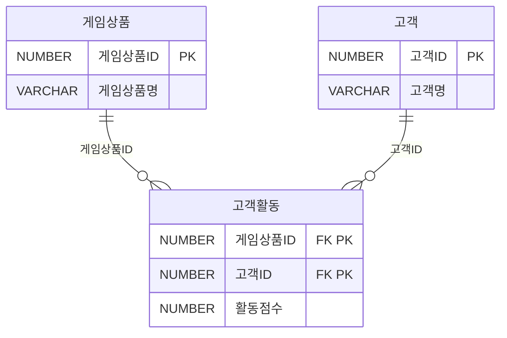

<style>
pre, code {
  white-space: pre-wrap !important;
  word-break: break-word !important;
  overflow-x: hidden !important;
  display: block !important;
  max-width: 100% !important;
  box-sizing: border-box !important;
}
</style> 

---

### 📁 SQL USING

| 구간   | 문제 번호 | 주제                                      | 난이도     |
|--------|------------|-------------------------------------------|------------|
| 1~15   | 065~079    | 관계 연산자, JOIN 실무, 집합 연산자       | ⭐⭐ 초~중급 |
| 16~30  | 080~094    | INTERSECT, EXCEPT, 계층형 질의            | ⭐⭐⭐ 중~고급 |
| 31~45  | 095~109    | 집합 연산자, JOIN 조건, 서브쿼리 활용     | ⭐⭐⭐ 고급    |
| 46~63  | 110~127    | 실무형 SQL 로직, 집계, 조건부 연산        | ⭐⭐⭐⭐ 실무형 |


#### ✅ 1~15번 ( 065~079 ): 관계 연산자, JOIN 실무, 집합 연산자  
- SELECT, JOIN, OUTER JOIN, 집합 연산자(EXCEPT, UNION 등)의 기본 구조를 익힙니다.  
- 복합키, 비선호 필터링, 카티시안 곱 등 실무에서 자주 쓰이는 SQL 로직을 다룹니다.

#### ✅ 16~30번 (  080~094 ): INTERSECT, EXCEPT, 계층형 질의  
- INTERSECT, MINUS, EXCEPT의 차이와 활용법을 비교합니다.  
- START WITH, CONNECT BY, ORDER SIBLINGS BY 등 계층형 질의 구문을 학습합니다.

#### ✅ 31~45번 (095~109  ): 집합 연산자, JOIN 조건, 서브쿼리 활용  
- UNION ALL, 집합 연산자 조합, 서브쿼리와 EXISTS 활용을 집중적으로 다룹니다.  
- JOIN 조건에 따른 결과 건수와 정렬 방식까지 실무 중심으로 분석합니다.

#### ✅ 46~63번 (110~127): 실무형 SQL 로직, 집계, 조건부 연산  
- 조건부 집계, 서브쿼리 필터링, 복잡한 JOIN 조합을 실무 사례로 학습합니다.  
- SQL 성능, 정렬 우선순위, 집계 함수 조합까지 고급 SQL 로직을 익힙니다.

 

---

### ✅110  
자재발주 테이블에 SQL을 수행하여 아래와 같은 결과를 얻었다. 다음 중에 (가) 들어갈 문장으로 옳은 것은?

[테이블 1: 자재발주]
| 자재번호 | 발주처ID | 발주일자 | 발주수량 |
|----------|-----------|------------|-----------|
| 1      | 001       | 20150102   | 100       |
| 1      | 001       | 20150103   | 200       |
| 2      | 001       | 20150102   | 200       |
| 2      | 002       | 20150102   | 100       |
| 3      | 001       | 20150103   | 100       |
| 3      | 002       | 20150103   | 200       |

```sql
[SQL]
SELECT CASE WHEN GROUPING(자재번호) = 1 THEN '자재전체'
        ELSE 자재번호 END AS 자재번호
     , CASE WHEN GROUPING(발주처ID) = 1 THEN '발주처전체'
        ELSE 발주처ID END AS 발주처ID
     , CASE WHEN GROUPING(발주일자) = 1 THEN '발주일자전체'
        ELSE 발주일자 END AS 발주일자
     , SUM(발주수량) AS 발주수량합계
FROM 자재발주
(가)
ORDER BY 자재번호, 발주처ID, 발주일자
```
[테이블 2: 결과]
| 자재번호   | 발주처ID     | 발주일자     | 발주수량합계 |
|------------|--------------|--------------|---------------|
| 1             | 발주처전체   | 발주일자전체 | 300           |
| 2             | 발주처전체   | 발주일자전체 | 300           |
| 3             | 발주처전체   | 발주일자전체 | 300           |
| 자재전체   | 001             | 20150102     | 300           |
| 자재전체   | 001             | 20150103     | 300           |
| 자재전체   | 002             | 20150102     | 100           |
| 자재전체   | 002             | 20150103     | 200           |

① GROUP BY CUBE (자재번호, (발주처ID, 발주일자))
② GROUP BY CUBE (자재번호, 발주처ID, 발주일자)
③ GROUP BY GROUPING SETS (자재번호, 발주처ID, 발주일자)
④ GROUP BY GROUPING SETS (자재번호, (발주처ID, 발주일자))

 

**정답** : 4

---

### ✅111  

다음 중 월별매출 테이블을 대상으로 아래 SQL을 수행한 결과인 것은?


[테이블 1: 제품 매출현황]
| 상품ID | 일자     | 매출액 |
|--------|----------|--------|
| P001   | 2014.10  | 1500   |
| P001   | 2014.11  | 1600   |
| P001   | 2014.12  | 2500   |
| P002   | 2014.10  | 1000   |
| P002   | 2014.11  | 2000   |
| P002   | 2014.12  | 1500   |
| P003   | 2014.10  | 2000   |
| P003   | 2014.11  | 1000   |
| P003   | 2014.12  | 1000   |

```sql
[SQL]
SELECT 상품ID, 월, SUM(매출액) AS 매출액
FROM  월별매출
WHERE 월 BETWEEN '2014.10' AND '2014.12'
GROUP BY GROUPING SETS((상품ID, 월));
```


①
| 상품ID | 일자     | 매출액 |
|--------|----------|--------|
| NULL   | 2014.10  | 4500   |
| NULL   | 2014.11  | 4500   |
| NULL   | 2014.12  | 5000   |
| P001   | NULL  | 5500   |
| P002   | NULL  | 4500   |
| P003   | NULL  | 4000   |
 
 
②
| 상품ID | 일자     | 매출액 |
|--------|----------|--------|
| P001   | 2014.10  | 1500   |
| P001   | 2014.11  | 1500   |
| P001   | 2014.12  | 2500   |
| P002   | 2014.10  | 1000   |
| P002   | 2014.11  | 2000   |
| P002   | 2014.12  | 1500   |
| P003   | 2014.10  | 2000   |
| P003   | 2014.11  | 1000   |
| P003   | 2014.12  | 1000   |
 
 ③
| 상품ID | 일자     | 매출액 |
|--------|----------|--------|
| NULL   | 2014.10  | 4500   |
| NULL   | 2014.11  | 4500   |
| NULL   | 2014.12  | 5000   |
| P001   | NULL  | 5500   |
| P002   | NULL  | 4500   |
| P003   | NULL  | 4000   |
| NULL   | NULL  | 14000   |
 |

 ④ 
| 상품ID | 일자     | 매출액 |
|--------|----------|--------|
| P001   | 2014.10  | 1500   |
| P002   | 2014.10  | 1000   |
| P003   | 2014.10  | 2000   |
| NULL   | 2014.10  | 4500   |
| P001   | 2014.11  | 1500   |
| P002   | 2014.11  | 2000   |
| P003   | 2014.11  | 1000   |
| NULL   | 2014.11  | 4500   |
| P001   | 2014.12  | 2500   |
| P002   | 2014.12  | 1500   |
| P003   | 2014.12  | 1000   |
| NULL   | 2014.12  | 5000   |


**정답** : 2


---
### ✅112  
다음 중 윈도우 함수(Window Function, Analytic Function)에 대한 설명으로 가장 부적절한 것은?

① Partition과 Group By 구문은 의미적으로 유사하다.
② Partition 구분이 없으면 전체 집합을 하나의 Partition으로 정의한 것과 동일하다.
③ 윈도우 함수 처리로 인해 결과 건수가 줄어든다.
④ 윈도우 함수 적용 범위는 Partition을 넘을 수 없다.


**정답** : 3


---
### ✅113  
다음 중 아래와 같은 테이블에서 SQL을 실행할 때 결과로 가장 적절한 것은?

[테이블 1: 고객]
| 고객번호(PK) | 고객명 |
|--------------|--------|
| 001          | 홍길동 |
| 002          | 이순신 |
| 003          | 강감찬 |
| 004          | 이상화 |
| 005          | 이규혁 |

[테이블 2: 월별매출]
| 월(PK)  | 고객번호(PK) | 매출액 |
|---------|----------------|--------|
| 201301  | 001            | 200    |
| 201301  | 002            |  300   |
| 201301  | 003            | 250    |
| 201301  | 004            | 300    |
| 201301  | 005            | 250    |
| 201302  | 001            | 150    |
| 201302  | 002            | 150    |
| 201302  | 004            | 200    |
| 201302  | 005            | 100    |
| 201303  | 002            | 100    |
| 201303  | 003            | 100    |
| 201303  | 004            | 200    |
| 201303  | 005            | 350    |

```sql
[SQL]
SELECT 고객번호, 고객명, 매출액
      , RANK() OVER(ORDER BY 매출액 DESC) AS 순위
FROM (
    SELECT A.고객번호
        , MAX(A.고객명) AS 고객명
        , SUM(B.매출액) AS 매출액
    FROM 고객 A INNER JOIN 월별매출 B
    ON (A.고객번호 = B.고객번호)
    GROUP BY A.고객번호
    )
ORDER BY RNK;
```
①
| 고객번호 | 고객명 | 매출액 | 순위 |
|----------|--------|--------|------|
| 005      | 이규혁 | 700    | 1    |
| 004      | 이상화 | 700    | 1    |
| 002      | 이순신 | 550    | 3    |
| 001      | 홍길동 | 350    | 4    |
| 003      | 강감찬 | 350    | 4    |

②
| 고객번호 | 고객명 | 매출액 | 순위 |
|----------|--------|--------|------|
| 005      | 이규혁 | 700    | 1    |
| 004      | 이상화 | 700    | 2    |
| 002      | 이순신 | 550    | 3    |
| 001      | 홍길동 | 350    | 4    |
| 003      | 강감찬 | 350    | 5    |

③
| 고객번호 | 고객명 | 매출액 | 순위 |
|----------|--------|--------|------|
| 005      | 이규혁 | 700    | 1    |
| 004      | 이상화 | 700    | 1    |
| 002      | 이순신 | 550    | 2    |
| 001      | 홍길동 | 350    | 3    |
| 003      | 강감찬 | 350    | 3    |

④
| 고객번호 | 고객명 | 매출액 | 순위 |
|----------|--------|--------|------|
| 003      | 강감찬 | 350    | 1    |
| 001      | 홍길동 | 350    | 1    |
| 002      | 이순신 | 550    | 2    |
| 004      | 이상화 | 700    | 3    |
| 005      | 이규혁 | 700    | 3    |
 

**정답** : 1


---

### ✅114  
아래 데이터 모델에서 활동점수가 높은 고객을 게임상품ID별로 10등까지 선별하여 사은행사를 진행하려고 한다. 다음 SQL 중 가장 적절한 것은? (단, 활동점수가 동일한 고객은 동일등수로 한다. 아래 결과 예제 참조)



[테이블: 결과 예제]
| 게임상품ID | 고객ID | 활동점수 | 등수(순위) |
|------------|--------|-----------|-------------|
| 001        | 121    | 150       | 1           |
| 001        | 111    | 150       | 1           |
| 001        | 234    | 110       | 3           |
| 001        | 212    | 100       | 4           |
| 001        | 455    | 100       | 4           |
| 001        | 182    | 90        | 6           |
| 001        | 199    | 80        | 7           |
| 001        | 876    | 70        | 8           |
| 001        | 232    | 70        | 8          |
| 001        | 901    | 40        | 10          |
 

```sql
① SELECT 게임상품ID, 고객ID, 활동점수, 순위
FROM (SELECT DENSE_RANK() OVER(ORDER BY 활동점수 DESC) AS 순위 , 고객ID, 게임상품ID, 활동점수
    FROM 고객활동)
WHERE 순위 <= 10;

② SELECT 게임상품ID, 고객ID, 활동점수, 순위
FROM (SELECT DENSE RANK() OVER(PARTITION BY 게임상품ID ORDER BY 활동점수 DESC) AS 순위
        , 고객ID, 게임상품ID, 활동점수
    FROM 고객활동)
WHERE 순위 <= 10;

③ SELECT 게임상품ID, 고객ID, 활동점수, 순위
FROM (SELECT RANK() OVER(ORDER BY 활동점수 DESC) AS 순위 
            , 고객ID, 게임상품ID, 활동점수 
      FROM 고객활동)
WHERE 순위 <= 10;

④ SELECT 게임상품ID, 고객ID, 활동점수, 순위
FROM (SELECT RANK() OVER(PARTITION BY 게임상품ID ORDER BY 활동점수 DESC) AS 순위 
        , 고객ID, 게임상품ID, 활동점수
    FROM 고객활동)
```


**정답** : 4


---

### ✅115  
다음 중 추천내역 테이블에서 아래와 같은 SQL을 수행하였을 때의 결과로 가장 적절한 것은?

| 추천경로    | 추천인 | 피추천인 | 추천점수 |
|-------------|--------|----------|-----------|
| SNS         | 나한일 | 강감찬   | 75        |
| SNS         | 이순신 | 강감찬   | 80        |
| 이벤트응모  | 홍길동 | 강감찬   | 88        |
| 이벤트응모  | 저절로 | 이순신   | 78        |
| 홈페이지    | 저절로 | 이대로   | 93        |
| 홈페이지    | 홍두깨 | 심청이   | 98        |

```sql
[SQL]
SELECT 추천경로, 추천인, 피추천인, 추천점수
FROM (SELECT 추천경로, 추천인, 피추천인, 추천점수 , 
        ROW_NUMBER() OVER(PARTITION BY 추천경로 ORDER BY 추천점수 DESC) AS RNUM
      FROM 추천내역)
WHERE RNUM = 1;
```
 
①  
| 추천경로    | 추천인 | 피추천인 | 추천점수 |
|-------------|--------|----------|-----------|
| SNS         | 나한일 | 강감찬   | 75        |
| SNS         | 이순신 | 강감찬   | 80        |
| 이벤트응모  | 홍길동 | 강감찬   | 88        |
| 이벤트응모  | 저절로 | 이순신   | 78        |
| 홈페이지    | 저절로 | 이대로   | 93        |
| 홈페이지    | 홍두깨 | 심청이   | 98        |

②  
| 추천경로    | 추천인 | 피추천인 | 추천점수 |
|-------------|--------|----------|-----------|
| 홈페이지    | 홍두깨 | 심청이   | 98        |

③
| 추천경로    | 추천인 | 피추천인 | 추천점수 |
|-------------|--------|----------|-----------|
| SNS         | 이순신 | 강감찬   | 80        |
| 이벤트응모  | 홍길동 | 강감찬   | 88        |
| 홈페이지    | 홍두깨 | 심청이   | 98        |  

④  
| 추천경로    | 추천인 | 피추천인 | 추천점수 |
|-------------|--------|----------|-----------|
| SNS         | 나한일 | 강감찬   | 75        |  
| 이벤트응모  | 저절로 | 이순신   | 78        |
| 홈페이지    | 저절로 | 이대로   | 93        | 


**정답** : 3


---
### ✅116  
다음 중 아래의 SQL에 대한 설명으로 가장 적절한 것은?

```sql
[SQL]
SELECT 상품분류코드
        ,AVG(상품가격) AS 상품가격
        ,COUNT(*) OVER(ORDER BY AVG(상품가격)
                        RANGE BETWEEN 10000 PRECEDING
                    AND 10000 FOLLOWING) AS 유사개수
FROM 상품
GROUP BY 상품분류코드;
```

① WINDOW FUNCTION을 GROUP BY 절과 함께 사용하였으므로 위의 SQL은 오류가 발생한다.
② WINDOW FUNCTION의 ORDER BY절에 AVG 집계 함수를 사용하였으므로 위의 SQL은 오류가 발생한다.
③ 유사개수 컬럼은 상품분류코드별 평균상품가격을 서로 비교하여 -10000 ~ +10000 사이에 존재하는 상품분류코드의 개수를 구한 것이다.
④ 유사개수 컬럼은 상품전체의 평균상품가격을 서로 비교하여 -10000 ~ +10000 사이에 존재하는 상품의 개수를 구한 것이다.


**정답** : 3


---
### ✅117  
다음 중 [사원] 테이블에 대하여 아래와 같은 SQL을 수행하였을 때 예상되는 결과로 가장 적절한 것은?

[테이블: 사원]
| 사원ID | 부서ID | 사원이름 | 연봉 |
|--------|--------|-----------|------|
| 001    | 100    | 홍길동    | 2500 |
| 002    | 100    | 강감찬    | 3000 |
| 003    | 200    | 김유신    | 4500 |
| 004    | 200    | 김선달    | 3000 |
| 005    | 200    | 유학생  | 2500 |
| 006    | 300    | 변사또    | 4500 |
| 007    | 300    | 박문수    | 3000 |

```sql
[SQL]
SELECT Y.사원ID, Y.부서ID, Y.사원명, Y.연봉
FROM (SELECT 사원ID, MAX(연봉) OVER(PARTITION BY 부서ID) AS 최고연봉 
      FROM 사원) X, 사원 Y
WHERE X.사원ID = Y.사원ID
AND   X.최고연봉 = Y.연봉
```


①
| 사원ID | 부서ID | 사원이름 | 연봉 |
|--------|--------|-----------|------| 
| 002    | 100    | 강감찬    | 3000 |
| 003    | 200    | 김유신    | 4500 |
| 006    | 300    | 변사또    | 4500 |

②
| 사원ID | 부서ID | 사원이름 | 연봉 |
|--------|--------|-----------|------|
| 001    | 100    | 홍길동    | 2500 |
| 005    | 200    | 유학생  | 2500 |
| 007    | 300    | 박문수    | 3000 |
 

③
| 사원ID | 부서ID | 사원이름 | 연봉 |
|--------|--------|-----------|------|
| 003    | 200    | 김유신    | 4500 |
| 006    | 300    | 변사또    | 4500 |


④
| 사원ID | 부서ID | 사원이름 | 연봉 |
|--------|--------|-----------|------|
| 004    | 200    | 김유신    | 4500 |

 
**정답** : 1


---

### ✅118  
다음 중 아래 SQL의 실행 결과로 가장 적절한 것은?

```sql
CREATE TABLE TBL
    (ID VARCHAR2(10),
    START VAL NUMBER,
    END VAL NUMBER)

```
[테이블: TBL]
| ID | START VAL | END VAL |
|----|------------|---------|
| A  | 10         | 14      |
| A  | 14         | 15      |
| A  | 15         | 15      |
| A  | 15         | 18      |
| A  | 20         | 25      |
| A  | 25         |       |

```sql
SELECT ID, START VAL, END VAL
FROM (
    SELECT ID, START VAL, NVL(END VAL, 99) END VAL,
        (CASE WHEN START_VAL = LAG(END VAL) OVER (PARTITION BY ID
                ORDER BY START VAL, NVL(END VAL, 99)) THEN 1
            ELSE O
            END) FLAG1
     , (CASE WHEN END VAL LEAD(START VAL) OVER (PARTITION BY ID
                ORDER BY START VAL, NVL(END VAL, 99)) THEN 1
            ELSE 0
            END) FLAG2
    FROM TBL)
WHERE FLAG1 = 0  OR FLAG2=0
```
①  
| ID | START VAL | END VAL |
|----|------------|---------|
| A  | 10         | 14      |
| A  | 15         | 18      |
| A  | 20         | 25      |
| A  | 25         |  99     |

②  
| ID | START VAL | END VAL |
|----|------------|---------|
| A  | 15         | 15      |

③  
| ID | START VAL | END VAL |
|----|------------|---------|
| A  | 10         | 14      |
| A  | 15         | 15      |
| A  | 20         | 99      |

④ 
| ID | START VAL | END VAL |
|----|------------|---------|
| A  | 10         | 18      |
| A  | 20         | 99      |


**정답** : 1


---

### ✅119  
아래 설명 중 (가), (나)에 해당하는 내용을 작성하시오.

```sql
DBMS에 생성된 USER와 다양한 권한들 사이에서 중개 역할을 할 수 있도록 DBMS에서는 ROLE을 제공한다. 이러한 ROLE을 DBMS USER에게 부여하기 위해서는 (가) 명령을 사용하며, ROLE을 회수하기 위해서는 (나) 명령을 사용한다.
```

**정답** : 가 - GRANT  , 나 - REVOKE


---

### ✅120  
다음 중 B_User가 아래의 작업을 수행할 수 있도록 권한을 부여하는 DCL로 가장 적절한 것은?

```sql
UPDATE A_User.TB_A
SET   coll='AAA'
WHERE col2=3
```
① GRANT  SELECT, UPDATE TO B_User;
② REVOKE SELECT ON A_User.TB_A FROM B_User;
③ DENY   UPDATE ON A_User.TB_A TO   B_User;
④ GRANT  SELECT, UPDATE ON A_User.TB_A TO B_User;


**정답** : 4

---

### ✅121  
아래의 (가)에 들어갈 내용을 쓰시오.

```sql
DBMS 사용자를 생성하면 기본적으로 많은 권한을 부여해야 한다. 많은 DBMS에서는 DBMS 관리자가 사용자별로 권한을 관리해야 하는 부담과 복잡함을 줄이기 위하여 다양한 권한을 그룹으로 묶어 관리할 수 있도록 사용자와 권한 사이에서 중개 역할을 수행하는 (가)을 제공한다. 
```


**정답** : ROLE


---
### ✅122  
사용자 Lee가 릴레이션 R을 생성한 후, 아래와 같은 권한부여 SQL문들을 실행하였다. 그 이후에 기능이 실행 가능한 SQL을 2개 고르시오. (단, A, B의 데이터 타입은 정수형이다)

```sql
Lee: GRANT SELECT, INSERT, DELETE ON R TO Kim WITH GRANT OPTION;
Kim: GRANT SELECT, INSERT, DELETE ON R TO Park;
Lee: REVOKE DELETE ON R FROM Kim;
Lee: REVOKE INSERT ON R FROM Kim CASCADE;
```

① Park: SELECT * FROM R WHERE A = 400;
② Park: INSERT INTO R VALUES (400, 600);
③ Park: DELETE FROM R WHERE B = 800;
④ Kim : INSERT INTO R VALUES (500, 600);


**정답** : 1,3


---
### ✅123  
다음 중 PL/SQL에 대한 설명으로 가장 부적절한 것은?

① 변수와 상수 등을 사용하여 일반 SQL 문장을 실행할 때 WHERE절의 조건 등으로 대입할 수 있다.
② Procedure, User Defined Function, Trigger 객체를 PL/SQL로 작성할 수 있다.
③ PL/SQL로 작성된 Procedure, User Defined Function은 전체가 하나의 트랜젝션으로 처리되어야 한다.
④ Procedure 내부에 작성된 절차적 코드는 PL/SQL엔진이 처리하고 일반적인 SQL 문장은 SQL실행기가 처리한다.


**정답** : 3

---

### ✅124  
아래는 임시부서(TMP_DEPT) 테이블로부터 부서(DEPT) 테이블에 데이터를 입력하는 PL/SQL 이다. 부서 테이블에 데이터를 입력하기 전에 부서 테이블의 모든 데이터를 ROLLBACK이 불가능 하도록 삭제하려고 한다. 다음 중 (가)에 들어갈 내용으로 옳은 것은?

```sql
[PL/SQL]
create or replace procedure insert_dept_authid current_user
as
begin
(가)
INSERT /*+ APPEND */ INTO DEPT (DEPTNO, DNAME, LOC)
SELECT DEPTNO, DNAME, LOC
FROM TMP_DEPT;
commit;
end;
/
```

①TRUNCATE TABLE DEPT:
② DELETE FROM DEPT:
③ execute immediate 'TRUNCATE TABLE DEPT';
④ execute 'TRUNCATE TABLE DEPT':

 
**정답** : 3


---

### ✅125  
다음 중 절차형 SQL 모듈에 대한 설명으로 가장 부적절한 것은?

① 저장형 프로시져는 SQL을 로직과 함께 데이터베이스 내에 저장해 놓은 명령문의 집합을 의미한다.
② 저장형 함수(사용자 정의 함수)는 단독적으로 실행되기 보다는 다른 SQL문을 통하여 호출되고 그 결과를 리턴하는 SQL의 보조적인 역할을 한다.
③ 트리거는 특정한 테이블에 INSERT, UPDATE, DELETE와 같은 DML문이 수행되었을 때 데이터베이스에서 자동으로 동작하도록 작성된 프로그램이다.
④ 데이터의 무결성과 일관성을 위해서 사용자 정의 함수를 사용한다.


**정답** : 4


---

### ✅126  
다음 중 Trigger에 대한 설명으로 가장 부적절한 것은?

① Trigger는 데이터베이스에 의해서 자동으로 호출되고 수행된다.
② Trigger는 특정 테이블에 대해서 INSERT, UPDATE, DELETE 문이 수행되었을 때 호출되도록 정의할 수 있다.
③ Trigger는 TCL을 이용하여 트랜젝션을 제어할 수 있다.
④ Trigger는 데이터베이스에 로그인하는 작업에도 정의할 수 있다.


**정답** : 3

---

### ✅127  
다음 중 특정한 테이블에 INSERT, UPDATE, DELETE와 같은 DML문이 수행되었을 때, 데이터베이스에서 자동으로 동작하도록 작성된 저장 프로그램으로 가장 적절한 것은?(단, 사용자가 직접 호출하여 사용하는 것이 아니고 데이터베이스에 서 자동적으로 수행하게 된다.)

① PROCEDURE
② USER DEFINED FUNCTION
③ PACKAGE
④ TRIGGER


**정답** : 4
