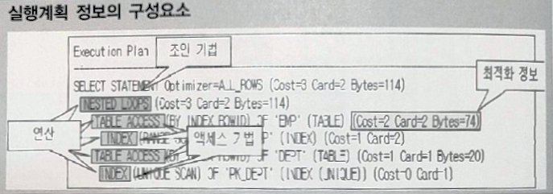
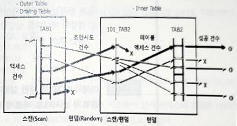

<style>
pre, code {
  white-space: pre-wrap !important;
  word-break: break-word !important;
  overflow-x: hidden !important;
  display: block !important;
  max-width: 100% !important;
  box-sizing: border-box !important;
}
</style> 

---

### 📁 SQL OPTIMIZATION

| 구간   | 문제 번호 | 주제                          | 난이도     |
|--------|------------|-------------------------------|------------|
| 1~5    | 128~132    | 옵티마이저와 실행계획 개요    | ⭐⭐ 초~중급 |
| 6~10   | 133~137    | 인덱스 구조와 활용 전략       | ⭐⭐⭐ 중급    |
| 11~15  | 138~142    | 인덱스 성능과 조인 방식 비교  | ⭐⭐⭐ 고급    |
| 16~19  | 143~146    | 조인 기법별 특징과 적용 조건 | ⭐⭐⭐⭐ 실무형 |

---

## ✅ 구간별 설명 (2줄 요약)

### ✅ 1~5번: 옵티마이저와 실행계획 개요  
CBO, RBO 등 옵티마이저의 개념과 SQL 실행 흐름을 이해합니다.  
실행계획의 구성 요소와 처리 절차를 시각적으로 분석하는 기초 구간입니다.

---

### ✅ 6~10번: 인덱스 구조와 활용 전략  
B-TREE, CLUSTERED, BITMAP 등 인덱스 유형을 비교합니다.  
인덱스의 장단점과 옵티마이저의 인덱스 선택 기준을 학습합니다.

---

### ✅ 11~15번: 인덱스 성능과 조인 방식 비교  
인덱스 컬럼 순서, 범위 조건, DML 부하 등 성능에 미치는 영향을 분석합니다.  
SQL 실행 조건에 따라 인덱스 효율성과 조인 방식이 어떻게 달라지는지 파악합니다.

---

### ✅ 16~19번: 조인 기법별 특징과 적용 조건  
Nested Loop, Hash Join, Sort Merge Join의 특징과 적용 조건을 비교합니다.  
선행 테이블 선택, 인덱스 유무, 데이터량에 따른 조인 전략을 실무 중심으로 익힙니다.


---
### ✅128  
 
아래에 해당하는 내용을 작성하시오.

```
테이블 및 인덱스 등의 통계 정보를 활용하여 SQL문을 실행하는데 소요
될 처리시간 및 CPU, I/O 자원량 등을 계산하여 가장 효율적일 것으로
예상되는 실행계획을 선택하는 옵티마이저를  (      ) 라 한다.
```

**정답** : CBO , 비용기반 옵티마이저, Cost Based Optimizer


---
### ✅129  
다음 중 실행계획을 통해서 알 수 있는 정보로 가장 부적절한 것은?

① 액세스 기법
② 질의 처리 예상 비용(Cost)
③ 조인 순서
④ 실제 처리 건수




**정답** : 4

---

### ✅130  

아래 실행계획의 실행순서에 맞게 ㉠, ㉡, ㉢ 을 작성하시오.
```
1  NESTED LOOPS
2    HASH JOIN
3      TABLE ACCESS (FULL) TAB1
4      TABLE ACCESS (FULL) TAB2
5    TABLE ACCESS (BY ROWID) TAB3
6      INDEX (UNIQUE SCAN) PK TAB3
    ㉠ → ㉡ → ㉢ → 6 → 5 → 1
```


**정답** : ㉠ 3→ ㉡ 4 → ㉢ 2


---
### ✅131  
다음 중 실행계획에 대한 설명으로 가장 부적절한 것은?

① 실행계획은 SQL 처리를 위한 실행 절차와 방법을 표현한 것이다.
② 실행계획은 조인 방법, 조인 순서, 액세스 기법 등이 표현된다.
③ 동일 SQL문에 대해 실행계획이 다르면 실행 결과도 달라질 수 있다.
④ CBO(Cost Based Optimizer)의 실행계획에는 단계별 예상 비용 및
건수 등이 표시된다.


**정답** : 3 

---
### ✅132  
다음 중 아래와 같은 SQL 처리 흐름도(Access Flow Diagram)에 대한 설명으로 가장 적절한 것을 2개 고르시오.




① SQL의 실행 시간을 알 수 있다.
② 인덱스 스캔, 테이블 전체 스캔 등과 같은 액세스 기법이 표현된다.
③ 실행계획과는 무관하다.
④ SQL의 내부적인 처리 절차를 시각적으로 표현해준다.


**정답** : 2,4

---

### ✅133  
다음 중 옵티마이저와 실행계획에 대한 설명으로 부적절한 것을 2개 고르시오.

① SQL 처리 흐름도는 성능적인 측면의 표현은 고려하지 않는다.
② 규칙기반 옵티마이저에서 제일 높은 우선순위는 행에 대한 고유 주소를 사용하는 방법이다.
③ SQL 처리 흐름도는 인덱스 스캔 및 전체 테이블 스캔 등의 액세스 기법을 표현할 수 있다.
④ 인덱스 범위 스캔은 항상 여러 건의 결과가 반환된다.


**정답** : 1,4
---

### ✅134  
다음 중 관계형 데이터베이스의 인덱스(Index)에 대한 설명으로 가장 적절한 것은?
① 기본 인덱스(Primary Key Index)에 중복된 키 값들이 나타날 수 있다.
② 기본 인덱스에 널 값(Null Value)들이 나타날 수 없다.
③ 보조 인덱스(Secondary Index)에는 고유한 키 값들만 나타날 수 있다.
④ 자주 변경되는 속성은 인덱스를 정의할 좋은 후보이다.


**정답** : 2

---

### ✅135  
다음 중 관계형 데이터베이스 인덱스(Index)에 대한 설명으로 가장 부적절한 것을 2개 고르시오.
① 테이블의 전체 데이터를 읽는 경우는 인덱스가 거의 불필요하다.
② 인덱스는 조회, 삽입, 삭제, 갱신 연산의 속도를 향상시킨다.
③ B 트리는 관계형 데이터베이스의 주요 인덱스 구조이다.
④ 대량의 데이터를 삽입할 때는 모든 인덱스를 생성하고 데이터를 입력하는 것이 좋다.


**정답** : 2 , 4

---

### ✅136  
아래의 INDEX에 대한 설명에서 (가),(나),(다)에 들어갈 인덱스 종류가 순서대로 바르게 나열된 것은?

(가)인덱스는 브랜치 블록과 리프 블록으로 구성되며, 브랜치 블록은 분기를 목적으로 하고 리프블록은 인덱스를 구성하는 컬럼의 값으로 정렬된다. 일반적으로 OLTP 시스템 환경에서 가장 많이 사용된다.
(나) 인덱스는 인덱스의 리프 페이지가 곧 데이터 페이지이며, 리프 페이지의 모든 데이터는 인덱스 키 컬럼 순으로 물리적으로 정렬되어 저장된다.
(다) 인덱스는 시스템에서 사용될 질의를 시스템 구현 시에 모두 알 수 없는 경우인 DW 및 AD-HOC 질의 환경을 위해서 설계되었으며, 하나의 인덱스 키 엔트리가 많은 행에 대한 포인터를 저장하고 있는 구조이다.

① B-TREE 인덱스, BITMAP 인덱스, CLUSTERED 인덱스
② B-TREE 인덱스, CLUSTERED 인덱스, BITMAP 인덱스
③ BITMAP 인덱스, CLUSTERED 인덱스, REVERSE KEY 인덱스
④ BITMAP 인덱스, REVERSE KEY 인덱스, CLUSTERED 인덱스


**정답** : 2

---

### ✅137  

다음 중 인덱스에 대한 설명으로 가장 적절한 것을 2개 고르시오.
① 인덱스는 인덱스 구성 칼럼으로 항상 오름차순으로 정렬된다.
② 비용기반 옵티마이저는 인덱스 스캔이 항상 유리하다고 판단한다.
③ 규칙기반 옵티마이저는 적절한 인덱스가 존재하면 항상 인덱스를 사용 하려고 한다.
④ 인덱스 범위 스캔은 결과가 없으면 한 건도 반환하지 않을 수 있다.


**정답** : 3,4

---

### ✅138  
다음 중 아래의 내용에 대한 설명으로 가장 적절한 것을 2개 고르시오.

```
[INDEX 생성]
아래
CREATE INDEX IDX_EMP_01 ON EMP (REGIST_DATE, DEPTNO);

[SQL 실행]
SELECT *
FROM EMP
WHERE DEPTNO = 47
AND REGIST_DATE BETWEEN '2015.02.01' AND '2015.02.28':
```

① 실행된 SQL에 대해서 인덱스 비효율이 있어 인덱스의 컬럼을 DEPTNO + REGIST_DATE 순으로 변경할 필요가 있다.
②IDX_EMP_01 인덱스를 이용하여 DEPTNO = 47 조건을 효율적으로 탐색할 수 있다.
③ REGIST_DATE 컬럼에 대한 조건을 범위 검색이 아닌 동등 검색 조건으로 변경하면 IDX_EMP_01 인덱스를 효율적으로 활용할 수 있다.
④ IDX_EMP_01 인덱스는 테이블 내의 대량 데이터를 탐색할 때 매우 유용하게 활용될 수 있는 인덱스 형식이다.


**정답** : 1,3

---

### ✅139  
다음 중 인덱스에 대한 설명으로 가장 부적절한 것은?

① 인덱스의 목적은 조회 성능을 최적화하는 것이다.
② Insert, Update, Delete 등의 DML 처리 성능을 저하시킬 수도 있다.
③ B-트리 인덱스는 일치 및 범위 검색에 적절한 구조이다.
④ 인덱스 액세스는 테이블 전체 스캔보다 항상 유리하다.


**정답** : 4

---

### ✅140  
다음 중 아래에서 인덱스에 대한 설명으로 가장 올바른 것만 묶은 것은?

```
가) 인덱스는 데이터 조회 목적에는 효과적이지만, INSERT, UPDATE, DELETE 작업에는 오히려 많은 부하를 줄 수도 있다.
나) 인덱스를 이용한 데이터 조회는 대부분의 경우 테이블 전체 스캔보다 빠르다.  
다) SQL Server의 클러스터형 인덱스는 ORACLE의 IOT와 매우 유사하다.
라) 인덱스는 INSERT와 DELETE 작업과는 다르게 UPDATE 작업에는 부하가 없을 수도 있다.
마) 인덱스를 활용하여 데이터를 조회할 때 인덱스를 구성하는 컬럼들의 순서는 SQL 실행 성능과 관계가 없다.
```

① 가, 나, 다
② 가, 다, 라
③ 다, 라, 마
④ 가, 다, 마


**정답** : 1

---

### ✅141  
아래의 옵티마이저와 실행계획 대한 설명 중에서 옳은 것을 모두 묶은 것은?

```
가) ORACLE의 규칙기반 옵티마이저에서 가장 우선 순위가 높은 규칙은 Single row by rowid 엑세스 기법이다.
나) 비용기반 옵티마이저는 테이블, 인덱스, 컬럼 등 객체의 통계정보를
사용하여 실행계획을 수립하므로 통계정보가 변경되면 SQL의 실행계획이 달라질 수 있다.
다) ORACLE의 실행계획에 나타나는 기본적인 Join 기법으로는 NL Join, Hash Join, Sort Merge Join 등이 있다.
라) 다양한 Join 기법 중 NL Join은 DW 등에서 데이터를 집계하는 업무에 많이 사용된다.
```

① 가, 다
② 가, 나, 다
③ 나, 다
④ 나. 다. 라


**정답** : 2

---

### ✅142  

다음 중 Nested Loop Join에 대한 설명으로 가장 부적절한 것은?

① 조인 칼럼에 적당한 인덱스가 있어서 자연조인(Natural join)이 효율적일 때 유용하다.
② Driving Table의 조인 데이터 양이 큰 영향을 주는 조인 방식이다.
③ 소트 머지 조인(Sort Merge Join)하기에 두 테이블이 너무 커서 소트(Sort) 부하가 심할 때 유용하다.
④ 유니크 인덱스를 활용하여 수행시간이 적게 걸리는 소량 테이블을 온라인 조회하는 경우 유용하다.


**정답** : 3

---

### ✅143  
다음 중 아래와 같은 SQL에서 나타날 수 있는 Join 기법으로 가장 적절한 것은?

```
[DEPT 테이블 INDEX 정보]
PK_DEPT : DEPTNO
[EMP 테이블 INDEX 정보]
PK_EMP : EMPNO
IDX_EMP_01 : DEPTNO

[SQL]
SELECT *
FROM DEPT D
WHERE D.DEPTNO = 'A001'
AND EXISTS (SELECT 'X' FROM EMP E WHERE D.DEPTNO = E.DEPTNO)

```

① HASH ANTI JOIN
② HASH SEMI JOIN
③ NESTED LOOP ANTI JOIN
④ NESTED LOOP SEMI JOIN


**정답** : 4

---
### ✅144  

다음 중 SMJ(Sort Merge Join)에 대한 설명으로 가장 부적절한 것은?

① 조인 칼럼에 적당한 인덱스가 없어서 NL 조인(Nested Loops)가 비효율적일 때 사용할 수 있다
② Driving Table의 개념이 중요하지 않은 조인 방식이다
③ 조인 조건의 인덱스의 유무에 영향 받지 않는다
④ EQUI(=) 조인 조건에서만 동작한다.


**정답** : 4

---
### ✅145  
해싱(Hashing) 기법을 이용하여 조인을 하는 해시조인(Hash join)은 한쪽 테이블이 주 메모리의 가용 메모리에 담길 정도로 충분히 작고 해시 키 속성에 중복 값이 적을 때 효과적이다. 다음 중 해시조인이 더 효과적일 수 있는 조건에 대한 설명으로 가장 부적절한 것은?

① 조인 컬럼에 적당한 인덱스가 없어서 자연조인(Natural join)이 비효율적일 때
② 자연조인(Natural join)시 드라이빙(driving) 집합 쪽으로 조인 액세스량이 많아 Random 액세스 부하가 심할 때
③ 소트 머지 조인(Sort Merge Join)을 하기에는 두 테이블이 너무 커서 소트(Sort) 부하가 심할 때
④ 유니크 인덱스를 활용하여 수행시간이 적게 걸리는 소량 테이블을 온라인 조회하는 경우


**정답** : 4

---
### ✅146  
다음 중 Join 기법에 대한 설명으로 가장 적절한 것은?

① NL Join은 선택도가 낮은(결과 행의 수가 적은) 테이블이 선행 테이블로 선택되는 것이 일반적으로 유리하다.
② Sort Merge Join은 동등 Join(Equi Join) 에서만 사용할 수 있으므로 제약이 존재한다.
③ Hash Join은 결과 행의 수가 큰 테이블을 선행 테이블로 사용하는 것이 성능에 유리하다.
④ Hash Join은 Sort Merge Join보다 항상 우수한 성능을 보장한다.


**정답** : 1