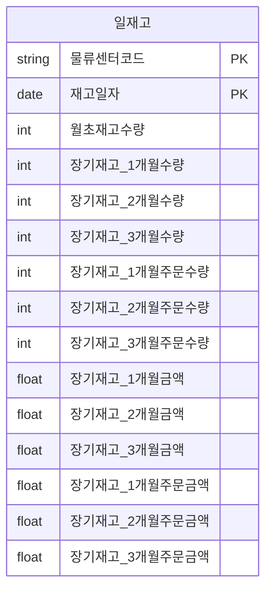
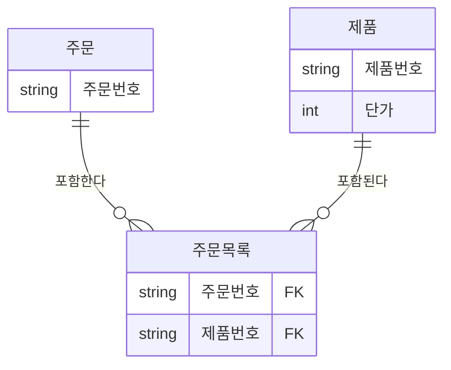
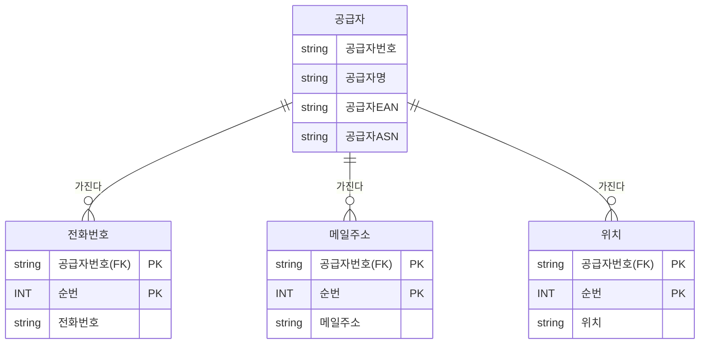
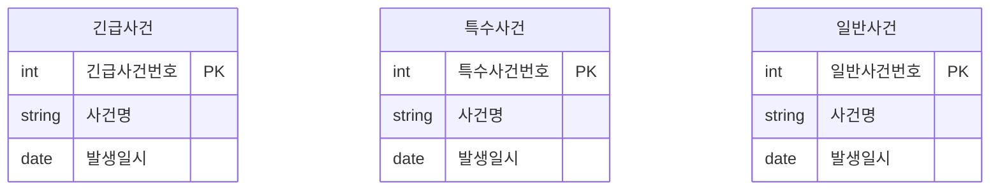
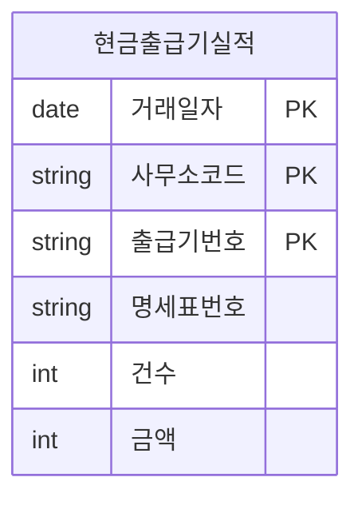
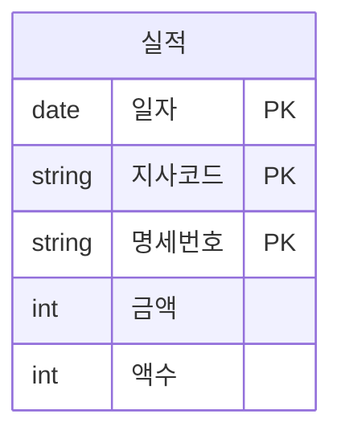
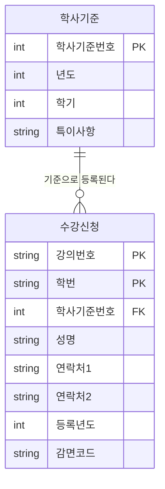

<style>
pre, code {
  white-space: pre-wrap !important;
  word-break: break-word !important;
  overflow-x: hidden !important;
  display: block !important;
  max-width: 100% !important;
  box-sizing: border-box !important;
}
</style> 

---
### 📁 모델링 BASIC (3구간 분할)

| 구간       | 문제 번호 | 주제 범위                              | 난이도     |
|------------|------------|----------------------------------------|------------|
| 1단계      | 001~020    | 모델링 개념, 엔터티·속성·관계의 기초  | ⭐ 초급~중급 |
| 2단계      | 021~036    | 관계 유형, 식별자, 성능 모델링 개요    | ⭐⭐ 중급~고급 |
| 3단계      | 037~052    | 정규화/반정규화 판단 및 실무 사례 분석 | ⭐⭐⭐ 고급~실무형 |

>“기초 → 관계/식별자 → 정규화/실무” 


#### ✅ 3단계: 037~052  
- 정규화 단계별 판단 기준과 반복 속성 구조를 분석하고  
- 반정규화 적용 시점과 실무 사례 중심의 설계 전략을 익힙니다.


---

```bash
[문제 37]  
아래의 데이터 모델처럼 동일한 유형의 속성이 칼럼단위로 반복되는 경우가 실제 프로젝트를 하면서 많이 발생 될 수 있다. 다음 중 아래와 같이 전제조건이 있을 때 테이블에서 나타날 수 있는 현상으로 가장 적절한 것은?


전제조건: 
유형기능분류코드에 해당하는 속성들은 분포도가 양호 하며, 
SQL Where절에서 각각의 값이 상수값으로 조건 입력될 수 있는 특징을 가진다.
```

| 모델 |
|------|
|모델코드 (pk) |
|모델명   <br/> 제품류코드 <br/>  물품가    <br/> 출하가    <br/> **A유형기능분류코드1** <br/> **B유형기능분류코드2** <br/> **C유형기능분류코드3** <br/> **D유형기능분류코드4** <br/> **E유형기능분류코드5** <br/> **F유형기능분류코드6** <br/> **G유형기능분류코드7** <br/> **H유형기능분류코드8** <br/> **I유형기능분류코드9**  <br/> 바코드  <br/> 가로  <br/> 세로  <br/> 높이  <br/> 모델구분 |
 

```
①  조회 조건이 유형기능분류코드에 따라 반복되는 그룹이 칼럼단위로 되어 있으므로 제 1정규형이라고 할 수 있다.
② 유형기능분류코드에 대해 Where절에 조건으로 들어오는 값이 있으므로 PK와 이에 대한 Index만 있으면 SQL 문장은 빠르게 수행될 수 있다고 할 수 있다.
③ 유형기능분류코드가 일반속성 안에서 반복적으로 속성이 구분되어 있기 때문에 이전을 수행해야 하는 제 2정규형이라 할 수 있다.
④ 유형기능분류코드 각각에 대하여 개별로 Index를 모두 생성할 경우 입력, 수정, 삭제 때 성능이 저하되므로 제1차 정규화를 수행한 후 인덱스를 적용하는 것이 좋다.
```


**정답:** ④

🧸 **쉬운 해설:**  
④번은 “너무 많은 인덱스는 느려져!”  
먼저 정리하고 인덱스 걸자!

**📚 전문 해설:**  
반복 속성에 대해 인덱스를 모두 생성하면  
입력/수정/삭제 시 성능 저하가 발생할 수 있어요.  
정규화를 먼저 수행한 후 인덱스를 적용하는 것이 좋습니다.

**보기 설명:**  
| 보기 번호 | 설명 | 적절성 |
|-----------|---------------------------------------------|--------|
| ① | 반복 속성 유지 → 정규화 미흡 | ❌ |
| ② | PK 인덱스만으로 충분하다고 판단 | ❌ |
| ③ | 2차 정규화 언급 → 구조상 과도 | ❌ |
| ④ | 정규화 후 인덱스 적용 → 정확 | ✅ |


🧠 **기억법:**  
정규화 → 인덱스  
❌ 반복 속성에 무작정 인덱스 금지!

**필요 암기카드:**  
- 🃏 카드 67: 2차 정규화 = 부분 종속 제거  
- 🃏 카드 68: 정규화 판단 기준 = 함수 종속성 분석


---

```bash
[문제 38]  
다음 중 아래 '일재고' 엔터티에 대한 설명으로 가장 적절한 것은?
```
 
[  일재고 ]


```
① 1차 정규화가 필요한 엔터티로서 일재고와 일재고상세로 1:M의 관계가 될 수 있다.
② 1차 정규화가 필요한 엔터티로서 일재고와 일재고상세로 1:1의 관계가 될 수 있다.
③ 2차 정규화가 필요한 엔터티로서 일재고와 일재고상세로 1:M의 관계가 될 수 있다.
④ 2차 정규화가 필요한 엔터티로서 일재고와 일재고상세로 1:1의 관계가 될 수 있다.
```


**정답:** ①

🧸 **쉬운 해설:**  
①번은 “재고가 여러 달 걸쳐 반복돼!”  
그래서 상세로 나눠야 해!

**📚 전문 해설:**  
속성이 반복되고, 상세 정보로 분리 가능하므로  
1차 정규화가 필요하며, 일재고와 상세는 1:M 관계입니다.

**보기 설명:**  
| 보기 번호 | 설명 | 적절성 |
|-----------|---------------------------------------------|--------|
| ① | 반복 속성 → 행 분리 + 1:M 관계 | ✅ |
| ② | 1:1 관계 → 구조 불일치 | ❌ |
| ③ | 2차 정규화 언급 → 과도 | ❌ |
| ④ | 2차 정규화 + 1:1 관계 → 오류 | ❌ |


🧠 **기억법:**  
1차 정규화 = **반복 속성 → 행으로 분리**

 
**필요 암기카드:**  
- 🃏 카드 66: 반정규화 = 성능 개선 전략  
- 🃏 카드 67: 2차 정규화 = 부분 종속 제거

 

---

```bash
[문제 39]  
다음 중 아래와 같이 수강지도 엔터티를 만들었을 때 이에 해당하는 정규형과 정규화의 대상으로 가장 바르게 짝지어진 것은?

 
함수종속성(FD)  
1. 학번 || 과목번호 → 성적  
2. 학번 → 지도교수명  
3. 학번 → 학과명
```
| 수강지도 |
|------|
|학번 <BR> 과목코드 |
|성적   <br/> 지도교수명 <br/>  학과명   |

```
① 1차 정규형 - 2차 정규화 대상
② 2차 정규형 - 3차 정규화 대상
③ 3차 정규형 - 보이스코드 정규화대상
④ 보이스코드정규형 4차 정규화 대상
```

**정답:** ①

🧸 **쉬운 해설:**  
①번은 “지금은 기본 정리만 돼 있고, 더 정리해야 해!”  
학번만으로 결정되는 정보는 따로 떼야 해!

**📚 전문 해설:**  
현재 구조는 1차 정규형은 만족하지만,  
부분 함수 종속(학번 → 지도교수명, 학과명)이 존재하므로  
2차 정규화를 수행해야 합니다.

**보기 설명:**  
| 보기 번호 | 설명 | 적절성 |
|-----------|-------------------------------|--------|
| ① | 1차 정규형 상태, 2차 정규화 필요 | ✅ |
| ② | 2차 정규형 상태 아님 | ❌ |
| ③ | 보이스코드 정규형은 아직 아님 | ❌ |
| ④ | 4차 정규화는 너무 고차원 | ❌ |

🧠 **기억법:**  
2차 정규화 = **부분 함수 종속 제거**

**필요 암기카드:**  
- 🃏 카드 67: 2차 정규화 = 부분 종속 제거  
- 🃏 카드 68: 정규화 판단 기준 = 함수 종속성 분석


---

```bash
[문제 40]  
다음 중 데이터 모델에 대한 반정규화를 고려할 때 판단요소에 대한 설명으로 가장 적절한 것은?

① 반정규화 정보에 대한 재현의 적시성으로 판단한다. 예들 들어, 빌링의 잔액(balance)은 다수 테이블에 대한 다량의 조인이 불가피하므로 데이터 제공의 적시성 확보를 위한 필수 반정규화 대상 정보이다.  
② 탐색 대상 데이터의 크기로 판단한다. 왜냐하면 다량 데이터에 대한 인덱스를 활용한 탐색은 Random처리의 특성으로 성능 저하가 불가피하다.  
③ RDBMS는 현재 레코드 기준으로 이전 또는 이후 위치의 레코드에 대한 접근이 원천적으로 불가능하므로 반정규화를 하지 않으면 해당 정보에 대한 데이터 접근 자체가 불가능하다.  
④ 반정규화 테이블은 집계 테이블에 국한하여 적용하도록 한다.
```

**정답:** ①

🧸 **쉬운 해설:**  
①번은 “빨리 보여줘야 할 정보는 미리 계산해서 저장해!”  
잔액 같은 건 바로 보여줘야 하니까!

**📚 전문 해설:**  
반정규화는 **데이터 제공의 적시성**을 확보하기 위한 전략이에요.  
특히 잔액처럼 여러 테이블을 조인해야 하는 경우,  
성능을 위해 미리 계산된 값을 저장하는 것이 효과적입니다.

※ 적시성 : 사용자가 필요로 하는 시점에 정확하고 신속하게 데이터를 제공할 수 있는 능력

**보기 설명:**  
| 보기 번호 | 설명 | 적절성 |
|-----------|--------------------------------------------------|--------|
| ① | 적시성 확보 → 반정규화 판단 기준 | ✅ |
| ② | 탐색 크기만으로 판단은 부족 | ❌ |
| ③ | RDBMS 순차 접근 가능 → 설명 오류 | ❌ |
| ④ | 집계 테이블에만 적용 → 제한적 | ❌ | 
 

🧠 **기억법:**  
반정규화 판단 기준 = **성능 + 적시성**

**필요 암기카드:**  
- 🃏 카드 66: 반정규화 = 성능 개선 전략  
- 🃏 카드 69: 반정규화 판단 기준 = 적시성 + 조인 복잡도

---

```bash
[문제 41]  
다음 중 하나의 테이블의 전체 칼럼 중 자주 이용하는 집중화된 칼럼들이 있을 때  디스크 I/O를 줄이기 위해 해당 칼럼들을 별도로 모아놓는 반정규화 기법으로 가장 적절한 것은?

① 칼럼추가 - 부분갈림 추가  
② 칼럼추가 - 중복칼럼 추가  
③ 테이블추가 - 중복테이블추가  
④ 테이블추가 - 부분테이블추가
```

**정답:** ④

🧸 **쉬운 해설:**  
④번은 “자주 쓰는 정보만 따로 모아놓자!”  
그래야 빨리 찾고 덜 느려져!

**📚 전문 해설:**  
자주 사용하는 칼럼만 따로 모아서 별도 테이블로 분리하면  
디스크 접근량이 줄어들고 성능이 향상돼요.  
이런 방식이 바로 **부분테이블추가** 기법입니다.

**보기 설명:**  
| 보기 번호 | 설명 | 적절성 |
|-----------|-----------------------------------------------|--------|
| ① | 칼럼 분기: 구조 복잡 | ❌ |
| ② | 중복 칼럼: 관리 어려움 | ❌ |
| ③ | 중복 테이블: 데이터 중복 | ❌ |
| ④ | 부분 테이블: 성능 향상 | ✅ |

🧸 **쉬운 해설:**  
④번은 “자주 쓰는 정보만 따로 모아놓자!”  
그래야 빨리 찾고 덜 느려져!

🧠 **기억법:**  
부분테이블추가 = **핵심 칼럼만 따로 빼서 빠르게 접근**


**필요 암기카드:**  
- 🃏 카드 66: 반정규화 = 성능 개선 전략  
- 🃏 카드 70: 부분테이블추가 = 자주 쓰는 칼럼 분리


---

```bash
[문제 42]  
다음 중 칼럼에 대한 반정규화 기법으로 가장 부적절한 것은?

① 중복칼럼을 추가 - 조인감소를 위해 여러 테이블에 동일한 칼럼을 갖도록 한다.  
② 파생칼럼을 추가한다 - 조회 성능을 우수하게 하기 위해 미리 계산된 칼럼을 갖도록 한다.  
③ FK에 대한 속성을 추가한다 - FK관계에 해당하는 속성을 추가하여 조인성능을 높인다.  
④ 이력테이블에 기능 칼럼을 추가한다 - 최신값을 처리하는 이력의 특성을 고려하여 기능성 칼럼을 추가한다.
```

 
**정답:** ③

🧸 **쉬운 해설:**  
③번은 “외래키 속성을 그냥 더 넣자!”는 말인데,  
그건 반정규화가 아니라 관계 유지야!

**📚 전문 해설:**  
FK 속성을 추가하는 것은 반정규화가 아니라 **정규화된 관계를 유지하는 방식**이에요.  
반정규화는 성능 향상을 위해 **중복, 계산값, 기능성 칼럼** 등을 추가하는 방식입니다.

**보기 설명:**  
| 보기 번호 | 설명 | 적절성 |
|-----------|--------------------------------------------------|--------|
| ① | 중복칼럼 추가: 반정규화 맞음 | ✅ |
| ② | 파생칼럼 추가: 반정규화 맞음 | ✅ |
| ③ | FK 속성 추가: 정규화 유지 목적 | ❌ |
| ④ | 기능 칼럼 추가: 반정규화 맞음 | ✅ |
 

🧠 **기억법:**  
반정규화 = **중복, 계산, 기능 칼럼 추가**  
❌ FK 속성 추가는 관계 유지 목적!


**필요 암기카드:**  
- 🃏 카드 66: 반정규화 = 성능 개선 전략  
- 🃏 카드 71: 반정규화 칼럼 유형 = 중복, 파생, 기능


---

```bash
[문제 43]  
다음 중 아래의 주문, 주문목록, 제품에 대한 데이터모델과 이를 이용하여 데이터를 조회하는 SQL문에서 조회를 빠르게 수행하기 위한 반정규화 방법으로 가장 적절한 것은?
```


```sql
SELECT A.주문번호, SUM(C.단가)
FROM 주문 A, 주문목록 B, 제품 C
WHERE A.주문번호 = '2015-02-001
AND A.주문번호 = B.주문번호
AND B.제품번호 = C.제품번호
GROUP BY A.주문번호
```
```
① 제품 엔터티에 단가를 합한 계산된 칼럼을 추가하도록 한다.
② 주문목록 엔터티에 단가를 합한 계산된 칼럼을 추가하도록 한다.
③ 주문 엔터티에 단가를 합한 계산된 칼럼을 추가하도록 한다.
④ 제품 엔터티에 최근값 여부에 대한 칼럼을 추가하도록 한다.
```

**정답:** ③

🧸 **쉬운 해설:**  
③번은 “주문할 때마다 총액을 미리 계산해서 넣자!”  
그래야 조회가 빠르지!

**📚 전문 해설:**  
단가의 합계는 주문 단위로 자주 조회되므로,  
주문 엔터티에 **계산된 합계 칼럼**을 추가하면 성능이 향상됩니다.

| 보기 번호 | 설명 | 적절성 |
|-----------|--------------------------------------------------|--------|
| ① | 제품에 합계 추가 → 제품은 단가만 가짐 | ❌ |
| ② | 주문목록에 합계 추가 → 주문 단위 아님 | ❌ |
| ③ | 주문에 합계 추가 → 정답 | ✅ |
| ④ | 최근값 여부 → 성능과 무관 | ❌ | 

🧠 **기억법:**  
반정규화 = **자주 쓰는 계산값 미리 저장**

**필요 암기카드:**  
- 🃏 카드 66: 반정규화 = 성능 개선 전략  
- 🃏 카드 71: 파생 칼럼 = 미리 계산된 값 저장


 
---

```bash
[문제 44]  
다음 중 아래 데이터모델에 대한 설명으로 가장 부적절한 것은?
```


>- 공급자의 데이터는 1000만건 이상의 대량 데이터를 가진 테이블임
>- 전화번호, 메일주소, 위치는 자주 변경이 될 수 있으며 데이터 조회를 할 때는 항상 최근에 변경된 값을 조회하게 됨
```
① 공급자별로 최근에 변경된 전화번호, 메일주소, 위치와 공급자 이름을
같이 조회할 때 이 값들을 공급자 테이블에 반정규화로 갖고 있는 경우
에 비해 조회 성능이 저하되지 않는다.
② 데이터를 조회할 때 과도한 조인으로 인해 조회성능이 저하될 수 있으
므로 공급자 테이블에 가장 빈번하게 조회되는 값인 최근 변경값에
해당하는 전화번호, 메일주소, 위치를 반정규화하여 조회 성능을 향상
시킬 수 있다.
③ 전화번호, 메일주소, 위치에 대한 가장 최근에 변경된 값을 알 수 있도
록 최신여부 라는 속성을 추가함으로써 최근 값을 찾기 위한 조회 성능
저하를 예방할 수 있다.
④ 조회 성능을 위해서는 하나의 테이블로 통합하여 전화번호, 메일주소,
위치 등이 변경될 경우 전체 속성이 계속 발생되는 이력의 형태로 설계
될 수 있다. 이럴 경우 조회에 대한 성능은 향상이 되나, 과도한 데이터
가 한 테이블에 발생하게 되어 용량이 너무 커지는 단점이 있다.
```


**정답:** ①

🧸 **쉬운 해설:**  
①번은 “조인 없이도 성능 괜찮아!”라고 말하는데,  
실제로는 조인 때문에 느려질 수 있어!

**📚 전문 해설:**  
조회 시마다 조인이 발생하면 성능이 저하됩니다.  
최근 변경값을 자주 조회한다면 공급자 테이블에 반정규화하는 것이 효과적입니다.

**보기 설명:**  
| 보기 번호 | 설명 | 적절성 |
|-----------|--------------------------------------------------|--------|
| ① | 반정규화 없어도 성능 저하 없음 → ❌ | ❌ |
| ② | 최근값 반정규화 → 성능 향상 | ✅ |
| ③ | 최신여부 속성 추가 → 조회 효율화 | ✅ |
| ④ | 통합 테이블 → 장단점 설명 정확 | ✅ |


🧠 **기억법:**  
자주 조회되는 값 = **반정규화 대상**

**필요 암기카드:**  
- 🃏 카드 66: 반정규화 = 성능 개선 전략  
- 🃏 카드 71: 반정규화 칼럼 유형 = 중복, 파생, 기능


---

```bash
[문제 45]  
다음 중 칼럼수가 많은 테이블에 대한 설명으로 가장 적절한 것은?

①한 테이블에 많은 칼럼을 가지고 있으면 조인이 발생되지 않아 여러
개 테이블일 때에 비해 성능이 항상 우수하다고 할 수 있다.
② 로우체이닝이 발생할 정도로 한 테이블에 많은 칼럼들이 존재할 경우
조회성능저하가 발생할 수 있다. 한 테이블내에서 칼럼의 위치를 조정
하면 디스크 1/0가 줄어들어 조회 성능을 향상 시킬 수 있다.
③로우채이닝이 발생할 정도로 한 테이블에 많은 칼럼들이 존재할 경우
조회성능저하가 발생할 수 있다. 트랜잭션이 접근하는 칼럼유형을 분
석하여 1:1로 테이블을 분리하면 디스크 1/0가 줄어들어 조회 성능을
향상 시킬 수 있다.
④ 로우체이닝이 발생할 정도로 한 테이블에 많은 칼럼들이 존재할 경우
조회성능저하가 발생할 수 있다. 그러나 이를 분리할 경우 조인으로
인한 성능 저하가 더 심하게 나타날 수 있으므로 감수하는 것이 좋다.

```


**정답:** ③

🧸 **쉬운 해설:**  
③번은 “자주 쓰는 칼럼만 따로 떼자!”  
그래야 디스크 접근이 줄어들어 빨라져!

**📚 전문 해설:**  
칼럼이 많으면 로우체이닝이 발생해 성능이 저하될 수 있어요.  
트랜잭션이 접근하는 칼럼 유형에 따라 **1:1 테이블 분리**가 성능 개선에 효과적입니다.

>로우체이닝(Row Chaining)은 데이터베이스에서 하나의 행(row)이 여러 블록에 나뉘어 저장되는 현상을 말해요. 이 현상은 특히 칼럼이 많거나, 자주 업데이트되는 테이블에서 발생

> 해결 방법: 칼럼 유형별 테이블 분리
자주 접근하는 칼럼과 그렇지 않은 칼럼을 1:1 관계로 분리

예: 사용자 테이블에서 로그인 정보는 자주 쓰지만 프로필 사진은 드물게 쓰임 → 따로 분리!

**보기 설명:**  
| 보기 번호 | 설명 | 적절성 |
|-----------|--------------------------------------------------|--------|
| ① | 칼럼 많아도 성능 우수 → 과도한 일반화 | ❌ |
| ② | 칼럼 위치 조정 → 일부 효과 | ❌ |
| ③ | 칼럼 유형별 분리 → 성능 개선 | ✅ |
| ④ | 분리하면 더 느려짐 → 근거 부족 | ❌ | 

🧠 **기억법:**  
칼럼 많을 땐 → **접근 패턴 따라 분리**

**필요 암기카드:**  
- 🃏 카드 66: 반정규화 = 성능 개선 전략  
- 🃏 카드 72: 로우체이닝 = 칼럼 과다로 인한 성능 저하

---

```bash
[문제 46]  
아래 설명에서 데이터 액세스 성능을 향상시키기 위해 적용하는 방법에 대해서 [빈칸] 채우시오.


>하나의 데이블에 많은 양의 데이터가 저장되면 인덱스를 추가하고
테이블을 몇 개로 쪼개도 성능이 저하되는 경우가 있다. 이때 논리적
으로는 하나의 테이블이지만 물리적으로는 여러 개의 테이블로 분리
하여 데이터 액세스 성능도 향상시키고, 데이터 관리방법도 개선할
수 있도록 테이블에 적용하는 기법을 [  빈칸  ]이라고 한다.
```

**정답:** 파티셔닝

🧸 **쉬운 해설:**  
“너무 큰 테이블은 나눠서 관리하자!”  
그게 바로 파티셔닝이야!

**📚 전문 해설:**  
파티셔닝은 하나의 테이블을 **물리적으로 여러 개로 나누는 기법**이에요.  
대량 데이터의 성능 향상과 관리 효율을 위해 사용됩니다.

🧠 **기억법:**  
파티셔닝 = **물리적 분할로 성능 향상**

**필요 암기카드:**  
- 🃏 카드 73: 파티셔닝 = 대용량 테이블 분할  
- 🃏 카드 66: 반정규화 = 성능 개선 전략


---

```bash
[문제 47]  
다음 중 아래 데이터 모델과 SQL문에 대해 개선해야 할 사항에 대한 설명으로 가장 적절한 것은?
```



```sql
SELECT 긴급사건번호, 사건명 FROM 긴급사건 WHERE 발생일시 = '20150905'
UNION ALL
SELECT 특수사건번호, 사건명 FROM 특수사건 WHERE 발생일시 = '20150905'
UNIONALL
SELECT 일반사건번호, 사건명 FROM 일반사건 WHERE 발생일시 = '20150905

※ 전제조건 : 위 세 테이블은 함께 조회하는 경우가 대부분이고 아직 시스템을
오픈하지 않았다.
```

```
① UNION ALL로 조회하면 정렬로 인한 성능이 저하되므로 UNION으로 조합하여 조회한다.
② 긴급사건, 특수사건, 일반사건을 하나의 테이블로 통합하고 PK를 사건 분류코드 + 사건번호로 조합하여 구성하도록 한다.
③ 긴급사건, 특수사건, 일반사건 테이블을 개별로 유지하되 PK에 사건 분류코드를 포함하도록 한다.
④ 세 개의 테이블을 그대로 유지하되 반정규화된 형태의 통합테이블을 하나 더 생성하여 조회의 성능을 향상하도록 한다.
```


**정답:** ②

🧸 **쉬운 해설:**  
②번은 “자주 같이 쓰니까 하나로 합치자!”  
그리고 구분코드로 구분하면 돼!

**📚 전문 해설:**  
세 테이블을 자주 함께 조회하므로 하나의 테이블로 통합하고  
**사건 분류코드 + 사건번호**로 PK를 구성하는 것이 효율적입니다.

**보기 설명:**  
| 보기 번호 | 설명 | 적절성 |
|-----------|--------------------------------------------------|--------|
| ① | UNION → 정렬 오버헤드 | ❌ |
| ② | 통합 + 복합 PK → 효율적 | ✅ |
| ③ | 개별 유지 + 분류코드 → 중복 유지 | ❌ |
| ④ | 통합테이블 추가 → 관리 복잡 | ❌ |

🧠 **기억법:**  
자주 함께 조회 = **통합 + 구분코드**

**필요 암기카드:**  
- 🃏 카드 66: 반정규화 = 성능 개선 전략  
- 🃏 카드 74: 통합 테이블 설계 = 분류코드 활용

---

 

```bash
[문제 48]  
다음 중 논리데이터모델의 슈퍼타입과 서브타입 데이터모델을 물리적인 테이블 형식으로 변환할 때 설명으로 가장 부적절한 것은?

① 트랜잭션은 항상 전체를 대상으로 일괄 처리하는데 테이블은 서브타입 별로 개별 유지하는 것으로 변환하면 Union 연산에 의해 성능이 저하 될 수 있다.
② 트랜잭션은 항상 서브타입 개별로 처리하는데 테이블은 하나로 통합하여 변환하면 불필요하게 많은 양의 데이터가 집적되어 있어 성능이 저하될 수 있다.
③ 트랜잭션은 항상 슈퍼+서브 타입을 함께 처리하는데 개별로 유지 하면 조인에 의해 성능이 저하될 수 있다.
④ 트랜잭션은 항상 전체를 통합하여 분석 처리하는데 하나로 통합되어 있으면 데이터 집적으로 인해 성능이 저하될 수 있다.
```

**정답:** ④

🧸 **쉬운 해설:**  
④번은 “하나로 합치면 무조건 좋아!”라고 말하는데,  
너무 많으면 오히려 느려져!

**📚 전문 해설:**  
통합 테이블은 데이터 집적이 심해져서 성능 저하가 발생할 수 있어요.  
④번은 통합이 항상 좋다고 했기 때문에 부적절합니다.

**보기 설명:**  
| 보기 번호 | 설명 | 적절성 |
|-----------|--------------------------------------------------|--------|
| ① | 서브타입 분리 → UNION 성능 저하 | ✅ |
| ② | 통합 시 과도한 집적 → 맞음 | ✅ |
| ③ | 개별 유지 시 조인 성능 저하 → 맞음 | ✅ |
| ④ | 통합이 항상 좋다 → 과도한 일반화 | ❌ |

🧠 **기억법:**  
통합 = 관리 편함  
하지만 **성능은 상황 따라 다름**

**필요 암기카드:**  
- 🃏 카드 66: 반정규화 = 성능 개선 전략  
- 🃏 카드 74: 슈퍼/서브타입 설계 = 처리 패턴에 따라 결정


---

```bash
[문제 49]  
다음 중 아래와 같은 '현금출급기실적' 테이블과 이 테이블에서 데이터를 조회할 때 사용되는 아래의 SQL패턴에 대한 설명으로 가장 적절한 것은?
```



```sql
SELECT 건수, 금액
FROM 현금출급기실적
WHERE 거래일자 BETWEEN  '20140701' AND '20140702'
AND 사무소코드= '000368'
(단, PK인덱스는 설계된 순서 그대로 생성함) 
```
```
① 사무소코드가 '='로 상수값이 들어 왔고, 거래일자가 범위 'BETWEEN'으로 들어왔기 때문에 거래일자+사무소코드+출급기번호+명세표번호로 구성된 PK인덱스는 최적의 효율성을 가지고 있음.  
② 사무소코드가 '='로 상수값이 들어 왔고, 거래일자가 범위 'BETWEEN'으로 들어왔기 때문에 PK의 순서를 사무소코드+출급기번호+명세표번호+거래일자로 바꾸고 인덱스를 생성하는 것이 성능에 유리함.  
③ 사무소코드가 '='로 상수값이 들어 왔고, 거래일자가 범위 'BETWEEN'으로 들어왔기 때문에 PK의 순서를 거래일자+출급기번호+명세표번호+사무소코드로 바꾸고 인덱스를 생성하는 것이 성능에 유리함.  
④ 사무소코드가 '='로 상수값이 들어 왔고, 거래일자가 범위 'BETWEEN'으로 들어왔기 때문에 PK의 순서를 사무소코드+거래일자+출급기번호+명세표번호로 바꾸고 인덱스를 생성하는 것이 성능에 유리함.
```

**정답:** ④

🧸 **쉬운 해설:**  
④번은 “먼저 정확히 찾고, 그다음 범위로 좁히자!”  
정확한 조건이 앞에 있어야 빨라!

**📚 전문 해설:**  
인덱스는 WHERE절 조건의 사용 순서와 일치해야 성능이 좋습니다.  
사무소코드가 '=' 조건이고 거래일자가 범위 조건이므로,  
사무소코드가 먼저 오고 거래일자가 뒤에 오는 인덱스 순서가 가장 효율적입니다.

**보기 설명:**  
| 보기 번호 | 설명 | 적절성 |
|-----------|--------------------------------------------------|--------|
| ① | 거래일자 먼저 → 범위 조건 먼저는 비효율 | ❌ |
| ② | 거래일자 맨 뒤 → 조건 순서 불일치 | ❌ |
| ③ | 사무소코드 맨 뒤 → 비효율 | ❌ |
| ④ | 사무소코드 + 거래일자 순서 → 정확 | ✅ |

🧠 **기억법:**  
인덱스 순서 = **EQUAL 조건 먼저, 범위 조건 뒤**

**필요 암기카드:**  
- 🃏 카드 75: 인덱스 설계 = 조건 순서와 일치  
- 🃏 카드 76: WHERE절 조건 = 인덱스 효율 결정


---

```bash
[문제 50]  
다음 중 아래의 엔터티와 이 엔터티를 매우 빈번하게 참조하는 SQL의 성능에 대한 설명으로 가장 적절한 것은?
```


```sql
SELECT 건수, 금액
FROM 실적
WHERE 일자 BETWEEN '20110101' AND '20110102'
AND 지사코드 ='1001'

(단, PK 인덱스가 존재하며 칼럼순서대로 인덱스가 생성되어 있고, 이 SQL이 트랜잭션의 대부분을 차지한다고 가정함)
```
```
① 명세번호를 실적 테이블에 맨 처음 칼럼으로 옮기면 PK 인덱스의 이용 효율성이 향상된다.  
② 지사코드에 대해 입력 값이 EQUAL 조건으로 사용되므로 지사코드를 실적 테이블의 맨 처음 위치로 옮겨서 일자 칼럼의 앞에 두면 인덱스 이용 효율성이 높아진다.  
③ 일자가 SQL 문장의 WHERE절에 첫 번째 조건으로 나왔으므로 칼럼 순서에서도 첫 번째에 위치하는 것이 효율성이 높다.  
④ 일자, 명세번호, 지사코드로 칼럼 순서를 바꾸어야 일자 범위에 대한 내용을 먼저 식별하고, 그 다음으로 지사코드를 찾기에 용이할 수 있으므로 이때 인덱스의 효율성이 가장 높다.
```


**정답:** ②


🧸 **쉬운 해설:**  
②번은 “정확히 찾는 조건을 먼저 써야 빨라!”  
지사코드가 '='니까 앞에 두자!

**📚 전문 해설:**  
지사코드가 '=' 조건으로 자주 사용되므로,  
인덱스 순서에서 지사코드를 앞에 배치하면 성능이 향상됩니다.  
범위 조건인 일자는 뒤로 배치하는 것이 효율적입니다.

**보기 설명:**  
| 보기 번호 | 설명 | 적절성 |
|-----------|--------------------------------------------------|--------|
| ① | 명세번호 먼저 → ❌ | ❌ |
| ② | 지사코드 먼저 → ✅ | ✅ |
| ③ | 범위 조건 먼저 → 비효율 | ❌ |
| ④ | 일자 먼저, 명세번호 중간 → ❌ | ❌ |

🧠 **기억법:**  
인덱스 순서 = **정확 조건(EQUAL) 먼저, 범위(BETWEEN) 뒤**

**필요 암기카드:**  
- 🃏 카드 75: 인덱스 설계 = 조건 순서와 일치  
- 🃏 카드 76: WHERE절 조건 = 인덱스 효율 결정


---

```bash
[문제 51]  
다음 중 아래 데이터모델에 표현된 FK(Foreign Key)에 대한 설명으로 가장 적절한 것을 2개 고르시오.
```



```
단, 학사기준과 수강신청은 조인하여 정보를 조회할 업무가 많음

① 학사기준번호는 부모 테이블에 이미 인덱스가 존재하기 때문에 상속받아 생긴 수강신청에는 학사기준번호 칼럼에 대한 별도의 인덱스가 필요하지 않다.  
② 학사기준번호는 부모 테이블에 이미 인덱스가 존재하나 수강신청과 조인에 의한 성능저하 예방을 위해 상속받아 생긴 수강신청에도 학사기준번호 칼럼에 대한 별도의 인덱스가 필요하다.  
③ 데이터모델에서는 관계를 연결하고 데이터베이스에 FK 제약조건 생성을 생략하는 경우에 학사기준번호에 대한 인덱스를 생성할 필요가 없다.  
④ 데이터모델에서는 관계를 연결하고 데이터베이스에 FK 제약조건 생성을 생략하는 경우에도 데이터의 조인관계가 필요하므로 학사기준번호에 대한 인덱스를 생성할 필요가 있다.
```

**정답:** ②, ④

🧸 **쉬운 해설:**  
②,④번은 “조인할 거면 인덱스는 꼭 있어야 해!”  
제약조건 없어도 성능엔 인덱스가 중요해!

**📚 전문 해설:**  
조인 성능을 위해 FK 칼럼에도 인덱스를 생성하는 것이 좋습니다.  
제약조건을 생략하더라도 조인 성능을 위해 인덱스는 필요합니다.

**보기 설명:**  
| 보기 번호 | 설명 | 적절성 |
|-----------|--------------------------------------------------|--------|
| ① | 부모 인덱스만 있으면 된다 → ❌ | ❌ |
| ② | 자식 테이블에도 인덱스 필요 → ✅ | ✅ |
| ③ | 제약조건 없으면 인덱스 불필요 → ❌ | ❌ |
| ④ | 제약조건 없어도 인덱스 필요 → ✅ | ✅ |

🧠 **기억법:**  
FK 인덱스 = **조인 성능 확보용 필수 요소**

**필요 암기카드:**  
- 🃏 카드 62: FOREIGN KEY = 연결 다리  
- 🃏 카드 76: WHERE절 조건 = 인덱스 효율 결정


---

```bash
[문제 52]  
다음 중 데이터가 여러 지역에 분산되어 있지만 하나의 데이터베이스처럼 사용하기를 원하는 분산데이터베이스 환경에서 데이터베이스 분산 설계를 적용하여 효율성을 증대시킬 수 없는 것은?


① 공통코드, 기준정보 등 마스터 데이터는 분산데이터베이스에 복제분산을 적용한다.  
② 거의 실시간(Near Real Time) 업무적인 특성을 가지고 있을 때 분산 데이터베이스를 사용하여 구성할 수 있다.  
③ 백업 사이트를 구성할 때 간단하게 분산기능을 적용하여 구성할 수 있다.  
④ Global Single Instance(GSI)를 구성할 때 분산데이터베이스를 활용하여 구성하는 것이 효율적이다.
```
**정답:** ④

🧸 **쉬운 해설:**  
④번은 “하나로 운영하는 시스템에 분산을 쓰자!”는 말인데,  
그건 구조가 안 맞아! GSI는 하나의 인스턴스로 통합 운영하는 방식이야.

**📚 전문 해설:**  
Global Single Instance(GSI)는 **단일 인스턴스**로 운영되는 구조이기 때문에  
분산데이터베이스처럼 여러 지역에 데이터를 나눠서 운영하는 방식과는 **개념적으로 충돌**합니다.  
GSI는 통합성과 일관성을 중시하는 구조로, 분산DB의 분리성과 지역 최적화와는 방향이 다릅니다.

**보기 설명:**  
| 보기 번호 | 설명 | 적절성 |
|-----------|--------------------------------------------------|--------|
| ① | 마스터 데이터 복제 → 분산 설계 가능 | ✅ |
| ② | 실시간 업무 → 분산DB 구성 가능 | ✅ |
| ③ | 백업 사이트 구성 → 분산 기능 활용 가능 | ✅ |
| ④ | GSI에 분산DB 적용 → 구조적 충돌 | ❌ |

🧠 **기억법:**  
- GSI = Global Single Instance = 단일 인스턴스  
- 분산DB = 여러 지역에 나눠서 운영  
- ❌ GSI에 분산DB 적용은 구조적으로 부적절

**필요 암기카드:**  
- 🃏 카드 79: 분산 설계 방식 = 복제, 분할, 집계  
- 🃏 카드 80: GSI = 단일 인스턴스, 통합 운영  
- 🃏 카드 77: 수평 분할 = 지역/행 단위 분리
