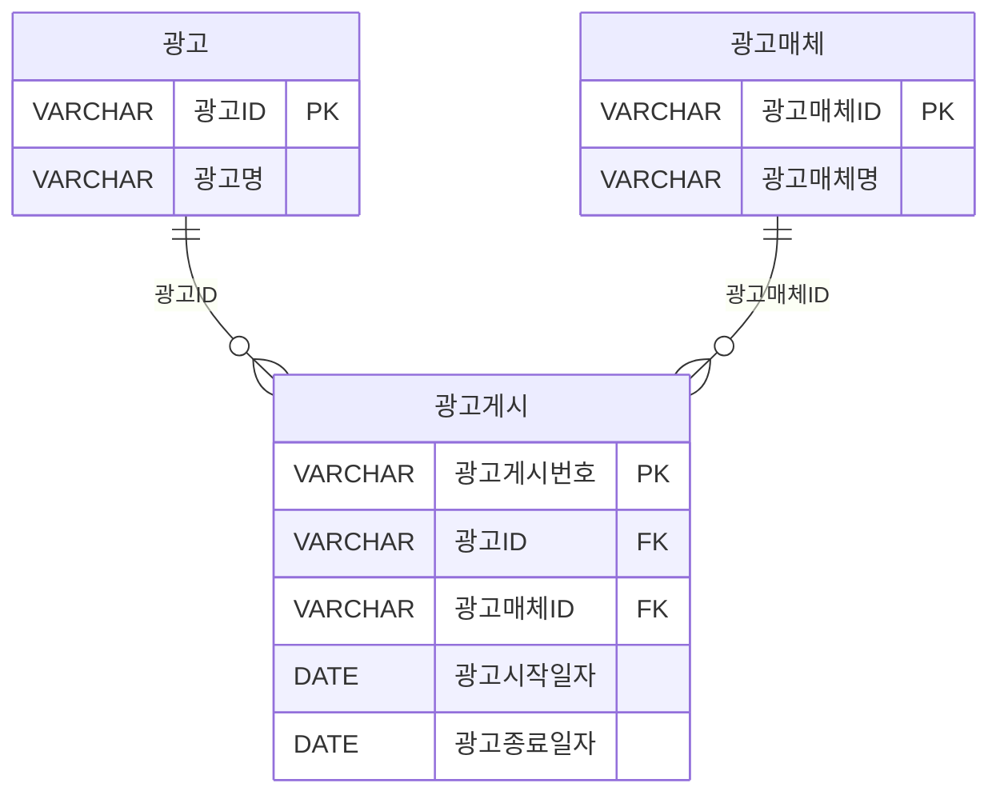

<style>
pre, code {
  white-space: pre-wrap !important;
  word-break: break-word !important;
  overflow-x: hidden !important;
  display: block !important;
  max-width: 100% !important;
  box-sizing: border-box !important;
}
</style> 

---
### SQL BASIC

| 구간 | 문제 번호 | 주제 | 난이도 |
|------|------------|------|--------|
| 1~10 | 001~010 | SQL 명령어 분류 및 기본 | ⭐ 초급 |
| 11~20 | 011~020 | 테이블 생성 및 제약조건 | ⭐⭐ 초~중급 |
| 21~30 | 021~030 | 관계 설정 및 트랜잭션 | ⭐⭐ 중급 |
| 31~40 | 031~040 | SELECT 조건 및 NULL 처리 | ⭐⭐⭐ 중~고급 |
| 41~50 | 041~050 | 고급 함수 및 날짜/CASE | ⭐⭐⭐ 고급 |
| 51~64 | 051~064 | 실전 SELECT + GROUP BY/HAVING + JOIN | ⭐⭐⭐⭐ 실무형 |


#### ✅ 51~64번: 실전 SELECT + GROUP BY/HAVING + JOIN
- 집계 함수와 조건 필터링, 정렬, 다중 테이블 JOIN 
- CASE + ORDER BY, 서브쿼리, 실행 순서 등 실무형 SQL
 

---
```bash
[문제 051]  
어느 기업의 직원 테이블(EMP)이 직급(GRADE) 별로 
사원 500명, 대리 100명, 과장 30명, 차장 10명, 부장 5명, 직급이 정해지지 않은(NULL) 사람 25명으로 구성되어 있을 때, 다음 중 SQL문을 SQL1)부터 SQL3)까지 순차적으로 실행한 결과 건수를 순서대로 나열한 것으로 가장 적절한 것은?
```
```sql
SQL1) SELECT COUNT(GRADE) FROM EMP;
SQL2) SELECT GRADE FROM EMP WHERE GRADE IN (차장', '부장', '널');
SQL3) SELECT GRADE, COUNT(*) FROM EMP GROUP BY GRADE:
```
```
① 670, 15, 5
② 645, 40, 5
③ 645, 15, 6
④ 670, 40, 6
```

**정답:** ③

🧸 **쉬운 해설:**  
'널'은 문자열이야! 실제 NULL은 제외돼!  
GROUP BY는 NULL도 하나의 그룹으로 포함돼!

**📚 전문 해설:**  
**SQL 처리 순서 한 줄씩 요약**
```
1️⃣ SQL1 → COUNT(GRADE) → NULL 제외 → 645명
2️⃣ SQL2 → '널'은 문자열 → 실제 NULL은 제외됨 → 차장(10) + 부장(5) = 15명
3️⃣ SQL3 → GROUP BY GRADE → NULL 포함 → 총 6개 그룹
```
###### 1️⃣ SQL1) SELECT COUNT(GRADE) FROM EMP;  
→ GRADE 컬럼에서 **NULL 제외하고 개수 세기** → 645명

###### 2️⃣ SQL2) SELECT GRADE FROM EMP WHERE GRADE IN ('차장', '부장', '널');  
→ '널'은 문자열이므로 **NULL은 포함되지 않음** → 차장(10명) + 부장(5명) = **15명**

###### 3️⃣ SQL3) SELECT GRADE, COUNT(*) FROM EMP GROUP BY GRADE;  
→ GRADE 기준으로 그룹화 → **NULL도 하나의 그룹으로 포함됨** → 총 **6개 그룹**


**보기 설명:**  
| 보기 번호 | 설명 | 적절성 |
|-----------|-------------------------------|--------|
| ① | NULL 포함 오해 | ❌ |
| ② | '널'을 NULL로 오해 | ❌ |
| ③ | 정확한 계산 | ✅ |
| ④ | COUNT에 NULL 포함 오해 | ❌ |

🧠 **기억법:**  
GROUP BY는 NULL도 그룹으로 포함됨  
'널'은 문자열이지 NULL이 아님

**필요 암기카드:**  
- 🃏 카드 33: COUNT(*) = 전체 행  
- 🃏 카드 25: HAVING = 그룹 필터


---
```bash
[문제 052]  
아래는 어느 회사의 광고에 대한 데이터 모델이다. 다음 중 광고매체 ID별 최초로 게시한 광고명과 광고시작일자를 출력하기 위하여 아래 [가]에 들어갈 SQL로 옳은 것은?
```


```sql
[SQL]
SELECT C.광고매체명, B.광고명, A.광고시작일자
FROM 광고게시 A, 광고 B, 광고매체 C,
     (         [가]            )   D
WHERE A.광고시작일자 = D.광고시작일자
AND   A.광고매체ID  = D.광고매체ID
AND   A.광고ID = B.광고ID
AND   A.광고매체ID = C.광고매체ID
ORDER BY C.광고매체명:
```

```sql
① SELECT D.광고매체ID, MIN(D.광고시작일자) AS 광고시작일자
FROM 광고게시 D
WHERE D.광고매체ID = C.광고매체ID
GROUP BY D.광고매체ID

② SELECT 광고매체ID, MIN(광고시작일자) AS 광고시작일자
FROM 광고게시
GROUP BY 광고매체ID

③ SELECT MIN(광고매체ID) AS 광고매체ID, MIN(광고시작일자) AS 광고시작일자
FROM 광고게시
GROUP BY 광고ID

④ SELECT MIN(광고매체ID) AS 광고매체ID, MIN(광고시작일자) AS 광고시작일자
FROM 광고게시
```

**정답:** ②

🧸 **쉬운 해설:**  
광고매체ID별로 그룹 지어서 가장 빠른 시작일자만 뽑으면 돼!

**📚 전문 해설:**  
**SQL 처리 순서 한 줄씩 요약**
```
SQL 처리 순서 한 줄씩 요약
1️⃣ 광고게시 테이블에서 광고매체ID별로 그룹핑
2️⃣ 각 그룹에서 MIN(광고시작일자) 추출
3️⃣ 외부 쿼리에서 JOIN하여 광고명과 매체명 연결
```

1️⃣ **서브쿼리 [가] 실행**  
→ 광고게시 테이블에서 광고매체ID별로 그룹화  
→ 각 그룹에서 가장 빠른 광고시작일자(MIN) 추출

```sql
SELECT 광고매체ID, MIN(광고시작일자) AS 광고시작일자
FROM 광고게시
GROUP BY 광고매체ID
```


2️⃣ **외부 쿼리에서 JOIN 조건 적용**  
→ 광고게시 A와 서브쿼리 D를 광고매체ID와 광고시작일자로 연결  
→ 해당 날짜에 최초로 게시된 광고만 선택됨


3️⃣ **광고명과 광고매체명 연결**  
→ 광고 B와 광고매체 C 테이블을 각각 광고ID, 광고매체ID로 JOIN


4️⃣ **최종 출력 컬럼 선택 및 정렬**  
→ 광고매체명, 광고명, 광고시작일자 출력  
→ 광고매체명 기준으로 정렬


🧠 **기억법:**  
GROUP BY + MIN → 그룹별 최초값

**필요 암기카드:**  
- 🃏 카드 24: GROUP BY = 묶기  
- 🃏 카드 25: HAVING = 그룹 필터


---
```bash
[문제 053]  
다음 중 오류가 발생하는 SQL 문장인 것은?
```
```sql
① SELECT 회원ID, SUM(주문금액) AS 합계
FROM 주문
GROUP BY 회원ID
HAVING COUNT(*) > 1;

② SELECT SUM(주문금액) AS 합계
FROM 주문
HAVING AVG(주문금액) > 100;

③ SELECT 메뉴ID, 사용유형코드, COUNT(*) AS CNT
FROM 시스템사용이력
WHERE 사용일시 BETWEEN SYSDATE - 1 AND SYSDATE
GROUP BY 메뉴ID, 사용유형코드
HAVING 메뉴ID = 3 AND 사용유형코드 = 100;

④ SELECT 메뉴ID, 사용유형코드, AVG(COUNT(*)) AS AVGCNT
FROM 시스템사용이력
GROUP BY 메뉴ID, 사용유형코드:
```


**정답:** ④

🧸 **쉬운 해설:**  
COUNT(*)는 집계 함수인데, 그걸 또 AVG로 감싸면 안 돼!

**📚 전문 해설:**  
```
SQL 처리 순서 한 줄씩 요약
1️⃣ GROUP BY로 메뉴ID, 사용유형코드별 집계
2️⃣ COUNT(*)는 집계 함수
3️⃣ AVG(COUNT(*))는 집계 함수 안에 집계 함수 → 문법 오류
```

**보기 설명:**  
| 보기 번호 | 설명 | 적절성 |
|-----------|-------------------------------|--------|
| ① | 정상 | ✅ |
| ② | HAVING 단독 사용 가능 | ✅ |
| ③ | HAVING에서 조건 필터 가능 | ✅ |
| ④ | 집계 함수 중첩 오류 | ❌ |

🧠 **기억법:**  
집계 함수 안에 또 집계 함수는 ❌

**필요 암기카드:**  
- 🃏 카드 25: HAVING = 그룹 필터  
- 🃏 카드 33: COUNT(*) = 전체 행


---
```bash
[문제 054]  
다음 중 아래와 같은 테이블 A에 대해서 SQL을 수행하였을 때의 결과로 가장 적절한 것은?
```
```sql
CREATE TABLE A
(
가 VARCHAR(5) PRIMARY KEY,
나 VARCHAR(5) NOT NULL,
다 INT NOT NULL
);
```

[테이블 : A]

| 가   | 나    | 다   |
|------|-------|------|
| 001  | A001  | 100  |
| 002  | A001  | 200  |
| 003  | A002  | 100  |
| 004  | A002  | 200  |
| 005  | A002  | 200  |
| 006  | A003  | 100  |
| 007  | A003  | 200  |
| 008  | A003  | 100  |
| 009  | A003  | 200  |
| 010  | A004  | 300  |
 

```sql
[SQL]
SELECT MAX(가) AS 가, 나, SUM(다) AS 다
FROM A
GROUP BY 나
HAVING COUNT(*) > 1
ORDER BY 다 DESC:
```


######  ①
| 가   | 나    | 다   |
|------|-------|------|
| 009  | A003  | 600  |
| 005  | A002  | 500  |
 

######  ②
| 가   | 나    | 다   |
|------|-------|------|
| 009  | A003  | 600  |
| 005  | A002  | 500  |
| 002  | A001  | 300  |
 

###### ③
| 가   | 나    | 다   |
|------|-------|------|
| 009  | A003  | 600  |
| 005  | A002  | 500  |
| 002  | A001  | 300  |
| 010  | A004  | 200  |
 
④ 위의 SQL은 SELECT 절에 COUNT를 사용하지 않았으므로, HAVING
절에서 오류가 발생한다.


**정답:** ②

🧸 **쉬운 해설:**  
COUNT(*) > 1 조건이니까 A004는 제외돼!  
A001, A002, A003만 남고 다 합산해서 정렬!


**📚 전문 해설:**  

**SQL 처리 순서 한 줄씩 요약**
``` 
1️⃣ GROUP BY 나 → A001, A002, A003, A004
2️⃣ HAVING COUNT(*) > 1 → A004 제외
3️⃣ SELECT MAX(가), 나, SUM(다) → 각 그룹의 최대 가, 합계 다
4️⃣ ORDER BY 다 DESC → 다 기준 내림차순 정렬
```

1️⃣ **FROM A**  
→ 테이블 A의 모든 행을 조회

2️⃣ **GROUP BY 나**  
→ 나 컬럼 기준으로 그룹화  
→ 그룹: A001, A002, A003, A004

3️⃣ **HAVING COUNT(*) > 1**  
→ 각 그룹의 행 수가 2개 이상인 것만 필터링  
→ A004는 1개 → 제외됨  
→ 남는 그룹: A001(2), A002(3), A003(4)

4️⃣ **SELECT MAX(가), 나, SUM(다)**  
→ 각 그룹에서  
  - MAX(가): 가장 큰 가 값  
  - SUM(다): 다 컬럼의 합계  
→ 결과:  
  - A001 → MAX(가)=002, SUM(다)=300  
  - A002 → MAX(가)=005, SUM(다)=500  
  - A003 → MAX(가)=009, SUM(다)=600

5️⃣ **ORDER BY 다 DESC**  
→ 다 합계 기준으로 내림차순 정렬  
→ 순서: A003(600), A002(500), A001(300)


**보기 설명:**  
| 보기 번호 | 설명 | 적절성 |
|-----------|-------------------------------|--------|
| ① | A001 누락 | ❌ |
| ② | 정확한 그룹 필터링 및 정렬 | ✅ |
| ③ | A004 포함 오류 | ❌ |
| ④ | HAVING COUNT 사용 가능 | ❌ |

🧠 **기억법:**  
HAVING은 GROUP BY 이후 조건 필터링

**필요 암기카드:**  
- 🃏 카드 25: HAVING = 그룹 필터  
- 🃏 카드 33: COUNT(*) = 전체 행


---

```bash
[문제 055]  
다음 중 아래 SQL의 실행결과로 가장 적절한 것은?
```

TBL

| ID  |
|-----|
| 100 |
| 100 |
| 200 |
| 200 |
| 200 |
| 999 |
| 999 |

```sql
SELECT ID FROM TBL
GROUP BY ID
HAVING COUNT(*) = 2
ORDER BY (CASE WHEN ID = 999 THEN O ELSE ID END)
```


 ①
| ID  |
|-----|
| 100 |
| 999 |


②

| ID  |
|-----|
| 999 |
| 100 |


 ③
| ID  |
|-----|
| 100 |
| 200 |
| 999 |

 ④

| ID  |
|-----|
| 999 |
| 200 |
| 100 |
  
**정답:** ②

🧸 **쉬운 해설:**  
COUNT(*) = 2 조건이니까 100과 999만 남아!  
CASE 정렬에서 999는 0으로 바뀌니까 먼저 나와!

**📚 전문 해설:**  
SQL 처리 순서 한 줄씩 요약 
``` 
1️⃣ GROUP BY ID → 그룹: 100(2), 200(3), 999(2)  
2️⃣ HAVING COUNT(*) = 2 → 100, 999만 남음  
3️⃣ ORDER BY CASE → 999 → 0, 100 → 100 → 999 먼저 출력
```

1️⃣ FROM TBL → 테이블 TBL의 모든 행을 조회
2️⃣ GROUP BY ID → ID 기준으로 그룹화 → 그룹:   - 100 → 2개   - 200 → 3개   - 999 → 2개
3️⃣ HAVING COUNT(*) = 2 → 그룹 중에서 행 수가 2개인 것만 필터링 → 남는 그룹: 100, 999
4️⃣ SELECT ID → 각 그룹의 ID만 출력
5️⃣ ORDER BY (CASE WHEN ID = 999 THEN 0 ELSE ID END) → 정렬 기준:   - 999 → 0   - 100 → 100 → 999가 먼저, 그 다음 100


🧠 **기억법:**  
CASE 정렬은 치환된 값 기준으로 정렬됨

**필요 암기카드:**  
- 🃏 카드 25: HAVING = 그룹 필터  
- 🃏 카드 43: CASE 문 실전 예시


---
```bash
[문제 056] 
다음 SQL 중 오류가 발생하는 것은?
```
```sql
① SELECT 지역, SUM(매출금액) AS 매출금액
FROM 지역별매출
GROUP BY 지역
ORDER BY 매출금액 DESC;

② SELECT 지역, 매출금액
FROM 지역별매출
ORDER BY 년 ASC;

③ SELECT 지역, SUM(매출금액) AS 매출금액
FROM 지역별매출
GROUP BY 지역
ORDER BY 년 DESC;

④ SELECT 지역, SUM(매출금액) AS 매출금액
FROM 지역별매출
GROUP BY 지역
HAVING SUM(매출금액) > 1000
ORDER BY COUNT(*) ASC;
```


**정답:** ③

🧸 **쉬운 해설:**  
GROUP BY 지역 했는데 ORDER BY에 없는 컬럼인 '년'을 쓰면 오류야!

**📚 전문 해설:**  
```
SQL 처리 순서 한 줄씩 요약  
1️⃣ GROUP BY 지역 → 집계 수행  
2️⃣ ORDER BY 년 → GROUP BY에 포함되지 않은 컬럼 사용 → 오류 발생
```

**보기 설명:**  
| 보기 번호 | 설명 | 적절성 |
|-----------|-------------------------------|--------|
| ① | 집계 컬럼 정렬 가능 | ✅ |
| ② | 컬럼 존재 → 정렬 가능 | ✅ |
| ③ | GROUP BY에 없는 컬럼 정렬 → 오류 | ❌ |
| ④ | HAVING 후 정렬 가능 | ✅ |

🧠 **기억법:**  
ORDER BY는 GROUP BY에 포함된 컬럼만 사용 가능

**필요 암기카드:**  
- 🃏 카드 57: ORDER BY = 정렬 기준

---
```bash
[문제 057]  
다음 중 ORDER BY 절에 대한 설명으로 가장 부적절한 것은?

① SQL 문장으로 조회된 데이터들을 다양한 목적에 맞게 특정 컬럼을 기준으로 정렬하는데 사용한다.
② DBMS마다 NULL 값에 대한 정렬 순서가 다를 수 있으므로 주의하여야 한다.
③ ORDER BY 절에서 컬럼명 대신 Alias 명이나 컬럼 순서를 나타내는 정수도 사용이 가능하나, 이들을 혼용하여 사용할 수 없다.
④ GROUP BY 절을 사용하는 경우 ORDER BY 절에 집계 함수를 사용할 수도 있다.
```


**정답:** ③

🧸 **쉬운 해설:**  
ORDER BY에서는 컬럼명, 별칭, 순서번호 다 같이 써도 돼!

**📚 전문 해설:**  
ORDER BY 절에서는 다음이 모두 사용 가능:  
- 컬럼명  
- 별칭  
- SELECT 절의 컬럼 순서 번호  
→ 혼용 가능

**보기 설명:**  
| 보기 번호 | 설명 | 적절성 |
|-----------|-------------------------------|--------|
| ① | 기본 기능 설명 | ✅ |
| ② | NULL 정렬 주의 필요 | ✅ |
| ③ | 혼용 불가 → 틀림 | ❌ |
| ④ | 집계 함수 정렬 가능 | ✅ |

🧠 **기억법:**  
ORDER BY = 컬럼명 / 별칭 / 순서번호 모두 가능

**필요 암기카드:**  
- 🃏 카드 57: ORDER BY = 정렬 기준

---
```bash
[문제 058] 
다음 SQL의 실행 결과로 가장 적절한 것은?
```
TBL

| ID | AMT |
|----|-----|
| A  | 50  |
| A  | 200 |
| B  | 300 |
| C  | 100 |

```sql
[SQL]
SELECT ID, AMT
FROM TBL
ORDER BY (CASE WHEN ID = 'A' THEN 1 ELSE 2 END),
AMT DESC
```
 
①
| ID | AMT |
|----|-----|
| B  | 300 |
| A  | 200 |
| C  | 100 |
| A  | 50  |


②
| ID | AMT |
|----|-----|
| A  | 200 |
| A  | 50  |
| B  | 300 |
| C  | 100 |

③
| ID | AMT |
|----|-----|
| A  | 50  |
| C  | 100 |
| A  | 200 |
| B  | 300 |


 ④
| ID | AMT |
|----|-----|
| B  | 300 |
| A  | 200 |
| A  | 50  |
| C  | 100 | 


**정답:** ②

🧸 **쉬운 해설:**  
CASE로 A는 1, 나머지는 2 → A 먼저  
AMT DESC니까 A 중에서 큰 금액 먼저!

**📚 전문 해설:**  
```
SQL 처리 순서 한 줄씩 요약  
1️⃣ CASE 정렬 → A = 1, B/C = 2 → A 먼저  
2️⃣ AMT DESC → A 중에서 200, 50 순서  
3️⃣ 나머지 B(300), C(100) 순서로 출력
```
**SQL 처리 순서 한 줄씩 요약**
특정 조건(ID='A')을 우선 정렬하고, 
그 안에서 금액을 내림차순으로 정렬하는 전형적인 **조건 기반 정렬** 예제
 
1️⃣ **FROM TBL**  
→ 테이블 TBL의 모든 행을 조회  
→ 결과:  
  - A, 50  
  - A, 200  
  - B, 300  
  - C, 100

2️⃣ **ORDER BY (CASE WHEN ID = 'A' THEN 1 ELSE 2 END), AMT DESC**  
→ 정렬 기준 1: ID가 'A'이면 1, 아니면 2  
→ 정렬 기준 2: AMT 내림차순


📊 정렬 단계별 결과
- ID가 'A'인 행들 먼저 (CASE 결과 = 1):  
  - A, 200  
  - A, 50

- 그 외 ID들 (CASE 결과 = 2), AMT 내림차순:  
  - B, 300  
  - C, 100

🎯 최종 출력 결과

| ID | AMT |
|----|-----|
| A  | 200 |
| A  | 50  |
| B  | 300 |
| C  | 100 | 

**보기 설명:**  
| 보기 번호 | 설명 | 적절성 |
|-----------|-------------------------------|--------|
| ① | 정렬 순서 오류 | ❌ |
| ② | 정확한 CASE + 금액 정렬 | ✅ |
| ③ | AMT 정렬 오류 | ❌ |
| ④ | CASE 정렬 오류 | ❌ |

🧠 **기억법:**  
CASE → 그룹 우선  
AMT DESC → 금액 큰 순서

**필요 암기카드:**  
- 🃏 카드 43: CASE 문 실전 예시  
- 🃏 카드 57: ORDER BY = 정렬 기준


---

```bash
[문제 059] 
 다음 중 SELECT 문장의 실행 순서를 올바르게 나열한 것은?

① SELECT-FROM-WHERE-GROUP BY-HAVING-ORDER BY
② FROM-SELECT-WHERE-GROUP BY-HAVING-ORDER BY
③ FROM-WHERE-GROUP BY-HAVING-ORDER BY - SELECT
④ FROM-WHERE-GROUP BY-HAVING-SELECT-ORDER BY
```

**정답:** ④

🧸 **쉬운 해설:**  
실행 순서는 FROM부터 시작해서 SELECT는 거의 마지막이야!

**📚 전문 해설:**  
SQL 내부 처리 순서:  
1️⃣ FROM  
2️⃣ WHERE  
3️⃣ GROUP BY  
4️⃣ HAVING  
5️⃣ SELECT  
6️⃣ ORDER BY

**보기 설명:**  
| 보기 번호 | 설명 | 적절성 |
|-----------|-------------------------------|--------|
| ① | SELECT 먼저 → 틀림 | ❌ |
| ② | SELECT가 두 번째 → 틀림 | ❌ |
| ③ | SELECT가 마지막 아님 | ❌ |
| ④ | 정확한 실행 순서 | ✅ |

🧠 **기억법:**  
FROM → WHERE → GROUP → HAVING → SELECT → ORDER

**필요 암기카드:**  
- 🃏 카드 59: SQL 실행 순서


---

```bash
[문제 060]  
아래의 팀별성적 테이블에서 승리건수가 높은 순으로 3위까지 출력하되 3위의 승리건수가 동일한 팀이 있다면 함께 출력하기 위한 SQL 문장으로 올바른 것은?
```
[테이블: 팀별성적]

| 팀명 | 승리건수 | 패배건수 |
|------|-----------|-----------|
| A팀 | 120       | 80        |
| B팀 | 20        | 180       |
| C팀 | 10        | 190       |
| D팀 | 100       | 100       |
| E팀 | 110       | 90        |
| F팀 | 100       | 100        |
| G팀 | 70        | 130       |

```sql
① SELECT TOP(3) 팀명, 승리건수
FROM 팀별성적
ORDER BY 승리건수 DESC;

② SELECT TOP(3) 팀명, 승리건수
FROM 팀별성적;

③ SELECT 팀명, 승리건수
FROM 팀별성적
WHERE ROWNUM <= 3
ORDER BY 승리건수 DESC;

④ SELECT TOP(3) WITH TIES 팀명, 승리건수
FROM 팀별성적
ORDER BY 승리건수 DESC:
```

**정답:** ④

🧸 **쉬운 해설:**  
WITH TIES는 3위와 동점인 팀도 같이 출력해줘!  
승리건수 기준으로 정렬된 후 동점자까지 포함돼!

**📚 전문 해설:**  
SQL은 **TOP(n) WITH TIES**를 활용해 **동점자까지 포함하는 정렬 기반 추출**을 수행하는 대표적인 예제
```
1️⃣ ORDER BY 승리건수 DESC → 승리 많은 순서로 정렬  
2️⃣ TOP(3) WITH TIES → 3번째 승리건수와 같은 팀도 포함  
→ A팀(120), E팀(110), D팀(100), F팀(100) → 총 4팀 출력
```

1️⃣ **FROM 팀별성적**  
→ 테이블의 모든 행을 조회

2️⃣ **ORDER BY 승리건수 DESC**  
→ 승리건수 기준으로 내림차순 정렬  
→ 정렬 결과:  
  - A팀 (120)  
  - E팀 (110)  
  - D팀 (100)  
  - F팀 (100)  
  - G팀 (70)  
  - B팀 (20)  
  - C팀 (10)

3️⃣ **SELECT TOP(3) WITH TIES 팀명, 승리건수**  
→ 상위 3개 행을 선택하되, **3번째 승리건수와 동일한 값이 있는 행도 함께 포함**  
→ 3위 승리건수 = 100 → D팀, F팀 모두 포함


**보기 설명:**  
| 보기 번호 | 설명 | 적절성 |
|-----------|-------------------------------|--------|
| ① | TOP(3)만 출력 → 동점자 제외   | ❌ |
| ② | TOP(3)만 출력 → 정렬 없음   | ❌ |
| ③ | ROWNUM 사용 → 동점자 포함 안 됨   | ❌ |
| ④ | TOP(3) WITH TIES → 동점자 포함 | ✅ |

* WITH TIES → "동점자도 같이 데려와!"
* ROWNUM → "Oracle은 정렬 전에 번호 붙여!"
* LIMIT → "그냥 위에서 N개만 잘라!"

🧠 **기억법:**  
WITH TIES = 동점자 포함

**필요 암기카드:**  
- 🃏 카드 57: ORDER BY = 정렬 기준  
- 🃏 카드 43: CASE 문 실전 예시


---

```bash
[문제 061]  
다음 중 5개의 테이블로부터 필요한 칼럼을 조회하려고 할 때, 최소 몇 개의 JOIN 조건이 필요한가?

① 2개
② 3개
③ 4개
④ 5개
```


**정답:** ③

🧸 **쉬운 해설:**  
테이블이 5개면 연결하려면 4개의 JOIN 조건이 필요해!  
각 테이블을 하나씩 이어 붙이는 구조야!

**📚 전문 해설:**  
5개의 테이블을 모두 연결하려면  
→ 1 ↔ 2 ↔ 3 ↔ 4 ↔ 5 → 총 4개의 JOIN 조건 필요

**보기 설명:**  
| 보기 번호 | 설명 | 적절성 |
|-----------|-------------------------------|--------|
| ① | 연결 부족 | ❌ |
| ② | 연결 부족 | ❌ |
| ③ | 정확한 연결 수 | ✅ |
| ④ | 과다 연결 | ❌ |

🧠 **기억법:**  
N개의 테이블 → N-1개의 JOIN 필요

**필요 암기카드:**  
- 🃏 카드 41: JOIN 유형  
- 🃏 카드 42: 서브쿼리 유형

---

```bash
[문제 062]  
아래의 영화 데이터베이스 테이블의 일부에서 밑줄 친 속성들은 테이블의 기본키이며 출연료가 8888 이상인 영화명, 배우명, 출연료를 구하는 SQL로 가장 적절한 것은?
```

배우(<u>배우번호</u>, 배우명, 성별)
영화(<u>영화번호</u>, 영화명, 제작년도)
출연(<u>배우번호, 영화번호</u>, 출연료)

```sql
① SELECT 출연, 영화명, 영화, 배우명, 출연, 출연료
FROM 배우, 영화, 출연
WHERE 출연료 >= 8888
AND 출연.영화번호 = 영화.영화번호
AND 출연.배우번호 = 배우.배우번호:

② SELECT 영화, 영화명, 배우, 배우명, 출연료
FROM 영화, 배우, 출연
WHERE 출연, 출연료 > 8888
AND   출연.영화번호 = 영화.영화번호
AND   영화.영화번호 = 배우.배우번호;

③ SELECT 영화명, 배우명, 출연료
FROM 배우, 영화, 출연
WHERE 출연료 >= 8888
AND 영화번호 = 영화.영화번호
AND 배우번호 = 배우.배우번호:

④ SELECT 영화, 영화명, 배우, 배우명, 출연료
FROM 배우, 영화, 출연
WHERE 출연료 >= 8888
AND 출연.영화번호 = 영화.영화번호
AND 출연.배우번호 = 배우.배우번호;
```

**정답:** ④

🧸 **쉬운 해설:**  
출연 테이블에서 출연료 조건 걸고, 영화와 배우 테이블을 JOIN하면 돼!

**📚 전문 해설:**  
SQL 처리 순서 한 줄씩 요약 
``` 
1️⃣ 출연 테이블에서 출연료 ≥ 8888 조건 필터  
2️⃣ 출연.영화번호 = 영화.영화번호 → 영화명 연결  
3️⃣ 출연.배우번호 = 배우.배우번호 → 배우명 연결  
4️⃣ SELECT 영화명, 배우명, 출연료 출력
```

**보기 설명:**  
| 보기 번호 | 설명 | 적절성 |
|-----------|-------------------------------|--------|
| ① | SELECT 문법 오류 | ❌ |
| ② | 조건 위치 오류 | ❌ |
| ③ | JOIN 누락 | ❌ |
| ④ | 정확한 JOIN + 조건 | ✅ |

🧠 **기억법:**  
JOIN은 PK ↔ FK 연결  
조건은 WHERE에서 필터링

**필요 암기카드:**  
- 🃏 카드 41: JOIN 유형  
- 🃏 카드 42: 서브쿼리 유형


---
```bash
[문제 063]
다음 중 아래에서 Join에 대한 설명으로 가장 적절한 것은?
```
```sql
가) 일반적으로 Join은 PK와 FK 값의 연관성에 의해 성립된다.
나) DBMS 옵티마이져는 From 절에 나열된 테이블들을 임의로 3개 정도씩 묶어서 Join을 처리한다.
다) EQUI Join은 Join에 관여하는 테이블 간의 컬럼 값들이 정확하게 일치하는 경우에 사용되는 방법이다.
라) EQUI Join은 '=' 연산자에 의해서만 수행되며, 그 이외의 비교 연산자를 사용하는 경우에는 모두 Non EQUI Join이다.
마) 대부분 Non EQUI Join을 수행할 수 있지만, 때로는 설계상의 이유로 수행이 불가능한 경우도 있다.
```

① 가, 다, 라
② 가, 나, 다
③ 가, 나, 다, 라
④ 가, 다, 라, 마


**정답:** ④

🧸 **쉬운 해설:**  
JOIN은 PK-FK로 연결되고, '='이면 EQUI JOIN!  
그 외 비교는 Non-EQUI JOIN이고, 설계상 불가능할 수도 있어!

**📚 전문 해설:**  
- 가) PK-FK 관계로 JOIN 성립 → 맞음  
- 다) '=' 연산자 → EQUI JOIN → 맞음  
- 라) '>', '<' 등 → Non-EQUI JOIN → 맞음  
- 마) 설계상 불가능한 경우 있음 → 맞음

🧠 **기억법:**  
EQUI = '='  
Non-EQUI = 비교 연산자

**필요 암기카드:**  
- 🃏 카드 41: JOIN 유형  
- 🃏 카드 42: 서브쿼리 유형


---
```bash
[문제 064]  
다음 SQL의 실행 결과로 맞는 것은? 
```
[EMP_TBL]
| EMPNO | ENAME |
|-------|--------|
| 1000  | SMITH  |
| 1050  | ALLEN  |
| 1100  | SCOTT  |

[RULE_TBL]
| RULE_NO | RULE  |
|---------|-------|
| 1       | S%    |
| 2       | %T%   |


```sql
[SQL]
SELECT COUNT(*) CNT
FROM EMP_TBL A, RULE_TBL B
WHERE A, ENAME LIKE B.RULE
```
```
① 0
② 2
③ 4
④ 6
```
 

**정답:** ③

🧸 **쉬운 해설:**  
LIKE 조건이 두 RULE에 대해 각각 적용돼서  
SMITH는 S%, SCOTT은 %T% → 각각 2건씩 매칭돼서 총 4건이야!

**📚 전문 해설:**  
SQL 처리 순서 한 줄씩 요약  
```
1️⃣ EMP_TBL × RULE_TBL → 3명 × 2규칙 = 6건 조합  
2️⃣ WHERE A.ENAME LIKE B.RULE → 조건 만족하는 조합만 남김  
   - SMITH는 'S%'에 매칭됨  
   - SCOTT은 '%T%'에 매칭됨  
→ SMITH: 1규칙 만족 → 1건  
→ SCOTT: 2규칙 모두 만족 → 2건  
→ ALLEN은 어떤 규칙에도 매칭되지 않음  
→ 총 4건 매칭됨
```


1️⃣ **FROM EMP_TBL A, RULE_TBL B**  
→ 두 테이블 간 **카티션 곱(Cartesian Product)** 수행  
→ EMP_TBL(3행) × RULE_TBL(2행) = 총 **6행 생성**
※ 두 테이블의 모든 행을 서로 조합한 결과 → 테이블 A의 각 행 × 테이블 B의 각 행

2️⃣ **WHERE A.ENAME LIKE B.RULE**  
→ 각 조합에 대해 **ENAME**이 **RULE** 패턴과 일치하는지 검사  
→ 각 조합을 하나씩 비교:

| ENAME  | RULE  | LIKE 결과 |
|--------|-------|------------|
| SMITH  | S%    | ✅ (S로 시작)  
| SMITH  | %T%   | ✅ (T 포함)  
| ALLEN  | S%    | ❌  
| ALLEN  | %T%   | ❌  
| SCOTT  | S%    | ✅ (S로 시작)  
| SCOTT  | %T%   | ✅ (T 포함)  

→ 총 **4건** 일치

3️⃣ **SELECT COUNT(*) CNT**  
→ 조건을 만족하는 행 수 세기 → **4**


**보기 설명:**  
| 보기 번호 | 설명 | 적절성 |
|-----------|-------------------------------|--------|
| ① | 조건 미충족 오해 | ❌ |
| ② | 일부 매칭만 고려 | ❌ |
| ③ | 정확한 매칭 수 | ✅ |
| ④ | 전체 조합 수 오해 | ❌ |

🧠 **기억법:**  
LIKE 조건은 규칙마다 따로 적용됨  
조인 후 조건 만족하는 행만 COUNT됨

**필요 암기카드:**  
- 🃏 카드 26: 서브쿼리 = 쿼리 속 쿼리  
- 🃏 카드 33: COUNT(*) = 전체 행  
- 🃏 카드 41: JOIN 유형  
- 🃏 카드 43: CASE 문 실전 예시