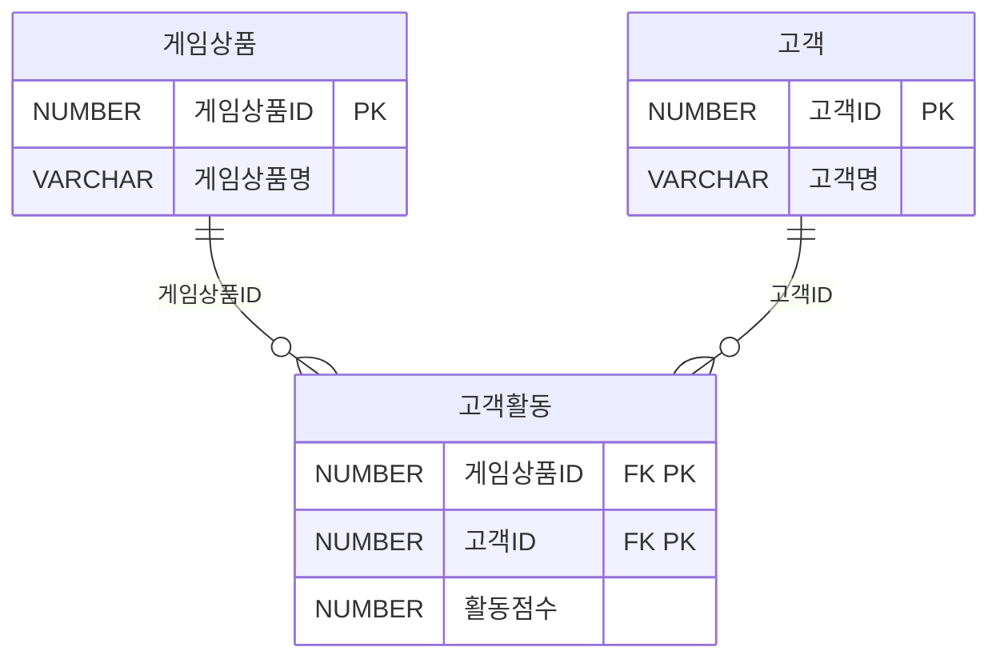

<style>
pre, code {
  white-space: pre-wrap !important;
  word-break: break-word !important;
  overflow-x: hidden !important;
  display: block !important;
  max-width: 100% !important;
  box-sizing: border-box !important;
}
</style> 

---

### 📁 SQL USING

| 구간   | 문제 번호 | 주제                                      | 난이도     |
|--------|------------|-------------------------------------------|------------|
| 1~15   | 065~079    | 관계 연산자, JOIN 실무, 집합 연산자       | ⭐⭐ 초~중급 |
| 16~30  | 080~094    | INTERSECT, EXCEPT, 계층형 질의            | ⭐⭐⭐ 중~고급 |
| 31~45  | 095~109    | 집합 연산자, JOIN 조건, 서브쿼리 활용     | ⭐⭐⭐ 고급    |
| 46~63  | 110~127    | 실무형 SQL 로직, 집계, 조건부 연산        | ⭐⭐⭐⭐ 실무형 |


#### ✅ 46~63번 (110~127): 실무형 SQL 로직, 집계, 조건부 연산  
- 조건부 집계, 서브쿼리 필터링, 복잡한 JOIN 조합을 실무 사례로 학습합니다.  
- SQL 성능, 정렬 우선순위, 집계 함수 조합까지 고급 SQL 로직을 익힙니다.

 

---
```bash
[문제 110]  
자재발주 테이블에 SQL을 수행하여 아래와 같은 결과를 얻었다. 다음 중에 (가) 들어갈 문장으로 옳은 것은?
```
[테이블 1: 자재발주]
| 자재번호 | 발주처ID | 발주일자 | 발주수량 |
|----------|-----------|------------|-----------|
| 1      | 001       | 20150102   | 100       |
| 1      | 001       | 20150103   | 200       |
| 2      | 001       | 20150102   | 200       |
| 2      | 002       | 20150102   | 100       |
| 3      | 001       | 20150103   | 100       |
| 3      | 002       | 20150103   | 200       |

```sql
[SQL]
SELECT CASE WHEN GROUPING(자재번호) = 1 THEN '자재전체'
        ELSE 자재번호 END AS 자재번호
     , CASE WHEN GROUPING(발주처ID) = 1 THEN '발주처전체'
        ELSE 발주처ID END AS 발주처ID
     , CASE WHEN GROUPING(발주일자) = 1 THEN '발주일자전체'
        ELSE 발주일자 END AS 발주일자
     , SUM(발주수량) AS 발주수량합계
FROM 자재발주
(가)
ORDER BY 자재번호, 발주처ID, 발주일자
```
[테이블 2: 결과]
| 자재번호   | 발주처ID     | 발주일자     | 발주수량합계 |
|------------|--------------|--------------|---------------|
| 1             | 발주처전체   | 발주일자전체 | 300           |
| 2             | 발주처전체   | 발주일자전체 | 300           |
| 3             | 발주처전체   | 발주일자전체 | 300           |
| 자재전체   | 001             | 20150102     | 300           |
| 자재전체   | 001             | 20150103     | 300           |
| 자재전체   | 002             | 20150102     | 100           |
| 자재전체   | 002             | 20150103     | 200           |
```sql
① GROUP BY CUBE (자재번호, (발주처ID, 발주일자))
② GROUP BY CUBE (자재번호, 발주처ID, 발주일자)
③ GROUP BY GROUPING SETS (자재번호, 발주처ID, 발주일자)
④ GROUP BY GROUPING SETS (자재번호, (발주처ID, 발주일자))
```
**✅ 정답:** ④ GROUPING SETS (자재번호, (발주처ID, 발주일자))

🧸 **쉬운 해설:**  
자재번호별 전체 합계와 발주처ID+발주일자 조합별 합계를 따로 구해야 해요!

📚 **전문 해설:**  
- CUBE는 모든 조합을 집계하지만, 문제는 특정 조합만 요구  
- GROUPING SETS는 원하는 조합만 집계 가능  
- (자재번호), (발주처ID, 발주일자) → 정확한 조합


###### ✅ 전체 SQL (정답 기준)

```sql
SELECT 
  CASE WHEN GROUPING(자재번호) = 1 THEN '자재전체' ELSE 자재번호 END AS 자재번호,
  CASE WHEN GROUPING(발주처ID) = 1 THEN '발주처전체' ELSE 발주처ID END AS 발주처ID,
  CASE WHEN GROUPING(발주일자) = 1 THEN '발주일자전체' ELSE 발주일자 END AS 발주일자,
  SUM(발주수량) AS 발주수량합계
FROM 자재발주
GROUP BY GROUPING SETS (
  (자재번호),
  (발주처ID, 발주일자)
)
ORDER BY 자재번호, 발주처ID, 발주일자;
```

###### 🧠 SQL 처리 순서 한 줄씩 설명

###### 1️⃣ **FROM 자재발주**

- 자재발주 테이블의 전체 데이터를 대상으로 시작합니다. 

###### 2️⃣ **GROUP BY GROUPING SETS ((자재번호), (발주처ID, 발주일자))**

- 두 가지 그룹핑 조합을 명시적으로 지정합니다:
  - **(자재번호)** → 자재별 전체 발주량 합계
  - **(발주처ID, 발주일자)** → 발주처와 일자 조합별 발주량 합계
- 이 방식은 **ROLLUP**이나 **CUBE**처럼 모든 조합을 계산하지 않고, **필요한 조합만 정확히 집계**합니다.

###### 3️⃣ **SUM(발주수량)**

- 각 그룹에 대해 발주수량을 합산합니다.
- 예:
  - 자재번호 1 → 100 + 200 = 300
  - 발주처ID 001, 발주일자 20150102 → 100 + 200 = 300

###### 4️⃣ **GROUPING(컬럼)** 함수들

- **GROUPING(자재번호)** = 1 → 자재번호가 NULL인 집계행 (즉, 자재전체)
- **GROUPING(발주처ID)** = 1 → 발주처ID가 NULL인 집계행 (즉, 발주처전체)
- **GROUPING(발주일자)** = 1 → 발주일자가 NULL인 집계행 (즉, 발주일자전체)

➡ 이 값들을 이용해 **CASE WHEN**으로 라벨링합니다.

###### 5️⃣ **SELECT ...**

- 각 그룹의 결과를 출력합니다.
- **GROUPING** 결과에 따라 '자재전체', '발주처전체', '발주일자전체' 등의 라벨이 붙습니다.

###### 6️⃣ **ORDER BY 자재번호, 발주처ID, 발주일자**

- 결과를 자재번호 → 발주처ID → 발주일자 순으로 정렬합니다.
- NULL은 정렬상 가장 마지막 또는 처음에 위치할 수 있음 (DBMS에 따라 다름)

###### 📌 핵심 요약

| 처리 단계 | 설명 |
|-----------|------|
| **GROUPING SETS** | 자재번호별 + (발주처ID, 발주일자)별 집계 |
| **GROUPING()** | NULL 여부로 소계/합계 판단 |
| **SUM()** | 발주수량 합산 |
| **CASE** | 라벨링 처리 |
| **ORDER BY** | 정렬 기준 적용 |
 
| 보기 번호 | 설명 | 적절성 |
|-----------|-------------------------------|--------|
| ① | 중첩 CUBE → 과도한 집계 | ❌ |
| ② | 전체 조합 → 과도함 | ❌ |
| ③ | 단일 컬럼만 집계 | ❌ |
| ④ | 정확한 조합만 집계 | ✅ |

🧠 **기억법:**  
GROUPING SETS = 원하는 조합만 집계

🃏 관련 암기카드  
- 🃏 카드 24: GROUP BY  
- 🃏 카드 43: 윈도우 함수 예시


---

```bash
[문제 111] 
다음 중 월별매출 테이블을 대상으로 아래 SQL을 수행한 결과인 것은?
```

[테이블 1: 제품 매출현황]
| 상품ID | 일자     | 매출액 |
|--------|----------|--------|
| P001   | 2014.10  | 1500   |
| P001   | 2014.11  | 1600   |
| P001   | 2014.12  | 2500   |
| P002   | 2014.10  | 1000   |
| P002   | 2014.11  | 2000   |
| P002   | 2014.12  | 1500   |
| P003   | 2014.10  | 2000   |
| P003   | 2014.11  | 1000   |
| P003   | 2014.12  | 1000   |

```sql
[SQL]
SELECT 상품ID, 월, SUM(매출액) AS 매출액
FROM  월별매출
WHERE 월 BETWEEN '2014.10' AND '2014.12'
GROUP BY GROUPING SETS((상품ID, 월));
```


①
| 상품ID | 일자     | 매출액 |
|--------|----------|--------|
| NULL   | 2014.10  | 4500   |
| NULL   | 2014.11  | 4500   |
| NULL   | 2014.12  | 5000   |
| P001   | NULL  | 5500   |
| P002   | NULL  | 4500   |
| P003   | NULL  | 4000   |
 
 
②
| 상품ID | 일자     | 매출액 |
|--------|----------|--------|
| P001   | 2014.10  | 1500   |
| P001   | 2014.11  | 1500   |
| P001   | 2014.12  | 2500   |
| P002   | 2014.10  | 1000   |
| P002   | 2014.11  | 2000   |
| P002   | 2014.12  | 1500   |
| P003   | 2014.10  | 2000   |
| P003   | 2014.11  | 1000   |
| P003   | 2014.12  | 1000   |
 
 ③
| 상품ID | 일자     | 매출액 |
|--------|----------|--------|
| NULL   | 2014.10  | 4500   |
| NULL   | 2014.11  | 4500   |
| NULL   | 2014.12  | 5000   |
| P001   | NULL  | 5500   |
| P002   | NULL  | 4500   |
| P003   | NULL  | 4000   |
| NULL   | NULL  | 14000   |
 |

 ④ 
| 상품ID | 일자     | 매출액 |
|--------|----------|--------|
| P001   | 2014.10  | 1500   |
| P002   | 2014.10  | 1000   |
| P003   | 2014.10  | 2000   |
| NULL   | 2014.10  | 4500   |
| P001   | 2014.11  | 1500   |
| P002   | 2014.11  | 2000   |
| P003   | 2014.11  | 1000   |
| NULL   | 2014.11  | 4500   |
| P001   | 2014.12  | 2500   |
| P002   | 2014.12  | 1500   |
| P003   | 2014.12  | 1000   |
| NULL   | 2014.12  | 5000   |

 

**✅ 정답:** ②

🧸 **쉬운 해설:**  
GROUPING SETS((상품ID, 월))은 상품ID와 월 조합만 집계해요. 소계나 합계는 포함되지 않아요!

📚 **전문 해설:**  
- GROUPING SETS((상품ID, 월)) → 단일 조합만 집계  
- NULL이 포함된 소계/합계는 생성되지 않음  
- 결과는 상품ID별 월별 매출만 나옴

 
###### ✅ 전체 SQL

```sql
SELECT 상품ID, 월, SUM(매출액) AS 매출액
FROM 월별매출
WHERE 월 BETWEEN '2014.10' AND '2014.12'
GROUP BY GROUPING SETS((상품ID, 월));
```


###### 🧠 SQL 처리 순서 설명
###### 1️⃣ **FROM 월별매출**

- 전체 테이블을 대상으로 시작합니다.
- 테이블에는 상품ID, 월, 매출액이 포함되어 있습니다.

###### 2️⃣ **WHERE 월 BETWEEN '2014.10' AND '2014.12'**

- 조건에 따라 월이 2014년 10월부터 12월까지인 행만 선택됩니다.
- 필터링된 행:

| 상품ID | 월      | 매출액 |
|--------|---------|--------|
| P001   | 2014.10 | 1500   |
| P001   | 2014.11 | 1600   |
| P001   | 2014.12 | 2500   |
| P002   | 2014.10 | 1000   |
| P002   | 2014.11 | 2000   |
| P002   | 2014.12 | 1500   |
| P003   | 2014.10 | 2000   |
| P003   | 2014.11 | 1000   |
| P003   | 2014.12 | 1000   |

###### 3️⃣ **GROUP BY GROUPING SETS((상품ID, 월))**

- **GROUPING SETS**는 명시적으로 집계 조합을 지정합니다.
- 여기서는 **(상품ID, 월)**만 집계하므로:
  - 상품ID별 월별 매출만 계산
  - 소계(상품ID만), 월별 합계(월만), 전체 합계는 **포함되지 않음**

###### 4️⃣ **SUM(매출액)**

- 각 **(상품ID, 월)** 조합에 대해 매출액을 합산합니다.
- 예:
  - P001, 2014.10 → 1500
  - P002, 2014.11 → 2000
  - P003, 2014.12 → 1000


###### 5️⃣ **SELECT 상품ID, 월, SUM(매출액)**

- 각 그룹의 결과를 출력합니다.
- NULL이 포함된 행은 없으며, 모두 실제 상품ID와 월 값이 존재합니다.

###### 📌 핵심 요약

| 처리 단계 | 설명 |
|-----------|------|
| **FROM** | 월별매출 테이블 전체 조회 |
| **WHERE** | 2014.10 ~ 2014.12 필터링 |
| **GROUPING SETS((상품ID, 월))** | 상품ID + 월 조합만 집계 |
| **SUM()** | 매출액 합산 |
| **SELECT** | 결과 출력 (소계/합계 없음) |
 

| 보기 번호 | 설명 | 적절성 |
|-----------|-------------------------------|--------|
| ① | 소계 포함 → 과도함 | ❌ |
| ② | 정확한 조합만 출력 | ✅ |
| ③ | 전체 합계 포함 → 과도함 | ❌ |
| ④ | 소계 포함 → 과도함 | ❌ |

🧠 **기억법:**  
GROUPING SETS = 지정된 조합만 집계

🃏 관련 암기카드  
- 🃏 카드 24: GROUP BY  
- 🃏 카드 43: 윈도우 함수 예시


---
```bash
[문제 112]  
다음 중 윈도우 함수(Window Function, Analytic Function)에 대한 설명으로 가장 부적절한 것은?

① Partition과 Group By 구문은 의미적으로 유사하다.
② Partition 구분이 없으면 전체 집합을 하나의 Partition으로 정의한 것과 동일하다.
③ 윈도우 함수 처리로 인해 결과 건수가 줄어든다.
④ 윈도우 함수 적용 범위는 Partition을 넘을 수 없다.
```

**✅ 정답:** ③

🧸 **쉬운 해설:**  
윈도우 함수는 결과 건수를 줄이지 않아요! 기존 행 수를 유지하면서 계산만 추가해요.

📚 **전문 해설:**  
- 윈도우 함수는 집계 결과를 각 행에 붙이는 방식  
- PARTITION은 그룹을 나누는 기준  
- 결과 건수는 그대로 유지됨

| 보기 번호 | 설명 | 적절성 |
|-----------|-------------------------------|--------|
| ① | PARTITION과 GROUP BY 유사 | ✅ |
| ② | PARTITION 없으면 전체 | ✅ |
| ③ | 결과 건수 줄어든다 → 오류 | ❌ |
| ④ | PARTITION 범위 제한 설명 | ✅ |

🧠 **기억법:**  
윈도우 함수 = 행 수 유지 + 계산 추가

🃏 관련 암기카드  
- 🃏 카드 43: 윈도우 함수 예시


---
```bash
[문제 113]  
다음 중 아래와 같은 테이블에서 SQL을 실행할 때 결과로 가장 적절한 것은?
```
[테이블 1: 고객]
| 고객번호(PK) | 고객명 |
|--------------|--------|
| 001          | 홍길동 |
| 002          | 이순신 |
| 003          | 강감찬 |
| 004          | 이상화 |
| 005          | 이규혁 |

[테이블 2: 월별매출]
| 월(PK)  | 고객번호(PK) | 매출액 |
|---------|----------------|--------|
| 201301  | 001            | 200    |
| 201301  | 002            |  300   |
| 201301  | 003            | 250    |
| 201301  | 004            | 300    |
| 201301  | 005            | 250    |
| 201302  | 001            | 150    |
| 201302  | 002            | 150    |
| 201302  | 004            | 200    |
| 201302  | 005            | 100    |
| 201303  | 002            | 100    |
| 201303  | 003            | 100    |
| 201303  | 004            | 200    |
| 201303  | 005            | 350    |

```sql
[SQL]
SELECT 고객번호, 고객명, 매출액
      , RANK() OVER(ORDER BY 매출액 DESC) AS 순위
FROM (
    SELECT A.고객번호
        , MAX(A.고객명) AS 고객명
        , SUM(B.매출액) AS 매출액
    FROM 고객 A INNER JOIN 월별매출 B
    ON (A.고객번호 = B.고객번호)
    GROUP BY A.고객번호
    )
ORDER BY RNK;
```
①
| 고객번호 | 고객명 | 매출액 | 순위 |
|----------|--------|--------|------|
| 005      | 이규혁 | 700    | 1    |
| 004      | 이상화 | 700    | 1    |
| 002      | 이순신 | 550    | 3    |
| 001      | 홍길동 | 350    | 4    |
| 003      | 강감찬 | 350    | 4    |

②
| 고객번호 | 고객명 | 매출액 | 순위 |
|----------|--------|--------|------|
| 005      | 이규혁 | 700    | 1    |
| 004      | 이상화 | 700    | 2    |
| 002      | 이순신 | 550    | 3    |
| 001      | 홍길동 | 350    | 4    |
| 003      | 강감찬 | 350    | 5    |

③
| 고객번호 | 고객명 | 매출액 | 순위 |
|----------|--------|--------|------|
| 005      | 이규혁 | 700    | 1    |
| 004      | 이상화 | 700    | 1    |
| 002      | 이순신 | 550    | 2    |
| 001      | 홍길동 | 350    | 3    |
| 003      | 강감찬 | 350    | 3    |

④
| 고객번호 | 고객명 | 매출액 | 순위 |
|----------|--------|--------|------|
| 003      | 강감찬 | 350    | 1    |
| 001      | 홍길동 | 350    | 1    |
| 002      | 이순신 | 550    | 2    |
| 004      | 이상화 | 700    | 3    |
| 005      | 이규혁 | 700    | 3    |
 

**✅ 정답:** ①

🧸 **쉬운 해설:**  
RANK는 동점자에게 같은 순위를 주고 다음 순위를 건너뛰어요!

📚 **전문 해설:**  
- SUM으로 고객별 매출 집계  
- RANK() OVER(ORDER BY 매출액 DESC) → 동점 처리  
- 700점 2명 → 순위 1, 다음은 3

 
###### ✅ 전체 SQL

```sql
SELECT 고객번호, 고객명, 매출액,
       RANK() OVER(ORDER BY 매출액 DESC) AS 순위
FROM (
    SELECT A.고객번호,
           MAX(A.고객명) AS 고객명,
           SUM(B.매출액) AS 매출액
    FROM 고객 A
    INNER JOIN 월별매출 B ON A.고객번호 = B.고객번호
    GROUP BY A.고객번호
)
ORDER BY 순위;
```

###### 🧠 SQL 처리 순서 한 줄씩 설명
###### 1️⃣ **FROM 고객 A INNER JOIN 월별매출 B ON A.고객번호 = B.고객번호**

- 고객 테이블과 월별매출 테이블을 고객번호 기준으로 연결합니다.
- 결과: 고객별 월별 매출 데이터가 결합된 행들


###### 2️⃣ **GROUP BY A.고객번호**

- 고객번호별로 그룹화하여 집계 준비

###### 3️⃣ **SUM(B.매출액) AS 매출액**

- 각 고객에 대해 매출액을 합산합니다

| 고객번호 | 매출액 |
|----------|--------|
| 001      | 200 + 150 = 350 |
| 002      | 300 + 150 + 100 = 550 |
| 003      | 250 + 100 = 350 |
| 004      | 300 + 200 + 200 = 700 |
| 005      | 250 + 100 + 350 = 700 |


###### 4️⃣ **MAX(A.고객명) AS 고객명**

- 고객명은 그룹화된 고객번호별로 하나만 선택
- **MAX()**는 단일값을 반환하기 위한 집계 함수로 사용됨

###### 5️⃣ **RANK() OVER(ORDER BY 매출액 DESC) AS 순위**

- 매출액 기준으로 내림차순 정렬하여 순위를 매깁니다
- **RANK()**는 동점자에게 같은 순위를 부여하고, 다음 순위를 건너뜁니다

| 매출액 | 순위 |
|--------|------|
| 700    | 1    |
| 700    | 1    |
| 550    | 3    |
| 350    | 4    |
| 350    | 4    |

###### 6️⃣ **SELECT 고객번호, 고객명, 매출액, 순위**

- 최종 출력: 고객번호, 고객명, 매출액, 순위

###### 7️⃣ **ORDER BY 순위**

- 순위 기준으로 정렬하여 결과를 출력

###### 📌 핵심 요약

| 처리 단계 | 설명 |
|-----------|------|
| **INNER JOIN** | 고객과 매출 테이블 연결 |
| **GROUP BY** | 고객번호별 집계 |
| **SUM()** | 매출액 합산 |
| **MAX()** | 고객명 단일값 추출 |
| **RANK()** | 매출액 기준 순위 계산 (동점자 동일 순위, 다음 순위 건너뜀) |
| **ORDER BY** | 순위 기준 정렬 |
 
 

| 보기 번호 | 설명 | 적절성 |
|-----------|-------------------------------|--------|
| ① | RANK 처리 정확 | ✅ |
| ② | 순위 건너뛰지 않음 → 오류 | ❌ |
| ③ | 순위 건너뛰기 없음 → 오류 | ❌ |
| ④ | 순서 반대 | ❌ |

🧠 **기억법:**  
RANK = 동점자 동일 순위, 다음 순위 건너뜀

🃏 관련 암기카드  
- 🃏 카드 43: 윈도우 함수 예시


---

```bash
[문제 114]  
아래 데이터 모델에서 활동점수가 높은 고객을 게임상품ID별로 10등까지 선별하여 사은행사를 진행하려고 한다. 다음 SQL 중 가장 적절한 것은? (단, 활동점수가 동일한 고객은 동일등수로 한다. 아래 결과 예제 참조)
```


[테이블: 결과 예제]
| 게임상품ID | 고객ID | 활동점수 | 등수(순위) |
|------------|--------|-----------|-------------|
| 001        | 121    | 150       | 1           |
| 001        | 111    | 150       | 1           |
| 001        | 234    | 110       | 3           |
| 001        | 212    | 100       | 4           |
| 001        | 455    | 100       | 4           |
| 001        | 182    | 90        | 6           |
| 001        | 199    | 80        | 7           |
| 001        | 876    | 70        | 8           |
| 001        | 232    | 70        | 8          |
| 001        | 901    | 40        | 10          |
 

```sql
① SELECT 게임상품ID, 고객ID, 활동점수, 순위
FROM (SELECT DENSE_RANK() OVER(ORDER BY 활동점수 DESC) AS 순위 , 고객ID, 게임상품ID, 활동점수
    FROM 고객활동)
WHERE 순위 <= 10;

② SELECT 게임상품ID, 고객ID, 활동점수, 순위
FROM (SELECT DENSE RANK() OVER(PARTITION BY 게임상품ID ORDER BY 활동점수 DESC) AS 순위
        , 고객ID, 게임상품ID, 활동점수
    FROM 고객활동)
WHERE 순위 <= 10;

③ SELECT 게임상품ID, 고객ID, 활동점수, 순위
FROM (SELECT RANK() OVER(ORDER BY 활동점수 DESC) AS 순위 
            , 고객ID, 게임상품ID, 활동점수 
      FROM 고객활동)
WHERE 순위 <= 10;

④ SELECT 게임상품ID, 고객ID, 활동점수, 순위
FROM (SELECT RANK() OVER(PARTITION BY 게임상품ID ORDER BY 활동점수 DESC) AS 순위 
        , 고객ID, 게임상품ID, 활동점수
    FROM 고객활동)
```


**✅ 정답:** ④

🧸 **쉬운 해설:**  
게임상품ID별로 나눠서 RANK를 매겨야 하니까 PARTITION BY가 꼭 들어가야 해요!

📚 **전문 해설:**  
- RANK 또는 DENSE_RANK 사용  
- PARTITION BY 게임상품ID → 상품별 순위  
- WHERE 순위 ≤ 10 → 상위 10등 추출

###### ✅ 전체 SQL (보기 ④)

```sql
SELECT 게임상품ID, 고객ID, 활동점수, 순위
FROM (
    SELECT RANK() OVER(PARTITION BY 게임상품ID ORDER BY 활동점수 DESC) AS 순위,
           고객ID, 게임상품ID, 활동점수
    FROM 고객활동
)
WHERE 순위 <= 10;
```

###### 🧠 SQL 처리 순서 한 줄씩 설명
###### 1️⃣ **FROM 고객활동**
- 고객활동 테이블 전체를 대상으로 시작합니다.
- 각 행에는 게임상품ID, 고객ID, 활동점수가 포함되어 있습니다.

###### 2️⃣ **RANK() OVER(PARTITION BY 게임상품ID ORDER BY 활동점수 DESC) AS 순위**

- 윈도우 함수 **RANK()**를 사용해 **게임상품ID별로 그룹을 나눈 뒤**, 활동점수 기준으로 내림차순 정렬하여 순위를 매깁니다.
- **PARTITION BY 게임상품ID** → 게임상품별로 순위가 따로 계산됨
- **RANK()**는 동점자에게 같은 순위를 부여하고, 다음 순위를 건너뜁니다

###### 예시:
- 상품ID 001:
  - 활동점수 150 → 순위 1
  - 활동점수 150 → 순위 1
  - 활동점수 110 → 순위 3
  - 활동점수 100 → 순위 4
  - 활동점수 100 → 순위 4
  - 활동점수 90 → 순위 6
  - …


###### 3️⃣ **SELECT 고객ID, 게임상품ID, 활동점수, 순위**

- 서브쿼리에서 각 고객의 순위가 계산된 결과를 출력합니다.


###### 4️⃣ **WHERE 순위 <= 10**

- 순위가 10등 이하인 고객만 필터링합니다.
- 즉, 각 게임상품ID별로 **상위 10등까지의 고객만 추출**


###### 5️⃣ **SELECT 게임상품ID, 고객ID, 활동점수, 순위**

- 최종 출력: 게임상품ID별로 활동점수가 높은 고객 10명(동점자 포함)


###### 📌 핵심 요약

| 처리 단계 | 설명 |
|--|--|
| **FROM 고객활동** | 전체 활동 데이터 조회 |
| **RANK() OVER(PARTITION BY 게임상품ID ORDER BY 활동점수 DESC)** | 상품별 순위 계산 |
| **WHERE 순위 <= 10** | 상위 10등까지 필터링 |
| **SELECT** | 결과 출력 |
 


| 보기 번호 | 설명 | 적절성 |
|-----------|-------------------------------|--------|
| ① | 전체 기준 순위 → 오류 | ❌ |
| ② | DENSE_RANK 오타 있음 | ❌ |
| ③ | 전체 기준 RANK → 오류 | ❌ |
| ④ | PARTITION BY + RANK → 정확 | ✅ |

🧠 **기억법:**  
PARTITION BY = 그룹별 순위

🃏 관련 암기카드  
- 🃏 카드 43: 윈도우 함수 예시
 
 


---

```bash
[문제 115]   
다음 중 추천내역 테이블에서 아래와 같은 SQL을 수행하였을 때의 결과로 가장 적절한 것은?
```
| 추천경로    | 추천인 | 피추천인 | 추천점수 |
|-------------|--------|----------|-----------|
| SNS         | 나한일 | 강감찬   | 75        |
| SNS         | 이순신 | 강감찬   | 80        |
| 이벤트응모  | 홍길동 | 강감찬   | 88        |
| 이벤트응모  | 저절로 | 이순신   | 78        |
| 홈페이지    | 저절로 | 이대로   | 93        |
| 홈페이지    | 홍두깨 | 심청이   | 98        |

```sql
[SQL]
SELECT 추천경로, 추천인, 피추천인, 추천점수
FROM (SELECT 추천경로, 추천인, 피추천인, 추천점수 , 
        ROW_NUMBER() OVER(PARTITION BY 추천경로 ORDER BY 추천점수 DESC) AS RNUM
      FROM 추천내역)
WHERE RNUM = 1;
```
 
①  
| 추천경로    | 추천인 | 피추천인 | 추천점수 |
|-------------|--------|----------|-----------|
| SNS         | 나한일 | 강감찬   | 75        |
| SNS         | 이순신 | 강감찬   | 80        |
| 이벤트응모  | 홍길동 | 강감찬   | 88        |
| 이벤트응모  | 저절로 | 이순신   | 78        |
| 홈페이지    | 저절로 | 이대로   | 93        |
| 홈페이지    | 홍두깨 | 심청이   | 98        |

②  
| 추천경로    | 추천인 | 피추천인 | 추천점수 |
|-------------|--------|----------|-----------|
| 홈페이지    | 홍두깨 | 심청이   | 98        |

③
| 추천경로    | 추천인 | 피추천인 | 추천점수 |
|-------------|--------|----------|-----------|
| SNS         | 이순신 | 강감찬   | 80        |
| 이벤트응모  | 홍길동 | 강감찬   | 88        |
| 홈페이지    | 홍두깨 | 심청이   | 98        |  

④  
| 추천경로    | 추천인 | 피추천인 | 추천점수 |
|-------------|--------|----------|-----------|
| SNS         | 나한일 | 강감찬   | 75        |  
| 이벤트응모  | 저절로 | 이순신   | 78        |
| 홈페이지    | 저절로 | 이대로   | 93        | 

**✅ 정답:** ③

🧸 **쉬운 해설:**  
ROW_NUMBER는 각 추천경로별로 점수 높은 순서대로 번호를 매겨요. RNUM = 1이면 최고점 1건만 남아요!

📚 **전문 해설:**  
- PARTITION BY 추천경로 → 추천경로별 그룹  
- ORDER BY 추천점수 DESC → 점수 높은 순  
- ROW_NUMBER = 1 → 각 그룹의 최고점 1건


###### ✅ 전체 SQL

```sql
SELECT 추천경로, 추천인, 피추천인, 추천점수
FROM (
  SELECT 추천경로, 추천인, 피추천인, 추천점수,
         ROW_NUMBER() OVER(PARTITION BY 추천경로 ORDER BY 추천점수 DESC) AS RNUM
  FROM 추천내역
)
WHERE RNUM = 1;
```


###### 🧠 SQL 처리 순서 한 줄씩 설명
###### 1️⃣ **FROM 추천내역**

- 추천내역 테이블 전체를 대상으로 시작합니다.
- 각 행에는 추천경로, 추천인, 피추천인, 추천점수가 포함되어 있습니다.


###### 2️⃣ **ROW_NUMBER() OVER(PARTITION BY 추천경로 ORDER BY 추천점수 DESC) AS RNUM**

- 윈도우 함수 **ROW_NUMBER()**를 사용해 **추천경로별로 그룹을 나눈 뒤**, 추천점수 기준으로 내림차순 정렬하여 순위를 매깁니다.
- **PARTITION BY 추천경로** → 추천경로별로 순위가 따로 계산됨
- **ORDER BY 추천점수 DESC** → 점수가 높은 추천인이 순위 1

###### 예시:
- SNS 그룹:
  - 이순신 → 80 → RNUM = 1
  - 나한일 → 75 → RNUM = 2
- 이벤트응모 그룹:
  - 홍길동 → 88 → RNUM = 1
  - 저절로 → 78 → RNUM = 2
- 홈페이지 그룹:
  - 홍두깨 → 98 → RNUM = 1
  - 저절로 → 93 → RNUM = 2


###### 3️⃣ **SELECT 추천경로, 추천인, 피추천인, 추천점수, RNUM**

- 서브쿼리에서 각 추천경로별로 순위가 계산된 결과를 출력합니다.


###### 4️⃣ **WHERE RNUM = 1**

- 순위가 1인 추천인만 필터링합니다.
- 즉, 각 추천경로별로 **추천점수가 가장 높은 추천인 1명만 추출**


###### 5️⃣ **SELECT 추천경로, 추천인, 피추천인, 추천점수**

- 최종 출력: 추천경로별로 추천점수가 가장 높은 추천인 1명씩


###### ✅ 최종 출력 결과

| 추천경로    | 추천인 | 피추천인 | 추천점수 |
|-|--|-|--|
| SNS         | 이순신 | 강감찬   | 80        |
| 이벤트응모  | 홍길동 | 강감찬   | 88        |
| 홈페이지    | 홍두깨 | 심청이   | 98        |

➡ 보기 ③과 정확히 일치합니다.


###### 📌 핵심 요약

| 처리 단계 | 설명 |
|--||
| **PARTITION BY 추천경로** | 추천경로별 그룹화 |
| **ORDER BY 추천점수 DESC** | 점수 높은 순 정렬 |
| **ROW_NUMBER()** | 순위 매기기 (동점자 구분) |
| **WHERE RNUM = 1** | 각 추천경로별 최고점 1건만 추출 |
| **SELECT** | 결과 출력 |
 

| 보기 번호 | 설명 | 적절성 |
|-----------|-------------------------------|--------|
| ① | RNUM 조건 없음 → 전체 출력 | ❌ |
| ② | 홈페이지만 출력 | ❌ |
| ③ | 각 추천경로별 최고점 1건 | ✅ |
| ④ | 점수 낮은 행 포함 | ❌ |

🧠 **기억법:**  
ROW_NUMBER = 순위 매기기 (1등만 남기려면 WHERE RNUM = 1)

🃏 관련 암기카드  
- 🃏 카드 43: 윈도우 함수 예시  
- 🃏 카드 24: GROUP BY


---
```bash
[문제 116] 
다음 중 아래의 SQL에 대한 설명으로 가장 적절한 것은?
```
```sql
[SQL]
SELECT 상품분류코드
        ,AVG(상품가격) AS 상품가격
        ,COUNT(*) OVER(ORDER BY AVG(상품가격)
                        RANGE BETWEEN 10000 PRECEDING
                    AND 10000 FOLLOWING) AS 유사개수
FROM 상품
GROUP BY 상품분류코드;
```
```
① WINDOW FUNCTION을 GROUP BY 절과 함께 사용하였으므로 위의 SQL은 오류가 발생한다.
② WINDOW FUNCTION의 ORDER BY절에 AVG 집계 함수를 사용하였으므로 위의 SQL은 오류가 발생한다.
③ 유사개수 컬럼은 상품분류코드별 평균상품가격을 서로 비교하여 -10000 ~ +10000 사이에 존재하는 상품분류코드의 개수를 구한 것이다.
④ 유사개수 컬럼은 상품전체의 평균상품가격을 서로 비교하여 -10000 ~ +10000 사이에 존재하는 상품의 개수를 구한 것이다.
```

**✅ 정답:** ③

🧸 **쉬운 해설:**  
AVG(상품가격)가 비슷한 상품분류코드끼리 몇 개인지 세는 거예요!

📚 **전문 해설:**  
- GROUP BY로 상품분류코드별 평균 가격 계산  
- RANGE BETWEEN ±10000 → 평균가격 기준 ±1만 이내  
- COUNT(*) OVER → 해당 범위 내 개수

 
###### ✅ 전체 SQL

```sql
SELECT 상품분류코드,
       AVG(상품가격) AS 상품가격,
       COUNT(*) OVER(
         ORDER BY AVG(상품가격)
         RANGE BETWEEN 10000 PRECEDING AND 10000 FOLLOWING
       ) AS 유사개수
FROM 상품
GROUP BY 상품분류코드;
```


###### 🧠 SQL 처리 순서 한 줄씩 설명

###### 1️⃣ **FROM 상품**

- 상품 테이블 전체를 대상으로 시작합니다.
- 각 행에는 상품분류코드, 상품가격 등이 포함되어 있습니다.


###### 2️⃣ **GROUP BY 상품분류코드**

- 상품분류코드별로 그룹화하여 집계 준비
- 각 그룹은 하나의 상품분류코드에 속한 상품들을 포함합니다


###### 3️⃣ **AVG(상품가격) AS 상품가격**

- 각 상품분류코드 그룹에 대해 평균 상품가격을 계산합니다


###### 4️⃣ **COUNT(*) OVER(...) AS 유사개수**

- 윈도우 함수 **COUNT(*) OVER(...)**를 사용해 **각 평균가격 기준으로 유사한 가격대의 그룹 수를 계산**합니다

########### 세부 구성:
- **ORDER BY AVG(상품가격)** → 평균가격 기준으로 정렬
- **RANGE BETWEEN 10000 PRECEDING AND 10000 FOLLOWING** → 현재 평균가격에서 ±10,000 범위 내에 있는 그룹들을 포함
- **COUNT(*)** → 해당 범위 내 그룹의 개수를 셈


###### 5️⃣ **SELECT 상품분류코드, AVG(상품가격), 유사개수**

- 최종 출력: 각 상품분류코드별 평균가격과 그 주변 ±10,000 가격대에 위치한 분류코드의 개수


###### ✅ 최종 출력 예시 (구조)

| 상품분류코드 | 상품가격 | 유사개수 |
|--|--|--|
| A01          | 12000     | 3         |
| A02          | 18000     | 4         |
| A03          | 25000     | 2         |
| …            | …         | …         |

➡ 유사개수는 해당 평균가격 기준 ±10,000 범위 내에 있는 분류코드의 개수입니다


###### 📌 핵심 요약

| 처리 단계 | 설명 |
|--||
| **GROUP BY** | 상품분류코드별로 그룹화 |
| **AVG()** | 각 그룹의 평균가격 계산 |
| **WINDOW FUNCTION** | 평균가격 기준 ±10,000 범위 내 그룹 개수 계산 |
| **SELECT** | 결과 출력: 분류코드, 평균가격, 유사개수 |
 

| 보기 번호 | 설명 | 적절성 |
|-----------|-------------------------------|--------|
| ① | GROUP BY와 윈도우 함수는 함께 사용 가능 | ❌ |
| ② | AVG 사용 가능 | ❌ |
| ③ | 정확한 설명 | ✅ |
| ④ | 전체 평균 기준 아님 | ❌ |

🧠 **기억법:**  
RANGE = 값의 범위  
ROWS = 행의 개수

🃏 관련 암기카드  
- 🃏 카드 43: 윈도우 함수 예시


---
```bash
[문제 117] 
다음 중 [사원] 테이블에 대하여 아래와 같은 SQL을 수행하였을 때 예상되는 결과로 가장 적절한 것은?
```
[테이블: 사원]
| 사원ID | 부서ID | 사원이름 | 연봉 |
|--------|--------|-----------|------|
| 001    | 100    | 홍길동    | 2500 |
| 002    | 100    | 강감찬    | 3000 |
| 003    | 200    | 김유신    | 4500 |
| 004    | 200    | 김선달    | 3000 |
| 005    | 200    | 유학생  | 2500 |
| 006    | 300    | 변사또    | 4500 |
| 007    | 300    | 박문수    | 3000 |

```sql
[SQL]
SELECT Y.사원ID, Y.부서ID, Y.사원명, Y.연봉
FROM (SELECT 사원ID, MAX(연봉) OVER(PARTITION BY 부서ID) AS 최고연봉 
      FROM 사원) X, 사원 Y
WHERE X.사원ID = Y.사원ID
AND   X.최고연봉 = Y.연봉
```


①
| 사원ID | 부서ID | 사원이름 | 연봉 |
|--------|--------|-----------|------| 
| 002    | 100    | 강감찬    | 3000 |
| 003    | 200    | 김유신    | 4500 |
| 006    | 300    | 변사또    | 4500 |

②
| 사원ID | 부서ID | 사원이름 | 연봉 |
|--------|--------|-----------|------|
| 001    | 100    | 홍길동    | 2500 |
| 005    | 200    | 유학생  | 2500 |
| 007    | 300    | 박문수    | 3000 |
 

③
| 사원ID | 부서ID | 사원이름 | 연봉 |
|--------|--------|-----------|------|
| 003    | 200    | 김유신    | 4500 |
| 006    | 300    | 변사또    | 4500 |


④
| 사원ID | 부서ID | 사원이름 | 연봉 |
|--------|--------|-----------|------|
| 004    | 200    | 김유신    | 4500 |

 

**✅ 정답:** ①

🧸 **쉬운 해설:**  
부서별로 연봉이 가장 높은 사원을 찾는 거예요!

📚 **전문 해설:**  
- MAX(연봉) OVER(PARTITION BY 부서ID) → 부서별 최고 연봉  
- WHERE절에서 연봉이 최고연봉과 같은 사원만 추출


###### ✅ 전체 SQL
```sql
SELECT Y.사원ID, Y.부서ID, Y.사원명, Y.연봉
FROM (
    SELECT 사원ID,
           MAX(연봉) OVER(PARTITION BY 부서ID) AS 최고연봉
    FROM 사원
) X, 사원 Y
WHERE X.사원ID = Y.사원ID
  AND X.최고연봉 = Y.연봉;
```


###### 🧠 SQL 처리 순서 한 줄씩 설명
###### 1️⃣ **FROM 사원**

- 사원 테이블 전체를 대상으로 시작합니다.
- 각 행에는 사원ID, 부서ID, 사원이름, 연봉이 포함되어 있습니다.


###### 2️⃣ **MAX(연봉) OVER(PARTITION BY 부서ID) AS 최고연봉**

- 윈도우 함수 **MAX()**를 사용해 **부서ID별로 그룹을 나눈 뒤**, 각 사원의 행에 해당 부서의 최고 연봉을 붙입니다.
- 예:
  - 부서 100 → 최고연봉 3000
  - 부서 200 → 최고연봉 4500
  - 부서 300 → 최고연봉 4500


###### 3️⃣ **SELECT 사원ID, 최고연봉 FROM (...) AS X**

- 각 사원ID에 대해 해당 부서의 최고연봉이 계산된 결과를 생성합니다.


###### 4️⃣ **JOIN 사원 Y ON X.사원ID = Y.사원ID**

- X와 Y를 사원ID 기준으로 조인하여 사원정보를 다시 가져옵니다.


###### 5️⃣ **WHERE X.최고연봉 = Y.연봉**

- 조인된 결과에서 **사원의 연봉이 해당 부서의 최고연봉과 같은 경우만 필터링**합니다.


###### 6️⃣ **SELECT Y.사원ID, Y.부서ID, Y.사원명, Y.연봉**

- 최종 출력: 부서별 최고 연봉을 가진 사원들


###### ✅ 최종 출력 결과

| 사원ID | 부서ID | 사원이름 | 연봉 |
|--|--|--|--| 
| 002    | 100    | 강감찬    | 3000 |
| 003    | 200    | 김유신    | 4500 |
| 006    | 300    | 변사또    | 4500 |

➡ 보기 ①과 정확히 일치합니다.


###### 📌 핵심 요약

| 처리 단계 | 설명 |
|--|--|
| **MAX() OVER(PARTITION BY 부서ID)** | 부서별 최고 연봉 계산 |
| **JOIN** | 사원 정보와 최고연봉 연결 |
| **WHERE** | 연봉이 최고연봉과 같은 사원만 추출 |
| **SELECT** | 결과 출력: 사원ID, 부서ID, 사원이름, 연봉 |
 

| 보기 번호 | 설명 | 적절성 |
|-----------|-------------------------------|--------|
| ① | 정확한 결과 | ✅ |
| ② | 최저 연봉 사원 | ❌ |
| ③ | 일부 부서 누락 | ❌ |
| ④ | 사원명 오류 | ❌ |

🧠 **기억법:**  
MAX OVER(PARTITION BY) = 그룹별 최대값

🃏 관련 암기카드  
- 🃏 카드 43: 윈도우 함수 예시

---
```bash
[문제 118]
다음 중 아래 SQL의 실행 결과로 가장 적절한 것은?
```
```sql
CREATE TABLE TBL
    (ID VARCHAR2(10),
    START VAL NUMBER,
    END VAL NUMBER)

```
[테이블: TBL]
| ID | START VAL | END VAL |
|----|------------|---------|
| A  | 10         | 14      |
| A  | 14         | 15      |
| A  | 15         | 15      |
| A  | 15         | 18      |
| A  | 20         | 25      |
| A  | 25         |       |

```sql
SELECT ID, START VAL, END VAL
FROM (
    SELECT ID, START VAL, NVL(END VAL, 99) END VAL,
        (CASE WHEN START_VAL = LAG(END VAL) OVER (PARTITION BY ID
                ORDER BY START VAL, NVL(END VAL, 99)) THEN 1
            ELSE O
            END) FLAG1
     , (CASE WHEN END VAL LEAD(START VAL) OVER (PARTITION BY ID
                ORDER BY START VAL, NVL(END VAL, 99)) THEN 1
            ELSE 0
            END) FLAG2
    FROM TBL)
WHERE FLAG1 = 0  OR FLAG2=0
```
①  
| ID | START VAL | END VAL |
|----|------------|---------|
| A  | 10         | 14      |
| A  | 15         | 18      |
| A  | 20         | 25      |
| A  | 25         |  99     |

②  
| ID | START VAL | END VAL |
|----|------------|---------|
| A  | 15         | 15      |

③  
| ID | START VAL | END VAL |
|----|------------|---------|
| A  | 10         | 14      |
| A  | 15         | 15      |
| A  | 20         | 99      |

④ 
| ID | START VAL | END VAL |
|----|------------|---------|
| A  | 10         | 18      |
| A  | 20         | 99      |


**✅ 정답:** ①

🧸 **쉬운 해설:**  
LAG와 LEAD로 앞뒤 값 비교해서 연속되지 않는 구간만 남겨요!

📚 **전문 해설:**  
- LAG(END_VAL) = 현재 START_VAL이면 FLAG1 = 1  
- LEAD(START_VAL) = 현재 END_VAL이면 FLAG2 = 1  
- FLAG1 = 0 또는 FLAG2 = 0 → 연속되지 않는 구간


###### ✅ 전체 SQL

```sql
SELECT ID, START_VAL, END_VAL
FROM (
  SELECT ID,
         START_VAL,
         NVL(END_VAL, 99) AS END_VAL,
         CASE WHEN START_VAL = LAG(NVL(END_VAL, 99)) OVER (
                      PARTITION BY ID
                      ORDER BY START_VAL, NVL(END_VAL, 99)
                  ) THEN 1 ELSE 0 END AS FLAG1,
         CASE WHEN NVL(END_VAL, 99) = LEAD(START_VAL) OVER (
                      PARTITION BY ID
                      ORDER BY START_VAL, NVL(END_VAL, 99)
                  ) THEN 1 ELSE 0 END AS FLAG2
  FROM TBL
)
WHERE FLAG1 = 0 OR FLAG2 = 0;
```


###### 🧠 SQL 처리 순서 한 줄씩 설명
###### 1️⃣ **FROM TBL**

- 테이블 전체를 대상으로 시작합니다.
- 각 행에는 ID, START_VAL, END_VAL이 포함되어 있습니다.


###### 2️⃣ **NVL(END_VAL, 99)**
- END_VAL이 NULL인 경우 99로 대체합니다.
- 예: 마지막 행의 END_VAL이 NULL → 99로 처리됨


###### 3️⃣ **LAG(NVL(END_VAL, 99)) OVER (...)**

- 이전 행의 END_VAL을 현재 행의 START_VAL과 비교합니다.
- **FLAG1 = 1**이면 이전 END_VAL과 현재 START_VAL이 같음 → 연속됨
- **FLAG1 = 0**이면 연속되지 않음


###### 4️⃣ **LEAD(START_VAL) OVER (...)**

- 다음 행의 START_VAL을 현재 행의 END_VAL과 비교합니다.
- **FLAG2 = 1**이면 다음 START_VAL과 현재 END_VAL이 같음 → 연속됨
- **FLAG2 = 0**이면 연속되지 않음


###### 5️⃣ **WHERE FLAG1 = 0 OR FLAG2 = 0**

- 연속되지 않는 구간만 필터링합니다
- 즉, 앞뒤 연결이 끊긴 행만 남깁니다


###### 6️⃣ **SELECT ID, START_VAL, END_VAL**

- 최종 출력: 연속되지 않는 구간의 시작과 끝


###### ✅ 최종 출력 결과

| ID | START_VAL | END_VAL |
|-|-|-|
| A  | 10         | 14      |
| A  | 15         | 18      |
| A  | 20         | 25      |
| A  | 25         | 99      |

➡ 보기 ①과 정확히 일치합니다.


###### 📌 핵심 요약

| 처리 단계 | 설명 |
|--|-|
| **LAG()** | 이전 END_VAL과 현재 START_VAL 비교 |
| **LEAD()** | 다음 START_VAL과 현재 END_VAL 비교 |
| **NVL()** | NULL 값 보정 |
| **FLAG1/FLAG2** | 연속 여부 판단 |
| **WHERE** | 연속되지 않는 구간만 추출 |
| **SELECT** | 결과 출력: ID, 시작값, 끝값 |


| 보기 번호 | 설명 | 적절성 |
|-----------|-------------------------------|--------|
| ① | 연속되지 않는 구간만 출력 | ✅ |
| ② | 중간값만 출력 | ❌ |
| ③ | 일부 누락 | ❌ |
| ④ | 범위 병합 오류 | ❌ |

🧠 **기억법:**  
LAG = 이전 행  
LEAD = 다음 행

🃏 관련 암기카드  
- 🃏 카드 43: 윈도우 함수 예시


---
```bash
[문제 119] 
아래 설명 중 (가), (나)에 해당하는 내용을 작성하시오.

DBMS에 생성된 USER와 다양한 권한들 사이에서 중개 역할을 할 수 있도록 DBMS에서는 ROLE을 제공한다. 이러한 ROLE을 DBMS USER에게 부여하기 위해서는 (가) 명령을 사용하며, ROLE을 회수하기 위해서는 (나) 명령을 사용한다.
```


**✅ 정답:** 가 - GRANT, 나 - REVOKE

🧸 **쉬운 해설:**  
권한을 주려면 GRANT, 회수하려면 REVOKE!

📚 **전문 해설:**  
- GRANT: 권한 부여  
- REVOKE: 권한 회수  
- ROLE은 권한 묶음

🧠 **기억법:**  
GRANT = 주다  
REVOKE = 뺏다

🃏 관련 암기카드  
- 🃏 카드 61: DCL = 권한 제어


---
```bash
[문제 120]  
다음 중 B_User가 아래의 작업을 수행할 수 있도록 권한을 부여하는 DCL로 가장 적절한 것은?
```
```sql
UPDATE A_User.TB_A
SET   coll='AAA'
WHERE col2=3
```
① GRANT  SELECT, UPDATE TO B_User;
② REVOKE SELECT ON A_User.TB_A FROM B_User;
③ DENY   UPDATE ON A_User.TB_A TO   B_User;
④ GRANT  SELECT, UPDATE ON A_User.TB_A TO B_User;

**✅ 정답:** ④

```sql
GRANT SELECT, UPDATE ON A_User.TB_A TO B_User;
```

🧸 **쉬운 해설:**  
테이블에 SELECT와 UPDATE 권한을 주려면 GRANT로 명시해야 해요!

📚 **전문 해설:**  
- GRANT ... ON 테이블 TO 사용자  
- SELECT, UPDATE 권한 명시

| 보기 번호 | 설명 | 적절성 |
|-----------|-------------------------------|--------|
| ① | ON 절 누락 | ❌ |
| ② | 권한 회수 | ❌ |
| ③ | DENY는 일부 DBMS 전용 | ❌ |
| ④ | 정확한 문법 | ✅ |

🧠 **기억법:**  
GRANT ON 테이블 TO 사용자

🃏 관련 암기카드  
- 🃏 카드 61: DCL = 권한 제어


---

```bash
[문제 121] 
아래의 (가)에 들어갈 내용을 쓰시오.

DBMS 사용자를 생성하면 기본적으로 많은 권한을 부여해야 한다. 많은 DBMS에서는 DBMS 관리자가 사용자별로 권한을 관리해야 하는 부담과 복잡함을 줄이기 위하여 다양한 권한을 그룹으로 묶어 관리할 수 있도록 사용자와 권한 사이에서 중개 역할을 수행하는 (가)을 제공한다. 
```
**✅ 정답:** ROLE

🧸 **쉬운 해설:**  
ROLE은 권한 묶음이에요. 사용자에게 한 번에 여러 권한을 줄 수 있어요!

📚 **전문 해설:**  
- ROLE: 권한의 집합  
- GRANT/REVOKE로 사용자에게 부여/회수

🧠 **기억법:**  
ROLE = 권한 묶음

🃏 관련 암기카드  
- 🃏 카드 61: DCL = 권한 제어
 


---
```bash
[문제 122]  
사용자 Lee가 릴레이션 R을 생성한 후, 아래와 같은 권한부여 SQL문들을 실행하였다. 그 이후에 기능이 실행 가능한 SQL을 2개 고르시오. (단, A, B의 데이터 타입은 정수형이다)
```
```sql
Lee: GRANT SELECT, INSERT, DELETE ON R TO Kim WITH GRANT OPTION;
Kim: GRANT SELECT, INSERT, DELETE ON R TO Park;
Lee: REVOKE DELETE ON R FROM Kim;
Lee: REVOKE INSERT ON R FROM Kim CASCADE;
```

① Park: SELECT * FROM R WHERE A = 400;
② Park: INSERT INTO R VALUES (400, 600);
③ Park: DELETE FROM R WHERE B = 800;
④ Kim : INSERT INTO R VALUES (500, 600);

**✅ 정답:** ①, ③

🧸 **쉬운 해설:**  
CASCADE로 INSERT 권한은 Park까지 회수되지만 DELETE는 회수되지 않았어요!

📚 **전문 해설:**  
- Kim은 GRANT OPTION으로 Park에게 권한 위임 가능  
- DELETE 권한은 회수되지 않았으므로 Park은 DELETE 가능  
- INSERT는 CASCADE로 회수됨 → Park은 INSERT 불가  
- SELECT는 회수되지 않음 → Park은 SELECT 가능


###### ✅ 권한 부여 및 회수 흐름
###### 1️⃣ **Lee: GRANT SELECT, INSERT, DELETE ON R TO Kim WITH GRANT OPTION;**

- 사용자 Lee가 Kim에게 SELECT, INSERT, DELETE 권한을 부여함
- **WITH GRANT OPTION** → Kim은 다른 사용자에게 권한을 위임할 수 있음
 
###### 2️⃣ **Kim: GRANT SELECT, INSERT, DELETE ON R TO Park;**

- Kim이 Park에게 권한을 위임함
- Park은 SELECT, INSERT, DELETE 권한을 갖게 됨
 
###### 3️⃣ **Lee: REVOKE DELETE ON R FROM Kim;**

- Kim의 DELETE 권한이 회수됨
- 하지만 **CASCADE**가 없으므로 Park의 DELETE 권한은 **유지됨**
 

###### 4️⃣ **Lee: REVOKE INSERT ON R FROM Kim CASCADE;**

- Kim의 INSERT 권한이 회수됨
- **CASCADE** → Kim이 위임한 Park의 INSERT 권한도 **함께 회수됨**
 
###### ✅ 각 보기별 실행 가능 여부

###### ① **Park: SELECT * FROM R WHERE A = 400;** → ✅ 가능

- SELECT 권한은 회수되지 않았음
- Park은 SELECT 가능
 

###### ② **Park: INSERT INTO R VALUES (400, 600);** → ❌ 불가능

- INSERT 권한은 **CASCADE**로 회수됨
- Park은 INSERT 불가능
 

###### ③ **Park: DELETE FROM R WHERE B = 800;** → ✅ 가능

- DELETE 권한은 Kim에게서만 회수됨
- Park은 DELETE 권한 유지
 

###### ④ **Kim: INSERT INTO R VALUES (500, 600);** → ❌ 불가능

- Kim의 INSERT 권한은 회수됨
- INSERT 불가능
 

###### ✅ 최종 정답
| 보기 번호 | 실행 가능 여부 | 이유 |
|-----------|----------------|------|
| ①         | ✅ 가능         | SELECT 권한 유지 |
| ②         | ❌ 불가능       | INSERT 권한 CASCADE 회수 |
| ③         | ✅ 가능         | DELETE 권한 유지 |
| ④         | ❌ 불가능       | Kim의 INSERT 권한 회수됨 |
 
 
🧠 **기억법:**  
WITH GRANT OPTION → 권한 위임 가능  
CASCADE → 위임된 권한까지 회수

🃏 관련 암기카드  
- 🃏 카드 61: DCL = 권한 제어  
- 🃏 카드 62: GRANT / REVOKE


---
```bash
[문제 123]   
다음 중 PL/SQL에 대한 설명으로 가장 부적절한 것은?

① 변수와 상수 등을 사용하여 일반 SQL 문장을 실행할 때 WHERE절의 조건 등으로 대입할 수 있다.
② Procedure, User Defined Function, Trigger 객체를 PL/SQL로 작성할 수 있다.
③ PL/SQL로 작성된 Procedure, User Defined Function은 전체가 하나의 트랜젝션으로 처리되어야 한다.
④ Procedure 내부에 작성된 절차적 코드는 PL/SQL엔진이 처리하고 일반적인 SQL 문장은 SQL실행기가 처리한다.
```
**✅ 정답:** ③

🧸 **쉬운 해설:**  
PL/SQL은 트랜잭션을 나눠서 처리할 수 있어요. 전체가 하나의 트랜잭션일 필요는 없어요!

📚 **전문 해설:**  
- PL/SQL은 절차적 SQL  
- 트랜잭션은 COMMIT, ROLLBACK으로 제어 가능  
- 하나의 프로시저 안에서도 여러 트랜잭션 가능

| 보기 번호 | 설명 | 적절성 |
|-----------|-------------------------------|--------|
| ① | 변수 활용 가능 | ✅ |
| ② | 객체 작성 가능 | ✅ |
| ③ | 트랜잭션 단일화 → 오류 | ❌ |
| ④ | SQL은 SQL엔진, 절차는 PL/SQL엔진 | ✅ |

🧠 **기억법:**  
PL/SQL = SQL + 절차적 로직  
트랜잭션은 자유롭게 제어 가능

🃏 관련 암기카드  
- 🃏 카드 63: PL/SQL 구조  
- 🃏 카드 64: 트랜잭션 제어

---
```bash
[문제 124] 
아래는 임시부서(TMP_DEPT) 테이블로부터 부서(DEPT) 테이블에 데이터를 입력하는 PL/SQL 이다. 부서 테이블에 데이터를 입력하기 전에 부서 테이블의 모든 데이터를 ROLLBACK이 불가능 하도록 삭제하려고 한다. 다음 중 (가)에 들어갈 내용으로 옳은 것은?
```
```sql
[PL/SQL]
create or replace procedure insert_dept_authid current_user
as
begin
(가)
INSERT /*+ APPEND */ INTO DEPT (DEPTNO, DNAME, LOC)
SELECT DEPTNO, DNAME, LOC
FROM TMP_DEPT;
commit;
end;
/
```

①TRUNCATE TABLE DEPT:
② DELETE FROM DEPT:
③ execute immediate 'TRUNCATE TABLE DEPT';
④ execute 'TRUNCATE TABLE DEPT':

**✅ 정답:** ③ execute immediate 'TRUNCATE TABLE DEPT';

🧸 **쉬운 해설:**  
TRUNCATE는 ROLLBACK이 안 돼요. PL/SQL에서는 execute immediate로 실행해야 해요!

📚 **전문 해설:**  
- TRUNCATE: DDL → ROLLBACK 불가  
- PL/SQL에서 DDL 실행 시 execute immediate 사용  
- DELETE는 ROLLBACK 가능


###### ✅ 전체 PL/SQL 흐름

```sql
CREATE OR REPLACE PROCEDURE insert_dept_authid CURRENT_USER
AS
BEGIN
  EXECUTE IMMEDIATE 'TRUNCATE TABLE DEPT';
  INSERT /*+ APPEND */ INTO DEPT (DEPTNO, DNAME, LOC)
  SELECT DEPTNO, DNAME, LOC
  FROM TMP_DEPT;
  COMMIT;
END;
/
```

###### 🧠 SQL 처리 순서 한 줄씩 설명
###### 1️⃣ **EXECUTE IMMEDIATE 'TRUNCATE TABLE DEPT';**

- **TRUNCATE**는 DDL 문장이므로 PL/SQL에서는 직접 실행할 수 없습니다
- 따라서 **EXECUTE IMMEDIATE**를 사용해 동적 SQL로 실행해야 합니다
- **TRUNCATE**는 ROLLBACK이 불가능하며, 테이블의 모든 데이터를 빠르게 삭제합니다


###### 2️⃣ **INSERT /*+ APPEND */ INTO DEPT (...) SELECT ... FROM TMP_DEPT;**

- **APPEND** 힌트는 Direct Path Insert를 유도하여 성능을 높입니다
- TMP_DEPT 테이블의 데이터를 DEPT 테이블에 삽입합니다


###### 3️⃣ **COMMIT;**

- 삽입된 데이터를 영구 저장합니다
- **TRUNCATE**는 이미 ROLLBACK이 불가능하므로, COMMIT은 삽입된 데이터에만 적용됩니다


###### ✅ 각 보기 설명

| 보기 번호 | 설명 | 적절성 |
|--|-|--|
| ① **TRUNCATE TABLE DEPT:** | 문법 오류 (**:** 사용 불가) | ❌ |
| ② **DELETE FROM DEPT;** | DELETE는 ROLLBACK 가능 → 조건 불충족 | ❌ |
| ③ **EXECUTE IMMEDIATE 'TRUNCATE TABLE DEPT';** | 정확한 문법, DDL 실행 방식 | ✅ |
| ④ **EXECUTE 'TRUNCATE TABLE DEPT';** | **IMMEDIATE** 누락 → 문법 오류 | ❌ |


###### 📌 핵심 요약

| 처리 단계 | 설명 |
|--|--|
| **EXECUTE IMMEDIATE** | PL/SQL에서 DDL 실행 |
| **TRUNCATE** | 빠른 삭제, ROLLBACK 불가 |
| **INSERT + APPEND** | 성능 최적화된 데이터 삽입 |
| **COMMIT** | 삽입된 데이터 저장 |

✅ 보기 ③은 PL/SQL에서 DDL을 안전하게 실행하고, ROLLBACK이 불가능한 삭제를 수행하는 정확한 방식입니다.
 

| 보기 번호 | 설명 | 적절성 |
|-----------|-------------------------------|--------|
| ① | 문법 오류 | ❌ |
| ② | DELETE는 ROLLBACK 가능 | ❌ |
| ③ | 정확한 문법 | ✅ |
| ④ | execute 누락 | ❌ |

🧠 **기억법:**  
DDL in PL/SQL → execute immediate

🃏 관련 암기카드  
- 🃏 카드 63: PL/SQL 구조  
- 🃏 카드 64: 트랜잭션 제어


---
```bash
[문제 125]   
다음 중 절차형 SQL 모듈에 대한 설명으로 가장 부적절한 것은?

① 저장형 프로시져는 SQL을 로직과 함께 데이터베이스 내에 저장해 놓은 명령문의 집합을 의미한다.
② 저장형 함수(사용자 정의 함수)는 단독적으로 실행되기 보다는 다른 SQL문을 통하여 호출되고 그 결과를 리턴하는 SQL의 보조적인 역할을 한다.
③ 트리거는 특정한 테이블에 INSERT, UPDATE, DELETE와 같은 DML문이 수행되었을 때 데이터베이스에서 자동으로 동작하도록 작성된 프로그램이다.
④ 데이터의 무결성과 일관성을 위해서 사용자 정의 함수를 사용한다.
```

**✅ 정답:** ④

🧸 **쉬운 해설:**  
무결성과 일관성은 트리거나 제약조건으로 관리하는 게 일반적이에요!

📚 **전문 해설:**  
- 사용자 정의 함수는 보조적 역할  
- 무결성은 CHECK, FOREIGN KEY, TRIGGER 등으로 관리  
- 함수는 계산, 포맷, 반환 목적

| 보기 번호 | 설명 | 적절성 |
|-----------|-------------------------------|--------|
| ① | 프로시저 정의 정확 | ✅ |
| ② | 함수는 보조적 역할 | ✅ |
| ③ | 트리거 정의 정확 | ✅ |
| ④ | 무결성 설명 오류 | ❌ |

🧠 **기억법:**  
무결성 = 제약조건 + 트리거

🃏 관련 암기카드  
- 🃏 카드 65: 절차형 SQL  
- 🃏 카드 66: 트리거


---
```bash
[문제 126] 
다음 중 Trigger에 대한 설명으로 가장 부적절한 것은?

① Trigger는 데이터베이스에 의해서 자동으로 호출되고 수행된다.
② Trigger는 특정 테이블에 대해서 INSERT, UPDATE, DELETE 문이 수행되었을 때 호출되도록 정의할 수 있다.
③ Trigger는 TCL을 이용하여 트랜젝션을 제어할 수 있다.
④ Trigger는 데이터베이스에 로그인하는 작업에도 정의할 수 있다.
```

**✅ 정답:** ③

🧸 **쉬운 해설:**  
Trigger에서는 COMMIT, ROLLBACK 같은 TCL을 사용할 수 없어요!

📚 **전문 해설:**  
- Trigger는 자동 실행  
- DML 이벤트에 반응  
- TCL 사용 불가 → 트랜잭션 제어는 외부에서 수행

| 보기 번호 | 설명 | 적절성 |
|-----------|-------------------------------|--------|
| ① | 자동 호출 설명 | ✅ |
| ② | DML 이벤트 설명 | ✅ |
| ③ | TCL 사용 가능 → 오류 | ❌ |
| ④ | 로그인 트리거 가능 | ✅ |

🧠 **기억법:**  
Trigger = 자동 실행, TCL 불가

🃏 관련 암기카드  
- 🃏 카드 66: 트리거  
- 🃏 카드 64: 트랜잭션 제어

---
```bash
[문제 127] 
다음 중 특정한 테이블에 INSERT, UPDATE, DELETE와 같은 DML문이 수행되었을 때, 데이터베이스에서 자동으로 동작하도록 작성된 저장 프로그램으로 가장 적절한 것은?(단, 사용자가 직접 호출하여 사용하는 것이 아니고 데이터베이스에 서 자동적으로 수행하게 된다.)

① PROCEDURE
② USER DEFINED FUNCTION
③ PACKAGE
④ TRIGGER
```

 
 s

**✅ 정답:** ④ TRIGGER

🧸 **쉬운 해설:**  
사용자가 직접 호출하지 않아도 자동으로 실행되는 건 트리거예요!

📚 **전문 해설:**  
- PROCEDURE: 직접 호출  
- FUNCTION: 호출 후 값 반환  
- PACKAGE: 묶음  
- TRIGGER: 자동 실행

| 보기 번호 | 설명 | 적절성 |
|-----------|-------------------------------|--------|
| ① | 직접 호출 필요 | ❌ |
| ② | 직접 호출 필요 | ❌ |
| ③ | 묶음 기능 | ❌ |
| ④ | 자동 실행 | ✅ |

🧠 **기억법:**  
TRIGGER = 자동 반응 프로그램

🃏 관련 암기카드  
- 🃏 카드 66: 트리거  
- 🃏 카드 65: 절차형 SQL
  
